<a name="HOLTitle"></a>
# Azure Batch Service with Batch Shipyard

---	

<a name="Overview"></a>
## Overview

[**Azure Batch**](https://azure.microsoft.com/en-us/services/batch/) is a service that enables you to run batch processes on high-performance compute (HPC) clusters without incurring large capital expenditures to build out such clusters. Batch processes are ideal for handling compute-intensive tasks such as rendering videos and predicting the weather. 

Azure Batch services are oriented around three major components: **storage**, **pools**, and **jobs**. **Storage** is implemented through Azure Storage, and is where data input and output are stored. **Pools** are composed of compute nodes. Each pool has one or more virtual machines, and each virtual machine has one or more CPU's that can be used for computing. **Jobs** contain the applications and scripts that process the information from storage. The output from jobs are written back to storage. Jobs themselves are composed of one or more **tasks** that make up an entire job. Tasks can be run one at a time or multiple tasks in parallel.

**[Batch Shipyard](https://github.com/Azure/batch-shipyard)** itself is a utility that runs on your local computer. The flow is pretty straightforward for performing batches:

1. Batch Shipyard creates a pool
1. Azure Storage is loaded with input data
1. Batch Shipyard creates and starts a job, which is composed of tasks
1. The tasks read data from storage and process it
1. The tasks write the results back to Azure Storage
1. The results are downloaded and viewed locally


_Azure Batch Shipyard workflow_

The value Batch Shipyard adds to Azure Batch is that instead of doing the batch tasks on virtual machines, tasks are performed in Docker containers. Containers are created as part of job contain all of the software intended to process the data from storage. Batch Shipyard helps automate the deployment and use of containers on A Batch Service. This hand-on lab takes this flow and applies it by running a compute job that will take a novel-length text file and convert it to a sound file using a text to speech engine.

Estimated time to complete this lab: **60** minutes.

### Objectives:

In this hands-on lab, you will learn how to:

- Create an Azure Batch account
- Configure Batch Shipyard to use the Batch account
- Create a pool and run a job on that pool
- View the results of the job
- Use Azure Portal to remove the Batch account

### Prerequisites:

* An active Microsoft Azure subscription, or [sign up for a free trial](https://azure.microsoft.com/en-us/free/)

## Exercises

This hands-on lab includes the following exercises:

- [Exercise 1: Create a Batch account](#Exercise1)
- [Exercise 2: Set up Batch Shipyard (Windows)](#Exercise2)
- [Exercise 3: Set up Batch Shipyard (macOS)](#Exercise3)
- [Exercise 4: Set up Batch Shipyard (Ubuntu Linux)](#Exercise4)
- [Exercise 5: Configure Batch Shipyard](#Exercise5)
- [Exercise 6: Create a pool](#Exercise6)
- [Exercise 7: Prepare a job](#Exercise7)
- [Exercise 8: Run the job](#Exercise8)
- [Exercise 9: View the results](#Exercise9)
- [Exercise 10: Remove the Batch service](#Exercise10)

Estimated time to complete this lab: **60** minutes.

<a id="Exercise1"/></a>
## Exercise 1: Create a Batch account

Azure Batch accounts are simple to setup through the Azure Portal.

1. Open the [Azure Portal](https://portal.azure.com) in your browser. If you are asked to log in, do so using your Microsoft account.

1. Click **+ New**, followed by **Compute** and **Batch Service**.

	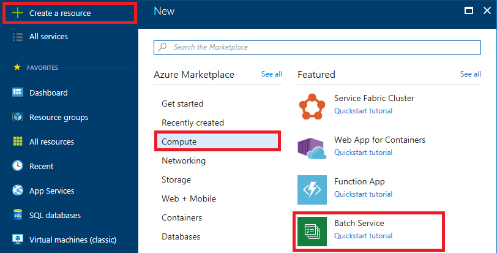

	_Creating a Batch service_

1. In the "New Batch account" blade, give the account a unique name such as "batchservicelab" and make sure a green check mark appears next to it. (You can only use numbers and lowercase letters since the name becomes part of a DNS name.) Select **Create new** under **Resource group** and name the resource group "batch-service-lab". Select the **Location** nearest you, and then click **Select a storage account**.

	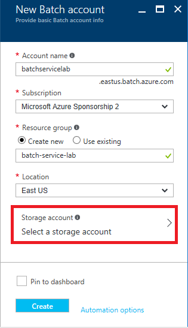

	_Entering Batch service parameters_

1. Click **Create new** to create a new storage account for the Batch service.

	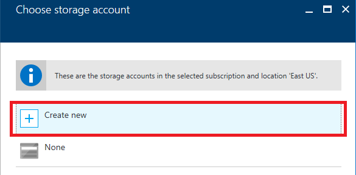

	_Creating a new storage account_

1. Enter a unique name for the storage account and make sure a green check mark appears next to it. Then set **Replication** to **Locally-redundant Storage (LRS)** and click **OK** at the bottom of the blade.

	> Storage account names can be 3 to 24 characters in length and can only contain numbers and lowercase letters. In addition, the name you enter must be unique within Azure; if someone else has chosen the same name, you'll be notified that the name isn't available with a red exclamation mark in the **Name** field.

	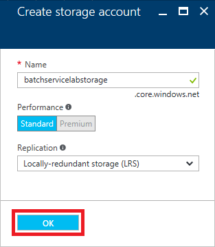

	_Creating a new storage account_

1. Click the **Create** button at the bottom of the "New Batch account" blade to start the deployment

	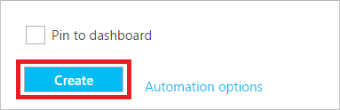

	_Creating a Batch service_

Wait for the deployment to finish, and then proceed to [Exercise 2](#Exercise2) if you are running Windows, [Exercise 3](#Exercise3) if you are running macOS, or [Exercise 4](#Exercise4) if you are running Linux.

<a id="Exercise2"/></a>
## Exercise 2: Set up Batch Shipyard (Windows)

**Note: if at any point in the setup process for this lab the setup will not work, try using a Windows 10 virtual machine on Azure and run the lab from the VM.** Instructions for creating a Windows 10 VM in Azure can be found [here](Windows VM.html).

Batch Shipyard is built on Python. Windows does not have a built in Python client, so one needs to be installed. This is a straight forward process that involves Downloading and installing Python, then using PiPy, the Python package manager to install the dependencies for Python for Batch Shipyard.

1. Visit [https://www.python.org/downloads/](https://www.python.org/downloads/) to download the latest version of Python for Windows. Click on **Download Python 3.X.X** to start the download.

	

1. Once the download completes, launch the installer from the Downloads folder on your computer.

	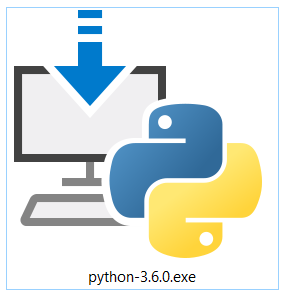

1. Once the Python installer starts, Check the box next to **Add Python 3.x.x to PATH** then click **Install Now**.

	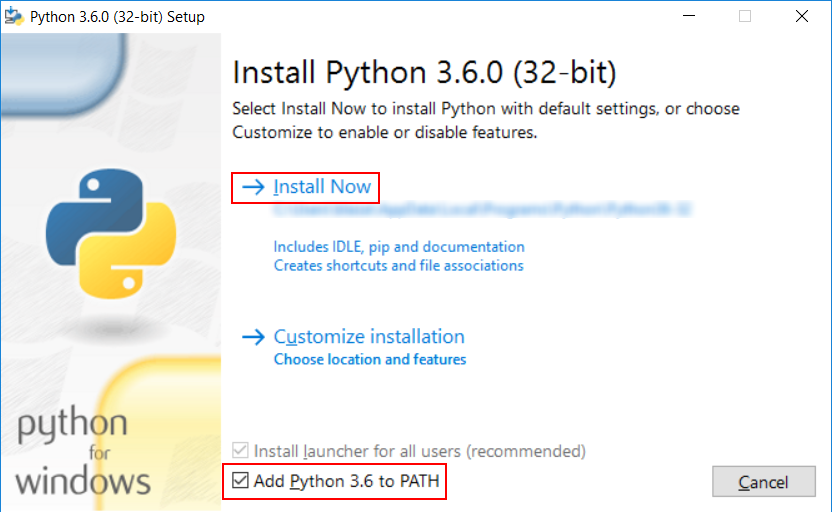

1. After Python installs, the installer will indicate a successful install with Setup was successful. Click **Close** to quit the installer.

	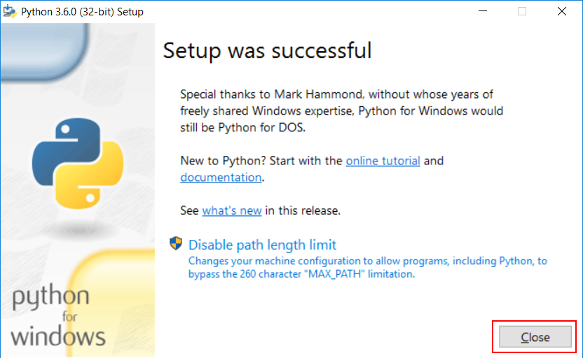

1. Visit [https://github.com/Azure/batch-shipyard/releases](https://github.com/Azure/batch-shipyard/releases) to download the latest version of Batch Shipyard. **Download the Source code (zip)** file.

	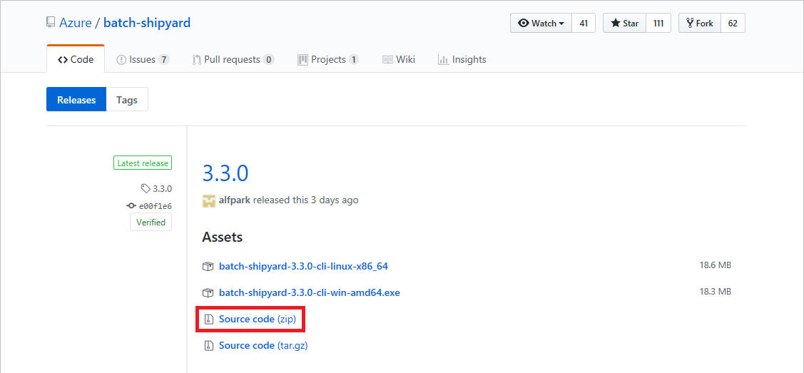

1. Once the download completes, open the zip file (batch-shipyard-2.x.x.zip) in the Downloads folder and, select the **batch-shipyard-2.x.x** folder in the zip file. Right click the files and select **Copy** from the context menu.

	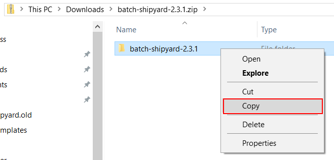

1. On the Desktop, right click and **Paste** the folder to the Desktop.

	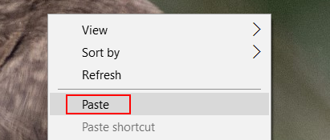

1. Right-click the **batch-shipyard-2.x.x** folder, then select **Rename**.

	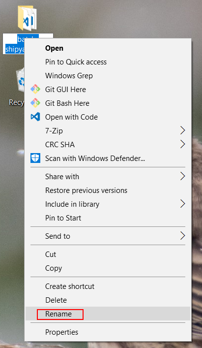

1. Type in **batch-shipyard** into the name field, then press Enter.

1. Python needs a Command Prompt to finish the setup. Press the **Windows Key + R** to open a **Run** dialog, type in "cmd" in the **Open** field, then click **OK**. 

	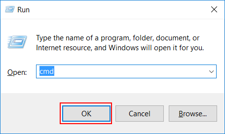

1. Once the Command Prompt opens, use the CD command to change directories to the **batch-shipyard** folder on the Desktop. 

	````
	cd %HOMEPATH%\Desktop\batch-shipyard
	````
1. Use PiPy (pip3) to finish the setup.  This will install the dependencies for Batch Shipyard. Leave the terminal open. The lab will use it in the next exercise.

	````
	pip3 install --upgrade -r requirements.txt
	````
Now **proceed to [Exercise 5](#Exercise5)**. Exercises 3 and 4 are for macOS and Linux users only.

<a id="Exercise3"/></a>
## Exercise 3: Set up Batch Shipyard (macOS)

**Note: if at any point in the setup process for this lab the setup will not work, try using a [Windows 10](./windows-vm.md) virtual machine on Azure and run the lab from the VM.**

MacOS comes with Python preinstalled, but using the preinstalled version of Python with Batch Shipyard is problematic. Batch Shipyard works best with Python 3 installed on a Mac. Python 3 can co-exist with Python 2 without interference on a Mac.

1. Visit [https://www.python.org/downloads/](https://www.python.org/downloads/) to download the latest version of Python for Windows. Click on **Download Python 3.X.X** to start the download.

	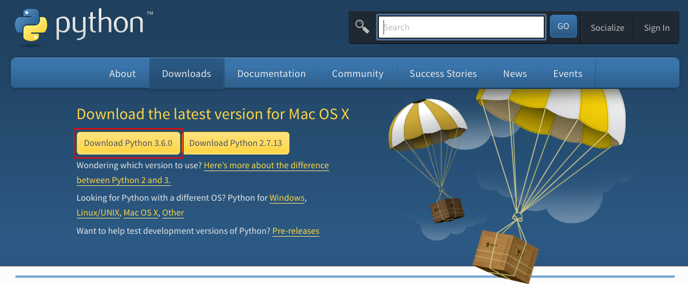

1. Once the download completes, double click on the **python-3.x.x-macosx10.6.pkg** in the **Downloads** folder.

	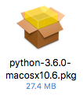

1. Walk through the installer. The package will need elevated permissions to install Python, so it will ask for a password. Once the Installer finishes, click **Close**

	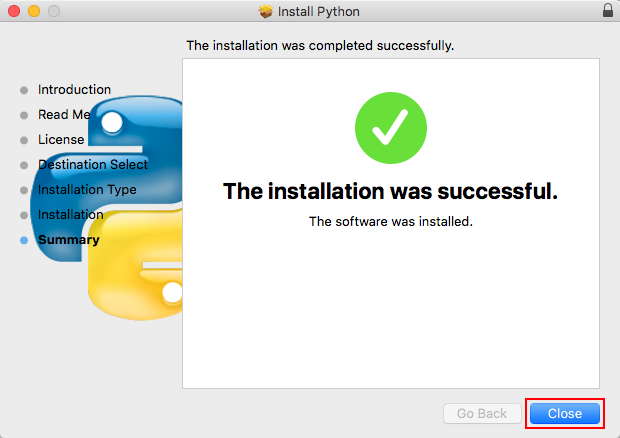

1. Visit [https://github.com/Azure/batch-shipyard/releases](https://github.com/Azure/batch-shipyard/releases) to download the latest version of Batch Shipyard. **Download the Source code (zip)** file. MacOS will automatically unzip the files in the Downloads folder.

	

1. Open the **Downloads** folder in Finder, then click on the **batch-shipyard-2.x.x** folder, then press Enter. Rename the folder **batch-shipyard**.

	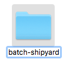

1. To finish the setup, open a **Terminal** session. In Finder, open **Applications**, then **Utilities**, then double click on **Terminal**.

	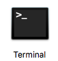

1. In **Terminal**, use the cd command to change directories to the **batch-shipyard** folder.

	````
	cd ~/Downloads/batch-shipyard
	````

1. Finish the setup with PiPy (pip3). This will install the dependencies for Batch Shipyard. Leave the terminal open. The lab will use it in the next exercise.

	````
	pip3 install --upgrade -r requirements.txt
	````

Now **proceed to [Exercise 5](#Exercise5)**. Exercise 4 is for Linux users only.

<a id="Exercise4"/></a>
## Exercise 4: Set up Batch Shipyard (Ubuntu Linux)

**Note: if at any point in the setup process for this lab the setup will not work, try using a [Windows 10](./windows-vm.md) virtual machine on Azure and run the lab from the VM.**

Ubuntu Linux can also run Batch Shipyard. The setup process is slightly different from the MacOS and Windows because it uses only a CLI. 

1. To install Batch Shipyard, launch a Terminal. If you're using a Desktop version of Linux, the Terminal is usually on the Applications menu. It can also be launched by pressing Ctrl + Alt + F1.

1. Once the terminal is started, install python, PiPy and git using apt-get.

	````
	sudo apt-get install python-pip python git
	````

1. Use git to download Batch Shipyard using the clone command. This will create a folder called batch-shipyard and download all the files into the directory.

	````
	git clone https://github.com/Azure/batch-shipyard.git
	````

1. Change to the batch-shipyard folder with the cd command.

	````
	cd batch-shipyard
	````

1. Finish the setup with the included setup script. The script will invoke PiPy and install the dependencies needed for Batch Shipyard to run.

	````
	./install.sh
	````

<a id="Exercise5"/></a>
## Exercise 5: Configure Batch Shipyard

Batch Shipyard uses four different JSON files — **config.json, pool.json,  jobs.json**, and **credentials.json** — to configure the environment. These four files, the Dockerfiles used to define Docker images, their associated files, and a **readme.md** file define a Batch Shipyard "recipe."

Each of the configuration files configures some portion of Batch Shipyard. The **config.json** file contains a set of global configuration settings used by the other files to set up the Batch Shipyard environment. **pool.json** file contains the definitions for the compute pools used to perform batch jobs. **jobs.json** outlines the job definition and the tasks that are a part of that job. **credentials.json** provides the needed keys and passwords to access the Batch Account and the associated Storage Accounts on Azure.

The lab here doesn't go into detail about how to use a Dockerfile, but in short a Dockerfile contains a list of instructions that are used to build Docker images which contain be deployed as containers. The Dockerfile included in the lab is the one used to build the image that is deployed in the lab. For more information about how to use Dockerfiles, check out (some training resource here).

Three of the four JSON files are already configured in the solution recipe. The only one that needs to be changed is **credentials.json**.

1. Open this lab's "solution" folder, and then copy the "recipe" folder from the "solution" folder into the "batch-shipyard" folder created in the previous exercise.

1. Open the copied "recipe" folder. Open the "config" folder in that folder, and then open the file named **credentials.json** in your favorite text editor. There are two sections in the file: "batch" and "storage." The "batch" section contains the settings for the batch account that Batch Shipyard needs to access the instance of Batch Services on Azure. The "storage" section contains the settings Batch Shipyard needs to make changes to the the storage account. 

1. In the Azure Portal, click **Resource groups** in the ribbon on the left, and then click **batch-service-lab** to open that resource group.

	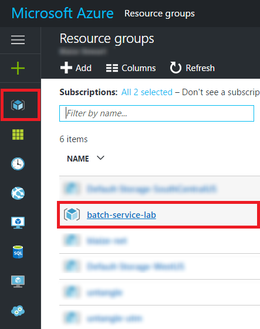

	_Opening the resource group_

1. In the resource group, click the Batch account. Click **Keys** under **Settings**, and then click the **Copy** button next to the **PRIMARY ACCESS KEY** field.

	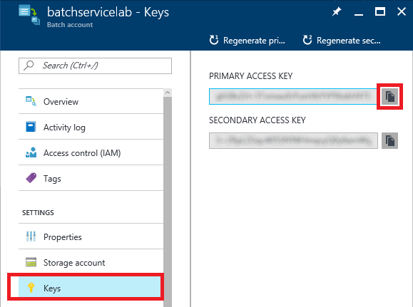

	_Copying the Batch account key_

1. Return to **credentials.json** and paste the key that is on the clipboard into the value for "account_key" in the "batch" section:

	````
	"account_key": "YOUR KEY GOES HERE",
	````

1. Locate the Batch account name at the top of the blade. 

	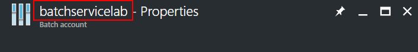

	_The Batch account name_

1. Type the name of the Batch account into the value for "account" in the "batch" section of **credentials.json**.

	````
	"account": "batchservicelab",
	````

1. In the blade for the Batch account, click **Properties**, and then click the **Copy** button next to the **URL** field.

	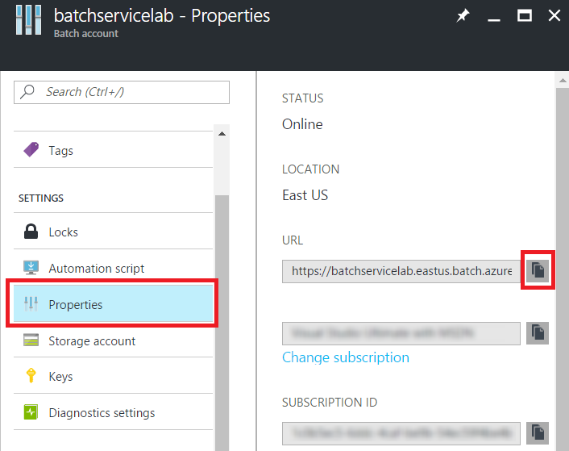

	_Copying the Batch account URL_

1. In **credentials.json**, paste the copied URL into the value for "account_service_url" in the "batch" section:

	````
	"account_service_url": "https://batchservicelab.eastus.batch.azure.com"
	````

1. In the Azure Portal, return to the "batch-service-lab" resource group and click the storage account in that resource group.

	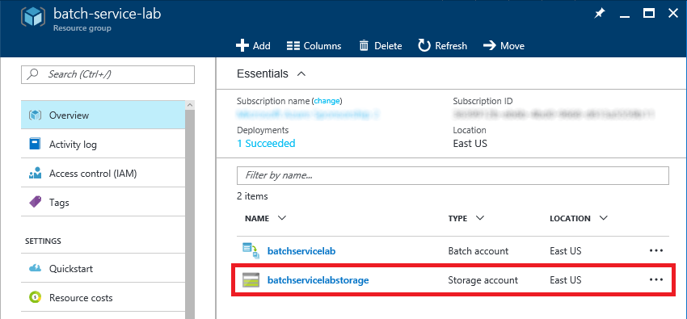

	_Opening the storage account_

1. Click **Access keys**, and then click the **Copy** button next to the **Storage account name** field.

	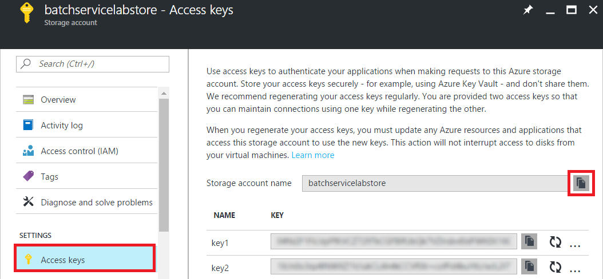

	_Copying the storage account name_

1. In **credentials.json**, paste the storage account name into the value for "account" in the "storage" section:

	````
	"account": "batchservicelabstore",
	````

1. Return to the portal and click the **Copy** button next to the **key1** field.

	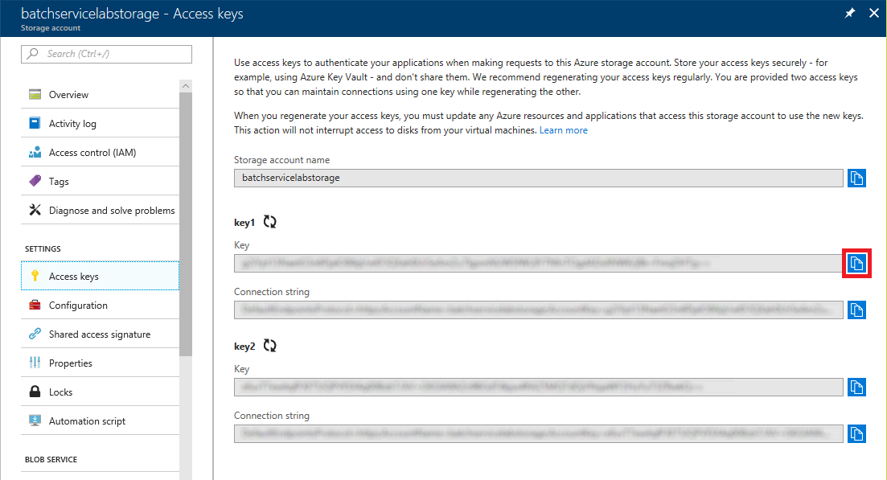

	_Copying the storage account key_

1. In **credentials.json**, paste the key into the value for "account_key" in the "storage" section:

	````
	"account_key": "YOUR KEY GOES HERE",
	````

	The modified file should look something like this:

	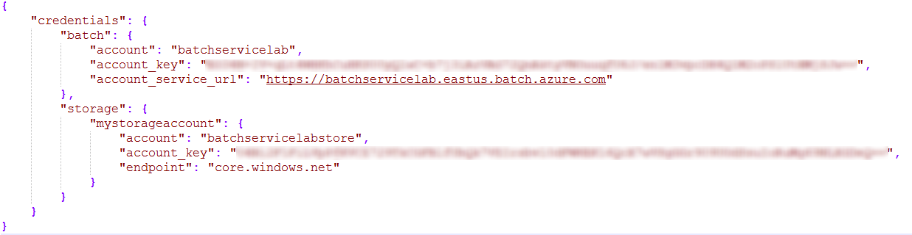

	_Modified credentials.json file_

Save your changes to **credentials.json** before proceeding to the next exercise.

<a id="Exercise6"/></a>
## Exercise 6: Create a pool

Now that **credentials.json** has been set up and the environment variable created, Batch Shipyard is configured to run. Batch Shipyard uses several commands to control pools of Batch Services. The next step is to create a compute pool in the account using Batch Shipyard.

1. In the terminal or Command Prompt window, run one of the following commands based on which operating system you are using:

	**Windows**:
	````
	python shipyard.py pool add --configdir .\recipe\config
	````

	**macOS**:
	````
	python3 shipyard.py pool add --configdir ./recipe/config
	````

	**Linux**:
	````
	python shipyard.py pool add --configdir ./recipe/config
	````

This command will take a while to complete. Batch Shipyard is actually creating virtual machines using Batch Services on Azure, and then provisioning those virtual machines with Docker. Monitor the process in the terminal or Command Prompt window as Azure creates the pool. 

<a id="Exercise7"/></a>
## Exercise 7: Prepare a job

While the pool is being created, this is a good time to prepare the data for the jobs. The lab uses Azure File Storage for data input and output. The configuration files tell Batch Services to mount an Azure file share inside of a container. The container can read data in and then write data back to the file share as output.

1. In the Azure Portal, click **Resource groups** in the ribbon on the left. Select the "batch-service-lab" resource group. Then click the storage account in that resource group.

	

	_Opening the storage account_

1. Click **Files**, and then click **+ File share** in the "File service" blade.

	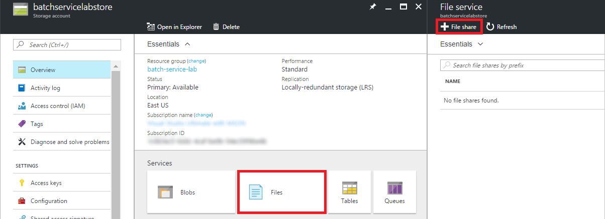

	_Adding a file share_

1. Enter "myfileshare" for the file-share name. Leave **Quota** blank, and then click **Create** at the bottom of the blade.

	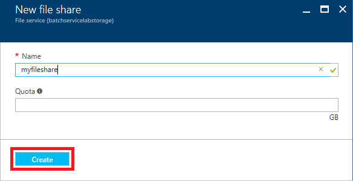

	_Creating a file Share_

1. Once the file share is created, click it.

	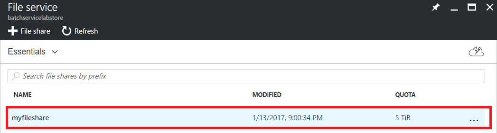

	_Opening the file share_

1. In the blade for the file share, click **+ Add directory**.

	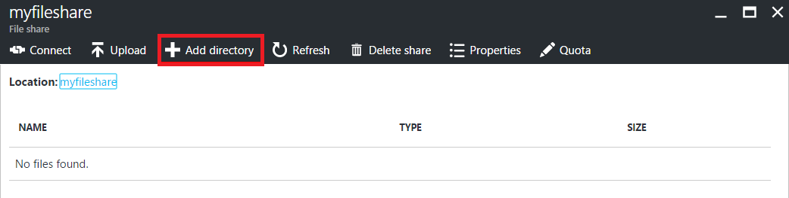

	_Adding a directory_

1. Enter "textfiles" for the directory name, and then click **Create**.

	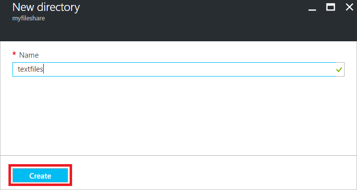

	_Creating a directory_ 

1. Back on the "myfileshare" blade, click the directory that you just created.

	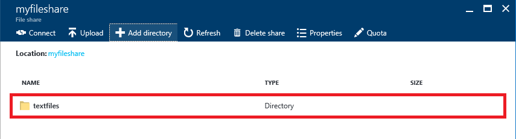

	_Opening the directory_

1. Click **Upload**.

	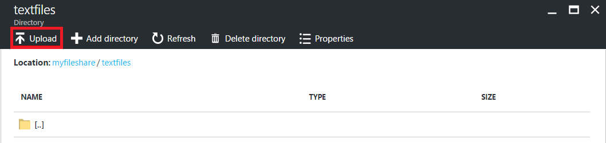

	_Uploading to the directory_

1. In the "Upload files" blade, click the **folder** icon. Select the file named **tale-of-2-cities.txt** in the "solution" folder of this lab, and then click the **Upload** button.

	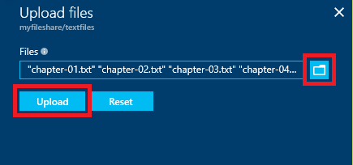

	_Uploading a text file_

The container is designed to handle multiple text files with a .txt extension and text for content. For each text file, the container will generate a corresponding .ogg file in the root folder.

<a id="Exercise8"/></a>
## Exercise 8: Run the job

Now that Batch Shipyard is configured, the pool is created, and the job data is prepared, it's time to run the job. Running the job requires one simple command that will invoke Batch Services based on all the predefined configurations and containers.

1. To run the job, simply execute one of the following commands based on which operating system you are using. The command will create a job if it doesn't already exist in the Batch account, and then it will create a new task for that job. Jobs can be run multiple times without creating new jobs. Batch Shipyard will simply create a new task each time the **jobs add** command is called.

	**Windows**:
	````
	python shipyard.py jobs add --configdir .\recipe\config
	````
	**macOS**:
	````
	python3 shipyard.py jobs add --configdir ./recipe/config
	````

	**Linux**:
	````
	python shipyard.py jobs add --configdir ./recipe/config
	````

1. Click **Jobs** in the menu on the left side of blade, and then click **batch-lab-job**.

	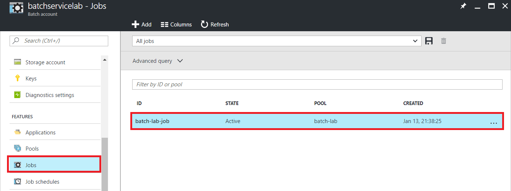

	_Selecting the job_

1. Click **Tasks**. Then click **Refresh** periodically until the job completes with an exit code of 0.

	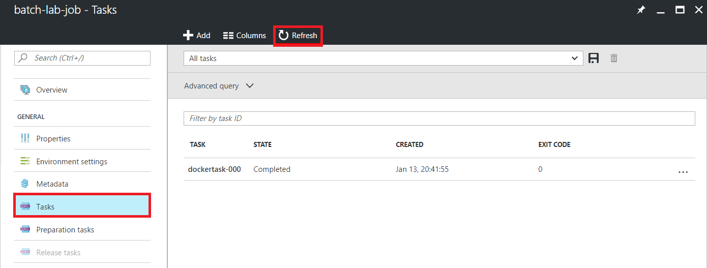

	_Waiting for the job to complete_

Once the job has finished running, the next task is to examine the output that it produced.

<a id="Exercise9"/></a>
## Exercise 9: View the results

The results are now available in the storage account. The output file can be downloaded and played back locally in any media player that supports the .ogg file type.

1. In the Azure Portal, click **Resource groups** in the ribbon on the left. Select the "batch-service-lab" resource group. Then click the storage account in that resource group.

	

	_Opening the storage account_

1. Click **myfileshare**.

	

	_Opening the fileshare_

1. Notice that a new file named **tale-of-2-cities.ogg** has been created. Click the file, and then click **Download** to download the file. This will download the file to the local machine where it can be played back in a media player.

	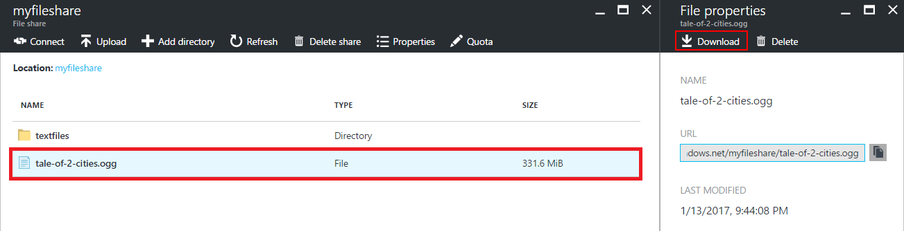

	_Downloading the results_

The .ogg file contains approximately 12 hours of spoken content, which is indicative of the CPU intensiveness of the batch job.

<a id="Exercise10"/></a>
## Exercise 10: Remove the Batch service

In this exercise, you will delete the resource group created in [Exercise 1](#Exercise1) when you created the Batch service. Deleting the resource group deletes everything in it and prevents any further charges from being incurred for it.

1. In the Azure Portal, click **Resource groups** in the ribbon on the left, and then click the ellipsis **(...)** to display the context menu for the "batch-service-lab" resource group. Select **Delete** from the menu.

	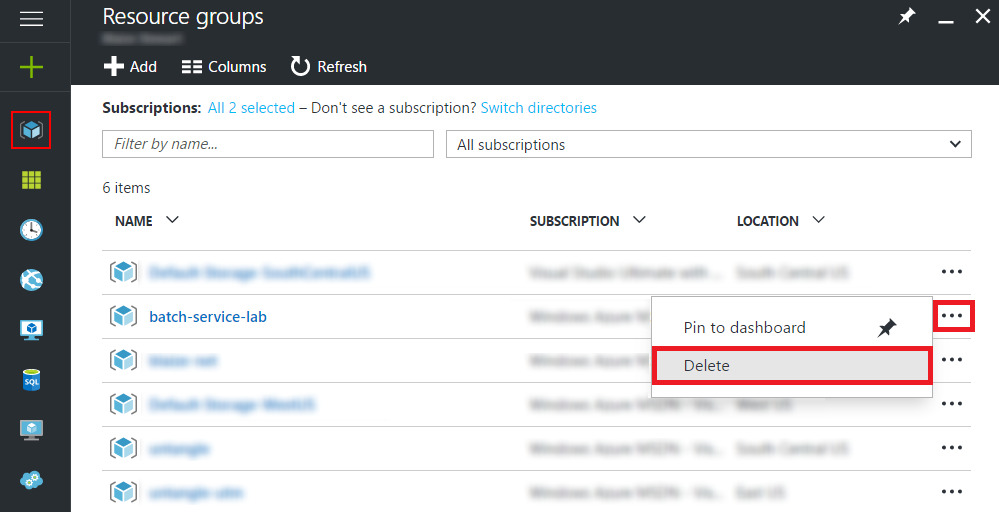

	_Deleting the resource group_

1. For safety, you are required to type in the resource group's name. (Once deleted, a resource group cannot be recovered.) Type the name of the resource group. Then click the **Delete** button to remove all traces of this lab from your account.

After a few minutes, the service and all of its resources will be deleted.

## Summary

This lab provided a hands on demonstration for how to use Batch Services with Batch Shipyard for creating Docker Containers to run batch jobs in the cloud. Batch on Azure though can perform many types on Docker and non-Docker jobs and even leverage some of the high performance N-seres virtual machines that have GPU's for tasks like animation rendering.

---

Copyright 2016 Microsoft Corporation. All rights reserved. Except where otherwise noted, these materials are licensed under the terms of the Apache License, Version 2.0. You may use it according to the license as is most appropriate for your project on a case-by-case basis. The terms of this license can be found in http://www.apache.org/licenses/LICENSE-2.0.
