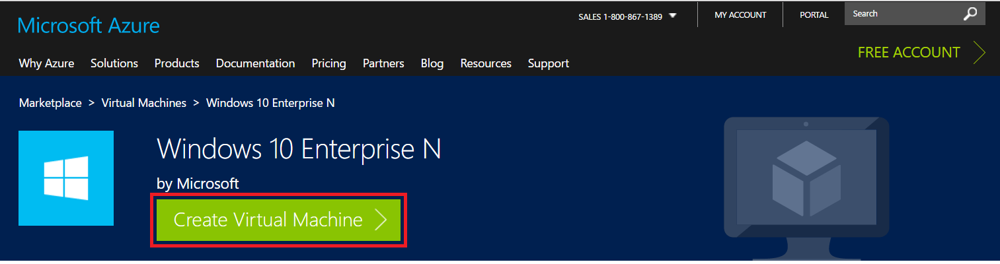
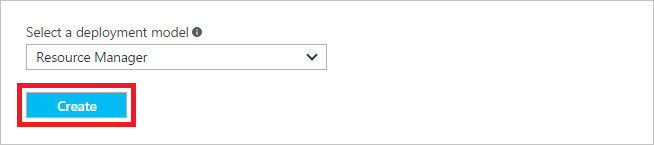
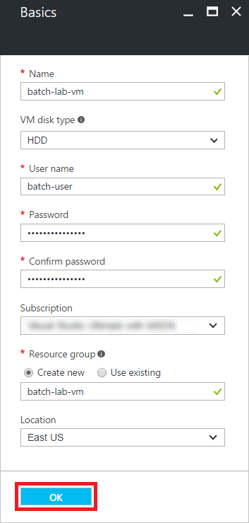
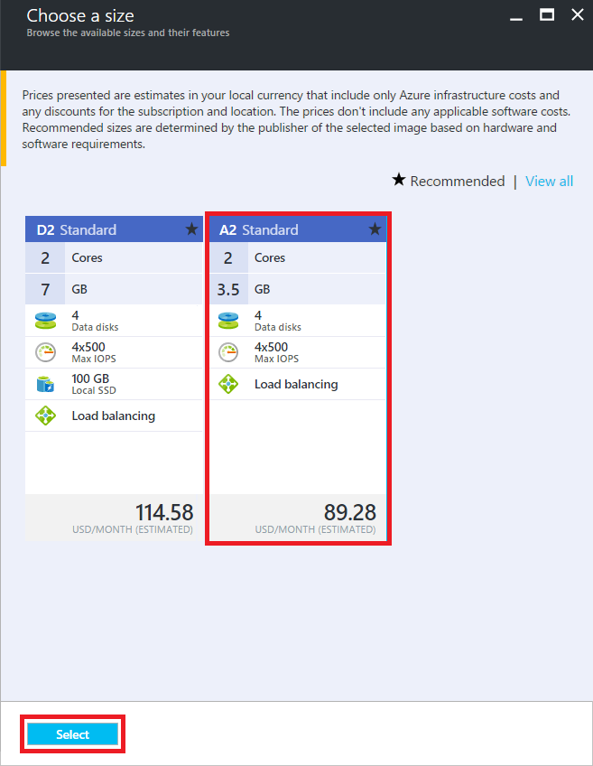
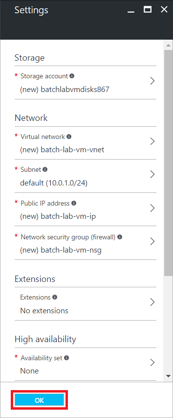
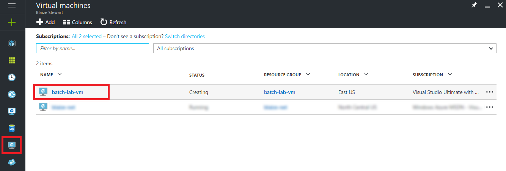
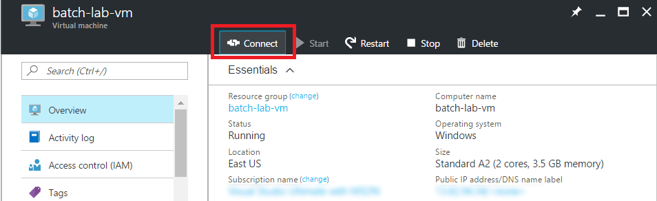
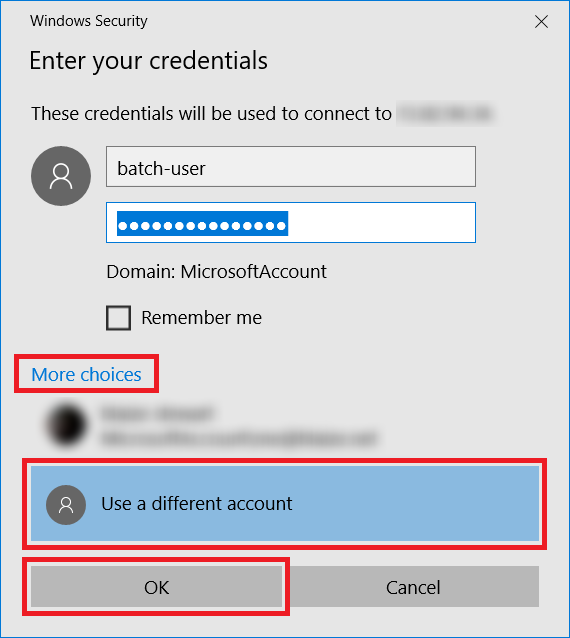

Setting up a Windows 10 VM on Azure
===

1. Visit the [Azure Market Place](https://azure.microsoft.com/en-us/marketplace/partners/microsoft/windows10enterprisen/) and click **Create Virtual Machine**. 
	
	

	_Creating a virtual machine_

1. At the bottom of the "Windows 10 Enterprise N" blade, click **Create**.

	

	_Confirming creation of a virtual machine_

1. In the "Basics" blade, enter "batch-lab-vm" (without quotation marks) for the virtual-machine name. Set **VM disk type** to **HDD**. Enter "batch-user" for the user name and "Batch-user12345" for the password. Select **Create new** under **Resource group** and name the resource group "batch-lab-vm." For **Location**, select the location nearest you. Finally, click **OK**.

	

	_Entering virtual-machine parameters_

1. Click **A2 Standard** to select a machine size, and then click **Select**.

	

	_Choosing a virtual-machine size_

1. Click **OK** in the "Settings" blade to accept the default parameters. Then click **OK** in the "Summary" blade to confirm your settings and begin deployment of the virtual machine.

	

	_Accepting default settings_

1. Click the **Virtual machines** icon in the ribbon on the left, and then click **batch-lab-vm**.

	> The virtual machine may take a few minutes to deploy. If it doesn't show up initially, refresh the page in the browser a few times until it does appear.

	

	_Selecting the VM_

1. In the blade for the VM, click **Connect**. This will download **batch-lab-vm.rdp**. Double-click that file to launch the Remote Desktop Connection client on the local machine.

	

	_Connecting to the VM_

1. In the Remote Desktop Connection client, click **More choices**, and then select **Use a different account**. Enter "batch-user" for the user name and "Batch-user12345" for the password, and then click **OK**.

	

	_Logging in to the VM_

1. If the Remote Desktop Connection client warns of a certificate problem, click **Yes**.

	

1. Wait a few moments for the the connection to be established. Then the lab can be completed on the remote machine on Azure.

