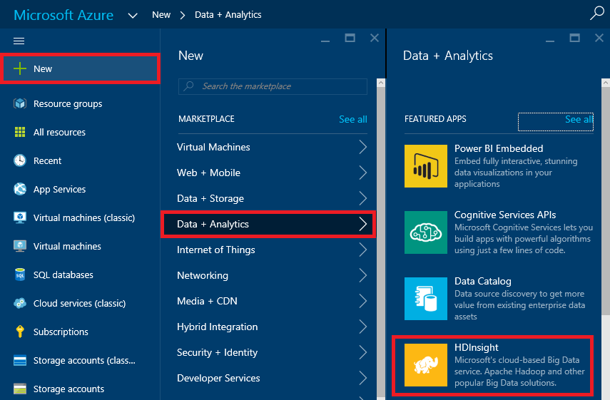
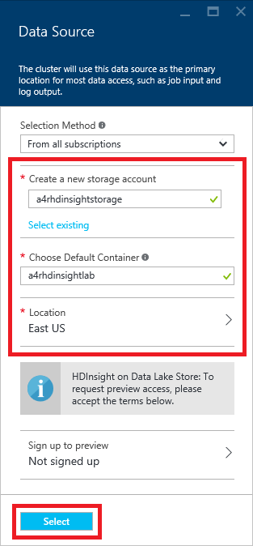

# Processing Big Data with HDInsight Hadoop Clusters #

---

## Overview ##

When you consider that there are more than 20 billion devices connected to the Internet today, most all of them generating data, and then think of the massive amounts of data being produced by Web sites, social networks, and other sources, you begin to understand the true implications of **BIG DATA**. Data is being collected in ever-escalating volumes, at increasingly high velocities, and in a widening variety of formats, and it's being used in increasingly diverse contexts. "Data" used to be something stored in a table in a database, but today it can be a sensor reading, a tweet, a GPS location, or almost anything else. The challenge for information scientists is to make sense of all that data.

A popular tool for analyzing big data is [Apache Hadoop](https://hadoop.apache.org/). Hadoop is "a framework that allows for the distributed processing of large data sets across clusters of computers using simple programming models." It is frequently combined with other open-source frameworks such as [Apache Spark](http://spark.apache.org/), [Apache HBase](http://hbase.apache.org/), and [Apache Storm](https://storm.apache.org/) to increase its capabilities and performance. [Azure HDInsight](http://azure.microsoft.com/en-us/services/hdinsight/) is the Azure implementation of Hadoop, Spark, HBase, and Storm, with other tools such as [Apache Pig](https://pig.apache.org/) and [Apache Hive](https://hive.apache.org/) thrown in to provide a comprehensive and high-performance solution for advanced analytics. HDInsight can spin up Hadoop clusters for you using either Linux or Windows as the underlying operating system, and it integrates with popular business-intelligence tools such as Microsoft Excel and SQL Server Analysis Services.

The purpose of this lab is to acquaint you with the process of deploying and running Hadoop clusters provisioned by HDInsight on Linux VMs. Once your Hadoop cluster is running, most of the operations you perform on it are identical to the ones you would perform on hardware clusters running Hadoop.

### Objectives ###

In this hands-on lab, you will learn how to:

- Create an HDInsight cluster running Linux
- Use Hive on the cluster to query datasets
- Use Python to perform MapReduce operations
- Delete a cluster when it is no longer needed

### Prerequisites ###

The following are required to complete this hands-on lab:

- A Microsoft Azure subscription - [sign up for a free trial](http://aka.ms/WATK-FreeTrial)
- Windows users need to install	[PuTTY](http://www.chiark.greenend.org.uk/~sgtatham/putty/download.html), an open-source SSH client for Windows. Install the latest full package that includes PuTTY and PSCP. The easiest way to do this is to download and run the MSI installer. When you run the installer, note the directory where the tools are installed. The default location is "C:\Program Files (x86)\PuTTY".

---

## Exercises ##

This hands-on lab includes the following exercises:

1. [Exercise 1: Create a resource group for the cluster](#Exercise1)
1. [Exercise 2: Deploy an HDInsight Hadoop cluster on Linux](#Exercise2)
1. [Exercise 3: Analyze an Apache log file with Hive](#Exercise3)
1. [Exercise 4: Use MapReduce to analyze a text file with Python](#Exercise4)
1. [Exercise 5: Delete the HDInsight cluster](#Exercise5)

Estimated time to complete this lab: **60** minutes.

## Exercise 1: Create a resource group for the cluster

In this exercise, you will create a resource group to contain an HDInsight cluster and the Azure resources used by the cluster. Resource groups are a feature of Microsoft Azure that allow you to combine the resources that comprise an application into a unit so entire applications can be deployed, managed, and even deleted with a few simple steps.

1. To get started, open the [Azure Portal](https://portal.azure.com) in your browser. If you are asked to log in, do so using your Microsoft account.

1. In the portal, click **+ NEW**, folllowed by **Management** and then **Resource group**.

    

    _Adding a new resource group_

1. In the "Resource Group" blade, type "HDInsightLabResourceGroup" (without quotation marks) into the **Resource group name** box. Resource-group names do not have to be globally unique as storage-account names do, but they must be unique to a subscription.

	If **Azure Pass** isn't already selected as the subscription, click **Subscription** and select **Azure Pass**. Then click **Resource group location** and choose the location nearest you. Check **Pin to dashboard** so the resource group appears on your dashboard in the Azure Portal. Once you're finished, click the **Create** button at the bottom of the blade.

    

    _Creating a resource group_

After a few moments, the new resource group will appear in a blade in the Azure Portal. That group is currently empty. The next step is to create a cluster to go in it.

## Exercise 2: Deploy an HDInsight Hadoop cluster on Linux

In this exercise, you will deploy an HDInsight cluster on Linux.

1. Click **+ NEW** in the upper-left corner of the portal. Then click **Data + Analytics** followed by **HDInsight**.

    

    _First step in creating an HDInsight cluster_

1. In the "New HDInsight Cluster" blade, you are prompted for information about the cluster you're creating. The first field, **Cluster Name**, specifies the name for the cluster, which must be unique within Azure. Enter a name and verify that a green check mark appears next to it. **Remember the cluster name because you will need it later**.

	> In case someone else in the lab selects the same name, try to make it as unique as possible by including birth dates, initials, and anything else you care to add. The name you entered may be unique right now, but it might NOT be unique a few minutes into the deployment.

    

    _Specifying the cluster name_

1. If **Azure Pass** isn't already selected as the subscription, click **Subscription** and select **Azure Pass** as the subscription the cluster will be billed to.

1. Click **Select Cluster Type**. Then, in the ensuing blade, specify **Hadoop** as the cluster type and **Linux** as the operating system, and select the latest version of Hadoop offered to you. Then select **Standard** as the cluster tier, and finish up by clicking the **Select** button at the bottom of the blade.

    

    _Specifying the cluster type_

1. The next step is to provide a pair of login credentials: one for an admin user on the cluster, and another for remoting into the cluster with SSH.

	Click **Credentials** in the "New HDInsight Cluster" blade to display the "Cluster Credentials" blade. Then enter a cluster-login password.The password must be at least 10 characters in length and contain at least one digit, one non-alphanumeric character, and one uppercase or lowercase letter.

	Next, enter "sshuser" (without quotation marks) into the **SSH Username** box and type an SSH password into the password boxes below. **Remember this password because you will need it later to connect to the cluster**. The same requirements that apply to the cluster-login password apply to the SSH password. You can use the same password for both if you'd like. Before proceeding, make sure **PASSWORD** is selected as the SSH authentication type.

	> For simplicity, you will use password access when using SSH to connect to the cluster. In the real world, you would probably want to use SSH keys instead for added security. Documentation describing how and why for Linux, Unix, and OS X users can be found [here](https://azure.microsoft.com/en-us/documentation/articles/hdinsight-hadoop-linux-use-ssh-unix/), while documentation for Windows users is located [here](https://azure.microsoft.com/en-us/documentation/articles/hdinsight-hadoop-linux-use-ssh-windows/).

	Once you have green check marks in all the boxes, click **Select** at the bottom of the blade.

    

    _Specifying cluster credentials_

1. Click **Data Source** in the "New HDInsight Cluster" blade to display the "Data Source" blade. Here you specify the storage account that will hold the cluster's files, including some sample data files. Rather than use an existing storage account, you will create a new one to keep the cluster and its files separate from everything else.

	Enter a name for the account in the **Create a new storage account** box. Remember that the name must be all lowercase and unique to Azure. To decrease the chances of a deployment failure, make the storage-account name as unique as possible by including birth dates, initials, or other data that's unique to you.

	Enter a container name (the container will be created along with the storage account) into the **Choose Default Container** box. Select the same location for the storage account that you selected for the resource group in Exercise 1. When you're finished, click the **Select** button at the bottom of the blade.

    

    _Specifying the data source_

1. Click **Node Pricing Tiers** to bring up the "Node Pricing Tiers" blade. Here you can configure the number of nodes and the types of virtual machines you want to run. For this exercise, reduce the number of worker nodes to two. Once you have done that, click the **Select** button at the bottom of the blade.

    

    _Node pricing tiers_

1. Click **Resource Group** in the "New HDInsight Cluster" blade and select the resource group that you created in Exercise 1.

1. Now that all the sections are filled out, check the **Pin to dashboard** box and click the **Create** button at the bottom of the "New HDInsight Cluster" blade to start creating the cluster. Deployment can take 15 minutes or more, depending on the load in the data center you selected and other factors.

    

    _Creating the cluster_

1. In the portal dashboard, click the tile representing the resource group you created in Exercise 1 to open a blade for the resource group. Look for the section labeled **Last deployment**. When "Deploying" changes to "Succeeded," your cluster has successfully deployed.

	> Click the browser's Refresh button every few minutes to make sure the deployment state is updated. It doesn't always change to "Succeeded" without a refresh.

	

	_Monitoring the deployment state_

Wait until the deployment has succeeded, and then proceed to the next exercise. If the deployment fails, you'll have to try again. The most likely causes of failure are cluster names and storage-account names that are not unique, so try varying those if the deployment fails the first time.

## Exercise 3: Analyze an Apache log file with Hive

In this exercise, you will use [Apache Hive](https://cwiki.apache.org/confluence/display/Hive?src=sidebar) and the HiveQL query language to query a sample Apache log4j log file installed with the cluster. Hive allows you to project structure onto data that lacks structure. In preparation for using Hive, you need to remote into the cluster. **If you're a Windows user, skip to Step 2**. Otherwise, proceed to Step 1.

1. (Linux and OS X users only) Open a terminal window so you can use the ssh command to establish a connection. You will need the SSH user name and password and the cluster name you provided when you created the cluster. Execute the following command in the terminal window, replacing _username_ with the cluster's SSH user name and _clustername_ with the name of your cluster:

    <pre>
    ssh <i>username</i>@<i>clustername</i>-ssh.azurehdinsight.net
    </pre>

	Enter the SSH password when prompted. **Now skip to Step 4**. Steps 2 and 3 are for Windows users only.

1. (Windows users only) Start PuTTY. In the **Host Name (or IP address)** field, enter _username_@_clustername_-ssh.azurehdinsight.net, substituting your SSH user name and cluster name for _username_ and _clustername_, respectively. Then click the **Open** button to open a connection.

	> Because this is the first time you have connected to the master node, you will be prompted with a warning dialog asking if you trust this host. Since the host is one you created, click **Yes**.

    

    _Establishing a connection with PuTTY_

1. (Windows users only) A PuTTY terminal window will appear and you will be prompted for a password. Enter the SSH password you specified when you created the cluster.

1. In your terminal or PuTTY window, start the Hive command-line interface by running the following command:

    <pre>
    hive
    </pre>

1. At the Hive prompt, enter the following commands to create a new table named "log4jlogs" using sample data stored in a blob that was created along with your cluster. (Tip: You can paste commands into a PuTTY window by right-clicking in the window.)

    <pre>
	DROP TABLE log4jLogs;
	CREATE EXTERNAL TABLE log4jLogs(t1 string, t2 string, t3 string, t4 string, t5 string, t6 string, t7 string) ROW FORMAT DELIMITED FIELDS TERMINATED BY ' ' STORED AS TEXTFILE LOCATION 'wasb:///example/data/';
	SELECT t4 AS sev, COUNT(&#42) AS cnt FROM log4jLogs WHERE t4 = '[ERROR]' GROUP BY t4;
    </pre>

    The **DROP TABLE** command removes any existing table named "log4jLogs." **CREATE EXTERNAL TABLE** creates a new "external" table. External tables store only the table definitions in Hive; the data is left in the original location. **STORED AS TEXTFILE LOCATION** tells Hive that the data is stored in a text file and where the file is located. "wasb" is the protocol prefix; it stands for "Windows Azure Storage Blob." (HDInsight transparently maps HDFS to Azure blob storage.) Finally, **SELECT** counts all the rows in which column t4 contains the value "[ERROR]".

    You will see output similar to the following after the final command is entered:

    <pre>
    Query ID = sshuser_20150901021919_f1135622-b9eb-4e4d-9863-b18310242ce2
    Total jobs = 1
    Launching Job 1 out of 1=

    Status: Running (Executing on YARN cluster with App id application_1441070163242_0003)

    --------------------------------------------------------------------------------
            VERTICES      STATUS  TOTAL  COMPLETED  RUNNING  PENDING  FAILED  KILLED
    --------------------------------------------------------------------------------
    Map 1 ..........   SUCCEEDED      1          1        0        0       0       0
    Reducer 2 ......   SUCCEEDED      1          1        0        0       0       0
    --------------------------------------------------------------------------------
    VERTICES: 02/02  [==========================>>] 100%  ELAPSED TIME: 11.24 s
    --------------------------------------------------------------------------------
    OK
    [ERROR]	3
    Time taken: 15.388 seconds, Fetched: 1 row(s)
    </pre>

    Note that the output contains [ERROR] 3, as there are three rows that contain this value.

1. Execute the following commands to create a new "internal" table named "errorLogs:"

    <pre>
    CREATE TABLE IF NOT EXISTS errorLogs (t1 string, t2 string, t3 string, t4 string, t5 string, t6 string, t7 string) STORED AS ORC;
    INSERT OVERWRITE TABLE errorLogs SELECT t1, t2, t3, t4, t5, t6, t7 FROM log4jLogs WHERE t4 = '[ERROR]';
    </pre>

    **CREATE TABLE IF NOT EXISTS** creates a table if it does not already exist. Because the EXTERNAL keyword is not specified, this is an internal table that is stored in the Hive data warehouse and is managed completely by Hive. Unlike dropping an external table, dropping an internal table deletes the underlying data as well. **STORED AS ORC** says to store the data in Optimized Row Columnar (ORC) format. This is a highly optimized and efficient format for storing Hive data. **INSERT OVERWRITE...SELECT** selects rows from the "log4jLogs" table that contain [ERROR], and then inserts them into the "errorLogs" table.

    You will see output similar to the following after the final command is entered:

    <pre>
    Query ID = sshuser_20150901022828_7ee6a422-f6d6-4b8a-893d-7fbfa129704e
    Total jobs = 1
    Launching Job 1 out of 1
    Tez session was closed. Reopening...
    Session re-established.

    Status: Running (Executing on YARN cluster with App id application_1441070163242_0004)

    --------------------------------------------------------------------------------
            VERTICES      STATUS  TOTAL  COMPLETED  RUNNING  PENDING  FAILED  KILLED
    --------------------------------------------------------------------------------
    Map 1 ..........   SUCCEEDED      1          1        0        0       0       0
    --------------------------------------------------------------------------------
    VERTICES: 01/01  [==========================>>] 100%  ELAPSED TIME: 8.35 s
    --------------------------------------------------------------------------------
    Loading data to table default.errorlogs
    OK
    Time taken: 19.272 seconds
    </pre>

1. The final step is to verify that only rows containing [ERROR] in column t4 were stored in the "errorLogs" table. To do that, use the following command to return all rows from "errorLogs:"

    <pre>
    SELECT * from errorLogs;
    </pre>

    The output will look like this:

    <pre>
    OK
    2012-02-03	18:35:34	SampleClass0	[ERROR]	incorrect	id
    2012-02-03	18:55:54	SampleClass1	[ERROR]	incorrect	id
    2012-02-03	19:25:27	SampleClass4	[ERROR]	incorrect	id
    Time taken: 0.58 seconds, Fetched: 3 row(s)
    </pre>

1. Type "quit" (without quotation marks) at the Hive command to close the Hive session. Leave your SSH session open because you will use it again in the next exercise.

Hive is useful, but executing Hive commands is not all you can do with an HDInsight cluster. In the next exercise, you will learn how to perform MapReduce operations using Python.

## Exercise 4: Use MapReduce to analyze a text file with Python

One of the most important algorithms introduced in the last 15 years is Google's [MapReduce](http://research.google.com/archive/mapreduce.html), which facilitates the processing of very large data sets. MapReduce is a two-stage algorithm that relies on a pair of functions: the Map function, which transforms a set of input data to produce a result, and the Reduce function, which reduces the results of a map to a scalar value. What makes MapReduce so relevant for big data is that operations can be executed in parallel and independent of the data source. The parallelism facilitates handling massive amounts of data, and the data-source independence means you are not locked into a particular data store such as MySQL or Microsoft SQL Server.

HDInsight, with the underlying Hadoop implementation, allows you to write MapReduce functions in Java, Python, C#, and even [Apache Pig](http://pig.apache.org/). In this exercise, you will use Python since it is widely used in the data-processing community. The Python code, which is based on a sample from[ Michael Noll](http://www.michael-noll.com/tutorials/writing-an-hadoop-mapreduce-program-in-python/), reads a text file and counts the frequency of the words in it.

1. Before you start, take a moment to read over the Python code for the mapper you will be using:

    <pre>
    #!/usr/bin/env python

    # Use the sys module
    import sys

    # 'file' in this case is STDIN
    def read_input(file):
        # Split each line into words
        for line in file:
            yield line.split()

    def main(separator='\t'):
        # Read the data using read_input
        data = read_input(sys.stdin)
        # Process each words returned from read_input
        for words in data:
            # Process each word
            for word in words:
                # Write to STDOUT
                print '%s%s%d' % (word, separator, 1)

    if __name__ == "__main__":
        main()
    </pre>

    The mapper reads a file from standard input (STDIN) and outputs each word in the file, followed by a tab character and the value 1, on a separate line.

1. Now take a moment to examine the reducer:

    <pre>
    #!/usr/bin/env python

    # import modules
    from itertools import groupby
    from operator import itemgetter
    import sys

    # 'file' in this case is STDIN
    def read_mapper_output(file, separator='\t'):
        # Go through each line
        for line in file:
            # Strip out the separator character
            yield line.rstrip().split(separator, 1)

    def main(separator='\t'):
        # Read the data using read_mapper_output
        data = read_mapper_output(sys.stdin, separator=separator)
        # Group words and counts into 'group'
        #   Since MapReduce is a distributed process, each word
        #   may have multiple counts. 'group' will have all counts
        #   which can be retrieved using the word as the key.
        for current_word, group in groupby(data, itemgetter(0)):
            try:
                # For each word, pull the count(s) for the word
                #   from 'group' and create a total count
                total_count = sum(int(count) for current_word, count in group)
                # Write to stdout
                print "%s%s%d" % (current_word, separator, total_count)
            except ValueError:
                # Count was not a number, so do nothing
                pass

    if __name__ == "__main__":
        main()
    </pre>

    The reducer reads in "word &lt;tab&gt; 1" from each line, looks up each word in the word groups, and adds the number of instances found to the total number of instances, writing the data to standard output (STDOUT).

1. The two Python scripts containing the mapper and the reducer are provided for you in the lab's "resources" directory, which is in the same directory as the HTML file you're currently reading. The next step is to copy the two files, which are named mapper.py and reducer.py, from the "resources" directory on the local machine to the cluster. **If you're using Windows, skip to Step 6**. Otherwise, proceed to the next step.

1. (OS X and Linux users only) Open a terminal window and navigate to the "resources" directory. 

1. (OS X and Linux users only) Execute the following command to copy mapper.py and reduce.py to the HDInsight cluster. Replace _username_ with the cluster's SSH user name and _clustername_ with the cluster name. When prompted for a password, enter the cluster's SSH password.

    <pre>
    scp &#42.py <i>username</i>@<i>clustername</i>-ssh.azurehdinsight.net:
    </pre>

	**Now skip to Step 7**. Step 6 is for Windows users only.
 
1. (Windows users only) Open a Command Prompt window and navigate to the "resources" directory. Then execute the following command to copy mapper.py and reducer.py to the cluster, replacing _username_ with the cluster's SSH user name and _clustername_ with the cluster name. When prompted for a password, enter the cluster's SSH password. Note that this command assumes you installed PuTTY in the default location. If you installed it somewhere else, modify the path name accordingly.

    <pre>
    "C:\Program Files (x86)\PuTTY\pscp" &#42.py <i>username</i>@<i>clustername</i>-ssh.azurehdinsight.net:
    </pre>

1. Return to the SSH session that you established in the previous exercise. (If you closed the session, or if it timed out, follow the instructions in Exercise 3 to establish a new SSH connection.)

1. To be certain that the Python files contain Linux-style line endings ("/r" rather than "/r/n"), execute the following commands in the terminal or PuTTY window to install and run the dos2unix conversion program:

    <pre>
    sudo apt-get install dos2unix
    dos2unix -k -o *.py
    </pre>

1. Now execute the following command to run the 
2. Hadoop job:

    <pre>
    hadoop jar /usr/hdp/current/hadoop-mapreduce-client/hadoop-streaming.jar -files mapper.py,reducer.py -mapper mapper.py -reducer reducer.py -input wasb:///example/data/gutenberg/davinci.txt -output wasb:///example/wordcountout
    </pre>

    There is a lot going on in that command. Here's a quick synopsis of each part:

    - **hadoop**: Launches the Hadoop program
    - **jar /usr/hdp/current/hadoop-mapreduce-client/hadoop-streaming.jar**: Tells Hadoop you want to run a specific jar (Java ARchive). In this case, it is the program that interfaces Hadoop with the MapReduce code.
    - **-files mapper.py,reducer.py**: Specifies that these files should be copied to all the nodes in the cluster
    - **-mapper mapper.py**: Specifies which file contains the mapper
    - **-reducer reducer.py**: Specifies which file contains the reducer
    - **-input wasb:///example/data/gutenberg/davinci.txt**: Specifies the input file. In this case, it is the file named davinci.txt, which was copied into blob storage when the cluster was created.
    - **-output wasb:///example/wordcountout**: Specifies the output file

    If the command executes successfully, the output will resemble the following:

    <pre>
    packageJobJar: [] [/usr/hdp/2.2.7.1-10/hadoop-mapreduce/hadoop-streaming-2.6.0.2.2.7.1-10.jar] /tmp/streamjob5681672609917350730.jar tmpDir=null
    15/09/04 21:21:42 INFO impl.TimelineClientImpl: Timeline service address: http://headnode0.rn0vf3xrnsiuzm4gijgsmkdzgf.dx.internal.cloudapp.net:8188/ws/v1/timeline/
    15/09/04 21:21:43 INFO client.AHSProxy: Connecting to Application History server at headnode0.rn0vf3xrnsiuzm4gijgsmkdzgf.dx.internal.cloudapp.net/10.0.0.14:10200
    15/09/04 21:21:43 INFO impl.TimelineClientImpl: Timeline service address: http://headnode0.rn0vf3xrnsiuzm4gijgsmkdzgf.dx.internal.cloudapp.net:8188/ws/v1/timeline/
    15/09/04 21:21:43 INFO client.AHSProxy: Connecting to Application History server at headnode0.rn0vf3xrnsiuzm4gijgsmkdzgf.dx.internal.cloudapp.net/10.0.0.14:10200
    15/09/04 21:21:44 INFO client.ConfiguredRMFailoverProxyProvider: Failing over to rm2
    15/09/04 21:21:45 INFO mapred.FileInputFormat: Total input paths to process : 1
    15/09/04 21:21:46 INFO mapreduce.JobSubmitter: number of splits:2
    15/09/04 21:21:46 INFO mapreduce.JobSubmitter: Submitting tokens for job: job_1441381294264_0004
    15/09/04 21:21:47 INFO impl.YarnClientImpl: Submitted application application_1441381294264_0004
    15/09/04 21:21:47 INFO mapreduce.Job: The url to track the job: http://headnode1.rn0vf3xrnsiuzm4gijgsmkdzgf.dx.internal.cloudapp.net:8088/proxy/application_1441381294264_0004/
    15/09/04 21:21:47 INFO mapreduce.Job: Running job: job_1441381294264_0004
    ^[15/09/04 21:21:56 INFO mapreduce.Job: Job job_1441381294264_0004 running in uber mode : false
    15/09/04 21:21:56 INFO mapreduce.Job:  map 0% reduce 0%
    15/09/04 21:22:05 INFO mapreduce.Job:  map 100% reduce 0%
    15/09/04 21:22:13 INFO mapreduce.Job:  map 100% reduce 100%
    15/09/04 21:22:15 INFO mapreduce.Job: Job job_1441381294264_0004 completed successfully
    15/09/04 21:22:16 INFO mapreduce.Job: Counters: 49
    	File System Counters
    		FILE: Number of bytes read=2387804
    		FILE: Number of bytes written=5157441
    		FILE: Number of read operations=0
    		FILE: Number of large read operations=0
    		FILE: Number of write operations=0
    		WASB: Number of bytes read=1484685
    		WASB: Number of bytes written=337623
    		WASB: Number of read operations=0
    		WASB: Number of large read operations=0
    		WASB: Number of write operations=0
    	Job Counters
    		Launched map tasks=2
    		Launched reduce tasks=1
    		Rack-local map tasks=2
    		Total time spent by all maps in occupied slots (ms)=13117
    		Total time spent by all reduces in occupied slots (ms)=5842
    		Total time spent by all map tasks (ms)=13117
    		Total time spent by all reduce tasks (ms)=5842
    		Total vcore-seconds taken by all map tasks=13117
    		Total vcore-seconds taken by all reduce tasks=5842
    		Total megabyte-seconds taken by all map tasks=120886272
    		Total megabyte-seconds taken by all reduce tasks=53839872
    	Map-Reduce Framework
    		Map input records=32118
    		Map output records=251357
    		Map output bytes=1885084
    		Map output materialized bytes=2387810
    		Input split bytes=280
    		Combine input records=0
    		Combine output records=0
    		Reduce input groups=32956
    		Reduce shuffle bytes=2387810
    		Reduce input records=251357
    		Reduce output records=32956
    		Spilled Records=502714
    		Shuffled Maps =2
    		Failed Shuffles=0
    		Merged Map outputs=2
    		GC time elapsed (ms)=20
    		CPU time spent (ms)=9890
    		Physical memory (bytes) snapshot=5183492096
    		Virtual memory (bytes) snapshot=29558329344
    		Total committed heap usage (bytes)=25414336512
    	Shuffle Errors
    		BAD_ID=0
    		CONNECTION=0
    		IO_ERROR=0
    		WRONG_LENGTH=0
    		WRONG_MAP=0
    		WRONG_REDUCE=0
    	File Input Format Counters
    		Bytes Read=1484265
    	File Output Format Counters
    		Bytes Written=337623
    15/09/04 21:22:16 INFO streaming.StreamJob: Output directory: wasb:///example/wordcountout
    </pre>

1. To see the files that Hadoop created, execute the following command:

    <pre>
    hadoop fs -ls /example/wordcountout
    </pre>

    The output will show that two files were created:

    <pre>
    Found 2 items
    -rw-r--r--   1 &lt;ssh user&gt; supergroup          0 2015-09-04 21:22 /example/wordcountout/&#95;SUCCESS
    -rw-r--r--   1 &lt;ssh user&gt; supergroup     337623 2015-09-04 21:22 /example/wordcountout/part-00000
    </pre>

    The &#95;SUCCESS file, which is zero bytes in length, indicates the job was a success. The part-00000 file contains the list of words and their counts. To view that file, use the following command.

    <pre>
    hadoop fs -cat /example/wordcountout/part-00000
    </pre>

    You will see a lot of output showing words and their counts. Here's a small sample:

    <pre>
    yourself	26
    yourself,	3
    yourself.	3
    yourself;	2
    yourselves	2
    yourselves;	1
    youth	9
    youth,	3
    youth--devoted	1
    youth.	2
    youth.]	1
    youth;	1
    youthful	3
    </pre>

    As you can see, mapper.py does not handle words that contain punctuation characters. It is left as an exercise for you to you to consider how you would change the code to strip off extra punctuation marks when harvesting words.

    If you want to run the job again, you will either have to change the output directory specified in the hadoop command, or delete the output directory with the following command:

    <pre>
    hadoop fs -rm -r /example/wordcountout
    </pre>

This exercise showed how to execute streaming MapReduce jobs with HDInsight using a very common programming language, Python. The next and most important step is to delete the HDInsight cluster so you are not billed for it when it is not being used.

## Exercise 5:  Delete the HDInsight cluster

As long as the HDInsight clusters you create exist, you are charged for them. Even when the clusters aren't actively processing data, charges are being incurred. Therefore, it behooves you to shut them down when they're no longer needed. Currently, it is not possible to suspend an HDInsight cluster, so your only option is to delete it.

Thankfully, it is easy to remove an HDInsight cluster. Deleting a resource group deletes everything in that resource group, including HDInsight clusters and accompanying resources. In this exercise, you will delete the HDInsight cluster that you created in Exercise 2.

1. If the resource group containing your HDInsight Spark cluster is not open in the Azure Portal, click **Resource groups** in the ribbon on the left side of the page, and then click the resource group's name. This will open a blade for the resource group.

1. In the blade for the resource group, click the **Delete** button.

    

    _Deleting a resource group_  

1. As a safeguard against accidental deletion, you must type the resource group's name to delete it. Type in the name, and then click the **Delete** button at the bottom of the blade.

    

    _Confirming deletion of a resource group_  

After 10 minutes or so, the cluster and all of its associated resources will be deleted. Billing stops when you click the **Delete** button, so you're not charged for the time required to delete the cluster. Similarly, bulling doesn't start until a cluster is fully and successfully deployed.

## Summary ##

Here is a quick summary of what you learned in this lab:

- HDInsight is Microsoft Azure's implementation of Hadoop, Spark, and supporting big-data tools
- The Azure Portal makes it easy to create and configure HDInsight Hadoop clusters running Windows or Linux
- An HDInsight Hadoop cluster can perform MapReduce operations coded in Python or other languages
- HDInsight clusters should be deleted when they're not being used to avoid unnecessary charges

If you have set up hardware clusters of your own and installed and configured Hadoop on them, you appreciate how easy Azure makes it to deploy Hadoop clusters. The provisioning is done for you, so you can spend your time crunching data rather than troubleshooting hardware and software installs. This is yet another example of how cloud computing is changing the face of data analytics, and just one example of the types of HDInsight clusters that Azure supports.

---

Copyright 2016 Microsoft Corporation. All rights reserved. Except where otherwise noted, these materials are licensed under the terms of the Apache License, Version 2.0. You may use it according to the license as is most appropriate for your project on a case-by-case basis. The terms of this license can be found in http://www.apache.org/licenses/LICENSE-2.0.
