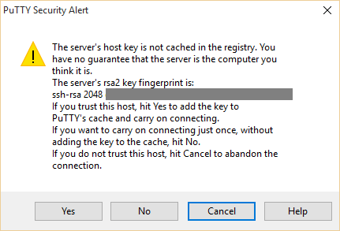
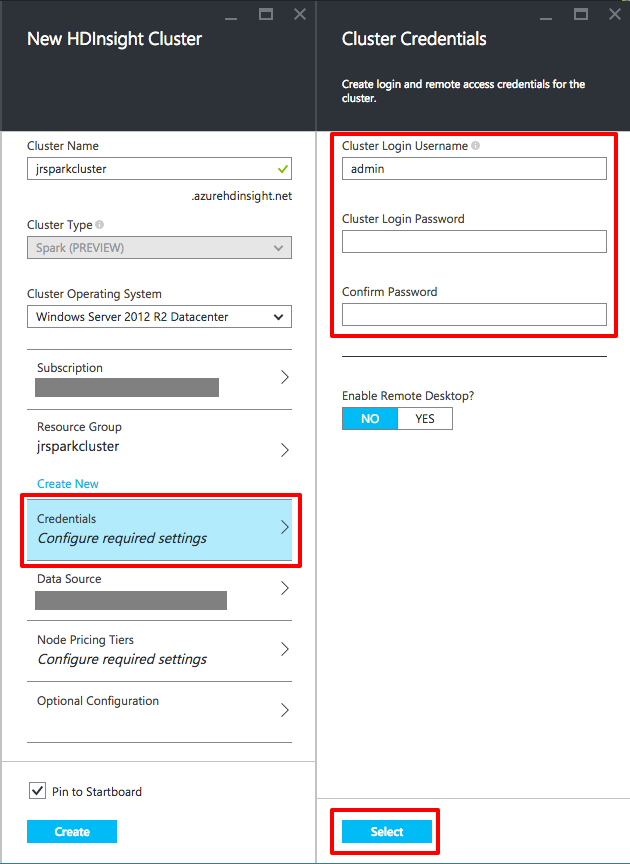
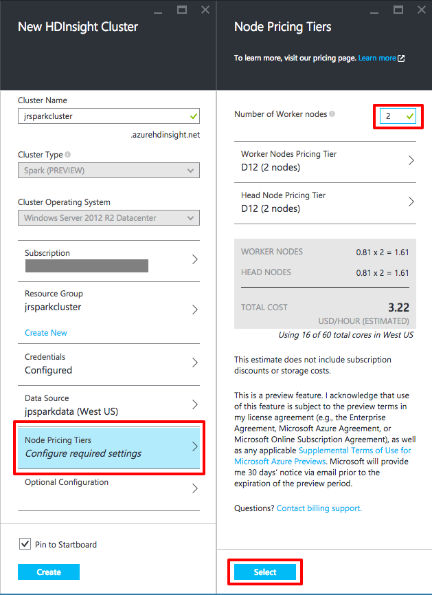
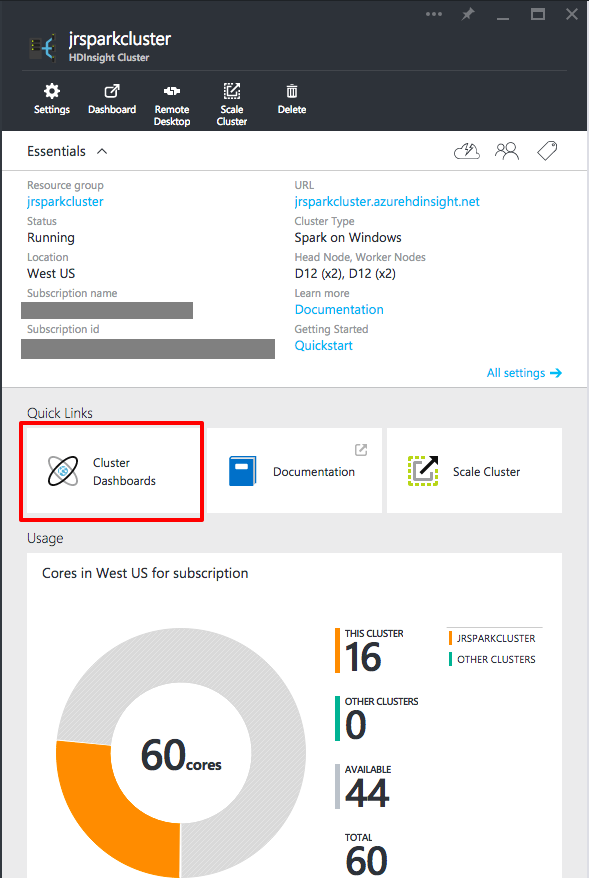
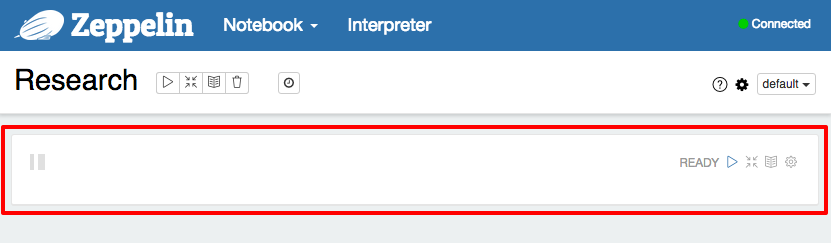
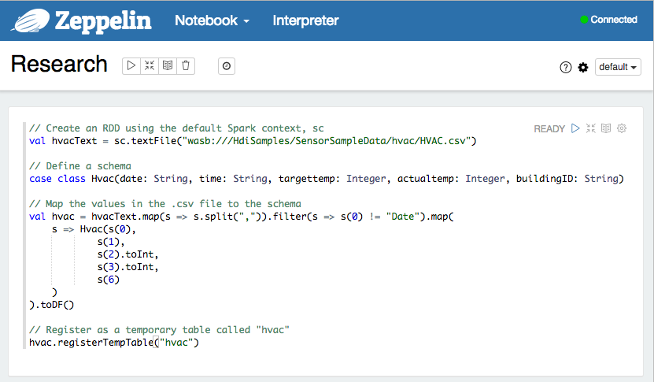
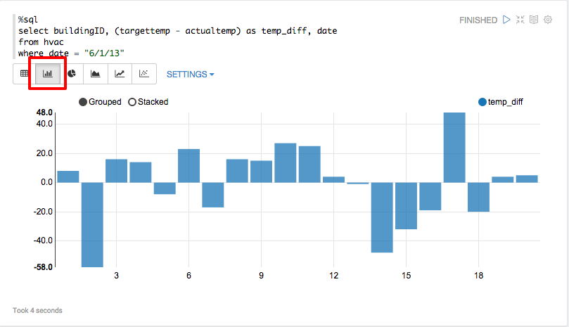
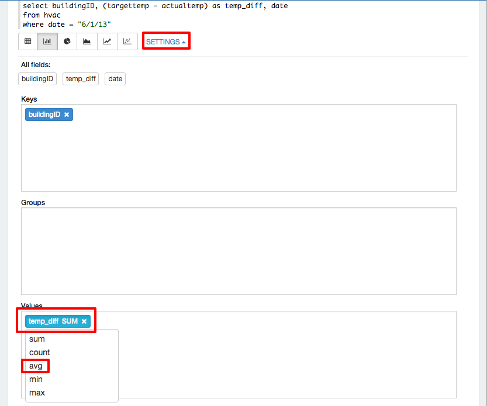

# Hadoop, Spark, and Power BI on Linux #

---

## Overview ##

In 2014, Gartner, Inc., an information research company, predicted that in 2015 there would be [4.9 billion connected "things"](http://www.gartner.com/newsroom/id/2905717) will be in use. When you consider all those "things" are running serious amounts of software producing reams of data, you begin to understand the true implications of **BIG DATA**. All of this data is being collected in collected in ever-escalating volumes, at increasingly high velocities, and for a widening variety of unstructured formats and variable semantic contexts. No longer is data isolated to a SQL table, but can be anything from a sensor reading, to a tweet from Twitter, to GPS data, to almost anything you can imagine. The key to the future is being able to analyze that data.

An increasingly common tool used to analyze big data is [Apache Hadoop](https://hadoop.apache.org/). In a nutshell, Hadoop "...is a framework that allows for the distributed processing of large data sets across clusters of computers using simple programming models." On Azure, HDInsight is the Azure implementation of Hadoop, Spark, HBase, and Storm with tools such as Ambari, Storm, Spark Pig, Hive, and many more, to perform advanced big data analysis. HDInsight can spin up Hadoop clusters for you using either Linux or Windows as the underlying operating system.

Even if you are experienced running your own Hadoop clusters on hardware, this lab is still valuable because it shows you the steps and techniques for running and managing HDInsight on Azure. Once your HDInsight Hadoop cluster is provisioned and running, most operations will be identical to running on you own hardware. The main difference is that the Hadoop implementation in Azure uses Azure blob storage as the Hadoop Distributed File System (HDFS).

This hands on lab exercises are focused on using HDInsight with Hadoop running on Linux clusters. There's another parallel lab that does these same steps using Hadoop Windows clusters.

### Objectives ###

In this hands-on lab, you will learn how to:

- Create a HDInsight Linux cluster and use Hive to submit jobs
- Use Python to perform map and reduce operations on a HDInsight Linux cluster
- Provision Apache Spark on HDInsight and run interactive queries
- Use [Microsoft PowerBI](http://www.powerbi.com/) to create interactive views

### Prerequisites ###

The following are required to complete this hands-on lab:

- A Microsoft Azure subscription - [sign up for a free trial](http://aka.ms/WATK-FreeTrial)
- Completion of the "Azure Storage and Azure CLI" hands-on lab
- For Windows Users:
	- [Putty](http://www.chiark.greenend.org.uk/~sgtatham/putty/download.html). Install the latest full package that includes PuTTY and the PSCP programs. Your best option is to use the install program to get these tools on your system. When you run the installer, note the directory where the tools are installed. You will need that directory to run the tools. The default installation location is "C:\Program Files (x86)\PuTTY".
	- The latest [Azure PowerShell module](http://go.microsoft.com/fwlink/p/?linkid=320376&clcid=0x409). Accept all the defaults when installing.

---

## Exercises ##

This hands-on lab includes the following exercises:

1. [Exercise 1: Using Hadoop with Hive in HDInsight on Linux](#Exercise1)
1. [Exercise 2: Creating and Running Python programs for HDInsight on Linux](#Exercise1)
1. [Exercise 3: Removing your HDInsight Cluster](#Exercise3)
1. [Exercise 4: Creating and Running Spark Cluster with Zeppelin and Jupyter](#Exercise4)

Estimated time to complete this lab: **60** minutes.

## Exercise 1: Using Hadoop with Hive in HDInsight on Linux

This exercise shows the steps to start up and use a HDInsight cluster on Linux. Once the cluster is running you will use [Apache Hive](https://cwiki.apache.org/confluence/display/Hive?src=sidebar) to query sample data supplied with the default Hadoop installation.

The focus here is to demonstrate the basic steps to set up your HDInsight cluster so you will not go into the advanced configuration options. If you have prior experience with Hadoop and want advanced configuration, you can read about those options at [Provision Hadoop clusters in HDInsight.](https://azure.microsoft.com/en-us/documentation/articles/hdinsight-provision-clusters/).

For simplicity, this exercise will use password access when using Secure Shell (SSH) to the Linux cluster. In the real world, you will want to use SSH keys to do the access. For Linux, Unix, and OS X users, the [documentation](https://azure.microsoft.com/en-us/documentation/articles/hdinsight-hadoop-linux-use-ssh-unix/) shows you how to set them up. For Windows users, you can see the steps for your operating system in the [documentation](https://azure.microsoft.com/en-us/documentation/articles/hdinsight-hadoop-linux-use-ssh-windows/).

1. Log into the [Azure Portal](https://portal.azure.com) with your Microsoft ID.

1. To start the creation process, click on the **+NEW** in the upper left hand corner of the Portal. In the **Create** blade, click on the **Data + Analytics** link. That will bring up the **Data + Analytics** blade where click the HDInsight item.

    

    _Starting the Creation of a HDInsight Cluster_

1. In the **New HDInsight Cluster** blade you have to fill out various fields. The first field, **Cluster Name** is the unique Domain Name System (DNS) for the cluster so you can access it from a SSH session. Note that when you move to another field, the name is validated that it is available. Make sure to remember this name as you will need it to log into the HDInsight cluster. In the **Cluster Type** field, the dropdown list lets you pick other types of cluster. For this exercise, select **Hadoop**. The third field is the operating system for all the nodes in the cluster. For this lab, pick **Ubuntu**. The screen below shows the Ubuntu version that may be different than the one you see. The Azure team is always updating base virtual machines. When you do create a specific HDInsight cluster your nodes will not be upgraded unless you upgrade the cluster yourself. The fourth field to fill out is specifying which Azure subscription you want to assign the HDInsight cluster to. If you have multiple subscriptions, pick the appropriate one by clicking on **Subscription** and selecting it.

    

    _The Cluster Name, Type, and Operating System_

1. Resource groups are a fantastic feature of Azure where you can keep everything associated with any kind of Azure deployment organized together. With this grouping you can apply Role-Based Access Security (RBAC) so if multiple people are using the Azure account you can create HDInsight deployments for different people and set them up so the individuals only can see and access their assigned resource. Another advantage of resource groups is that everything in them shares the same lifetime. If you are finished with the experiment you are running in the resource group and no longer need it, you can delete every part of it at once. Before resource groups, to delete the HDInsight cluster you are going to great in this lab, you had to manually field the virtual machines, networks, storage accounts, and so on to remove them. You can read more about resource groups in the [documentation](https://azure.microsoft.com/en-us/documentation/articles/resource-group-overview/). The important point to remember is that when creating anything new in Azure, you want to specifically assign it to a resource group other than the Default.

    In the **Resource Group** part of the **New HDInsight Cluster** blade. click on the **Or Create New** link. That will change the section to ask you for the name of the new resource group. The name you enter must be unique in your subscription, but not across Azure itself. In the edit box now in the section, type in the name of the resource group. As you are typing the portal verifies the name is unique. Look for the green check mark before proceeding.

    

    _Creating a New Resource Group_

1. After specifying the new resource group, the next information to fill out are the credentials. In the **Credentials** section, click on **Configure required settings** to bring up the **Cluster Credentials** blade. You need to set up two credentials sets in this blade. The first is the is for the HDInsight cluster and used for submitting jobs to the cluster and to log into cluster dashboards. The second is for remote access to the cluster itself over the internet. As mentioned in the overview, this hands on lab will use password access over SSH, but for better security on real world clusters, you will want to use public keys. See the links in the overview section on how to set that up.

    In the **Cluster credentials** blade, enter the username and password for the cluster followed by a username and password for the SSH remote access. The passwords must be at least 10 characters in length and contain at least one digit, one non-alphanumeric character, and one upper or lowercase letter. Securely store these two account information as you will need it later in this exercise. When finished and all password check boxes show green checkmarks, click the Select button at the bottom of the blade.

    

    _The Cluster Credentials Blade_

1. Click on the **Data Source** section in the **New HDInsight Cluster** blade. You have the choice to use an existing storage container or create a new one. If you already have your data in blob storage and are creating the HDInsight cluster to access that data, you can supply the access key by clicking on the **Selection Method** dropdown and select **Acccess Key**. When you set up an existing data source, the HDInsight cluster will reside in the same data center as the specified storage account. This is to provide faster access to the data you are processing. When setting up an HDInsight cluster before you have loaded your data, like you are doing in this hands-on lab, you will want to create a new storage account to separate the account from existing data as well as get the storage account created in the new resource group, which you created earlier in this exercise. Click on the **Or Create New** under the **Select storage account** section. Remember, the name you specify must be all lowercase. If you want the default blob container to be different than the default of being named after your Cluster name, you can change that as well. When finished with creating your new storage account in the **Data Source** blade, click the **Select** button on the bottom.

    For nearly all Hadoop file operations, the Azure blob storage implementation will be seamless if you are coming from your own Hadoop clusters. One small difference is that native Hadoop Distributed File System (HDFS) commands, which are platform dependent, such as fschk and dfsadmin, are different when applied to blob storage.

    

    _The Data Source Blade_

1. Click on the **Node Pricing Tiers** section to bring up the **Node Pricing Tiers** blade. Here is where you can configure the number of nodes and the types of virtual machines you want to run. For this exercise the defaults are fine, but you can reduce the number of nodes to two if you would like. Additionally, you can change the types of virtual machines used for worker and head nodes. Obviously selecting higher performing virtual machine types will cost you more money per hour. What is extremely nice about the **Node Pricing Tiers** blade is that you can see exactly how much the setup you are looking at will cost per hour. This gives you total control of how much you spend to perform a particular Hadoop job. Once you have set the number and types of nodes you want, click the select button at the bottom of the blade.

    _The screen shot below shows a total cost calculation valid at the time the screen shot was taken. Your cost may be different. To read more about the current HDInsight prices, read the [HDInsight Pricing](http://azure.microsoft.com/en-us/pricing/details/hdinsight/) page._

    

    _The Node Pricing Tiers_

1. If you are interested, you can look at the Optional Configuration settings for HDInsight Clusters by clicking on the **Optional Configuration** section, but for this hands-on lab, do not change anything. When all sections are filled out click the **Create** button at the bottom of the **New HDInsight Cluster** blade to start creation. Depending on the number of nodes and types of virtual machines you chose for HDInsight cluster, your deployment can take anywhere from 10-20 minutes.

    

    _The Filled Out New HDInsight Cluster Blade_

1. Once the deployment finishes, you can look at the new HDInsight cluster in the portal by selecting **Browse All** and in the **All resources** blade, clicking on your HDInsight cluster. Look for the Hadoop elephant logo.

    

    _Browsing for Your New HDInsight Cluster_

1. (Linux and OS X Users) With the HDInsight cluster ready to process data, you will first have to log into to execute Hive job for this exercise. Open a terminal window so you can run the ssh command to do the connection. You will need the username and password for the SSH user you created earlier. The connection string is in the form &lt;username&gt;@&lt;hdinsight cluster name&gt;-ssh.azurehdinsight.net. Thus if your SSH username was happyuser and your HDInsight cluster was MyResearchCluster, the ssh parameter would be happyuser@MyResearchCluster-ssh.azurehdinsight.net

    Enter the following command in your terminal window replacing the items in brackets with your SSH username and password.

    <pre>
    ssh &lt;username&gt@&lt;hdinsight cluster name&gt-ssh.azurehdinsight.net
    </pre>

1. (Windows Users) If you installed PuTTY with the installer, press the Windows key and type "putty" to start it. If you installed PuTTY by copying the files, use Explorer to find and run putty.exe. In the **Host Name (or IP address)** field enter &lt;username&gt@&lt;hdinsight cluster name&gt-ssh.azurehdinsight.net substituting your SSH username and HDInsight cluster. Click the **Open** button to start the connection.

    <pre>
    &lt;username&gt;@&lt;hdinsight cluster name&gt;-ssh.azurehdinsight.net
    </pre>

    

    _Putty Host Name (or IP address) field_

1. (Windows Users) Because this is the first time you are connecting to the master node, PuTTY will display a warning dialog. Since the virtual machines are ones you created, it is safe to click **Yes**, but you can click **No** if you don't want to cache the RSA2 fingerprint.

    

    _PuTTY Security Alert_

1. (Windows Users) After you click **Yes** or **No**, a console window will appear and you will be prompted to **login as**. Enter the name of the ssh user you created earlier. After pressing the Enter key, type the password of your SSH user followed by the Enter key.

1. If your entered your username and password correctly, you will see something like the following:

    <pre>
    The authenticity of host <hdinsight cluster name>-ssh.azurehdinsight.net (138.91.XXX.XXX)' can't be established.
    RSA key fingerprint is 34:8d:4e:58:6d:d2:ff:db:1b:10:6f:XX:XX:XX:XX:XX.
    Are you sure you want to continue connecting (yes/no)? yes
    Warning: Permanently added '&lthdinsight cluster name&gt-ssh.azurehdinsight.net,138.91.XXX.XXX' (RSA) to the list of known hosts.
    Ubuntu 12.04.5 LTS
    &ltusername&gt@&lthdinsight cluster name&gt-ssh.azurehdinsight.net's password:
    Welcome to Ubuntu 12.04.5 LTS (GNU/Linux 3.13.0-61-generic x86_64)

    Documentation:  https://help.ubuntu.com/
    Get cloud support with Ubuntu Advantage Cloud Guest:
    http://www.ubuntu.com/business/services/cloud

    33 packages can be updated.
    31 updates are security updates.

    Your Hardware Enablement Stack (HWE) is supported until April 2017.

    The programs included with the Ubuntu system are free software;
    the exact distribution terms for each program are described in the
    individual files in /usr/share/doc/*/copyright.

    Ubuntu comes with ABSOLUTELY NO WARRANTY, to the extent permitted by
    applicable law.

    To run a command as administrator (user "root"), use "sudo <command>".
    See "man sudo_root" for details.

    &ltusername&gt@headnode0:~$

    </pre>

1. In your terminal or PuTTY window you need to start the Hive command line interface by typing the following command:

    <pre>
    hive
    </pre>

    It might take a few minutes for hive to initialize, but when you see the **hive>** prompt it is ready for use.

1. Once at the hive prompt, enter the following statements to create a new table named **log4jlogs** by using sample data already available on your cluster.

    <pre>
    DROP TABLE log4jLogs;
    CREATE EXTERNAL TABLE log4jLogs(t1 string, t2 string, t3 string, t4 string, t5 string, t6 string, t7 string)
    ROW FORMAT DELIMITED FIELDS TERMINATED BY ' '
    STORED AS TEXTFILE LOCATION 'wasb:///example/data/';
    SELECT t4 AS sev, COUNT(&#42) AS cnt FROM log4jLogs WHERE t4 = '[ERROR]' GROUP BY t4;
    </pre>

    The DROP TABLE line removes any existing table named log4jLogs if it exists.

    CREATE EXTERNAL TABLE creates a new "external" table in the Hive. External tables store only the table definitions in Hive; the data is left in the original location.

    To tell Hive what format the data is in, the ROW FORMAT says each row is separated by spaces.

    STORED AS TEXTFILE LOCATION ; tells Hive where the data is stored and that it is a text file. The wasb:// is the default file system built into HDInsight and stands for Windows Azure Storage Blob.

    Finally, SELECT counts all the rows where column t4 contains the value [ERROR].

    You will see output like the following when all commands are entered.
    <pre>
    hive&gt DROP TABLE log4jLogs;
    OK
    Time taken: 1.314 seconds
    hive&gt CREATE EXTERNAL TABLE log4jLogs(t1 string, t2 string, t3 string, t4 string, t5 string, t6 string, t7 string)
    hive&gt ROW FORMAT DELIMITED FIELDS TERMINATED BY ' '
    hive&gt STORED AS TEXTFILE LOCATION 'wasb:///example/data/';
    OK
    Time taken: 0.986 seconds
    hive&lt SELECT t4 AS sev, COUNT(&#42) AS cnt FROM log4jLogs WHERE t4 = '[ERROR]' GROUP BY t4;
    Query ID = sshuser_20150901021919_f1135622-b9eb-4e4d-9863-b18310242ce2
    Total jobs = 1
    Launching Job 1 out of 1=

    Status: Running (Executing on YARN cluster with App id application_1441070163242_0003)

    --------------------------------------------------------------------------------
            VERTICES      STATUS  TOTAL  COMPLETED  RUNNING  PENDING  FAILED  KILLED
    --------------------------------------------------------------------------------
    Map 1 ..........   SUCCEEDED      1          1        0        0       0       0
    Reducer 2 ......   SUCCEEDED      1          1        0        0       0       0
    --------------------------------------------------------------------------------
    VERTICES: 02/02  [==========================>>] 100%  ELAPSED TIME: 11.24 s
    --------------------------------------------------------------------------------
    OK
    [ERROR]	3
    Time taken: 15.388 seconds, Fetched: 1 row(s)
    </pre>

    Note that the output contains [ERROR] 3, as there are three rows that contain this value.

1. Execute the following statements to create a new "internal" table named **errorLogs**

    <pre>
    CREATE TABLE IF NOT EXISTS errorLogs (t1 string, t2 string, t3 string, t4 string, t5 string, t6 string, t7 string) STORED AS ORC;
    INSERT OVERWRITE TABLE errorLogs SELECT t1, t2, t3, t4, t5, t6, t7 FROM log4jLogs WHERE t4 = '[ERROR]';
    </pre>

    CREATE TABLE IF NOT EXISTS creates a table if it does not already exist. Because the EXTERNAL keyword is not specified, this is an internal table that is stored in the Hive data warehouse and is managed completely by Hive. Unlike external tables, dropping an internal table deletes the underlying data as well.

    STORED AS ORC says to store the data in Optimized Row Columnar (ORC) format; a highly optimized and efficient format for storing Hive data.

    INSERT OVERWRITE...SELECT selects rows from the log4jLogs table that contain [ERROR], and then inserts the data into the errorLogs table.

    You will see output like the following when all commands are entered.

    <pre>
    hive&gt CREATE TABLE IF NOT EXISTS errorLogs (t1 string, t2 string, t3 string, t4 string, t5 string, t6 string, t7 string) STORED AS ORC;
    OK
    Time taken: 0.755 seconds
    hive&gt INSERT OVERWRITE TABLE errorLogs SELECT t1, t2, t3, t4, t5, t6, t7 FROM log4jLogs WHERE t4 = '[ERROR]';
    Query ID = sshuser_20150901022828_7ee6a422-f6d6-4b8a-893d-7fbfa129704e
    Total jobs = 1
    Launching Job 1 out of 1
    Tez session was closed. Reopening...
    Session re-established.

    Status: Running (Executing on YARN cluster with App id application_1441070163242_0004)

    --------------------------------------------------------------------------------
            VERTICES      STATUS  TOTAL  COMPLETED  RUNNING  PENDING  FAILED  KILLED
    --------------------------------------------------------------------------------
    Map 1 ..........   SUCCEEDED      1          1        0        0       0       0
    --------------------------------------------------------------------------------
    VERTICES: 01/01  [==========================>>] 100%  ELAPSED TIME: 8.35 s
    --------------------------------------------------------------------------------
    Loading data to table default.errorlogs
    OK
    Time taken: 19.272 seconds
    </pre>

1. The final step is to verify only rows containing [ERROR] in column t4 were stored in the **errorLogs** table. To do that, use the following command to return all rows from **errorLogs**

    <pre>
    SELECT * from errorLogs;
    </pre>

    Your output will look like the following:

    <pre>
    hive&gt SELECT * from errorLogs;
    OK
    2012-02-03	18:35:34	SampleClass0	[ERROR]	incorrect	id
    2012-02-03	18:55:54	SampleClass1	[ERROR]	incorrect	id
    2012-02-03	19:25:27	SampleClass4	[ERROR]	incorrect	id
    Time taken: 0.58 seconds, Fetched: 3 row(s)
    </pre>

1. To exit your SSH session, type the exit command in the terminal window or PuTTY console window. Close all terminal or PuTTY windows.

Now that you know how to set up a HDInsight cluster, you can use that cluster to perform more advanced operations. You will next explore how to perform map and reduce operations using Python programs.

## Exercise 2: Creating and Running Python programs for HDInsight on Linux

One of the most important algorithms introduced in the last fifteen years was Google's [MapReduce](http://research.google.com/archive/mapreduce.html) as it is the key to processing large data sets. As dealing with large data is the forte of HDInsight and Hadoop, MapReduce is at the heart of everything you do. In a nutshell, the MapReduce are two functions, the **Map** function is what "transforms" some data into a result. The **Reduce** function reduces the results of a map to a scalar value. A great demonstration of MapReduce comes from an answer from Frank Krueger on the [StackOverflow](http://stackoverflow.com/a/28991) website:

1. Take a bunch of data
1. Perform some kind of transformation that converts every datum to another kind of datum
1. Combine those new data into yet simpler data

Step 2 is Map. Step 3 is Reduce.

For example,

1. Get time between two impulses on a pair of pressure meters on the road
1. Map those times into speeds based upon the distance of the meters
1. Reduce those speeds to an average speed

What makes MapReduce so important is that the different parts can be done in parallel and is independent of the data source. The parallelism allows you to handle massive amounts of data, hence the HDInsight cluster, and the data source independence means you are not locked into a particular data tool such as MySQL or Microsoft's SQL Server.

HDInsight, with the underlying Hadoop implementation, allows you to write MapReduce functions in the traditional Java, Python, C#, and even with [Apache Pig](http://pig.apache.org/). For this exercise you will use Python as it is a very common language used in scientific data processing. Python through its interpreted nature, dynamic typing, and ease of development is a great choice for rapid prototyping and development.

In this exercise, which is based on a sample from[ Michael Noll](http://www.michael-noll.com/tutorials/writing-an-hadoop-mapreduce-program-in-python/), reads in a large text file and counts how often words appear in the input.

1. Before you jump into running the Python programs it would be a good idea to read over the code for the mapper as shown below:

    <pre>
    #!/usr/bin/env python

    # Use the sys module
    import sys

    # 'file' in this case is STDIN
    def read_input(file):
        # Split each line into words
        for line in file:
            yield line.split()

    def main(separator='\t'):
        # Read the data using read_input
        data = read_input(sys.stdin)
        # Process each words returned from read_input
        for words in data:
            # Process each word
            for word in words:
                # Write to STDOUT
                print '%s%s%d' % (word, separator, 1)

    if __name__ == "__main__":
        main()
    </pre>

    The idea behind the mapper is to read a file from standard input (STDIN), and to output each of the words in that file on it's own line with a tab character and the value 1. That prepares the data for the reducer.

1. Read over the reducer below to see how it works.

    <pre>
    #!/usr/bin/env python

    # import modules
    from itertools import groupby
    from operator import itemgetter
    import sys

    # 'file' in this case is STDIN
    def read_mapper_output(file, separator='\t'):
        # Go through each line
        for line in file:
            # Strip out the separator character
            yield line.rstrip().split(separator, 1)

    def main(separator='\t'):
        # Read the data using read_mapper_output
        data = read_mapper_output(sys.stdin, separator=separator)
        # Group words and counts into 'group'
        #   Since MapReduce is a distributed process, each word
        #   may have multiple counts. 'group' will have all counts
        #   which can be retrieved using the word as the key.
        for current_word, group in groupby(data, itemgetter(0)):
            try:
                # For each word, pull the count(s) for the word
                #   from 'group' and create a total count
                total_count = sum(int(count) for current_word, count in group)
                # Write to stdout
                print "%s%s%d" % (current_word, separator, total_count)
            except ValueError:
                # Count was not a number, so do nothing
                pass

    if __name__ == "__main__":
        main()
    </pre>

    The reducer program reads in "word &lt;tab&gt; 1" line, looks up the word in the groups, and adds the number of instances found to the total instances, and writing the data to standard output.

1. (OS X and Linux Users) The two Python scripts are provided for you in the directory called HadoopSource, which is in the same location as this PDF file. You need to get those two files to your HDInsight cluster you created in Exercise 1. Open a Terminal window and change to that directory. For example, if you copied these files to your Documents directory and put them in a directory called A4R, you would issue the following command

    <pre>
    cd ~/Documents/A4R/BigData/Hadoop\ Spark\ and\ PowerBI\ on\ Linux\ HOL /HadoopSource
    </pre>

1. (OS X and Linux Users) Using the **username** and **password** for the SSH account you created earlier, execute the secure copy command to copy the mapper.py and reduce.py files to your HDInsight cluster.

    <pre>
    scp &#42.py &lt;username&gt;@&lthdinsight cluster name&gt-ssh.azurehdinsight.net:
    </pre>

    If the copy worked you will see output like the following.

    <pre>
    $ scp &#42.py &lt;username&gt;@&lt;hdinsight cluster name&gt;-ssh.azurehdinsight.net:
    Ubuntu 12.04.5 LTS
    &lt;username&gt;@&lt;hdinsight cluster name&gt;-ssh.azurehdinsight.net's password:
    mapper.py                                                                     100%  534     0.5KB/s   00:00
    reducer.py                                                                    100% 1184     1.2KB/s   00:00
    </pre>

1. (OS X and Linux Users) To SSH into your HDInsight cluster, enter the following command in your terminal window replacing the items in brackets with your SSH **username** and **password**.

    <pre>
    ssh &lt;username&gt;@&lt;hdinsight cluster name&gt;-ssh.azurehdinsight.net
    </pre>

1. (Windows Users) To SSH into your HDInsight cluster, start the PuTTY application as you in Exercise 1. In the **Host Name (or IP address field).** in the PuTTY user interface, enter the following replacing the items in brackets with your SSH **username** and **password**.

    <pre>
    &lt;username&gt;@&lt;hdinsight cluster name&gt;-ssh.azurehdinsight.net
    </pre>

1. Now that you are logged into your HDInsight cluster, to start your the Hadoop job, enter the following command line. You may want to copy and paste this command line from he PDF as here are many odd characters. OS X and Linux terminals support pasting directly. For Windows users, you can paste copied text into the PuTTY console by right clicking in it.

    <pre>
    hadoop jar /usr/hdp/current/hadoop-mapreduce-client/hadoop-streaming.jar -files mapper.py,reducer.py -mapper mapper.py -reducer reducer.py -input wasb:///example/data/gutenberg/davinci.txt -output wasb:///example/wordcountout
    </pre>

    There is a lot going on in that command line so here's each section of it explained.
    - **hadoop**: The Hadoop program itself
    - **jar /usr/hdp/current/hadoop-mapreduce-client/hadoop-streaming.jar**: tells  Hadoop you want to run a specific jar (Java ARchive). In this case it is the program that interfaces Hadoop with the MapReduce code you want to perform streaming operations
    - **-files mapper.py,reducer.py**: Tells Hadoop that files needed for the MapReduce job and that they should be copied to all nodes in the cluster.
    - **-mapper mapper.py**: Which file is the mapper function.
    - **-reducer reducer.py**: Which file is the reducer function
    - **-input wasb:///example/data/gutenberg/davinci.txt**: The input data coming out of blob storage. In this case, it is using the example text built into Hadoop which is the Gutenberg project's "The Notebooks of Leonardo Da Vinci"
    - **-output wasb:///example/wordcountout**: The blob storage where output will be written.

    If you entered the command line correctly, the output will look like the following.

    <pre>
    packageJobJar: [] [/usr/hdp/2.2.7.1-10/hadoop-mapreduce/hadoop-streaming-2.6.0.2.2.7.1-10.jar] /tmp/streamjob5681672609917350730.jar tmpDir=null
    15/09/04 21:21:42 INFO impl.TimelineClientImpl: Timeline service address: http://headnode0.rn0vf3xrnsiuzm4gijgsmkdzgf.dx.internal.cloudapp.net:8188/ws/v1/timeline/
    15/09/04 21:21:43 INFO client.AHSProxy: Connecting to Application History server at headnode0.rn0vf3xrnsiuzm4gijgsmkdzgf.dx.internal.cloudapp.net/10.0.0.14:10200
    15/09/04 21:21:43 INFO impl.TimelineClientImpl: Timeline service address: http://headnode0.rn0vf3xrnsiuzm4gijgsmkdzgf.dx.internal.cloudapp.net:8188/ws/v1/timeline/
    15/09/04 21:21:43 INFO client.AHSProxy: Connecting to Application History server at headnode0.rn0vf3xrnsiuzm4gijgsmkdzgf.dx.internal.cloudapp.net/10.0.0.14:10200
    15/09/04 21:21:44 INFO client.ConfiguredRMFailoverProxyProvider: Failing over to rm2
    15/09/04 21:21:45 INFO mapred.FileInputFormat: Total input paths to process : 1
    15/09/04 21:21:46 INFO mapreduce.JobSubmitter: number of splits:2
    15/09/04 21:21:46 INFO mapreduce.JobSubmitter: Submitting tokens for job: job_1441381294264_0004
    15/09/04 21:21:47 INFO impl.YarnClientImpl: Submitted application application_1441381294264_0004
    15/09/04 21:21:47 INFO mapreduce.Job: The url to track the job: http://headnode1.rn0vf3xrnsiuzm4gijgsmkdzgf.dx.internal.cloudapp.net:8088/proxy/application_1441381294264_0004/
    15/09/04 21:21:47 INFO mapreduce.Job: Running job: job_1441381294264_0004
    ^[15/09/04 21:21:56 INFO mapreduce.Job: Job job_1441381294264_0004 running in uber mode : false
    15/09/04 21:21:56 INFO mapreduce.Job:  map 0% reduce 0%
    15/09/04 21:22:05 INFO mapreduce.Job:  map 100% reduce 0%
    15/09/04 21:22:13 INFO mapreduce.Job:  map 100% reduce 100%
    15/09/04 21:22:15 INFO mapreduce.Job: Job job_1441381294264_0004 completed successfully
    15/09/04 21:22:16 INFO mapreduce.Job: Counters: 49
    	File System Counters
    		FILE: Number of bytes read=2387804
    		FILE: Number of bytes written=5157441
    		FILE: Number of read operations=0
    		FILE: Number of large read operations=0
    		FILE: Number of write operations=0
    		WASB: Number of bytes read=1484685
    		WASB: Number of bytes written=337623
    		WASB: Number of read operations=0
    		WASB: Number of large read operations=0
    		WASB: Number of write operations=0
    	Job Counters
    		Launched map tasks=2
    		Launched reduce tasks=1
    		Rack-local map tasks=2
    		Total time spent by all maps in occupied slots (ms)=13117
    		Total time spent by all reduces in occupied slots (ms)=5842
    		Total time spent by all map tasks (ms)=13117
    		Total time spent by all reduce tasks (ms)=5842
    		Total vcore-seconds taken by all map tasks=13117
    		Total vcore-seconds taken by all reduce tasks=5842
    		Total megabyte-seconds taken by all map tasks=120886272
    		Total megabyte-seconds taken by all reduce tasks=53839872
    	Map-Reduce Framework
    		Map input records=32118
    		Map output records=251357
    		Map output bytes=1885084
    		Map output materialized bytes=2387810
    		Input split bytes=280
    		Combine input records=0
    		Combine output records=0
    		Reduce input groups=32956
    		Reduce shuffle bytes=2387810
    		Reduce input records=251357
    		Reduce output records=32956
    		Spilled Records=502714
    		Shuffled Maps =2
    		Failed Shuffles=0
    		Merged Map outputs=2
    		GC time elapsed (ms)=20
    		CPU time spent (ms)=9890
    		Physical memory (bytes) snapshot=5183492096
    		Virtual memory (bytes) snapshot=29558329344
    		Total committed heap usage (bytes)=25414336512
    	Shuffle Errors
    		BAD_ID=0
    		CONNECTION=0
    		IO_ERROR=0
    		WRONG_LENGTH=0
    		WRONG_MAP=0
    		WRONG_REDUCE=0
    	File Input Format Counters
    		Bytes Read=1484265
    	File Output Format Counters
    		Bytes Written=337623
    15/09/04 21:22:16 INFO streaming.StreamJob: Output directory: wasb:///example/wordcountout
    </pre>

1. To see the files that Hadoop created after finishing the job, run the following command in your SSH session.

    <pre>
    hadoop fs -ls /example/wordcountout
    </pre>

    The output will show two files created.

    <pre>
    Found 2 items
    -rw-r--r--   1 &lt;ssh user&gt; supergroup          0 2015-09-04 21:22 /example/wordcountout/&#95;SUCCESS
    -rw-r--r--   1 &lt;ssh user&gt; supergroup     337623 2015-09-04 21:22 /example/wordcountout/part-00000
    </pre>

    The &#95;SUCCESS file, which is zero bytes, indicates the job was a success. The part-00000 file contains the list of words and their counts. To look at that file, use the following command.

    <pre>
    hadoop fs -cat /example/wordcountout/part-00000
    </pre>

    You will see a lot of output looking showing words and their counts. A small snipped is below.

    <pre>
    yourself	26
    yourself,	3
    yourself.	3
    yourself;	2
    yourselves	2
    yourselves;	1
    youth	9
    youth,	3
    youth--devoted	1
    youth.	2
    youth.]	1
    youth;	1
    youthful	3
    </pre>

    As you can see the word breaker in mapper.py does not handle words that contain punctuation characters. It might be a good exercise for you to consider how you would change the code to strip off extra punctuation marks when harvesting words.

    If you want to run the job again with a changed mapper.py, you will have to either change the output directory specified in the hadoop command to start processing, or you could delete the output directory with the following command.

    <pre>
    hadoop fs -rm -r /example/wordcountout
    </pre>

This exercise showed how to do streaming Map-Reduce jobs with HDInsight using a very common programming language, Python. You have just scratched the surface of what you can do with HDInsight and it's Hadoop components. Your next step is to turn off the HDInsight cluster so you are not billed for it running when it is not doing any work.

## Exercise 3: Removing your HDInsight Cluster

After you have finished your HDInsight job and have no other work to perform for a long period of time, you will want to shut your HDInsight cluster down. Because it's so cheap to run HDInsight clusters most people only shut them down if they are not going to use it over a week or more period. Fortunately, it is easy to shutdown a HDInsight cluster because as you learned in Exercise 1, resource groups allow you to quickly and easily remove everything associated with that resource group, including HDInsight itself, storage accounts, and so on. You might be thinking that instead of removing a HDInsight cluster, "I want to suspend it."" When this hands-on lab was written, Azure does not support suspending HDInsight clusters. That is a very [common request](http://feedback.azure.com/forums/217335-hdinsight/suggestions/5663773-start-stop-cluster-hdinsight) but with it so easy to spin up a complete cluster, both with the Azure Portal as well as with Azure CLI, the Azure team responsible for HDInsight views deleting as stopping.

1. The first step to remove a HDInsight cluster is to log into the [Azure Portal](https://portal.azure.com).

1. Click the **BROWSE ALL** link on the left hand side of the Portal and in the **Browse** blade, select **Resource groups**.

    

    _Browsing Resource Groups_  

1. In the Resource groups blade, select the resource group you created in Exercise 1.

    

    _Resource Group Blade_  

1. In the individual resource group blade, click the Delete button.

    

    _Individual Resource Group Delete Button_  

1. To actually delete the resource group, you will have to type in the name of the resource group into the **TYPE THE RESOURCE GROUP NAME** field. This ensures you truly want to delete this resource group. After typing the name in, click the now enabled **Delete** button at the bottom of the blade.

    

    _Confirm Delete Blade_  

    After ten or so minutes your HDInsight cluster will be deleted along with all resources associated in the resource group.

With it so easy to create and delete HDInsight clusters there's no stopping you from analyzing tons of data. HDInsight offers much more than Hadoop and it is time to look at using Apache Spark.

## Exercise 4: Creating and Running Spark Cluster with Zeppelin and Jupyter

Hadoop is an excellent tool for big data analysis, but Azure HDInsight is not content with offering you only a single big data analysis tool. For this exercise you are going to work with [Apache Spark](http://spark.apache.org/), a big data analysis tool that supports in-memory processing to boost the performance of big-data analytic applications. Spark excels at ease of use and is built for speed, performing some operations 100 times faster than Hadoop in memory and 10 timees faster on disk. The in-memory computation capabilities are excellent for interactive algorithms in machine learning and graph computations. Like HDInsight's Hadoop implementation, HDInsight Spark is geared to working with your Azure Blob Storage.

In this exercise you are going to spin up an Azure HDInsight Spark cluster and process data in both [Zeppelin](https://zeppelin.incubator.apache.org/) and [Jupyter](https://jupyter.org/) notbooks. Both of these interactive data and scientific computing technologies are built right in with HDInsight and it's Spark clusters. After setting up the HDInsight Spark cluster, you are going to analyze and graph some sample data, which is heating, ventilating,, and air conditioning (HVAC) data for a group of buildings. This will give you an excellent idea how to work with an HDInsight Spark cluster using zeppelin and Jupyter.

1. Log into the [Azure Portal](https://portal.azure.com) with your Microsoft ID.

1. To start the creation process, click on the **+NEW** in the upper left hand corner of the Portal. In the **Create** blade, click on the **Data + Analytics** link. That will bring up the **Data + Analytics** blade where click the HDInsight item.

    

    _Starting the Creation of a HDInsight Cluster_

1. In the **New HDInsight Cluster** blade you have to fill out various fields. The first field, **Cluster Name** is the unique Domain Name System (DNS) for the cluster so you can access it through your web browser. Note that when you move to another field, the name is validated that it is available. Make sure to remember this name as you will need it to log into the HDInsight cluster. In the **Cluster Type** field, the dropdown list lets you pick other types of cluster. For this exercise, select **Spark**. The third field is the operating system for all the nodes in the cluster. At the time this lab was written, HDInsight Spark clusters only run on Windows Server operating systems under the hood. The fourth field to fill out is specifying which Azure subscription you want to assign the HDInsight cluster to. If you have multiple subscriptions, pick the appropriate one by clicking on **Subscription** and selecting it.

    

    _The Spark Cluster Name and Type_

1. Back in [Exercise 1](#Exercise1), you learned that resource groups are a fantastic feature for managing the like-item lifecycle and security in Azure. When creating any new unit of work, such as an HDInsight Spark cluster, you want to always put that unit in its own Resource Group. In the **Resource Group** part of the **New HDInsight Cluster** blade. click on the **Or Create New** link. That will change the section to ask you for the name of the new resource group. The name you enter must be unique in your subscription, but not across Azure itself. In the edit box now in the section, type in the name of the resource group. As you are typing the portal verifies the name is unique. Look for the green check mark before proceeding.

    

    _Creating a New Resource Group_

1. After specifying the new resource group, the next information to fill out are the credentials for accessing the . In the **Credentials** section, click on **Configure required settings** to bring up the **Cluster Credentials** blade. You need to set up one set of credentials for accessing the Spark web interface. In the **Cluster credentials** blade, enter the username and password for the cluster followed by a username and password for the web remote access. The passwords must be at least 10 characters in length and contain at least one digit, one non-alphanumeric character, and one upper or lowercase letter. Securely store this account information as you will need it later in this exercise. When finished and all password check boxes show green checkmarks, click the Select button at the bottom of the blade. While it is not required for this exercise, if you wanted to access the Spark cluster directly through Remote Desktop, the Windows operating system way to access remote machines, you could enable that account in this blade.

    

    _The Spark Cluster Credentials Blade_

1. Click on the **Data Source** section in the **New HDInsight Cluster** blade. As you saw in [Exercise 1](#Exercise1) you have the choice to use an existing blob storage account or create a new one when creating HDInsight clusters. For this exercise you will want to create a new storage account. Click on the **Or Create New** under the **Select storage account** section. Remember, the name you specify must be all lowercase. If you want the default blob container to be different than the default of being named after your Cluster name, you can change that as well. When finished with creating your new storage account in the **Data Source** blade, click the **Select** button on the bottom.

    For nearly all Hadoop file operations, the Azure blob storage implementation will be seamless if you are coming from your own Hadoop clusters. One small difference is that native Hadoop Distributed File System (HDFS) commands, which are platform dependent, such as fschk and dfsadmin, are different when applied to blob storage.

    

    _The Spark Cluster Source Blade_

1. Click on the **Node Pricing Tiers** section to bring up the **Node Pricing Tiers** blade. Here is where you can configure the number of nodes and the types of virtual machines you want to run. For this exercise you can set the number of Worker nodes to 2. Like [Exercise 1](#Exercise1), you have total control over the size and number of nodes so you can find the right balance between the amount of processing you need and the cost of the cluster. After changing the number of nodes, click **Select** at the bottom of the blade.

    _The screen shot below shows a total cost calculation valid at the time the screen shot was taken, and that HDInsight Spark clusters are in public preview. Your cost may be different and the preview may be over. To read more about the current HDInsight prices, read the [HDInsight Pricing](http://azure.microsoft.com/en-us/pricing/details/hdinsight/) page._

    

_The Spark Cluster Node Pricing Tiers_

1. The last section of the **New HDInsight Cluster** is the **Optional Configuration** blade, but for this exercise you do not need to change anything. Feel free to look at what you can configure if you are interested. When all sections of the **New HDInsight Cluster** blade are filled out click the **Create** button at the bottom of the **New HDInsight Cluster** blade to start creation. Depending on the number of nodes and types of virtual machines you chose for HDInsight cluster, your deployment can take anywhere from 5-10 minutes.

    

    _The Filled Out New HDInsight Cluster Blade for a Spark Cluster_

1. When your new HDInsight Spark cluster is created, either click on the box pinned to your Portal home page, or search for it in the **Browse All** button. When you have your HDInsight Spark cluster blade active, click on the Cluster Dashboards buttons under hte **Quick Links** section.

	

	_The Spark Cluster Dashboards Button_

1. In the **Cluster Dashboards** blade, click on the **Zeppelin Notebook** button.

	

	_The Zeppelin Notebook Button_

1. Clicking on the Zeppelin button will bring up a new browser tab, or window depending on which browser you use, and you will be prompted for the user name and password. Enter the **user name** and **password** you specified when creating the HDInsight Spark cluster.

	_Note that your login prompt may look different depending on the browser you are using._
	

	_Login Prompt for the Zeppelin Notebook_

1. When you log into an HDInsight Spark cluster, you will need to perform multiple logins so the gateway and proxy servers in Spark get initialized with your user name and password. The initial page you see when logging in shows the steps. For **Step 1**, click on the link in parenthesis. This will open another tab or window in your browser and prompt you to enter your cluster account **user name** and **password** again. As explained in the initial page, you will see a 502 web server error after logging in. Once you have logged in you can close this tab, or page.

	

	_Zeppelin Notebook Step 1 Login Instructions_

1. Back in the initial login page, click on the link labeled **Zeppelin portal** in Step 2. Again, you will be prompted for the cluster account **user name** and **password** on another browser tab, or window.

	

	_Zeppelin Notebook Step 2 Login Instructions_

1. Whenever you want to use Zeppelin, make sure to check the upper right hand corner that the green light is showing **Connected**. If not, go through the initial two login instructions again.

	

	_Correctly Connected to Zeppelin_

1. With the login to Zeppelin successful, you will want to create a new Notebook by clicking on the **Create new note** link. That will create a new Zeppelin note named "Note XXXXXXXXX" (where the X's are random characters). Click on the new Note created link to open the note.

	

	_Correctly Connected to Zeppelin_

1. Once in the new note, click on the Note name and change it to something appropriate like Research or another name you want. To commit the name, press the Entery key.

	

	_Renaming the New Zeppelin Notebook_

1. The first step to working with the HVAC data is to get it loaded into a temporary table in the HDInsight Spark cluster. The sample data you are going to use is provided by Microsoft in an associated storage account for the cluster, \HdiSamples\SensorSampleData\hvac. Below is the sample code you will need to copy so in the next step you can paste it into your Zepellin notebook.

	<pre>
	// Create an RDD using the default Spark context, sc
	val hvacText = sc.textFile("wasb:///HdiSamples/SensorSampleData/hvac/HVAC.csv")

	// Define a schema
	case class Hvac(date: String, time: String, targettemp: Integer, actualtemp: Integer, buildingID: String)

	// Map the values in the .csv file to the schema
	val hvac = hvacText.map(s => s.split(",")).filter(s => s(0) != "Date").map(
	    s => Hvac(s(0),
	            s(1),
	            s(2).toInt,
	            s(3).toInt,
	            s(6)
	    )
	).toDF()

	// Register as a temporary table called "hvac"
	hvac.registerTempTable("hvac")
	</pre>

1. In a Zepellin notebook, you work in paragraphs. In the screen shot below, the empty paragraph is shown. Paste the above code into that paragraph.

	

	_The Empty Zeppelin Paragraph_

	If the you cannot place the cursor into the paragraph and type, that means the paragraph or notebook is set to read only, which can accidentally happen. To enable editing, click the arrow button next to the paragraph so it looks like the arrows are pointing in to the center.

	

	_Setting a Paragraph to Edit Mode_

	After you paste in the code, it will look like the following.

	

	_The Pasted in Code_

1. With the code pasted, you want to run it to get the data imported into your HDInsight Spark cluster. To run the paragraph, either press the SHIFT+ENTER key combination, or select run from the paragraph options.

	

	_The Zeppelin Paragraph Run Button_

1. The **READY** text will turn to **PENDING** and the paragraph executing code will gray out. The run is complete when the text for the paragrah turns to **FINISHED**. Additionally, a new paragraph will appear in the notebook. If you would like, you can give a title to the paragraph by clicking the **Settings** button in the paragraph options and choosing **Show title**. If you do change the title, remember to press Enter to complete the change.

	

	_A Finished Run and the Zeppellin Settings Button_

1. With the data in your HDInsight Spark cluster, you can start running Spark SQL statements on the hvac table. The first line of the code tells Spark to use the built in Spark SQL interpreter. You can see the default interpreters by clicking on the **Interpreter** link at the top of the page. Copy the following code to the clipboard and paste it into the new paragraph on your notebook. Once pasted, click the **Run** button for the paragraph or use the SHIFT+ENTER corresponding keystroke.

	<pre>
	%sql
	select buildingID, (targettemp - actualtemp) as temp_diff, date
	from hvac
	where date = "6/1/13"
	</pre>

1. The Spark SQL script created a three column table, with the Building ID, the temperature difference, and the data. The default output is the table itself. What makes Zeppellin wonderful is how you can easily work with the data in an interactive way. Clicking on the bar graph icon will graph the data. The default graphing sums up the temperature differences in each building. This is why building 2 shows a -58.0 difference.

	

	_The Default Bar Graph_

1. A much better graph would be one that shows the average temperature difference between the target and actual temperature for each building. Click on the **Settings** link to expand the display to show you the Keys, Groups, and Values boxes. In the Values box, click on the temp_diff text and change from SUM to AVG to convert to an average.

	

	_Changing the Settings to Report Average Temperature Difference_

	After collapsing the settings, the graph will show the average differences. It sure looks like there's a problem in building 14!

	

	_The Average Temperature Difference by Building Graph_

1. Spark paired with a Zeppelin notebook is an outstanding interactive way to explore your big data issues. For example, Spark SQL allows you to use variables in the query. In the code below, it defines a variable, **Temp**, in the query. When you run the query, you will see an edit box on the screen where you can enter the temperature you would like for the maximum value. Copy this code and past it into the new paragraph in your notebook. Click the **Run** button on the paragraph to execute the code.

	<pre>
	%sql
	select buildingID, date, targettemp, (targettemp - actualtemp) as temp_diff
	from hvac
	where targettemp > "${Temp}" 	
	</pre>

	

	_Ready to Enter the Temperature Variable_

1. In the Temp field, enter 65 so your query will return all the temperatures greater than 65 degrees. Press the ENTER key to have Zeppelin process the query. The default in any Spark SQL query is to return the raw data. Click on the bar graph button under the Temp entry field. The initial graph uses the first field as the key, and the sum of the second field as the value. In this case that is the Building ID and the sum of the dates.

	

	_Initial Query Graph_

1. To make this graph more usable, click on the Settings button, and set the **buildingID** field as the key, grouped by the **targettemp** field, and the average of the temp-diff field as the values. You can click on the fields in the **All fields** area and drag them down to the appropriate box. The graph at the bottom will update on each change. When you get all the settings changed, you will see that the HVAC systems are running below the target temperature on cool days and above the target temperature on warmer days.

	

	_Controlling the Graph Settings_

In this exercise you got to see how easy it is to work with an HDInsight Spark cluster using Zeppelin notebooks to do interactive analysis. These are excellent ways to start exploring new datasets and perform quick analysis to get an idea what a dataset has in them. For more indepth analysis, it is time to turn to Jupyter python notebooks.

---
Copyright 2015 Microsoft Corporation. All rights reserved. Except where otherwise noted, these materials are licensed under the terms of the Apache License, Version 2.0. You may use it according to the license as is most appropriate for your project on a case-by-case basis. The terms of this license can be found in http://www.apache.org/licenses/LICENSE-2.0.
