
# Hadoop on Linux #

---

## Overview ##

In 2014, Gartner, Inc., a leading information research company, predicted that in 2015 there would be [4.9 billion connected "things"](http://www.gartner.com/newsroom/id/2905717) in use. When you consider that all those "things" are running serious amounts of software producing equally serious amounts of data, you begin to understand the true implications of **BIG DATA**. Data is being collected in ever-escalating volumes, at increasingly high velocities, and in a widening variety of formats, and it's being used in increasingly diverse semantic contexts. "Data" used to be something stored in a table in a SQL database, but today it can be a sensor reading, a tweet from Twitter, a GPS location, or almost anything else you can imagine. The challenge for information scientists is to make sense of that data.

An increasingly popular tool for analyzing big data is [Apache Hadoop](https://hadoop.apache.org/). In a nutshell, Hadoop "...is a framework that allows for the distributed processing of large data sets across clusters of computers using simple programming models." Hadoop is frequently combined with other open-source frameworks such as [Apache Spark](http://spark.apache.org/), [Apache HBase](http://hbase.apache.org/), and [Apache Storm](https://storm.apache.org/) to increase its capabilities and performance. [Azure HDInsight](http://azure.microsoft.com/en-us/services/hdinsight/) is the Azure implementation of Hadoop, Spark, HBase, and Storm, with tools such as Ambari, Storm, Spark Pig, and Hive thrown in to provide a comprehensive and high-performance solution for advanced big-data analytics. HDInsight can spin up Hadoop clusters for you using either Linux or Windows as the underlying operating system, and it integrates with popular business-intelligence tools such as Microsoft Excel, SQL Server Analysis Services, and SQL Server Reporting Services.

Even if you are experienced running your own hardware Hadoop clusters, you will find this lab valuable because it acquaints you with the process of running and managing Hadoop clusters provisioned by HDInsight. Once your HDInsight Hadoop cluster is running, most of the operations you perform on it are identical to the ones you would perform on you own hardware. The primary difference is that Azure's Hadoop implementation uses Azure blob storage as backing for the Hadoop Distributed File System (HDFS).

This hands-on lab focuses on using HDInsight with Hadoop running on Linux clusters.

### Objectives ###

In this hands-on lab, you will learn how to:

- Create an HDInsight Linux cluster and use Hive to submit jobs
- Use Python to perform map and reduce operations on an HDInsight Linux cluster

### Prerequisites ###

The following are required to complete this hands-on lab:

- A Microsoft Azure subscription - [sign up for a free trial](http://aka.ms/WATK-FreeTrial)
- Completion of the "Azure Storage and Azure CLI" hands-on lab
- For Windows Users:
	- [Putty](http://www.chiark.greenend.org.uk/~sgtatham/putty/download.html). Install the latest full package that includes PuTTY and the PSCP programs. Your best option is to use the install program to get these tools on your system. When you run the installer, note the directory where the tools are installed. You will need that directory to run the tools. The default installation location is "C:\Program Files (x86)\PuTTY".
	- The latest [Azure PowerShell module](http://go.microsoft.com/fwlink/p/?linkid=320376&clcid=0x409). Accept all the defaults when installing.

---

## Exercises ##

This hands-on lab includes the following exercises:

1. [Exercise 1: Using Hadoop with Hive in HDInsight on Linux](#Exercise1)
1. [Exercise 2: Creating and running Python programs for HDInsight on Linux](#Exercise1)
1. [Exercise 3: Removing your HDInsight cluster](#Exercise3)

Estimated time to complete this lab: **60** minutes.

## Exercise 1: Using Hadoop with Hive in HDInsight on Linux

This exercise walks you through the steps required to start up and use an HDInsight cluster on Linux. Once the cluster is provisioned and running, you will use [Apache Hive](https://cwiki.apache.org/confluence/display/Hive?src=sidebar) to query a set of sample data supplied with the default Hadoop installation.

The goal is to demonstrate the basic steps required to set up an HDInsight cluster so you will have no need for advanced configuration options. If you have prior experience with Hadoop and want to learn more about advanced configuration options, you can read about them at [Provision Hadoop clusters in HDInsight.](https://azure.microsoft.com/en-us/documentation/articles/hdinsight-provision-clusters/).

For simplicity, this exercise will use password access when using Secure Shell (SSH) to the Linux cluster. In the real world, you will probably want to use SSH keys for access. For Linux, Unix, and OS X users, the [documentation](https://azure.microsoft.com/en-us/documentation/articles/hdinsight-hadoop-linux-use-ssh-unix/) shows you how to set them up. For Windows users, consult the documentation [here](https://azure.microsoft.com/en-us/documentation/articles/hdinsight-hadoop-linux-use-ssh-windows/).

1. Log into the [Azure Portal](https://portal.azure.com) with your Microsoft ID.

1. To start the creation process, click **+ NEW** in the upper-left hand corner. In the **New** blade, click **Data + Analytics**. This will bring up the "Data + Analytics" blade. Click **HDInsight** in that blade.

    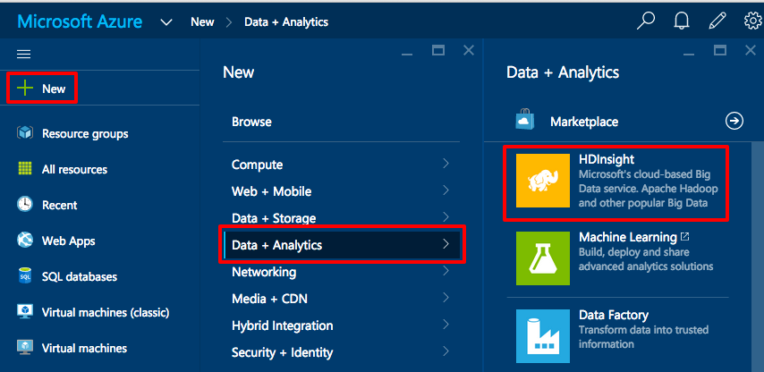

    _First step in creating an HDInsight cluster_

1. In the **New HDInsight Cluster** blade, you are required to fill out various fields. The first one, **Cluster Name**, specifies the unique Domain Name System (DNS) name for the cluster so you can access it from an SSH session. When you move to another field, the name is validated and you're notified if the name isn't available. Remember this name, because you will need it to log in to the HDInsight cluster.

	The drop-down list in the **Cluster Type** field specifies the type of cluster to create. For this exercise, select **Hadoop**.

	The **Cluster Operating System** field specifies the operating system used on all the nodes in the cluster. Select **Ubuntu**. Note that the Ubuntu version shown in the screen shot below might not be available because the Azure team is constantly updating base virtual machines. Also be aware that once you create an HDInsight cluster, its nodes won't be upgraded to newer operating systems unless you upgrade them yourself.

	The **Subscription** field specifies which Azure subscription charges for the HDInsight cluster should be directed to. If there are multiple subscriptions associated with your account, pick the one you want to charge to by clicking on **Subscription** and selecting it.

    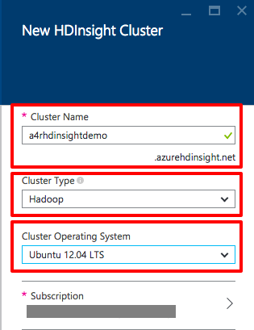

    _Specifying the cluster's name, type, and operating system_

1. Resource groups are a fantastic feature of Azure. They allow you to keep everything associated with an Azure deployment organized into a single cohesive unit. With each grouping, you can apply Role-Based Access Security (RBAC) to prevent multiple people using the same account from accessing other people's resources. Another advantage of resource groups is that the resources inside them share the same lifetime. When you're finished with an experiment, you can delete the resource group and thereby delete all the resources inside it. Before resource groups were introduced, deleting an HDInsight cluster was a tedious process that required you to individually delete the virtual machines, networks, storage accounts, and other resources that comprised it. You can read more about resource groups in the [documentation](https://azure.microsoft.com/en-us/documentation/articles/resource-group-overview/). The important point to remember is that when you create anything new in Azure, it's generally advisable to assign it to a resource group other than the default.

    In the resource-group section of the "New HDInsight Cluster" blade, click **Create New**. Then enter a name for the new resource group. The name you enter must be unique to your subscription, but it doesn't have to be unique across Azure. As you type, the portal verifies that the name is unique. Look for the green check mark before proceeding.

    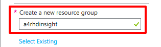

    _Creating a new resource group_

1. After specifying the new resource group, the next step is to provide a pair of login credentials. In the "Credentials" section, click **Configure required settings** to bring up the "Cluster Credentials" blade. You need to enter two sets of credentials. The first is for the HDInsight cluster and is used to submit jobs to the cluster as well as to log in to cluster dashboards. The second is for remote access to the cluster via the Internet. As mentioned in the introduction to this exercise, this hands-on lab uses password access over SSH, but for strengthened security on real-world clusters, you will want to use public keys instead.

    In the "Cluster Credentials" blade, enter a user name and password for the cluster, followed by a user name and password for remote access. The passwords must be at least 10 characters in length and contain at least one digit, one non-alphanumeric character, and one uppercase or lowercase letter. Save these user names and passwords in a secure location, because you will need them later in this exercise. When you are finished, confirm that all the password boxes show green check marks, and then click the **Select** button at the bottom of the blade.

    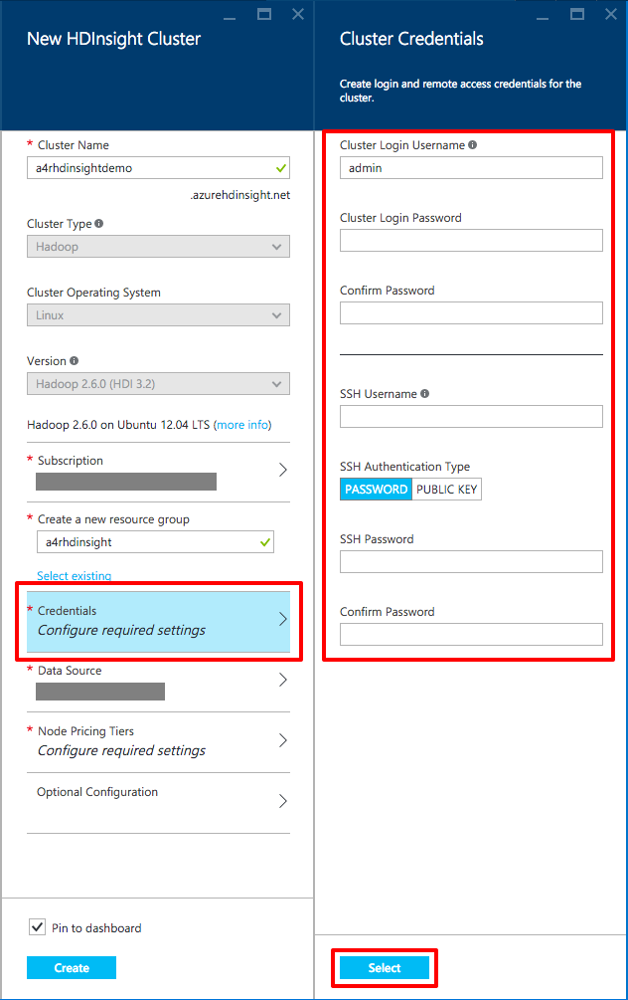

    _The Cluster Credentials Blade_

1. Click the "Data Source" section of the **New HDInsight Cluster** blade. You can use an existing storage account as the data source by selecting **Access key** under **Selection method**. When you use an existing data source, the HDInsight cluster will reside in the same data center as the specified storage account to provide faster access to the data you are processing. When setting up an HDInsight cluster whose data isn't already loaded into blob storage, which is the case in this hands-on lab, you will want to create a new storage account to separate the account from existing data as well as to place the storage account in the resource group you created earlier in this exercise.

	Enter a name for the account in the **Create a new storage account** box. Remember that the name you specify must be all lowercase. If you want the default blob container to be different than the one created from your cluster name, you can change that as well. When you're finished, click the **Select** button at the bottom of the blade.

    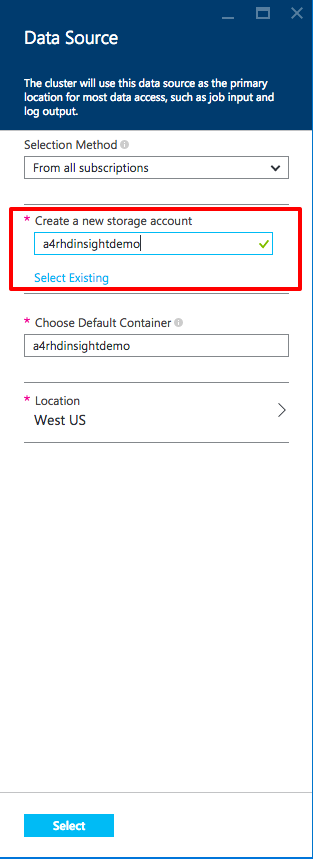

    _The Data Source Blade_

    For nearly all Hadoop file operations, the Azure blob storage implementation will be seamless if you are coming from your own Hadoop clusters. One small difference is that native Hadoop Distributed File System (HDFS) commands that are platform-dependent — commands such as fschk and dfsadmin — are different when applied to blob storage.

1. Click **Node Pricing Tiers** to bring up the "Node Pricing Tiers" blade. Here you can configure the number of nodes and the types of virtual machines you want to run. For this exercise, reduce the number of nodes to two. Additionally, you can change the types of virtual machines used for worker nodes and head nodes. Obviously, selecting higher-performance virtual machines will cost you more per hour. At the bottom of the blade, you can see exactly how much the setup you are considering will cost per hour. Once you have set the number and types of nodes you want, click the **Select** button at the bottom.

    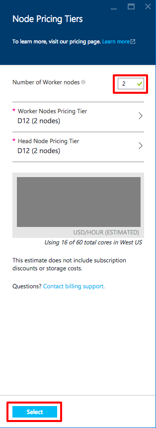

    _Node pricing tiers_

1. If you're interested, you can view additional configuration settings for HDInsight clusters by clicking **Optional Configuration**, but for this lab, do not change anything. Now that all the sections are filled out, click the **Create** button at the bottom of the "New HDInsight Cluster" blade to start the process of creating the cluster. Depending on the number of nodes and types of virtual machines you chose, deployment can take anywhere from 10 to 20 minutes.

    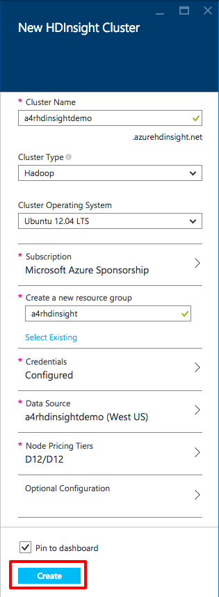

    _Creating the new cluster_

1. You can view the state of new HDInsight cluster in the portal by selecting **Resource groups** in the left hand navigation bar, and in the **Resource groups** blade, clicking on the resource group you created as part of this exercise.

    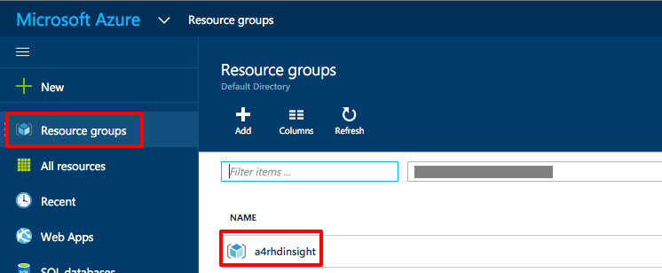

    _Browsing for the new HDInsight resource group_

	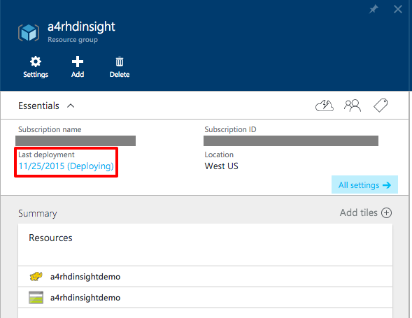

	_The cluster is still in the Deploying state_

	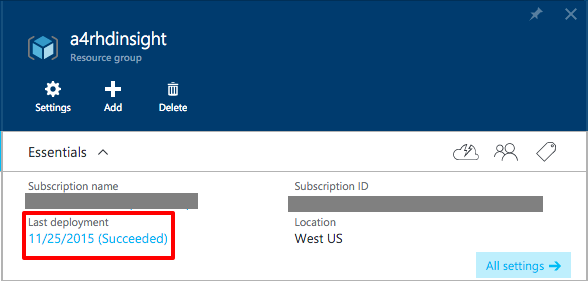

	_The deployment succeeded_

1. With the HDInsight cluster now ready to go, you need to log in and execute a Hive job to prepare the cluster. **If you're a Windows user, skip to Step 12**. Otherwise, proceed to the next step.

1. (Linux OS X Users) Open a terminal window so you can use the ssh command to establish a connection. You will need the user name and password for the SSH user you created earlier. Execute the following command in the terminal window, replacing _username_ with your username and hdinisghtclustername with the name of your HDInsight cluster.

    <pre>
    ssh <i>username</i>@<i>hdinsightclustername</i>-ssh.azurehdinsight.net
    </pre>

	**Now skip to Step 16**. Steps 12 through 15 are for Windows users only.

1. (Windows Users) If you installed PuTTY with the installer, press the Windows key and type "putty" to start it. If you installed PuTTY by copying files, use Explorer to find and run putty.exe. In the **Host Name (or IP address)** field, enter _username_@_hdinsightclustername_-ssh.azurehdinsight.net, substituting your SSH username and HDInsight cluster name for _username_ and _hdinsightclustername_, respectively. Then click the **Open** button to open a connection.

    <pre>
    <i>username</i>@<i>hdinsightclustername</i>-ssh.azurehdinsight.net
    </pre>

    

    _Establishing a connection with PuTTY_

1. (Windows Users) Because this is the first time you are connecting to the master node, PuTTY will display a warning dialog. Since the virtual machines are ones you created, it is safe to click **Yes**, but you can click **No** if you don't want to cache the RSA2 fingerprint.

    

    _PuTTY security alert_

1. (Windows Users) After you click **Yes** or **No**, a console window will appear and you will be prompted to **login as**. Enter the name of the SSH user you created earlier. Press the Enter key, and then type your SSH password and press Enter key again.

1. (Windows Users) If your entered your user name and password correctly, you will see something like the following:

    <pre>
    The authenticity of host <i>hdinsightclustername</i>-ssh.azurehdinsight.net (138.91.XXX.XXX)' can't be established.
    RSA key fingerprint is 34:8d:4e:58:6d:d2:ff:db:1b:10:6f:XX:XX:XX:XX:XX.
    Are you sure you want to continue connecting (yes/no)? yes
    Warning: Permanently added '<i>hdinsightclustername</i>-ssh.azurehdinsight.net,138.91.XXX.XXX' (RSA) to the list of known hosts.
    Ubuntu 12.04.5 LTS
    <i>username</i>@<i>hdinsightclustername</i>-ssh.azurehdinsight.net's password:
    Welcome to Ubuntu 12.04.5 LTS (GNU/Linux 3.13.0-61-generic x86_64)

    Documentation:  https://help.ubuntu.com/
    Get cloud support with Ubuntu Advantage Cloud Guest:
    http://www.ubuntu.com/business/services/cloud

    33 packages can be updated.
    31 updates are security updates.

    Your Hardware Enablement Stack (HWE) is supported until April 2017.

    The programs included with the Ubuntu system are free software;
    the exact distribution terms for each program are described in the
    individual files in /usr/share/doc/*/copyright.

    Ubuntu comes with ABSOLUTELY NO WARRANTY, to the extent permitted by
    applicable law.

    To run a command as administrator (user "root"), use "sudo <command>".
    See "man sudo_root" for details.

    <i>username</i>@headnode0:~$
    </pre>

1. In your terminal or PuTTY window, start the Hive command-line interface by running the following command:

    <pre>
    hive
    </pre>

    It might take a few minutes for Hive to initialize, but when you see the **hive>** prompt, it is ready for use.

1. At the Hive prompt, enter the following statements to create a new table named "log4jlogs" using sample data already present on your cluster.

    <pre>
	DROP TABLE log4jLogs;
	CREATE EXTERNAL TABLE log4jLogs(t1 string, t2 string, t3 string, t4 string, t5 string, t6 string, t7 string)
	ROW FORMAT DELIMITED FIELDS TERMINATED BY ' '
	STORED AS TEXTFILE LOCATION 'wasb:///example/data/';
	SELECT t4 AS sev, COUNT(&#42) AS cnt FROM log4jLogs WHERE t4 = '[ERROR]' GROUP BY t4;
    </pre>

    The **DROP TABLE** command removes any existing table named "log4jLogs."

    **CREATE EXTERNAL TABLE** creates a new "external" table in the Hive. External tables store only the table definitions in Hive; the data is left in the original location.

    To tell Hive what format the data is in, **ROW FORMAT** says each row is separated by spaces.

    **STORED AS TEXTFILE LOCATION** tells Hive where the data is stored and that it is a text file. wasb:// is the default file system built into HDInsight and stands for "Windows Azure Storage Blob."

    Finally, **SELECT** counts all the rows where column t4 contains the value [ERROR].

    You will see output like the following when all the commands are entered:

    <pre>
    hive&gt DROP TABLE log4jLogs;
    OK
    Time taken: 1.314 seconds
    hive&gt CREATE EXTERNAL TABLE log4jLogs(t1 string, t2 string, t3 string, t4 string, t5 string, t6 string, t7 string)
    hive&gt ROW FORMAT DELIMITED FIELDS TERMINATED BY ' '
    hive&gt STORED AS TEXTFILE LOCATION 'wasb:///example/data/';
    OK
    Time taken: 0.986 seconds
    hive&lt SELECT t4 AS sev, COUNT(&#42) AS cnt FROM log4jLogs WHERE t4 = '[ERROR]' GROUP BY t4;
    Query ID = sshuser_20150901021919_f1135622-b9eb-4e4d-9863-b18310242ce2
    Total jobs = 1
    Launching Job 1 out of 1=

    Status: Running (Executing on YARN cluster with App id application_1441070163242_0003)

    --------------------------------------------------------------------------------
            VERTICES      STATUS  TOTAL  COMPLETED  RUNNING  PENDING  FAILED  KILLED
    --------------------------------------------------------------------------------
    Map 1 ..........   SUCCEEDED      1          1        0        0       0       0
    Reducer 2 ......   SUCCEEDED      1          1        0        0       0       0
    --------------------------------------------------------------------------------
    VERTICES: 02/02  [==========================>>] 100%  ELAPSED TIME: 11.24 s
    --------------------------------------------------------------------------------
    OK
    [ERROR]	3
    Time taken: 15.388 seconds, Fetched: 1 row(s)
    </pre>

    Note that the output contains [ERROR] 3, as there are three rows that contain this value.

1. Execute the following statements to create a new "internal" table named "errorLogs:"

    <pre>
    CREATE TABLE IF NOT EXISTS errorLogs (t1 string, t2 string, t3 string, t4 string, t5 string, t6 string, t7 string) STORED AS ORC;
    INSERT OVERWRITE TABLE errorLogs SELECT t1, t2, t3, t4, t5, t6, t7 FROM log4jLogs WHERE t4 = '[ERROR]';
    </pre>

    **CREATE TABLE IF NOT EXISTS** creates a table if it does not already exist. Because the EXTERNAL keyword is not specified, this is an internal table that is stored in the Hive data warehouse and is managed completely by Hive. Unlike dropping an external table, dropping an internal table deletes the underlying data as well.

    **STORED AS ORC** says to store the data in Optimized Row Columnar (ORC) format. This is a highly optimized and efficient format for storing Hive data.

    **INSERT OVERWRITE...SELECT** selects rows from the "log4jLogs" table that contain [ERROR], and then inserts the data into the "errorLogs" table.

    You will see output like the following when all commands are entered:

    <pre>
    hive&gt CREATE TABLE IF NOT EXISTS errorLogs (t1 string, t2 string, t3 string, t4 string, t5 string, t6 string, t7 string) STORED AS ORC;
    OK
    Time taken: 0.755 seconds
    hive&gt INSERT OVERWRITE TABLE errorLogs SELECT t1, t2, t3, t4, t5, t6, t7 FROM log4jLogs WHERE t4 = '[ERROR]';
    Query ID = sshuser_20150901022828_7ee6a422-f6d6-4b8a-893d-7fbfa129704e
    Total jobs = 1
    Launching Job 1 out of 1
    Tez session was closed. Reopening...
    Session re-established.

    Status: Running (Executing on YARN cluster with App id application_1441070163242_0004)

    --------------------------------------------------------------------------------
            VERTICES      STATUS  TOTAL  COMPLETED  RUNNING  PENDING  FAILED  KILLED
    --------------------------------------------------------------------------------
    Map 1 ..........   SUCCEEDED      1          1        0        0       0       0
    --------------------------------------------------------------------------------
    VERTICES: 01/01  [==========================>>] 100%  ELAPSED TIME: 8.35 s
    --------------------------------------------------------------------------------
    Loading data to table default.errorlogs
    OK
    Time taken: 19.272 seconds
    </pre>

1. The final step is to verify that only rows containing [ERROR] in column t4 were stored in the "errorLogs" table. To do that, use the following command to return all rows from "errorLogs:"

    <pre>
    SELECT * from errorLogs;
    </pre>

    Your output will look like the following:

    <pre>
    hive&gt SELECT * from errorLogs;
    OK
    2012-02-03	18:35:34	SampleClass0	[ERROR]	incorrect	id
    2012-02-03	18:55:54	SampleClass1	[ERROR]	incorrect	id
    2012-02-03	19:25:27	SampleClass4	[ERROR]	incorrect	id
    Time taken: 0.58 seconds, Fetched: 3 row(s)
    </pre>

1. To exit your SSH session, type the exit command in the terminal window or PuTTY console window. Close all terminal or PuTTY windows.

Now that you know how to set up a HDInsight cluster, you can use that cluster to perform more advanced operations. In the next exercise, you will learn how to perform map and reduce operations using Python programs.

## Exercise 2: Creating and running Python programs for HDInsight on Linux

One of the most important algorithms introduced in the last fifteen years was Google's [MapReduce](http://research.google.com/archive/mapreduce.html), which is key to processing large data sets. In HDInsight and Hadoop, MapReduce is at the heart of everything you do. MapReduce is a two-stage algorithm that encapsulates a pair of functions: the **Map** function, which "transforms" a set of input data to produce a result, and the **Reduce** function, which reduces the results of a map to a scalar value. A great explanation of MapReduce can be found in an answer from Frank Krueger on the [StackOverflow](http://stackoverflow.com/a/28991) Web site:

1. Take a bunch of data
1. Perform some kind of transformation that converts every datum to another kind of datum
1. Transform the new data into yet simpler data

Step 2 is Map. Step 3 is Reduce. For example:

1. Get time between two impulses on a pair of pressure meters on the road
1. Map those times into speeds based upon the distance of the meters
1. Reduce those speeds to an average speed

What makes MapReduce so important is that MapReduce operations can be executed in parallel and independently of the data source. The parallelism facilitates handling massive amounts of data, hence the HDInsight cluster, and the data-source independence means you are not locked into a particular data tool such as MySQL or Microsoft's SQL Server.

HDInsight, with the underlying Hadoop implementation, allows you to write MapReduce functions in Java, Python, C#, and even with [Apache Pig](http://pig.apache.org/). For this exercise, you will use Python since it is widely used in the data-processing community. Python, due to its interpreted nature and dynamic typing, is a great choice for rapid prototyping and development.

In this exercise, which is based on a sample from[ Michael Noll](http://www.michael-noll.com/tutorials/writing-an-hadoop-mapreduce-program-in-python/), you will read a large text file and count how often words appear in it.

1. Before you jump into running the Python programs, you should read over the code for the mapper as shown below:

    <pre>
    #!/usr/bin/env python

    # Use the sys module
    import sys

    # 'file' in this case is STDIN
    def read_input(file):
        # Split each line into words
        for line in file:
            yield line.split()

    def main(separator='\t'):
        # Read the data using read_input
        data = read_input(sys.stdin)
        # Process each words returned from read_input
        for words in data:
            # Process each word
            for word in words:
                # Write to STDOUT
                print '%s%s%d' % (word, separator, 1)

    if __name__ == "__main__":
        main()
    </pre>

    The idea behind the mapper is to read a file from standard input (STDIN), and to output each of the words in that file on it's own line with a tab character and the value 1. That prepares the data for the reducer.

1. Read over the reducer below to see how it works.

    <pre>
    #!/usr/bin/env python

    # import modules
    from itertools import groupby
    from operator import itemgetter
    import sys

    # 'file' in this case is STDIN
    def read_mapper_output(file, separator='\t'):
        # Go through each line
        for line in file:
            # Strip out the separator character
            yield line.rstrip().split(separator, 1)

    def main(separator='\t'):
        # Read the data using read_mapper_output
        data = read_mapper_output(sys.stdin, separator=separator)
        # Group words and counts into 'group'
        #   Since MapReduce is a distributed process, each word
        #   may have multiple counts. 'group' will have all counts
        #   which can be retrieved using the word as the key.
        for current_word, group in groupby(data, itemgetter(0)):
            try:
                # For each word, pull the count(s) for the word
                #   from 'group' and create a total count
                total_count = sum(int(count) for current_word, count in group)
                # Write to stdout
                print "%s%s%d" % (current_word, separator, total_count)
            except ValueError:
                # Count was not a number, so do nothing
                pass

    if __name__ == "__main__":
        main()
    </pre>

    The reducer program reads in "word &lt;tab&gt; 1" line, looks up the word in the groups, and adds the number of instances found to the total instances, and writing the data to standard output.

1. (OS X and Linux Users) The two Python scripts are provided for you in the directory called HadoopSource, which is in the same location as this PDF file. You need to get those two files to your HDInsight cluster you created in Exercise 1. Open a Terminal window and change to that directory. For example, if you copied these files to your Documents directory and put them in a directory called A4R, you would issue the following command

    <pre>
    cd ~/Documents/A4R/BigData/Hadoop\ on\ Linux\ HOL /HadoopSource
    </pre>

1. (OS X and Linux Users) Using the **username**, **password**, and **cluster name** for the SSH account you created earlier, execute the secure copy command to copy the mapper.py and reduce.py files to your HDInsight cluster by replacing _username_ and _hdinsightclusername_ with the appropriate values.

    <pre>
    scp &#42.py <i>username</i>@<i>hdinsightclustername</i>-ssh.azurehdinsight.net:
    </pre>

    If the copy worked you will see output like the following.

    <pre>
    $ scp &#42.py <i>username</i>@<i>hdinsightclustername</i>-ssh.azurehdinsight.net:
    Ubuntu 12.04.5 LTS
    <i>username</i>@<i>hdinsightclustername</i>-ssh.azurehdinsight.net's password:
    mapper.py                                                                     100%  534     0.5KB/s   00:00
    reducer.py                                                                    100% 1184     1.2KB/s   00:00
    </pre>

1. (OS X and Linux Users) To SSH into your HDInsight cluster, enter the following command in your terminal window replacing the italic items with your SSH **username** and **cluster name**.

    <pre>
    ssh <i>username</i>@<i>hdinsightclustername</i>-ssh.azurehdinsight.net
    </pre>

1. (Windows Users) Start a new PowerShell window. Enter the following command the new window, replacing with your _username_ and _hdinsightclustername_ with the appropriate values for your HDInsight cluster. When you press enter to execute the putty secure copy command, you will be prompt you for the ssh password. Note that this command assumes you installed PuTTY into the default location. If you did not, sustitute the path where you installed it.

    <pre>
    &amp; 'C:\Program Files (x86)\PuTTY\pscp.exe' &#42.py <i>username</i>@<i>hdinsightclustername</i>-ssh.azurehdinsight.net:
    </pre>

    If the pscp command succeeded, you will see output similar to the following. You will be asked if you want to cache the RSA2 fingerprint. You can answer y or n as appropriate.

    <pre>
    The server's host key is not cached in the registry. You
    have no guarantee that the server is the computer you
    think it is.
    The server's rsa2 key fingerprint is:
    ssh-rsa 2048 XX:XX:XX:XX:XX:XX:XX:XX:XX:XX:XX:XX:XX:XX:XX:XX
    If you trust this host, enter "y" to add the key to
    PuTTY's cache and carry on connecting.
    If you want to carry on connecting just once, without
    adding the key to the cache, enter "n".
    If you do not trust this host, press Return to abandon the
    connection.
    Store key in cache? (y/n) n
    <i>username</i>@<i>hdinsightclustername</i>-ssh.azurehdinsight.net's password:
    mapper.py               | 0 kB |   5.1 kB/s | ETA: 00:00:00 | 100%
    reducer.sh              | 1 kB |   0.5 kB/s | ETA: 00:00:00 | 100%

1. (Windows Users) To SSH into your HDInsight cluster, start the PuTTY application as you in Exercise 1. In the **Host Name (or IP address field).** in the PuTTY user interface, enter the following replacing the italic items with your SSH **username** and **cluster name** and **password**.

    <pre>
    <i>username</i>@<i>hdinsightclustername</i>-ssh.azurehdinsight.net
    </pre>

1. Now that you are logged into your HDInsight cluster, to start your the Hadoop job, enter the following command line. You may want to copy and paste this command line from he PDF as here are many odd characters. OS X and Linux terminals support pasting directly. For Windows users, you can paste copied text into the PuTTY console by right clicking in it.

    <pre>
    hadoop jar /usr/hdp/current/hadoop-mapreduce-client/hadoop-streaming.jar -files mapper.py,reducer.py -mapper mapper.py -reducer reducer.py -input wasb:///example/data/gutenberg/davinci.txt -output wasb:///example/wordcountout
    </pre>

    There is a lot going on in that command line so here's each section of it explained.
    - **hadoop**: The Hadoop program itself
    - **jar /usr/hdp/current/hadoop-mapreduce-client/hadoop-streaming.jar**: tells  Hadoop you want to run a specific jar (Java ARchive). In this case it is the program that interfaces Hadoop with the MapReduce code you want to perform streaming operations
    - **-files mapper.py,reducer.py**: Tells Hadoop that files needed for the MapReduce job and that they should be copied to all nodes in the cluster.
    - **-mapper mapper.py**: Which file is the mapper function.
    - **-reducer reducer.py**: Which file is the reducer function
    - **-input wasb:///example/data/gutenberg/davinci.txt**: The input data coming out of blob storage. In this case, it is using the example text built into Hadoop which is the Gutenberg project's "The Notebooks of Leonardo Da Vinci"
    - **-output wasb:///example/wordcountout**: The blob storage where output will be written.

    If you entered the command line correctly, the output will look like the following.

    <pre>
    packageJobJar: [] [/usr/hdp/2.2.7.1-10/hadoop-mapreduce/hadoop-streaming-2.6.0.2.2.7.1-10.jar] /tmp/streamjob5681672609917350730.jar tmpDir=null
    15/09/04 21:21:42 INFO impl.TimelineClientImpl: Timeline service address: http://headnode0.rn0vf3xrnsiuzm4gijgsmkdzgf.dx.internal.cloudapp.net:8188/ws/v1/timeline/
    15/09/04 21:21:43 INFO client.AHSProxy: Connecting to Application History server at headnode0.rn0vf3xrnsiuzm4gijgsmkdzgf.dx.internal.cloudapp.net/10.0.0.14:10200
    15/09/04 21:21:43 INFO impl.TimelineClientImpl: Timeline service address: http://headnode0.rn0vf3xrnsiuzm4gijgsmkdzgf.dx.internal.cloudapp.net:8188/ws/v1/timeline/
    15/09/04 21:21:43 INFO client.AHSProxy: Connecting to Application History server at headnode0.rn0vf3xrnsiuzm4gijgsmkdzgf.dx.internal.cloudapp.net/10.0.0.14:10200
    15/09/04 21:21:44 INFO client.ConfiguredRMFailoverProxyProvider: Failing over to rm2
    15/09/04 21:21:45 INFO mapred.FileInputFormat: Total input paths to process : 1
    15/09/04 21:21:46 INFO mapreduce.JobSubmitter: number of splits:2
    15/09/04 21:21:46 INFO mapreduce.JobSubmitter: Submitting tokens for job: job_1441381294264_0004
    15/09/04 21:21:47 INFO impl.YarnClientImpl: Submitted application application_1441381294264_0004
    15/09/04 21:21:47 INFO mapreduce.Job: The url to track the job: http://headnode1.rn0vf3xrnsiuzm4gijgsmkdzgf.dx.internal.cloudapp.net:8088/proxy/application_1441381294264_0004/
    15/09/04 21:21:47 INFO mapreduce.Job: Running job: job_1441381294264_0004
    ^[15/09/04 21:21:56 INFO mapreduce.Job: Job job_1441381294264_0004 running in uber mode : false
    15/09/04 21:21:56 INFO mapreduce.Job:  map 0% reduce 0%
    15/09/04 21:22:05 INFO mapreduce.Job:  map 100% reduce 0%
    15/09/04 21:22:13 INFO mapreduce.Job:  map 100% reduce 100%
    15/09/04 21:22:15 INFO mapreduce.Job: Job job_1441381294264_0004 completed successfully
    15/09/04 21:22:16 INFO mapreduce.Job: Counters: 49
    	File System Counters
    		FILE: Number of bytes read=2387804
    		FILE: Number of bytes written=5157441
    		FILE: Number of read operations=0
    		FILE: Number of large read operations=0
    		FILE: Number of write operations=0
    		WASB: Number of bytes read=1484685
    		WASB: Number of bytes written=337623
    		WASB: Number of read operations=0
    		WASB: Number of large read operations=0
    		WASB: Number of write operations=0
    	Job Counters
    		Launched map tasks=2
    		Launched reduce tasks=1
    		Rack-local map tasks=2
    		Total time spent by all maps in occupied slots (ms)=13117
    		Total time spent by all reduces in occupied slots (ms)=5842
    		Total time spent by all map tasks (ms)=13117
    		Total time spent by all reduce tasks (ms)=5842
    		Total vcore-seconds taken by all map tasks=13117
    		Total vcore-seconds taken by all reduce tasks=5842
    		Total megabyte-seconds taken by all map tasks=120886272
    		Total megabyte-seconds taken by all reduce tasks=53839872
    	Map-Reduce Framework
    		Map input records=32118
    		Map output records=251357
    		Map output bytes=1885084
    		Map output materialized bytes=2387810
    		Input split bytes=280
    		Combine input records=0
    		Combine output records=0
    		Reduce input groups=32956
    		Reduce shuffle bytes=2387810
    		Reduce input records=251357
    		Reduce output records=32956
    		Spilled Records=502714
    		Shuffled Maps =2
    		Failed Shuffles=0
    		Merged Map outputs=2
    		GC time elapsed (ms)=20
    		CPU time spent (ms)=9890
    		Physical memory (bytes) snapshot=5183492096
    		Virtual memory (bytes) snapshot=29558329344
    		Total committed heap usage (bytes)=25414336512
    	Shuffle Errors
    		BAD_ID=0
    		CONNECTION=0
    		IO_ERROR=0
    		WRONG_LENGTH=0
    		WRONG_MAP=0
    		WRONG_REDUCE=0
    	File Input Format Counters
    		Bytes Read=1484265
    	File Output Format Counters
    		Bytes Written=337623
    15/09/04 21:22:16 INFO streaming.StreamJob: Output directory: wasb:///example/wordcountout
    </pre>

1. To see the files that Hadoop created after finishing the job, run the following command in your SSH session.

    <pre>
    hadoop fs -ls /example/wordcountout
    </pre>

    The output will show two files created.

    <pre>
    Found 2 items
    -rw-r--r--   1 &lt;ssh user&gt; supergroup          0 2015-09-04 21:22 /example/wordcountout/&#95;SUCCESS
    -rw-r--r--   1 &lt;ssh user&gt; supergroup     337623 2015-09-04 21:22 /example/wordcountout/part-00000
    </pre>

    The &#95;SUCCESS file, which is zero bytes, indicates the job was a success. The part-00000 file contains the list of words and their counts. To look at that file, use the following command.

    <pre>
    hadoop fs -cat /example/wordcountout/part-00000
    </pre>

    You will see a lot of output looking showing words and their counts. A small snipped is below.

    <pre>
    yourself	26
    yourself,	3
    yourself.	3
    yourself;	2
    yourselves	2
    yourselves;	1
    youth	9
    youth,	3
    youth--devoted	1
    youth.	2
    youth.]	1
    youth;	1
    youthful	3
    </pre>

    As you can see the word breaker in mapper.py does not handle words that contain punctuation characters. It might be a good exercise for you to consider how you would change the code to strip off extra punctuation marks when harvesting words.

    If you want to run the job again with a changed mapper.py, you will have to either change the output directory specified in the hadoop command to start processing, or you could delete the output directory with the following command.

    <pre>
    hadoop fs -rm -r /example/wordcountout
    </pre>

This exercise showed how to do streaming Map-Reduce jobs with HDInsight using a very common programming language, Python. You have just scratched the surface of what you can do with HDInsight and it's Hadoop components. Your next step is to turn off the HDInsight cluster so you are not billed for it running when it is not doing any work.

## Exercise 3: Removing your HDInsight cluster

As long as the HDInsight clusters you create exist in Azure, you are charged for them. Even when the clusters aren't actively processing data, minor charges are being occurred. Therefore, it behooves you to shut them down when they're no longer needed. Currently, there is no concept of suspending a cluster in Azure, so your only option is to delete it. In practice, researchers usually delete a cluster if it's not going to be used for a week or more.

Thanks to resource groups, it is easy to remove an HDInsight cluster. As you learned in Exercise 1, deleting a resource group deletes everything in that resource group, including HDInsight clusters and all the accompanying resources. In this exercise, you will delete the HDInsight cluster that you created in Exercise 1.

1. The first step in removing an HDInsight cluster is to log into the [Azure Portal](https://portal.azure.com).

1. Click **Resource group** on the left-hand side menu and in the **Resource group blade**, click the resource group you created in [Exercise 1]([#Exercise1]).

	

	_Browsing for your HDInsight resource group_

1. In the blade for the resource group, click the **Delete** button.

    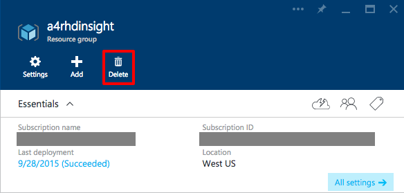

    _Deleting a resource group_  

1. As a safeguard against accidental deletion, you must type the resource group's name into the **TYPE THE RESOURCE GROUP NAME** field to delete it. After typing in the name, click the **Delete** button at the bottom of the blade.

    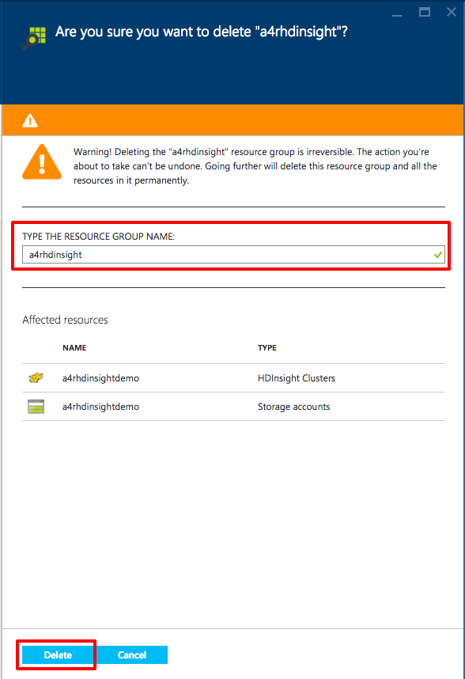

    _Finalizing the deletion of a resource group_  

    After 10 minutes or so, your HDInsight cluster will be deleted along with all the resources in the resource group.

Hadoop is a powerful tool for analyzing large volumes of data, but HDInsight doesn't stop there. In another lab in this section, you will create and use an HDInsight cluster that uses Apache Spark.

## Summary ##

Here is a quick summary of the key items you learned in this lab:

- HDInsight is Microsoft Azure's implementation of Hadoop, Spark, and supporting big-data tools
- The Azure Portal makes it easy to create and configure both Windows and Linux-based Hadoop clusters
- HDInsight with a Hadoop cluster can perform map and reduce operations with Python easily
- HDInsight treats Linux and OS X as first class citizens and does not need Windows anywhere

---

Copyright 2015 Microsoft Corporation. All rights reserved. Except where otherwise noted, these materials are licensed under the terms of the Apache License, Version 2.0. You may use it according to the license as is most appropriate for your project on a case-by-case basis. The terms of this license can be found in http://www.apache.org/licenses/LICENSE-2.0.
