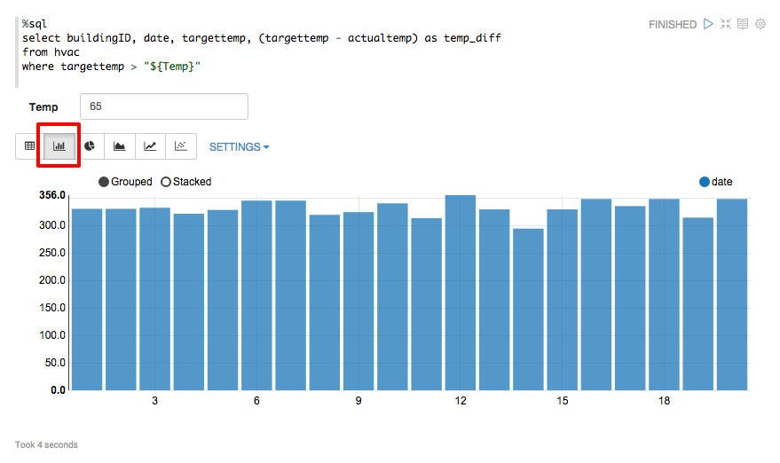
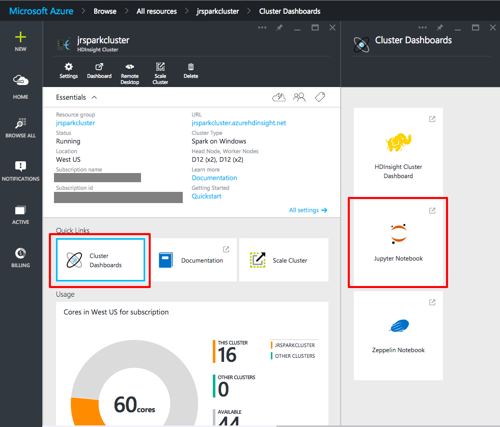

# Hadoop and Spark on Linux #

---

## Overview ##

In 2014, Gartner, Inc., a leading information research company, predicted that in 2015 there would be [4.9 billion connected "things"](http://www.gartner.com/newsroom/id/2905717) in use. When you consider that all those "things" are running serious amounts of software producing equally serious amounts of data, you begin to understand the true implications of **BIG DATA**. Data is being collected in ever-escalating volumes, at increasingly high velocities, and in a widening variety of formats, and it's being used in increasingly diverse semantic contexts. "Data" used to be something stored in a table in a SQL database, but today it can be a sensor reading, a tweet from Twitter, a GPS location, or almost anything else you can imagine. The challenge for information scientists is to make sense of that data.

An increasingly popular tool for analyzing big data is [Apache Hadoop](https://hadoop.apache.org/). In a nutshell, Hadoop "...is a framework that allows for the distributed processing of large data sets across clusters of computers using simple programming models." Hadoop is frequently combined with other open-source frameworks such as [Apache Spark](http://spark.apache.org/), [Apache HBase](http://hbase.apache.org/), and [Apache Storm](https://storm.apache.org/) to increase its capabilities and performance. [Azure HDInsight](http://azure.microsoft.com/en-us/services/hdinsight/) is the Azure implementation of Hadoop, Spark, HBase, and Storm, with tools such as Ambari, Storm, Spark Pig, and Hive thrown in to provide a comprehensive and high-performance solution for advanced big-data analytics. HDInsight can spin up Hadoop clusters for you using either Linux or Windows as the underlying operating system, and it integrates with popular business-intelligence tools such as Microsoft Excel, SQL Server Analysis Services, and SQL Server Reporting Services.

Even if you are experienced running your own hardware Hadoop clusters, you will find this lab valuable because it acquaints you with the process of running and managing Hadoop clusters provisioned by HDInsight. Once your HDInsight Hadoop cluster is running, most of the operations you perform on it are identical to the ones you would perform on you own hardware. The primary difference is that Azure's Hadoop implementation uses Azure blob storage as backing for the Hadoop Distributed File System (HDFS).

This hands-on lab focuses on using HDInsight with Hadoop running on Linux clusters. If you would prefer to experiment with HDInsight on Windows clusters, a separate but parallel hands-on lab is provided for doing just that.

### Objectives ###

In this hands-on lab, you will learn how to:

- Provision Apache Spark on HDInsight and run interactive queries

### Prerequisites ###

The following are required to complete this hands-on lab:

- A Microsoft Azure subscription - [sign up for a free trial](http://aka.ms/WATK-FreeTrial)
- Completion of the "Azure Storage and Azure CLI" hands-on lab
- For Windows Users:
	- [Putty](http://www.chiark.greenend.org.uk/~sgtatham/putty/download.html). Install the latest full package that includes PuTTY and the PSCP programs. Your best option is to use the install program to get these tools on your system. When you run the installer, note the directory where the tools are installed. You will need that directory to run the tools. The default installation location is "C:\Program Files (x86)\PuTTY".
	- The latest [Azure PowerShell module](http://go.microsoft.com/fwlink/p/?linkid=320376&clcid=0x409). Accept all the defaults when installing.

---

## Exercises ##

This hands-on lab includes the following exercises:

1. [Exercise 1: Creating and running a Spark cluster with Zeppelin and Jupyter](#Exercise1)
1. [Exercise 2: Removing your HDInsight Spark cluster](#Exercise2)

Estimated time to complete this lab: **60** minutes.

## Exercise 1: Creating and running a Spark cluster with Zeppelin and Jupyter

Hadoop is an excellent tool for big-data analysis, but Azure HDInsight is not content with offering you only a single analysis tool. In this exercise, you will work with [Apache Spark](http://spark.apache.org/), a big-data analysis tool that uses in-memory processing to boost performance. Spark is renowned for its ease of use and is built for speed, performing some operations 100 times faster than Hadoop in memory and 10 times faster on disk. The in-memory computation capabilities are excellent for interactive algorithms in machine learning and graph computations. Like HDInsight's Hadoop implementation, HDInsight Spark is built to work with Azure blob storage.

In this exercise, you will spin up an Azure HDInsight Spark cluster and process data in [Zeppelin](https://zeppelin.incubator.apache.org/) and [Jupyter](https://jupyter.org/) notebooks. Both are built in to HDInsight Spark clusters. After setting up the cluster, you will analyze and graph heating, ventilating, and air-conditioning (HVAC) data for a group of buildings. You'll get first-hand experience working with HDInsight Spark clusters using Zeppelin and Jupyter, and see just how easy it is to put them to work on real-world data sets.

1. Log into the [Azure Portal](https://portal.azure.com) with your Microsoft ID.

1. To start the creation process, click **+ NEW** in the upper-left corner of the Portal. In the "Create" blade, click the **Data + Analytics** link. Then click **HDInsight** in "Data + Analytics" blade.

    

    _Starting the Creation of a HDInsight Cluster_

1. In the **New HDInsight Cluster** blade you have to fill out various fields. The first field, **Cluster Name** is the unique Domain Name System (DNS) for the cluster so you can access it through your web browser. Note that when you move to another field, the name is validated that it is available. Make sure to remember this name as you will need it to log into the HDInsight cluster. In the **Cluster Type** field, the dropdown list lets you pick other types of cluster. For this exercise, select **Spark**. The third field is the operating system for all the nodes in the cluster. At the time this lab was written, HDInsight Spark clusters only run on Windows Server operating systems under the hood. The fourth field to fill out is specifying which Azure subscription you want to assign the HDInsight cluster to. If you have multiple subscriptions, pick the appropriate one by clicking on **Subscription** and selecting it.

    

    _The Spark Cluster Name and Type_

1. Back in [Exercise 1](#Exercise1), you learned that resource groups are a fantastic feature for managing the like-item lifecycle and security in Azure. When creating any new unit of work, such as an HDInsight Spark cluster, you want to always put that unit in its own Resource Group. In the **Resource Group** part of the **New HDInsight Cluster** blade. click on the **Or Create New** link. That will change the section to ask you for the name of the new resource group. The name you enter must be unique in your subscription, but not across Azure itself. In the edit box now in the section, type in the name of the resource group. As you are typing the portal verifies the name is unique. Look for the green check mark before proceeding.

    

    _Creating a New Resource Group_

1. After specifying the new resource group, the next information to fill out are the credentials for accessing the . In the **Credentials** section, click on **Configure required settings** to bring up the **Cluster Credentials** blade. You need to set up one set of credentials for accessing the Spark web interface. In the **Cluster credentials** blade, enter the username and password for the cluster followed by a username and password for the web remote access. The passwords must be at least 10 characters in length and contain at least one digit, one non-alphanumeric character, and one upper or lowercase letter. Securely store this account information as you will need it later in this exercise. When finished and all password check boxes show green checkmarks, click the Select button at the bottom of the blade. While it is not required for this exercise, if you wanted to access the Spark cluster directly through Remote Desktop, the Windows operating system way to access remote machines, you could enable that account in this blade.

    

    _The Spark Cluster Credentials Blade_

1. Click on the **Data Source** section in the **New HDInsight Cluster** blade. As you saw in [Exercise 1](#Exercise1) you have the choice to use an existing blob storage account or create a new one when creating HDInsight clusters. For this exercise you will want to create a new storage account. Click on the **Or Create New** under the **Select storage account** section. Remember, the name you specify must be all lowercase. If you want the default blob container to be different than the default of being named after your Cluster name, you can change that as well. When finished with creating your new storage account in the **Data Source** blade, click the **Select** button on the bottom.

    For nearly all Hadoop file operations, the Azure blob storage implementation will be seamless if you are coming from your own Hadoop clusters. One small difference is that native Hadoop Distributed File System (HDFS) commands, which are platform dependent, such as fschk and dfsadmin, are different when applied to blob storage.

    

    _The Spark Cluster Source Blade_

1. Click on the **Node Pricing Tiers** section to bring up the **Node Pricing Tiers** blade. Here is where you can configure the number of nodes and the types of virtual machines you want to run. For this exercise you can set the number of Worker nodes to 2. Like [Exercise 1](#Exercise1), you have total control over the size and number of nodes so you can find the right balance between the amount of processing you need and the cost of the cluster. After changing the number of nodes, click **Select** at the bottom of the blade.

    _The screen shot below shows a total cost calculation valid at the time the screen shot was taken, and that HDInsight Spark clusters are in public preview. Your cost may be different and the preview may be over. To read more about the current HDInsight prices, read the [HDInsight Pricing](http://azure.microsoft.com/en-us/pricing/details/hdinsight/) page._

    

    _The Spark Cluster Node Pricing Tiers_

1. The last section of the **New HDInsight Cluster** is the **Optional Configuration** blade, but for this exercise you do not need to change anything. Feel free to look at what you can configure if you are interested. When all sections of the **New HDInsight Cluster** blade are filled out click the **Create** button at the bottom of the **New HDInsight Cluster** blade to start creation. Depending on the number of nodes and types of virtual machines you chose for HDInsight cluster, your deployment can take anywhere from 5-10 minutes.

    

    _The Filled Out New HDInsight Cluster Blade for a Spark Cluster_

1. When your new HDInsight Spark cluster is created, either click on the box pinned to your Portal home page, or search for it in the **Browse All** button. When you have your HDInsight Spark cluster blade active, click on the Cluster Dashboards buttons under hte **Quick Links** section.

	

	_The Spark Cluster Dashboards Button_

1. In the **Cluster Dashboards** blade, click on the **Zeppelin Notebook** button.

	

	_The Zeppelin Notebook Button_

1. Clicking on the Zeppelin button will bring up a new browser tab, or window depending on which browser you use, and you will be prompted for the user name and password. Enter the **user name** and **password** you specified when creating the HDInsight Spark cluster.

	_Note that your login prompt may look different depending on the browser you are using._
	

	_Login Prompt for the Zeppelin Notebook_

1. When you log into an HDInsight Spark cluster, you will need to perform multiple logins so the gateway and proxy servers in Spark get initialized with your user name and password. The initial page you see when logging in shows the steps. For **Step 1**, click on the link in parenthesis. This will open another tab or window in your browser and prompt you to enter your cluster account **user name** and **password** again. As explained in the initial page, you will see a 502 web server error after logging in. Once you have logged in you can close this tab, or page.

	

	_Zeppelin Notebook Step 1 Login Instructions_

1. Back in the initial login page, click on the link labeled **Zeppelin portal** in Step 2. Again, you will be prompted for the cluster account **user name** and **password** on another browser tab, or window.

	

	_Zeppelin Notebook Step 2 Login Instructions_

1. Whenever you want to use Zeppelin, make sure to check the upper right hand corner that the green light is showing **Connected**. If not, go through the initial two login instructions again.

	

	_Correctly Connected to Zeppelin_

1. With the login to Zeppelin successful, you will want to create a new Notebook by clicking on the **Create new note** link. That will create a new Zeppelin note named "Note XXXXXXXXX" (where the X's are random characters). Click on the new Note created link to open the note.

	

	_Correctly Connected to Zeppelin_

1. Once in the new note, click on the Note name and change it to something appropriate like Research or another name you want. To commit the name, press the Entery key.

	

	_Renaming the New Zeppelin Notebook_

1. The first step to working with the HVAC data is to get it loaded into a temporary table in the HDInsight Spark cluster. The sample data you are going to use is provided by Microsoft in an associated storage account for the cluster, \HdiSamples\SensorSampleData\hvac. Below is the sample code you will need to copy so in the next step you can paste it into your Zepellin notebook.

	<pre>
	// Create an RDD using the default Spark context, sc
	val hvacText = sc.textFile("wasb:///HdiSamples/SensorSampleData/hvac/HVAC.csv")

	// Define a schema
	case class Hvac(date: String, time: String, targettemp: Integer, actualtemp: Integer, buildingID: String)

	// Map the values in the .csv file to the schema
	val hvac = hvacText.map(s => s.split(",")).filter(s => s(0) != "Date").map(
	    s => Hvac(s(0),
	            s(1),
	            s(2).toInt,
	            s(3).toInt,
	            s(6)
	    )
	).toDF()

	// Register as a temporary table called "hvac"
	hvac.registerTempTable("hvac")
	</pre>

1. In a Zeppelin notebook, you work in paragraphs. In the screen shot below, the empty paragraph is shown. Paste the above code into that paragraph.

	

	_The Empty Zeppelin Paragraph_

	If the you cannot place the cursor into the paragraph and type, that means the paragraph or notebook is set to read only, which can accidentally happen. To enable editing, click the arrow button next to the paragraph so it looks like the arrows are pointing in to the center.

	

	_Setting a Paragraph to Edit Mode_

	After you paste in the code, it will look like the following.

	

	_The Pasted in Code_

1. With the code pasted, you want to run it to get the data imported into your HDInsight Spark cluster. To run the paragraph, either press the SHIFT+ENTER key combination, or select run from the paragraph options.

	

	_The Zeppelin Paragraph Run Button_

1. The **READY** text will turn to **PENDING** and the paragraph executing code will gray out. The run is complete when the text for the paragrah turns to **FINISHED**. Additionally, a new paragraph will appear in the notebook. If you would like, you can give a title to the paragraph by clicking the **Settings** button in the paragraph options and choosing **Show title**. If you do change the title, remember to press Enter to complete the change.

	

	_A Finished Run and the Zeppelin Settings Button_

1. With the data in your HDInsight Spark cluster, you can start running Spark SQL statements on the hvac table. The first line of the code tells Spark to use the built in Spark SQL interpreter. You can see the default interpreters by clicking on the **Interpreter** link at the top of the page. Copy the following code to the clipboard and paste it into the new paragraph on your notebook. Once pasted, click the **Run** button for the paragraph or use the SHIFT+ENTER corresponding keystroke.

	<pre>
	%sql
	select buildingID, (targettemp - actualtemp) as temp_diff, date
	from hvac
	where date = "6/1/13"
	</pre>

1. The Spark SQL script created a three column table, with the Building ID, the temperature difference, and the data. The default output is the table itself. What makes Zeppellin wonderful is how you can easily work with the data in an interactive way. Clicking on the bar graph icon will graph the data. The default graphing sums up the temperature differences in each building. This is why building 2 shows a -58.0 difference.

	

	_The Default Bar Graph_

1. A much better graph would be one that shows the average temperature difference between the target and actual temperature for each building. Click on the **Settings** link to expand the display to show you the Keys, Groups, and Values boxes. In the Values box, click on the temp_diff text and change from SUM to AVG to convert to an average.

	

	_Changing the Settings to Report Average Temperature Difference_

	After collapsing the settings, the graph will show the average differences. It sure looks like there's a problem in building 14!

	

	_The Average Temperature Difference by Building Graph_

1. Spark paired with a Zeppelin notebook is an outstanding interactive way to explore your big data issues. For example, Spark SQL allows you to use variables in the query. In the code below, it defines a variable, **Temp**, in the query. When you run the query, you will see an edit box on the screen where you can enter the temperature you would like for the maximum value. Copy this code and past it into the new paragraph in your notebook. Click the **Run** button on the paragraph to execute the code.

	<pre>
	%sql
	select buildingID, date, targettemp, (targettemp - actualtemp) as temp_diff
	from hvac
	where targettemp > "${Temp}" 	
	</pre>

	

	_Ready to Enter the Temperature Variable_

1. In the Temp field, enter 65 so your query will return all the temperatures greater than 65 degrees. Press the ENTER key to have Zeppelin process the query. The default in any Spark SQL query is to return the raw data. Click on the bar graph button under the Temp entry field. The initial graph uses the first field as the key, and the sum of the second field as the value. In this case that is the Building ID and the sum of the dates.

	

	_Initial Query Graph_

1. To make this graph more usable, click on the Settings button, and set the **buildingID** field as the key, grouped by the **targettemp** field, and the average of the temp-diff field as the values. You can click on the fields in the **All fields** area and drag them down to the appropriate box. The graph at the bottom will update on each change. When you get all the settings changed, you will see that the HVAC systems are running below the target temperature on cool days and above the target temperature on warmer days.

	

	_Controlling the Graph Settings_
    
1. So far you have seen everything using Spark SQL for data analysis but it does support many other languages, such as Scala, a functional programming language that is getting a lot of traction in the big data world. In fact, Spark is written in Scala. With the HVAC data you have it might be interesting to see what buildings are the hottest and coolest. Once way to do that would be to sum up all the temperature differences over all reporting periods and look for the one that is the lowest, which indicates the building trends cooler than the target temperature, and the highest, indicating trending hotter than the target temperature. With that data you could look at how you could explore various heating and cooling options for the buildings to get the actual temperatures more in line with the target temperatures.

    The following code shows two different ways with Scala to pull data from your Spark cluster. The part uses SQL to query the HVAC table created earlier to sum all temperature differences for each building. The second and third line use Scala to sort the data and grab the first row. The fourth and fifth lines register the temporary table as a full Spark table so you can run SQL queries against it and in this case, sort descending and grabbing the top item. Finally, it displays the data. 
    
    <pre>
    // Pull the sum of all temp differences into a DataFrame
    val temp = sql("select buildingID, SUM(targettemp-actualtemp) as sumTemp from hvac group by buildingID")
    
    // The pure Scala way of manipulating the data to get the coolest building.
    val tempSorted = temp.sort("sumTemp")
    val coolestBuilding = tempSorted.first()
    
    // Add this as a table and do the SQL way of getting the hottest building.
    temp.registerTempTable("test")
    val hottestBuilding = sql("select * from test order by sumTemp DESC limit 1")
    
    // Display the data in a rudimentary way. :)
    coolestBuilding.toString()
    hottestBuilding.show()
    </pre>
    
    In a new editing element on the Zeppelin page, paste the code above and run the code. Which buildings are the hottest and coolest?

1. As you have seen Zeppelin notebooks make it very easy to do interactive data analysis and spelunking of big data on Spark. Another very popular option for research and analysis is [Jupyter](https://jupyter.org/), which is another notebook-based approach, but with very broad support for over 40 programming languages and excels at numerical simulation, statistical modeling, machine learning, and much more. To start a Jupyter notebook for your HDInsight Spark cluster, broswse for your HDInsight Spark cluster in the Azure Portal by clicking the **BROWSE ALL** button and clicking on your cluster in the **All resources** blade to bring up your cluster's blade. Click on the **Cluster Dashboards** button to bring up the Cluster Dashboards blade. Click on the **Jupyter Notebook** button. This will open a new browser tab or window, depending on the browser.

	

	_Opening a Jupyter Notebook_

1. The new window or tab will prompt you for the **user name** and **password** you specified when you created the HDInsight Spark cluster. Enter those when requested. Once logged in you will see the default Jupyter workspace. With the **Files** tab selected, click on the **New** button on the right hand side and in the popup menu, selcect **Python 2**.

	

	_Creating a New Jupyter Notebook_

1. The default name for a new Jupyter notebook is Untitled, which you will want to change. Click on the text **Untitled** at the top of the notebook and in the popup enter a name such as HVAC Experiment. When finished, click the **OK** button.

	

	_Renaming a New Jupyter Notebook_

1. The following Python code imports several necessary libraries and sets up the Spark SQL context so you can execute Spark SQL commands using the **sqlContext** variable. Copy and paste this code into the edit block on your noteboo.

	<pre>
	from pyspark import SparkContext
	from pyspark.sql import SQLContext
	from pyspark.sql.types import *

	# Create Spark and SQL contexts
	sc = SparkContext('spark://headnodehost:7077', 'pyspark')
	sqlContext = SQLContext(sc)
	</pre>

	To run this code, click the run button in the toolbar.

	

	_Running code in a Jupyter Notebook_

1. When code us running in a Jupyter notebook the circle next to the Python 2 text in the upper right hand corner will become a solid circle, instead of the hollow circle indicating nothing is running.

	

	_Jupyter Notebook Indicating Code Is Running_

1. After the code finishes running, you will have another code entry box in your Jupyter notebook. Copy the following code into the new entry box. This code uses the Spark SQL interpreter to load the HVAC data file, create a schema, and runs a query against the data.

	<pre>
	# Load the data
	hvacText = sc.textFile("wasb:///HdiSamples/SensorSampleData/hvac/HVAC.csv")

	# Create the schema
	hvacSchema = StructType([StructField("date", StringType(), False),StructField("time", StringType(), False),StructField("targettemp", IntegerType(), False),StructField("actualtemp", IntegerType(), False),StructField("buildingID", StringType(), False)])

	# Parse the data in hvacText
	hvac = hvacText.map(lambda s: s.split(",")).filter(lambda s: s[0] != "Date").map(lambda s:(str(s[0]), str(s[1]), int(s[2]), int(s[3]), str(s[6]) ))

	# Create a data frame
	hvacdf = sqlContext.createDataFrame(hvac,hvacSchema)

	# Register the data fram as a table to run queries against
	hvacdf.registerAsTable("hvac")

	# Run queries against the table and display the data
	data = sqlContext.sql("select buildingID, (targettemp - actualtemp) as temp_diff, date from hvac where date = \"6/1/13\"")
	data.show()
	</pre>

1. After pasting the code, either click the **Run** button to execute the code or use the SHIFT+ENTER keystroke which does the same thing. When the code finishes running, you'll see the following output.

	<pre>
	buildingID temp_diff date  
	4          8         6/1/13
	3          2         6/1/13
	7          -10       6/1/13
	12         3         6/1/13
	7          9         6/1/13
	7          5         6/1/13
	3          11        6/1/13
	8          -7        6/1/13
	17         14        6/1/13
	16         -3        6/1/13
	8          -8        6/1/13
	1          -1        6/1/13
	12         11        6/1/13
	3          14        6/1/13
	6          -4        6/1/13
	1          4         6/1/13
	19         4         6/1/13
	19         12        6/1/13
	9          -9        6/1/13
	15         -10       6/1/13
	</pre>

In this exercise you got to see how easy it is to work with an HDInsight Spark cluster using Zeppelin and Jupyter notebooks to do interactive analysis. These are excellent ways to start exploring new datasets and perform quick analysis to get an idea what a dataset has in them. As you did before, once you are finished running jobs on your HDInsight Spark cluster you will want to remove it so you are not billed for it.

## Exercise 2: Removing your HDInsight Spark cluster

As explained in [Exercise 3](#Exercise3), when you are finished with an HDInsight Spark cluster, you should remove it because you are charged for it while it exists, regardless of whether it's doing any work. In this exercise, you will delete the cluster used in the previous exercise. Note that because it's so easy to create and delete clusters, these tasks are frequently scripted using the Azure CLI or Azure PowerShell.

1. The first step in removing an HDInsight cluster is to log into the [Azure Portal](https://portal.azure.com).

1. Click **BROWSE ALL** on the left-hand side and in the "Browse" blade, select **Resource groups**.

    

    _Browsing resource groups_  

1. In the "Resource groups" blade, select the resource group you created in Exercise 1.

    

    _Selecting a resource group_  

1. In the blade for the resource group, click the **Delete** button.

    

    _Deleting a resource group_  

1. As a safeguard against accidental deletion, you must type the resource group's name into the **TYPE THE RESOURCE GROUP NAME** field to delete it. After typing in the name, click the **Delete** button at the bottom of the blade.

    

    _Finalizing the deletion of a resource group_  

    After 10 minutes or so, your HDInsight cluster will be deleted along with all the resources in the resource group.

## Summary ##

Here is a quick summary of the key items you learned in this lab:

- HDInsight is Microsoft Azure's implementation of Hadoop, Spark, and supporting big-data tools
- The Azure Portal makes it easy to create and configure both Windows and Linux-based Hadoop clusters
- HDInsight with a Hadoop cluster can perform map and reduce operations with Python easily
- HDInsight treats Linux and OS X as first class citizens and does not need Windows anywhere
- HDInisght fully supports popular interactive tools such as Zeppelin and Jupyter

---

Copyright 2015 Microsoft Corporation. All rights reserved. Except where otherwise noted, these materials are licensed under the terms of the Apache License, Version 2.0. You may use it according to the license as is most appropriate for your project on a case-by-case basis. The terms of this license can be found in http://www.apache.org/licenses/LICENSE-2.0.
