<a name="HOLTitle"></a>
# The Microsoft Bot Framework #

---

<a name="Overview"></a>
## Overview ##

Whether you realize it or not, bots are everywhere. In fact, you probably interact with bots every day without even realizing it. Bots, especially chat and messenger bots, are changing the way we interact with businesses, communities, and even each other. Thanks to light-speed advances and availability of artificial intelligence services, bots are not only becoming more advanced and personalized, but also more accessible for creation by the average developer. 

Regardless of the target language or platform, developers building bots face the same common problems: Bots require basic input and output. Bots need language and dialog logic. Bots need to be responsive, scalable, and extensible, and they need to interact with users in any conversation experience and language the user chooses. The Microsoft Bot Framework provides the foundation for what developers need to build, connect, manage and publish intelligent bots that interact naturally with users over a diverse range of third-party and custom services. 

In this lab, you’ll register and configure a bot for use with the Microsoft Bot Framework, as well as build and publish a bot using the Microsoft Bot Framework SDK configured for use with a Skype channel that can return random, interesting facts to a user.

<a name="Objectives"></a>
### Objectives ###

In this hands-on lab, you will learn how to:

- Create an Azure Web App to host a bot
- Create and configure a bot registration
- Setup and configure a bot project 
- Add conversation logic to a bot
- Debug bot processes
- Publish a bot for use with third-party channels

<a name="Prerequisites"></a>
### Prerequisites ###

The following are required to complete this hands-on lab:

- An active Microsoft account, or [sign up for an account](https://signup.microsoft.com)
- An active Microsoft Azure subscription, or [sign up for a free trial](http://aka.ms/WATK-FreeTrial)
- [Visual Studio Code](http://code.visualstudio.com "Visual Studio Code") 
- [Skype](https://www.skype.com/en/download-skype/skype-for-computer/ "Skype") installed on your computer (to test third-party channel integration)

---

<a name="Exercises"></a>
## Exercises ##

This hands-on lab includes the following exercises:

- [Exercise 1: Create an Azure Web App](#Exercise1)
- [Exercise 2: Create and configure a bot registration](#Exercise2)
- [Exercise 3: Setup and configure a bot project](#Exercise3)
- [Exercise 4: Add conversation logic to your bot](#Exercise4)
- [Exercise 5: Debug bot processes](#Exercise5)
- [Exercise 6: Publish and test your bot](#Exercise6)
 
Estimated time to complete this lab: **60** minutes.

<a name="Exercise1"></a>
## Exercise 1: Create an Azure Web App ##

The first step in creating a bot is to provide a location for the bot logic to be hosted. Azure Web Apps are a perfect solution for hosting bot applications. In this exercise you will create and configure your Azure Web App.

1. Open the Azure Management Portal, if asked to login, do so with your Microsoft Account.
1. Click **+ New**, followed by **Web + mobile** and then **Web App**.

    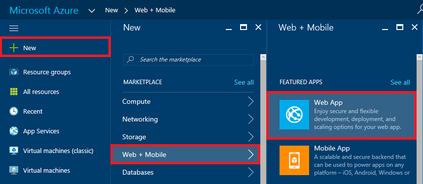

    _Creating a new Web App_

1. The Azure portal will display a form for creating a new Azure Web App. Enter an App name such as “factbot01” (without the quotation marks) or any unique label without spaces or special characters.

	>Azure Web App names can be 3 to 24 characters in length and can only contain numbers and lowercase letters. In addition, the name you enter must be unique within Azure. If someone else has chosen the same name, you'll be notified that the name isn't available with a red exclamation mark in the **App name** field.

1. Under “Resource Group” select **Create New**, enter a Resource Group name such as “TrainingLabResources.”
1. Leave “App service plan/Location” as the default generated by the Azure Portal, and click **Create**.

    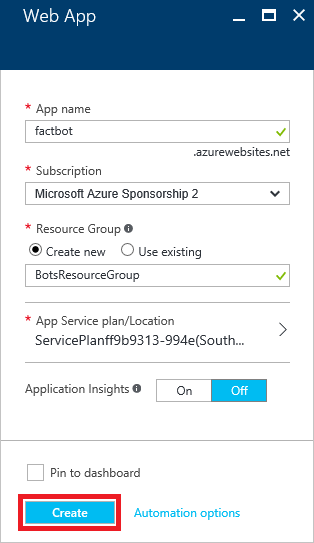

    _Configuring a new Web App_

	The Azure Portal will redirect you to the Azure Portal Dashboard while it provisions your Web App. It typically takes around 30 seconds to fully provision a new Azure Web App. To monitor provisioning of your Web App from the Azure Portal:

1. Click the **“hamburger”** icon in the Azure Portal to open the side drawer.
1. Click **Resource Groups** followed by **TrainingLabResources**.
1. Select the "Overview" tab.
1. Review the Last deployment label and watch for the status to change from “Deploying” to “Succeeded”, at which time your Web App has been successfully provisioned.

    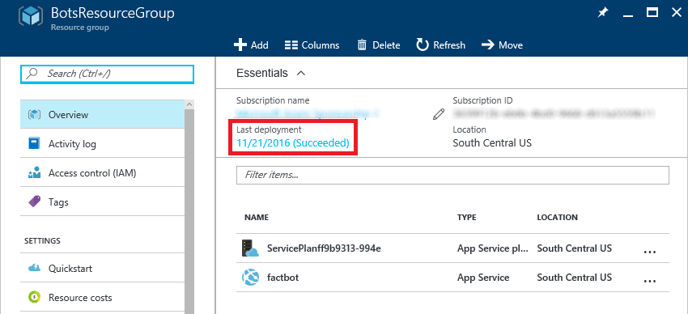

    _Resource Group deployment status_

	>You may need to refresh the page in your browser from time to time to see the most recent deployment status changes.

Your Azure Web App is now provisioned and ready to create your bot registration. You will need the Azure Web App URL created in Step 3 as part of this next exercise. 

<a name="Exercise2"></a>
## Exercise 2: Create and configure a bot registration ##

The next step in building a bot with the Microsoft Bot Framework is creating and configuring a bot registration at the Microsoft Bot Framework Portal. This process will create registration information and access keys you’ll need in later exercises.

1. Open the Microsoft Bot Framework Portal, and click **Sign in** on the portal menu. if asked to login, do so with your Microsoft Account.
1. Click **Register a bot** in the top navigation menu. You will be redirected to the bot registration page.

    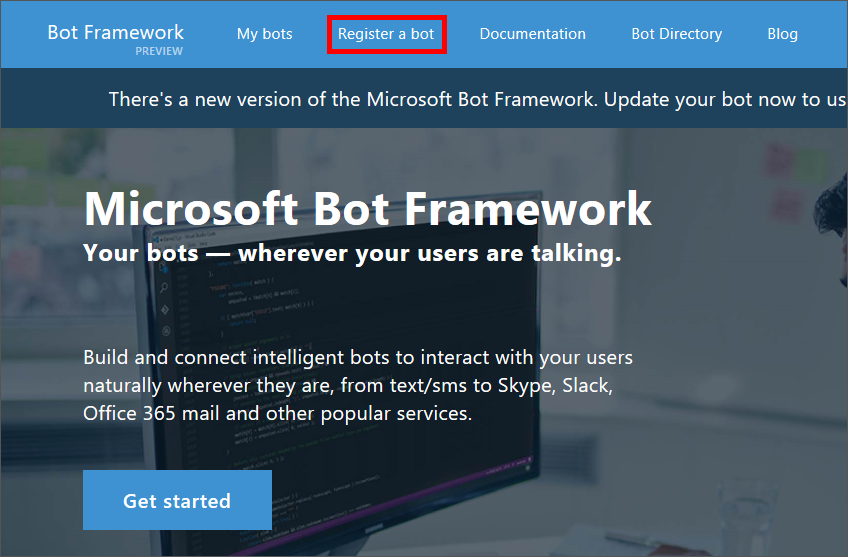

    _Registering a bot_

1. Under the “Bot profile” section, type “Factbot” (without quotation marks) in the Name field, and “Factbot01” (also without quotation marks) in the **Bot handle** field.
	
	>Microsoft Bot handles names can be 3 to 24 characters in length and can only contain numbers, lowercase letters, and a limited set of special characters. In addition, the handle you enter must be unique within the Bot Framework registry. If someone else has chosen the same handle, you'll be notified that the name isn't available with a red exclamation mark in the **Bot handle** field when attempting to save your bot registration.

1. Type “Training lab fact bot” in the **Description** field.

    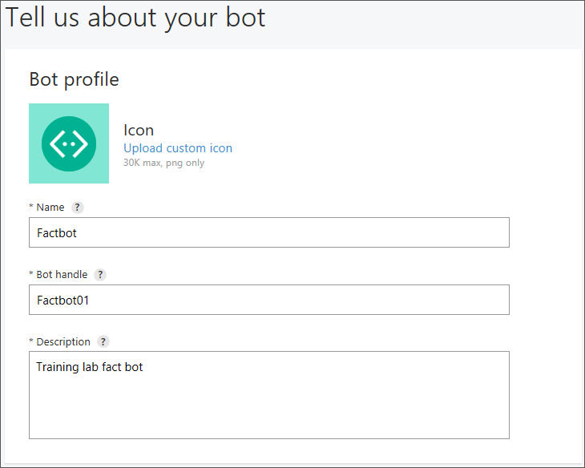

    _Registering a bot profile_

1. Scroll down to the “Configuration” section and in the **Messaging endpoint** field, and enter the following value, replacing “[webappname]” with the Azure Web App name entered in Exercise 1, Step 3. Be certain to add "/api/messages" to the end of the endpoint URL.

	```
	https://[webappname].azurewebsites.net/api/messsages
	```
	
	>Bot messaging endpoints can only communicate over secure protocols. Observe the messaging endpoint URL uses https rather than http.

1. Leave Microsoft App ID field empty for now, and click the **Create Microsoft App ID and password** button. You will be redirected to the “Generate App ID and secret” page.

    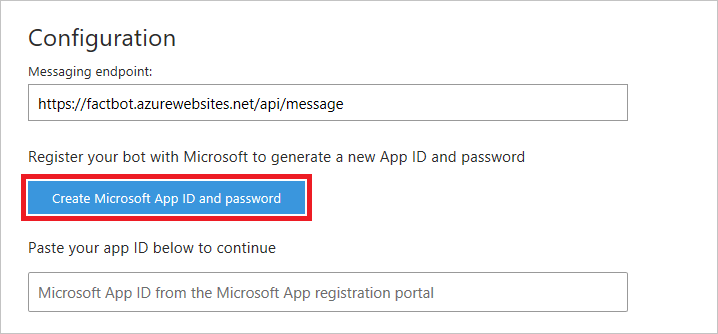

    _Configuring a bot messaging endpoint_

1. Your bot App name will be automatically populated, and a new Microsoft App ID will be created for you. Click the **Generate an app secret** to continue button to create an app secret value.

    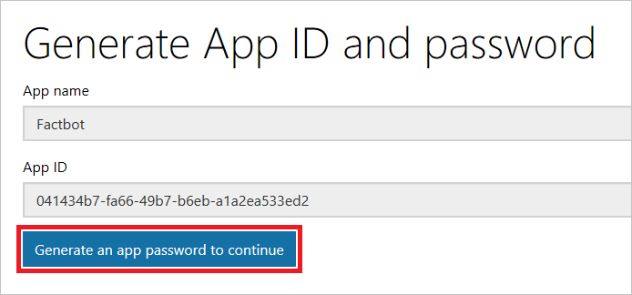

    _Generating an app secret value_
	
	>Copy the new password generated in the “New password generated” dialog, and **immediately paste it into a text file**. **You will not be able to retrieve this password after this step**, but will be required to use it in a later exercise.

1. After you’ve successfully copied and pasted the new password. Click **Ok** to dismiss the dialog.

    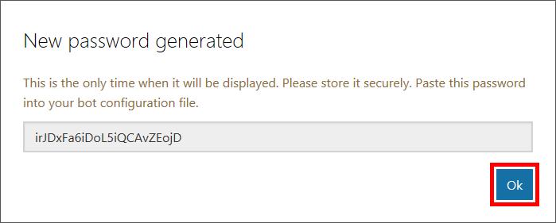

    _Copying the new app secret value_
	
1. Click the **Finish and go back to Bot framework** button. You will be redirected back to your bot registration page, with your Microsoft App ID automatically populated.
 
    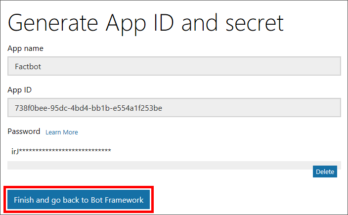

    _Completing the bot app registration_
	
1. Scroll down to the “Publisher profile” section. 
	
	>Although these values are required for publishing a bot for public use, they are not required to be valid for the exercises in this lab. You will be populating many of these fields with “placeholder” information instead.

1. Type in “Training Lab” (without quotation marks) in the **Publisher name** field. Your Microsoft account email will already be populated as the Publisher Email field. Leave this value as the default.
1. Type in “http://www.microsoft.com” in both the **Privacy statement** and **Terms of Use** fields. Leave all remaining fields empty, or as their default values.
 
    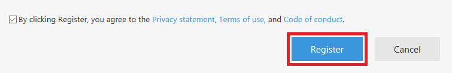

    _Adding the bot registration publisher profile_
	
1. Scroll to the bottom of the form and check the **By clicking Register, you agree to the Privacy statement, Terms of use, and Code of conduct** value check box and then click the **Register** button. After a short delay, a “Bot created” dialog will appear notifying you of a successful registration.
 
    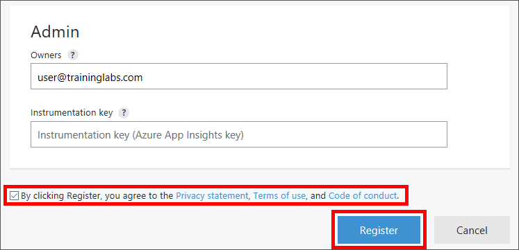

    _Completing the bot registration_

    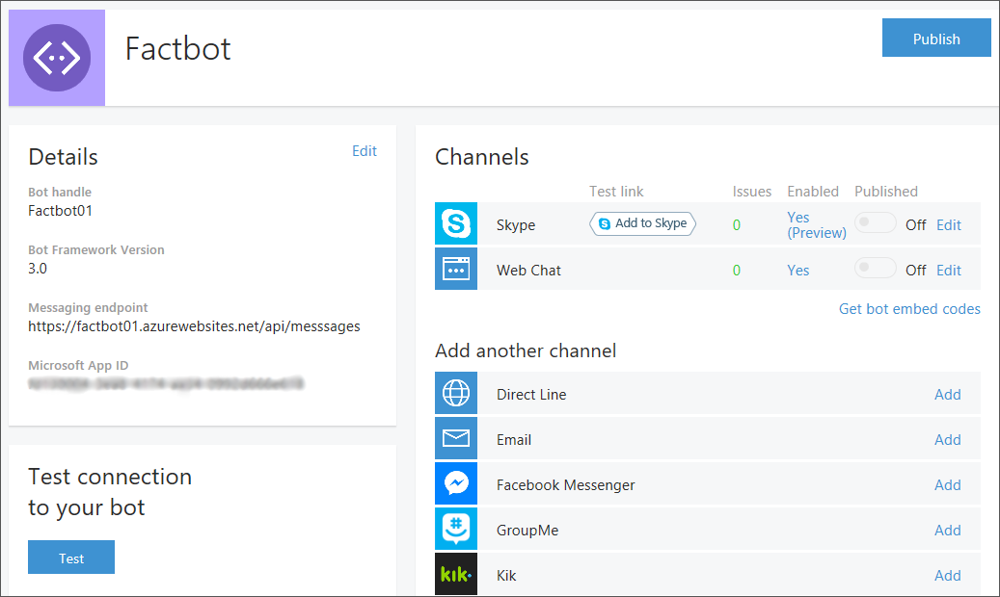

    _Completed bot registration_
	
Your bot is now configured and registered for use with the Microsoft Bot Framework and you’re ready to start building your bot. To build your bot you will be using Visual Studio Code. 

<a name="Exercise3"></a>
## Exercise 3: Setup and configure a bot project ##

Now that you’ve created and configured your bot registration, it’s time to start building your bot in Visual Studio Code. If you haven’t installed Visual Studio Code, you will need to do so before continuing with this exercise.

Once you have confirmed you have Visual Studio Code installed you can start building your bot:

1. Start Visual Studio Code and open the Integrated Terminal by clicking **View > Integrated Terminal** in the VS Code menu. The TERMINAL window will appear at the bottom of your environment workspace.

    

    _Opening the Integrated Terminal_

    

    _The Integrated Terminal window_

1. In the TERMINAL window type “mkdir Factbot” and hit the **enter** key on your keyboard. A new folder named Factbot has been created.

    

    _Executing mkdir Factbot_

1. Type “cd Factbot” in the TERMINAL window, and hit the **enter** key on your keyboard to navigate to the new Factbot folder.

    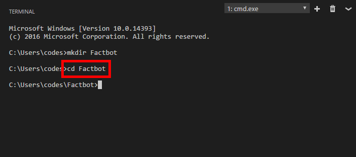

    _Executing cd Factbot_

1. Type “code .” [the word code, followed by a space and period) and hit the **enter** key on your keyboard to open VS Code in your new folder location.

    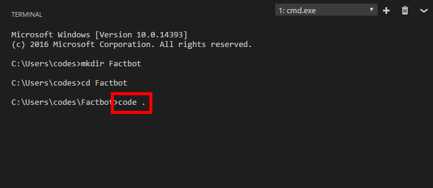

    _Opening a new instance of Visual Studio Code_

	A new instance of VS Code will start. You will be working in this instance of VS Code for the remainder of the exercises.

    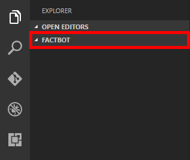

    _The new Factbot project_

1. In the **Explorer**, click the **New File** icon to the right of the FACTBOT heading to create a new file, and then type “app.js” (without quotation marks) in the new line item in Explorer, and then hit the **enter** key on your keyboard. 

    

    _Adding a new project file_

    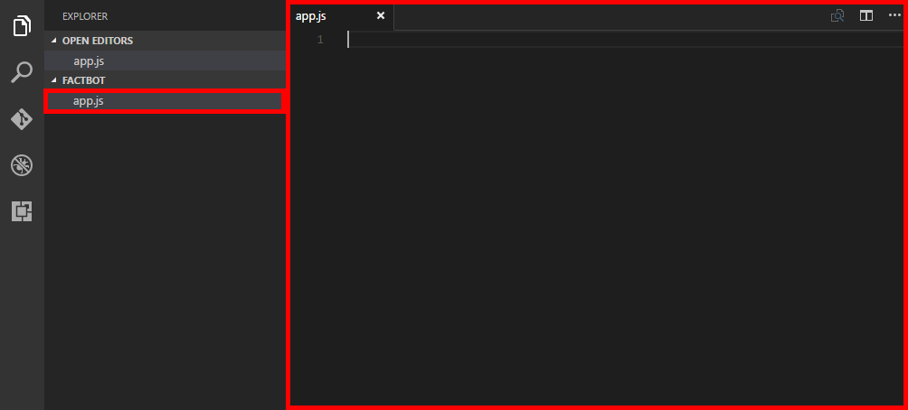

    _The new app.js file_

	A new app.js file has been created. This file will contain the code for your bot.

1. Enter the following single line of code at the top of your new app.js file: 

	```
	console.log("Hello world!");
	```

    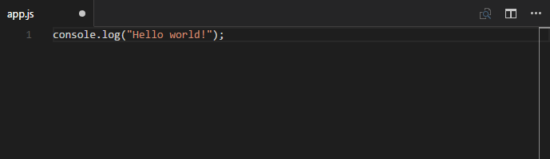

    _Adding code to the app.js file_

1. From the Visual Studio code menu, open the Integrated Terminal again by clicking **View > Integrated Terminal**. 

    

    _Opening the Integrated Terminal_

1. In the TERMINAL window, enter the following command: “npm install --save botbuilder” (without quotation marks), and then hit the **enter** key on your keyboard. This command installs the Microsoft Bot Builder SDK into your environment.

    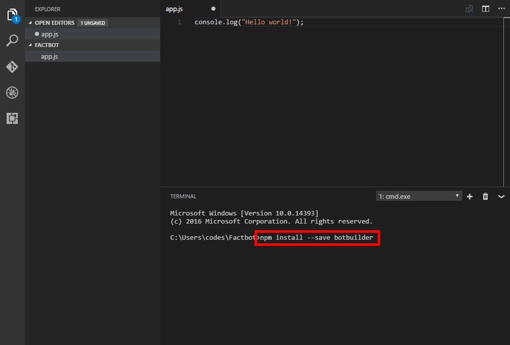

    _Adding support for the Microsoft Bot Builder SDK_
	
	>npm commands may take up to 60 seconds to complete. Installation details will be displayed in the terminal window during processing.

    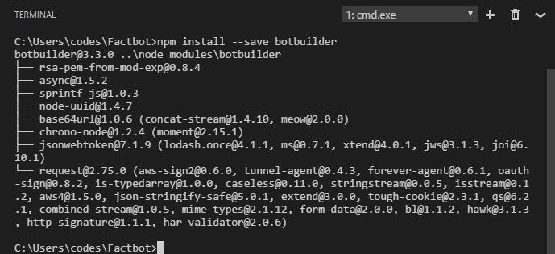

    _A completed Microsoft Bot Builder SDK installation_
	
1. Again, in the TERMINAL windows, enter the following command: “npm install --save restify”, and hit the **enter** key on your keyboard. This command installs the packages required to leverage REST-based messaging routes in your bot code.

    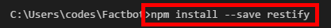

    _Adding support for the REST-based messaging routes_

    

    _A completed Restify installation_	

	>At this point in the exercise you should save any changes you've made to your app.js file. This is a good habit to get into as you continue to write code throughout this lab.

    

    _Saving project file changes_	

1. Finally, in the in the TERMINAL window, type “node app.js”, hit the **enter** key on your keyboard. This command will run your application and output “Hello world!” to your TERMINAL window.

    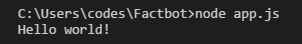

    _Running the Factbot app.js application_	

To finish configuring your bot project we need to add the configuration values generated by the Microsoft Bot Framework portal in the previous exercise. You will be adding these values to an auto generated configuration file.

To automatically generate your bot project configuration file:

1.	Click the Visual Studio Code **Debug** tab to open the DEBUG panel.

    

    _Selecting the Debug tab_	

1.	Click the **DEBUG** (green arrow) in the top panel menu and then select **Node.js** from the “Select Environment” drop down. A new launch.json file will be automatically created with default values for deployment and debugging. A message will appear alerting you to setup the launch configuration file for this project. Click the **Close** button.
	
    

    _Creating a new launch file_	
	
    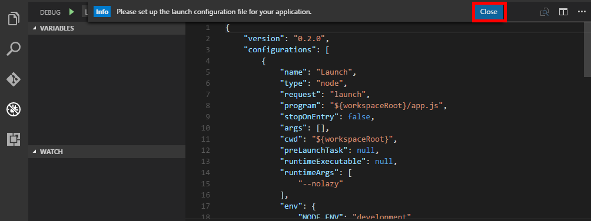

    _Acknowledging creation of a newly created launch.json file_	

1.	Locate the “env” node in the newly created launch.json file:		
	
    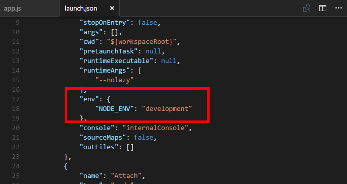

    _The launch file env node_	

1.	Enter the following code directly below the “NODE_ENV”:

	```
     "MICROSOFT_APP_ID" : "[BOT_MICROSOFT_APP_ID]",
     "MICROSOFT_APP_PASSWORD" : "[BOT_MICROSOFT_APP_PASSWORD]"
	```	
	
	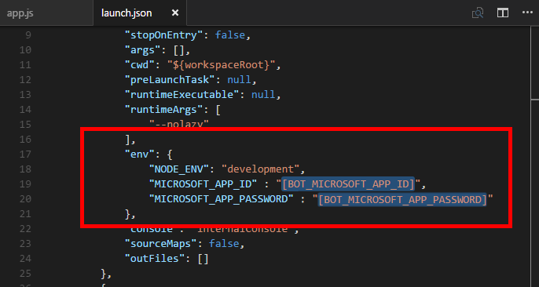

    _Replacing bot registration values_	


1.	Replace the values [BOT_MICROSOFT_APP_ID] with the Microsoft App Id generated in Exercise 2, and then replace [BOT_MICROSOFT_APP_PASSWORD] with the password you copied to a text file, also in Exercise 2.	
	
 
	>If you need to view the Microsoft App ID created in Exercise 2, open up a browser and navigate to the **Microsoft Bot Framework Portal**. When the portal opens, click **My Bots** and then **Factbot**, to review your bot configuration information, including the Microsoft App ID created in Exercise 2.

1.	Close the new launch.json file by selecting **File > Close Editor** from the Visual Studio Code menu. If prompted to save changes, click **Save**.
	
    

    _Closing the Visual Code editor window_	

1.	In the Explorer, click the **Add folder** button to create a new folder.
	
    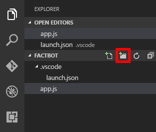

    _Adding a new folder_	

1.	Type in "en" (without quotation marks) and hit the **enter** key on your keyboard.
	
    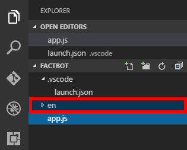

    _Creating the en language folder_	

	>The en folder is **not required** for you bot to work correctly, however the Bot Builder SDK will display warnings in the Integrated Terminal if a default language folder is not available.

Your bot project is now setup and configured and you’re ready to write code to demonstrate communication between a user and your bot The next step is to write code to provide simple responses to a user from your bot, and then add conversation logic to provide a more meaningful experience.

<a name="Exercise4"></a>
## Exercise 4: Add conversation logic to your bot ##

The entire goal of creating a bot is to have intelligent, automated interactions with users. Now that all the configuration, registration, and project setup are complete, you can start writing code for your bot.

To add some simple code logic to your bot:

1. Open Visual Studio Code, or return to it if Visual Studio Code is still open from the previous exercise.
1. In the Visual Studio Code Explorer, select the app.js file created in the previous exercise. The file contents will open in the Editor window.
 
    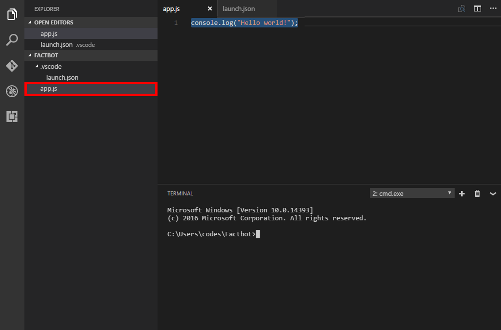

    _Opening the app.js file_	

1. Replace the entire contents of the file with the following code:
 
	```javascript
	var builder = require('botbuilder');
	var connector = new builder.ConsoleConnector().listen();
	var bot = new builder.UniversalBot(connector);
	
	bot.dialog('/', [

    function (session) {
        builder.Prompts.text(session, "Hello, and welcome to Factbot! What's your name?");
    },

    function (session, results) {

        session.userData.name = results.response;
        builder.Prompts.number(session, "Hi " + results.response + ", before we get started, let me find out a few things about you. How many years have you been coding?"); 
    },

    function (session, results) {

        session.userData.yearsCoding = results.response;
        builder.Prompts.choice(session, "What language do you love the most?", ["C#", "JavaScript", "TypeScript", "Visual FoxPro"]);
    },

    function (session, results) {

        session.userData.language = results.response.entity;
        builder.Prompts.choice(session, "What's your favorite midnight snack?", ["Pizza", "Poptarts", "Chicken and waffles", "Kale salad"]);
    },

    function (session, results) {

       session.userData.snack = results.response.entity;   
 
        session.send("Okay, I think I've got it " + session.userData.name + 
                    ": You've been writing code for " + session.userData.yearsCoding + " years," +
                    " love to use " + session.userData.language + ", and" +
                    " you prefer " + session.userData.snack + " as a midnight snack.");

    }
	]);

	```

1. Select **File > Save** to save the changes to your app.js file.

	Review the code and observe the use of the Microsoft Bot Framework Bot Builder prompt actions, such as number, choice, and confirm. These are all conveniently build into the framework. It’s simple to test your bot logic via the terminal as well. 

	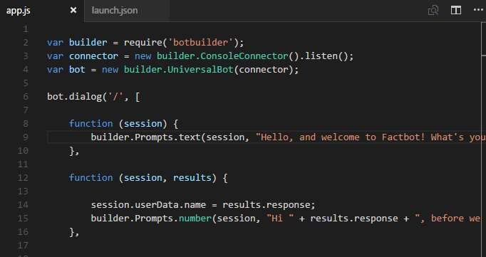

    _Code replaced in the app.js file_

	To run your Factbot to sample real user interaction:

1. Open the Integrated Terminal by clicking **View > Integrated Terminal** in the VS Code menu. The TERMINAL window will appear at the bottom of your environment workspace.

	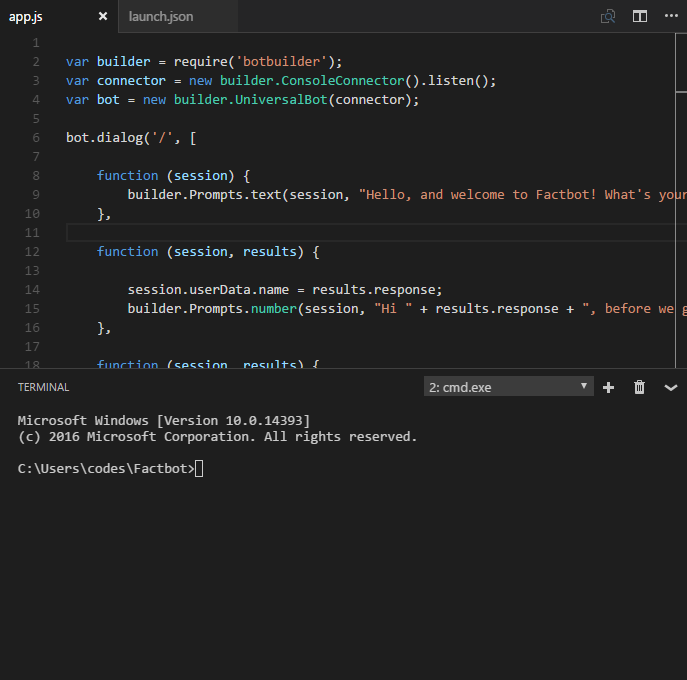

    _The Integrated Terminal window_

1. At the prompt, type “node app.js” (without quotation marks) and hit **enter** on your keyboard. Your bot is now running and listening for interaction.

	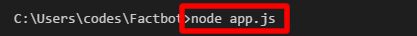

    _Running the Factbot application_

1. Type “hello” (again, without quotation marks) to “wake up” your bot. Factbot will now begin a guided conversation.
	
    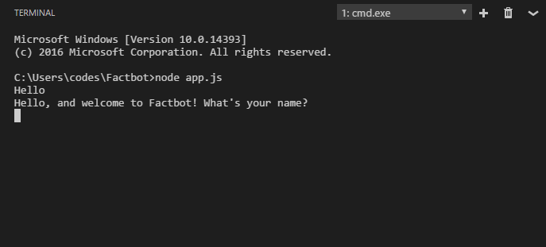

    _"Waking up" the Factbot by typing "Hello"_	

1. Continue answering the questions as Factbot guides you a step at a time.
	
    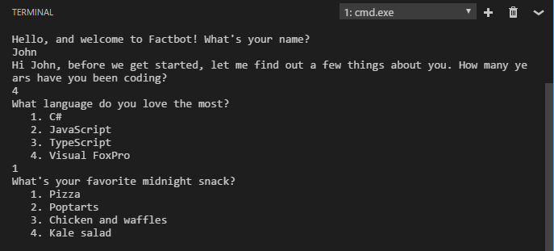

    _Interacting with your bot_	 

	>Bots created with the Microsoft Bot Framework are smart enough to understand variations in your responses. For example, you can type "2", "JavaScript", or "javascript". Your bot will understand these are the same response.

	Up until now, your bot simply guides a user through a simple question and answer format, and doesn’t give a user an opportunity to get a random, interesting fact. The next step will be to write code to access an external REST-based API that exposes the ability to access random facts.

1. In the Visual Studio Code Explorer, select the app.js file created in the previous exercise. The file contents will open in the Editor window.
 	
    

    _App.js opened in the editor window_	 

1. Replace the entire contents of the file with the following code:

	```
	var builder = require('botbuilder');
	var https = require('https');
	
	var connector = new builder.ConsoleConnector().listen();
	var bot = new builder.UniversalBot(connector);
	
	bot.dialog('/', [

    function (session) {
        builder.Prompts.text(session, "Hello, and welcome to Factbot! What's your name?");
    },

    function (session, results) {

        session.userData.name = results.response;
        builder.Prompts.number(session, "Hi " + results.response + ", before we get started, let me find out a few things about you. How many years have you been coding?"); 
    },

    function (session, results) {

        session.userData.yearsCoding = results.response;
        builder.Prompts.choice(session, "What language do you love the most?", ["C#", "JavaScript", "TypeScript", "Visual FoxPro"]);
    },

    function (session, results) {

        session.userData.language = results.response.entity;
        builder.Prompts.choice(session, "What's your favorite midnight snack?", ["Pizza", "Poptarts", "Chicken and waffles", "Kale salad"]);
    },

    function (session, results) {

        session.userData.snack = results.response.entity;       
        builder.Prompts.confirm(session, "Now that I better understand your personality, would you me to grab a random, interesting fact for you to enjoy?");
    },

    function (session, results) {

         session.userData.action = results.response;

        if (session.userData.action == true) {

            var optionsget = {
                host : 'traininglabservices.azurewebsites.net',    
                port : 443,
                path : '/api/Facts/1',  
                method : 'GET'  
            };

            var reqGet = https.request(optionsget, function(res) {                
                res.on('data', function(factResult) {                    
                    session.send(factResult.toString());
                });             
            });
             
            reqGet.end();
            reqGet.on('error', function(e) {
                console.error(e);
            });

            session.send(session.userData.name.toUpperCase() + ", DID YOU KNOW:");
        }
        else {
            session.send("Okay, I think I've got it " + session.userData.name + 
                     ": You've been writing code for " + session.userData.yearsCoding + " years," +
                     " love to use " + session.userData.language + ", and" +
                     " you prefer " + session.userData.snack + " as a midnight snack.");
                      
        }
    }
	]);
	```
1. Select **File > Save** to save the changes to your app.js file.
1. In the TERMINAL window right-click anywhere in the window and select **New Terminal**.
	
    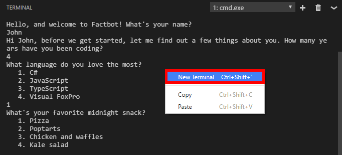

    _Opening a new terminal window_	

1. At the prompt, type “node app.js” (without quotation marks) and hit the **enter** key on your keyboard. Your updated bot is now running and listening for interaction.
	
    

    _Running the Factbot application_	

1. Type “hello” (again, without quotation marks) to “wake up” your bot. 
1. Continue answering the questions as Factbot guides you a step at a time.
	
    

    _Answering questions in a guided conversation_	 

1. When Factbot asks you “[W]ould you like me to grab a random, interesting fact for you to enjoy?” select **1. yes**. by typing either the number "1" (without quotation marks) or the word "yes" (again without quotation marks.)
	
    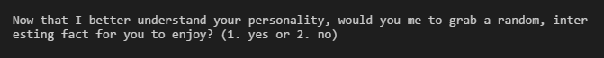

    _Confirming you want to view a random, interesting fact_	 

1. After a short delay a random interesting fact will appear in the TERMINAL window.

	>Feel free to repeat this process as many times as you like. After final confirmation your bot will show you a new random fact every time.
	
    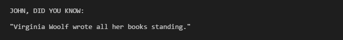

    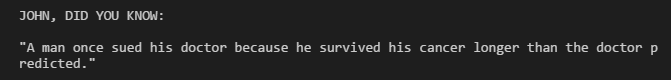

    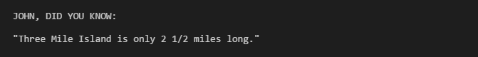

    _Viewing additional facts through guided bot interactions_	 
  
In this exercise you’ve written a fully functional bot that leverages built in features of the Microsoft Bot Framework, and added additional code to call an external REST-based API service. You have also run your bot within the terminal to experience the flow of the guided conversation. Let’s take a look at how we can debug a bot to ensure everything is working as designed, before we publish our bot to our Azure service.

<a name="Exercise5"></a>
## Exercise 5: Debug bot processes ##

Debugging processes requiring input and output, such as a conversational bot is often problematic and cumbersome. The Microsoft Bot Framework makes it easy to debug bot processes on any platform through a number of helpful mechanisms, such as Bot Emulators and external consoles. One simple yet powerful way to debug bot processes is within the Visual Studio Code Integrated Terminal. 

In order to enable real-time bot debugging within the Visual Studio Code Integrated Terminal:

1. In Visual Studio Code Explorer, select the launch.json file to open it in the Editor window.
1. Locate the “console” element and change the value from "internalConsole" to “integratedTerminal”.
 
    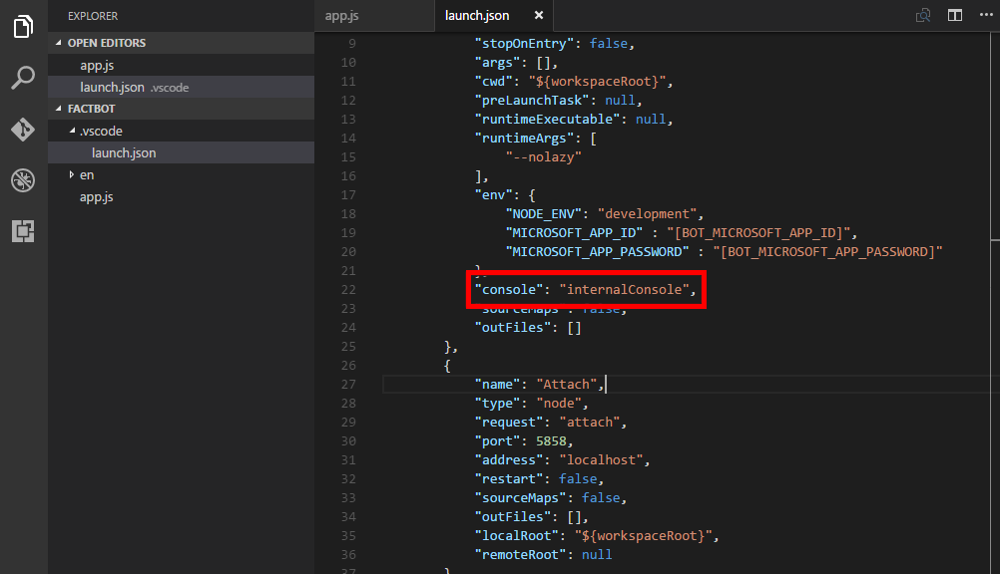

    _Viewing the console element in the launch.json file_	 
  
1. In the Explorer, select the app.js file and click the **left-hand margin** to add a breakpoint at or near line 43.
 
    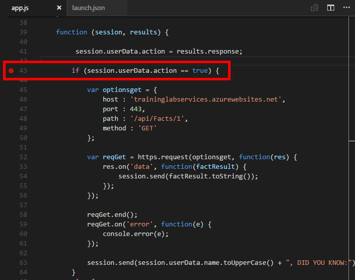

    _Setting a brekpoint in the app.js file_	 
  
1. Navigate to the Debug tab and click the **DEBUG green arrow** to start a debugging session. The TERMINAL window will update with a command to update debugging launch variables.
 
    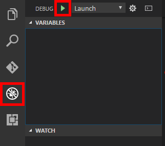

    _Starting a debugging session_	 
 
    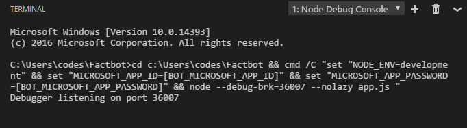

    _Terminal debugging launch variables_	 

	>The first time you start the debugger, the DEBUG CONSOLE will become active. Be sure to switch back over to the Integrated Terminal by selecting **View > Integrated Terminal** from the Visual Studio Code menu.   
  
1. Place your mouse cursor in the TERMINAL window and begin the conversation process from the previous exercise, beginning with typing “Hello” and then hit the **enter** key on your keyboard.
 
    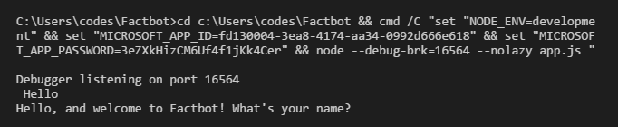

    _"Waking up" the Factbot in a debugging session_	 
 
1. When your bot has gathered the information necessary, and you have responded to whether you would like to see a random, interesting fact, the debugger will break on line 43. 
 
    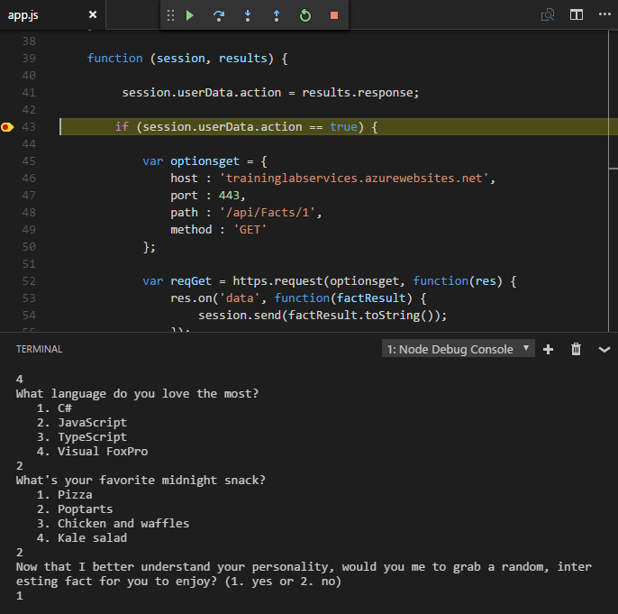

    _The debugger paused on a breakpoint_	 

 Just as in other Visual Studio projects and environments, you can now hover over values, view variables via the Debugger window, and step through your code.
 
    

    _Interacting with a bot in debug mode_	 

1. Click the **Stop (red square)** icon in the Debugging toolbar to end your debugging session.
 
    

    _Ending a bot debugging session_	

It’s just that easy to debug and step through code written with the Microsoft Bot Framework. At this point you have a fully functioning bot and you’re ready to publish it to your Azure Web App for use within third party applications, like Skype.

<a name="Exercise6"></a>
## Exercise 6: Publish and test your bot ##

In this exercise you will publish your bot application using your OneDrive account as an Azure Web App Deployment Source.

To publish your bot your OneDrive and connect it to your Azure Web App:

1. Open the Azure Portal dashboard (if it’s not already open from Exercise 1) and click the **“hamburger” **icon to open the side drawer menu.
1. Click **Resource Groups** followed by **TrainingLabResources**.
1. Select the "Overview" tab.
1. Click **factbot01** (or the alternative name you entered in Step 3 of Exercise 1) to open your newly provisioned Azure Web App to open the App Service blade.
 
    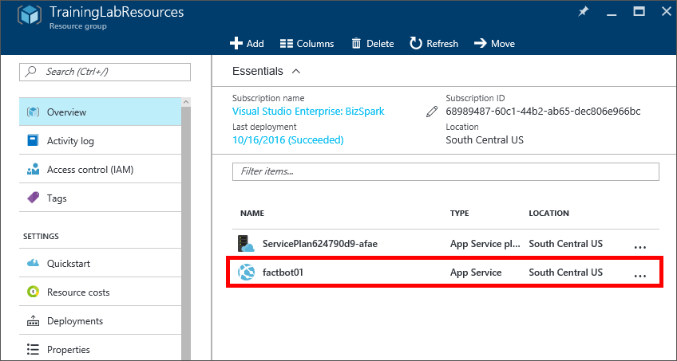

    _Selecting the Azure Web App_	

1. Locate the APP DEPLOYMENT section and click Deployment options.
 
    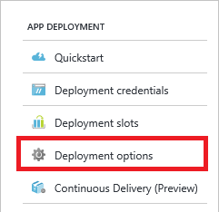

    _Selecting Azure Web App Deployment Options_	

1. In the Deployment source panel click **Choose Source**, and then **OneDrive**.
 
    

    _Selecting OneDrive as the deployment source_	

1. Click **Authorization** and then the **Authorize** button. If prompted for credentials enter your Microsoft account credentials, and then click **OK**. 
 
    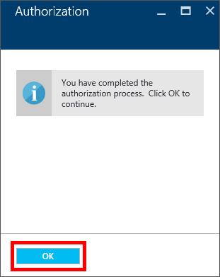

    _Completing OneDrive authorization_	

1. Leave the remaining values in the Deployment source panel as the defaults, and click **OK**. Your bot deployment source has now been configured.
 
    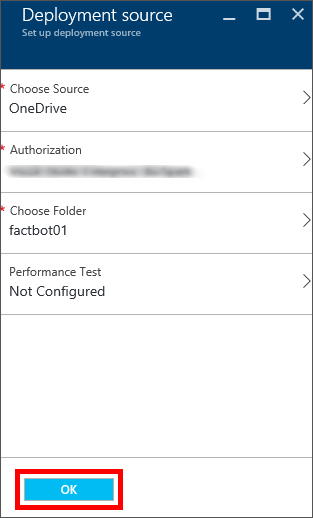

    _Finalizing deployment source setup_	

To publish your bot application to your Azure Web App:

1. Open a browser and go to [OneDrive](https://onedrive.live.com "OneDrive"). If asked to login in, do so with your Microsoft account.
1. In the OneDrive **search box**, type “Azure Web Apps” and select the **Azure Web Apps** folder.
 
    

    _Searching OneDrive for the Azure Web Apps deployment folder_	

1. Click the **factbot** folder to view the contents. At this point the folder should be empty.
 
    

    _Selecting the Factbot folder in OneDrive_	

1. On the OneDrive actions menu, click **Upload > Files**, and browse your local files to the **Resources** folder included in the content for the lab. Select both files in the Resources folder and click **Open**. Your bot project files have now been added to OneDrive and are ready for deployment.
 
    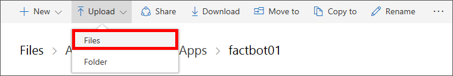

    _Selecting upload to a OneDrive deployment folder_	
 
    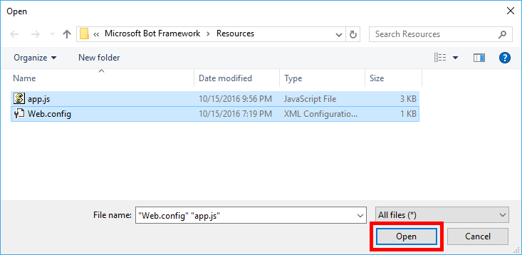

    _Adding the bot deployment files to the OneDrive deployment folder_	

1. Return to the Azure Portal and navigate to the Web App configured for deployment earlier in this exercise.
1. Locate the APP DEPLOYMENT section and click **Deployment options**. Notice the blade display and menu have now changed to prepare for deployment from OneDrive. 
 
    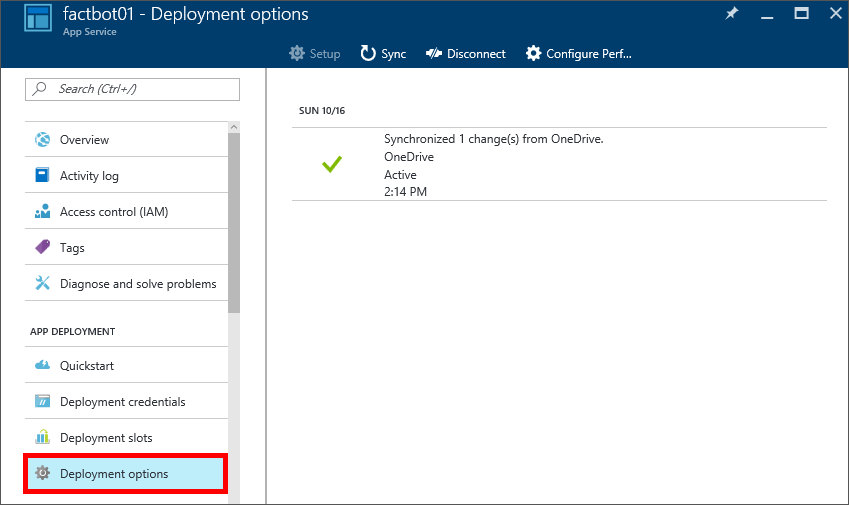

    _Viewing the updated deployment options panel_	

1. Click **Sync** and then accept the prompt to “Synchronize Source Control” content by clicking **Yes**.

    

    _Synchronizing OneDrive deployment files_	

	Your Factbot application files will now be deployed to your Azure Web App. This process typically takes around 20 to 30 seconds. When deployment is complete, an entry will be added to the Deployment options panel with a details status of activity, such as file counts and a timestamp.

    

    _Synchronization complete_	

1. Locate the SETTINGS section and click **Application Settings**, and then scroll down to the “App Settings” section.
 
    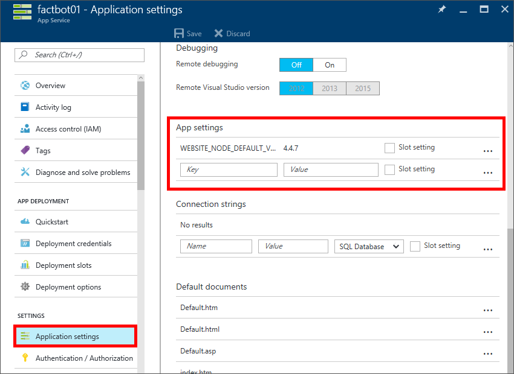

    _The Azure Web App Application settings section_	

1. Add a new key named “MICROSOFT_APP_ID”. Copy and paste the “MICROSOFT_APP_ID” value added to the launch.json file in Exercise 3 into the value field.
1. Add a new key named “MICROSOFT_APP_PASSWORD”. Copy and paste the “MICROSOFT_APP_PASSWORD” value added to the launch.json file in Exercise 3 into the value field and click **Save**.
 
    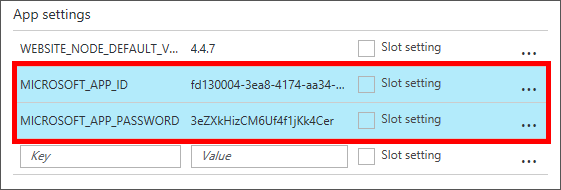

    _Adding the MICROSOFT_APP_ID and MICROSOFT_APP_PASSWORD keys and values_
 
    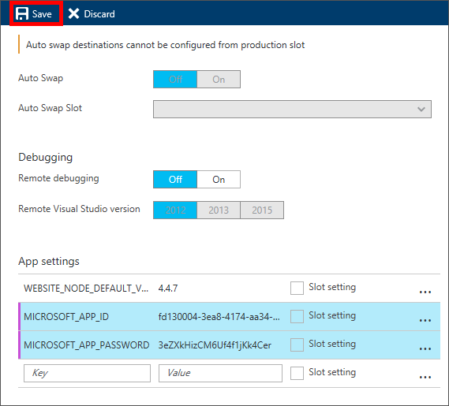

    _Saving Web App Application settings_

1. Locate the DEPLOYMENT TOOLS section and click **Console**. The Azure Web App Console tool will initialize in a new blade.
 
    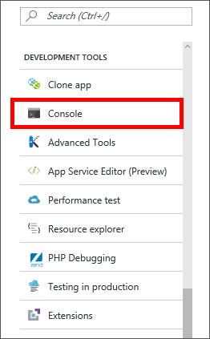

    _Selecting the Web App Console tool_	
 
    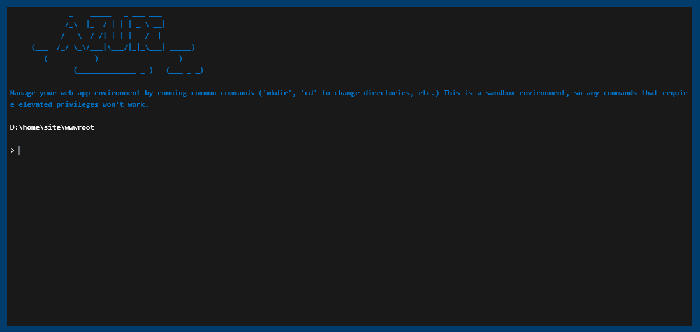

    _The Azure Portal Console tool_	

1. Enter the following command: “npm install --save botbuilder”, and then hit the **enter** key on your keyboard. This command installs the Microsoft Bot Builder SDK into your Azure Web App environment.
 
    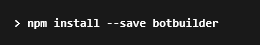

    _Adding support for the Microsoft Bot Builder SDK_	

	>npm commands may take up to 60 seconds to complete.
 
    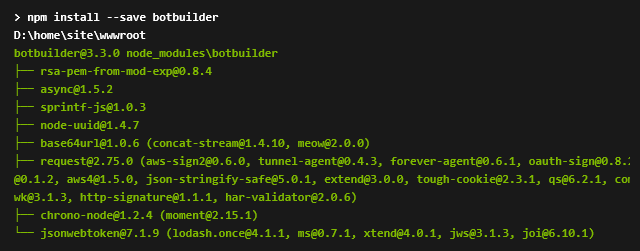

    _A completed Microsoft Bot Builder SDK installation_	

1. When the command completes, enter the following command: “npm install --save restify”, and hit the **enter** key on your keyboard. This command installs the packages required to leverage REST-based messaging routes in your Azure Web App environment.
 
    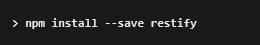

    _Adding support for the REST-based messaging routes_
 
    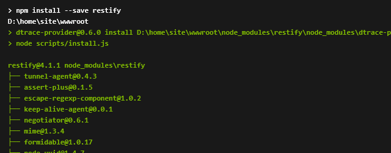

    _A completed Restify installation_

	Now that your bot has been written, tested, and deployed to an Azure Web App, you’re ready to test Factbot in a connected channel.

To connect and test Factbot in a channel:

1. Open the Microsoft Bot Framework portal and click **My Bots** to view a list of your registered bots, and then click **Factbot**. If you only have a single bot registered you will automatically be redirect to the bot registration properties page.
1. Locate the "Test connection to your bot" panel. Click the **Test** button. After a short delay, the word Accepted will appear in the panel.
 
    

    _Testing your deployed bot connection_
 
    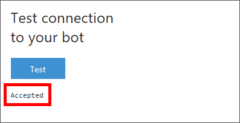

    _A successful bot connection_

1. Locate the “Channels” panel and click **Edit** at the far right of the Skype channel listing.
 
    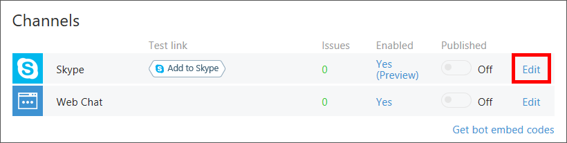

    _Selecting to edit the Skype bot channel_

1. Ensure **Enable Factbot on Skype** is toggled to ON, leave the remaining values as the defaults, and click **I’m done configuring Skype**. Your bot is now ready to test within a Skype conversation.
 
    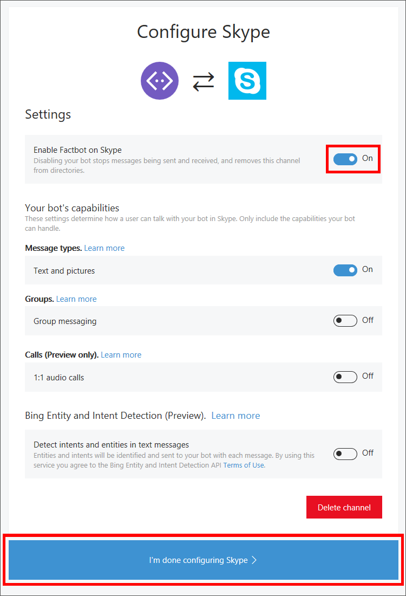

    _Configuring the Skype bot channel_
	
	>If you haven’t installed Skype and this point do so now. The final step in this exercise will be adding Factbot to a Skype conversation.

1. In the "Channels" panel of your Factbot registration settings page, click the **Add to Skype** button to be redirected to the Skype “Add to Contacts” page.
 
    

    _Selecting to add Factbot to Skype_
	
1.  Click the **Add to Contacts** button to add Factbot as a Skype contact, after a short delay, Skype will load a new conversation window, and a new conversation thread between you and Factbot. 
  
    

    _Selecting to add Factbot as a Skype contact_
	
	>If Skype does not automicatlly add Factbot to a conversation, select Factbot from the “Recent” list in Skype to initiate a conversation manually.
  
    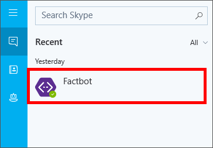

    _Selecting Factbot from the Skype Recent panel_

1. Initiate your Factbot conversation by typing “Hello” in your Skype window. After a short delay, Factbot will begin the guided conversation experienced in Exercise 4, but now in a rich conversation experience. Continue through the conversation until the end, to make sure you get a quick random and interesting fact! 
 
    

    _Factbot serving up a guided conversation via Skype_

You now have a fully functioning bot, created with the Microsoft Bot Framework available for anyone in the world to use. In this exercise we enabled your bot to be connected to a Skype channel, but you may have notices there are many other channels to choose from as well. Feel free to configure other channels to test your bot in as many scenarios as appropriate. 

<a name="Summary"></a>
## Summary ##

In this hands-on lab you learned how to:

- Create an Azure Web App to host a bot
- Create and configure a bot registration
- Setup and configure a bot project 
- Add conversation logic to a bot
- Debug bot processes
- Publish a bot for use with third-party channels

This is just a beginning, as there’s a whole lot more you can do to leverage the power of the Microsoft Bot Framework. Start experimenting with other Microsoft Bot Framework features, especially custom dialogs, extending FormFlow, and integrating Microsoft Language Understanding and Intelligence Services (LUIS) for more robust bot interactions and “guided” conversations.

----

Copyright 2016 Microsoft Corporation. All rights reserved. Except where otherwise noted, these materials are licensed under the terms of the MIT License. You may use them according to the license as is most appropriate for your project. The terms of this license can be found at https://opensource.org/licenses/MIT.