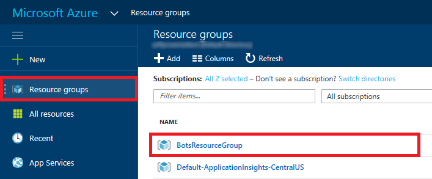

<a name="HOLTitle"></a>
# The Microsoft Bot Framework #

---

<a name="Overview"></a>
## Overview ##

Bots are everywhere. You probably interact with them every day without realizing it. Bots, especially chat and messenger bots, are changing the way we interact with businesses, communities, and even each other. Thanks to light-speed advances in artificial intelligence (AI)  and the easy availability of AI services, bots are not only becoming more advanced and personalized, but also more accessible to developers. 

Regardless of the target language or platform, developers building bots face the same challenges. Bots require basic input and output. Bots need language and dialog logic. Bots need to be responsive, scalable, and extensible, and they need to interact with users in a conversational manner and in the language the user chooses. The Microsoft Bot Framework provides the foundation developers need to build, connect, manage, and publish intelligent bots that interact naturally with users using a range of third-party and custom services. 

In this lab, you will create a bot for use with the Microsoft Bot Framework. The bot will use a Skype channel to return random, interesting facts to a user.

<a name="Objectives"></a>
### Objectives ###

In this hands-on lab, you will learn how to:

- Create an Azure Web App to host a bot
- Create and configure a bot registration
- Set up and configure a bot project 
- Add conversation logic to a bot
- Debug bot processes
- Publish a bot for use with third-party channels

<a name="Prerequisites"></a>
### Prerequisites ###

The following are required to complete this hands-on lab:

- An active Microsoft Azure subscription. Use the Azure Pass you activated earlier, or [sign up for a free trial](http://aka.ms/WATK-FreeTrial).
- [Visual Studio Code](http://code.visualstudio.com) 
- [Skype](https://www.skype.com/en/download-skype/skype-for-computer/)
- [Node.js](https://nodejs.org)

---

<a name="Exercises"></a>
## Exercises ##

This hands-on lab includes the following exercises:

- [Exercise 1: Create an Azure Web App](#Exercise1)
- [Exercise 2: Create and configure a bot registration](#Exercise2)
- [Exercise 3: Set up and configure a bot project](#Exercise3)
- [Exercise 4: Add conversation logic to your bot](#Exercise4)
- [Exercise 5: Debug bot processes](#Exercise5)
- [Exercise 6: Publish and test your bot](#Exercise6)
 
Estimated time to complete this lab: **60** minutes.

<a name="Exercise1"></a>
## Exercise 1: Create an Azure Web App ##

The first step in creating a bot is to provide a location for the bot to be hosted. Azure Web Apps are perfect for hosting bot applications. In this exercise, you will create and configure an Azure Web App.

1. Open the [Azure Portal](https://portal.azure.com) in your browser. If asked to login, do so with your Microsoft Account.

1. Click **+ New**, followed by **Web + Mobile** and then **Web App**.

    

    _Creating a new Azure Web App_

1. Enter a name such as "factbot" (without quotation marks) into the **App name** box. *This name must be unique within Azure, so make sure a green check mark appears next to it.*  Make sure **Create new** is selected under **Resource Group** and enter the resource-group name "BotsResourceGroup" (again, without quotation marks). Then click **Create**.

    

    _Configuring a new Web App_

1. Click **Resource Groups** in the ribbon the left, followed by **BotsResourceGroup** to open the resource group created for the Web App.

    

    _Opening the resource group_

1. Wait until **Last deployment** changes from "Deploying" to "Succeeded" indicating your Web App has been successfully deployed.

	> You may need to refresh the page in your browser from time to time to see the most recent deployment status.

    

    _Successful deployment_

Your Azure Web App is now provisioned and ready to create your bot registration. The URL of the Web App is http://*appname*.azurewebsites.net, where *appname* is the name you entered for the Web App in Step 3 (for example, http://factbot.azurewebsites.net).

<a name="Exercise2"></a>
## Exercise 2: Create and configure a bot registration ##

The next step in building a bot with the Microsoft Bot Framework is creating and configuring a bot registration using the Microsoft Bot Framework Portal. This process will create registration information and access keys you will need in later exercises.

1. Open the [Microsoft Bot Framework Portal](https://dev.botframework.com/) in your browser. If you are not signed in, click **Sign in** in the upper-right corner and sign in with your Microsoft Account.

1. Click **Register a bot** in the menu at the top of the page.

    

    _Registering a bot_

1. In the "Bot profile" section, type "Factbot" (without quotation marks) in the **Name** field. Type a bot handle such as "Factbot" into the **Bot handle** field, and enter a brief description of your bot into the **Description** field.
	
    

    _Registering a bot profile_

1. Scroll down to the "Configuration" section and in the **Messaging endpoint** field, enter the value below, replacing *appname* with the Azure Web App name you entered in Exercise 1, Step 3. Then click the **Create Microsoft App ID and password** button.

	<pre>
	https://<i>appname</i>.azurewebsites.net/api/messages
	</pre>

	> Bot messaging endpoints can only communicate over secure protocols. Observe that the messaging endpoint URL uses HTTPS rather than HTTP.

    

    _Configuring a bot messaging endpoint_

1. An app ID is automatically generated for your bot. Click **Generate an app password to continue** to create an app password.

    

    _Generating an app password_

1. Copy the password into your favorite text editor and save it so you can retrieve it later. **You will not be able to retrieve this password after this step**, but will be required to use it in a later exercise. Once the password is saved, click **Ok** to dismiss the dialog.

    

    _Copying the app password_
	
1. Click the **Finish and go back to Bot framework** button to return to the bot registration page.
	
1. Check the box at the bottom of the form, and then click the **Register** button. Finish up by clicking **OK** to dismiss the dialog that informs you that your bot was successfully registered.
 
    

    _Completing the bot registration_

1. Leave the ensuing page open in your browser so you can easily return to it later.

    

    _Completed bot registration_
	
Your bot is now configured and registered for use with the Microsoft Bot Framework and you are ready to start building your bot.

<a name="Exercise3"></a>
## Exercise 3: Set up and configure a bot project ##

Now that you have created and configured your bot registration, it's time to start building your bot in Visual Studio Code. If you haven't installed Visual Studio Code, take a moment to do so now. You can download Visual Studio Code from http://code.visualstudio.com. You should also install [Node.js](https://nodejs.org) if it isn't already installed.

> An easy way to determine whether Node.js is installed is to open a terminal window or Command Prompt window and execute a **node -v** command. If the Node.js version number is displayed, then Node.js is installed.

1. Open a terminal window or a Command Prompt window and use an **md** or **mkdir** command to create a directory named "Factbot" in the location of your choice. This is the directory that will hold the source code files for your bot.

1. Use a **cd** command to make the directory that you just created the current directory. Then type the following command to start Visual Studio code in that directory:

	<pre>
	code .
	</pre>

1. In the Explorer panel, click the **New File** button to create a new file in the "Factbot" directory and name the file **app.js**. 

    

    _Adding a new project file_

1. Add the following line of code to **app.js**: 

	```
	console.log("Hello world!");
	```

	Then use the **File -> Save** command (or simply press **Ctrl+S**) to save the file.

1. Open an Integrated Terminal by selecting **Integrated Terminal** from the **View** menu. The TERMINAL window will appear at the bottom of your workspace. 

    

    _Opening the Integrated Terminal_

1. In the TERMINAL window, execute the following command:
 
	<pre>
	npm install --save botbuilder
	</pre>

	This command installs the Microsoft Bot Builder SDK into your environment.

1. Now execute this command in the TERMINAL window:

	<pre>
	npm install --save restify
	</pre>

	This command installs the packages required to leverage REST-based messaging routes in your bot code.

1. Execute the following command in the TERMINAL window to run the application and output "Hello world!":

	<pre>
	node app.js
	</pre>

1. The next step is to generate a bot configuration file and insert values obtained from the Microsoft Bot Framework portal in the previous exercise. To begin, click the **Debug** button in the ribbon on the left side of Visual Studio Code.

    

    _Opening the debugger_	

1.	Click the **green arrow** at the top of the debugging panel and then select **Node.js** from the drop-down list. A new file named **launch.json** will be created. When prompted to set up the launch configuration file, click **Close**.
	
    

    _Creating a new launch file_	
	
1.	Add the "env" section highlighted below to the "configuration" section of **launch.json**, and include the app ID and app password generated for your bot in Exercise 2.	
	
	

    _Adding bot registration values_	

1.	Save your changes to **launch.json**. Then close the file.
	
1.	Click the **Explorer** button on the left, and then click the **New Folder** button to create a new folder named "en" (without quotation marks) in the "Factbot" directory.
	
    

    _Adding a new folder_	

	> The "en" folder is not required for your bot to work correctly. However, the Bot Builder SDK will display warnings in the Integrated Terminal if a default language folder is not present.

Your bot project is now setup and configured. The next step is to write code to provide simple responses to a user from your bot, and then add conversation logic to provide a more meaningful experience.

<a name="Exercise4"></a>
## Exercise 4: Add conversation logic to your bot ##

The entire goal of creating a bot is to have intelligent, automated interactions with users. Now that all the configuration, registration, and project setup are complete, you can start coding your bot.

1. In Visual Studio Code, open **app.js** if it isn't already open. Then replace the contents of the file with the following JavaScript code:
 
	```javascript
	var builder = require('botbuilder');
	var connector = new builder.ConsoleConnector().listen();
	var bot = new builder.UniversalBot(connector);
	
	bot.dialog('/', [

    function (session) {
        builder.Prompts.text(session, "Hello, and welcome to Factbot! What's your name?");
    },

    function (session, results) {

        session.userData.name = results.response;
        builder.Prompts.number(session, "Hi " + results.response + ", before we get started, let me find out a few things about you. How many years have you been coding?"); 
    },

    function (session, results) {

        session.userData.yearsCoding = results.response;
        builder.Prompts.choice(session, "What language do you love the most?", ["C#", "JavaScript", "TypeScript", "Visual FoxPro"]);
    },

    function (session, results) {

        session.userData.language = results.response.entity;
        builder.Prompts.choice(session, "What's your favorite midnight snack?", ["Pizza", "Poptarts", "Chicken and waffles", "Kale salad"]);
    },

    function (session, results) {

       session.userData.snack = results.response.entity;   
 
        session.send("Okay, I think I've got it " + session.userData.name + 
                    ": You've been writing code for " + session.userData.yearsCoding + " years," +
                    " love to use " + session.userData.language + ", and" +
                    " you prefer " + session.userData.snack + " as a midnight snack.");

    }
	]);

	```

1. Save your changes to **app.js**. Then, In the TERMINAL window, execute the following command to run your bot:

	<pre>
	node app.js
	</pre>

1. Type "hello" (without quotation marks) and press **Enter** to wake up your bot. Factbot will now begin a guided conversation.
	
    

    _"Waking up" the bot_	

1. Answer the questions Factbot prompts you with.
	
    

    _Interacting with your bot_	 

	> Bots created with the Microsoft Bot Framework are smart enough to understand variations in your responses. For example, you can type "2", "JavaScript", or "javascript". Your bot will understand these are the same response.

1. Now let's modify the bot to use an external REST-based API to retrieve random facts. In Visual Studio Code, replace the contents of **app.js** with the following code:
 	
	```JavaScript
	var builder = require('botbuilder');
	var https = require('https');
	
	var connector = new builder.ConsoleConnector().listen();
	var bot = new builder.UniversalBot(connector);
	
	bot.dialog('/', [

    function (session) {
        builder.Prompts.text(session, "Hello, and welcome to Factbot! What's your name?");
    },

    function (session, results) {

        session.userData.name = results.response;
        builder.Prompts.number(session, "Hi " + results.response + ", before we get started, let me find out a few things about you. How many years have you been coding?"); 
    },

    function (session, results) {

        session.userData.yearsCoding = results.response;
        builder.Prompts.choice(session, "What language do you love the most?", ["C#", "JavaScript", "TypeScript", "Visual FoxPro"]);
    },

    function (session, results) {

        session.userData.language = results.response.entity;
        builder.Prompts.choice(session, "What's your favorite midnight snack?", ["Pizza", "Poptarts", "Chicken and waffles", "Kale salad"]);
    },

    function (session, results) {

        session.userData.snack = results.response.entity;       
        builder.Prompts.confirm(session, "Now that I better understand your personality, would you me to grab a random, interesting fact for you to enjoy?");
    },

    function (session, results) {

         session.userData.action = results.response;

        if (session.userData.action == true) {

            var optionsget = {
                host : 'traininglabservices.azurewebsites.net',    
                port : 443,
                path : '/api/Facts/1',  
                method : 'GET'  
            };

            var reqGet = https.request(optionsget, function(res) {                
                res.on('data', function(factResult) {                    
                    session.send(factResult.toString());
                });             
            });
             
            reqGet.end();
            reqGet.on('error', function(e) {
                console.error(e);
            });

            session.send(session.userData.name.toUpperCase() + ", DID YOU KNOW:");
        }
        else {
            session.send("Okay, I think I've got it " + session.userData.name + 
                     ": You've been writing code for " + session.userData.yearsCoding + " years," +
                     " love to use " + session.userData.language + ", and" +
                     " you prefer " + session.userData.snack + " as a midnight snack.");
                      
        }
    }
	]);
	```

1. Save your changes to **app.js**. In the TERMINAL window, press **Ctrl+C** to terminate the running **app.js** file. Then start the modified bot using the following command:

	<pre>
	node app.js
	</pre>

1. Type "hello" (without quotation marks) and press **Enter** to wake up your bot. Answer the questions asked by the bot. When Factbot asks "would you like me to grab a random, interesting fact for you to enjoy," respond by typing "yes" (again, without quotation marks). After a short pause, a random fact will appear in the TERMINAL window.
	
    

    _Random fact displayed by FactBot_	 

In this exercise, you wrote a fully functional bot that leverages built-in features of the Microsoft Bot Framework, and added additional code to call an external REST-based API service. You have also run your bot within the terminal to experience the flow of the guided conversation. Let’s take a look at how we can debug a bot to ensure everything is working as designed, before we publish our bot to our Azure service.

<a name="Exercise5"></a>
## Exercise 5: Debug bot processes ##

The Microsoft Bot Framework makes it easy to debug bot processes on any platform through a number of helpful mechanisms, such as bot emulators and external consoles. In this exercise, you will learn how to use Visual Studio code to debug bots by setting breakpoints and stepping through code.

1. In Visual Studio Code, open **launch.json** for editing. Add the "console" property highlighted below, and then save your changes.

    

    _Modifying launch.json_	 
  
1. Open **app.js** and add a breakpoint at line 41 by clicking in the margin to the left of the line number.
 
    

    _Setting a brekpoint in app.js_ 
  
1. Click the **Debug** button in the ribbon on the left, and then click the **green arrow** to start a debugging session.
 
    

    _Starting a debugging session_	 
 
1. Type "hello" into the TERMINAL window and press **Enter**. Then answer the bot's questions, and be sure to answer "yes" when asked if you want to see a random fact.
 
1. Visual Studio Code will break on line 41. Hover over any variable or parameter to see its value. Then click the **Step Over** button a few times to step through the code. 
 
    

    _Stepping through the code_	 

1. Click the **Stop** button to end the debugging session.
 
    

    _Ending a debugging session_	

It is just that easy to debug and step through code written with the Microsoft Bot Framework. At this point you have a fully functioning bot and you're ready to publish it to your Azure Web App for use within third party applications, like Skype.

<a name="Exercise6"></a>
## Exercise 6: Publish and test your bot ##

In this exercise you will publish your bot application using your OneDrive account as an Azure Web App Deployment Source.

To publish your bot your OneDrive and connect it to your Azure Web App:

1. Open the Azure Portal dashboard (if it’s not already open from Exercise 1) and click the **“hamburger” **icon to open the side drawer menu.

1. Click **Resource Groups** followed by **TrainingLabResources**.

1. Select the "Overview" tab.

1. Click **factbot01** (or the alternative name you entered in Step 3 of Exercise 1) to open your newly provisioned Azure Web App to open the App Service blade.
 
    

    _Selecting the Azure Web App_	

1. Locate the APP DEPLOYMENT section and click Deployment options.
 
    

    _Selecting Azure Web App Deployment Options_	

1. In the Deployment source panel click **Choose Source**, and then **OneDrive**.
 
    

    _Selecting OneDrive as the deployment source_	

1. Click **Authorization** and then the **Authorize** button. If prompted for credentials enter your Microsoft account credentials, and then click **OK**. 
 
    

    _Completing OneDrive authorization_	

1. Leave the remaining values in the Deployment source panel as the defaults, and click **OK**. Your bot deployment source has now been configured.
 
    

    _Finalizing deployment source setup_	

To publish your bot application to your Azure Web App:

1. Open a browser and go to [OneDrive](https://onedrive.live.com "OneDrive"). If asked to login in, do so with your Microsoft account.

1. In the OneDrive **search box**, type “Azure Web Apps” and select the **Azure Web Apps** folder.
 
    

    _Searching OneDrive for the Azure Web Apps deployment folder_	

1. Click the **factbot** folder to view the contents. At this point the folder should be empty.
 
    

    _Selecting the Factbot folder in OneDrive_	

1. On the OneDrive actions menu, click **Upload > Files**, and browse your local files to the **Resources** folder included in the content for the lab. Select both files in the Resources folder and click **Open**. Your bot project files have now been added to OneDrive and are ready for deployment.
 
    

    _Selecting upload to a OneDrive deployment folder_	
 
    

    _Adding the bot deployment files to the OneDrive deployment folder_	

1. Return to the Azure Portal and navigate to the Web App configured for deployment earlier in this exercise.

1. Locate the APP DEPLOYMENT section and click **Deployment options**. Notice the blade display and menu have now changed to prepare for deployment from OneDrive. 
 
    

    _Viewing the updated deployment options panel_	

1. Click **Sync** and then accept the prompt to “Synchronize Source Control” content by clicking **Yes**.

    

    _Synchronizing OneDrive deployment files_	

	Your Factbot application files will now be deployed to your Azure Web App. This process typically takes around 20 to 30 seconds. When deployment is complete, an entry will be added to the Deployment options panel with a details status of activity, such as file counts and a timestamp.

    

    _Synchronization complete_	

1. Locate the SETTINGS section and click **Application Settings**, and then scroll down to the “App Settings” section.
 
    

    _The Azure Web App Application settings section_	

1. Add a new key named “MICROSOFT_APP_ID”. Copy and paste the “MICROSOFT_APP_ID” value added to the launch.json file in Exercise 3 into the value field.

1. Add a new key named “MICROSOFT_APP_PASSWORD”. Copy and paste the “MICROSOFT_APP_PASSWORD” value added to the launch.json file in Exercise 3 into the value field and click **Save**.
 
    

    _Adding the MICROSOFT_APP_ID and MICROSOFT_APP_PASSWORD keys and values_
 
    

    _Saving Web App Application settings_

1. Locate the DEPLOYMENT TOOLS section and click **Console**. The Azure Web App Console tool will initialize in a new blade.
 
    

    _Selecting the Web App Console tool_	
 
    

    _The Azure Portal Console tool_	

1. Enter the following command: “npm install --save botbuilder”, and then hit the **enter** key on your keyboard. This command installs the Microsoft Bot Builder SDK into your Azure Web App environment.
 
    

    _Adding support for the Microsoft Bot Builder SDK_	

	>npm commands may take up to 60 seconds to complete.
 
    

    _A completed Microsoft Bot Builder SDK installation_	

1. When the command completes, enter the following command: “npm install --save restify”, and hit the **enter** key on your keyboard. This command installs the packages required to leverage REST-based messaging routes in your Azure Web App environment.
 
    

    _Adding support for the REST-based messaging routes_
 
    

    _A completed Restify installation_

	Now that your bot has been written, tested, and deployed to an Azure Web App, you’re ready to test Factbot in a connected channel.

1. Open the Microsoft Bot Framework portal and click **My Bots** to view a list of your registered bots, and then click **Factbot**. If you only have a single bot registered you will automatically be redirect to the bot registration properties page.
1. Locate the "Test connection to your bot" panel. Click the **Test** button. After a short delay, the word Accepted will appear in the panel.
 
    

    _Testing your deployed bot connection_
 
    

    _A successful bot connection_

1. Locate the “Channels” panel and click **Edit** at the far right of the Skype channel listing.
 
    

    _Selecting to edit the Skype bot channel_

1. Ensure **Enable Factbot on Skype** is toggled to ON, leave the remaining values as the defaults, and click **I’m done configuring Skype**. Your bot is now ready to test within a Skype conversation.
 
    

    _Configuring the Skype bot channel_
	
	>If you haven’t installed Skype and this point do so now. The final step in this exercise will be adding Factbot to a Skype conversation.

1. In the "Channels" panel of your Factbot registration settings page, click the **Add to Skype** button to be redirected to the Skype “Add to Contacts” page.
 
    

    _Selecting to add Factbot to Skype_
	
1.  Click the **Add to Contacts** button to add Factbot as a Skype contact, after a short delay, Skype will load a new conversation window, and a new conversation thread between you and Factbot. 
  
    

    _Selecting to add Factbot as a Skype contact_
	
	>If Skype does not automicatlly add Factbot to a conversation, select Factbot from the “Recent” list in Skype to initiate a conversation manually.
  
    

    _Selecting Factbot from the Skype Recent panel_

1. Initiate your Factbot conversation by typing “Hello” in your Skype window. After a short delay, Factbot will begin the guided conversation experienced in Exercise 4, but now in a rich conversation experience. Continue through the conversation until the end, to make sure you get a quick random and interesting fact! 
 
    

    _Factbot serving up a guided conversation via Skype_

You now have a fully functioning bot, created with the Microsoft Bot Framework available for anyone in the world to use. In this exercise we enabled your bot to be connected to a Skype channel, but you may have notices there are many other channels to choose from as well. Feel free to configure other channels to test your bot in as many scenarios as appropriate. 

<a name="Summary"></a>
## Summary ##

In this hands-on lab you learned how to:

- Create an Azure Web App to host a bot
- Create and configure a bot registration
- Setup and configure a bot project 
- Add conversation logic to a bot
- Debug bot processes
- Publish a bot for use with third-party channels

This is just a beginning, as there’s a whole lot more you can do to leverage the power of the Microsoft Bot Framework. Start experimenting with other Microsoft Bot Framework features, especially custom dialogs, extending FormFlow, and integrating Microsoft Language Understanding and Intelligence Services (LUIS) for more robust bot interactions and “guided” conversations.

----

Copyright 2016 Microsoft Corporation. All rights reserved. Except where otherwise noted, these materials are licensed under the terms of the Apache License, Version 2.0. You may use it according to the license as is most appropriate for your project on a case-by-case basis. The terms of this license can be found in [http://www.apache.org/licenses/LICENSE-2.0](http://www.apache.org/licenses/LICENSE-2.0).