
# Load, Query, and Visualize Data With Azure Data Lake Store and Analytics #

---

## Overview ##

[Azure Data Lake](https://azure.microsoft.com/en-us/solutions/data-lake/) enables you to capture data of any size, type, and velocity in one place in order to explore, analyze, and process the data in a platform-agnostic manner using tools and languages you already know. It works with existing IT investments for identity, management, and security. It also integrates seamlessly with operational stores and data warehouses.

Data Lake consists of two primary elements: Data Lake Store and Data Lake Analytics. Azure Data Lake Store is an enterprise-wide hyper-scale repository for big-data analytical workloads. Azure Data Lake Analytics is an easy-to-learn query and analytics engine based on a new query language called U-SQL, which combines elements of traditional SQL syntax with powerful expression support and programmatic extensibility. This lab will introduce you to Data Lake Store and Data Lake Analytics and walk you through a handful of typical user scenarios for each.

### Objectives ###

In this hands-on lab, you will learn how to:

- Set up Azure Data Lake Store and Analytics accounts
- Import data into Azure Data Lake Store
- Run U-SQL jobs in Azure Data Lake Analytics 
- Federate Azure SQL Databases with U-SQL 
- Visualize Azure Data Lake query results using Power BI (*Windows users only*)

### Prerequisites ###

The following are required to complete this hands-on lab:

- A Microsoft Azure subscription - [sign up for a free trial](http://aka.ms/WATK-FreeTrial)
- [Azure Cross-Platform Command Line Interface (CLI)](https://azure.microsoft.com/en-us/documentation/articles/xplat-cli-install/)

---

## Exercises ##

This hands-on lab includes the following exercises:

- [Exercise 1: Create an Azure Data Lake Store](#Exercise1)
- [Exercise 2: Create an Azure Data Lake Analytics account](#Exercise2)
- [Exercise 3: Import data into Azure Data Lake Store](#Exercise3)
- [Exercise 4: Query a TSV file with U-SQL](#Exercise4)
- [Exercise 5: Query an Azure SQL Database with U-SQL](#Exercise5)
- [Exercise 6: Perform a federated query with U-SQL](#Exercise6)

Estimated time to complete this lab: **60** minutes.

## Exercise 1: Create an Azure Data Lake Store

In this exercise, you will create a new Azure Data Lake Store in your Azure subscription. Later, you will import data into the store, query it with U-SQL, and visualize the results. 

1. In your browser, navigate to the [Azure Portal](https://portal.azure.com). If you're asked to sign in, do so using your Microsoft account.

1. In the portal, click **+ New -> Data + Storage -> Data Lake Store (preview)**.

    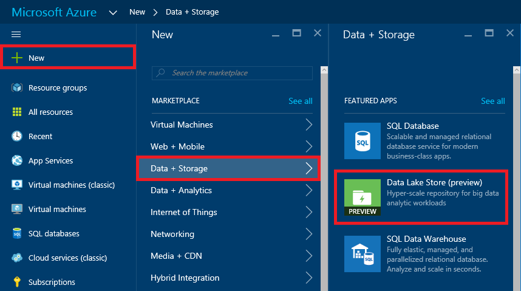

    _Adding a new Data Lake Store_

1. In the "New Data Lake Store" blade, enter a unique name for your Data Lake Store in all lowercase. The name must be unique within Azure since it becomes part of the store's DNS name. Make sure **Create new** is selected under **Resource Group**, and then enter a resource-group name such as "DataLakeResourceGroup" (without quotation marks). Choose the location nearest you, and then click **Create**.

	> If there are any input errors, such as spaces in the resource-group name, the offending fields will be flagged with red excalamation points. Hover the mouse cursor over an exclamation point for help resolving the error.

    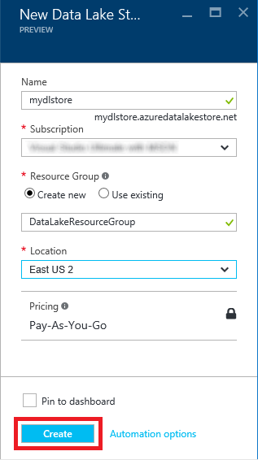

    _Creating a Data Lake Store_

1. Click **Resource groups** in the ribbon on the left, and then click the resource group whose name you specified in the previous step.

    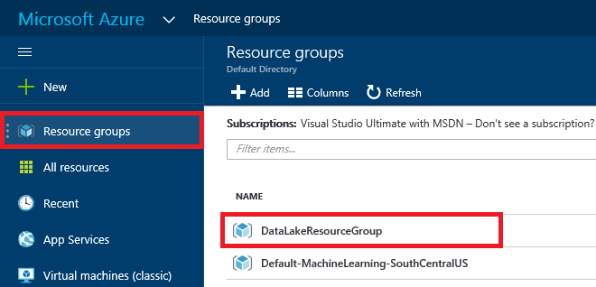

    _Opening the resource group_

1. When "(Deploying)" changes to succeeded, the Data Lake Store has been created. Deployment typically takes a minute or less. You may have to refresh the page in your browser to ascertain that the deployment has finished.

    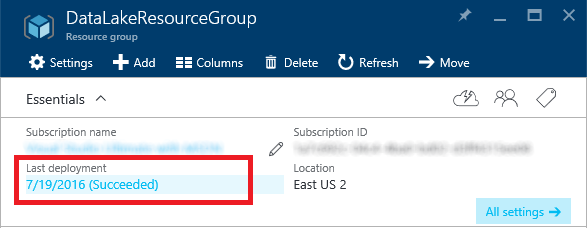

    _Deployment succeeded_

Now that you have created a Data Lake Store, the next step is to create a Data Lake Analytics account so you can run queries against the store.

## Exercise 2: Create an Azure Data Lake Analytics account

Azure Data Lake formally separates the concepts of storing data and querying data. This allows Azure Data Lake Analytics to operate against a range of possible data sources contained in an Azure Data Lake Store. In this exercise, you will create an Azure Data Lake Analytics account and associate it with the Data Lake Store you created in the previous exercise.

1. In the portal, click **+ New -> Data + Analytics -> Data Lake Analytics (preview)**.

    

    _Adding a new Data Lake Analytics account_

1. In the "New Data Lake Analytics" blade, enter a name for the new account. Once more, the name must be unique across Azure because it becomes part of a DNS name. Select **Use existing** under **Resource Group** and select the resource group that you created in Exercise 1. Then select the same location you selected for the Data Lake Store in Exercise 1. Finally, click **Data Lake Store** and select the Data Lake Store you created in Exercise 1 to associate the Data Lake Analytics account with your Data Lake Store. 

	When you're finished, click the **Create** button at the bottom of the "New Data Lake Analytics" blade.

    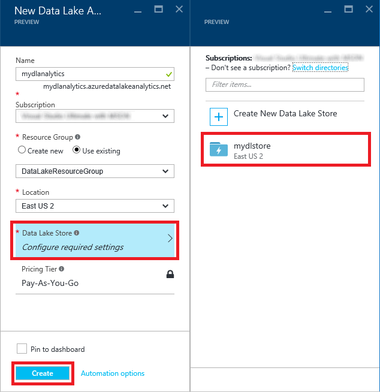

    _Creating a Data Lake Analytics account_

1. Return to the resource group that holds the Data Lake Store and the Data Lake Analytics account. Click the Data Lake Analytics account and wait for "(Deploying)" to change to "(Succeeded)." Once more, it helps to refresh the page every now and then to make sure the information displayed there is up to date.

You now have Azure Data Lake storage and query capability set up in your Azure subscription. Now let's add some data to query against.

## Exercise 3: Import data into Azure Data Lake Store

This lab's "resources" directory holds several files containing sample data. This data exists in the public domain and consists of questions and answers from the popular academia-focused site http://academia.stackexchange.com. In this exercise, you will import some of the sample data into your Azure Data Lake Store account so you can execute queries against it.

1. In the portal, open the Azure Data Lake Store that you created in Exercise 1. When the blade opens, select **Data Explorer** near the top.

    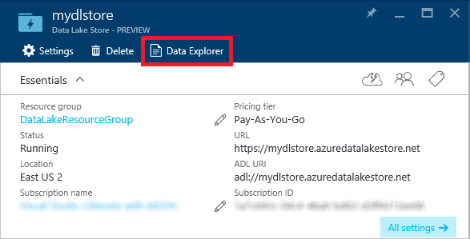

    _Opening Data Explorer_

1. A new blade will open. At the top, click **Upload**.

    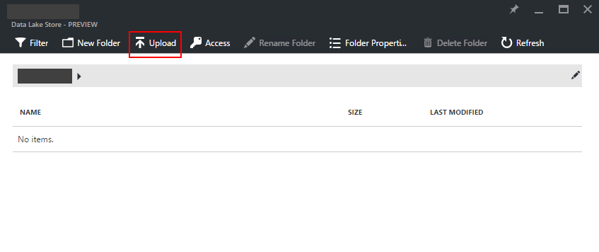

    _Opening the upload blade_
    
1. In the "Upload files" blade, click the folder icon and select the **posts.tsv** file in this lab's "resources" directory. Then click **Start upload**. The file is 60 MB in length, so the upload will take a few minutes.

    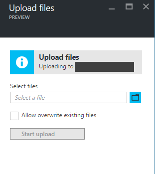

    _Uploading posts.tsv_

1. Repeat this process to upload **comments.tsv**, which is also located in the "resources" directory. Then close the **Upload files** blade and return to the blade for your Data Lake Store. Confirm that both of the sample data files you uploaded appear there:

    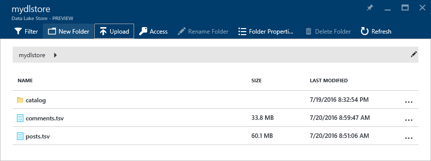

    _Data Explorer with completed uploads_
    
1. Click **posts.tsv** to open a "File Preview" blade showing the contents of the file.

The file preview only shows a portion of the data file. The next step is to query the data. For that, Azure Data Lake provides U-SQL. 

## Exercise 4: Query a TSV file with U-SQL

[U-SQL](http://usql.io/) is a new language created by Microsoft that combines traditional SQL Data Definition Language (DDL) and Data Manipulation Language (DML) constructs with expressions, functions, and operators based on the popular C# programming language. It marries the benefits of SQL with the power of expressive code. And it is supported natively in Azure Data Lake. In this exercise, you will use U-SQL to query the data you imported in Exercise 3.

1. In the portal, open the Azure Data Lake Analytics account that you created in [Exercise 2](#Exercise2). In the ensuing blade, click **New Job** to create a new U-SQL job.

    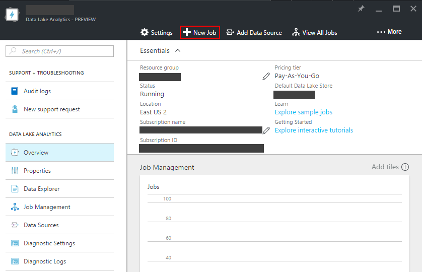

    _Creating a new U-SQL job_

1. In the "New U-SQL Job" blade, paste the following query into the empty query field:

	<pre>
	// here we define the schema for the imported posts.tsv file
	@posts =
	    EXTRACT id          		int,
	            [type]      		string,
				acceptedanswerid	int?,
				parentquestionid	int?,
				creationdate		string,
	            score       		int,
			   	views				int,
				ownerid				int,
	            title       		string,
				body				string,
				tags				string,
				answers				int,
				comments			int
	    FROM "posts.tsv"
	    USING Extractors.Tsv();
	
	// here we transform the imported data using various aggregate functions
	@results =
	    SELECT
	        ownerid AS userid,
	        SUM(score) AS totalscore,
			COUNT(*) AS totalposts
	    FROM @posts
	GROUP BY ownerid;
	
	// finally we output the transformed data for further analysis or visualization
	OUTPUT @results
	    TO "totalscores.csv"
	    ORDER BY totalscore DESC
	    USING Outputters.Csv();
	</pre>

	Here's how the blade will look after the query is entered:

    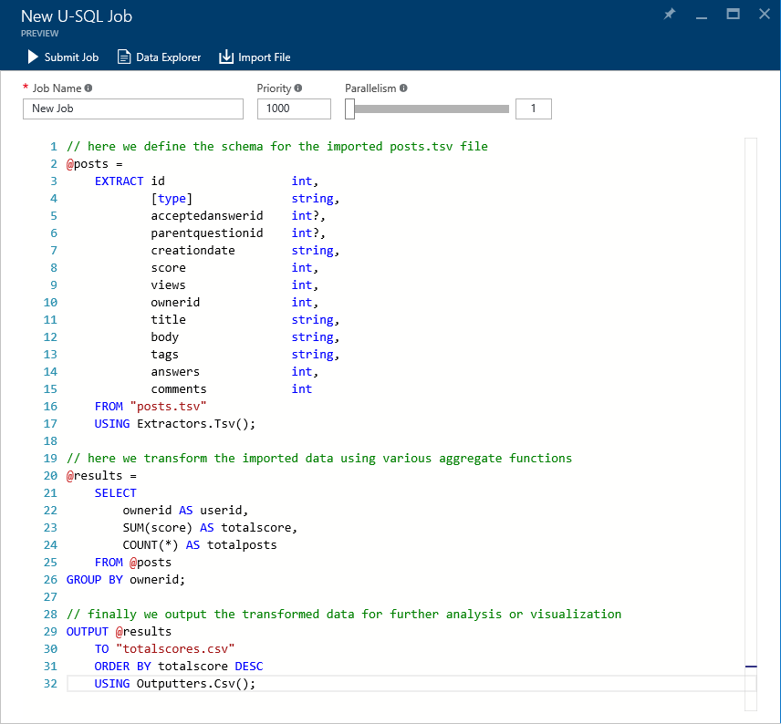

    _A simple U-SQL query_

    The query contains three main parts. The **EXTRACT** statement extracts data from an existing data source, in this case the tab-delimited **posts.tsv** file you uploaded to the Data Lake Store. The **SELECT** statement transforms the input data into a shape suitable to the task at hand. Finally, the **OUTPUT** statement outputs the result as a named rowset, which can be used for further analysis or visualization.

1. Click the **Submit Job** button at the top of the blade. A new blade will open to show what is happening as the Data Lake Analytics engine prepares, queues, and executes your query. The job is complete when the "Finalizing" step turns green.

    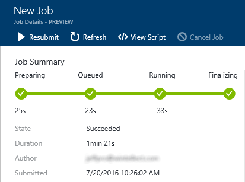

    _The completed job_

1. Return to the blade for your Data Lake Store and click **Data Explorer** at the top of the blade. Then click **totalscores.csv** to view the query results and verify that it contains three columns of data.

    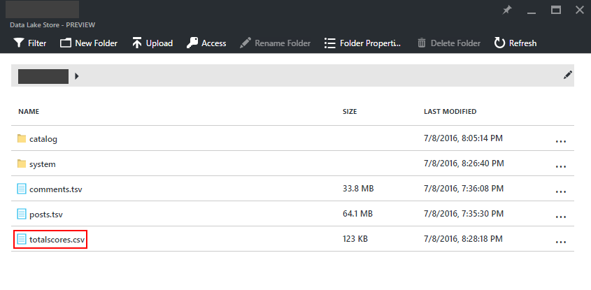

    _Total scores CSV query results_

Later, you will learn how to join multiple data sources and perform more complex queries, as well as how to visualize the results in more interesting ways.

## Exercise 5: Query an Azure SQL Database with U-SQL

In the previous exercise, you issued a simple query against a single file in an Azure Data Lake Store. To make things more interesting, you are next going to create a small SQL Database in your Azure subscription, and then configure it to serve as a federated data source in Data Lake Analytics. This will allow you to not only query that SQL Database with U-SQL, but also join data from the SQL Database to data already residing in your Data Lake Store. With this, you can start to see the power of Azure Data Lake as a distributed storage and analytics engine.

Enable federated queries will require a series of steps: 

- Create an Azure storage account in your Azure subscription
- Upload a SQL Database backup file (a .bacpac file) to the new storage account
- Create a new SQL Database in your Azure subscription and restore it from the .bacpac file
- Configure your Data Lake Analytics account to query against the SQL Database

Let's get started!

1. In the Azure Portal, click **+ New -> Data + Storage -> Storage account**.

    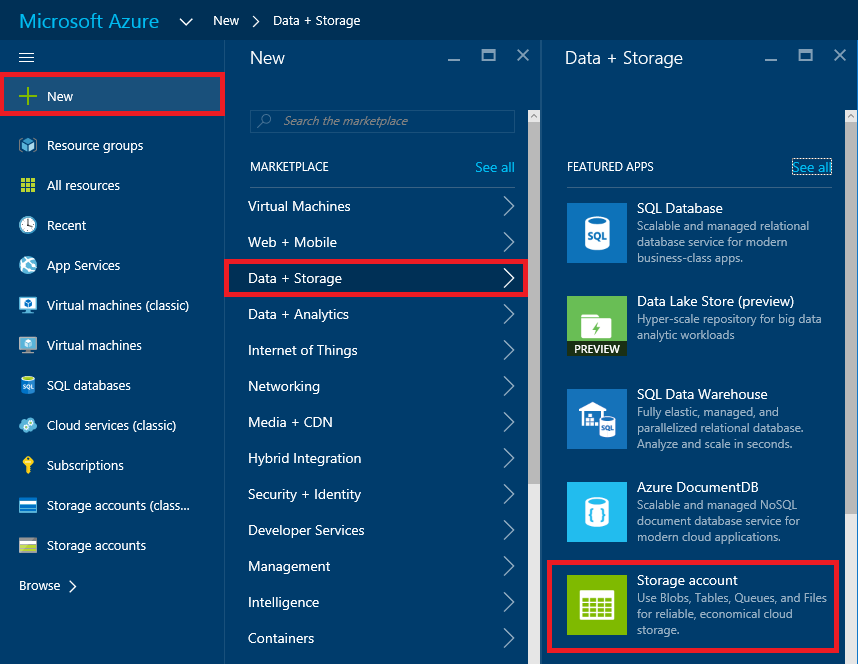

    _Adding a storage account_

1. In the ensuing "Create storage account" blade, enter a name for the new storage account in **Name** field. Storage account names can be 3 to 24 characters in length and can only contain numbers and lowercase letters. In addition, the name you enter must be unique within Azure. If someone else has chosen the same name, you'll be notified that the name isn't available with a red exclamation mark in the **Name** field.

	Once you have a name that Azure will accept (as indicated by the green check mark in the **Name** field), make sure **Resource manager** is selected as the deployment model and **General purpose** is selected as the account kind. Then select **Locally-redundant storage (LRS)** as the replication type.

	Select **Use existing** under **Resource group** and select the resource group that you created in Exercise 1. Then select the location that you selected for the Data Lake Store in Exercise 1. Finish up by clicking the **Create** button at the bottom of the blade to create the new storage account.
    
	

    _Specifying parameters for a new storage account_

1. Once the storage account has been created, click **Resource groups** in the ribbon on the left, and then click the resource group that you created in Exercise 1.

    

    _Opening the resource group_

1. Now you need to create a container in the storage account to hold your database backup. To begin, click **Blobs** in the storage account's blade.

    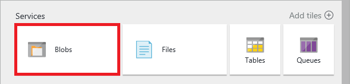

    _Opening blob storage_

1. Click **+ Container** at the top of the blade.

    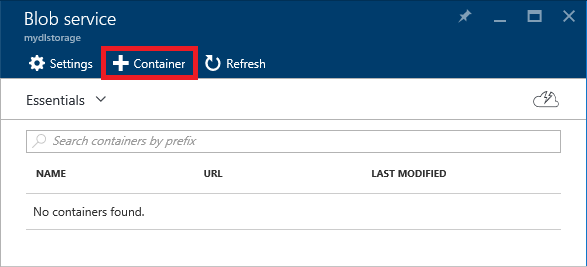

    _Adding a container_

1. Enter the name "bacpacs" (without quotation marks) for your new blob container, and then click **Create**:

    

    _Naming the new container_

1. Return to the storage account's blade and click the keys icons:

    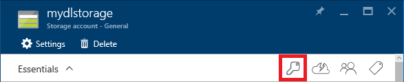

    _Viewing the storage account's access keys_
    
1. In the "Access keys" blade, click the **Copy** button to the right of **key1** to copy the storage account's primary access key to the clipboard. Then paste the access key into your favorite text editor so you can easily access it again in a few moments.

    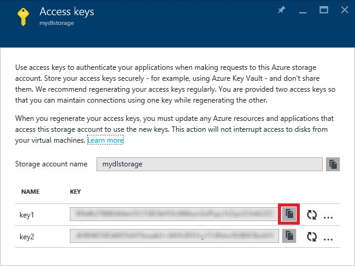

    _Copying the storage account's access key_

1. Now you need to upload the database backup file (academics-stackexchange-users.bacpac, provided for you in this labs "resources" directory) to the new storage account. You'll do that using the cross-platform Azure command line interface, commonly referred to as the "Azure CLI".

	TODO: Install the CLI.

1. Open a command shell (Bash, Terminal, command prompt, etc.) and execute the following command:
 
	<pre>
	azure login
	</pre>

	Copy the code presented to you. Then open a browser window and navigate to https://aka.ms/devicelogin and enter the code. If prompted to log in, do so using your Microsoft account. Upon successful authentication, your command-line session will be connected to your Azure subscription.

1. TODO: List subscriptions and set Azure Pass to the default if it isn't already the default.

1. In the command shell, navigate to this lab "resources" directory and execute the following command:

	<pre>
    azure storage blob upload -a "<i>storage_account_name</i>" -k "<i>storage_account_key</i>" -f "academics-stackexchange-users.bacpac" --container "bacpacs" -b "academics-stackexchange-users.bacpac"
	</pre>

    Substitute the name of the storage account you created in Step 2 for *storage_account_name*, and the access key you copied in Step 8 for *storage_account_key*. **Keep the shell open when you're done; you will need it later on.**

1. Return to the Azure Portal and to the blade for the storage account. Click **Blobs**, and then click the **bacpacs** container. Verify that the container now contains a blob named **academics-stackexchange-users.bacpac**:

    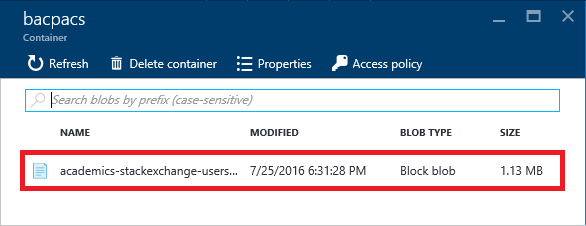

    _New bacpac blob in Azure storage_

1. The next step is to add a new SQL database server. In the Azure portal, click **Browse -> SQL servers**:

    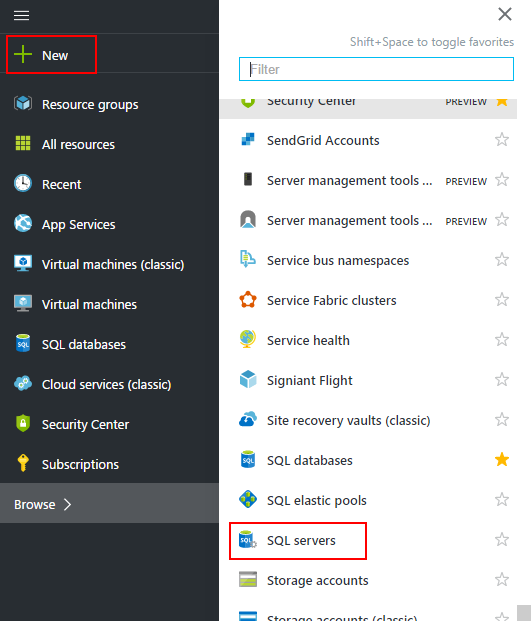

    _Listing SQL servers_

1. Click **+ Add** in the "SQL servers" blade:

    

    _Adding a SQL server_

1. In the ensuing blade, enter the parameters for a new SQL server, beginning with a unique name. (It must be unique across all of Azure; be sure a green check appears in the box.) Enter "azureuser" (without quotation marks) as the user name, and "AzurePass!" (again without quotation marks) as the password. Under **Resource group**, select **Use existing** and select the same resource group you have used throughout this lab. For **Location**, select the same location you selected in previous exercises. When you're finished, click the **Create** button at the bottom of the blade.

    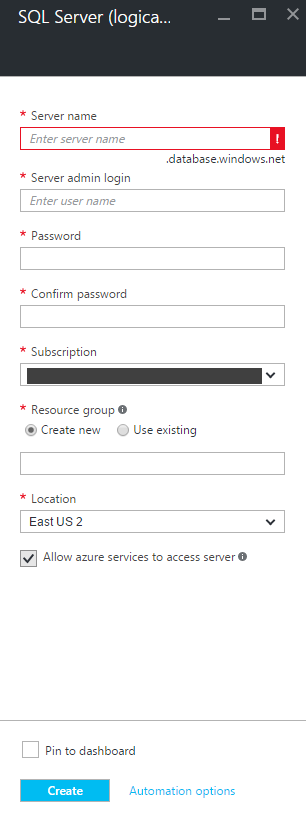

    _Creating a new SQL server_

    After a few moments, the SQL server will be created. Click the **Refresh** button at the top of the "SQL servers" blade and make sure the new SQL server appears in the list of SQL servers associated with your subscription. 

1. Next, you need to create a new database instance using the blob you uploaded a few moments ago. In the "SQL servers" blade, click the SQL server you just created. Then click **Import database** at the top of the ensuing blade:

    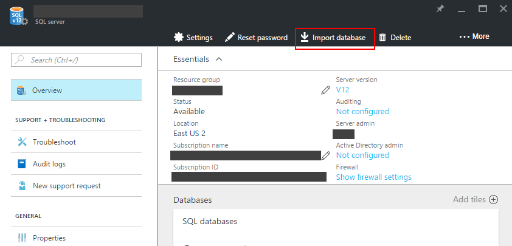

    _Importing a database_

1. In the "Import database" blade, click **Subscription** and choose your Azure Pass subscription. Then click **Storage** and select the storage account that you uploaded the .bacpac file to, followed by the "bacpacs" container and, after that, the blob you uploaded to that container. Finally, enter "azureuser" as the user name and "AzurePass!" as the password, both without quotation marks. Finally, click "OK" at the bottom of the blade.

    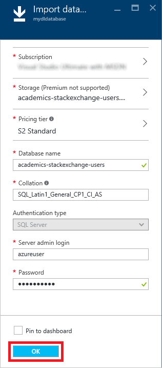

    _Specifying database import options_

1. While you wait for the database instance to be created, click **Show firewall settings** on the database-server blade and add an IP range entry to allow Data Lake Analytics to communicate with your server (during federated query execution). Type the following values into the three text boxes and then click **Save** at the top:

    - **Rule Name**: Allow Data Lake
    - **Start IP**: 25.66.0.0
    - **End IP**: 25.66.255.255

    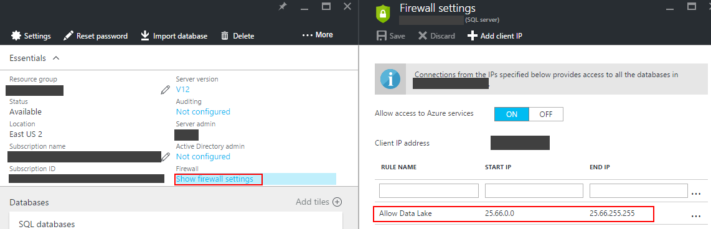

    _Configuring the firewall_

1. Now that you have a SQL Database instance up and running, the final step is to register it with Data Lake Analytics for federation. Navigate back to your Data Lake Analytics account in the portal and click **New Job** at the top of the blade. In the "New U-SQL Job" blade, enter the following statement and then click **Submit job** to run the job:

    <pre>
	CREATE DATABASE UserIntegration;
	</pre>

1. Return to the command shell and execute the following commands to create a Data Lake catalog secret containing SQL server connection and authentication information to be used during federated query execution. Substitute your Data Lake Analytics account name for *analytics_account_name* and your database server name for *database_server_name*:

    <pre>
	azure config mode arm
	azure datalake analytics catalog secret create "<i>analytics_account_name</i>" "UserIntegration" "tcp://<i>database_server_name</i>.database.windows.net:1433"
    </pre>

    When prompted for a catalog secret name, type "user-integration-secret" without quotation marks. When prompted for a password, enter the password for your SQL server account, which you specified in Step 18 of this exercise.

1. Return to your Data Lake Analytics account in the Azure portal. Then click **+ New Job** and execute the following query:

    <pre>
    USE DATABASE UserIntegration;
    
    CREATE CREDENTIAL IF NOT EXISTS FederatedDbSecret WITH USER_NAME = "azureuser", IDENTITY = "user-integration-secret";

    CREATE DATA SOURCE IF NOT EXISTS AcademicSEDb FROM AZURESQLDB WITH
       ( PROVIDER_STRING = "Database=academics-stackexchange-users;Trusted_Connection=False;Encrypt=True",
         CREDENTIAL = FederatedDbSecret,
         REMOTABLE_TYPES = (bool, byte, sbyte, short, ushort, int, uint, long, ulong, decimal, float, double, string, DateTime) );

    CREATE EXTERNAL TABLE User (
                            [id] int,
                            [reputation] int,
                            [created] DateTime,
                            [displayname] string,
                            [lastaccess] DateTime,
                            [location] string
                        ) FROM AcademicSEDb LOCATION "dbo.User";
	</pre>

    This query creates a credential using the "user-integration-secret" catalog secret, configures your SQL Database as a data source authenticated with that new credential, and then creates a named table in your local Data Lake Analytics database which is backed by the SQL data source. The last step (creating the named external table) is optional but is more convenient than referencing a federated data source and external table over and over again.

That was a lot of work, but you're now ready to issue federated queries. Let's try it out!

## Exercise 6: Perform a federated query with U-SQL

Two of the most compelling features of Data Lake Analytics are its ability to federate external data sources (meaning, query them in their native storage, with copying) and its ability to address multiple disparate data sources in a single query. In this exercise, you'll use both to join data from the SQL database you created in Exercise 5 with data in the tab-delimited file you imported in Exercise 3.

1. In the Azure Portal, navigate to your Data Lake Analytics account and click **+ New Job**. Paste the following query into the query-text field and click **Submit Job** to run the job.

	<pre>
	USE DATABASE UserIntegration;
	
	// here we define the schema for the imported posts.tsv file
	@posts =
	    EXTRACT id          		int,
	            [type]      		string,
				acceptedanswerid	int?,
				parentquestionid	int?,
				creationdate		string,
	            score       		int,
			   	views				int,
				ownerid				int,
	            title       		string,
				body				string,
				tags				string,
				answers				int,
				comments			int
	    FROM "posts.tsv"
	    USING Extractors.Tsv();
	
	// here we find the earliest post date per user... note the C# date conversion
	@earliest_posts =
	    SELECT
	        ownerid,
	        MIN(DateTime.Parse(creationdate)) AS created
	    FROM @posts
	GROUP BY ownerid;
	
	// now we join to the external SQL Database table to add user names to the output
	@results =
		SELECT
			u.[displayname] AS [name],
			ep.[created] AS [first_post_date]
		FROM
			User AS u
				INNER JOIN @earliest_posts AS ep ON ep.[ownerid] == u.[id];
	
	// finally we output the transformed data for further analysis or visualization
	OUTPUT @results
	    TO "firstposts.csv"
	    USING Outputters.Csv();
	</pre>

1. Once the job has run successfully, open the blade for your Data Lake Store and click **Data Explorer** near the top. Confirm that the Data Lake Store contains a file named **firstposts.csv**. Then click the file.

    

    _First posts CSV query results_

1. Confirm that the file contains two columns of data: one for name of each user who posted in the discussion forum, and another for the time and date of each user's first post.

You just demonstrated that U-SQL can be used to query multiple data sources of different types. You also saw one example of how C# expressions can be used to make U-SQL more powerful than ordinary SQL.

### Summary ###

Azure Data Lake provides a hyperscale, enterprise-wide repository where different types of data can be collected without regard to size, structure, or velocity. Once aggregated in a Data Lake Store, data can be analyzed with Azure Data Lake Analytics, or processed with popular open-source tools such as Apache Hadoop and Apache Spark hosted in [Azure HDInsight](https://azure.microsoft.com/en-us/services/hdinsight/). In this lab, you learned how to import various types of data into a Data Lake Store and use Azure Data Lake Analytics to query the combined data with U-SQL. 

Azure Data Lake does not itself provide tools for visualizing query results, but other components of Azure and the Azure ecosystem do. For example, [Microsoft Power BI](https://powerbi.microsoft.com/en-us/) can be used to visualize query results and can even be connected directly to a Data Lake Store. For more information about combining Azure Data Lake with Power BI and a tutorial to help guide the way, see [Analyze data in Data Lake Store by using Power BI](https://azure.microsoft.com/en-us/documentation/articles/data-lake-store-power-bi/).

---

Copyright 2016 Microsoft Corporation. All rights reserved. Except where otherwise noted, these materials are licensed under the terms of the Apache License, Version 2.0. You may use it according to the license as is most appropriate for your project on a case-by-case basis. The terms of this license can be found in http://www.apache.org/licenses/LICENSE-2.0.
