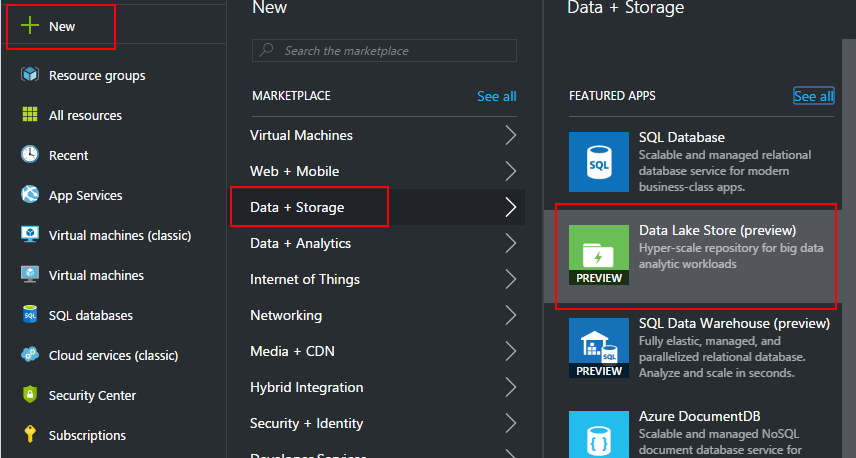
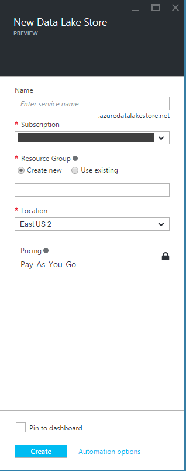
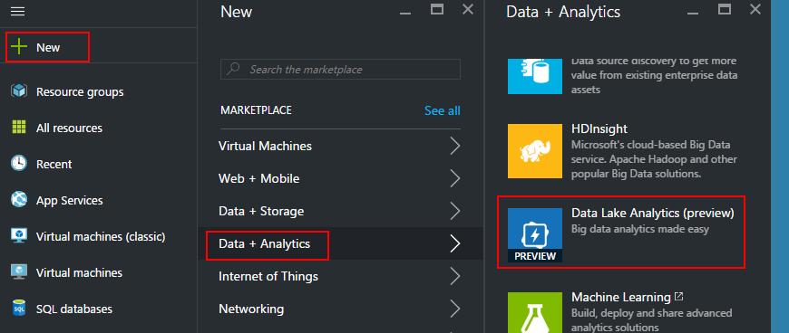
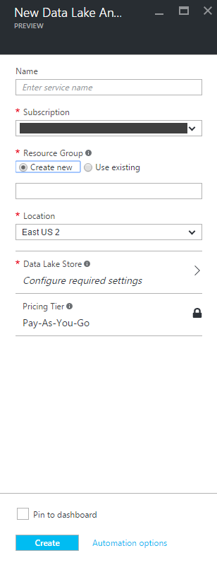

# Load, Query, and Visualize Data With Azure Data Lake Store and Analytics #

---

## Overview ##

Azure Data Lake enables you to capture data of any size, type, and ingestion speed in one single place for operational and exploratory analytics. It consists of two primary elements, Data Lake Store and Data Lake Analytics. Azure Data Lake Store is an enterprise-wide hyper-scale repository for big data analytic workloads. Azure Data Lake Analytics is an easy-to-learn data query and analytics engine based on a new query language called U-SQL, which combines elements of traditional SQL syntax with powerful expression support and programmatic extensibility. This lab will introduce you to Data Lake Store and Data Lake Analytics and walk you through a handful of typical user scenarios for each.

### Objectives ###

In this hands-on lab, you will learn how to:

- Set up Azure Data Lake Store and Analytics accounts
- Import data into Azure Data Lake Store
- Run U-SQL jobs in Azure Data Lake Analytics 
- Federate Azure SQL Databases with U-SQL 
- Visualize Azure Data Lake query results using Power BI (*Windows users only*)

### Prerequisites ###

The following are required to complete this hands-on lab:

- A Microsoft Azure subscription - [sign up for a free trial](http://aka.ms/WATK-FreeTrial)
- Azure Cross-Platform Command Line Interface (CLI) - [download and install instructions here](https://azure.microsoft.com/en-us/documentation/articles/xplat-cli-install/)
- Enable Data Lake Store in your new Azure subscription - [follow the instructions here](https://azure.microsoft.com/en-us/documentation/articles/data-lake-store-get-started-portal/#signup)
- (you may also need to enable Data Lake Analytics in your Azure subscription, using a similar procedure to above)
- Power BI desktop - [optional and Windows only... download and install here](https://powerbi.microsoft.com/en-us/desktop/)

---

## Exercises ##

This hands-on lab includes the following exercises:

- [Exercise 1: Create an Azure Data Lake Store account](#Exercise1)
- [Exercise 2: Create an Azure Data Lake Analytics account](#Exercise2)
- [Exercise 3: Import data into Azure Data Lake Store](#Exercise3)
- [Exercise 4: Run a simple U-SQL job in Azure Data Lake Analytics](#Exercise4)
- [Exercise 5: Setup an Azure SQL Database for federated query with U-SQL](#Exercise5)
- [Exercise 6: Run a more complex U-SQL job using a federated SQL Database](#Exercise6)
- [Exercise 7: Visualize Azure Data Lake query results using Power BI (optional)](#Exercise7)

Estimated time to complete this lab: **60-75** minutes.

## Exercise 1: Create an Azure Data Lake Store account

In this exercise, you will create a new Azure Data Lake Store account in your Azure subscription. Later we'll import data into this account, query against it using a query language called U-SQL, and visualize the results. 

1. In your browser, log in to the [Azure Portal](https://portal.azure.com) if you're not already there.

1. In the portal, click **+ NEW -> Data + Storage -> Data Lake Store (preview)** to display the "New Data Lake Store" blade.

    

    _Adding a new Data Lake Store account_

1. The blade will present you with a handful of options for configuring your new account.

    

    _New Data Lake Store blade_

    Choose a unique name (it must be unique across all of Azure; the portal will prompt you if you choose a name already in use). Ensure your new Azure subscription is selected.

    Enter a name for the resource group that you wish to associate with your new Data Lake Store — for example, "DataLakeHOL" (without quotation marks). Resource group names do not have to be globally unique as storage account names do, but they must be unique to a subscription. You also have the option of choosing an existing resource group, if you happen to have one.

	Next choose an Azure data center location (one near you is a good choice). Leave **Pin to dashboard** checked so the newly created Data Lake Store appears on your dashboard in the Azure Portal. Once you're finished, click the **Create** button at the bottom of the blade.

	> If there are any input errors, such as spaces in the resource-group name, the fields containing the errors will be flagged with red excalamation points. Hover the mouse over an exclamation point for help resolving the error.

    After a few moments, the new Data Lake Store account tile will appear in the Azure Portal home screen.

You've created a Data Lake Store, now you need a Data Lake Analytics account to run queries against the store. We'll create that next.

## Exercise 2: Create an Azure Data Lake Analytics account

The concepts of data storage and data query are formally separated in Azure Data Lake; this allows storage (in the form of Azure Data Lake Store) to provide access to a range of data analysis tools, and also allows analytics (in the form of Azure Data Lake Analytics) to operate against a range of possible data sources. Of course, Azure Data Lake Store and Azure Data Lake Analytics work very well together.

In this exercise you'll create an Azure Data Lake Analytics account and associate it with the Data Lake Store you created in the previous exercise.

1. In your browser, log in to the [Azure Portal](https://portal.azure.com) if you're not already there.

1. In the portal, click **+ NEW -> Data + Analytics -> Data Lake Analytics (preview)** to display the "New Data Lake Analytics Account" blade.

    

    _Adding a new Data Lake Analytics account_

1. The blade will present you with a handful of options for configuring your new account.

    

    _New Data Lake Analytics blade_

    Choose a unique name (it must be unique across all of Azure; the portal will prompt you if you choose a name already in use). Ensure your new Azure subscription is selected.

    If you're following this lab in sequence, choose the resource group you created in [Exercise 1](#Exercise1). Otherwise, enter a name for the resource group that you wish to associate with your new Data Lake Analytics account — for example, "DataLakeHOL" (without quotation marks). Resource group names do not have to be globally unique as storage account names do, but they must be unique to a subscription.

    Finally, click the **Data Lake Store** option; this will open another blade for associating a Data Lake Store account with your new Data Lake Analytics account (at least one such association must exist). Choose the Data Lake Store account you created in [Exercise 1](#Exercise1).

	Leave **Pin to dashboard** checked so the newly created Data Lake Store appears on your dashboard in the Azure Portal. Once you're finished, click the **Create** button at the bottom of the blade.

	> If there are any input errors, such as spaces in the resource-group name, the fields containing the errors will be flagged with red excalamation points. Hover the mouse over an exclamation point for help resolving the error.

    After a few moments, the new Data Lake Analytics account tile will appear in the Azure Portal home screen.

You now have Azure Data Lake storage and query capability set up in your Azure subscription. Now let's add some data we can query against.

## Exercise 3: Import data into Azure Data Lake Store

To jumpstart your exploration of Azure Data Lake, we've provided some sample public domain data to query against. This data consists of questions and related answers from the popular, academia-focused site http://academia.stackexchange.com. But before you can query against it, you'll first need to import the data into your Azure Data Lake Store account.

1. In your browser, log in to the [Azure Portal](https://portal.azure.com) if you're not already there.

1. Once in the portal, select your Azure Data Lake Store account and when the blade opens, select **Data Explorer** near the top.

    

    _Navigate to Data Explorer_

1. A new blade will open; near the top, select **Upload**.

    

    _Upload from Data Explorer_
    
1. In the **Upload files** blade, click on the folder icon and select the [posts.tsv](resources\posts.tsv) file, then click **Start upload**. This file is 60 MB in size so the   upload will take a few minutes, depending on your Internet connection.

    

    _Upload tab-separated files from Data Explorer_

    Do the same for the [comments.tsv](resources\comments.tsv) file, then close out of the **Upload files** blade. Your Data Explorer view should now look like this:

    

    _Data Explorer with completed uploads_
    
    Click on **posts.tsv**, and notice that the newly opened blade shows a preview of the first several rows of the file. We'll dig further into the contents in the next section of the lab. 

## Exercise 4: Run a simple U-SQL job in Azure Data Lake Analytics

Now that you've got some data in your Azure Data Lake Store let's see how to query against that data using U-SQL, the powerful query language built into Azure Data Lake Analytics. U-SQL is a new language built by Microsoft that combines traditional SQL Data Definition Language (DDL) and Data Manipulation Language (DML) constructs with expressions, functions, and operators based on the popular C# language.

1. In your browser, log in to the [Azure Portal](https://portal.azure.com) if you're not already there.

1. Next, select your Azure Data Lake Analytics account and when the blade opens, select **New Job** near the top.

    

    _Create a new Analytics job_

1. A new blade opens for you to specify a job name, priority, degree of parallelism, and query text. Copy and paste the query from [simple-query.usql](resources\simple-query.usql) into the query text field; leave the remaining fields as-is. When finished it should look like this:

    

    _A simple U-SQL query_

    Notice the three main parts of the query:

    1. First we extract data from an existing data source, in this case we're using a single tab-delimited file and using the schema-on-read functionality of U-SQL to schematize it only when needed
    2. Next we transform the input data into a shape suitable to our needs; these transformations can be simple or a complex, multi-step process.
    3. Finally we output the resulting data as a named rowset, which we can use for further analysis or visualization.

    Once you add the query text, click the **Submit Job** button near the top. A new blade will open to show progress of the job as the Data Lake Analytics engine prepares, queues, and then executes the logic defined in your query. Once the "Finalizing" step is green you'll know the job is complete; at that point, close out of the Data Lake Analytics blades. It's time to review the results of your first U-SQL query!

1. Re-open your Data Lake Store blade and again click on **Data Explorer** near the top. You should now see a few new folders (you can ignore these for now) as well as a new "totalscores.csv" file:

    

    _Total scores CSV query results_

    Click "totalscores.csv" and verify that it contains three columns of data (corresponding to our query output). Later we'll see how to join multiple data sources together for more complex queries, as well as how to visualize these results in more interesting ways.

## Exercise 5: Setup an Azure SQL Database for federated query with U-SQL

So far you've issued a simple query against a single file in Azure Data Lake Store. To make things more interesting we're going to next create a small SQL Database in your Azure subscription, and then set that up as a federated data source in Data Lake Analytics. This will allow you to not only query that SQL Database with U-SQL, but also join data from the SQL Database to data already residing in your Data Lake Store. From this you can start to see the power of Azure Data Lake as a truly heterogenous and distributed storage and analytics engine.

You'll need to perform a number of small setup tasks to enable federated queries: 

- Create an Azure storage account in your Azure subscription
- Upload a SQL Database backup file (a .bacpac file) to this new storage account
- Create a new SQL Database in your Azure subscription and restore the .bacpac file from Azure storage during the creation of this instance
- Configure your Data Lake Analytics account to query against your new SQL Database

Let's get started!

1. In your browser, log in to the [Azure Portal](https://portal.azure.com) if you're not already there.

1. In the portal, click **+ NEW -> Data + Storage -> Storage Account** to display the "Create storage account" blade.

    

    _Adding a new Azure Storage account_

1. The blade will present you with a handful of options for configuring your new account.

    

    _New Storage account blade_

    Choose a unique name (it must be unique across all of Azure; the portal will prompt you if you choose a name already in use). Ensure your new Azure subscription is selected.

    If you're following this lab in sequence, choose the resource group you created in [Exercise 1](#Exercise1). Otherwise, enter a name for the resource group that you wish to associate with your new Storage account — for example, "DataLakeHOL" (without quotation marks). Resource group names do not have to be globally unique, but they must be unique to your subscription.

    Leave the remainder of the options with their defaults.

	Leave **Pin to dashboard** checked so the newly created Storage account appears on your dashboard in the Azure Portal. Once you're finished, click the **Create** button at the bottom of the blade.

	> If there are any input errors, such as spaces in the resource-group name, the fields containing the errors will be flagged with red excalamation points. Hover the mouse over an exclamation point for help resolving the error.

    After a few moments, the new Storage account tile will appear in the Azure Portal home screen. Now you need to create a container within your new Storage account to hold your database backup. Click on the tile to open the blade for the new Storage account, then click on the "Blobs" icon under "Services". This will open a new **Blob service** blade; click the **+Container** button, enter the name "bacpacs" (no quotes) for your new blob container, and then click **Create**:

    

    _Blob storage service_

    One final thing while you're here; in the main Storage account blade, click on **Settings -> Access keys**:

    

    _Storage access keys_
    
    On the **Access keys** blade copy "key1" to your clipboard for use in the next step below (you might also want to copy it to a text editor for temporary safekeeping):

    

    _Copy access key_

1. Now you need to upload the [database backup file](resources\academics-stackexchange-users.bacpac) to your new Storage account. You'll do that using the cross-platform Azure command line interface, commonly referred to as the "azure xplat cli".

    Open your command shell (Bash, Terminal, command prompt, etc.) and type "azure login" (no quotes). Copy the code given to you, navigate to https://aka.ms/devicelogin, enter the code and then the username and password associated with your Azure subscription. Upon successful authentication your command line session will be connected to your Azure subscription.

    In the command shell, navigate to the lab "resources" folder on your local file system and run the following command:

    > azure storage blob upload -a "YOUR-STORAGE-ACCOUNT-NAME" -k "YOUR-STORAGE-ACCOUNT-KEY" -f "academics-stackexchange-users.bacpac" --container "bacpacs" -b "academics-stackexchange-users.bacpac"

    Be sure to substitute the name of your Storage account and the key you copied to your clipboard from the previous step. **Keep the shell open when you're done; you'll need it later on.**

    Return to the main Storage account blade in the Azure portal. Again, click on "Blobs" under "Services", and then click on the "bacpacs" container entry. You should now see a new blob in the container, called "academics-stackexchange-users.bacpac":

    

    _New bacpac blob in Azure storage_

1. Now you'll add a new SQL Database server; in the next step you'll create the actual database running within that server. In the Azure portal, navigate to **Browse -> SQL servers**:

    

    _SQL Servers_

    On the newly opened blade click **+ Add** to open the "SQL Server (logical server only)" blade:

    

    _Create a new SQL server_

    Choose a unique name (it must be unique across all of Azure; the portal will prompt you if you choose a name already in use). Ensure your new Azure subscription is selected.

    If you're following this lab in sequence, choose the resource group you created in [Exercise 1](#Exercise1). Otherwise, enter a name for the resource group that you wish to associate with your new Data Lake Analytics account — for example, "DataLakeHOL" (without quotation marks). Resource group names do not have to be globally unique as storage account names do, but they must be unique to a subscription.

    You'll also need to choose a server admin login and password; be mindful of the prompts for minimum password complexity... and remember your username and password!

	Leave **Pin to dashboard** checked so the newly created SQL server appears on your dashboard in the Azure Portal. Once you're finished, click the **Create** button at the bottom of the blade.

	> If there are any input errors, such as spaces in the resource-group name, the fields containing the errors will be flagged with red excalamation points. Hover the mouse over an exclamation point for help resolving the error.

    After a few moments, the new SQL server tile will appear in the Azure Portal home screen.

1. Next you'll need to create a new database instance on your new SQL server, using the bacpac blob you previously uploaded. Click the tile for your newly created database server and then click **Import database** toward the top:

    

    _Import a database instance to the database server_

    In the "Import database" blade, first choose your Azure subscription, then specify the storage account, container, and blob for your previously uploaded .bacpac file. Finally, enter the username and password for your database server. Accept the defaults for the remainder of the configuration options (select "Pin to dashboard" if you want a tile for the new database instance to be added to the main Azure portal home page). Click "OK" at the bottom of the blade.

    

    _Specify database instance import options_

    While you're waiting for the database instance to be created, click on "Show firewall settings" on the main SQL server blade and add an IP range entry to allow Data Lake Analytics to communicate with your server (during federated query execution). Type the following into the three text boxes and then click **Save** at the top:

    > Rule Name -> "Allow Data Lake"

    > Start IP -> 25.66.0.0
    
    > End IP -> 25.66.255.255

    When you're finished it should look like this:

    

    _Allow Data Lake Analytics port range_

1. Now that you have a SQL Database instance up and running, the last step is to register it with Data Lake Analytics for federation.

    Navigate back to your Data Lake Analytics account and Click **New Job** near the top. In the query blade, enter the following U-SQL and then run the job:

    > CREATE DATABASE UserIntegration;

    Using your previously configured Azure command shell, execute the following commands to create a Data Lake catalog secret containing SQL server connection and authentication information to be used during federated query execution:

    > azure config mode arm

    > azure datalake analytics catalog secret create "YOUR-ANALYTICS-ACCOUNT-NAME" "UserIntegration" "tcp://YOUR-DATABASE-SERVER-NAME.database.windows.net:1433"

    You will be prompted for a catalog secret name (use "user-integration-secret", no quotes) and password (be sure to use the password for your SQL server admin account). Also, be sure to use your Data Lake Analytics account name and SQL database server (not instance) name.

    Return to your Data Lake Analytics account in the Azure portal, create a new U-SQL job and execute the following query:

    > USE DATABASE UserIntegration;
    
    > CREATE CREDENTIAL IF NOT EXISTS FederatedDbSecret WITH USER_NAME = "YOUR-DB-SERVER-ADMIN-LOGIN-NAME", IDENTITY = "user-integration-secret";

    > CREATE DATA SOURCE IF NOT EXISTS AcademicSEDb FROM AZURESQLDB WITH
       ( PROVIDER_STRING = "Database=YOUR-DATABASE-INSTANCE-NAME;Trusted_Connection=False;Encrypt=True",
         CREDENTIAL = FederatedDbSecret,
         REMOTABLE_TYPES = (bool, byte, sbyte, short, ushort, int, uint, long, ulong, decimal, float, double, string, DateTime) );

    > CREATE EXTERNAL TABLE User (
                            [id] int,
                            [reputation] int,
                            [created] DateTime,
                            [displayname] string,
                            [lastaccess] DateTime,
                            [location] string
                        ) FROM AcademicSEDb LOCATION "dbo.User";

    This query creates a credential using your previously created catalog secret, configures your SQL Database as a data source authenticated with that new credential, and then creates a named table in your local Data Lake Analytics database which is actually backed by the SQL data source. The last step (creating the named external table) is optional but is more convenient than referencing a federated data source + external table over and over again.

Okay, that was a lot of preamble... but you're finally ready to issue federated queries. Let's try it out!

## Exercise 6: Run a more complex U-SQL job using a federated SQL Database

Two of the most interesting capabilities of Data Lake Analytics are the ability to federate external data sources (meaning, query them in their native storage, with copying) and also the ability to join multiple disparate data sources together in a single query. For this next exercise you'll use both of these together to join data from an external SQL Database with data in a tab-delimited file you've previously imported into Data Lake Store. 

1. In your browser, log in to the [Azure Portal](https://portal.azure.com) if you're not already there.

1. In the portal, navigate to your Data Lake Analytics account and click **+ New Job**. Copy and paste the query from [complex-query.usql](resources\complex-query.usql) into the query text field; leave the remaining fields as-is. When finished it should look like this:

    

    _A U-SQL query joining across multiple data sources_

    Submit the job and let it finish.

1. Now re-open your Data Lake Store blade and click on **Data Explorer** near the top. You should see a new "firstposts.csv" file:

    

    _First posts CSV query results_

    Click "firstposts.csv" and verify that it contains two columns of data. We'll next take a brief look at visualizing these results in Power BI Desktop.    

## Exercise 7: Visualize Azure Data Lake query results using Power BI

*for Windows users only*

Azure Data Lake has very powerful storage and query capabilities but when it comes to data visualization, Power BI is the tool of choice. Let's quickly look at how to view the results of your previous query using Power BI Desktop.

1. Start Power BI Desktop and cancel any initial login prompts.

1. On the ribbon at the top of the main screen, click on **Get Data**:

    

    _Get Data in Power BI_

1. In the resulting popup window, choose **Azure** on the left side and **Microsoft Azure Data Lake Store (beta)** on the right side. Then click **Connect**:

    

    _Connect to Azure Data Lake Store_

    If prompted, click thru any dialog warnings about Azure Data Lake in preview, etc.

1. When next prompted, enter the URL of your Azure Data Lake Store account, then click **OK**. The URL will have the following form:

    > swebhdfs://YOUR-ADLS-ACCOUNT-NAME.azuredatalakestore.net

1. If prompted, sign in with your Azure subscription credentials, then click **Connect**.

1. You'll next be presented with a dialog listing the contents of your Data Lake Store account. You should see the tab-delimited files you uploaded during this lab, as well as the results of queries you've executed. Click **Edit** to bring up the Query Editor view.

1. You should see an expanded view of the contents of your Data Lake Store account. Click on **binary** on the row with **firstposts.csv**:

    

    _Download and drill into first posts data_

    This will download the contents of the first posts CSV from Data Lake Store and present it to you in the next view:

    

    _Raw first posts data_
    
    Right click the column header **Column1** and select **Rename...**. Change the name to "Name". Do the same for **Column2**, change it to "First Post". Now click **Close & Apply** in the ribbon at the upper left corner of the Power BI window:

    

    _Apply query modifications_

    Power BI will apply your query modifications and return you to the main window.

1. Next, click on the **Stacked bar chart** icon on the right under **Visualizations**:

    

    _Add a stacked bar chart visualization_

    Note how the graphic is added to the design surface but no data is yet present.

1. On the right under **Fields**, right-click **Query1** and select **New column**:

    

    _Add a new computed column_

    In the small window that appears above the design surface, replace "Column = " with the following expression:

    > Year+Month = FORMAT(YEAR([First Post]), "General Number") & " - " & FORMAT(MONTH([First Post]), "General Number")

    

    _Define the expression for the new computed column_

    Replace the expression text and then hit Enter. Notice on the right under **Fields** that your new computed column has been created; it will serve as the axis of your visualization.

1. Next, drag the new "Year+Month" column and drop it onto the "Axis" section of the visualization tool window:

    

    _Add the axis field to the chart_

    Now do the same for the "Name" column, dragging it to the "Value" section of the visualization tool window:

    

    _Add the value field to the chart_
   
    Notice now that your chart has data! It now shows the aggregated count of users, grouped by the month/year of their first post to http://academia.stackexchange.com. If necessary, drag the edge of the chart to make it larger and easier to read on the design surface.

1. A few items of note. Clicking on the ellipsis in the upper-right corner of the chart window allows you to sort by data values; trying sorting by "Count of Name" to quickly view the months with the most "first posts".

    

    _First posts sorted by user count_

    You can also hover over individual bars in the graph to view more detailed information; if you'd like to drill into the data for a given month/year, right-click that bar and select "See Records". There are numerous other possibilities for formatting, styling, pulling in other data sources, etc. within Power BI Desktop. Feel free to experiment and know that you can always start again with fresh data if necessary.

### Summary ###

Hopefully this lab has given you a feel for the capabilities of Azure Data Lake Store and Analytics, the iterative "import/transform/query/analyze" workflow common to Azure Data Lake, and the level of integration ADL has with related Azure and analytics product offerings like Power BI.

---

Copyright 2016 Microsoft Corporation. All rights reserved. Except where otherwise noted, these materials are licensed under the terms of the Apache License, Version 2.0. You may use it according to the license as is most appropriate for your project on a case-by-case basis. The terms of this license can be found in http://www.apache.org/licenses/LICENSE-2.0.
