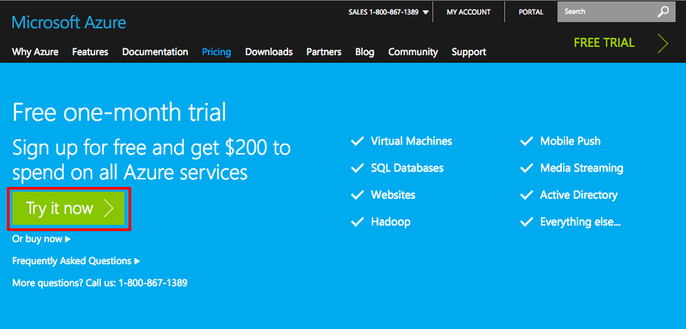
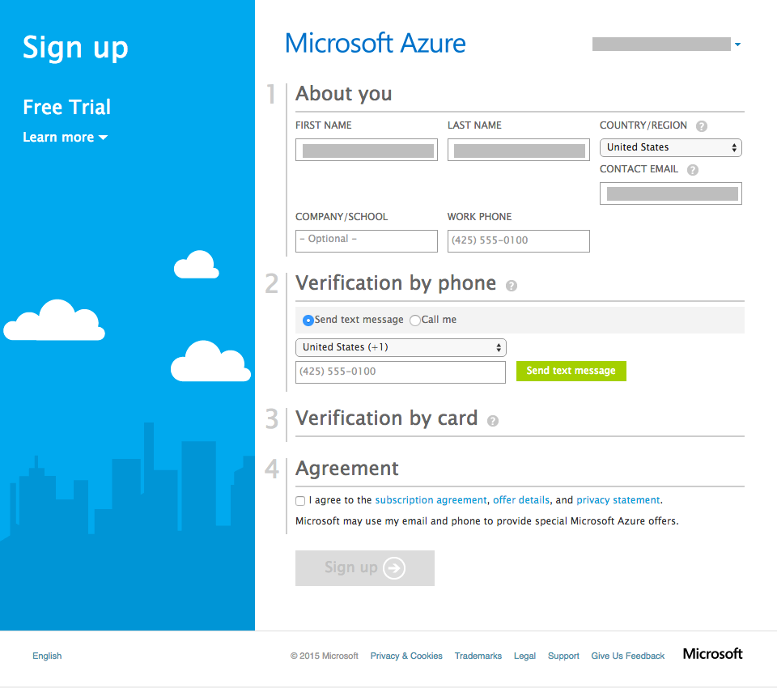
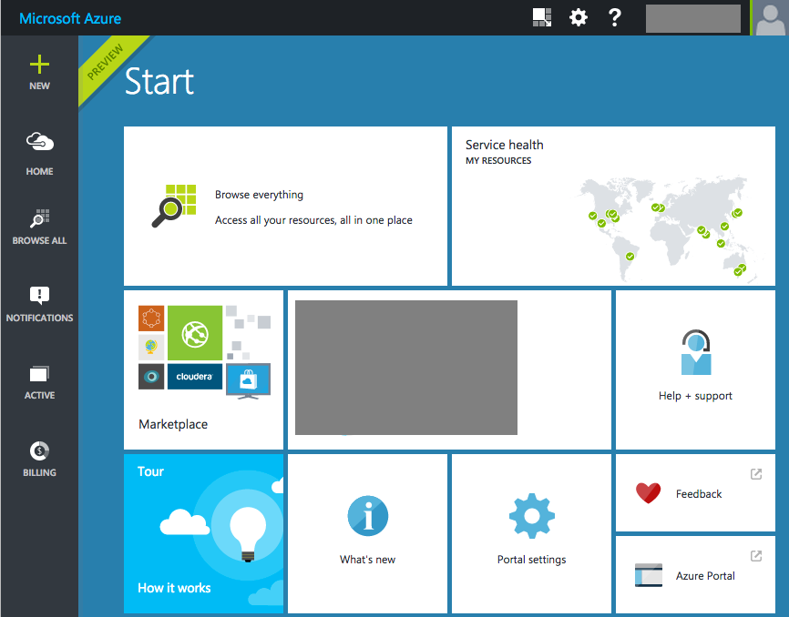
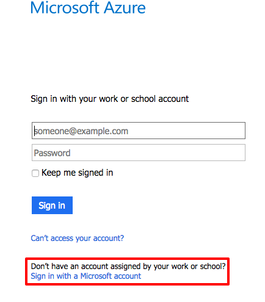

# Introduction: Creating Your Azure Account and Using the Azure Portal #

---

## Overview ##

Signing up for an free trial Azure account is simple and allows you to get started in a couple of minutes. Access to your Azure account is done through a [Microsoft Account](http://windows.microsoft.com/en-us/windows-live/sign-in-what-is-microsoft-account). In the Azure for Research initiative the Azure accounts you are being given only work with a Microsof Account. If your organization or school is using [Azure Active Directory](https://azure.microsoft.com/en-us/documentation/articles/active-directory-whatis/) (AAD) through [Office 365](https://products.office.com/en-us/business/explore-office-365-for-business) or your school [Office 365 in Education](https://products.office.com/en-US/student/office-in-education?tab=schools&legRedir=true&CorrelationId=acc65b7c-0893-48f2-818d-f4bb41ab7ff7 you cannot use that account.

Like any modern cloud-based service, Azure is changing and growing all the time. The entry point to Azure is through the Azure Portal. The new modern portal is the one you are going to use, but it is in the process of being finished so is sometimes called the Preview Portal. The original portal, called the Classic Portal, still has features that have not been ported over to the Preview Portal. Each of the hands on labs you will cover have explicit steps showing which features are in which portal but it is important to know how to switch portals.

### Objectives ###

In this hands-on lab, you will learn how to:

- Sign up for an Azure subscription
- Log into Azure with your Microsoft Account
- How to switch portals

### Prerequisites ###

The following is required to complete this hands-on lab:

- A free Microsoft account. If you do not have one, create one at the [Microsoft sign up page](https://signup.live.com/).
- That you know your user name and password of your Microsoft Account. You can log in with your Microsoft Account at https://login.live.com/ to check and reset your account if you forgot.

---

## Exercises ##

This hands-on lab includes the following exercises:

1. [Exercise 1: Create an Azure trial subscription.](#Exercise1)
1. [Exercise 2: Accessing the Azure Portals](#Exercise2)

Estimated time to complete this lab: **10** minutes.

## Exercise 1: Create an Azure trial subscription.

In this exercise you will sign up for a free Azure 30-day trial subscription that gives you $200 USD worth of of credit.

1. Open your web browser and navigate to this free trial URL: https://azure.microsoft.com/en-us/pricing/free-trial/. In the middle left of the screen click the Free Trial button.

    

    _The Free Trial Button_

1. In the Sign up page, fill out your information. Do note that your credit card will **NOT** be charged at all for this trial. When finished, click the Sign up button at the bottom of the page.

    

    _Complete the Sign Up Information_

 1. Once you have completed the sign up information, you will be taken to the Preview Portal, which looks like the following.

     

     _The Preview Portal_

 1. When signing into Azure, it defaults to work or school accounts. To log in with your Microsoft account, make sure to click the "Sign in with a Microsoft account" to expedite the sign in process.

     

     _The Link for Signing in with a Microsoft Account_

Now you have a valid Azure account to use for the rest of the labs.

## Exercise 2: Accessing the Azure Portals.

In this excersize you will learn how to switch between the two portals. You can always log into the Preview Portal directly by going to http://portal.azure.com. For the Classic portal, the web address is http://manage.windowsazure.com.

1. If you are not in the Preview Portal, please go to http://portal.azure.com and log in.

1. To switch from the Preview Portal to the Classic Portal, click on your name in the upper right hand corner and from the popup menu, chose Azure portal.

    

    _Switching from Preview Portal to Classic Portal_

1. To switch from the Classic Portal to the Preview Portal, click on your name in the upper right hand corner and from the popup menu, chose Switch to Azure Preview Portal.

    

    _Switching from Classic Portal to Preview Portal_

Now you know how to switch between the two portals.

### Summary ###

In this hands-on lab, you learned how to:

- Sign up for an Azure subscription
- Log into Azure with your Microsoft Account
- How to switch portals

---

Copyright 2015 Microsoft Corporation. All rights reserved. Except where otherwise noted, these materials are licensed under the terms of the Apache License, Version 2.0. You may use it according to the license as is most appropriate for your project on a case-by-case basis. The terms of this license can be found in http://www.apache.org/licenses/LICENSE-2.0.
