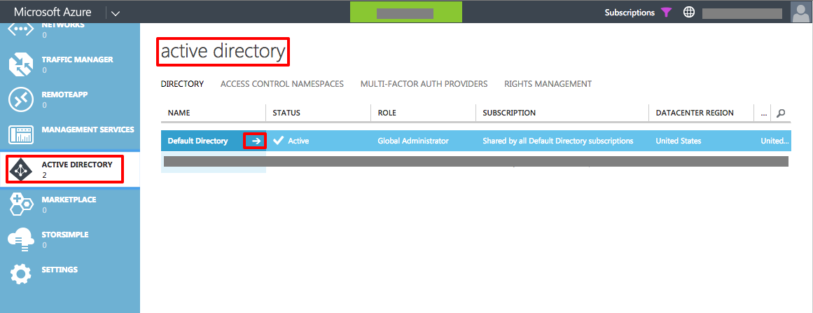
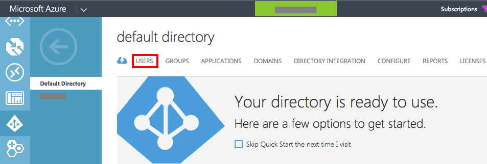
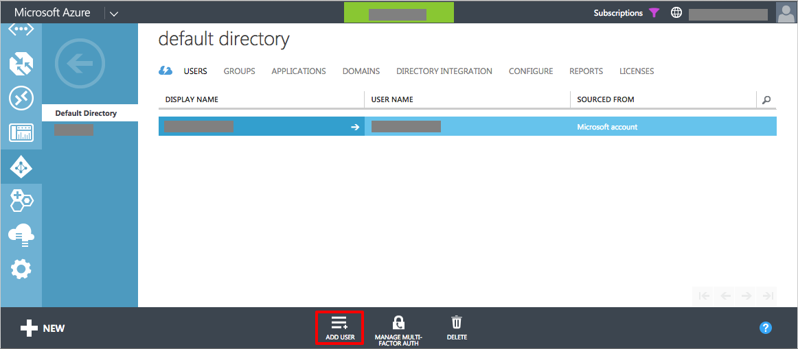
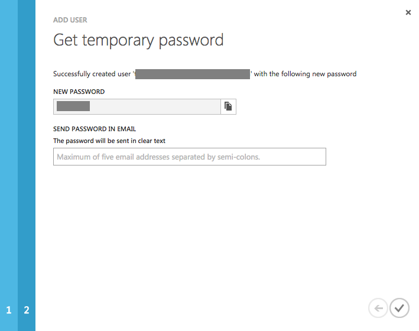
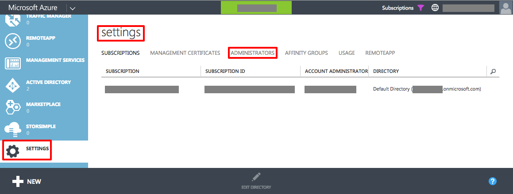
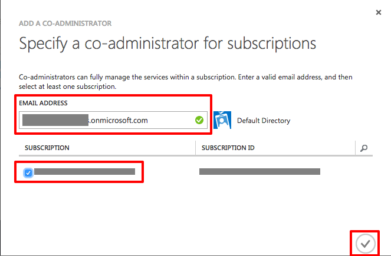
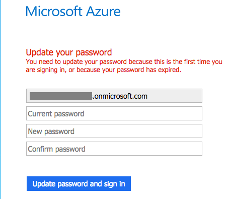

# Introduction: Creating Your Azure Account and Getting an Azure Active Directory Account #

---

## Overview ##

Azure supports two types of accounts for logging in. The first is a [Microsoft Account](http://windows.microsoft.com/en-us/windows-live/sign-in-what-is-microsoft-account). This is the type of account that you used with such services as Outlook.com, OneDrive, or XBOX Live and used to be called a "Windows Live ID" a few years ago. These types of accounts are geared at the consumer space and are great for individuals. The other type of account you can use is one that is suppled by your school or organization if you are using [Azure Active Directory](https://azure.microsoft.com/en-us/documentation/articles/active-directory-whatis/) (AAD). You may have one of these AAD accounts if your organization uses [Office 365](https://products.office.com/en-us/business/explore-office-365-for-business) or your school [Office 365 in Education](https://products.office.com/en-US/student/office-in-education?tab=schools&legRedir=true&CorrelationId=acc65b7c-0893-48f2-818d-f4bb41ab7ff7).

The biggest difference between the two types of accounts is that the AAD account can participate in role-based security scenarios so you can provide stronger security of resources in an account when multiple people access that shared account. For example, in a university scenario the professor could be the administrator of the overall Azure account, and provide AAD accounts to each grad student with permissions set so they could only change specific resources particular to their area of research. Another major difference is that with advanced scenarios and usage today with [Azure Command Line Interface](https://azure.microsoft.com/en-us/documentation/articles/xplat-cli/) (Azure CLI), and potentially in future iterations of the Azure Portal, only work with AAD accounts and not Microsoft Accounts. The best practice for Azure, if you are not in an organization or school participating in AAD already, you create a Microsoft Account for billing and initial log in. Because each Azure account has the ability to create AAD accounts for the Azure subscription, you create an AAD account for your day to day Azure usage. This is a one time step and it might sound confusing at first, it is very easy to do as you will see in this lab.

### Objectives ###

In this hands-on lab, you will learn how to:

- Sign up for an Azure subscription
- Log into Azure with your Microsoft Account
- Configure an AAD account in your Azure subscription
- How to check which type of account you are logged in with in Azure

### Prerequisites ###

The following is required to complete this hands-on lab:

- A free Microsoft account. If you do not have one, create one at the [Microsoft sign up page](https://signup.live.com/).
- That you know your user name and password of your Microsoft Account. You can log in with your Microsoft Account at https://login.live.com/ to check and reset your account if you forgot.

---

## Exercises ##

This hands-on lab includes the following exercises:

1. [Exercise 1: Create an Azure trial subscription.](#Exercise1)
1. [Exercise 2: Set up the AAD account under your Azure account.](#Exercise2)

Estimated time to complete this lab: **20** minutes.

## Exercise 1: Create an Azure trial subscription.

In this exercise you will sign up for a free Azure 30-day trial subscription that gives you $200 USD worth of of credit.

1. Open your web browser and navigate to this free trial URL: https://azure.microsoft.com/en-us/pricing/free-trial/. In the middle left of the screen click the Free Trial button.

    

    _The Free Trial Button_

1. In the Sign up page, fill out your information. Do note that your credit card will **NOT** be charged at all for this trial. When finished, click the Sign up button at the bottom of the page.

    

    _Complete the Sign Up Information_

Now you have a valid Azure account to use for the rest of the labs.

## Exercise 2: Set up the AAD account under your Azure account.

With your Microsoft Account set up, this exercise will create an Azure Active Directory (AAD) account you will use to log into the management portals as well as for Azure CLI usage. You can think of this AAD account as your main login and the Microsoft Account as the billing account. As part of these steps you will make the AAD account an administrator of the account so that account has the appropriate rights to create and remove resources.

Currently, Microsoft has two management portals. The Preview Portal is the more graphical version and where Microsoft is moving everything over to in the future. The Classic Portal was the original management interface. Currently, most features are in both but some newer features are in the Preview Portal, where other features are still in the Classic Portal as they haven't been moved over to the new portal yet. At the time this lab was written, managing the Azure Active Directory for your Azure subscription is still in the Classic Portal

1. Go to the Classic Portal by navigating to https://manage.windowsazure.com and log in with your **MICROSOFT ACCOUNT**.

1. You can verify you have logged in with a Microsoft Account in both the Preview Portal and Classic Portal by looking in the upper right hand corner of the page. If you see single person default icon or the picture you have associated with your Microsoft Account.

    

    _Verifying Microsoft Account Sign In_

1. On the left hand side of the Classic Portal, scroll the list of services until you see Active Directory and click on it. (Note that the screen shot shows two directories. Your account will have one, Default Directory.) Click on the arrow next to Default Directory to configure your accounts Active Directory settings.

    

    _Active Directory Listing_

1. In the Default Directory, click on the USERS tab towards the top of the screen.

    

    _Getting to the Users Tab_

1. In the Users tab you will see one user account, which is your Microsoft Account. Now we can add an AAD account that you will use for your work. At the bottom of the screen click on the **ADD USER** button.

    

    _Add User Button_

1. The default AAD name for your account will be in the form of your Microsoft Account followed with onmicrosoft.com. For example, if your Microsoft Account is CoolName@Outlook.com, your AAD will be coolnameoutlook.onmicrosoft.com. Thus if you name the user "happy", the username would be **happy@coolnameoutlook.onmicrosoft.com**. Some parts of the portal user interfaces call this the **email address**. In the first tab of the Add User wizard, leave the Type of User to the default of "New user in your organization". In the user name field, type the name of the user. All Active Directory naming rules apply and the wizard will check if they are met. Remember the full email account name for the user as you will log in later with it. After you have entered the name, click the arrow in the lower right corner.

1. In the second page of the wizard is where you can specify the first and last name for the user as well as the display name, which is shown in the upper right corner of both portals. On the page you will see an option for Role. This is for the role in the AAD instance and not anything on the Azure account side. You will set this user to an account administrator later in this exercise. If you do want to set the account as a Global AAD administrator, you you will have to supply an alternative email address. Best practices say the alternative email you enter should be an email account you check frequently. This email address is used for resetting the password if you forget it for this account. In this tab you can also enable multi-factor authentication for extra security if you would like. After you entered the account information, click the arrow in the lower right corner to go to page thee of the wizard.

1. In the final screen the wizard will offer you a **create** button to create the account. After clicking that button you will get the temporary password for this new account. Save that, or optionally email it to yourself, as you will need the username and temporary password to log in in a couple of steps in this exercise. After you have saved the temporary password click the check in the lower right hand corner of the wizard.

    

    _The Temporary Password_

1. To make this newly created account an administrator of the **Azure account**, first find the settings icon on the left of the Classic portal at the bottom, and click on it. Once you have the settings page up, click on the ADMINISTRATOR link.

    

    _Active Directory Settings Page_

1. In the Settings administrator page, click the **Add** user on the bottom of the page to bring up the **Add a co-administrator** page. In that page, enter the email address of the account you just created. If it is correct, you will see the text **Default Directory** and what looks like a security badge icon appear. Check the subscription to administer and click the check in the lower right corner to complete. You will see the new administrator account, with the role as **Co-administrator** in the Role column.

    

    _Specifying the Co-administrator_

1. Close down all instances of the browser.

1. Open a new browser window and go to https://portal.azure.com. If you had set your Microsoft Account to automatically sign in, click on your name in the upper right hand corner and choose **Sign out** to go back to the login screen.

1. At the Sign in Page, do not click your Microsoft Account, but click the Use another account button.

    

    _Sign In Again_

1. In the next sign in page, type in the full email address of the account you created earlier in this exercise. Wait a second or two for the password box to come up. If it does not, click the continue button. In the password field, enter the temporary password you saw earlier in this exercise. Click the **Sign in** to log in.

1. You will next be prompted to update your password for this new account. Enter in the temporary password and a strong new password twice. Click the **Update password and sign in** button to change the account password.

    

    _Changing the Temporary Password_

1. Once your password is changed, you will be logged into the Preview Portal. You can verify that you have logged in with an AAD account my looking in the upper right hand corner and seeing that the icon is now a security badge. This is the account you will want to use for logging to both portals and with Azure CLI.

    

    _How to Verify You Logged In with an AAD Account_

### Summary ###

In this hands-on lab, you learned how to:

- Sign up for an Azure subscription
- Log into Azure with your Microsoft Account
- Configure an AAD account in your Azure subscription
- How to check which type of account you are logged in with in Azure

---

Copyright 2015 Microsoft Corporation. All rights reserved. Except where otherwise noted, these materials are licensed under the terms of the Apache License, Version 2.0. You may use it according to the license as is most appropriate for your project on a case-by-case basis. The terms of this license can be found in http://www.apache.org/licenses/LICENSE-2.0.
