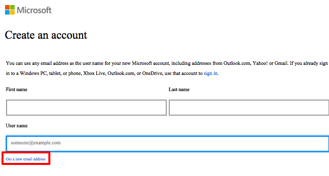
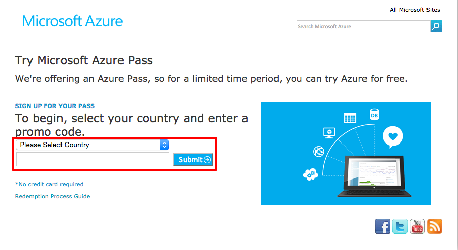
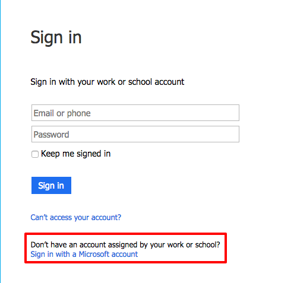
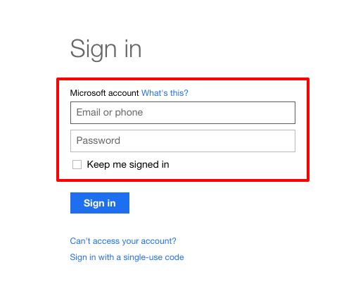
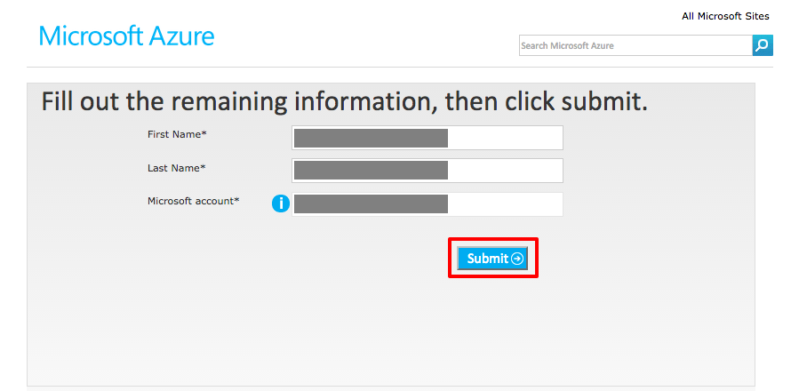
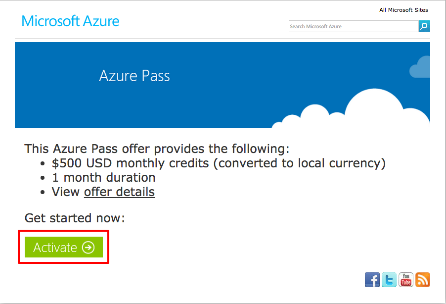
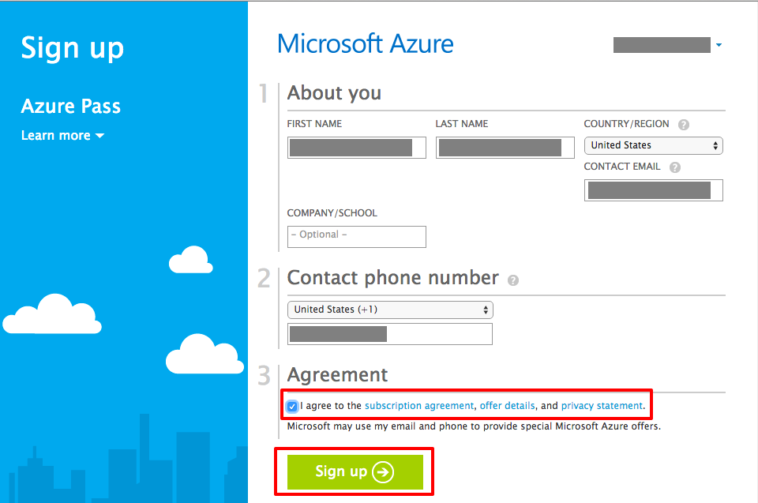
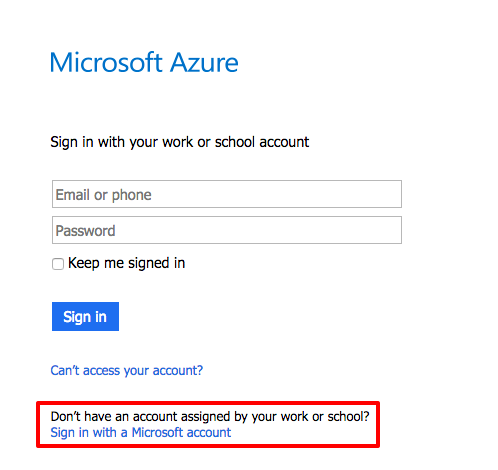
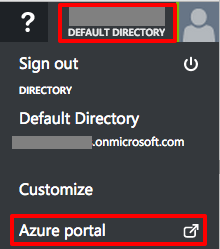
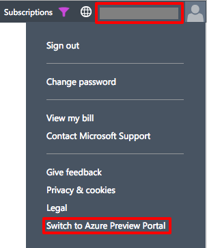

# Introduction: Creating Your Azure Account and Using the Azure Portal #

---

## Overview ##

Signing up for an free-trial Azure account is simple and allows you to get started exploring Azure in a couple of minutes. In the Azure for Research initiative, the Azure accounts you are given only work with a [Microsoft account](http://windows.microsoft.com/en-us/windows-live/sign-in-what-is-microsoft-account). To ensure there are no issues with existing accounts, you are going to create a brand new Microsoft Account in order to access your Azure benefits.

Like any modern cloud-based service, Azure is growing all the time, with new features and services being added regularly. The entry point to Azure is through the Microsoft Azure Portal, of which there are two. The modern portal is the one you will use for most of the labs, but it is still under construction, so it is sometimes referred to as the [Preview Portal](https://portal.azure.com). The original portal, called the [Classic Portal](https://www.manage.windowsazure.com), still has a few features that have not been ported over to the Preview Portal. Each of the hands-on labs contains explicit instructions showing which portal (and which features) to use. In this lab, you will set up a free Azure account and learn how to switch between portals.

### Objectives ###

In this hands-on lab, you will learn how to:

- Sign up for a new Microsoft Account.
- Sign up for an Azure subscription
- Log into Azure with your Microsoft account
- Switch between the Preview Portal and the Classic Portal

### Prerequisites ###

The following is required to complete this hands-on lab:

- A Microsoft promo code. If you do not have one, please see the instructor.

---

## Exercises ##

This hands-on lab includes the following exercises:

1. [Exercise 1: Create a new Microsoft Account](#Exercise1)
1. [Exercise 2: Create an Azure trial subscription](#Exercise2)
1. [Exercise 3: Access the Azure portals](#Exercise3)

Estimated time to complete this lab: **10** minutes.

## Exercise 1: Create a new Microsoft Account ##

Your Azure pass subscription benefit must be used with a new Microsoft Account, which are free to create. In this exercise you will create that account you will use for the rest of the training.

1. To ensure there is no issue with existing Microsoft Accounts you have, the first step is to start your browser and open a Private or Incognito window. Below are the steps for all major browsers.
    - Google Chrome on all operating systems
        - Open a Chrome window
        - In the top right corner of the browser window click the Chrome menu .
        - Select **New Incognito Window**.
        - A new window will open and have a gray figure in the top-right corner .
    - Mozilla Firefox on all operating systems
        - Open a Firefox window.
        - In the top right corner of the browser window click the menu .
        - Select **New Private Window**.
        - A new window will open and have a purple mask in the top-right corner .
    - Apple Safari on OS X
        - Open a Safari windows and choose **File > New Private Window**.
        - The address bar will change to a dark gray background indicating you are in private mode .
    - Microsoft Edge on Windows 10
        - Start Edge and click on the **More actions** button in the top right corner of the browser 
        - Select **New InPrivate window**
        - The upper left corner of the window will change to show you are running in private mode .
    - Internet Explorer on Windows
        - Start Internet Explorer and click on the gear icon in the upper right hand corner .
        - In the popup menu, select **Safety > InPrivate Browsing**.
        - The upper left corner of the window will change to show you are running in private node .

1. In your newly opened private browsing window, go to the Microsoft Account sign-up page at [https://signup.live.com](https://signup.live.com/). Before you fill anything out, click on the **Get a new email address** link under the username.

    

    The username will change to indicate it is ending with **@outlook.com**.

    

1. In the Microsoft account sign up page, fill out the rest of the information requested and at the bottom of the page, click the **Create Account** button. Make sure to remember your new username and password.

With a new Microsoft Account created, you can now proceed to sign up for your free Azure trial subscription.

## Exercise 2: Create an Azure trial subscription ##

In this exercise you will sign up for free Azure Pass with $500 USD of credit (converted to your local currency) and a one month duration. There is no credit card requirement for this offer.

1. Open your Web browser and navigate to [https://www.microsoftazurepass.com](https://www.microsoftazurepass.com). In the middle-left of the screen, select your **country** from the dropdown and enter your promo code. Once entered, click the **Submit** button.

    

    _Selecting the Country, Entering the Promo Code, and Submitting_

1. If your promo code was accepted, the next page will ask you to sign in. Click the sign in button.

    

    _Click the Sign In Button_

1. The sign in page defaults to work or school accounts. Click on the link that says **Sign in with a Microsoft account**.

    

    _The Sign In with a Microsoft Account Link_

1. In the Microsoft Account sign in page, enter your **user name** and **password** for your Microsoft account.

    

    _Entering Your Microsoft Account Information_

1. If your login was successful you will return to the Azure Pass site and you will be asked to verify your first and last names and Microsoft account. Verify those and click the **Submit** button.

    

    _Verifying Your Microsoft Account Information_

1. You will be asked to activate the account and shown the offer details. Click the **Activate** button to start your free account.

    

    _Activating Your Azure Subscription_

1. Depending on the browser you are using a new window or a new browser tab will appear. On that page, it will ask for your phone number and require you to agree to the Azure subscription agreement, offer details, and the privacy statement. Click the **Sign up** button and **do not close the window** as it takes up to four minutes to create the Azure subscription.

    

    _Completing the Azure Account Sign Up Process_

1. The page will indicate the subscription setup process is complete by saying "Your subscription is ready for you!" Do not click on the Start managing my service button. Close this browser window.

1. Open up a new browser window and go to the Azure Preview Portal: [https://portal.azure.com](https://portal.azure.com). If you did not terminate your browser application, your credentials are cached in memory so you will be logged in directly. If you did end your browser, you will be prompted to log in if you did not check "Keep me signed in". When you are prompted to sign in be aware that the sign-in may default to your work or school account if you have such an account. To log in with your Microsoft account when the sign-in page says "Sign in with your work or school account," click **Sign in with a Microsoft account** to expedite the sign-in process.

     

     _Signing in with a Microsoft Account_

Now you have a valid Azure account to use for the rest of the labs.

## Exercise 3: Access the Azure portals ##

In this exercise, you will learn how to switch between the two portals. You can always reach the Preview Portal directly by going to [https://portal.azure.com](https://portal.azure.com). For the Classic Portal, the address is [https://manage.windowsazure.com](https://manage.windowsazure.com).

1. If you are not in the Preview Portal, go to [https://portal.azure.com](https://portal.azure.com). If you are asked to log in, enter the user name and password for the trial subscription you set up in [Exercise 2](#Exercise2).

1. To switch from the Preview Portal to the Classic Portal, click on your name in the upper-right corner of the page and in the ensuing menu, chose **Azure portal**.

    

    _Switching from Preview Portal to Classic Portal_

1. To switch from the Classic Portal to the Preview Portal, click on your name in the upper-right corner of the page and choose **Switch to Azure Preview Portal**.

    

    _Switching from Classic Portal to Preview Portal_

Now you know how to switch between the two portals.

### Summary ###

In this hands-on lab, you learned how to:

- Create a new Microsoft Account.
- Sign up for an Azure promo code subscription
- Log into Azure with your Microsoft account
- Switch between the Preview Portal and the Classic Portal

---

Copyright 2016 Microsoft Corporation. All rights reserved. Except where otherwise noted, these materials are licensed under the terms of the Apache License, Version 2.0. You may use it according to the license as is most appropriate for your project on a case-by-case basis. The terms of this license can be found in http://www.apache.org/licenses/LICENSE-2.0.
