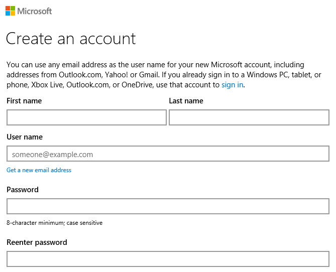
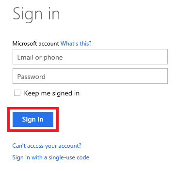

# Activating Your Azure Pass and Using the Azure Portal #

---

## Overview ##

The entry point to Azure is the [Azure Portal](https://portal.azure.com) shown below, which you will become familiar with as you work through the labs. In order to use the portal, you must have an Azure subscription. When you consume Azure services through the portal — when, for example, you store data in a storage account or deploy a high-performance computing (HPC) cluster — those services are billed against your subscription. A free subscription has been provided for you for this class in the form of an [Azure Pass](https://www.microsoftazurepass.com/). Activating your Azure Pass allows you to get started exploring Azure without worrying about the cost.

_The Azure Portal_

The objective of this lab is to activate your Azure Pass and begin familiarizing yourself with the Azure Portal.

### Objectives ###

In this hands-on lab, you will learn how to:

- Activate your Azure Pass
- Log in to the Azure Portal with a Microsoft account
- View the Azure subscriptions associated with your account

### Prerequisites ###

The following is required to complete this hands-on lab:

- An Azure Pass activation code. If you do not have one, please see the instructor.

---

## Exercises ##

This hands-on lab includes the following exercises:

- [Exercise 1: Get a Microsoft account](#Exercise1)
- [Exercise 2: Activate your Azure Pass](#Exercise2)
- [Exercise 3: Access the Azure Portal and view subscription information](#Exercise3)

Estimated time to complete this lab: **15** minutes.

## Exercise 1: Get a Microsoft account ##
 
Your Azure Pass is a subscription that provides $500 worth of Azure credits for up to one month. In order to activate an Azure Pass, you need a Microsoft account. Currently, you can only use an Azure Pass with a given Microsoft account one time. If you already have a Microsoft account and are certain that it that has never been used with an Azure Pass, then you can **skip this exercise and [proceed to Exercise 2](#Exercise2)**. If you don't have a Microsoft account, or if you do but aren't sure whether it has ever been used with an Azure Pass, then follow the steps below to create a new Microsoft account. Microsoft accounts are free and provide access to a wide range of Microsoft services, including Azure.

1. Start a **private or incognito session** in the browser of your choice. In Chrome, you can start an incognito session by clicking the  button in the upper-right corner and selecting **New Incognito Window**. In Microsoft Edge, click the **...** button in the upper-right corner and select **New InPrivate window**.

1. In the private browsing window, navigate to the Microsoft account sign-up page at [https://signup.live.com](https://signup.live.com/).

    

    _Creating a new Microsoft account_

1. Type in the information requested and at the bottom of the page, click the **Create account** button. _Remember the user name and password you entered_ because you will need them to log in to the Azure Portal.

	> You can use any e-mail address you'd like as the user name for your new Microsoft account, including the .edu address provided by your school, but you can't use an e-mail address that has *already* been used to create a Microsoft account. If you need a new e-mail address, click **Get a new email address** under the **User name** box near the top of the form.

1. If you're prompted to provide further information or perform additional actions, follow the instructions provided to finish creating the Microsoft account.

Now that you have a Microsoft account, you can activate your Azure Pass.

## Exercise 2: Activate your Azure Pass ##

In this exercise, you will use the code you were given at the start of the day to activate an Azure Pass and associate it with your Microsoft account.

1. Open your Web browser and navigate to [https://www.microsoftazurepass.com](https://www.microsoftazurepass.com). Select a country from the drop-down list labeled **Please Select Country**, and type the activation code you were given into the box underneath the drop-down list. Then click the **Submit** button.

    

    _Entering the activation code_

1. If your activation code is accepted, you will be asked to sign in using your Microsoft account. Click the **Sign in** button.

    

    _Signing in_

1. What happens next will vary depending on how many and what types of Microsoft accounts you have. The goal is to sign in using the credentials for the new Microsoft account you created in Exercise 1, or for your existing Microsoft account if you skipped Exercise 1. Ultimately, you will probably be asked to enter the user name and password for that account. Type them in and click the **Sign in** button.

    

    _Signing in with your Microsoft account_

1. You will now be returned to the Azure Pass site and asked to verify your first and last names. Confirm that they are correct and click the **Submit** button.

    

    _Verifying your Microsoft account information_

1. Click the **Activate** button to activate your Azure Pass.

    

    _Activating your Azure Pass_

1. After a few moments, you will be asked to provide additional information, including a contact phone number. Enter your phone number and check the **I agree to the subscription agreement, offer details, and privacy statement** box. Then click the **Sign up** button and *do not close the browser* as it can take several minutes to activate the Azure Pass.

    

    _Completing the activation process_

1. After several minutes, you'll be told "Your subscription is ready for you!" *Do not* click the **Start managing my service** button. Instead, close the browser window.

    

    _Your subscription is ready!_

Now let's confirm that your Azure Pass was activated and associated with your Microsoft account.

## Exercise 3: Access the Azure Portal and view subscription information ##

In this exercise, you will learn how to open the Azure Portal and view the subscriptions associated with your Microsoft account, as well as how to view usage data regarding those subscriptions so you can keep track of how much of your $500 credit is left.

1. Open a new browser window and navigate to the Azure Portal at [https://portal.azure.com](https://portal.azure.com). If you're prompted to log in with a Microsoft account, use the Microsoft account you used to activate your Azure Pass in Exercise 2.

1. Click **Subscriptions** in the ribbon on the left side of the page.

    

    _Viewing Azure subscriptions_

1. Confirm that **Azure Pass** appears among the list of subscriptions associated with your account, and that the subscription status is **Active**.

    

    _Your Azure Pass subscription_

You can click a subscription to retrieve billing and usage information for it. However, since your Azure Pass subscription is brand new, no data is presently available. Make a note to return to the "Subscriptions" blade later today and see if there is billing and usage information available for your Azure Pass. 

### Summary ###

In this hands-on lab, you learned how to:

- Activate an Azure Pass
- Log in to the Azure Portal with a Microsoft account
- View the Azure subscriptions associated with your account

The portal will be your home for everything Azure and your gateway for using the cloud to aid your research.

---

Copyright 2016 Microsoft Corporation. All rights reserved. Except where otherwise noted, these materials are licensed under the terms of the Apache License, Version 2.0. You may use it according to the license as is most appropriate for your project on a case-by-case basis. The terms of this license can be found in http://www.apache.org/licenses/LICENSE-2.0.
