
# Using Azure Machine Learning #

---

## Overview ##

Machine learning, which facilitates predictive analysis from large volumes of data by employing algorithms that iteratively learn from that data, is one of the fastest growing areas of computer science. Its uses range from credit-card fraud detection and self-driving cars to optical character recognition (OCR) and online shopping recommendations. It makes us smarter by making computers smarter. And its usefulness will only increase as more and more data becomes available and our desire to perform predictive analysis from that data grows, too.

Azure Machine Learning is a cloud-based predictive-analytics service that offers a streamlined experience for data scientists of all skill levels. It's accompanied by the Azure Machine Learning Studio (ML Studio), which is a browser-based tool that allows you to build models using simple drag-and-drop gestures. It comes with a library of time-saving experiments and features best-in-class algorithms developed and tested in the real world by Microsoft businesses such as Bing. And its built-in support for [R](https://www.r-project.org/) and [Python](https://www.python.org/) means you can build custom scripts  to customize your model. Once you've built and trained your model in the ML Studio, you can easily expose it as a Web service that is consumable using a variety of programming languages, or share it with the community by placing it in the [Cortana Intelligence Gallery](https://gallery.cortanaintelligence.com/).

In this lab, you will use Azure Machine Learning to model automobile features and prices and generate price predictions from feature inputs. You will employ the following steps to build the experiment in the Azure Machine Learning Studio and to create, train, and score your model to predict automobile price:

1. Create a model
    - Get the data
    - Preprocess the data
    - Define features
1. Train the model
    - Choose and apply a learning algorithm
1. Score and test the model
    - Predict new automobile prices

### Objectives ###

In this hands-on lab, you will learn how to:

- Log in to the Azure Machine Learning Studio
- Work with the Azure Machine Learning Studio
- Acquire and process data for machine-learning experiments
- Apply and test learning algorithms
- Deploy your model as a Web service so it can be accessed from code or scripts

### Prerequisites ###

The following is required to complete this hands-on lab:

- A Microsoft Azure subscription - [sign up for a free trial](http://aka.ms/WATK-FreeTrial)

---

## Exercises ##

This hands-on lab includes the following exercises:

1. [Exercise 1: Log in to the Azure Machine Learning Studio](#Exercise1)
1. [Exercise 2: Load a dataset](#Exercise2)
1. [Exercise 3: Preprocess the data](#Exercise3)
1. [Exercise 4: Define the features](#Exercise4)
1. [Exercise 5: Select and apply a learning algorithm](#Exercise5)
1. [Exercise 6: Predict automobile prices](#Exercise6)
1. [Exercise 7: Deploy as a Web service](#Exercise7)
1. [Exercise 8 (Optional): Compare two models](#Exercise8)

Estimated time to complete this lab: **60** minutes.

## Exercise1: Log in to the Azure Machine Learning Studio

The first step in employing Azure Machine Learning is to log in.

1. In your web browser, navigate to [http://studio.azureml.net](http://studio.azureml.net) and click the **Sign In** button

    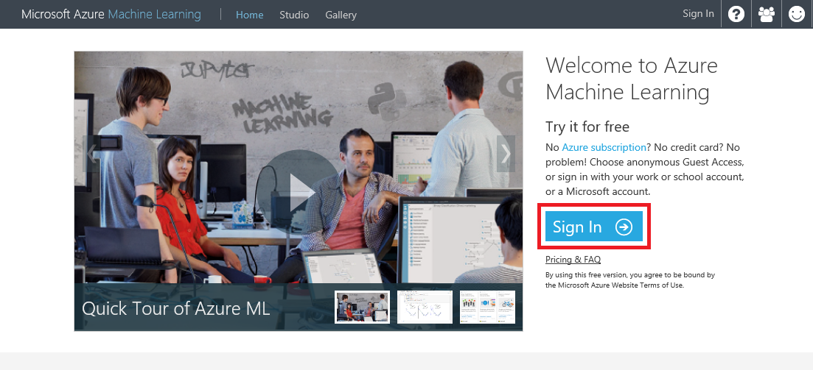

    _Getting started with Azure ML_

1. You can either use a guest account or sign in with your Microsoft account. You should do the latter because the guest account is both time-limited (8 hours) and size-limited (max data file size is 100 MB and experiments are limited to 50 or fewer modules), and it doesn't support R or Python. Therefore, click the **SIGN IN** button and sign in with your Microsoft account.

    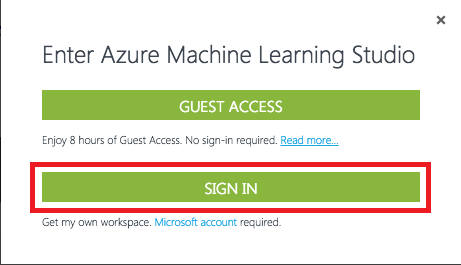

    _Signing in to the Azure Machine Learning Studio_

Now that you're logged in, the next step is to import some data and begin building a model around it.

## Exercise 2: Load a dataset

In this exercise, you will create an Azure Machine Learning experiment and add a dataset to it.

> When working with the Azure Machine Learning Studio, get in the habit of saving your experiments often — for example, after each step of this lab. That way, if you encounter a problem, you will not have to replicate steps to get caught up. Also, be aware that you **may lose your work if you click the browser's Back button without saving your experiment first.**

Azure Machine Learning Studio comes with several sample datasets. In this lab, you will utilize the sample dataset named "Automobile price data (Raw)." This dataset includes entries for a number of individual automobiles, including make, model, technical specifications, and price.

1. Start a new experiment by clicking **New** at the bottom left followed by **Blank Experiment**.

    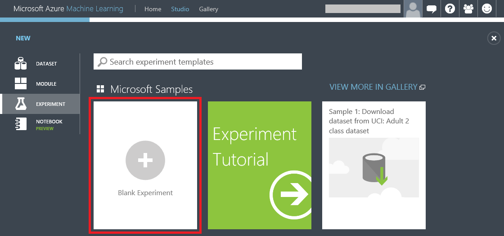

    _Creating a blank experiment_

1. Click the default experiment name at the top of the canvas and change it to something more meaningful, such as "Automobile price prediction."

    

    _Renaming the experiment_

1. To the left of the experiment canvas is the modules palette. Type "automobile" in the search box at the top to find the dataset labeled "Automobile price data (Raw)."

    

    _Finding a dataset_

1. Drag the "Automobile price data (Raw)" dataset from the modules palette and drop it onto the experiment canvas.

    

    _Adding a dataset_

1. To see what this dataset looks like, click the output port (the circle with the "1" in it) at the bottom of the dataset and select **Visualize**.

    

    _Visualizing the dataset_

1. The variables in the dataset appear as columns, with each row representing an automobile. The far-right column titled "price" is the target variable for your predictive analysis. Scroll to the right until you see this column.

    

    _Viewing the raw data_

1. Close the visualization window by clicking the "**x**" in the upper-right corner.

In this exercise, you learned how to create a new ML experiment and add a sample dataset to it. Note that you can upload custom datasets by clicking the **+ NEW** button in the ribbon at the bottom of the window, and then clicking **DATASET** followed by **FROM LOCAL FILE**. Next up: preparing the sample data for use.

## Exercise 3: Preprocess the data

No dataset is perfect. Most require some amount of preprocessing before they can be used to train a model. When you visualized the data, you may have noticed that some rows of automobile data were missing values. These missing values need to be cleaned up before training begins. In this example, you will remove any rows that have missing values. In addition, the "normalized-losses" column has a lot of missing values, so you'll exclude that column from the model.

1. At the top of the modules pallete, type "select columns" into the search box to find the Select Columns in Dataset module. Drag the module over to the experiment canvas and connect it to the output port of the "Automobile price data (Raw)" dataset by dragging an arrow downward from the output port. The Select Columns in Dataset module allows you to specify which columns of data to include or exclude in the model.

     > A key concept to understand in Azure ML Studio is that of ports and connectors. In this step, you connected the output port of the raw data module to the input port of the Project Columns module. The data flows from one module to the next through the connector. Some modules, such as the Train Model, support multiple inputs and therefore have multiple input ports. If you want to know what a port does, hover over it with the mouse and a tooltip will pop up. If you want more information, right-click on the module and select **Help** from the popup menu.

    

    _Connecting the dataset to the Select Columns in Dataset module_

1. Select the Select Columns in Dataset module on the experiment canvas and click the **Launch column selector** button in the Properties pane on the right.

    

    _Launching the column selector_

1. Select **WITH RULES** in the leftmost column if it isn't already selected, and then select **ALL COLUMNS** under **Begin With**. This tells the Project Columns module to pass through all the columns (except those you're about to exclude). In the next row, select **Exclude** and **column names**, and then click the box to the right of **column names**. When a list of columns appears, select **normalized-losses** to add that column to the text box. Now click the check mark to close the column selector.

    > In some browsers, it can take up to a minute for the column names to appear. If they don't appear for you, simply type the column name (normalized-losses) into the box. The list of column names will sometimes appear when you begin typing.

    

    _Selecting columns for the model_
	> IMORTANT: The Select Columns in Dataset module used to be called Project Columns. The screenshots in the remainder of this lab refer to the Select Columns in Dataset as Project Columns. These will be updated in the future.

    
1. The Properties pane indicates that the Select Columns module will pass through all columns from the dataset except "normalized-losses." Confirm that your Select Columns module is configured to do the same.

    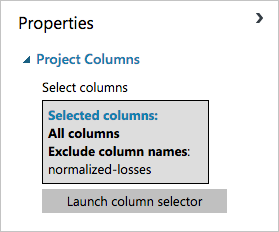

    _Final column selection_

1. You are building a real model in this lab, but it is a relatively simple one. In larger and more complex experiments containing many modules, it's easy to lose track of what each module does and why. A nice feature of Azure Machine Learning Studio is that if you double-click a module on the experiment canvas, you can annotate it with comments. Double-click the Select Columns module and type "Exclude normalized-losses" in the text box that pops up. To display the comment, click the down-arrow in the Select Columns box. If you wish to change the comment, simply right-click the module and select **Edit Comment** from the menu that pops up.

    

    _Adding and viewing comments_

1. Now it's time to remove rows containing blank values. Type "clean" into the search box and drag the Clean Missing Data module to the experiment canvas and connect it to the output of the Select Columns module. In the Properties pane, select **Remove entire row** from the list under **Cleaning mode** to clean the data by removing rows that have at least one missing value.

    

    _Removing rows with missing values_

1. Double-click the Clean Missing Data module and enter the comment "Remove rows with missing values."

1. Click the **SAVE** button at the bottom of the canvas and save the experiment.

1. Click the **RUN** button at the bottom of the canvas to run the experiment.

1. When the experiment finishes running, the Select Columns and Clean Missing Data modules will be tagged with a green check mark to indicate that they executed successfully. In addition, the status in the upper-right corner will change to "Finished running".

    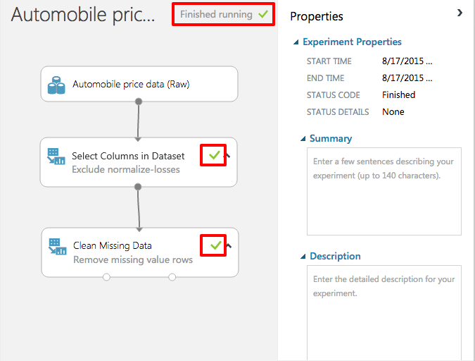

    _Outcome of a successful run_

1. The output from the Clean Missing Data module is a dataset with the "normalized-losses" column removed and all rows with at least one missing value removed. To view the cleaned dataset, click the left output port of the Clean Missing Data module and select **Visualize**. Notice that the "normalized-losses" column is no longer present, and there are no missing values.

1. Close the visualization window by clicking the "**x**" in the upper-right corner.

In this exercise, you learned how to clean input to provide the best possible data to your experiments. The data is ready; now it's time to work on the model itself.

## Exercise 4: Define the features

In machine learning, _features_ are individually measurable properties of the data that you're analyzing. In the "Automobile price data (Raw)" dataset, each row represents one automobile, and each column represents a feature of that automobile. Identifying features for a robust and accurate predictive model frequently requires experimentation and domain knowledge of the problem you're trying to solve. Some features are better for predicting target values than others. For example, it's likely that there is some correlation between engine size and price, because larger engines cost more. But intuition tells us that miles per gallon might not be a strong indicator of price. In addition, some features have a strong correlation with other features (for example, city-mpg versus highway-mpg), and can therefore be excluded since they add little to the model.

It is time to build a model that uses a subset of the features in the dataset. You'll start with the following features (columns), which include the "price" feature that the model will attempt to predict:

- make
- body-style
- wheel-base
- engine-size
- horsepower
- peak-rpm
- highway-mpg
- price

Later, you can always come back and refine the model by selecting different features.

1. Drag another Select Columns module to the experiment canvas and connect it to the left output port of the Clean Missing Data module. Double-click the new Select Columns module and type "Select features for prediction" as the comment.

1. Select the module you just added and click **Launch column selector** in the Properties pane.

1. Select **WITH RULES** in the leftmost column if it isn't already selected, and then select **NO COLUMNS** under **Begin With**. Then select **Include** and **column names** in the filter row. This directs the module to pass through only the columns that are specified. Now click the box to the right of **column names** and select the columns pictured below. Finish up by clicking the check mark in the lower-right corner.

    

    _Selecting columns for the experiment_

1. The Properties pane will show the selected columns. Confirm that your selected-columns readout matches the one below.

    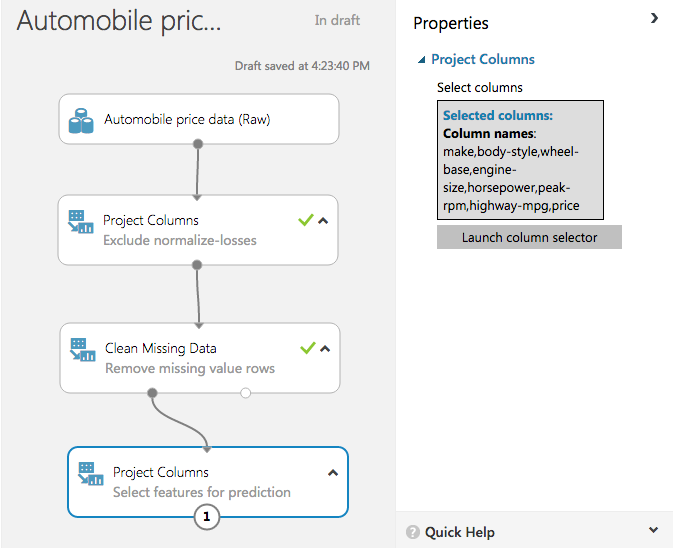

    _Columns selected for the experiment_

1. Click the **SAVE** button at the bottom of the canvas and save the experiment.

You're getting close! Now comes perhaps the most important part of the process: selecting a learning algorithm to use in the experiment.

## Exercise 5: Select and apply a learning algorithm

Now that the data is ready and the features are selected, constructing a robust predictive model requires training and testing the model. You will use part of the dataset to train the model, and another part of it to measure how adept the model is at predicting automobile prices.

Before you can train and test the model, you must select a learning algorithm to use. _Classification_ and _regression_ are two types of supervised machine-learning algorithms. Classification is used to make a prediction from a defined set of values, such as the make of a car (for example, Honda or BMW). Regression is used to make a prediction from a continuous set of values, such as a person's age or the price of an automobile. Azure Machine Learning offers several types of classification and regression algorithms for you to choose from, as well as algorithms of other types.

> The Azure Machine Learning team has put together a "cheat sheet" to help you decide which machine-learning algorithm to choose based on the intended purpose of your model. You can download it from [http://aka.ms/MLCheatSheet](http://aka.ms/MLCheatSheet)

The goal in this lab is to predict the price of an automobile, so you will use a regression model. In this exercise, you will train a simple linear-regression model, and in the next exercise, you will test the results.

1. You can use a single dataset for training and testing by splitting its output. Find the Split Data module in the modules palette and drag it over to the canvas. Then connect the output of the last Select Columns module to the Split Data module. Set **Fraction of rows in the first output dataset** to 0.8. This will use 80% of the data to train the model, and hold back 20% for testing. Leave **Random seed** set to 0. This parameter controls the seeding of the pseudo-random number generator and allows you to produce different random samples by entering different values.

    

    _Splitting the data_

1. Click the **RUN** button to allow the Select Columns and Split Data modules to pass column definitions to the modules you will be adding next.

1. To specify a learning algorithm, type "linear regression" into the search box in the modules palette. Then drag the Linear Regression module onto the canvas.

    

    _Adding the Linear Regression module_

1.	Find the Train Model module and add it to the experiment. Then select the module and click **Launch column selector** in the Properties pane.

    

    _Training the model on price_

1. Make sure **WITH RULES** is selected on the left and **Include** and **column names** are selected in the drop-down lists. Then add the "price" column to the box on the right. This is the value that your model is going to predict. Finish up by clicking the check mark in the column-selector dialog.

    

    _Specifying the output variable_

1. Connect the output port of the Linear Regression module to the left input port of the Train Model module. Then connect the left output port of the Split Data module to the right input port of the Train Model module.

    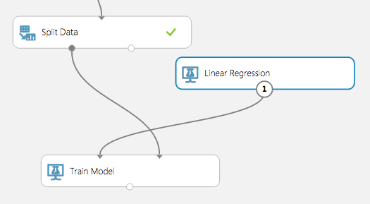

    _Connecting the modules_

1. Click the **SAVE** button and save the experiment.

1. Click the **RUN** button to run the experiment. After the run finishes, you will have a trained regression model that can be used to score new samples and make predictions.

Now comes the fun part: testing the model to see how well it's able to predict automobile prices!

## Exercise 6: Predict automobile prices

With a model that was trained on 80% of the data, you can use the remaining 20% of the data to score the model and judge how well it functions.

1. Add a Score Model module to the canvas. Connect the output of the Train Model module to the Score Model module's left input port. Then connect the right output port of the Split Data module to the right input port of the Score Model module. That connection represents the 20% of the data that was not used for training.

    

    _Adding the Score Model module_

1. Click the **SAVE** button and save the experiment.

1. Click the **RUN** button to run the experiment.

1. After the run finishes, click the output port of the Score Model module and select **Visualize**. The output shows the known values for price from the dataset followed by the predicted values determined by the algorithm. You may have to scroll the table to the right to see the "price" and "Scored Labeled" columns.

    

    _The scored data_

1. Close the visualization window by clicking the "**x**" in the upper-right corner.

1. To evaluate the quality of the results, add an Evaluate Model module to the experiment canvas. Connect the output port of the Score Model module to the left input port of the output of the Evaluate Model module. (There are two input ports because Evaluate Model can be used to compare two models.)

    

    _The Evaluate Model module_

1. Run the experiment again by clicking the **RUN** button.

1. Click the output port of the Evaluate Model and select **Visualize** from the menu.

    

    _The evaluation results_

	Here is a quick explanation of the results:

    - **Mean Absolute Error** (MAE): The average of absolute errors (an error is the difference between the predicted value and the actual value).
    - **Root Mean Squared Error** (RMSE): The square root of the average of squared errors of predictions made on the test dataset.
    - **Relative Absolute Error**: The average of absolute errors relative to the absolute difference between actual values and the average of all actual values.
    - **Relative Squared Error**: The average of squared errors relative to the squared difference between the actual values and the average of all actual values.
    - **Coefficient of Determination**: Also known as the **R-squared value**, this is a statistical metric indicating how well a model fits the data.

    For each of the error statistics, smaller is better. A smaller value indicates that the predictions more closely match the actual values. For **Coefficient of Determination**, the closer its value is to 1.0, the better the predictions. In this case, the model was able to predict the price of a car from the test data with slightly more than 90% accuracy.

1. Close the visualization window by clicking the "**x**" in the upper-right corner.

Now that the model is adequately refined (90% is indicative of a reasonably strong correlation between the input data and results), you might want to be able write programs that utilize the model. That is the subject of the next exercise.

## Exercise 7: Deploy as a Web service

Once you have a trained model, you can deploy it as a Web service in order to interact with it programmatically. That way, you can write apps to pass data in and get results back.

Before deploying as a Web service, you need to streamline your experiment for scoring. This involves creating a _scoring experiment_ from your trained model, removing unnecessary modules that are needed for training but not for scoring, and adding Web-service input and output modules. Fortunately, the Azure Machine Learning Studio can do this for you.

1. Even though you have already run your model, there's a bug in ML Studio whereby visualizing the data sometimes disables one of the Web-service menu items. To work around this, click the **RUN** button to rerun your model.

1. At the bottom of the screen, click the **SET UP WEB SERVICE** button and in the ensuing menu, select **Predictive Web Service [Recommended]**. If this option is grayed out, click the **RUN** button and try again.

    

    _Creating a predictive Web service_

1. The predictive experiment setup will spin for a few seconds, after which you will see a set of tabs at the top of the canvas indicating which model is your training experiment and which is the predictive experiment. When you look at the predictive experiment, you will find that the Train Model module has been replaced by a module named "Automobile price prediction [trained model]," and that new modules were added at the top and bottom for Web-service input and output.

    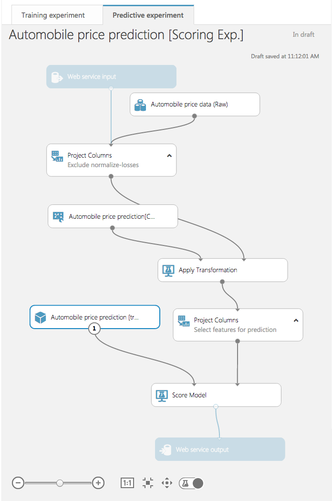

    _The predictive experiment_

1. To create a Web service to use for your predictions, click **RUN** once more. After the run completes, click the **DEPLOY WEB SERVICE** button to deploy your price-predicting Web service. This will take you to the dashboard for the new Web service. Now click the **Test** button in the middle of the screen. Also note that in the "APPS" column, you can download an Excel spreadsheet for working with your Web service.

    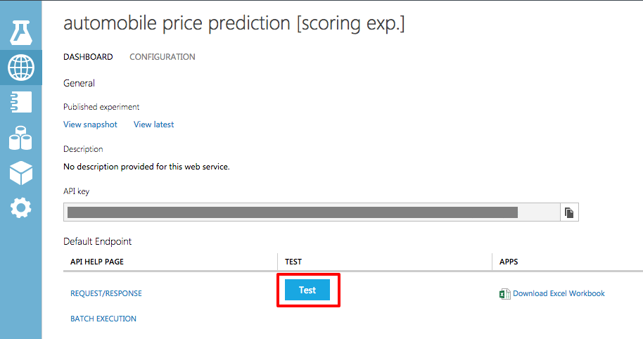

    _Testing your Web service_

1. The following dialog appears for entering test parameters:

    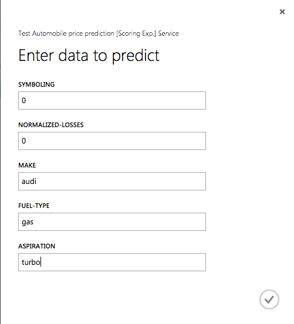

    _Entering data_

1. Enter the parameter values shown below. These parameters are features of a car whose price we want our trained ML model to predict. Enter these values in the corresponding spaces in the dialog, and note that you will have to **scroll the dialog** to see all of the input fields. If you don't fill in all of the fields, you'll receive an error message when you submit the data to the Web service.

    <table>
        <tbody>
            <tr>
                <th>Field</th>
                <th>Value</th>
            </tr>
            <tr>
                <td>symboling</td>
                <td>0</td>
            </tr>
            <tr>
                <td>normalized-losses</td>
                <td>0</td>
            </tr>
            <tr>
                <td>make</td>
                <td>audi</td>
            </tr>
            <tr>
                <td>fuel-type</td>
                <td>gas</td>
            </tr>
            <tr>
                <td>aspiration</td>
                <td>turbo</td>
            </tr>
            <tr>
                <td>num-of-doors</td>
                <td>two</td>
            </tr>
            <tr>
                <td>body-style</td>
                <td>hatchback</td>
            </tr>
            <tr>
                <td>drive-wheels</td>
                <td>4wd</td>
            </tr>
            <tr>
                <td>engine-location</td>
                <td>front</td>
            </tr>
            <tr>
                <td>wheel-base</td>
                <td>99.5</td>
            </tr>
            <tr>
                <td>length</td>
                <td>178.2</td>
            </tr>
            <tr>
                <td>width</td>
                <td>67.9</td>
            </tr>
            <tr>
                <td>height</td>
                <td>52</td>
            </tr>
            <tr>
                <td>curb-weight</td>
                <td>3053</td>
            </tr>
            <tr>
                <td>engine-type</td>
                <td>ohc</td>
            </tr>
            <tr>
                <td>num-of-cylinders</td>
                <td>five</td>
            </tr>
            <tr>
                <td>engine-size</td>
                <td>131</td>
            </tr>
            <tr>
                <td>fuel-system</td>
                <td>mpfi</td>
            </tr>
            <tr>
                <td>bore</td>
                <td>3.13</td>
            </tr>
            <tr>
                <td>stroke</td>
                <td>3.4</td>
            </tr>
            <tr>
                <td>compression-ratio</td>
                <td>7</td>
            </tr>
            <tr>
                <td>horsepower</td>
                <td>160</td>
            </tr>
            <tr>
                <td>peak-rpm</td>
                <td>5500</td>
            </tr>
            <tr>
                <td>city-mpg</td>
                <td>16</td>
            </tr>
            <tr>
                <td>highway-mpg</td>
                <td>22</td>
            </tr>
            <tr>
                <td>price</td>
                <td>0</td>
            </tr>
        </tbody>
    </table>

1. Click the check mark to pass the data to your Web service.

1. After a short pause, a report will appear at the bottom of the screen. Click the **DETAILS** button to see the full results. The final number in the "Scored Labels" column is the projected price.

    

    _Projected price_

A common question regarding hosting and using Azure ML web services is: how much does it cost? You can find the current pricing information in the [Machine Learning Pricing](https://azure.microsoft.com/en-us/pricing/details/machine-learning/) page.

## Exercise 8 (Optional): Compare two models

When you build a predictive model, it is often useful to try different algorithms and compare the results to see which algorithm delivers the best results. The Evaluate Model module is very effective in comparing the metrics between two different algorithms.

1. If time permits and you're so inclined, compare the results of the linear-regression model to a model that uses a different algorithm — for example, Bayesian linear regression. Which model performs better?

    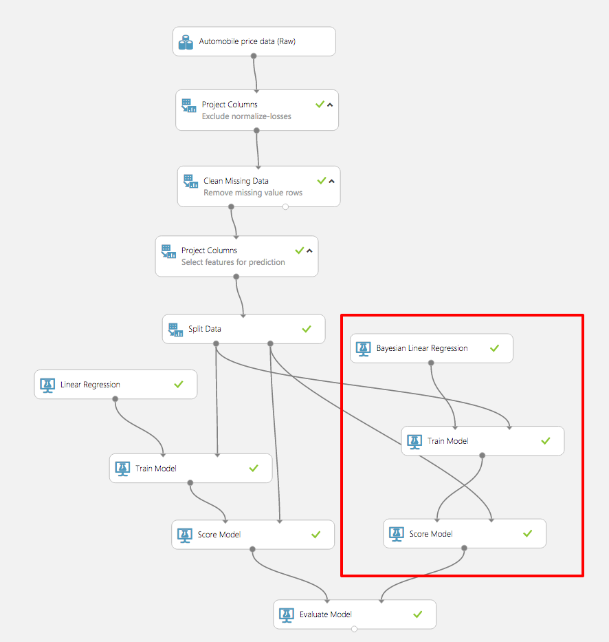

    _Comparing two models_

### Summary ###

In this hands-on lab, you learned how to:

- Log in to the Azure Machine Learning Studio
- Import a sample dataset and prepare it for analysis
- Define the features of a model and select an algorithm
- Train and test the model
- Deploy the model as a Web service

There's much more than you can do with Azure Machine Learning, but this is a start. Feel free to experiment with it on your own and explore the exciting world of predictive analysis with a tool that is not only productive, but fun!

----

Copyright 2016 Microsoft Corporation. All rights reserved. Except where otherwise noted, these materials are licensed under the terms of the Apache License, Version 2.0. You may use it according to the license as is most appropriate for your project on a case-by-case basis. The terms of this license can be found in http://www.apache.org/licenses/LICENSE-2.0.
