
# Using Azure Machine Learning #

---

## Overview ##

Machine learning, which facilitates predictive analytics from large volumes of data by employing algorithms that iteratively learn from that data, is one of the fastest growing areas of computer science. Its uses range from credit-card fraud detection and self-driving cars to optical character recognition (OCR) and online shopping recommendations. It makes us smarter by making computers smarter. And its usefulness will only increase as more and more data becomes available and our desire to perform predictive analysis from that data grows, too.

Azure Machine Learning is a cloud-based predictive-analytics service that offers a streamlined experience for data scientists of all skill levels. It's accompanied by the Azure Machine Learning Studio (ML Studio), which is a browser-based tool that provides an easy to use, drag-and-drop interface for building machine-learning models. It comes with a library of time-saving experiments and features best-in-class algorithms developed and tested in the real world by Microsoft businesses such as Bing. And its built-in support for [R](https://www.r-project.org/) and [Python](https://www.python.org/) means you can include scripts of your own to customize your model. Once you've built and trained your model in the ML Studio, you can easily expose it as a Web service that is consumable using a variety of programming languages, or share it with the community by placing it in the [Cortana Intelligence Gallery](https://gallery.cortanaintelligence.com/).

In this lab, you will use Azure Machine Learning to model automobile features and prices and generate price predictions from feature inputs. Then you will deploy the model as a Web service and test it by placing calls to it.

### Objectives ###

In this hands-on lab, you will learn how to:

- Work with Azure Machine Learning Studio
- Prepare input data and use it to train a model
- Apply and test learning algorithms
- Score a model and evaluate its accuracy
- Deploy a model as a Web service

### Prerequisites ###

The following is required to complete this hands-on lab:

- An active Microsoft Azure subscription. Use the Azure Pass you activated earlier, or [sign up for a free trial](http://aka.ms/WATK-FreeTrial).

---

## Exercises ##

This hands-on lab includes the following exercises:

- [Exercise 1: Create an experiment and load a dataset](#Exercise1)
- [Exercise 2: Preprocess the data](#Exercise2)
- [Exercise 3: Define the features](#Exercise3)
- [Exercise 4: Select a learning algorithm and train the model](#Exercise4)
- [Exercise 5: Score the model](#Exercise5)
- [Exercise 6: Deploy as a Web service](#Exercise6)
- [Exercise 7 (Optional): Compare two models](#Exercise7)

Estimated time to complete this lab: **60** minutes.

## Exercise 1: Create an experiment and load a dataset

The first step in building a machine-learning model with Azure Machine Learning is to use ML Studio to create an experiment and load data into it. Azure Machine Learning Studio comes with several sample datasets. In this exercise, you will load the sample dataset named "Automobile price data (Raw)," which includes entries for more than 200 automobiles, including make, model, technical specifications, and price.

1. In your Web browser, navigate to http://studio.azureml.net and click the **Sign In** button. If you are asked to log in, do so using your Microsoft account.

    

    _Signing in to ML Studio_

1. Start a new experiment by clicking **+ NEW** in the lower-left corner of the page, followed by **Blank Experiment**.

    

    _Creating a blank experiment_

1. Click the default experiment name at the top of the canvas and change it to "Automobile price prediction" (without quotation marks).

    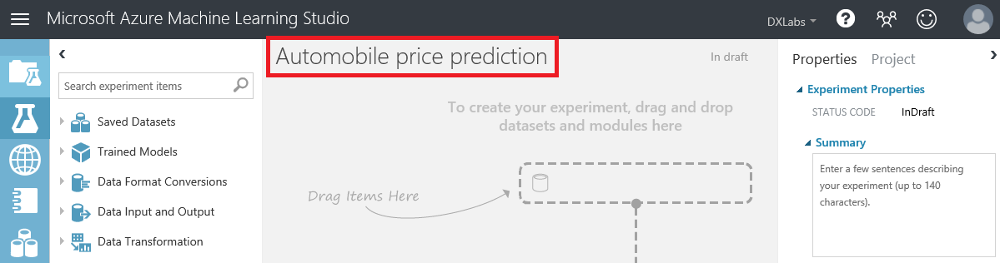

    _Naming the experiment_

1. To the left of the experiment canvas is the modules palette. Type "automobile" in the search box at the top of the modules palette to find the **Automobile price data (Raw)** dataset.

    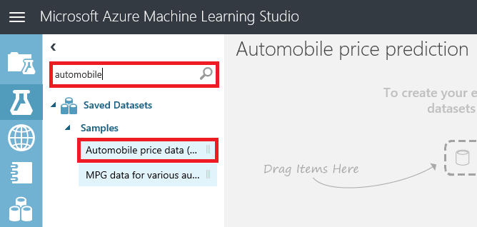

    _Finding a dataset_

1. Drag the **Automobile price data (Raw)** dataset from the modules palette and drop it onto the experiment canvas.

    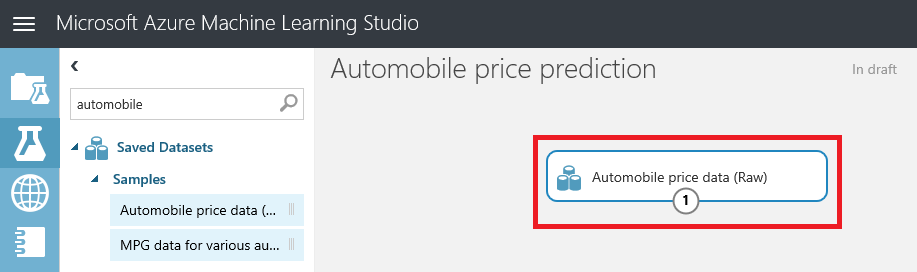

    _Adding a dataset_

1. To see what this dataset looks like, click the output port (the circle with the "1" in it) at the bottom of the dataset and select **Visualize**.

    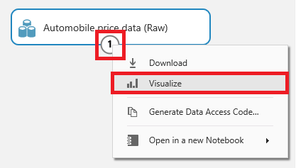

    _Visualizing the dataset_

1. The values in the dataset appear as columns, with each row representing an automobile and each column representing an automobile feature. The far-right column titled "price" is the target variable for your predictive analysis. Scroll to the right until you see this column. Then click it to select it.

    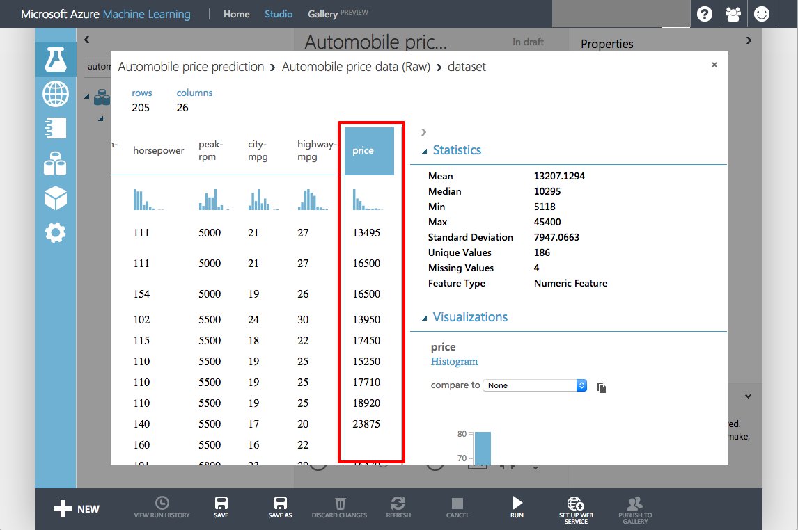

    _Viewing the raw data_

1. Close the visualization window by clicking the "**x**" in the upper-right corner.

In this exercise, you learned how to create a new ML experiment and import a sample dataset. Note that you can upload custom datasets by clicking the **+ NEW** button in the ribbon at the bottom of the window, and then clicking **DATASET** followed by **FROM LOCAL FILE**. Next up: preparing the sample data for use.

## Exercise 2: Preprocess the data

No dataset is perfect. Most require some amount of preparation or *cleaning* before they can be used to train a model. When you visualized the data, you may have noticed that some rows were missing values. These need to be cleaned up before training begins. In this exercise, you will remove any rows that have missing values. In addition, the "normalized-losses" column has a lot of missing values, so you'll exclude that column from the model.

1. At the top of the modules palette, type "select columns" (without quotation marks) into the search box to find the **Select Columns in Dataset** module. Drag the module over to the experiment canvas and connect it to the output port of the **Automobile price data (Raw)** dataset by dragging an arrow downward from the output port. The **Select Columns in Dataset** module allows you to specify which columns of data to include or exclude in the model.

     > A key concept to understand in Azure ML Studio is that of ports and connectors. In this step, you connected the output port of the data module to the input port of the **Select Columns in Dataset** module. The data flows from one module to the next through the connector. Some modules have multiple input and output ports. If you want to know what a port does, hover over it with the mouse and a tooltip will pop up. To call up the documentation for an entire module, right-click (on a Mac, Command-click) the module and select **Help** from the ensuing menu.

    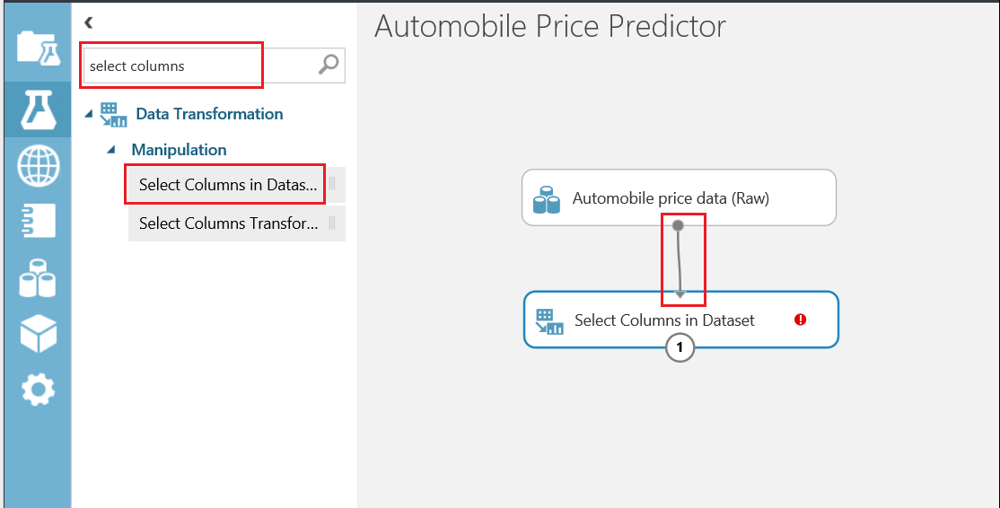

    _Connecting the dataset to the Select Columns in Dataset module_

1. Click the **Select Columns in Dataset** module on the experiment canvas to make sure it's selected, and then click the **Launch column selector** button in the Properties pane on the right.

    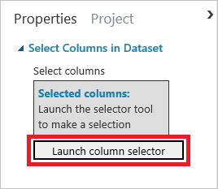

    _Launching the column selector_

1. Select **WITH RULES** in the leftmost column, and then select **ALL COLUMNS** under **Begin With**. This tells the **Select Columns in Dataset** module to pass through all the columns except those you're about to exclude. In the next row, select **Exclude** and **column names**, and then click the box to the right of **column names**. When a list of columns appears, select **normalized-losses** to add that column to the text box. Then click the check mark to close the column selector.

    > In some browsers, the list of column names might not appear. If they don't appear for you, simply type the column name ("normalized-losses") into the box. The column names will sometimes appear when you begin typing.

    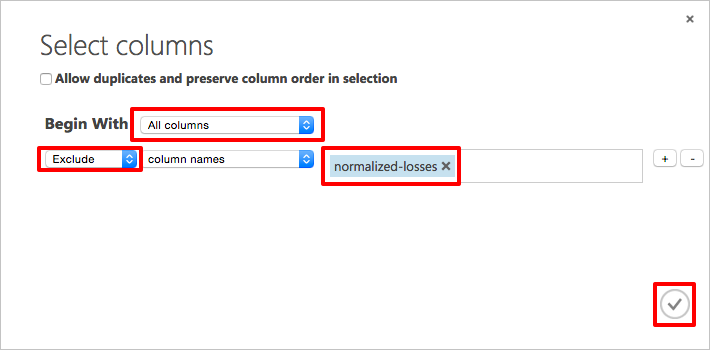
    
1. In ML Studio, you can annotate modules with comments to help document your experiment. To demonstrate, double-click the **Select Columns in Dataset** module and type "Exclude normalized-losses" in the text box that pops up. When you're finished typing, click outside the text box. To display the comment, click the down-arrow on the right side of the module. If you wish to change the comment, simply right-click (or Command-click) the module and select **Edit Comment** from the menu that pops up.

    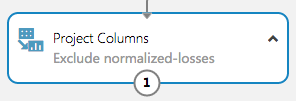

    _Annotating modules with comments_

1. Now it's time to remove rows containing blank values. Type "clean" (without quotation marks) into the search box at the top of the modules palette. Add a **Clean Missing Data** module to the experiment canvas and connect it to the output of the **Select Columns in Dataset** module. In the Properties pane, select **Remove entire row** from the list under **Cleaning mode** to remove rows that have at least one missing value.

    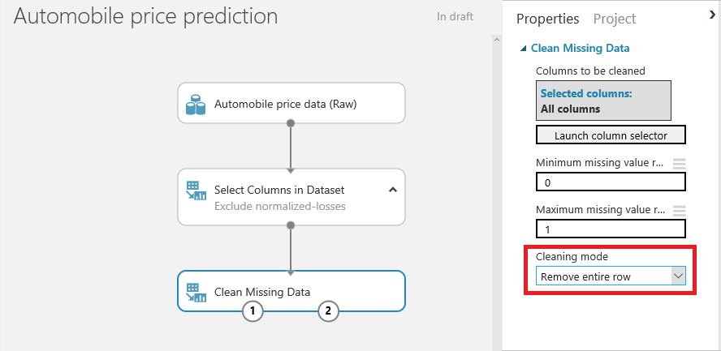

    _Removing rows with missing values_

1. Double-click the **Clean Missing Data** module and enter the comment "Remove rows with missing values."

1. Click the **SAVE** button at the bottom of the canvas to save the experiment.

    

    _Saving the experiment_ 

	> When working with Azure Machine Learning Studio, get in the habit of saving your experiments often. That way, if you encounter a problem, you will not have to replicate steps to get caught up. Also, be aware that you **may lose your work if you click the browser's Back button without saving your experiment first.**

1. Click the **RUN** button at the bottom of the canvas to run the experiment.

1. Wait for the run to finish. Then click the left output port of the **Clean Missing Data** module and select **Visualize**. Notice that the "normalized-losses" column is no longer present, and there are no rows with missing values.

1. Close the visualization window by clicking the "**x**" in the upper-right corner.

In this exercise, you learned about two ways to clean input data in preparation for training a model. The data is ready; now it's time to work on the model itself.

## Exercise 3: Define the features

In machine learning, _features_ are individually measurable properties of the data that you're analyzing. In the **Automobile price data (Raw)** dataset, each row represents one automobile, and each column represents a feature of that automobile. Identifying features for a robust and accurate predictive model frequently requires experimentation and domain knowledge of the problem you're trying to solve. Some features are better for predicting target values than others. For example, it's likely that there is some correlation between engine size and price, because larger engines cost more. But intuition tells us that miles per gallon might not be a strong indicator of price. In addition, some features have a strong correlation with other features (for example, city-mpg versus highway-mpg), and can therefore be excluded since they add little to the model.

It is time to build a model that uses a subset of the features in the dataset. You will use the following features (columns), which include the "price" feature that the model will attempt to predict:

- make
- body-style
- wheel-base
- engine-size
- horsepower
- peak-rpm
- highway-mpg
- price

If needed, you can always refine a model later by selecting different features.

1. Drag another **Select Columns in Dataset** module to the canvas and connect it to the left output port of the **Clean Missing Data** module.

    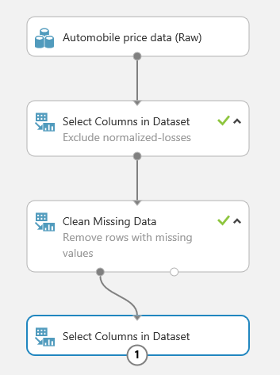

    _Adding another Select Columns in Dataset module_

1. Select the module you just added and click **Launch column selector** in the Properties pane.

1. Select **WITH RULES** in the leftmost column, and select **NO COLUMNS** under **Begin With**. Then select **Include** and **column names** in the filter row. This directs the module to pass through only the columns that are specified. Now click the box to the right of **column names** and select the columns pictured below. Finish up by clicking the check mark in the lower-right corner.

    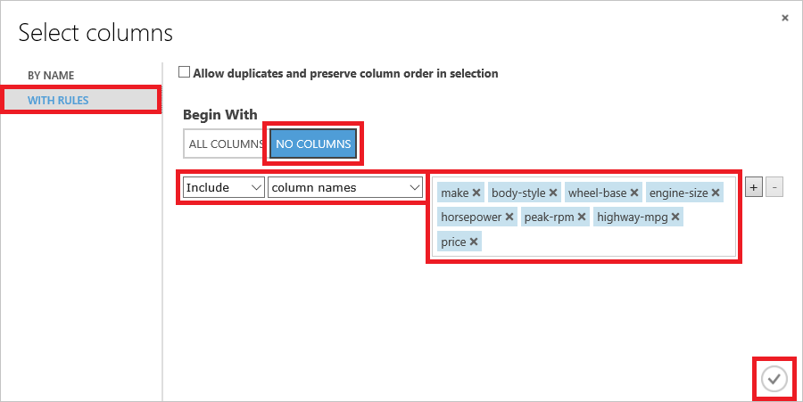

    _Selecting the model's features_

1. Click the **SAVE** button at the bottom of the canvas to save the experiment.

1. Click the **RUN** button at the bottom of the canvas to run the experiment.

1. Click the output port of the second **Select Columns in Dataset** module and use the **Visualize** command to confirm that the output contains just the eight columns that you selected in Step 3. Then close the visualization window by clicking the "**x**" in the upper-right corner.

You're getting close! Now comes perhaps the most important part of the process: selecting a learning algorithm and training the model.

## Exercise 4: Select a learning algorithm and train the model

Now that the data is ready and the features are selected, constructing a robust predictive model requires training and testing the model. You will use part of the dataset to train the model, and another part of it to measure how adept the model is at predicting automobile prices.

Before you can train the model, you must select a learning algorithm to use. _Classification_ and _regression_ are two types of supervised machine-learning algorithms. Classification is used to make a prediction from a defined set of values, such as the make of a car (for example, Honda or BMW). Regression is used to make a prediction from a continuous set of values, such as a person's age or the price of an automobile. Azure Machine Learning offers several types of classification and regression algorithms for you to choose from, as well as algorithms of other types.

> The Azure Machine Learning team has put together a "cheat sheet" to help you decide which machine-learning algorithm to choose based on the purpose of your model. You can view it at http://aka.ms/MLCheatSheet.

The goal of this lab is to predict the price of an automobile from a set of input features, so you will use a regression model. In this exercise, you will train a simple linear-regression model, and in the next exercise, you will test the results.

1. You can use a single dataset for training and testing by splitting its output. Find the **Split Data** module in the modules palette and drag it over to the canvas. Then connect the output of the last **Select Columns in DataSet** module to the **Split Data** module. Set **Fraction of rows in the first output dataset** to 0.8. This will use 80% of the data to train the model, and hold back 20% for testing. Leave **Random seed** set to 0. This parameter controls the seeding of the pseudo-random number generator and allows you to produce different random samples by entering different values.

    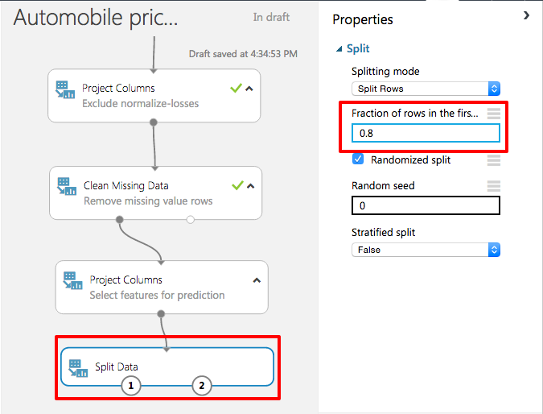

    _Splitting the data_

1. Click the **SAVE** button to save the experiment.

1. Click the **RUN** button to run the experiment.

1. To specify a learning algorithm, type "linear" into the search box in the modules palette. Then drag a **Linear Regression** module onto the canvas.

    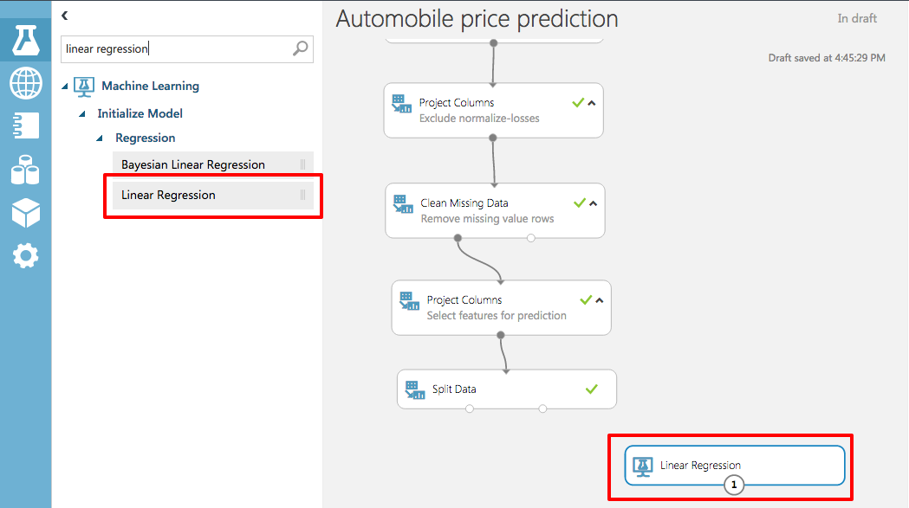

    _Adding a Linear Regression module_

1.	Add a **Train Model** module to the canvas. Connect the output of the **Linear Regression** module to the left input of **Train Model**, and the output from **Split Data** to the right input of **Train Model**. Then select the **Train Model** module and click **Launch column selector** in the Properties pane.

    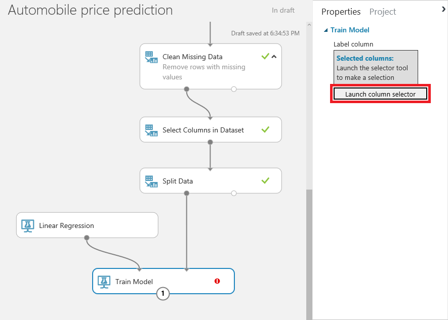

    _TAdding a Train Model module_

1. Select **WITH RULES** on the left and make sure **Include** and **column names** are selected in the drop-down lists. Then add the "price" column to the box on the right. This is the value that your model is going to predict. Finish up by clicking the check mark in the lower-right corner.

    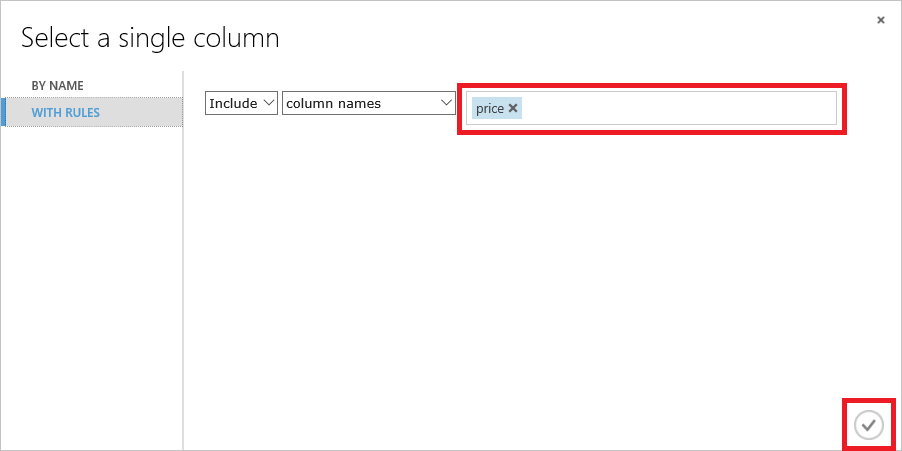

    _Specifying the output variable_

1. Click the **SAVE** button to save the experiment.

1. Click the **RUN** button to run the experiment.

You now have a trained regression model. The next step is to score the model to see how adept it is at predicting automobile prices.

## Exercise 5: Score the model

In this exercise, you will score the model you trained in the previous exercise. Scoring determines how well the model was trained — that is, how adept it is at predicting target values from values presented to it. ML Studio makes the scoring process very easy. You used 80% of the dataset that you uploaded to train the model. You will use the remaining 20% to score it

1. Add a **Score Model** module to the canvas. Connect the output of the **Train Mode**l module to the **Score Model** module's left input port. Then connect the right output port of the **Split Data** module to the right input port of the **Score Mode**l module. That connection represents the 20% of the data that was not used for training.

    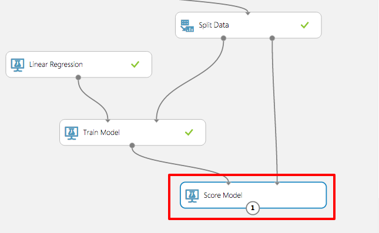

    _Adding a Score Model module_

1. Click the **SAVE** button to save the experiment.

1. Click the **RUN** button to run the experiment.

1. After the run finishes, click the output port of the **Score Model** module and select **Visualize**. The output shows the known values for price from the dataset followed by the predicted values determined by the algorithm. You may have to scroll the table to the right to see the "price" and "Scored Labeled" columns.

    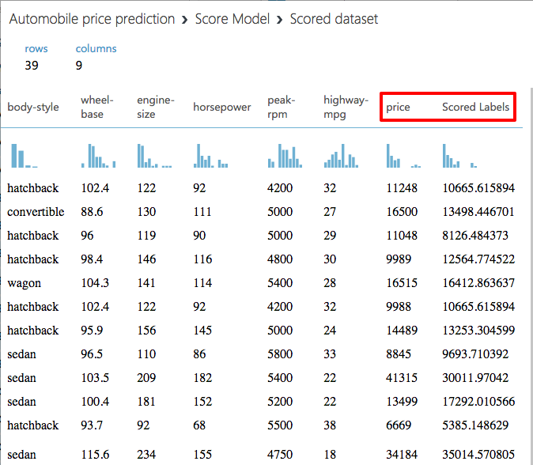

    _The scored data_

1. Close the visualization window by clicking the "**x**" in the upper-right corner.

1. To evaluate the quality of the results, add an **Evaluate Model** module to the experiment canvas. Connect the output port of the **Score Model** module to the left input port of the output of the **Evaluate Model** module. (There are two input ports because **Evaluate Model** can be used to compare two models.)

    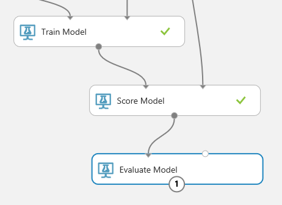

    _Adding an Evaluate Model module_

1. Click the **SAVE** button to save the experiment.

1. Click the **RUN** button to run the experiment.

1. Click the output port of the **Evaluate Model** module and select **Visualize** from the menu.

    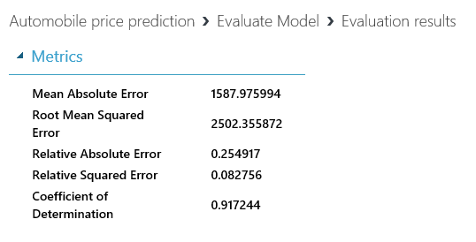

    _The evaluation results_

	Here is a quick explanation of the results:

    - **Mean Absolute Error** (MAE): The average of absolute errors (an error is the difference between the predicted value and the actual value)
    - **Root Mean Squared Error** (RMSE): The square root of the average of squared errors of predictions made on the test dataset
    - **Relative Absolute Error**: The average of absolute errors relative to the absolute difference between actual values and the average of all actual values
    - **Relative Squared Error**: The average of squared errors relative to the squared difference between the actual values and the average of all actual values
    - **Coefficient of Determination**: Also known as the **R-squared value**, this is a statistical metric indicating how well a model fits the data

    For each of the error statistics, smaller is better. A smaller value indicates that the predictions more closely match the actual values. For **Coefficient of Determination**, the closer its value is to 1.0, the better the predictions. In this case, the model was able to predict the price of a car from the test data with more than 90% accuracy.

1. Close the visualization window by clicking the "**x**" in the upper-right corner.

Now that the model is adequately refined (90% is indicative of a reasonably strong correlation between the input data and results), you might want to be able write programs that utilize the model. That is the subject of the next exercise.

## Exercise 6: Deploy as a Web service

Once you have a trained and scored model, you can deploy it as a Web service and interact with it programmatically. Before deploying as a Web service, you need to streamline your experiment. This involves creating a new experiment from your trained model, removing unnecessary modules, and adding Web-service input and output modules. Fortunately, ML Studio can do all of this for you

1. At the bottom of the screen, click the **SET UP WEB SERVICE** button and in the ensuing menu, select **Predictive Web Service [Recommended]**. If this option is grayed out, click the **RUN** button and try again.

    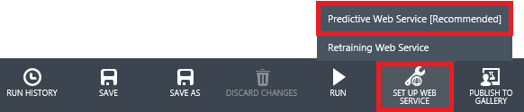

    _Creating a predictive Web service_

1. ML Studio will spin for a few seconds, after which a predictive experiment will appear. Observe that **Split Data** and **Train Model** are gone, and that 100% of the training data now flows into **Score Model**. In addition, new modules were added at the top and bottom for Web-service input and output.

	> Don't be alarmed thinking your original model is gone. It's still there. You can get to it by clicking the **Training experiment** tab at the top of the page.

    

    _The predictive experiment_

1. To create a Web service that you can call to perform predictive analytics, click **RUN** once more. After the run completes, click the **DEPLOY WEB SERVICE** button to deploy the Web service.

    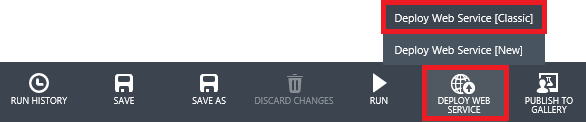

    _Deploying the Web service_
 
1. In a moment, the dashboard for the new Web service appears. The dashboard includes links to Excel spreadsheets that you can download to work with the Web service by inputting values and computing prices. It also includes a **Test** button that you can click to test the Web service. But don't click the **Test** button just yet.

    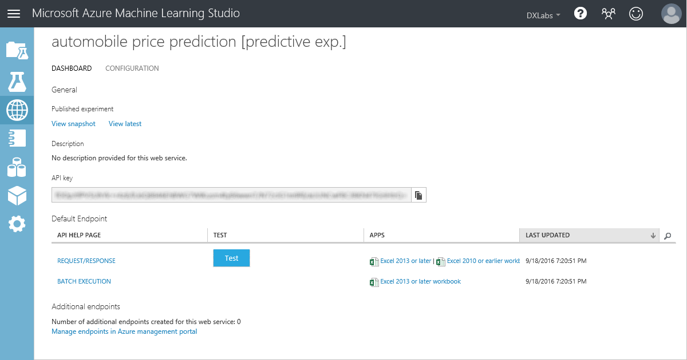

    _The Web service dashboard_

1. If you click **Test** right now, a dialog will appear in which you enter input values before calling the Web service and getting a predicted price in return. But you would have to enter values for *all* of the columns in the dataset, including those that you filtered out through **Select Columns in Dataset**.

	To fix that, you are going to modify the predictive experiment before testing it. Begin by clicking **View latest** in the dashboard to return to the predictive experiment.

1. Delete the arrow connecting the **Web service input** module to **Automobile price data (raw)**. The drag the **Web service input** module down the canvas and position it above the **Score Model** module. Finally, connect the output from **Web service input** to the right input of **Score Model**. This will limit the inputs required to those coming into **Score Model** from the **Select Columns in Dataset** module above.

	> You can delete a connection between modules by right-clicking it (Command-click on a Mac) and selecting **Delete** from the ensuing menu.

    

    _Repositioning Web service input_

1. Click the **Select Columns in Dataset** module that is connected to the **Score Model** module. Then click the **Launch column selector** button in the Properties pane and remove "price" from the columns included in the output. This will prevent you from having to enter an input price when testing the Web serivce. (Even though the input would be ignored, it doesn't make sense to require it because the purpose of the model is to *predict* prices.)

1. Make a copy of the **Select Columns in Dataset** module that you just modified by right-clicking it and selecting **Copy**, and then right-clicking an empty part of the canvas and selecting **Paste**. Now insert the new **Select Columns in Dataset** module between **Score Model** and **Web service output** as shown below.

    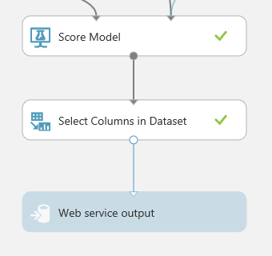

    _Filtering output values_

1. Click the **Select Columns in Dataset** module that you just pasted onto the canvas to select it. Then click the **Launch column selector** button in the Properties pane and add "Scored Labels" to the columns included in the output. This is the price that the Web service predicts from the inputs you specify.

    

    _Adding "Scored Labels" to the output_

1. Click the **SAVE** button to save the predictive experiment.

1. Click the **RUN** button to run the predictive experiment.

1. Click the **DEPLOY WEB SERVICE** button to deploy the Web service. If asked to confirm that you want to overwrite the existing predictive experiment, answer **YES**.

1. Click the **Test** button on the Web-service dashboard.

1. In the dialog that appears, enter the parameter values shown below. These parameters are features of a car whose price we want our trained ML model to predict. Enter these values in the corresponding fields in the dialog, and then click the check mark to pass the data to your Web service. Note that you may have to **scroll the dialog** to see all of the input fields.

    <table>
        <tbody>
            <tr>
                <th>Field</th>
                <th>Value</th>
            </tr>
            <tr>
                <td>make</td>
                <td>audi</td>
            </tr>
            <tr>
                <td>body-style</td>
                <td>hatchback</td>
            </tr>
                <td>wheel-base</td>
                <td>99.5</td>
            </tr>
            <tr>
                <td>engine-size</td>
                <td>131</td>
            </tr>
            <tr>
                <td>horsepower</td>
                <td>160</td>
            </tr>
            <tr>
                <td>peak-rpm</td>
                <td>5500</td>
            </tr>
            <tr>
                <td>highway-mpg</td>
                <td>22</td>
            </tr>
        </tbody>
    </table>

1. After a short pause, a report will appear at the bottom of the screen. Click the **DETAILS** button to see the full results. The final number in the "Scored Labels" column is the projected price.

    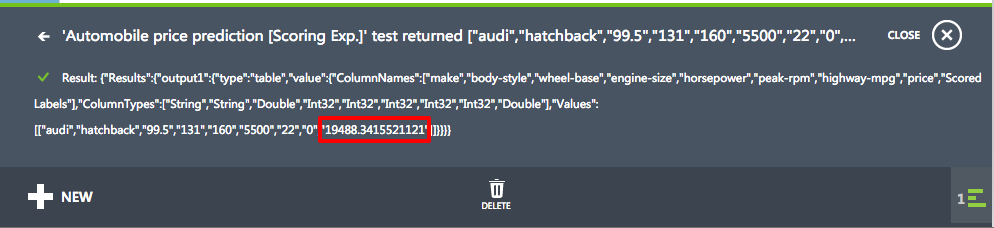

    _Projected price_

You won't do it in this lab, but realize that you could easily write an app that calls the Web service. Click **REQUEST/RESPONSE** on the Web-service dashboard and scroll to the bottom of the page. There, you will see sample code in three languages (C#, Python, and R) demonstrating how to place calls to the Web service to retrieve predicted price values for a given set of inputs.

## Exercise 7 (Optional): Compare two models

When you build a predictive model, it is often useful to try different algorithms and compare the results to see which algorithm delivers the best results. The **Evaluate Model** module is very effective in comparing the metrics between two different algorithms.

1. If time permits and you're so inclined, compare the results of the linear-regression model to a model that uses a different algorithm — for example, Boosted Decision Tree regression.

    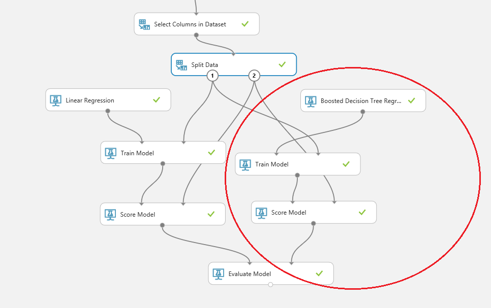

    _Comparing two models_

Which model performs better?

## Summary ##

In this hands-on lab, you learned how to:

- Create a new experiment in Azure Machine Learning Studio
- Import a sample dataset and prepare it for analysis
- Define the features of a model and select a learning algorithm
- Train and score the model
- Deploy the model as a Web service

There's much more than you can do with Azure Machine Learning, but this is a start. Feel free to experiment with it on your own and explore the exciting world of predictive analytics with a tool that is both productive and interactive.

----

Copyright 2016 Microsoft Corporation. All rights reserved. Except where otherwise noted, these materials are licensed under the terms of the Apache License, Version 2.0. You may use it according to the license as is most appropriate for your project on a case-by-case basis. The terms of this license can be found in http://www.apache.org/licenses/LICENSE-2.0.
