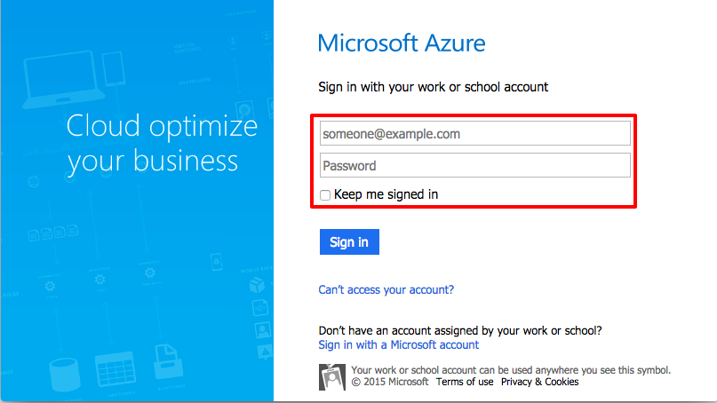
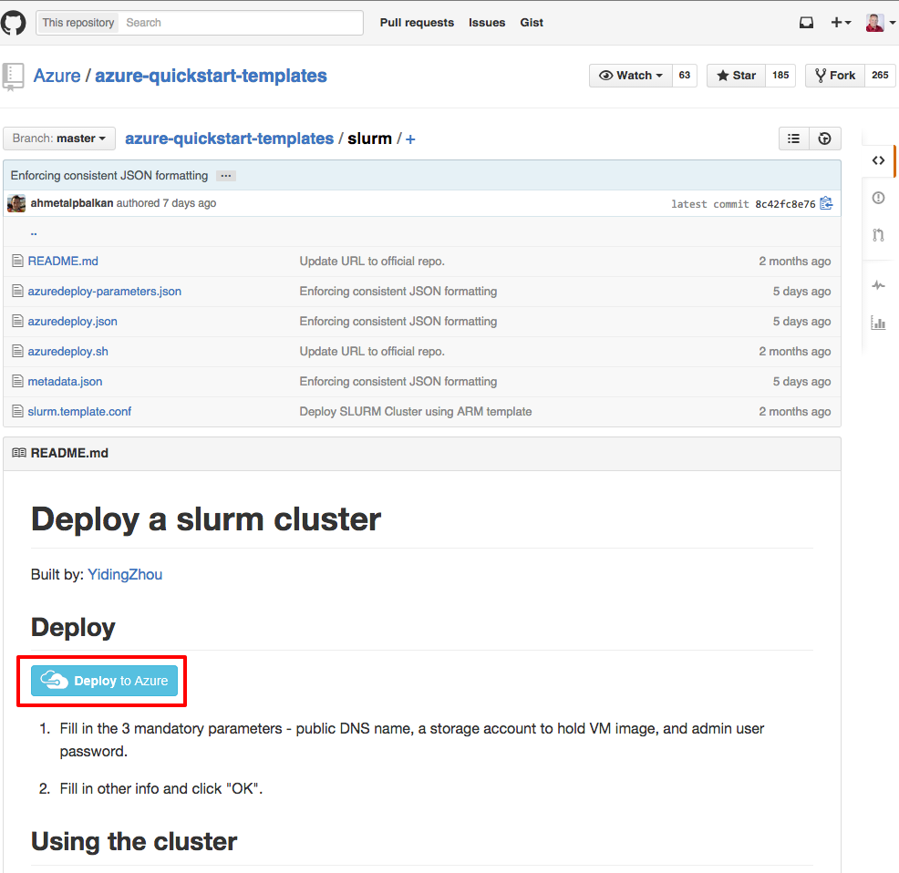
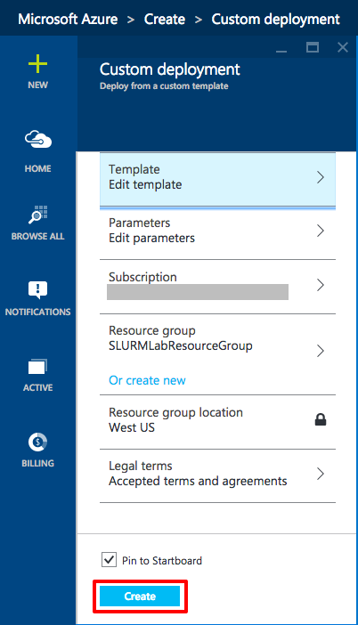
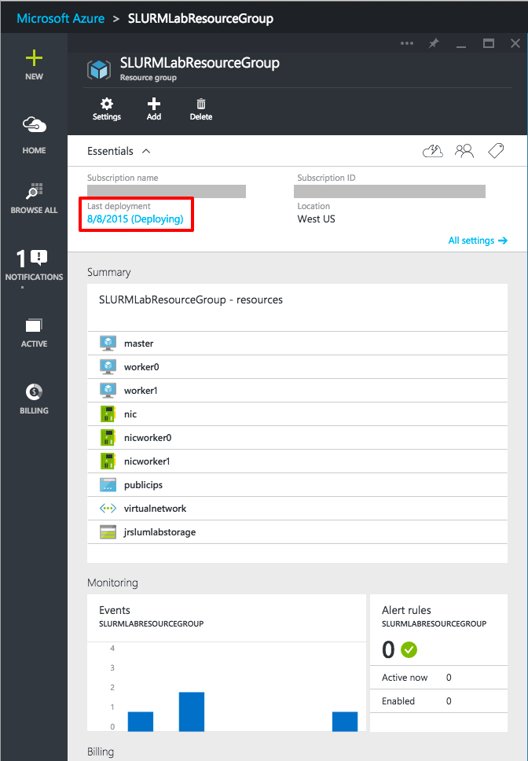
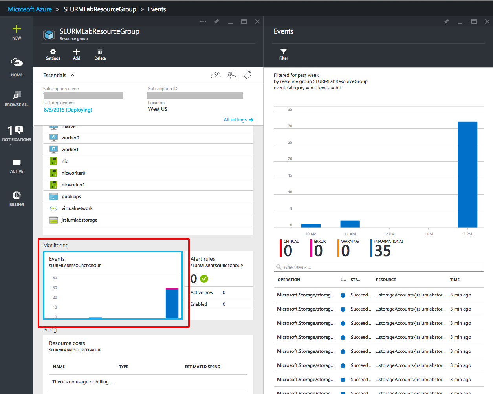
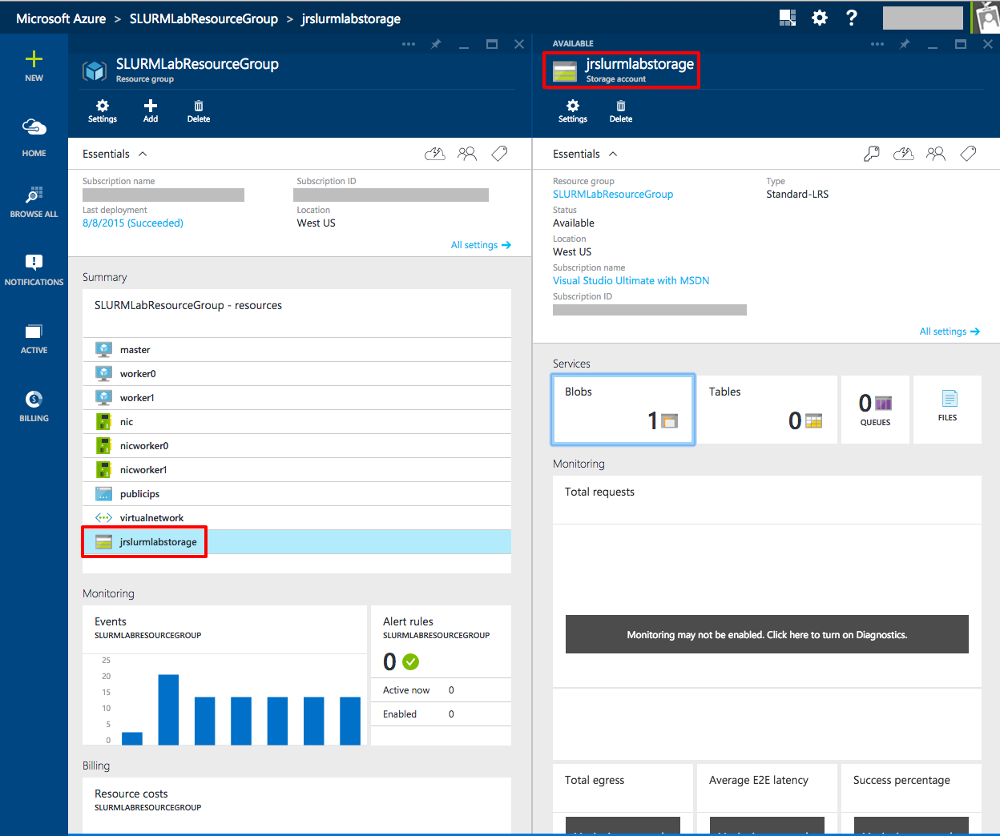
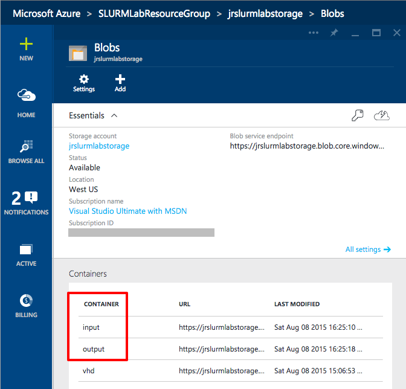

# Creating and Using a SLURM Linux Cluster #

---

## Overview ##

In this lab you will create a Simple Linux Utility for Resource Management ([SLURM](https://computing.llnl.gov/linux/slurm/overview.html))
cluster of Ubuntu computers running on Azure. With this cluster you will perform an embarrassingly parallel task of converting color images to greyscale.
You will learn how easy it is to configure many virtual machines at once using Azure resource manager templates and the steps for getting resources from
your local workstation into your Azure virtual machines with the cross platform [Azure CLI](https://azure.microsoft.com/en-us/documentation/articles/xplat-cli/) command line tools as well as working with blob storage containers.

### Objectives ###

In this hands-on lab, you will learn how to:

- Create a resource group to hold your SLURM cluster
- Deploy preconfigured virtual machines using the Azure Quick Start Templates
- Copy local resources to the SLURM cluster
- Copy files into blob storage
- Use ssh to remote into the master machine of the SLURM cluster
- Kick off a SLURM job
- View the status of a SLURM job
- Retrieve the results of the job from blob storage
- Suspending virtual machines
- Deleting a resource group to remove all traces

### Prerequisites ###

The following is required to complete this hands-on lab:

- A Microsoft Azure subscription - [sign up for a free trial](http://aka.ms/WATK-FreeTrial)
- You have completed the "Azure Storage and Azure CLI hands-on-lab"
- For OS X and Linux users the following item:
    - The [Azure CLI](https://azure.microsoft.com/en-us/documentation/articles/xplat-cli/) command line tool for your workstation operating system.
- For Windows Users, you will need to install the following items:
	- [PuTTY](http://www.chiark.greenend.org.uk/~sgtatham/putty/download.html). Install the latest full package that includes PuTTY and the PSCP programs. Your best option is to use the install program to get these tools on your system. When you run the installer, note the directory where the tools are installed. You will need that directory to run the tools. The default installation location is "C:\Program Files (x86)\PuTTY".
	- The latest [Azure PowerShell module](http://go.microsoft.com/fwlink/p/?linkid=320376&clcid=0x409). Accept all the defaults when installing.

---

## Exercises ##

This hands-on lab includes the following exercises:

1. [Exercise 1: Create the resource group to hold the SLURM cluster and resources.](#Exercise1)
1. [Exercise 2: Creating the SLURM Ubuntu cluster from an Azure Quickstart resource template.](#Exercise2)
1. [Exercise 3: Creating the input and output blob storage.](#Exercise3)
1. [Exercise 4: Updating the script files with your Azure information.](#Exercise4)
1. [Exercise 5: Copying the images to be converted to blob storage.](#Exercise5)
1. [Exercise 6: OS X and Linux: Copying SLURM project scripts, configuring the SLURM nodes, and executing the SLURM job to convert images.](#Exercise6)
1. [Exercise 7: Windows: Copying SLURM project scripts, configuring the SLURM nodes, and executing the SLURM job to convert images.](#Exercise7)
1. [Exercise 8: Verifying the images were converted.](#Exercise8)
1. [Optional Exercise 9: Suspending the SLUM cluster.](#Exercise9)
1. [Exercise 10: Deleting the resource group to remove the SLURM cluster.](#Exercise10)

Estimated time to complete this lab: **60** minutes.

## Exercise 1: Create the resource group to hold the SLURM cluster and resources.
This exercise will create the resource group you will use to store the SLURM cluster of virtual Ubuntu machines along with their required Azure items like Network Interface Cards, IP addresses, and storage. resource groups are a great feature of Microsoft Azure that allow you to group logical resources such as virtual machines, networks, databases, and any other Azure resource together as a logical group which serves as the lifecycle boundary for every resource contained within it.

With this grouping you can apply security rights to users with Role Based Access Control (RBAC). This allows you to have multiple people using a single Azure account but preventing different groups using the account from interfering with one another's deployments and resources. For advanced usage, you can script resource group creation and management with the Azure CLI command line tools to automate deployments.

All resources in Azure have to be contained in a resource group. While you can create them on the fly as you creating an Azure item, best practices say to create the group first so you are prepared. One of the best features of resource groups is that when you are finished with the resources in the resource group, you can delete it you delete all the resources in it at once. This makes experimentation and trials much easier to manage.

1. You need to log into the [Microsoft Azure Portal](https://portal.azure.com) to get started.

    

    _Microsoft Azure Management Portal_

1. From the Azure Portal, click **+NEW -> Management -> Resource Group** to bring up the Resource group blade

    

    _Resource group blade_

1. In the Resource group blade enter the name of your resource group that you will use for this lab. Note that the names of resource groups are not publicly addressable but they must be unique in the account. After naming the resource group click the Resource group location link and choose the location closest to where you are. Optionally, if you have multiple Microsoft Azure subscriptions you can select the subscription by clicking on the Subscription link. Leave the Pin to Startboard checked so the resource group appears on your Azure Portal home screen. When finished entering the data, click the **Create** button at the bottom of the blade.

  If there are any errors, such as spaces in the name, you will see errors reported in the blade next to the field with the error. Hover the mouse over the red exclamation point to see how to fix the error.

1. Resource group creation is quick and when the group is created you will see the new Resource group blade appear in the portal. In the screen shot below, the resource group named is "SLURMLabResourceGroup".

    

    _Empty Resource group blade_

In this lab, you learned about and created an empty resource group that will be used to hold all resources for the SLURM cluster created in created in this lab.

## Exercise 2: Creating the SLURM Ubuntu cluster from an Azure Quickstart resource template.
The Azure Resource Manager is a fantastic feature that allows you to provision applications with a declarative template. This template will contain the complete description of everything in your application from virtual machines, to databases, to web sites, NICs, public IP address, and even let you tell the deployment engine, when you create a virtual machine, run this script or PowerShell Desired State Configuration (DSC) when the machine starts. The idea is that you can use the same template repeatedly and consistently during every stage of your application or research lifecycle.

Say you are working on a High Performance Computing (HPC) experiment and if you create and maintain the resources in a template you can easily share the complete configuration of your environment with colleagues along with the data. Now it's easier than ever for others to spin up the environment, which means more time researching and less time configuring. To learn more about Azure Resource Manager templates you can read the [documentation](https://azure.microsoft.com/en-us/documentation/articles/resource-group-template-deploy/).

For this lab you are going to use a deployment template built by the Azure team. You can easily find many excellent templates at the [offical repository](http://azure.microsoft.com/en-us/documentation/templates/) and at the Quickstart templates [GitHub repository](https://github.com/Azure/azure-quickstart-templates). Most people use the GitHub location because it is updated faster and a great way to browse the changes made to the templates.

The template you are going to use, which you can [view here](https://github.com/Azure/azure-quickstart-templates/tree/master/slurm), does the following automatic steps:
- Creates the storage account to contain the virtual machines
- Deploys three Ubuntu servers, master, worker0, and worker1
- Creates a private network for the three servers
- Creates a public IP address for master only
- Creates the same user account on all three machines
- Executes a shell script to configure ssh and install and configure SLURM on all three machines

1. In a browser tab, navigate to [https://github.com/Azure/azure-quickstart-templates/tree/master/slurm](https://github.com/Azure/azure-quickstart-templates/tree/master/slurm). In the middle of the page, click the **Deploy to Azure** button. This will load the template into the Azure Portal for you.

    

     _Deploying from GitHub_

1. In the Azure Portal, you now will be prompted for the various parameters for the template.

    

     _Filling in the template parameters_

1. For the DNSNAME and NEWSTORAGEACCOUNTNAME, you will have to pick a unique name for the internet, but you will get notified if the names are not unique as you move through the Parameters blade. What a lot of people find convenient is name the DNSNAME and name the NEWSTORAGEACCOUNTNAME the DNS name with "storage" appended. Fill in these two values. **Remember, all storage account name must always be lowercase and cannot include the dash ("-") character.**

1. With the ADMINUSERNAME and ADMINPASSWORD, pick appropriate values you will remember as you will need them in [Exercise 5](#Exercise5). Do note that there is not a huge amount of checking that goes on in  the template for invalid user accounts or passwords. For example, if you set ADMINUSERNAME to something illegal like _admin_, the deployment will fail with a cryptic error message. Also, passwords longer than 32 characters are also not handled correctly. Microsoft is aware that the error checking with templates needs to improve and is working on it. For ADMINUSERNAME either use the default or your given name and keep the ADMINPASSWORD length to less than 16 characters to be safe.

1. For VMSIZE, the default of 2 is sufficient for this lab. This number corresponds to the number of virtual machine nodes you want in the cluster. This count is for the worker nodes and there will be an additional machine for the master node.

1. For LOCATION, type in the location string you picked for the resource group from [Exercise 1](#Exercise1).

1. Click the OK button on the bottom of the Parameters blade. Fix any errors reported.

1. Back in the Custom deployment blade click the **Resource group** button, and in the Resource group blade select the resource group you created in [Exercise 1](#Exercise1). This will automatically fill in the Resource group location in the Custom deployment blade.

    

     _Selecting the resource group_

1. The last item before clicking the Create button is to review the legal terms. Click on the Legal terms and once you have read the terms, click the **Buy** button on the bottom of the Buy blade. Note that all the templates provided by Microsoft are free, but there is a cost for running the machines. Other vendors may charge for the template itself.

    

     _Agreeing to the legal terms_

1. In the bottom of the Custom deployment blade, click the **Create** button to start the deployment process. If there are any errors, fix those errors and click the **Create** button again. You should leave the Pin to Startboard checked so you can quickly access this deployment.

    

     _Starting the deployment_

1. The provisioning and loading of the SLURM cluster can take ten or more minutes. You can monitor the state of the deployment by looking at the resource group group. If you pinned the resource group you created in [Exercise 1](#Exercise1), double clicking on it will bring up the blade and you can see the events. If you did not pin the resource group, on the left hand side of the portal, select **Browse All**, **Resource groups** and double click on your resource group in the Resource group blade. Either way you will end up with the resource group blade as shown below.

    

     _Checking the deployment_

1. As a deployment is occurring, you can monitor all the steps Azure takes by double clicking on the Monitor graph in the resource group blade. The graphic below shows the events currently associated with the deployment.

    

     _Deployment Events_

1. When the deployment finishes, you'll see a notification in the Notification blade and the state of the Last deployment in the resource group blade will switch to **Succeeded**.

    

     _Deployment Succeeded_

In this exercise you learned about Azure templates and where you can find many excellent templates from Microsoft to assist in setting up complicated deployments. You also learned the steps for starting a deployment from one of those templates.

## Exercise 3: Creating the input and output blob storage.

The python script you will be running on the SLURM cluster requires two blob storage container. As these two blob containers are unique to the experiment, not the common deployment, you will have to set them up separately. The "input" container contains the Images that will be read and process. The "output" container will contain the converted Images. You need to get those set up before you configure anything else.

1. From the Resource group blade, look for the storage account you named in the [Exercise 2](#Exercise2) deployment setup. Click on it in the resource group blade to bring up the Storage account blade.

    

    _Storage Account Blade_

1. In the Storage account blade and click on **Blobs** to bring up the Blobs blade. You'll notice that you already have one blob container, vhd, because the deployment template created on to hold the three virtual machine disks for the virtual machines.

    

    _Blobs Blade_

1. In the Blobs blade, click the **Add** button to bring up the Add a container blade. For the **Name field** enter input and click the **OK** button at the bottom of the blade. The Access type should be left at Private to protect your data. Add a second blob called output. The screen shot below shows what the Blobs blade will look like after adding the two blob containers.

    

    _Created Blobs_

In this lab you learned how simple it is to create blob storage containers using the Azure portal.

## Exercise 4: Updating the script files with your Azure information.

With the SLURM cluster initialized and running, you now need to configure the job scripts with the information from your Azure account. In the same directory as this file is a directory called SLURMSource. You will need to edit the files so you will start with copying the directory to a new location. On OS X or Linux, it is probably safer to use terminal programs instead of graphical editors, especially on OS X, can change line endings and break the scripts. If you are used to vi or EMACS, you are in good shape. If you're not comfortable with those editors, OS X and most Linux operating systems come with [Pico](https://en.wikipedia.org/wiki/Pico_%28text_editor%29), or derivatives _nano_ or _rnano_ which are very simple to use. If you are on Windows, notepad works file.

The information you need from Azure are the storage account access keys and connection strings. As all storage is accessible through [Representational State Transfer (REST)](https://en.wikipedia.org/wiki/Representational_state_transfer) Application Programming Interfaces (API), these account keys and connection strings are what uniquely identify your access to the storage. When you created the storage the default access was private so without them, scripts and commands would have no access.

1. To find the account and keys for the storage account, bring up the Resource group blade you created in [Exercise 1](#Exercise1). In the blade, click on the storage account like you did in [Exercise 4](#Exercise4) to bring up the Storage account blade.

1. In the Storage account blade, click on the key icon to bring up the Access keys blade as shown below. Leave the web browser with the Access keys blade open as you go work on the files.

    

    _Access Keys_

1. Copy the SLURMSource directory to a new location on your workstation.

1. If you are on OS X or Linux, open your terminal window tool of choice. On Windows, start PowerShell from the Windows menu

1. In your terminal program or PowerSHell change the directory to where you copied the SLURMSource files. 

1. If you are on OS X or Linux: in your editor, open **copyimages.sh**. This script file will copy the sample images to your input storage blob for processing.

1. If you are on Windows: in notepad or your favorite editor, open **copyimages.ps1**. This PowerShell file will copy the sample images to your input storage blob for processing.

1. Back in the Azure Portal, Access keys blade you have open, click the select all button next to Connection strings, KEY1, and press your operating system copy to the clipboard keystroke.

    

    _Selecting and Copying the Key 1 Connection String_

1. On OS X or Linux, go back to your opened **copyimages.sh** file in your editor and change the text **<Your Container Key Here>** in the file with the copied key. Make sure that the string starts and ends with quote marks. Save the file and close the editor.

    <pre>
    azure config mode arm
    cd Images
    for f in *.jpg
    do
    	azure storage blob upload -c "DefaultEndpointsProtocol=https;AccountName=..." "${f##*/}" input "${f##*/}"
    done
    cd ..
    </pre>

1. On Windows, go back to your opened **CopyImages.ps1** file in your editor and change the text **<Your Container Key Here>** in the file with the copied key. Make sure that the string starts and ends with quote marks. Save the file and close the editor.

    <pre>
	Import-Module Azure	
	Set-Location .\Images
	$context = New-AzureStorageContext -ConnectionString "DefaultEndpointsProtocol=https;..."
	dir *.* | ForEach-Object { Set-AzureStorageBlobContent -Container "input" -Blob $_.Name -File $_.Name -Context $context -Force }
	Set-Location ..\
    </pre>

1. Open slurmdemo.py file in a text editor and look for the following section near the top of the file

	<pre>
    ########################################################
    # Update these two variables to those for your account.
    #######################################################
    ACCOUNT_NAME = '&ltaccount name&gt'
    ACCOUNT_KEY = '&ltaccount key&gt'
    #######################################################
    </pre>

1. Switch back to the Azure Portal Access key blade and click the select all button next to the **STORAGE ACCOUNT NAME** edit box and copy the selected text to the clipboard.

1. In the editor, replace **<account name>** with the account name you just copied. Make sure the account name is surrounded by single quotes.

1. Back in the Azure portal Access key blade, click the button next to **Access keys, KEY1** and copy that key to the clipboard.

1. In the editor, replace **<account key>** with the account key you just copied. Make sure the account key is surrounded by single quotes. The final output will look like the following:
    
	<pre>
    ########################################################
    # Update these two variables to those for your account.
    #######################################################
    ACCOUNT_NAME = 'jrslurmlabstorage'
    ACCOUNT_KEY = 'jWdpHOyfIdJ+VdTRgJvpWsf0bgrz+8+qrunWbGym/ULY....'
    #######################################################
    </pre>

1. Save the slurmdemo.py file and exit your editor.

1. Open **slurmdemo.setup.sh** in your editor. Search for all instances of **<admin account>** and replace them with the ADMINUSERNAME property you specified in the template for [Exercise 2](#Exercise2). There are six total places in the file. Save the file and exit the editor.

    

    _Changing slurmdemo.setup.sh to Use Your ADMINUSERNAME_

1. Leave the terminal running to do the next exercise.

In this lab you learned how to get a storage account's access keys and connection strings.

## Exercise 5: Copying the images to be converted to blob storage.

 With the scripts all configured for your particular Azure instance, you need to copy the images to be processed into the input queue you set up in [Exercise 2](#Exercise2). So you don't have to copy them up manually, the OS X and Linux **copyimages.sh** or for Windows **CopyImages.ps1** file will copy all files from the Images directory for you using the Azure CLI or Azure PowerShell, respectively. You should look at what the file you are going to execute does to do the copy operation.

 1. For OS X or Linux: In your terminal window from the last lab, execute the following command:
    
	<pre>
    sh copyimage.sh
    </pre>

1. For OS X or Linux: If you properly set up the connection string, you will see output like the following:

    <pre>
    info:    New mode is arm
    info:    Executing command storage blob upload
    + Checking blob Consoles_superhero_1920x768.jpg in container input
    + Uploading Consoles_superhero_1920x768.jpg to blob Consoles_superhero_1920x768.jpg in container input
    Percentage: 100.0% (217.11KB/217.11KB) Average Speed: 217.11KB/S Elapsed Time: 00:00:01
    + Getting Storage blob information
    data:    Property       Value
    data:    -------------  -------------------------------
    data:    container      input
    data:    blob           Consoles_superhero_1920x768.jpg
    data:    blobType       BlockBlob
    data:    contentLength  222321
    data:    contentType    image/jpeg
    data:    contentMD5     03bLcVuf9gvn/rQtw5nb/Q==
    info:    storage blob upload command OK
    info:    Executing command storage blob upload
    + Checking blob Desktop-surface-3-Docking-Station.jpg in container input
    + Uploading Desktop-surface-3-Docking-Station.jpg to blob Desktop-surface-3-Docking-Station.jpg in container input
    Percentage: 100.0% (67.26KB/67.26KB) Average Speed: 67.26KB/S Elapsed Time: 00:00:00
    + Getting Storage blob information
    data:    Property       Value
    data:    -------------  -------------------------------------
    data:    container      input
    data:    blob           Desktop-surface-3-Docking-Station.jpg
    data:    blobType       BlockBlob
    data:    contentLength  68875
    data:    contentType    image/jpeg
    data:    contentMD5     WLHLtPArkcLziEyX6pbhqw==
    info:    storage blob upload command OK
    info:    Executing command storage blob upload
    + Checking blob Desktop-surface-3-Dockset.jpg in container input
    + Uploading Desktop-surface-3-Dockset.jpg to blob Desktop-surface-3-Dockset.jpg in container input
    Percentage: 100.0% (55.98KB/55.98KB) Average Speed: 55.98KB/S Elapsed Time: 00:00:00
    + Getting Storage blob information
    data:    Property       Value
    data:    -------------  -----------------------------
    data:    container      input
    data:    blob           Desktop-surface-3-Dockset.jpg
    data:    blobType       BlockBlob
    data:    contentLength  57321
    data:    contentType    image/jpeg
    data:    contentMD5     EEOqgQwRbuAZUsZ0EJzXYQ==
    info:    storage blob upload command OK
    info:    Executing command storage blob upload
    </pre>

1. For Windows: In your PowerShell window from the last lab, execute the following command:
	
	<pre>
	.\CopyImages.ps1
	</pre>

1. For Windows: If you properly set up the connection string, you will see output like the following:
	<pre>
	
	   Container Uri: https://jrslurmlabstorage.blob.core.windows.net/input
	
	Name                                          BlobType  Length ContentType              LastModified                 Sn
	                                                                                                                     ap
	                                                                                                                     sh
	                                                                                                                     ot
	                                                                                                                     Ti
	                                                                                                                     me
	----                                          --------  ------ -----------              ------------                 --
	chandler_xboxone_accessories_hero_960x450.jpg BlockBlob 33755  application/octet-stream 8/20/2015 11:02:33 PM +00:00
	chandler_xboxone_hardware_960x540_01.jpg      BlockBlob 39287  application/octet-stream 8/20/2015 11:02:33 PM +00:00
	chandler_xboxone_hardware_960x540_02.jpg      BlockBlob 30261  application/octet-stream 8/20/2015 11:02:33 PM +00:00
	chandler_xboxone_hardware_960x540_03.jpg      BlockBlob 37750  application/octet-stream 8/20/2015 11:02:34 PM +00:00
	Chat-pad_accessories_470x300.png              BlockBlob 112410 application/octet-stream 8/20/2015 11:02:34 PM +00:00
	Consoles_superhero_1920x768.jpg               BlockBlob 222321 application/octet-stream 8/20/2015 11:02:35 PM +00:00
	Desktop-pro3-docking-station.png              BlockBlob 173133 application/octet-stream 8/20/2015 11:02:35 PM +00:00
	</pre>

1. Leave the terminal or PowerShell window running for future exercises.

In this exercise you learned how to batch copy files into Azure blob storage using a combination of shell scripting and Azure CLI commands.

## Exercise 6: OS X and Linux: Copying SLURM project scripts, configuring the SLURM nodes, and executing the SLURM job to convert images.

This section is for OS X and Linux operating systems. If you are doing this lab on Windows, jump to [Exercise 7](#Exercise7)

With most of the graphical stuff out of the way, it is time to turn to the terminal so you can connect to and configure the SLURM cluster for work you need to do. You have already updated a couple of the files, but here's what's in the directory and what they do:

- **copyimages.sh** - Copies the images from the ./Images directory to the input blob storage container you created in [Exercise 3](#Exercise3) for OS X and Linux operating systems.
- **CopyImages.ps1** - Copies the images from the ./Images directory to the input blob storage container you created in [Exercise 3](#Exercise3) for Windows operating systems.
- **slurmdemo.py** - The python script that is run on the various SLURM nodes to process the images.
- **slurmdemo.setup.sh** - The script that sets up the SLURM nodes with the dependencies and packages needed for the python script to run.
- **slurmdemo.sh** - The SLURM control script that is run on each of the SLURM nodes to do a single unit of the job.

The work you are going to do in this exercise is to get those files up to the master node of the SLURM cluster.

1. The deployment template you used created a publicly addressable Domain Name System (DNS) IP address for the master virtual machine. To find that name, open the Resource group blade you created in [Exercise 1](#Exercise1). When you get that open, click in the **publicips** in the Summary to bring up the Public IP address blade. In there you will find the DNS name field. If you move the mouse to the right of the DNS Name field a button will magically appear that lets you select and use your operating system copy keystroke to copy this field to the clipboard.

    

    _Finding the Public DNS Name for the master SLURM Node_

1. If you closed the terminal window you open from [Exercise4 ](#Exercise4), open another one and navigate to where you stored your changed files. Before you do a secure copy, you want to check that you can Secure Shell (ssh) into the master node. In your terminal window, enter the following command to initiate a ssh connection, replacing **<master DNS>** with the DNS address found in the previous step, and the admin user you set up in the
ADMINUSERNAME field of the deployment template in [Exercise 2](#Exercise2) by replacing **<admin user>**.

    <pre>
    ssh -l &ltadmin user&gt &ltmaster DNS&gt
    </pre>

1. After pressing enter, you should see something similar to the following output and after you have correctly entered your ADMINPASSWORD from [Exercise 2](#Exercise2).

    <pre>
    The authenticity of host 'jrslurmlab.westus.cloudapp.azure.com (104.XX.XXX.XXX)' can't be established.
    RSA key fingerprint is 92:c2:1c:54:18:9f:ef:b7:97:07:57:XX:XX:XX:XX:XX.
    Are you sure you want to continue connecting (yes/no)? yes
    Warning: Permanently added 'jrslurmlab.westus.cloudapp.azure.com,104.XX.XX.XXX' (RSA) to the list of known hosts.
    <admin user>@jrslurmlab.westus.cloudapp.azure.com's password:
    Welcome to Ubuntu 15.04 (GNU/Linux 3.19.0-25-generic x86_64)

     * Documentation:  https://help.ubuntu.com/

      System information as of Sun Aug  9 03:33:04 UTC 2015

      System load:  0.09              Processes:           104
      Usage of /:   4.3% of 28.42GB   Users logged in:     0
      Memory usage: 5%                IP address for eth0: 10.0.0.254
      Swap usage:   0%

      Graph this data and manage this system at:
        https://landscape.canonical.com/

      Get cloud support with Ubuntu Advantage Cloud Guest:
        http://www.ubuntu.com/business/services/cloud

    12 packages can be updated.
    2 updates are security updates.

    The programs included with the Ubuntu system are free software;
    the exact distribution terms for each program are described in the
    individual files in /usr/share/doc/*/copyright.

    Ubuntu comes with ABSOLUTELY NO WARRANTY, to the extent permitted by
    applicable law.

    To run a command as administrator (user "root"), use "sudo <command>".
    See "man sudo_root" for details.
    </pre>

1. With ssh established, you can now go back to your workstation in the terminal by typing the **exit** command.

1. To copy the files you need to the master node, you will use secure copy, or scp. Enter the following command in your terminal replacing **<admin user>** with your ADMINUSERNAME and **<master DNS>** with your public DNS address. When prompted enter your ADMINPASSWORD.

    <pre>
    scp *.py sl*.sh <admin user>@<master DNS>:~
    </pre>

1. If the scp command succeeded you will see output like the following:

    <pre>
    user@machine:~$ scp *.py sl*.sh <admin user>@jrslurmlab.westus.cloudapp.azure.com:~
    <admin user>@jrslurmlab.westus.cloudapp.azure.com's password:
    slurmdemo.py                                                                       100% 5041     4.9KB/s   00:00
    slurmdemo.setup.sh                                                                 100% 1863     1.8KB/s   00:00
    slurmdemo.sh                                                                       100%  468     0.5KB/s   00:00
    </pre>

1. With the SLURM job files files copied to the master node, it is time to set up the nodes with the packages and and languages necessary to run this particular job. To do that you must log into the master node and execute the setup script that configures every node in the cluster. Execute the following command, with the same user and password you did in a previous step in this exercise.

    <pre>
    ssh -l <admin user> <master DNS>
    </pre> 

1. After you have logged in to the master node, the configuration script is in **slurmdemo.setup.sh**. In the master node, execute the following command. It takes ten minutes to run so you may want to look at the script to see the steps to get a SLURM cluster configured and think about how you could modify it for your needs.

    <pre>
    sh slurmdemo.setup.sh
    </pre>

1. Once all nodes are setup, it is time to run the SLURM job. While logged into the master node, execute the following command to kick everything off.
    
    <pre>
    python slurmdemo.py
    </pre>

1. As the job is running you can execute the **sinfo** command to see the state of the SLURM job.

In this exercise you learned how to copy files to the master SLURM node and to execute the SLURM job.

## Exercise 7: Windows: Copying SLURM project scripts, configuring the SLURM nodes, and executing the SLURM job to convert images.

This section is for Windows operating systems. If you are doing this lab on OS X or Linux, jump to [Exercise 8](#Exercise8)

With most of the graphical stuff out of the way, it is time to turn to the terminal so you can connect to and configure the SLURM cluster for work you need to do. You have already updated a couple of the files, but here's what's in the directory and what they do:

- **copyimages.sh** - Copies the images from the ./Images directory to the input blob storage container you created in [Exercise 3](#Exercise3) for OS X and Linux operating systems.
- **CopyImages.ps1** - Copies the images from the ./Images directory to the input blob storage container you created in [Exercise 3](#Exercise3) for Windows operating systems.
- **slurmdemo.py** - The python script that is run on the various SLURM nodes to process the images.
- **slurmdemo.setup.sh** - The script that sets up the SLURM nodes with the dependencies and packages needed for the python script to run.
- **slurmdemo.sh** - The SLURM control script that is run on each of the SLURM nodes to do a single unit of the job.

The work you are going to do in this exercise is to get those files up to the master node of the SLURM cluster.

1. The deployment template you used created a publicly addressable Domain Name System (DNS) IP address for the master virtual machine. To find that name, open the Resource group blade you created in [Exercise 1](#Exercise1). When you get that open, click in the **publicips** in the Summary to bring up the Public IP address blade. In there you will find the DNS name field. If you move the mouse to the right of the DNS Name field a button will magically appear that lets you select and use your operating system copy keystroke to copy this field to the clipboard.

    

    _Finding the Public DNS Name for the master SLURM Node_

1. Before you do a a secure copy, you need to check that PuTTY works and you can Secure Shell (ssh) into the master node. If you installed PuTTY with the installer, press the Windows key and type "putty" to start it. If you installed PuTTY by copying the files, use Explorer to find and run putty.exe. In the PuTTY user interface, paste the Public IP address for your master node into the **Host Name (or IP address field)**. Click the **Open** button to initiate the connection.

    

    _The PuTTY Host Name Field_

1. Because this is the firs time you are connecting to the master node, PuTTY will give you a warning dialog. Because you created the machines, it is safe to click **Yes**, but you can click **No** if you don't want to cache the RSA2 fingerprint.

    

    _The PuTTY Initial Warning_  

1. After clicking your choice of button on the PuTTY warning dialog, the console window will appear and you will be prompted to **login as**. Type in hte name of the admin user you set up in the
ADMINUSERNAME field of the deployment template in [Exercise 2](#Exercise2). After pressing enter, you should see something similar to the following output and after you have correctly entered your ADMINPASSWORD from [Exercise 2](#Exercise2).

    <pre>
    login as: XXXXXXXXXX
    XXXXXXXXXX@jrslurmlab.westus.cloudapp.azuire.com's password:
    Welcome to Ubuntu 15.04 (GNU/Linux 3.19.0-25-generic x86_64)

     * Documentation:  https://help.ubuntu.com/

      System information as of Sun Aug  9 03:33:04 UTC 2015

      System load:  0.09              Processes:           104
      Usage of /:   4.3% of 28.42GB   Users logged in:     0
      Memory usage: 5%                IP address for eth0: 10.0.0.254
      Swap usage:   0%

      Graph this data and manage this system at:
        https://landscape.canonical.com/

      Get cloud support with Ubuntu Advantage Cloud Guest:
        http://www.ubuntu.com/business/services/cloud

    12 packages can be updated.
    2 updates are security updates.

    The programs included with the Ubuntu system are free software;
    the exact distribution terms for each program are described in the
    individual files in /usr/share/doc/*/copyright.

    Ubuntu comes with ABSOLUTELY NO WARRANTY, to the extent permitted by
    applicable law.

    To run a command as administrator (user "root"), use "sudo <command>".
    See "man sudo_root" for details.
    </pre>

1. With ssh established, leave PuTTY running as you will need it in a future step.

1. To copy the files you need to the master node, you will use PuTTY's secure copy, or pscp.exe. In a PowerShell window, change the directory to the one where you edited the files in [Exercise 4](#Exercise4). To ensure you can run pscp.exe you are first just run the program in the PowerShell window. Type the full path to where you installed PuTTY followed by "\pscp.exe" like the following. Note that the default location is **C:\Program Files (x86)\Putty**. 

    <pre>
    & 'C:\Program Files (x86)\PuTTY\pscp.exe'
    </pre>

1. Press **enter** and if you see the following text, you are ready to move to the next step.

    <pre>
    PuTTY Secure Copy client
    Release 0.65
    Usage: pscp [options] [user@]host:source target
           pscp [options] source [source...] [user@]host:target
           pscp [options] -ls [user@]host:filespec
    Options:
      -V        print version information and exit
      -pgpfp    print PGP key fingerprints and exit
      -p        preserve file attributes
      -q        quiet, don't show statistics
      -r        copy directories recursively
      -v        show verbose messages
      -load sessname  Load settings from saved session
      -P port   connect to specified port
      -l user   connect with specified username
      -pw passw login with specified password
      -1 -2     force use of particular SSH protocol version
      -4 -6     force use of IPv4 or IPv6
      -C        enable compression
      -i key    private key file for user authentication
      -noagent  disable use of Pageant
      -agent    enable use of Pageant
      -hostkey aa:bb:cc:...
                manually specify a host key (may be repeated)
      -batch    disable all interactive prompts
      -unsafe   allow server-side wildcards (DANGEROUS)
      -sftp     force use of SFTP protocol
      -scp      force use of SCP protocol
    </pre>

3. Enter the following command in your terminal replacing **<admin user>** with your ADMINUSERNAME and **<master DNS>** with your public DNS address. When prompted enter your ADMINPASSWORD.

    <pre>
     & 'D:\Program Files (x86)\PuTTY\pscp.exe' *.py sl*.sh &ltadmin user&gt@&ltmaster DNS&gt:/home/azureuser
    </pre>

1. If the pscp command succeeded you will see output like the following. You will be asked if you want to cache the RSA2 finger print. You can chose **y** or **n** as appropriate.

    <pre>
    The server's host key is not cached in the registry. You
    have no guarantee that the server is the computer you
    think it is.
    The server's rsa2 key fingerprint is:
    ssh-rsa 2048 XX:XX:XX:XX:XX:XX:XX:XX:XX:XX:XX:XX:XX:XX:XX:XX
    If you trust this host, enter "y" to add the key to
    PuTTY's cache and carry on connecting.
    If you want to carry on connecting just once, without
    adding the key to the cache, enter "n".
    If you do not trust this host, press Return to abandon the
    connection.
    Store key in cache? (y/n) n
    azureuser@jrslurmwin.westus.cloudapp.azure.com's password:
    slurmdemo.py              | 5 kB |   5.1 kB/s | ETA: 00:00:00 | 100%
    slurmdemo.setup.sh        | 1 kB |   1.9 kB/s | ETA: 00:00:00 | 100%
    slurmdemo.sh              | 0 kB |   0.5 kB/s | ETA: 00:00:00 | 100%
    </pre>

1. One of the bumps you always run into with copying files from Windows machines to Linux machines are line endings. Windows likes text file lines ending with a carriage return and line feed ("/r/n") and Unix wants only a line feed ("/n"). Just to be sure there are no problems with running the files, it is always a good idea to do a conversion. In the previously opened PuTTY window where you established the SSH connection, type the following two commands to get the conversion program and run it.

    <pre>
    sudo apt-get install dos2unix
    dos2unix -k -o slurm*
    </pre>
 
1. With the SLURM job files files copied to and line ending fixed on the master node, it is time to set up the nodes with the packages and and languages necessary to run this particular job. Switch back to the PuTTY ssh session you set up earlier to the master node. The configuration script is in **slurmdemo.setup.sh**. In the master node, execute the following command. It takes ten minutes to run so you may want to look at the script to see the steps to get a SLURM cluster configured and think about how you could modify it for your needs.

    <pre>
    sh slurmdemo.setup.sh
    </pre>

1. Once all nodes are setup, it is time to run the SLURM job. While logged into the master node, execute the following command to kick everything off.

    <pre>
    python slurmdemo.py
    </pre>

1. As the job is running you can execute the **sinfo** command to see the state of the SLURM job.

In this exercise you learned how to copy files to the master SLURM node and to execute the SLURM job.

## Exercise 8: Verifying the images were converted.

If everything worked correctly the converted grayscale images should be in the output blob storage.

1. Open the Resource group blade for the resource group you created in [Exercise1](#Exercise1). Click on the **storage resource** in the Resource blade like you did in [Exercise3](#Exercise3). Click on the Blobs section to bring up the Blobs blade. In the Blobs blade click on the **output** container.

    

    _Blob Listing Blade_

1. Find one of the larger files in the blob and double click on it. In the blade that comes up for the file, click the **Download** button and view the file.

    

    _Blob Item Blade_

1. If the image is gray scale, you have a working SLURM cluster!

In this exercise you learned how to download files from blob storage.

## Optional Exercise 9: Suspending the SLUM cluster.

When virtual machines are running you are being charged. That is not a problem if you are performing a huge experiment for your research, but if the virtual machines are idling that is wasted money. It's always a great idea to stop any virtual machines when not in use. You will be charged for the storage, but the cost is nothing compared to them running. In the Azure portal you can manually suspend virtual machines.

1. Open the Resource group blade for the resource group you created in [Exercise1](#Exercise1). Click on the **worker1** virtual machine in the Summary section to bring up the Virtual machine blade.

    

    _Stopping a Virtual Machine_

1. In the previous screen shot the **Stop** button is highlighted. If you do this for each virtual machine in the cluster, you'll stop them and reduce your costs. Go ahead and do that now, starting with **worker1**, moving to **worker0**, and ending with **master**.

1. While it is doable from the Azure portal to turn off the machine, as well as start them with the **Start** button to start each one, that's not very efficient.  Using a script written to call the Azure CLI to find and start the VMs in a resouce group would be much easier to work with in the real world. Check out the [Azure CLI](https://azure.microsoft.com/en-us/documentation/articles/xplat-cli/) documentation on executing the commands to accomplish that task

In this exercise you learned how to stop a resource group's virtual machines to save money on your Azure account.

## Exercise 10: Deleting the resource group to remove the SLURM cluster.

Back in [Exercise1](#Exercise1) you learned that resource groups are an outstanding feature of Azure because they let you control the lifecycle of a group of resources such as all the virtual machines in a SLURM cluster. The important point is that when you complete the task you set up the resource group for, you can delete all of the resource easily. Thus saving money on your Azure subscription.

1. Open the Resource group blade for the resource group you created in [Exercise1](#Exercise1). Click on the **Delete** button at the top of the blade to start the delete process.

_Deleting a Resource Group_

1. You are required to type the resource group name into the edit box near the top of the Delete blade. If the name matches, the **Delete** button enables so you can delete the resource group.

1. Click the **Delete** button to remove all traces of this lab from your account.

### Summary ###

In this hands-on lab, you learned how to:

- Create a resource group to hold your SLURM cluster
- Deploy preconfigured virtual machines using the Azure Quick Start Templates
- Copy local resources to the SLURM cluster
- Copy files into blob storage
- Use ssh to remote into the master machine of the SLURM cluster
- Kick off a SLURM job
- View the status of a SLURM job
- Retrieve the results of the job from blob storage
- Suspending virtual machines
- Deleting a resource group to remove all traces

Copyright 2015 Microsoft Corporation. All rights reserved. Except where otherwise noted, these materials are licensed under the terms of the Apache License, Version 2.0. You may use it according to the license as is most appropriate for your project on a case-by-case basis. The terms of this license can be found in http://www.apache.org/licenses/LICENSE-2.0.
