# Using Azure Blob Storage #

---

## Overview ##

Microsoft Azure Storage is a set of services that allows you to store large volumes of data in a cost-effective manner and in a way that makes the data readily and reliably available to services and applications that consume it. Data committed to Azure Storage can be stored in blobs, tables, queues, or files. [Azure blobs](http://azure.microsoft.com/en-us/services/storage/blobs/) are ideal for storing images, videos, and other types of data, and are frequently used to provide input to and capture output from other Azure services such as [Azure Stream Analytics](http://azure.microsoft.com/en-us/services/stream-analytics/). [Azure tables](http://azure.microsoft.com/en-us/services/storage/tables/) provide NoSQL storage for semi-structured data. [Azure queues](http://azure.microsoft.com/en-us/services/storage/queues/) support queued message transfers between applications (or parts of applications) and can be used to make applications more scalable and robust by loosely coupling them together. Finally, [Azure Files](http://azure.microsoft.com/en-us/services/storage/files) use the Server Message Block (SMB) protocol to share files through the cloud and access storage as network drives.

Data stored in Microsoft Azure Storage can be accessed over HTTP or HTTPS using straightforward REST APIs, or it can be accessed using rich client libraries available for many popular languages and platforms, including .NET, Java, Android, Node.js, PHP, Ruby, and Python. The [Azure Portal](https://portal.azure.com) includes features for working with Azure Storage, but richer functionality is available from third-party tools, many of which are free and some of which work cross-platform.

In this lab, you'll learn how to work with storage accounts, storage containers, and storage blobs. You'll also get familiar with some of the tools used to manage them, including the [Microsoft Azure Storage Explorer](http://storageexplorer.com/), a free tool from Microsoft that runs on Windows, OS X, and Linux. The knowledge you gain will be used in later labs featuring Azure services that rely on blob storage for input and output, and will serve you well when you use Azure in your research.

### Objectives ###

In this hands-on lab, you will learn how to:

- Create storage accounts using the Azure Portal
- Create storage containers using the Microsoft Azure Storage Explorer
- Upload blobs to storage using the Microsoft Azure Storage Explorer
- Download blobs from storage using the Azure Portal
- Share blobs with other researchers
- Delete storage accounts using the Azure Resource Manager

### Prerequisites ###

The following is required to complete this hands-on lab:

- A Microsoft Azure subscription - [sign up for a free trial](http://aka.ms/WATK-FreeTrial)

----

## Exercises ##

This hands-on lab includes the following exercises:

- [Exercise 1: Use the Azure Portal to create a storage account](#Exercise1)
- [Exercise 2: Install the Microsoft Azure Storage Explorer](#Exercise2)
- [Exercise 3: Use Storage Explorer to create a container and upload blobs](#Exercise3)
- [Exercise 4: Use the Azure Portal to download a blob](#Exercise4)
- [Exercise 5: Share blobs using public containers](#Exercise5)
- [Exercise 6: Share blobs using shared-access signatures](#Exercise5)
- [Exercise 7: Delete the resource group](#Exercise6)

Estimated time to complete this lab: **45** minutes.

### Exercise 1: Use the Azure Portal to create a storage account ###

The [Azure Portal](https://portal.azure.com) allows you to perform basic storage operations such as creating storage accounts, viewing what's stored under those accounts, and managing the access keys associated with the accounts. In this exercise, you'll use the portal to create a storage account.

1. Go to the [Azure Portal](https://portal.azure.com/) and sign in using your Microsoft account.
 
1. The first step in using Azure Storage is to create one or more storage accounts. To create a storage account, click **+ NEW** in the ribbon on the left. Then click **Data + Storage**, followed by **Storage account**.

    

    _Creating a storage account_

1. In the ensuing "Create storage account" blade, enter a name for the new storage account in **Name** field. The name is important, because it forms one part of the URL through which blobs created under this account can be accessed.

	> Storage account names can be 3 to 24 characters in length and can only contain numbers and lowercase letters. In addition, the name you enter must be unique within Azure; if someone else has chosen the same name, you'll be notified that the name isn't available with a red exclamation mark in the **Name** field.

	Once you have a name that Azure will accept (as indicated by the green check mark in the **Name** field), make sure **Resource Manager** is selected as the deployment model and **+ New** is selected under **Resource group**. Then type "A4R-Labs" (without quotation marks) into the **New resource group name** box.

	> Resource groups are a relatively recent addition to Azure and are a powerful construct for grouping resources such as storage accounts, databases, and virtual machines together so they can be managed as a unit. Imagine that you created a complex application consisting of multiple storage accounts, a cluster of VMs, a SQL database, and perhaps a Stream Analytics solution and a pair of event hubs. Now you want to create a new instance of the application using a different account. By assembling all these resources into a resource group, you can take advantage of [Azure deployment templates](https://azure.microsoft.com/en-us/documentation/articles/arm-template-deployment/) to script the creation of the entire application. In addition, you can use role-based security to restrict access to resources in a resource group, and you can delete the application — and all of the resources that comprise it — by deleting the resource group. You will learn more about resource groups and deployment templates in subsequent labs.

	> The other deployment model, **Classic**, creates a "classic" storage account that doesn't fall under the purview of the [Azure Resource Manager](https://azure.microsoft.com/en-us/documentation/articles/resource-group-overview/). Specifying **Resource Manager** as the deployment model provides you with more flexibility later on by ensuring that the account is explicitly added to a resource group, and it makes the storage account a first-class citizen in the Azure environment. For more information, see [Understanding Resource Manager deployment and classic deployment](https://azure.microsoft.com/en-us/documentation/articles/resource-manager-deployment-model/).

	Make sure **General purpose** is selected in the **Account Kind** box. Then select **Locally-redundant storage (LRS)** under **Replication**.

	> Locally redundant storage is the most cost-effective storage option. It prevents data stored under this storage account from being replicated in other data centers, but it ensures that the data will be replicated at least three times within the chosen data center. A *general-purpose* storage account can contain tables and queues as well as blobs, while the other type of storage account — *blob storage* — hosts blobs only. The latter could be used for this lab, and it offers support for a new feature of Azure called [cool storage](https://azure.microsoft.com/en-us/blog/introducing-azure-cool-storage/). But since not all Azure data centers support blob-only storage accounts right now, selecting it would limit the places your storage account can be located.

	Finish up by selecting the location nearest you in the **Location** box and checking **Pin to dashboard** so a tile will be created for the storage account on your dashboard. Then click the **Create** button at the bottom of the blade to create the new storage account.
    
	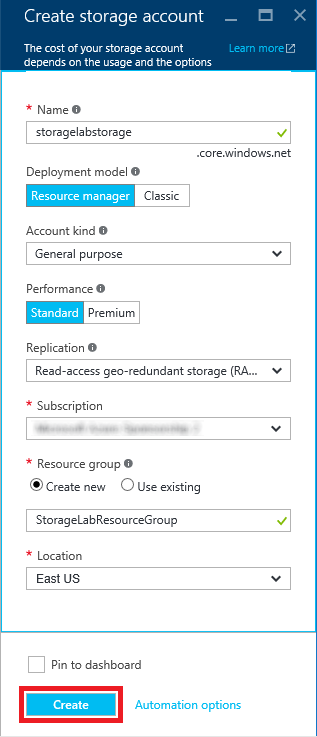

    _Specifying parameters for a new storage account_

1. After a few moments (it generally takes just a few seconds, but can sometimes take a few minutes), a tile representing the new storage account will appear on your dashboard. Click the tile to open a blade for the storage account.
 
    

    _Tile representing the new storage account_

1. In the blade for the storage account, click **Blobs** to view a list of containers associated with this account.

    

    _Viewing storage containers_

1. The storage account currently has no containers. Before you create a blob, you must create a container to store it in. While you can create containers in the Azure Portal, you cannot create blobs. In Exercise 2, you will use the Microsoft Azure Storage Explorer to create both.

    

    _The empty storage account_

### Exercise 2: Install the Microsoft Azure Storage Explorer ###

The [Microsoft Azure Storage Explorer](http://storageexplorer.com/) is a free tool that provides a graphical interface for working with Azure Storage on PCs running Windows, OS X, and Linux. It provides most of the same functionality as the Azure Portal. It also offers features the portal does not, such as the ability to upload blobs to Azure Storage. In this exercise, you will install and configure the Microsoft Azure Storage Explorer.

1. Open your browser and navigate to [http://storageexplorer.com/](http://storageexplorer.com/).

1. Click **Download for Windows**, **Download for Mac**, or **Download for Linux**, depending on which type of computer you're using.

    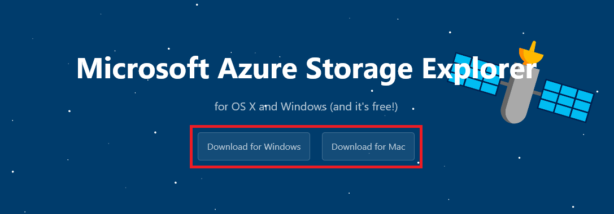

    _Downloading the Microsoft Azure Storage Explorer_

1. Once the download completes, install the Microsoft Azure Storage Explorer and then start it.

	> If you're using a Mac, you might be warned that "Your security preferences allow installation of only apps from the Mac App Store and identified developers" the first time you run the Storage Explorer. If this happens to you, go to **System Preferences** under the Apple menu, click **Security & Privacy**, go to the **General** tab, and set **Allow apps downloaded from** to **Anywhere**. You might still be prompted for confirmation the next time you run the app.

1. In the Storage Explorer window, click **Connect to Microsoft Azure**.

    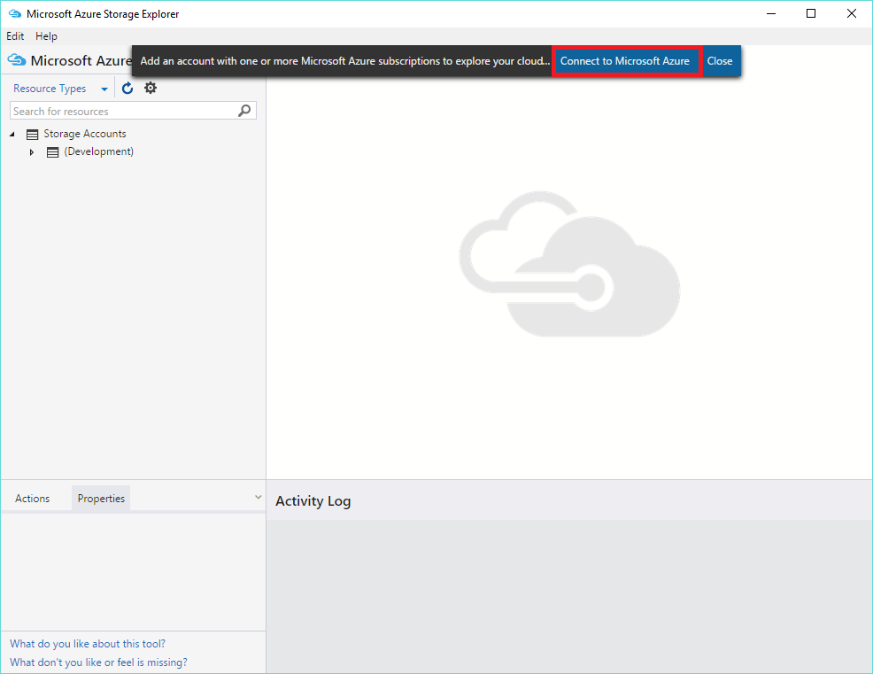

    _Connecting Storage Explorer to Azure_

1. Enter the e-mail address for your Microsoft account. Then click **Continue**.

    

    _Entering your e-mail address_

1. Enter the user name and password for your Microsoft account. Check the box labeled **Keep me signed in**. Then click the **Sign in** button.

    

    _Signing in to Storage Explorer_

1. Confirm that the storage account you created in Exercise 1 appears in the list of storage accounts shown in Storage Explorer. Then click the small arrow next to the storage account to display its contents.

    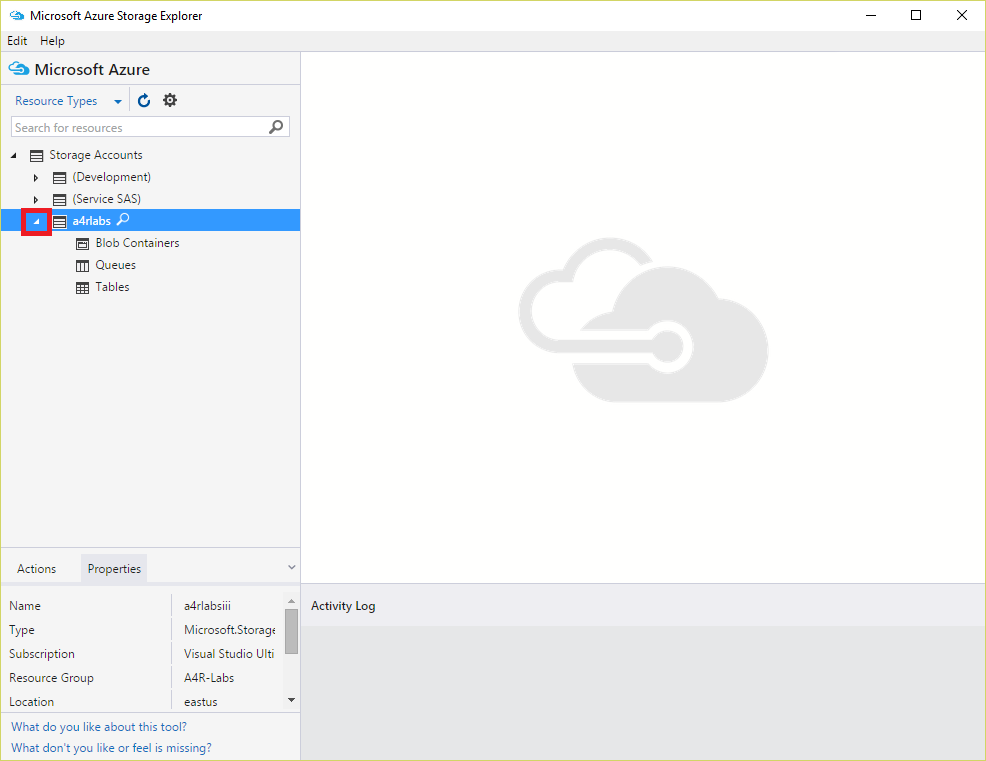

    _The Microsoft Azure Storage Explorer_

The Microsoft Azure Storage Explorer is now installed and ready to go. Let's put it work with your new storage account.

### Exercise 3: Use Storage Explorer to create a container and upload blobs ###

Before you can create a blob, you must create a container to store it in. A container is similar to a folder in a file system. A storage account can have an unlimited number of containers, and a container can store an unlimited number of blobs. Container names must be from 3 to 63 characters in length and may contain numbers, dashes, and lowercase letters. Dashes cannot be consecutive, and a container name cannot start with a dash. The following diagram illustrates the blob storage schema:

_Blob storage schema_

In this exercise, you will create a container named "images" in the storage account you created  in [Exercise 1](#Exercise1). Then you will upload several blobs to it.

1. In the Microsoft Azure Storage Explorer, right-click **Blob Containers** (on a Mac, Control-click instead) under the storage account you created in Exercise 1 and select **Create Blob Container** from the context menu.

    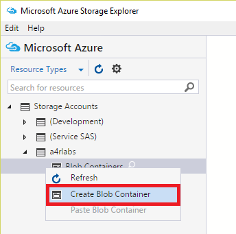

    _Creating a container_

1. Type "images" (without quotation marks) into the box that appears under **Blob Containers**. Then press Enter to create a new container named "images."

    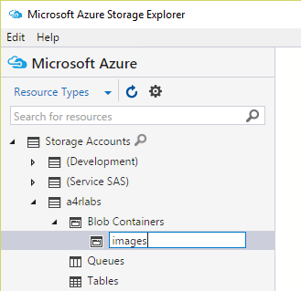

    _Creating an "images" container_

1. Double-click the "images" container to display its contents. (It is currently empty.)

    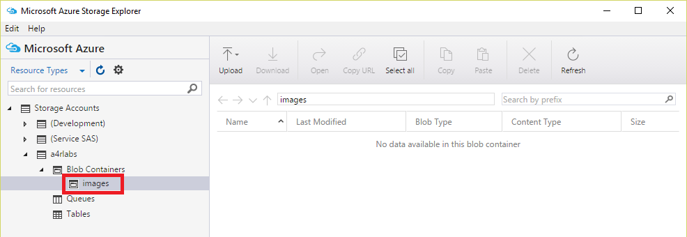

    _Opening the "images" container_

1. The next step is to create blobs by uploading files to the "images" container. The files you will upload are provided for you in the "resources" subdirectory of this lab. Click the **Upload** button in the Storage Explorer. Then select **Upload Files...** from the menu.

    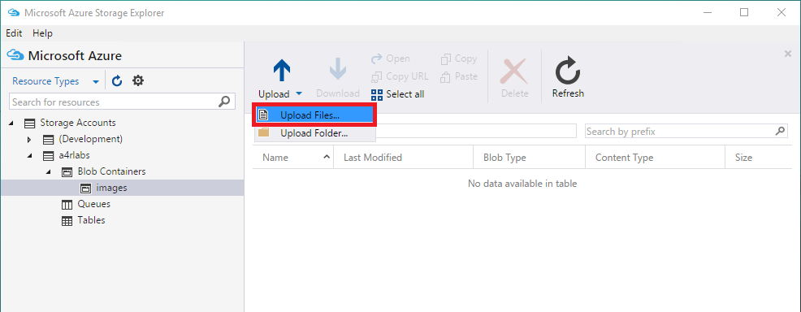

    _Uploading files to the "images" container_

1. Click the **...** button to the right of the field labeled "Files." In the ensuing dialog, navigate to this lab's "resources" subdirectory and select all the files in that subdirectory. (There are 10 of them, and each has the file-name extension .jpg.) Then close the dialog and click  the **Upload** button.

    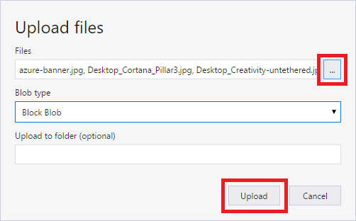

    _Uploading files to blob storage_

	> The default blob type — block blob — supports up to approximately 195 GB of data per blob. Append blobs are similar to block blobs but are optimized for append operations. Page blobs can hold up to 1 TB of data and can be used if you need to store more than 195 GB of data in a single blob.

1. Confirm that all ten .jpg files were uploaded to the "images" container.

    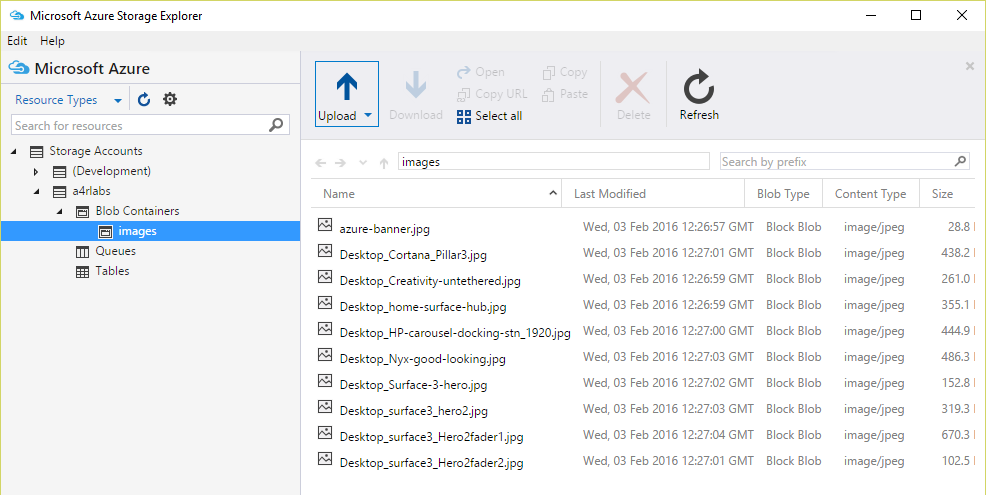

    _Blobs uploaded to the "images" container_

Uploading blobs is easy with the Microsoft Azure Storage Explorer. Now let's learn how to download blobs.

### Exercise 4: Use the Azure Portal to download a blob ###

You can download a blob using the Azure Storage Explorer by selecting the blob and clicking the **Download** button, or by right-clicking the blob and selecting **Download** from the ensuing menu.
You can also download blobs using the Azure Portal. In this exercise, you'll use the portal to download one of the blobs you uploaded in the previous exercise.

1. Return to the [Azure Portal](https://portal.azure.com) in your browser. If you left the "Blob service" blade open at the end of Exercise 1, click the **Refresh** button at the top of the blade to refresh the list of containers. If you didn't leave it open, navigate back to it. The click the "images" container to view its contents.

    

    _Viewing the blobs in the "images" container_

1. Verify that azure-banner.jpg appears in the list of blobs. Then click it to open the "Blob properties" blade.

    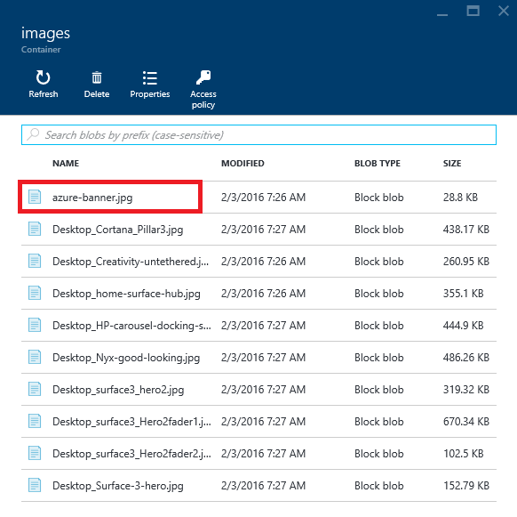

	_Image blobs uploaded to Azure Storage_

1. Click the **Download** button at the top of the blade to download azure-banner.jpg.

    

	_Downloading a blob_

1. Confirm that azure-banner.jpg appears in your browser:

    

	_Image blob downloaded from Azure Storage_

Now that you know how to upload and download blobs, it is time to think about the privacy of those blobs and how to share them with other researchers.

### Exercise 5: Share blobs using public containers ##

Each container that you create is assigned an access level that determines whether its contents are public or private. The default is private, which means that only you (or someone to whom you provide an access key for the storage account) can access the container's blobs. In this exercise, you will make the "images" container public and demonstrate that you can easily share blobs inside it using links that can be opened in a browser.

1. Return to the Microsoft Azure Storage Explorer and right-click (on a Mac, Control-click) the "images" container and select **Set Public Access Level...**.

    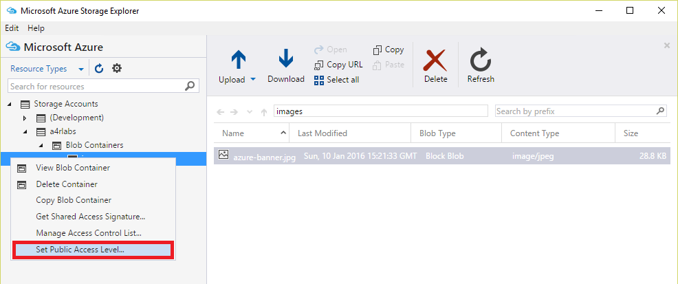

    _Changing the container's access level_

1. Select **Public read access for blobs only**. Then click the **Apply** button.

    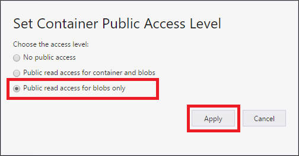

    _Setting the access level to public_

	> The difference between **Public read access for blobs only** and **Public read access for container and blobs** is that the latter allows the blobs in a container to be enumerated, while the former does not. **Public read access for blobs only** offers slightly more security because it prevents people from discovering other blobs in the container. To fetch the blob, they must know the blob's name.

1. Right-click azure-banner.jpg and select **Copy URL to Clipboard**.

    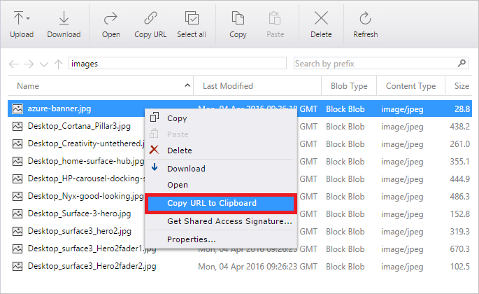

    _Getting a blob URL_

1. Now paste the URL into your browser's address bar. Confirm that the browser shows azure-banner.jpg:

    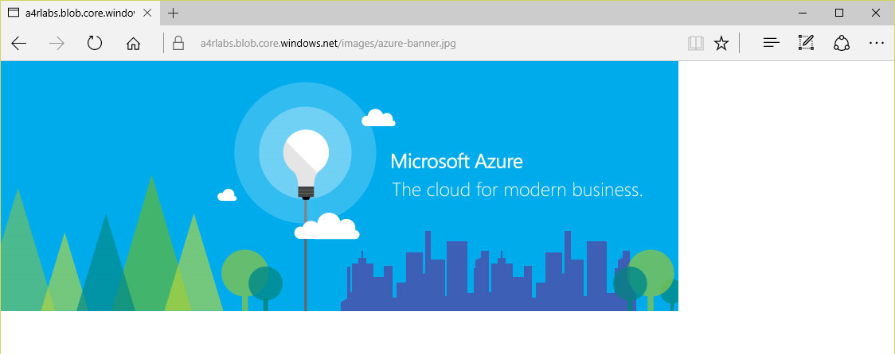

	_Image blob downloaded from Azure Storage_

1. Return to the Microsoft Azure Storage Explorer, right-click the "images" container, select **Set Public Access Level...** again, and this time set the container's access level to **No public access**.

    

    _Setting the access level to private_

1. Copy the URL for azure-banner.jpg to the clipboard again and paste it into your browser's address bar. Confirm that the image can't be downloaded this time. (The screen shot below was taken in Microsoft Edge. The exact output will vary from browser to browser.)

    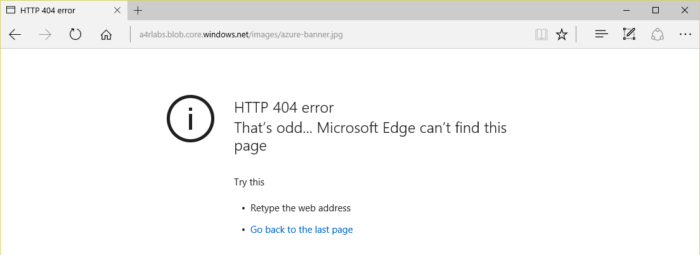

    _404 error_

Making a container public is one way to share the blobs with other people. But what if you only wanted to share *selected* blobs in that container while keeping the others private? And what if you wanted to limit the amount of time that the blob can be downloaded? That's where shared-access signatures come in.

### Exercise 6: Share blobs using shared-access signatures ##

Rather than create a separate (public) container to hold the blobs you wish to share, you can use shared-access signatures to share blobs from private containers. In this exercise, you will generate a URL containing a shared-access signature (SAS) for one of the blobs in the "images" container and demonstrate that the blob can be downloaded even though the container is private. You will also learn how to limit the amount of time a shared-access signature is valid.

1. Return to the Microsoft Azure Storage Explorer. Right-click azure-banner.jpg and select **Get Shared Access Signature**.

    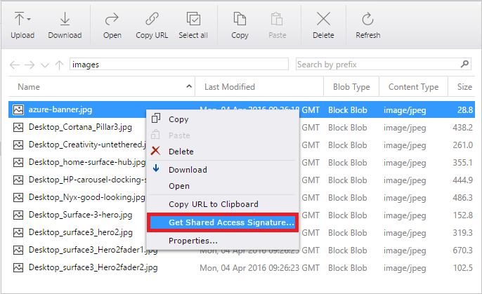

    _Getting a shared-access signature_

1. Set **Start time** to yesterday's date and **Expiry time** to a date a few days from now. Then click the **Create** button.

    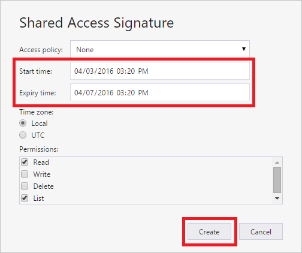

    _Creating a shared-access signature_

1. Click the **Copy** button to the right of the URL field to copy the blob URL containing a shared-access signature to the clipboard. Then click the **Close** button.

    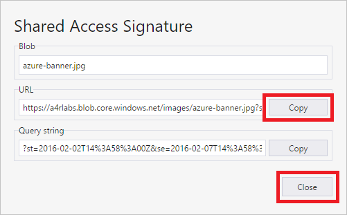

    _Copying a SAS URL to the clipboard_

1. Paste the URL into your browser's address bar and confirm that azure-banner.jpg appears, even though the container that holds it is private rather than public.

    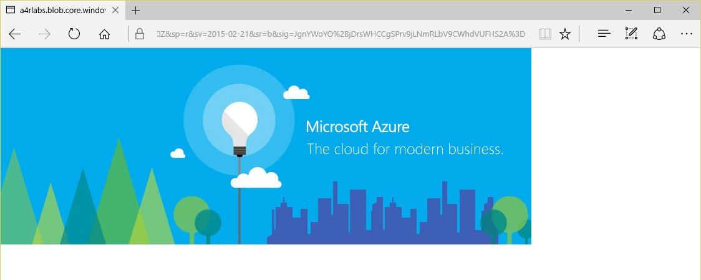

    _Using a SAS URL to download a blob_

Take a moment to examine the URL that you pasted into the browser. The long query string — everything after the question mark — is the shared-access signature. Embedded within it is information about when the signature expires. The signature is cryptographically signed so it can't be tampered with. For more information on shared-access signatures and their application to Azure Storage, see [Shared Access Signatures, Part 1: Understanding the SAS model](https://azure.microsoft.com/en-us/documentation/articles/storage-dotnet-shared-access-signature-part-1/).

### Exercise 7: Delete the resource group ###

When you created a storage account in Exercise 1, you made it part of a resource group named "A4R-Labs." One of the benefits of using resource groups is that deleting a resource group deletes all the resources inside it, including storage accounts and blobs. Deleting a resource group is a convenient way to delete complex Azure deployments without having to delete individual resources one by one. 

In this exercise, you'll use the Azure Portal to delete the storage account you created in Exercise 1, and along with it the container you created in that storage account and the blobs you uploaded to the container.

1. Open the [Azure Portal](https://portal.azure.com) in your browser and click **Resource groups** in the ribbon on the left. Then, in the "Resource groups" blade, click the resource group you wish to delete ("A4R-Labs"). Finally, click **Delete** in the blade for the resource group.

    

    _Deleting a resource group_

1. Because deleting a resource group is a permanent action that can't be undone, you must confirm that you want to delete it. Do so by typing the name of the resource group into the box labeled 
**TYPE THE RESOURCE GROUP NAME**. Then click **Delete** to delete the resource group and everything inside it.

    

    _Confirming resource-group deletion_

1. After a few minutes, you will be notified that the resource group was deleted. If the deleted resource group still appears in the "Resource groups" blade, click that blade's **Refresh** button to update the list of resource groups. The deleted resource group should go away.  

You can confirm that the storage account was deleted by clicking **All resources** in the vertical ribbon on the left side of the portal. The storage account no longer appears in the list of resources, which means it was deleted along with the resource group.

## Summary ##

Here's a quick summary of the important concepts that you learned in this lab:

- Azure Storage is a set of services for storing data durably and reliably
- Azure Storage blobs can contain any type of data, just like files in a file system, and are frequently used for input and output to other Azure services
- The Azure Portal enables you to perform basic storage operations, such as creating storage accounts
- The Microsoft Azure Storage Explorer runs on Windows, OS X, and Linux and supports many features the Azure Portal does not, such as the ability to upload blobs and generate shared-access signatures
- Shared-access signatures can be used to share blobs in private containers and limit the amount of time the blobs can be accessed
- Storage accounts and other resources that are placed inside a resource group can easily be deleted by deleting the resource group itself

Now that you're familiar with storage accounts, containers, and blobs, as well as some of the tools for managing them, you'll put your knowledge to work in subsequent labs. Knowing the basics of Azure Storage is an essential first step in working with Azure data services.

---

Copyright 2016 Microsoft Corporation. All rights reserved. 
Except where otherwise noted, these materials are licensed under the terms of the Apache License, Version 2.0. You may use it according to the license as is most appropriate for your project on a case-by-case basis. The terms of this license can be found in [http://www.apache.org/licenses/LICENSE-2.0](http://www.apache.org/licenses/LICENSE-2.0).
