
# Microsoft Azure Storage and the Azure CLI #

---

## Overview ##

Microsoft Azure Storage is a set of services that allows you to store large volumes of data in a cost-effective manner and in a way that makes the data readily and reliably available to services and applications that consume it. Data committed to Azure Storage can be stored in blobs, tables, queues, or files. [Azure blobs](http://azure.microsoft.com/en-us/services/storage/blobs/) are ideal for storing images, videos, and other other unstructured data, and are frequently used to provide input to and capture output from other Azure services such as [Azure Machine Learning](http://azure.microsoft.com/en-us/services/machine-learning/) and [Azure Stream Analytics](http://azure.microsoft.com/en-us/services/stream-analytics/). [Azure tables](http://azure.microsoft.com/en-us/services/storage/tables/) provide NoSQL storage for semi-structured data. [Azure queues](http://azure.microsoft.com/en-us/services/storage/queues/) support queued message transfers between applications (or parts of applications) and can be used to make applications more scalable and robust by eliminating hard dependencies between tham. Finally, [Azure Files](http://azure.microsoft.com/en-us/services/storage/files), which are currently in preview, use the Server Message Block (SMB) 2.1 protocol to share files in the cloud.

Data stored in Microsoft Azure Storage can be accessed over HTTP or HTTPS using straightforward REST APIs, or it can be accessed using rich client libraries available for many popular languages and platforms, including .NET, Java, Android, Node.js, PHP, Ruby, and Python. The [Azure Portal](https://portal.azure.com) offers partial support for Azure Storage, but richer functionality is available from third-party tools, many of which are free and some of which work cross-platform.

In this lab, you'll learn how to work with Azure storage accounts, storage containers, and storage blobs. You'll also get familiar with some of the tools used to manage them, including the [Azure Portal](https://portal.azure.com) and the [Azure Cross-Platform Command-Line Interface](https://azure.microsoft.com/en-us/documentation/articles/xplat-cli/), or *Azure CLI*, which works on a variety of operating systems and is arguably the most important tool (other than the Azure Portal) at your disposal for working with Microsoft Azure. The knowledge you gain will be used in later labs featuring Azure services that rely on blob storage for input and output. 

### Objectives ###

In this hands-on lab, you will learn how to:

- Create storage accounts using the Azure Portal
- Create storage containers using the Azure CLI
- Upload blobs to storage using the Azure CLI
- Download blobs from storage using the Azure Portal
- Automate common storage tasks by scripting CLI commands
- Delete storage accounts using the Azure Resource Manager

### Prerequisites ###

The following is required to complete this hands-on lab:

- A Microsoft Azure subscription - [sign up for a free trial](http://aka.ms/WATK-FreeTrial)

----

## Exercises ##

This hands-on lab includes the following exercises:

- [Exercise 1: Use the Azure Portal to create a storage account](#Exercise1)
- [Exercise 2: Install and configure the Azure CLI](#Exercise2)
- [Exercise 3: Use the Azure CLI to create a container and upload blobs](#Exercise3)
- [Exercise 4: Automate storage tasks by scripting CLI commands](#Exercise4)
- [Exercise 5: Delete the resource group](#Exercise5)

Estimated time to complete this lab: **60** minutes.

### Exercise 1: Use the Azure Portal to create a storage account ###

The [Azure Portal](https://portal.azure.com) allows you to perform basic storage operations such as creating storage accounts, viewing what's stored under those accounts, and managing the access keys associated with the accounts. In this exercise, you'll use the portal to create a storage account.

1. Go to the [Azure Portal](https://portal.azure.com/) and sign in using the Microsoft credentials associated with your subscription.
 
1. The first step in using Azure Storage is to create one or more storage accounts. To create a storage account, click **+ NEW** in the ribbon on the left. Then click **Data + Storage**, followed by **Storage account**.

    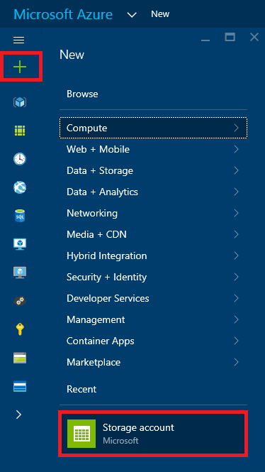

    _Creating a storage account_

1. Select **Resource Manager** in the drop-down list under **Select a deployment model**, and then click the **Create** button.

	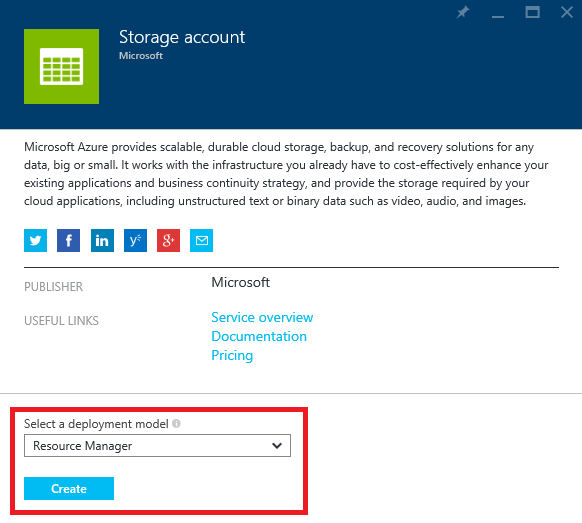

	_Selecting a deployment model_

	> The default demployment model, **Classic**, creates a "classic" storage account that doesn't fall under the purview of the [Azure Resource Manager](https://azure.microsoft.com/en-us/documentation/articles/resource-group-overview/). Specifying **Resource Manager** as the deployment model provides you with more flexibility later on by ensuring that the account is explicitly added to a resource group, and it makes the storage account a first-class citizen in the Azure environment. For more information, see [Understanding Resource Manager deployment and classic deployment](https://azure.microsoft.com/en-us/documentation/articles/resource-manager-deployment-model/).

	> Resource groups are a relatively recent addition to Azure and are a powerful construct for grouping resources such as storage accounts, databases, and virtual machines together so that they can be managed as a group. Imagine that you created a complex application consisting of multiple storage accounts, a cluster of VMs, a SQL database, and perhaps a Stream Analytics solution and a pair of event hubs. Now you want to create a new instance of the application using a different account. By assembling all these resources into a resource group, you can take advantage of [Azure deployment templates](https://azure.microsoft.com/en-us/documentation/articles/arm-template-deployment/) to script the creation of the entire application. In addition, you can use role-based security to restrict access to resources in a resource group, and you can delete the application — and all the resources that comprise it — by deleting the resource group. You will learn more about resource groups and deployment templates in subsequent labs.

1. Enter a name for the new storage account in **Name** field. The name is important, because it forms one part of the URL through which storage items created under this account will be accessed. Storage account names can be 3 to 24 characters in length and can only contain numbers and lowercase letters. In addition, the name you enter must be unique within Azure; if someone else has chosen the same name, you'll be notified that the name isn't available.

	Once you have a name that Azure will accept (as indicated by the green check mark in the text field), type "A4R-Labs" (without quotation marks) into the **Resource group** field, and click **Location** and choose the region nearest you. Then click the **Create** button to create the new storage account.
 
    

    _Specifying parameters for a new storage account_

1. After a few moments (it generally takes just a few seconds, but can sometimes take several minutes), a tile representing the new storage account will appear on your dashboard. Click the tile to open a blade for the storage account.
 
    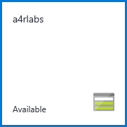

    _Tile representing the new storage account_

1. In the blade for the storage account, click the key icon to open the "Access keys" blade.

    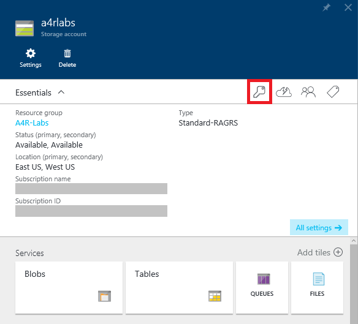

    _Viewing access keys_

1. This blade shows the access keys associated with the account. You'll use the primary access key a lot when using the Azure CLI, because any CLI command that accesses storage will require an account name and an account key for authentication. Go ahead and save the primary key in a location where you can easily access it later in this lab. You can click the button to the right of the first **KEY1** to copy it to the clipboard, and then paste it into your favorite text editor or wherever else is convenient.

    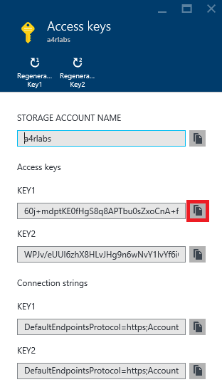

    _The storage account's access keys_

1. Return to the blade for the storage account and click **Blobs** to view a list of containers associated with this account.

    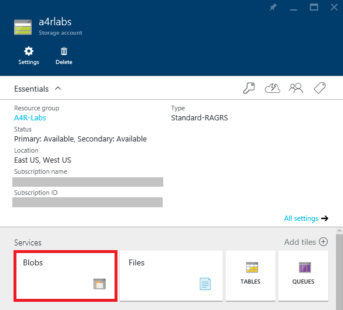

    _Viewing storage containers_

1. The storage account currently has no containers. Before you create a blob, you must create a container to store it in. You can create containers in the Azure Portal, but you can't create blobs. In this lab, you will create containers and blobs with the Azure Cross-Platform Command-Line Interface.

    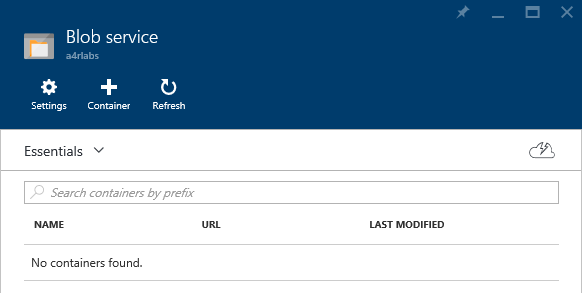

    _The empty storage account_

### Exercise 2: Install and configure the Azure CLI ###

The [Azure Cross-Platform Command-Line Interface](https://azure.microsoft.com/en-us/documentation/articles/xplat-cli/) (CLI) is an open-source tool that provides a set of cross-platform commands for working with Microsoft Azure. The CLI provides most of the same functionality as the Azure Portal. It also offers features the portal does not, such as the ability to upload blobs to Azure Storage. In this exercise, you will install and configure the Azure CLI.

1. The Azure CLI is a Node.js application, and it is installed with the Node.js package manager (npm). To determine whether Node.js and npm are installed on your computer, open a command-prompt or terminal window and execute the following command:

	<pre>
	npm -v
	</pre>

	If npm responds with a version number, then **skip to Step 4** to install the CLI. Otherwise, proceed to Step 2.

1. If you are running Windows or OS X, visit the [Node.js Web site](http://nodejs.org) and follow the instructions there for downloading and installing Node.js. Then **skip to Step 4** to install the CLI.

1. If you are running Linux, navigate to [Install the Azure CLI](https://azure.microsoft.com/en-us/documentation/articles/xplat-cli-install/) and follow the instructions there to install Node.js and npm on Linux.

1. Now that Node.js and npm are installed, run the following command to install the Azure CLI:

	<pre>
	npm install -g azure-cli
	</pre>

	> As noted in [Install the Azure CLI](https://azure.microsoft.com/en-us/documentation/articles/xplat-cli-install/), if you're running Linux or OS X, you might have to prefix the **npm** command with the **sudo** command in order for npm to work.

1. Once the Azure CLI is installed, you can use the **azure** command from your operating system's command line to perform Azure-related tasks. To see a list of commands available, and to verify that the Azure CLI is properly installed, execute the following command:

	<pre>
	azure
	</pre>

	You should see output similar to the following:

    <pre>
	info:             _    _____   _ ___ ___
	info:            /_\  |_  / | | | _ \ __|
	info:      _ ___/ _ \__/ /| |_| |   / _|___ _ _
	info:    (___  /_/ \_\/___|\___/|_|_\___| _____)
	info:       (_______ _ _)         _ ______ _)_ _
	info:              (______________ _ )   (___ _ _)
	info:
	info:    Microsoft Azure: Microsoft's Cloud Platform
	info:
	info:    Tool version 0.9.12
	help:
	help:    Display help for a given command
	help:      help [options] [command]
	help:
	help:    Log in to an Azure subscription using Active Directory. Currently, the user can login only via Microsoft organizational account
	help:      login [options] [username]
	help:
	help:    Log out from Azure subscription using Active Directory. Currently, the user can log out only via Microsoft organizational account
	help:      logout [options] [username]
	help:
	help:    Open the portal in a browser
	help:      portal [options]
	help:
	help:    Commands:
	help:      account        Commands to manage your account information and publish settings
	help:      config         Commands to manage your local settings
	help:      hdinsight      Commands to manage HDInsight clusters and jobs
	help:      mobile         Commands to manage your Mobile Services
	help:      network        Commands to manage your networks
	help:      sb             Commands to manage your Service Bus configuration
	help:      service        Commands to manage your Cloud Services
	help:      site           Commands to manage your Web Sites
	help:      sql            Commands to manage your SQL Server accounts
	help:      storage        Commands to manage your Storage objects
	help:      vm             Commands to manage your Virtual Machines
	help:
	help:    Options:
	help:      -h, --help     output usage information
	help:      -v, --version  output the application version
	</pre>

1. Before you can do much with the Azure CLI, you must connect it to an Azure subscription. One way to do that is to log in using your Microsoft account. To begin the login process, execute the following command, substituting your Microsoft account user name for *username*:

    <pre>
    azure login <i>username</i>
    </pre>

	The CLI will respond by displaying a message containing an alphanumeric code and a login URL:

	<pre>
	info:    Executing command login
	info:    To sign in, use a web browser to open the page https://aka.ms/devicelogin. Enter the code A6X33J44Q to authenticate. If you're signing in as an Azure AD application, use the --username and --password parameters.
	</pre>

1. Go to [https://aka.ms/devicelogin](https://aka.ms/devicelogin) and type in the code obtained in the previous step. Then click **Continue**.

    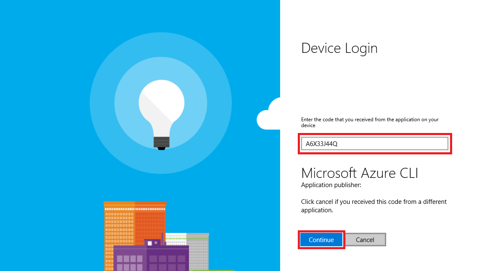

    _Entering the access code_

	> If you have multiple Microsoft accounts, you will be asked which one you wish to use to log in. Select the account that you used to set up your Azure subscription for this lab, and if prompted, enter the password for the account.

1. If the login is successful, you will be told that you have signed in and invited to close the browser window. Close your browser and return to the CLI.

    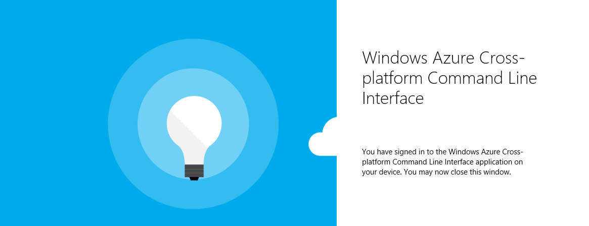

    _Successful login_

1. The next step is to make sure that if there are multiple subscriptions associated with your account, the one you used in Exercise 1 is set as the default. To view the subscriptions associated with the account you imported, execute the following command:

    <pre>
    azure account list
    </pre>

    If only one subscription is listed, move on to the next step. If two or more subscriptions are listed, execute the following command, replacing *subscription* with the name or ID of the subscription you used in Exercise 1:

    <pre>
    azure account set <i>subscription</i>
    </pre>

1. Next, execute the following command to switch the CLI to Azure Resource Manager mode. This is necessary because the storage account you created in Exercise 1 is a Resource-Manager account:

	<pre>
	azure config mode arm
	</pre>

1. Now use the following command to list all of the Resource-Manager storage accounts associated with your subscription and confirm that the account you created in [Exercise 1](#Exercise1) is present:

    <pre>
    azure storage account list
    </pre>

1. In order to use a storage account from the CLI, you must know the storage account's name, and you must have the storage account's access key. You can get that key from the Azure Portal, (as you did in Exercise 1), or you can get it from the  CLI. To display a list of keys associated with the storage account, run the following command, replacing *accountname* with the name of the storage account and *resourcegroup* with the resource group you created in Exercise 1:

    <pre>
    azure storage account keys list <i>accountname</i> -g <i>resourcegroup</i>
    </pre>

	The CLI will respond something like this:

	<pre>
	info:    Executing command storage account keys list
	+ Getting storage account keys
	data:    Primary: Ttm20TIsZZ4Mo440EKp8nsX+pB6S3x3AFILxoQ7XgG5y9aZDE+Zaphsi1QuMqd/DaS72j8d6S3M5ZtqGKioqOA==
	data:    Secondary: V31u0fm23lgdDJKLd654lbmvFTPgJ2xC3k1whQl20+h/TC9wr2+Ck1EquzUsZ00HG563d1m1uc2CSiF/blStNA==
	info:    storage account keys list command OK
    </pre>

	The keys listed here are the same ones you saw in the "Access keys" blade in Exercise 1.
	If you haven't already made a copy of the primary access key, do it now so you can easily retrieve it later.

### Exercise 3: Use the Azure CLI to create a container and upload blobs ###

Before you can create a blob, you must create a container to store it in. A container is similar to a folder in a file system. A storage account can have an unlimited number of containers, and a container can store an unlimited number of blobs. Container names must be from 3 to 63 characters in length and may contain numbers, dashes, and lowercase letters. Dashes cannot be consecutive, and a container name cannot start with a dash. The following diagram illustrates the blob storage schema:

_Blob storage schema_

In this exercise, you will create a container named "images" in the storage account you created  in [Exercise 1](#Exercise1). Then you will upload blobs to it and learn how to access those blobs in the portal.

1. At a command prompt or terminal window, execute the following command, replacing *accountname* with the name of your storage account and *accountkey* (surrounded by double quote marks) with the account's primary access key:

    <pre>
    azure storage container create -a <i>accountname</i> -k "<i>accountkey</i>" -p blob images
    </pre>

	The CLI should respond with output similar to the following:

	<pre>
	info:    Executing command storage container create
	+ Creating storage container images
	+ Getting Storage container information
	data:    {
	data:        name: 'images',
	data:        metadata: {},
	data:        etag: '"0x8D29F33E5925FA6"',
	data:        lastModified: 'Fri, 07 Aug 2015 14:24:25 GMT',
	data:        leaseStatus: 'unlocked',
	data:        leaseState: 'available',
	data:        requestId: '09cd3b60-0001-00cc-571c-d14c48000000',
	data:        publicAccessLevel: 'Blob'
	data:    }
	info:    storage container create command OK
	</pre>

	Notice the line in the output that reads "publicAccessLevel: 'Blob'". By default, the containers you create are private, which means that the container and its contents can only be accessed by the owner of the storage account (or anyone who has the container's access key). However, the "-p blob" switch you included in the command that created the container allows anonymous read access to blobs in that container. This is generally the way you configure a container that holds images and other public assets for Web sites. 

1. The next step is to create a blob by uploading a file to the "images" container. The file you will upload is named azure-banner.jpg and is provided for you in the "resources" subdirectory of this lab. At the command prompt, navigate to this lab's "resources" subdirectory.

1. Execute the following command, replacing *accountname* with the storage account's name and *accountkey* (surrounded by double quotes) with the storage account's key to create a blob named "banner.jpg" in the "images" container:

    <pre>
    azure storage blob upload -a <i>accountname</i> -k "<i>accountkey</i>" azure-banner.jpg images banner.jpg
    </pre>

	> In this command, "azure-banner.jpg" is the name of and path to the file you wish to upload (no path name is required since it's in the current directory), "images" is the container you're uploading to, and "banner.jpg" is the name assigned to the blob.

	If the blob is successfully uploaded, you will receive the following confirmation from the CLI:

	<pre>
	info:    Executing command storage blob upload
	+ Checking blob banner.jpg in container images
	+ Uploading azure-banner.jpg to blob azure-banner.jpg in container images
	Percentage: 100.0% (28.80KB/28.80KB) Average Speed: 28.80KB/S Elapsed Time: 00:0
	0:00
	+ Getting Storage blob information
	data:    Property       Value
	data:    -------------  ------------------------
	data:    container      images
	data:    blob           banner.jpg
	data:    blobType       BlockBlob
	data:    contentLength  29490
	data:    contentType    image/jpeg
	data:    contentMD5     +AKWVCtqIG0gsVOoc2fQqw==
	info:    storage blob upload command OK
	</pre>

1. Because the container's access level is "Blob," you should be able to fetch the blob with a simple HTTP request. To prove it, open your browser and navigate to the following URL, once more replacing *accountname* with the name of your storage account:

	<pre>
	http://<i>accountname</i>.blob.core.windows.net/images/banner.jpg
	</pre>

	Here's what you'll see in your browser:

    

	_Image blob downloaded from Azure storage_

1. You can also see the blob that you uploaded in the Azure Portal. To see it, return to the [Azure Portal](https://portal.azure.com) in your browser. Click **Storage accounts** in the ribbon on the left. Then click the storage account you created in Exercise 1. (If **Storage accounts** doesn't appear in the ribbon, click **Resource groups** instead and navigate to the storage account through the "A4R-Labs" resource group.)

    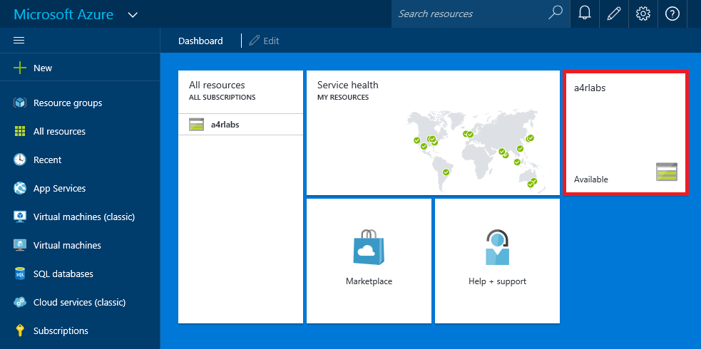

    _Viewing storage accounts_

1. Click **Blobs** to view the containers in this storage account.

    

    _Viewing storage containers_

1. Click the "images" container to view its contents.

    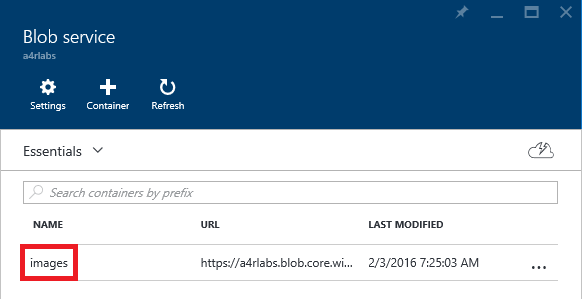

    _Viewing the blobs in the "images" container_

1. Verify that banner.jpg appears in the list of blobs. Then click it to open the "Blob properties" blade.

    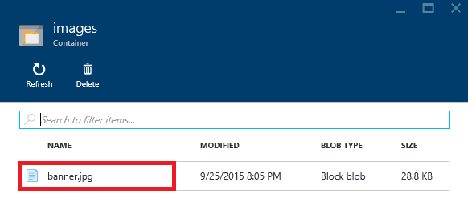

	_Image blob uploaded to Azure storage_

1. Click the **Download** button at the top of the blade to download and open banner.jpg. Confirm that you see the same image you saw before.

    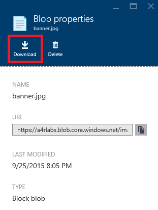

	_Downloading a blob_

1. In Step 4, you saw that the storage account name and the container name form parts of the URL through which a blob is accessed. But what if you wanted to create a hierarchy of containers? What if, for example, you wanted "images/banner.jpg" in the URL to be "images/azure/banner.jpg"? You can't create nested containers, but you *can* include forward slashes in blob names to simulate container hierarchies. To demonstrate, run the following command in the CLI, once more providing the storage account's name and key:

    <pre>
    azure storage blob upload -a <i>accountname</i> -k "<i>accountkey</i>" azure-banner.jpg images azure/banner.jpg
    </pre>

1. Now enter the following URL in your browser and confirm that the image blob appears:

	<pre>
	http://<i>accountname</i>.blob.core.windows.net/images/azure/banner.jpg
	</pre>

1. Finish up by executing the following command to delete the blob you just created:

    <pre>
    azure storage blob delete -a <i>accountname</i> -k "<i>accountkey</i>" images azure/banner.jpg
    </pre>

### Exercise 4: Automate storage tasks by scripting CLI commands  ###

One benefit of using the Azure CLI is that you can combine it with a scripting engine to automate time-consuming tasks. For example, what if you wanted to upload a directory full of images from your PC to blob storage? Rather than upload them one at a time with discrete CLI commands, you could write a script that enumerates the files in that directory and invokes an **azure storage blob upload** command on each one. 

In this exercise, you'll write and test a pair of scripts that automate common Azure Storage tasks. Linux and OS X users will use Bash scripts, while Windows users will use PowerShell scripts.

> There are free Bash shells available for Windows, too, including [Cygwin](https://www.cygwin.com/) and [Git for Windows](https://git-for-windows.github.io/). If you use Windows and care to install a Bash shell (or already have one installed), feel free to skip the PowerShell steps below and follow the instructions for Linux and OS X users.

1. If you're using Windows, **skip to Step 5**. The next few steps are for users running Linux, OS X, and other operating systems that support Bash scripts.

1. Go to a terminal window and navigate to the directory containing this lab. In that directory, you'll find a subdirectory named "resources" containing a number of JPG images.

1. In the lab directory — the one containing the "resources" subdirectory — use your favorite editor to create a text file named copyimages.sh containing the following statements. Replace *accountname* with the name of your storage account, and *accountkey* with the storage account's primary access key:

	<pre>
	cd resources 
	for f in *.jpg 
	do 
	    azure storage blob upload -a <i>accountname</i> -k "<i>accountkey</i>" "${f##*/}" images "${f##*/}" 
	done 
	cd .. 
	</pre>

1. Execute the following command to run copyimages.sh:

	<pre>
	bash copyimages.sh
	</pre>

	**Now skip to Step 9**. Steps 5 through 8 are for PowerShell users only.

1. To script Azure commands with PowerShell, you first need to [install and configure Azure PowerShell](https://azure.microsoft.com/en-us/documentation/articles/powershell-install-configure/). If Azure PowerShell is not installed on your system, take the time to install it now.

1. Once you have installed Azure PowerShell, you will need to configure it to allow script execution. (For security reasons, PowerShell by default does not allow PowerShell scripts to execute.) Start Azure PowerShell **as an administrator** and execute the following command:

	<pre>
	Set-ExecutionPolicy RemoteSigned
	</pre>
 
1. Now close the Azure PowerShell window and open another one, this time **not** running as an administrator. At the Azure PowerShell command prompt, navigate to the directory for this lab — the one containing the "resources" subdirectory, which holds a collection of JPG images — and create a text file named copyimages.ps1 containing the statements below. Replace *accountname* and *accountkey* with your storage account's name and primary access key:

	<pre>
	cd resources
	$context = New-AzureStorageContext -StorageAccountName <i>accountname</i> -StorageAccountKey "<i>accountkey</i>"
	foreach ($file in Get-ChildItem *.jpg) {
	    Set-AzureStorageBlobContent -Blob $file.Name -Container "images" -File $file.Name -Context $context -Force
	}
	cd ..
	</pre>

1. Execute the following command to upload all the images in the "resources" subdirectory as blobs to Azure Storage:

	<pre>
    .\copyimages.ps1
	</pre>

1. Return to the [Azure Portal](https://portal.azure.com/) and open your storage account's "images" container. Verify that all the .jpg files in the "resources" subdirectory were uploaded to the container. (Note that if the blade showing the contents of the "images" container was left open in the portal, you will need to click the **Refresh** button to see the changes.)

    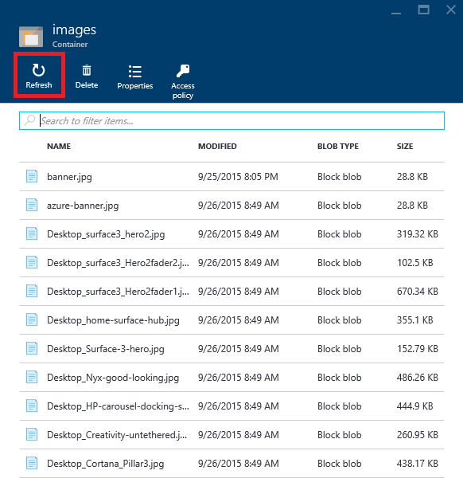

    _Blobs uploaded to the images container_

1. Now return to the command prompt and make sure you're in the directory for this lab.

1. Next, you're going to create a script that renames a blob. Technically, you can't rename a blob, but you *can* delete a blob and upload a new blob with the new name. If you prefer Bash scripts, create a new text file named renameblob.sh containing the following statements. As usual, replace *accountname* and *accountkey* with your storage account's name and key.

	<pre>
	# syntax: renameblob.sh [container] [old-blob-name] [new-blob-name] [path]
	azure storage blob delete -a <i>accountname</i> -k "<i>accountkey</i>" $1 "$2"
	azure storage blob upload -a <i>accountname</i> -k "<i>accountkey</i>" "$4" $1 "$3"
	</pre>

1. If you are a Windows user and prefer PowerShell scripts instead, create a new text file named renameblob.ps1 containing the following statements. As usual, replace *accountname* and *accountkey* with your storage account's name and primary access key:

	<pre>
	param([string]$container, [string]$oldname, [string]$newname, [string]$path)
	$context = New-AzureStorageContext -StorageAccountName <i>accountname</i> -StorageAccountKey <i>accountkey</i>
	Remove-AzureStorageBlob -Container $container -Blob $oldname -Context $context
	Set-AzureStorageBlobContent -Blob $newname -Container $container -File $path -Context $context -Force
	</pre>

1. Now use the script you just created to rename one of the blobs in the "images" container. Use the following command to execute the Bash script:

	<pre>
	bash renameblob.sh images Desktop_Cortana_Pillar3.jpg Cortana.jpg resources/Desktop_Cortana_Pillar3.jpg
	</pre>

	The equivalent Azure PowerShell command is:

	<pre>
	.\renameblob.ps1 images Desktop_Cortana_Pillar3.jpg Cortana.jpg resources/Desktop_Cortana_Pillar3.jpg
	</pre>

1. Return to the [Azure Portal](https://portal.azure.com/), open the "images" container, and confirm that the blob named Desktop\_Cortana\_Pillar3.jpg was renamed to Cortana.jpg. (If the blade showing the contents of the "images" container was left open, you will need to click **Refresh** button to see the change.)

    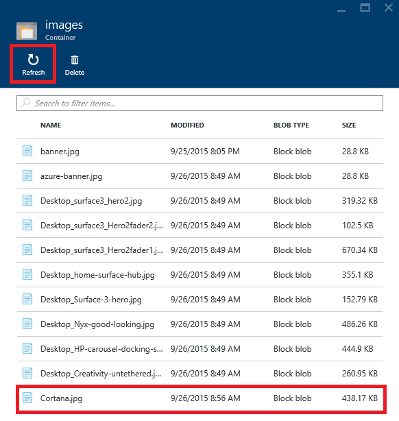

    _The renamed blob_

There's much more you can do when scripting the Azure CLI than these simple examples demonstrate. For example, you can pipe the output from **azure** commands to other commands such as **grep** and **awk**, and you can use the -v (or --verbose) switch to output JSON data. For more information and some cool examples, see [How to script the Azure CLI for Mac, Linux, and Windows](https://azure.microsoft.com/en-us/documentation/articles/xplat-cli/#how-to-script-the-azure-cli-for-mac-linux-and-windows) on the Azure Web site.

### Exercise 5: Delete the resource group ###

When you created a storage account in Exercise 1, you made it part of a resource group named "A4R-Labs." One of the benefits of using resource groups is that deleting a resource group deletes all the resources inside it, including storage accounts and blobs. Deleting a resource group is a convenient way to delete complex Azure deployments without having to delete individual resources one by one. 

In this exercise, you'll use the Azure Portal to delete the storage account you created in Exercise 1, and along with it the containers and blobs you created in Exercises 3 and 4.

1. Open the [Azure Portal](https://portal.azure.com) in your browser and click **Resource groups** in the ribbon on the left. Then, in the "Resource groups" blade, click the resource group you wish to delete ("A4R-Labs"). Finally, click **Delete** in the blade for the resource group.

    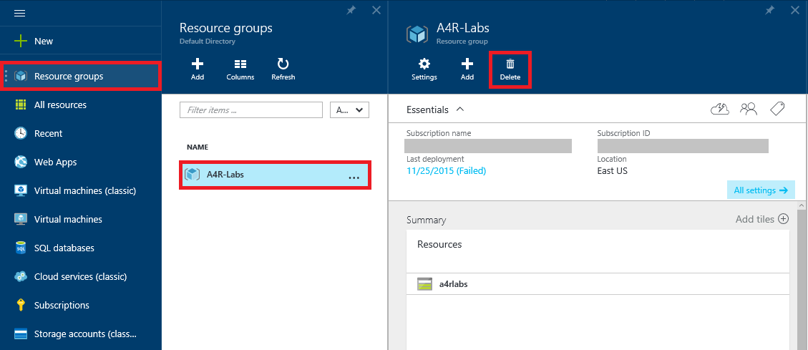

    _Deleting a resource group_

1. Because deleting a resource group is a permanent action that can't be undone, you must confirm that you want to delete it. Do so by typing the name of the resource group into the box labeled 
**TYPE THE RESOURCE GROUP NAME**. Then click **Delete** to delete the resource group and everything inside it.

    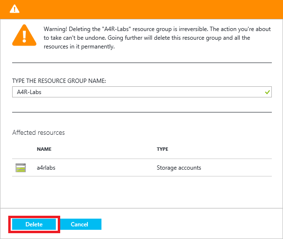

    _Confirming resource-group deletion_

1. After a few minutes, you will be notified that the resource group was deleted. If the deleted resource group still appears in the "Resource groups" blade, click that blade's **Refresh** button to update the list of resource groups. The deleted resource group should go away.  

## Summary ##

Here's a quick summary of the important concepts that you learned in this lab:

- Azure Storage is a set of services for storing data durably and reliably
- The Azure Portal enables you to perform basic storage operations, such as creating storage accounts and viewing blobs and containers
- Azure Storage blobs can contain any type of data, just like files in a file system
- The Azure Cross-Platform Command-Line Interface (CLI) is a cross-platform tool that supports many features the Azure Portal does not, such as the ability to upload blobs
- The Azure CLI can be combined with scripting languages to simplify storage tasks that require multiple commands
- Storage accounts and other resources that are placed inside a resource group can easily be deleted by deleting the resource group itself

Now that you're familiar with storage accounts, containers, and blobs, as well as some of the tools for managing them, you'll put your knowledge to work in subsequent labs. Knowing the basics of Azure Storage is an essential first step in working with Azure data services.

---

Copyright 2015 Microsoft Corporation. All rights reserved. 
Except where otherwise noted, these materials are licensed under the terms of the Apache License, Version 2.0. You may use it according to the license as is most appropriate for your project on a case-by-case basis. The terms of this license can be found in [http://www.apache.org/licenses/LICENSE-2.0](http://www.apache.org/licenses/LICENSE-2.0).
