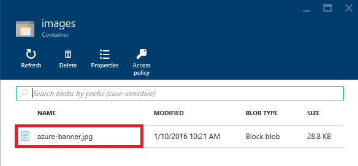
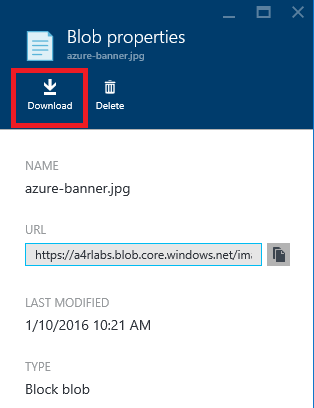

# Using Azure Storage #

---

## Overview ##

Microsoft Azure Storage is a set of services that allows you to store large volumes of data in a cost-effective manner and in a way that makes the data readily and reliably available to services and applications that consume it. Data committed to Azure Storage can be stored in blobs, tables, queues, or files. [Azure blobs](http://azure.microsoft.com/en-us/services/storage/blobs/) are ideal for storing images, videos, and other other unstructured data, and are frequently used to provide input to and capture output from other Azure services such as [Azure Machine Learning](http://azure.microsoft.com/en-us/services/machine-learning/) and [Azure Stream Analytics](http://azure.microsoft.com/en-us/services/stream-analytics/). [Azure tables](http://azure.microsoft.com/en-us/services/storage/tables/) provide NoSQL storage for semi-structured data. [Azure queues](http://azure.microsoft.com/en-us/services/storage/queues/) support queued message transfers between applications (or parts of applications) and can be used to make applications more scalable and robust by eliminating hard dependencies between tham. Finally, [Azure Files](http://azure.microsoft.com/en-us/services/storage/files), which are currently in preview, use the Server Message Block (SMB) 2.1 protocol to share files in the cloud.

Data stored in Microsoft Azure Storage can be accessed over HTTP or HTTPS using straightforward REST APIs, or it can be accessed using rich client libraries available for many popular languages and platforms, including .NET, Java, Android, Node.js, PHP, Ruby, and Python. The [Azure Portal](https://portal.azure.com) offers partial support for Azure Storage, but richer functionality is available from third-party tools, many of which are free and some of which work cross-platform.

In this lab, you'll learn how to work with Azure storage accounts, storage containers, and storage blobs. You'll also get familiar with some of the tools used to manage them, including the [Microsoft Azure Storage Explorer](http://storageexplorer.com/), a free tool from Microsoft that runs on Windows and OS X. The knowledge you gain will be used in later labs featuring Azure services that rely on blob storage for input and output. 

### Objectives ###

In this hands-on lab, you will learn how to:

- Create storage accounts using the Azure Portal
- Create storage containers using the Microsoft Azure Storage Explorer
- Upload blobs to storage using the Microsoft Azure Storage Explorer
- Download blobs from storage using the Azure Portal
- Delete storage accounts using the Azure Resource Manager

### Prerequisites ###

The following is required to complete this hands-on lab:

- A Microsoft Azure subscription - [sign up for a free trial](http://aka.ms/WATK-FreeTrial)

----

## Exercises ##

This hands-on lab includes the following exercises:

- [Exercise 1: Use the Azure Portal to create a storage account](#Exercise1)
- [Exercise 2: Install the Microsoft Azure Storage Explorer](#Exercise2)
- [Exercise 3: Use Storage Explorer to create a container and upload a blob](#Exercise3)
- [Exercise 4: Use the Azure Portal to download a blob](#Exercise4)
- [Exercise 5: Delete the resource group](#Exercise5)

Estimated time to complete this lab: **45** minutes.

### Exercise 1: Use the Azure Portal to create a storage account ###

The [Azure Portal](https://portal.azure.com) allows you to perform basic storage operations such as creating storage accounts, viewing what's stored under those accounts, and managing the access keys associated with the accounts. In this exercise, you'll use the portal to create a storage account.

1. Go to the [Azure Portal](https://portal.azure.com/) and sign in using the Microsoft credentials associated with your subscription.
 
1. The first step in using Azure Storage is to create one or more storage accounts. To create a storage account, click **+ NEW** in the ribbon on the left. Then click **Data + Storage**, followed by **Storage account**.

    

    _Creating a storage account_

1. Select **Resource Manager** in the drop-down list under **Select a deployment model**, and then click the **Create** button.

	

	_Selecting a deployment model_

	> The default demployment model, **Classic**, creates a "classic" storage account that doesn't fall under the purview of the [Azure Resource Manager](https://azure.microsoft.com/en-us/documentation/articles/resource-group-overview/). Specifying **Resource Manager** as the deployment model provides you with more flexibility later on by ensuring that the account is explicitly added to a resource group, and it makes the storage account a first-class citizen in the Azure environment. For more information, see [Understanding Resource Manager deployment and classic deployment](https://azure.microsoft.com/en-us/documentation/articles/resource-manager-deployment-model/).

	> Resource groups are a relatively recent addition to Azure and are a powerful construct for grouping resources such as storage accounts, databases, and virtual 
	> hines together so that they can be managed as a group. Imagine that you created a complex application consisting of multiple storage accounts, a cluster of VMs, a SQL database, and perhaps a Stream Analytics solution and a pair of event hubs. Now you want to create a new instance of the application using a different account. By assembling all these resources into a resource group, you can take advantage of [Azure deployment templates](https://azure.microsoft.com/en-us/documentation/articles/arm-template-deployment/) to script the creation of the entire application. In addition, you can use role-based security to restrict access to resources in a resource group, and you can delete the application — and all the resources that comprise it — by deleting the resource group. You will learn more resource groups and deployment templates in subsequent labs.

1. Enter a name for the new storage account in **Name** field. The name is important, because it forms one part of the URL through which storage items created under this account will be accessed. Storage account names can be 3 to 24 characters in length and can only contain numbers and lowercase letters. In addition, the name you enter must be unique within Azure; if someone else has chosen the same name, you'll be notified that the name isn't available.

	Once you have a name that Azure will accept (as indicated by the green check mark in the text field), type "A4R-Labs" (without quotation marks) into the **Resource group** field, and click **Location** and choose the region nearest you. Then click the **Create** button to create the new storage account.
 
    

    _Specifying parameters for a new storage account_

1. After a few moments (it generally takes just a few seconds, but can sometimes take several minutes), a tile representing the new storage account will appear on your dashboard. Click the tile to open a blade for the storage account.
 
    

    _Tile representing the new storage account_

1. In the blade for the storage account, click **Blobs** to view a list of containers associated with this account.

    

    _Viewing storage containers_

1. The storage account currently has no containers. Before you create a blob, you must create a container to store it in. You can create containers in the Azure Portal, but you can't create blobs. In Exercise 2, you will create containers and blobs with the Microsoft Azure Storage Explorer.

    

    _The empty storage account_

### Exercise 2: Install the Microsoft Azure Storage Explorer ###

The [Microsoft Azure Storage Explorer](http://storageexplorer.com/) is a free tool that provides a graphical interface for working with Azure Storage on PCs running Windows and OS X. It provides most of the same functionality as the Azure Portal. It also offers features the portal does not, such as the ability to upload blobs to Azure Storage. In this exercise, you will install and configure the Microsoft Azure Storage Explorer.

1. Open your browser and go to [http://storageexplorer.com/](http://storageexplorer.com/).

1. Click the **Download for Windows** or **Download for Mac** button, depending on which type of computer you're using.

    

    _Downloading the Microsoft Azure Storage Explorer_

1. Once the download completes, run the downloaded installer (or simply open the downloaded zip file if you're a Mac user) and start the Microsoft Azure Storage Explorer.

	> If you're using a Mac, you might be warned that "Your security preferences allow installation of only apps from the Mac App Store and identified developers." If this happens to you, go to **System Preferences** under the Apple menu, click **Security & Privacy**, go to the **General** tab, and set **Allow apps downloaded from** to **Anywhere**. You might still be prompted for confirmation the first time you run the app.

1. In the Storage Explorer window, click **Connect to Microsoft Azure**.

    

    _Connecting Storage Explorer to Azure_

1. Enter the e-mail address that you used to create your Azure Pass account. Then click **Continue**.

    

    _Entering your e-mail address_

1. Enter the Microsoft credentials associated with your subscription. Check the box labeled **Keep me signed in**. Then click the **Sign in** button.

    

    _Signing in to Storage Explorer_

1. Confirm that the storage account you created in Exercise 1 appears in the list of storage accounts shown in Storage Explorer. Then click the small arrow next to the storage account to display its contents.

    

    _The Microsoft Azure Storage Explorer_

The Microsoft Azure Storage Explorer is now installed and ready to go. Let's put it work with your new storage account.

### Exercise 3: Use Storage Explorer to create a container and upload a blob ###

Before you can create a blob, you must create a container to store it in. A container is similar to a folder in a file system. A storage account can have an unlimited number of containers, and a container can store an unlimited number of blobs. Container names must be from 3 to 63 characters in length and may contain numbers, dashes, and lowercase letters. Dashes cannot be consecutive, and a container name cannot start with a dash. The following diagram illustrates the blob storage schema:

_Blob storage schema_

In this exercise, you will create a container named "images" in the storage account you created  in [Exercise 1](#Exercise1). Then you will upload a blob to it and learn about container access levels, which determine whether the blobs in a container are public or private.

1. In the Microsoft Azure Storage Explorer, right-click **Blob Containers** (on a Mac, Control-click instead) under the storage account you created in Exercise 1 and select **Create Blob Container** from the context menu.

    

    _Creating a container_

1. Type "images" (without the quotation marks) into the box that appears under **Blob Containers**. Then press Enter to create a new container named "images."

    

    _Creating an "images" container_

1. Double-click the "images" container to display its contents. (It is currently empty.)

    

    _Opening the "images" container_

1. The next step is to create a blob by uploading a file to the "images" container. The file you will upload is named azure-banner.jpg and is provided for you in the "resources" subdirectory of this lab. Click the **Upload** button in the Storage Explorer. Then select **Upload Files...** from the menu.

    

    _Uploading files to the "images" container_

1. Click the **...** button to the right of the field labeled "Files." In the ensuing dialog, navigate to this lab's "resources" subdirectory and select the file named azure-banner.jpg. Then close the dialog, verify that **azure-banner.jpg** appears in the "Files" field, and click  the **Upload** button.

    

    _Uploading a file to blob storage_

1. Each container that you create is assigned an access level that determines whether its contents are public or private. The default is private, which means that only you (or someone to whom you have provided an access key) can access the container's contents. To demonstrate, open your browser and enter the following URL to attempt to fetch the image you just uploaded using HTTP. Replace *accountname* in the URL with the name of your storage account:

	<pre>
	http://<i>accountname</i>.blob.core.windows.net/images/azure-banner.jpg
	</pre>

	Here's what you'll see in your browser. The exact output will depend on which browser you're using, of course.

    

    _404 error_

1. Return to Storage Explorer, right-click (or Control-click) the "images" container and select **Set Public Access Level...**.

    

    _Changing the container's access level_

1. Select **Public read access for blobs only**. Then click the **Apply** button.

    

    _Setting the access level to public_

	> The difference between **Public read access for blobs only** and **Public read access for container and blobs** is that the latter allows the blobs in a container to be enumerated, while the former does not. **Public read access for blobs only** offers slightly more security because it prevents people from discovering other blobs in the container. To fetch the blob, they must know the blob's name.
 
1. Now return to your browser and enter the same URL you entered before. Confirm that azure-banner.jpg appears in your browser:

    

	_Image blob downloaded from Azure Storage_

You only uploaded one blob in this exercise, but Storage Explorer allows you to upload several blobs at once. It also allows you to download blobs. Feel free to upload additional images to the "images" container (this lab's "resources" subdirectory contains several that you can upload) and play with the Microsoft Azure Storage Explorer to familiarize yourself with its features.

### Exercise 4: Use the Azure Portal to download a blob ###

Once a blob is uploaded to a storage container, it can be seen in — and downloaded from — the Azure Portal. In this exercise, you'll use the portal to download the blob you uploaded in the previous exercise.

1. To view the blob in the portal, return to the [Azure Portal](https://portal.azure.com) in your browser. Click **Storage accounts** in the ribbon on the left. Then click the storage account you created in Exercise 1. (If **Storage accounts** doesn't appear in the ribbon, click **Resource groups** instead and navigate to the storage account through the "A4R-Labs" resource group.)

    

    _Viewing storage accounts_

1. Click **Blobs** to view the containers in this storage account.

    

    _Viewing storage containers_

1. Click the "images" container to view its contents.

    

    _Viewing the blobs in the "images" container_

1. Verify that azure-banner.jpg appears in the list of blobs. Then click it to open the "Blob properties" blade.

    

	_Image blob uploaded to Azure storage_

1. Click the **Download** button at the top of the blade to download and open azure-banner.jpg. Confirm that you see the same image you saw before.

    

	_Downloading a blob_

### Exercise 5: Delete the resource group ###

When you created a storage account in Exercise 1, you made it part of a resource group named "A4R-Labs." One of the benefits of using resource groups is that deleting a resource group deletes all the resources inside it, including storage accounts and blobs. Deleting a resource group is a convenient way to delete complex Azure deployments without having to delete individual resources one by one. 

In this exercise, you'll use the Azure Portal to delete the storage account you created in Exercise 1, and along with it the container and blob you created in Exercise 3.

1. Open the [Azure Portal](https://portal.azure.com) in your browser and click **Resource groups** in the ribbon on the left. Then, in the "Resource groups" blade, click the resource group you wish to delete ("A4R-Labs"). Finally, click **Delete** in the blade for the resource group.

    

    _Deleting a resource group_

1. Because deleting a resource group is a permanent action that can't be undone, you must confirm that you want to delete it. Do so by typing the name of the resource group into the box labeled 
**TYPE THE RESOURCE GROUP NAME**. Then click **Delete** to delete the resource group and everything inside it.

    

    _Confirming resource-group deletion_

1. After a few minutes, you will be notified that the resource group was deleted. If the deleted resource group still appears in the "Resource groups" blade, click that blade's **Refresh** button to update the list of resource groups. The deleted resource group should go away.  

## Summary ##

Here's a quick summary of the important concepts that you learned in this lab:

- Azure Storage is a set of services for storing data durably and reliably
- The Azure Portal enables you to perform basic storage operations, such as creating storage accounts and viewing blobs and containers
- Azure Storage blobs can contain any type of data, just like files in a file system
- The Microsoft Azure Storage Explorer runs on Windows and OS X and supports many features the Azure Portal does not, such as the ability to upload blobs
- Storage accounts and other resources that are placed inside a resource group can easily be deleted by deleting the resource group itself

Now that you're familiar with storage accounts, containers, and blobs, as well as some of the tools for managing them, you'll put your knowledge to work in subsequent labs. Knowing the basics of Azure Storage is an essential first step in working with Azure data services.

---

Copyright 2016 Microsoft Corporation. All rights reserved. 
Except where otherwise noted, these materials are licensed under the terms of the Apache License, Version 2.0. You may use it according to the license as is most appropriate for your project on a case-by-case basis. The terms of this license can be found in [http://www.apache.org/licenses/LICENSE-2.0](http://www.apache.org/licenses/LICENSE-2.0).
