
# Microsoft Azure Storage and the Azure CLI #

---

## Overview ##

Microsoft Azure Storage is a set of services that allows you to store large volumes of data in a cost-effective manner and in a way that makes the data readily and reliably available to services and applications that consume it. Data committed to Azure Storage can be stored in blobs, tables, queues, or files. [Azure blobs](http://azure.microsoft.com/en-us/services/storage/blobs/) are ideal for storing images, videos, and other other unstructured data, and are frequently used for input to and output from other Azure services such as [Azure Machine Learning](http://azure.microsoft.com/en-us/services/machine-learning/) and [Azure Stream Analytics](http://azure.microsoft.com/en-us/services/stream-analytics/). [Azure tables](http://azure.microsoft.com/en-us/services/storage/tables/) provide NoSQL storage for semi-structured data. [Azure queues](http://azure.microsoft.com/en-us/services/storage/queues/) support queued message transfers between applications (or parts of applications) and can be used to make applications more scalable and robust by eliminating hard dependencies. Finally, [Azure Files](http://azure.microsoft.com/en-us/services/storage/files), which are currently in preview, use the Server Message Block (SMB) 2.1 protocol to share files in the cloud.

Data stored in Microsoft Azure Storage can be accessed over HTTP or HTTPS using straightforward and secure REST APIs, or it can be accessed using rich client libraries available for many popular languages and platforms, including .NET, Java, Android, Node.js, PHP, Ruby, and Python.

In this lab, you'll learn how to work with Azure storage accounts, storage containers, and storage blobs. You'll also get familiar with some of the tools used to manage them, including the [Azure Preview Portal](https://portal.azure.com) and the [Azure Cross-Platform Command-Line Interface](https://azure.microsoft.com/en-us/documentation/articles/xplat-cli/), or *Azure CLI*, which works on a variety of operating systems and is arguably the most important tool (other than the portal) at your disposal for working with Microsoft Azure. The knowledge you gain will be used in later labs featuring Azure services that rely on blob storage for input and output. 

### Objectives ###

In this hands-on lab, you will learn how to:

- Create storage accounts using the Preview Portal
- Create storage containers using the Preview Portal and the Azure CLI
- Create blobs using the Azure CLI
- Automate common storage tasks by scripting CLI commands
- Copy files between different storage accounts on Windows

### Prerequisites ###

The following is required to complete this hands-on lab:

- A Microsoft Azure subscription - [sign up for a free trial](http://aka.ms/WATK-FreeTrial)

----

## Exercises ##

This hands-on lab includes the following exercises:

- [Exercise 1: Use the Azure Preview Portal to create a storage account](#Exercise1)
- [Exercise 2: Use the Azure CLI to create a container and upload blobs](#Exercise2)
- [Exercise 3: Automate storage tasks by scripting CLI commands](#Exercise3)
- [Exercise 4: Use AzCopy to copy blobs between storage accounts (optional)](#Exercise4)

Estimated time to complete this lab: **60** minutes.

### Exercise 1: Use the Preview Portal to create a storage account ###

The [Azure Preview Portal](https://portal.azure.com) allows you to perform basic storage operations such as creating storage accounts, managing access keys associated with those accounts, and creating storage containers. In this exercise, you'll use the portal to create a storage account.

1. Go to the [Azure Preview Portal](https://portal.azure.com/) and sign in using the Microsoft credentials associated with your subscription.
 
1. The first step in using Azure Storage is to create one or more storage accounts. To create a storage account, click **+ NEW** in the ribbon on the left. Then click **Data + Storage** in the "Create" blade, followed by **Storage account** in the "Data + Storage" blade.

    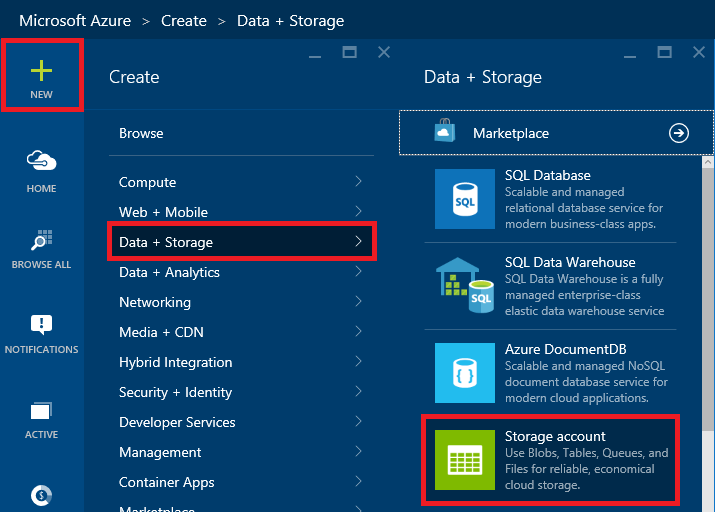

    _Creating a storage account_

1. Make sure **Classic** is selected as the deployment model, and then click the **Create** button.

	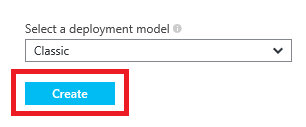

	_Selecting a deployment model_

1. Enter a name for the new storage account in **Storage** field. The name is important, because it forms one part of the URL through which storage items created under this account will be accessed. Storage account names can be 3 to 24 characters in length and can only contain numbers and lowercase letters. In addition, the name you enter must be globally unique; if someone else has chosen the same name, you'll be notified that the name isn't available. Once you have a name that Azure will accept (as indicated by the green check mark in the text field), optionally choose the location nearest you under **location**.
 
	Before you click **Create**, click **Resource Group**. You'll discover that you can select from a handful of preexisting (default) resource groups, or create a new one. Which begs the question: what is a resource group?
		
	Resource groups are a relatively recent addition to Azure and are a powerful construct for grouping resources such as storage accounts, databases, and virtual machines together so that they can be managed as a group. Imagine that you created a complex application consisting of multiple storage accounts, a cluster of VMs, a SQL database, and perhaps a Stream Analytics solution and a pair of event hubs. Now you want to create a new instance of the application using a different account. By assembling all these resources into a resource group under the purview of the Azure Resource Manager, you can take advantage of [Azure deployment templates](https://azure.microsoft.com/en-us/documentation/articles/arm-template-deployment/) to script the creation of the entire application. In addition, you can delete the application — and all the resources that comprise it — by deleting the resource group.
	
	You will take advantage of resource groups and deployment templates in subsequent labs. For now, just realize that any time you create a storage account or other Azure resource, you have the option of including it in a resource group. In fact, *all* Azure resources reside in a resource group, even if it's a default resource group. 
 
	Now click **Create** to create the new storage account.

    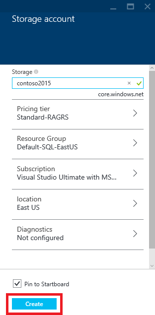

    _Naming a storage account_

1. After a few moments, the new storage account will appear. Click **Containers** to view a list of containers associated with this account.

    

    _The new storage account_

1. The storage account currently has no containers. Before you create a blob, you must create a container to store it in. Containers can be created through the Azure Preview Portal, but blobs cannot. Therefore, you'll put away the portal for now and turn to the go-to tool for accomplishing tasks that the portal cannot: the Azure Cross-Platform Command-Line Interface.

    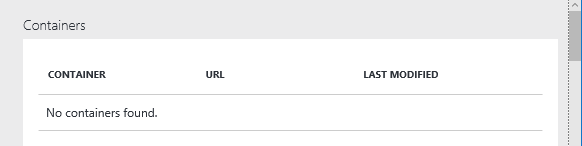

    _The empty storage account_

### Exercise 2: Use the Azure CLI to create a container and upload blobs ###

The [Azure Cross-Platform Command-Line Interface](https://azure.microsoft.com/en-us/documentation/articles/xplat-cli/) (CLI) is an open-source tool that provides a set of cross-platform commands for working with Microsoft Azure. The CLI provides most of the same functionality as the Azure Preview Portal, but it also supports features the portal does not, such as the ability to upload blobs to Azure Storage. In this exercise, you will install the Azure CLI and use it to create a container and upload some blobs.

1. There are several ways to install the Azure CLI on your computer. How you do it depends on what operating system you're running and whether Node.js is installed. Once Node.js is installed, you can generally install the Azure CLI with one simple command:

	<pre>
	npm install azure-cli -g
	</pre>

	Visit the page entitled [Install the Azure CLI](https://azure.microsoft.com/en-us/documentation/articles/xplat-cli-install/) on the Microsoft Azure Web site and **follow the instructions there to install the Azure CLI on your computer**.

1. Once the Azure CLI is installed, you can use the **azure** command from your operating system's command-line interface (for example, Bash, Terminal, or the Windows Command Prompt) to perform Azure-related tasks. To see a list of commands available, and to verify that the Azure CLI is properly installed, open a CLI command prompt, type the **azure** command with no parameters, and press the Enter key. You should see output similar to the following:

    <pre>
	info:             _    _____   _ ___ ___
	info:            /_\  |_  / | | | _ \ __|
	info:      _ ___/ _ \__/ /| |_| |   / _|___ _ _
	info:    (___  /_/ \_\/___|\___/|_|_\___| _____)
	info:       (_______ _ _)         _ ______ _)_ _
	info:              (______________ _ )   (___ _ _)
	info:
	info:    Microsoft Azure: Microsoft's Cloud Platform
	info:
	info:    Tool version 0.9.6
	help:
	help:    Display help for a given command
	help:      help [options] [command]
	help:
	help:    Log in to an Azure subscription using Active Directory. Currently, the user can login only via Microsoft organizational account
	help:      login [options] [username]
	help:
	help:    Log out from Azure subscription using Active Directory. Currently, the user can log out only via Microsoft organizational account
	help:      logout [options] [username]
	help:
	help:    Open the portal in a browser
	help:      portal [options]
	help:
	help:    Commands:
	help:      account        Commands to manage your account information and publish settings
	help:      config         Commands to manage your local settings
	help:      hdinsight      Commands to manage HDInsight clusters and jobs
	help:      mobile         Commands to manage your Mobile Services
	help:      network        Commands to manage your networks
	help:      sb             Commands to manage your Service Bus configuration
	help:      service        Commands to manage your Cloud Services
	help:      site           Commands to manage your Web Sites
	help:      sql            Commands to manage your SQL Server accounts
	help:      storage        Commands to manage your Storage objects
	help:      vm             Commands to manage your Virtual Machines
	help:
	help:    Options:
	help:      -h, --help     output usage information
	help:      -v, --version  output the application version
	</pre>

1. Before you can do much with the Azure CLI, you must connect it to an Azure subscription. One way to do that is to download and then import a publishSettings file containing a certificate that Azure can use to authenticate you. Begin the process by executing the command below. **It is recommended that you open your default browser and tell it to delete all cookies first.**

    <pre>
    azure account download
    </pre>

1. Your default browser will open and inform you that a publishSettings file is being generated and downloaded. (Note that if there are multiple Azure subscriptions associated with your account, you may be asked which subscription you wish to download information for. If so, *choose the subscription that you used to perform the steps in Exercise 1*. This is the one that will be charged for the work you do in the CLI, and the one in which the storage account you created will be visible.) If your browser doesn't automatically save the downloaded file, save it and note the location where it was saved.

    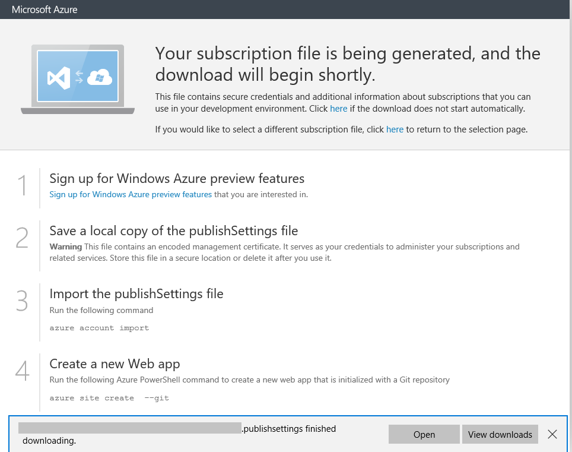

	_Downloading the publishSettings file_

1. Next, import the publishSettings file that you just downloaded by executing the following command, replacing *[path]* with the path to the publishSettings file on your system:

    <pre>
    azure account import [path]
    </pre>

	The CLI should respond with the following output:

	<pre>
	info:    Executing command account import
	info:    account import command OK	
	</pre>

1. The next step is to make sure that if there are multiple subscriptions associated with your account, the one you used in Exercise 1 is set as the default. To view the subscriptions associated with the account you imported, execute the following command:

    <pre>
    azure account list
    </pre>

    If only one subscription is listed, move on to the next step. If two or more subscriptions are listed, execute the following command, replacing *[subscription]* with the ID of the subscription you used in Exercise 1:

    <pre>
    azure account set [subscription]
    </pre>

1. Now use the following command to list all of your storage accounts and confirm that the account you created in [Exercise 1](#Exercise1) is present:

    <pre>
    azure storage account list
    </pre>

1. It is possible to create a storage account using the Azure CLI by entering a command like this one, where *[accountname]* is the storage account name:

    <pre>
    azure storage account create [accountname]
    </pre>

	Rather than create a new storage account, you want to use the account you created in Exercise 1. But first, you need a key that can be used to connect to that storage account. You can get it from the Azure Preview Portal, or you can get it from the Azure CLI. To display a list of keys associated with the storage account, run the following command. Be sure to replace *[accountname]* with the name of the storage account you created in Exercise 1:

    <pre>
    azure storage account keys list [accountname]
    </pre>

	The CLI will respond something like this:

	<pre>
	info:    Executing command storage account keys list
	+ Getting storage account keys
	data:    Primary: Ttm20TISIT4Mo440EKp8nsX+pA7S3X3AFILxoQ6XgG5y9aZDE+Zaphsi1QuMqd/DaS72j8d6S3M5ZtqGKioqOA==
	data:    Secondary: V31u0fm23lgdDJKLd3U1lbmvFTPgJ2xC3X1whQl20+h/TC2wR1+Ck1EquzUsZ00HG563d1m1uc2CSiF/blStNA==
	info:    storage account keys list command OK
    </pre>

	**Copy the primary key listed in the output to the clipboard** so you can use it again later.

1. Before you can create a blob, you must create a container to store it in. A container is similar to a folder in a file system. A storage account can have an unlimited number of containers, and a container can store an unlimited number of blobs. Container names must be from 3 to 63 characters in length and may contain numbers, dashes, and lowercase letters. Dashes cannot be consecutive, and a container name cannot start with a dash. The following diagram illustrates the blob storage schema:

    

	_Blob storage schema_

	You can create containers using the Azure Preview Portal, or you can create them with the Azure CLI. Let's use the latter to create a container named "images." Execute the following command in the Azure CLI, replacing *[accountname]* with the name of the storage account and *[accountkey]* with the key you copied to the clipboard in the previous step.

    <pre>
    azure storage container create -a [accountname] -k [accountkey] -p blob images
    </pre>

	The CLI should respond with output similar to the following:

	<pre>
	info:    Executing command storage container create
	+ Creating storage container images
	+ Getting Storage container information
	data:    {
	data:        name: 'images',
	data:        metadata: {},
	data:        etag: '"0x8D29F33E5925FA6"',
	data:        lastModified: 'Fri, 07 Aug 2015 14:24:25 GMT',
	data:        leaseStatus: 'unlocked',
	data:        leaseState: 'available',
	data:        requestId: '09cd3b60-0001-00cc-571c-d14c48000000',
	data:        publicAccessLevel: 'Blob'
	data:    }
	info:    storage container create command OK
	</pre>

	Notice the line in the output that reads "publicAccessLevel: 'Blob'". By default, the containers you create are private, which means that the container and its contents can only be accessed by the owner of the storage account (or anyone who has the container's key). However, the "-p blob" switch you included in the command that created the container allows anonymous read access to blobs in that container. This is generally the way you configure a container that holds images and other public assets for Web sites. 

1. The next step is to create a blob by uploading a file to the "images" container. Find an image file in your local file system, or use the azure-banner.jpg file provided in the "resources" folder of this lab. Then run the following command, replacing *[accountname]* with the storage account name, *[accountkey]* with the storage account key, and *[path]* with the path to the image you wish to upload, to create a blob named "banner.jpg:"

    <pre>
    azure storage blob upload -a [accountname] -k [accountkey] [path] images banner.jpg
    </pre>

	If the blob is successfully uploaded, you'll receive the following confirmation from the CLI:

	<pre>
	info:    Executing command storage blob upload
	+ Checking blob banner.jpg in container images
	+ Uploading \temp\azure-banner.jpg to blob azure-banner.jpg in container images
	Percentage: 100.0% (28.80KB/28.80KB) Average Speed: 28.80KB/S Elapsed Time: 00:0
	0:00
	+ Getting Storage blob information
	data:    Property       Value
	data:    -------------  ------------------------
	data:    container      images
	data:    blob           banner.jpg
	data:    blobType       BlockBlob
	data:    contentLength  29490
	data:    contentType    image/jpeg
	data:    contentMD5     +AKWVCtqIG0gsVOoc2fQqw==
	info:    storage blob upload command OK
	</pre>

1. Because the container's access level is "Blob," you should be able to fetch the blob with a simple HTTP request. To prove it, open your browser and navigate to the following URL, once more replacing *[accountname]* with the name of your storage account:

	<pre>
	http://[accountname].blob.core.windows.net/images/banner.jpg
	</pre>

	Here's what you'll see in your browser if you uploaded the azure-banner.jpg file included with this lab:

    

	_Image blob downloaded from Azure storage_

1. You can see how the storage account name and the container name form parts of the URL through which a blob is accessed. But what if you wanted to create a hierarchy of containers? What if, for example, you wanted "images/banner.jpg" in the URL to be "images/azure/banner.jpg"? You can't create nested containers, but you *can* include forward slashes in blob names to simulate container hierarchies. To demonstrate, run the following command in the CLI, once more providing the storage account's name and key and the local path to an image file:

    <pre>
    azure storage blob upload -a [accountname] -k [accountkey] [path] images azure/banner.jpg
    </pre>

1. Now enter the following URL in your browser and confirm that the image blob appears:

	<pre>
	http://[accountname].blob.core.windows.net/images/azure/banner.jpg
	</pre>

1. Finish up by executing the following command to delete the blob you just created:

    <pre>
    azure storage blob delete -a [accountname] -k [accountkey] images azure/banner.jpg
    </pre>

### Exercise 3: Automate storage tasks by scripting CLI commands  ###

One benefit of using the Azure CLI is that you can combine it with a scripting engine to automate time-consuming tasks. For example, what if you wanted to upload a directory full of images from your PC to blob storage? Rather than upload them one at a time with discrete CLI commands, you could write a shell script that enumerates the files in that directory and invokes an **azure storage blob upload** command on each one. 

In this exercise, you'll write and test a pair of scripts that automate common Azure Storage tasks. Linux and OS X users will use Bash scripts, while Windows users will use PowerShell scripts.

> There are free Bash shells available for Windows, too, including [Cygwin](https://www.cygwin.com/) and [Git for Windows](https://git-for-windows.github.io/). If you use Windows and care to install a Bash shell (or already have one installed), feel free to skip the PowerShell steps below and follow the instructions for Linux and OS X users.

1. Create a directory in your local file system; give it any name you'd like.

1. In the directory you just created, create a subdirectory named "images". Copy 5 to 10 JPG files with the file-name extension .jpg into the "images" subdirectory.

1. If you're using Windows, **skip to Step 6**. The next few steps are for students running Linux, OS X, and other operating systems that support Bash scripts.

1. Open a Bash shell and go to the directory containing the "images" subdirectory. Use your favorite text editor to create a file named copyimages.sh containing the following statements. Be sure to replace *[accountname]* with the name of your storage account, and *[accountkey]* with the key you copied to the clipboard in [Exercise 2](#Exercise2):

	<pre>
	cd images 
	for f in *.jpg 
	do 
	    azure storage blob upload -a [accountname] -k [accountkey] "${f##*/}" images "${f##*/}" 
	done 
	cd .. 
	</pre>

1. In the Bash shell, execute the following command to run copyimages.sh:

	<pre>
	sh copyimages.sh
	</pre>

	**Now skip to Step 10**. Steps 6 through 9 are for PowerShell users only.

1. To script Azure commands with PowerShell, you first need to [install and configure Azure PowerShell](https://azure.microsoft.com/en-us/documentation/articles/powershell-install-configure/). If Azure PowerShell is not installed on your system, take the time to install it now.

1. Once you have installed Azure PowerShell, you will need to configure PowerShell itself to allow script execution. (For security reasons, PowerShell by default does not allow PowerShell scripts to execute.) Start Azure PowerShell **as an administrator** and execute the following command:

	<pre>
	Set-ExecutionPolicy RemoteSigned
	</pre>
 
1. Now close the Azure PowerShell window and open another one, this time **not** running as an administrator. In the PowerShell window, go to the directory containing the "images" subdirectory and create a text file named copyimages.ps1 containing the statements below, once more replacing *[accountname]* and *[accountkey]* with your storage account's name and key:

	<pre>
	cd images
	$context = New-AzureStorageContext -StorageAccountName [accountname] -StorageAccountKey [accountkey]
	foreach ($file in Get-ChildItem *.jpg) {
	    Set-AzureStorageBlobContent -Blob $file.Name -Container "images" -File $file.Name -Context $context -Force
	}
	cd ..
	</pre>

1. Execute the following command to upload all the images in the "images" subdirectory as blobs to Azure Storage:

	<pre>
    powershell .\copyimages.ps1
	</pre>

1. Open the [Azure Preview Portal](https://portal.azure.com/) in your browser. Click **BROWSE ALL**, and then **Storage accounts (classic)**. Then click the storage account you created in Exercise 1.

    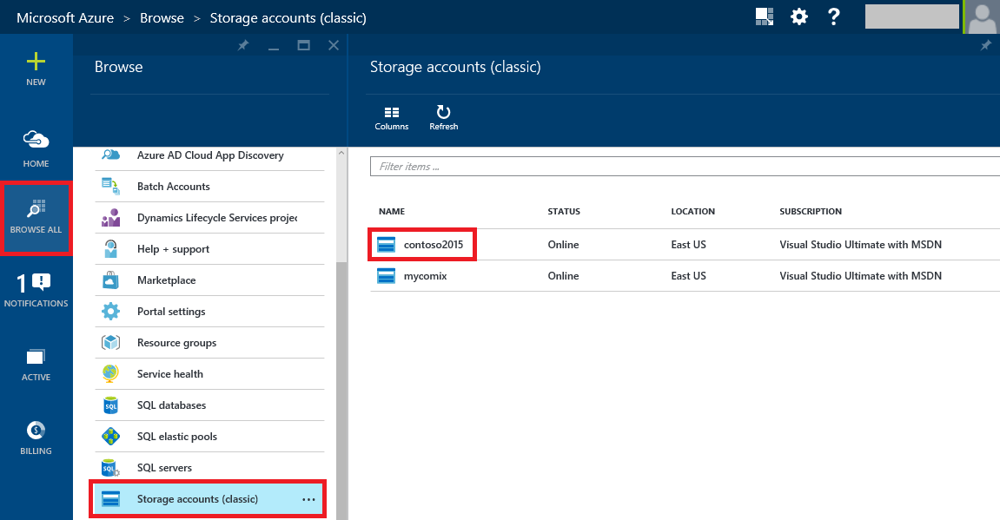

    _Viewing storage accounts_

1. Click **Containers** to view the containers associated with this storage account.

    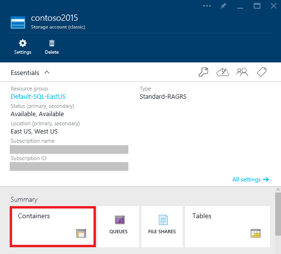

    _Viewing storage containers_

1. Click the "images" container to view its contents.

    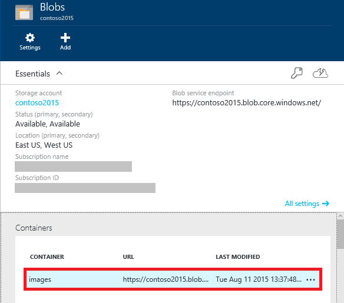

    _Viewing the blobs in a container_

1. Verify that all the .jpg files in your local "images" subdirectory were uploaded to the "images" container as blobs.

    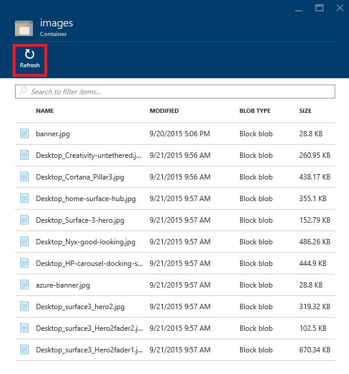

    _Blobs uploaded to the images container_

1. Now return to the shell command prompt and make sure you're in the directory that holds the "images" subdirectory.

1. Next, you're going to create a script that renames a blob. Technically, you can't rename a blob, but you *can* delete a blob and upload a new blob with the new name. If you prefer Bash scripts, create a new text file named renameblob.sh containing the following statements. As usual, replace *[accountname]* and *[accountkey]* with your storage account's name and key:

	<pre>
	# syntax: renameblob.sh [container] [old-blob-name] [new-blob-name] [path]
	azure storage blob delete -a [accountname] -k [accountkey] $1 "$2"
	azure storage blob upload -a [accountname] -k [accountkey] "$4" $1 "$3"
	</pre>

1. If you are a Windows user and prefer PowerShell scripts instead, create a new text file named renameblob.ps1 containing the following statements:

	<pre>
	param([string]$container, [string]$oldname, [string]$newname, [string]$path)
	$context = New-AzureStorageContext -StorageAccountName [accountname] -StorageAccountKey [accountkey]
	Remove-AzureStorageBlob -Container $container -Blob $oldname -Context $context
	Set-AzureStorageBlobContent -Blob $newname -Container $container -File $path -Context $context -Force
	</pre>

1. Use the script you just created to rename one of the blobs in the "images" container. For example, if the existing blob is named CIMG6945.jpg and you want to rename it to CIMG1234.jpg, and if the path to the image you uploaded to the blob is "images/CIMG6945.jpg", use the following command to execute the Bash script:

	<pre>
	sh renameblob.sh images CIMG6945.jpg CIMG1234.jpg images/CIMG6945.jpg
	</pre>

	The equivalent PowerShell command is:

	<pre>
	powershell .\renameblob.ps1 images CIMG6945.jpg CIMG1234.jpg images\CIMG6945.jpg
	</pre>

1. Return to the [Azure Preview Portal](https://portal.azure.com/), open the "images" container, and confirm that the blob was renamed.

There's much more you can do when scripting the Azure CLI than these simple examples demonstrate. For example, you can pipe the output from **azure** commands to other commands such as **grep** and **awk**, and you can use the -v (or --verbose) switch to output JSON data. For more information and some cool examples, see [How to script the Azure CLI for Mac, Linux, and Windows](https://azure.microsoft.com/en-us/documentation/articles/xplat-cli/#how-to-script-the-azure-cli-for-mac-linux-and-windows) on the Azure Web site.

### Exercise 4 (Optional): Use AzCopy to copy files between storage accounts  ###

AzCopy is another free tool for managing Azure storage. It is a command-line utility designed for high-performance uploading, downloading, and copying data to and from Microsoft Azure blob, file, and table storage. For an overview of AzCopy, its syntax, and its capabilities, refer to [Getting Started with the AzCopy Command-Line Utility](https://azure.microsoft.com/en-us/documentation/articles/storage-use-azcopy/).

In this exercise, which is **for Windows users only** since AzCopy only runs on Windows, you'll install AzCopy and use it to copy files from one storage account to another. 

> Windows users enjoy access to a number of tools — many of them free — for managing Azure Storage. The popular [Azure Storage Explorer](http://azurestorageexplorer.codeplex.com/) is a GUI management console that allows you to upload and download blobs, add entities to tables, create and manipulate queues, and much more. For more information on this and other storage tools, see [Azure Storage Tools](http://storagetools.azurewebsites.net/).

1. Assuming you don't already have AzCopy installed on your computer, [click here](http://aka.ms/downloadazcopy) to download and install it. 

1. Open an AzCopy window by starting the "Microsoft Azure Storage command line" app.

    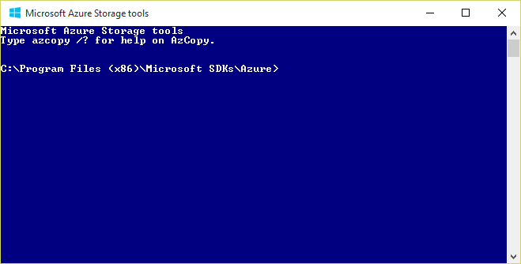

    _The AzCopy command line_

1. Use the [Azure Preview Portal](https://portal.azure.com/) to create a new storage account. You'll need to use a different account name than the one you used in [Exercise 1](#Exercise1).

1. In the blade for the new storage account, click **Containers** to view the containers associated with the account. (Currently, there are none.) In the "Blobs" blade, click **Add** to add a new storage container.
 
    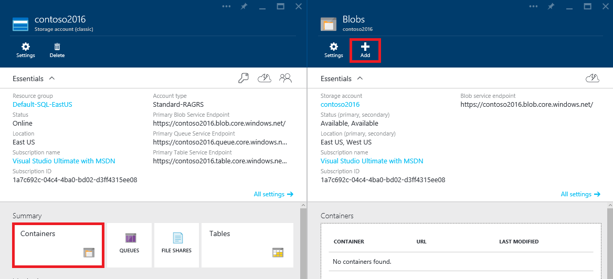

    _Creating a new storage container_ 

1. Enter "photos" as the container name. Select **Private** as the Access Type (unlike the container you created in Exercise 2, you will not make the contents of this one public) and click **OK** to create the container.

    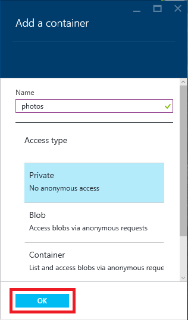

    _Creating the photos container_ 

1. Click **Settings** to view the new storage account's settings. Then click **Keys** to view the storage account's access key. Make a copy of the primary access key for later.

    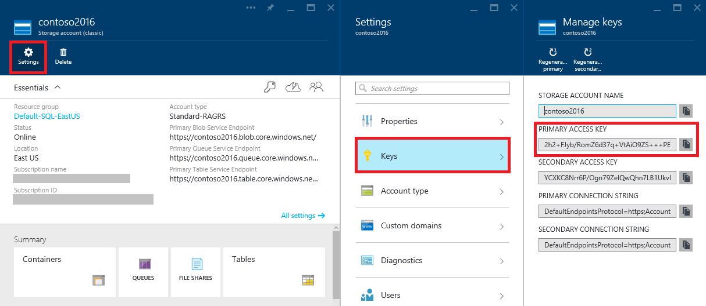

    _Getting the storage account's access key_

1. Now you will use AzCopy to copy all the files from the old container (the "images" container you created in Exercise 2) to the new "photos" container. Execute the following command from the AzCopy command line, replacing *[sourceaccount]* with the name of the storage account you created in Exercise 1, *[destaccount]* with the name of the storage account you created a moment ago, and *[key]* with the access keys for the two storage accounts:

    <pre>
    AzCopy /Source:https://[sourceaccount].blob.core.windows.net/images /Dest:https://[destaccount].blob.core.windows.net/photos /sourcekey:[key] /destkey:[key] /S
    </pre>

    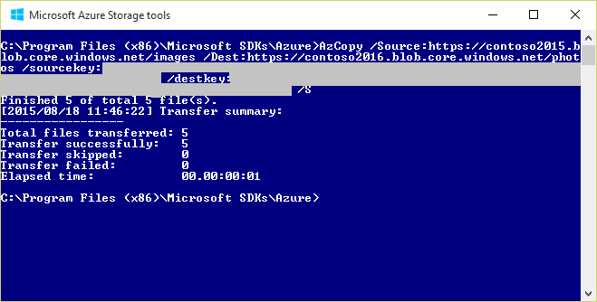

    _Copying blobs between storage accounts_

1. Use the Preview Portal to verify that all the blobs were copied from the source account to the destination account. 

## Summary ##

Here's a quick summary of the important concepts that you learned in this lab:

- Azure Storage is a set of services for storing data durably and reliably
- The Microsoft Azure Management Portal enables you to perform basic storage operations, such as creating accounts and containers
- Azure Storage blobs can contain any type of data, just like files in a file system
- The Azure Cross-Platform Command-Line Interface (CLI) is a cross-platform tool that supports many features the Azure Preview Portal does not, such as the ability to upload blobs and delete blobs
- The Azure CLI can be combined with shell scripts to simplify storage tasks that require multiple commands
- AzCopy is a Windows tool for copying blobs between storage accounts

Now that you're familiar with storage accounts, containers, and blobs, as well as some of the tools for managing them, you'll put your newfound knowledge to work in subsequent labs. Knowing the basics of Azure Storage is an essential first step in working with Azure data services.

---

Copyright 2015 Microsoft Corporation. All rights reserved. 
Except where otherwise noted, these materials are licensed under the terms of the Apache License, Version 2.0. You may use it according to the license as is most appropriate for your project on a case-by-case basis. The terms of this license can be found in [http://www.apache.org/licenses/LICENSE-2.0](http://www.apache.org/licenses/LICENSE-2.0).
