
# Azure Internet of Things (IoT) Using Event Hubs and Stream Analytics #

---

## Overview ##

Azure Stream Analytics is a cloud-based service for ingesting high-velocity data emanating from devices, sensors, applications, Web sites, and other data sources and analyzing that data in real time (or near real time). It supports a SQL-like query language that works over dynamic data streams and makes analyzing constantly changing data no more difficult than performing queries on static data stored in traditional databases. With Azure Stream Analytics, you can set up jobs that analyze incoming data for anomalies or information of interest and record the results, present notifications on dashboards, or even fire off alerts to mobile devices. And all of it can be done at low cost and with a minimum of effort — frequently without writing a single line of code.

Scenarios for the application of real-time data analytics are legion and include fraud protection, identity-theft protection, optimizing the allocation of resources (think of an Uber-like transportation service that sends drivers to areas of increasing demand *before* that demand peaks out), click-stream analysis on Web sites, and countless others. Having the ability to process data *as it comes in* rather than waiting until after it has been aggregated offers a competitive advantage to businesses that are agile enough to make adjustments on the fly.

In this lab, you'll create an Azure Stream Analytics job and use it to analyze data streaming in from simulated Internet of Things (IoT) devices. And you'll see how utterly simple it is to monitor real-time data streams for information of significance to your research or business.

### Objectives ###

In this hands-on lab, you will learn how to:

- Create an Azure event hub and use it as a Stream Analytics input
- Create a Stream Analytics job and test queries on sample data streams
- Run a Stream Analytics job and perform queries on live data streams
- Direct Stream Analytics output to Azure blobs

### Prerequisites ###

The following is required to complete this hands-on lab:

- A Microsoft Azure subscription - [sign up for a free trial](http://aka.ms/WATK-FreeTrial)

---

## Exercises ##

This hands-on lab includes the following exercises:

- [Exercise 1: Create an event hub](#Exercise1)
- [Exercise 2: Create a shared-access signature token](#Exercise2)
- [Exercise 3: Send events to the event hub](#Exercise3)
- [Exercise 4: Create a Stream Analytics job](#Exercise4)
- [Exercise 5: Prepare queries and test with sample data](#Exercise5)
- [Exercise 6: Analyze a live data stream](#Exercise6)

Estimated time to complete this lab: **90** minutes.

## Exercise1: Create an event hub ##

Azure Stream Analytics supports two types of input: input from Azure blobs, and input from Azure event hubs. Of the two, the latter is typically more interesting because in the IoT world, data is easily transmitted to Azure event hubs through field gateways (for devices that are not IP-capable) or cloud gateways (for devices that *are* IP-capable), and a single Azure event hub can handle millions of events per second transmitted from devices spread throughout the world.

In this exercise, you'll create an Azure event hub to provide input to Azure Stream Analytics and configure it to so that it can be accessed safely and securely by IoT devices and gateways. 

1. You can't (yet) create an event hub using the Azure Preview Portal, so you'll create it instead using the Classic Portal. Go to [https://manage.windowsazure.com](https://manage.windowsazure.com) to open the Classic Portal, and click **Service Bus** in the ribbon on the left. Then click **CREATE A NEW NAMESPACE** to create a new service-bus namespace. (If you have already created one or more namespaces, click **+ NEW** in the lower-left corner of the page to create another one.)

    

    _Azure Service Bus_

1. Type a namespace name into the **NAMESPACE NAME** box. The name must be unique within Azure, so you'll have to use something other than the name in the screen shot below. (A green check mark will appear in the box when the name you've entered is one that Azure will accept.) Optionally choose the region closest to you from the **REGION** drop-down. Then click the check mark in the lower-right corner of the dialog.

    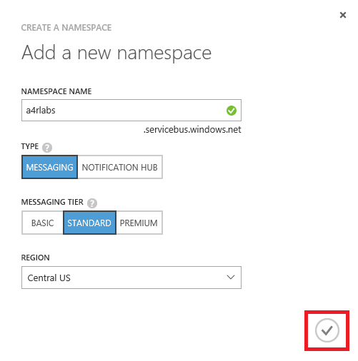

    _Creating a service-bus namespace_

1. Click the **+ NEW** button in the lower-left corner of the page. Then click **EVENT HUB**, followed by **QUICK CREATE**. Type "IoTEventHub" into the **EVENT HUB NAME** box (the name doesn't have to be unique within Azure). Optionally select the region closest to you, and make sure the namespace you created in the previous step is selected in the **NAMESPACE** box. Then click **CREATE A NEW EVENT HUB** in the lower-right corner.

    

    _Creating an event hub_

1. In the portal, click the event hub that you just created to display the event hub's dashboard.

    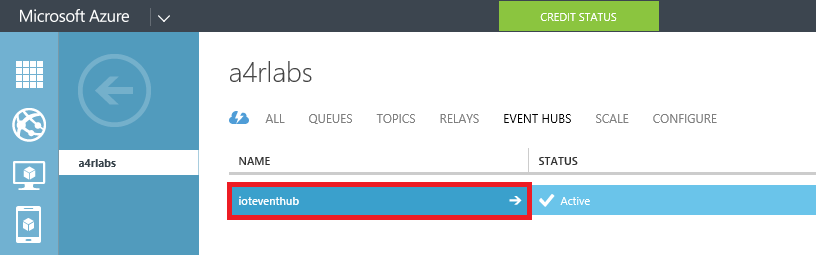

    _IoTEventHub_

1. In the dashboard, click **CONFIGURE**.

    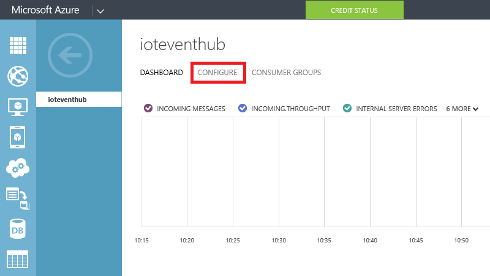

    _IoTEventHub dashboard_

1. In order to transmit events to the event hub from an application or device, you need to create a shared-access policy that includes Send permission. In the **shared access policies** section of the IoTEventHub configuration page, create a new policy named "SendPolicy" and check the **Send** box in the drop-down list under **PERMISSIONS**. Then click the **Save** button at the bottom of the page to save the new policy.

    

    _Creating a policy with Send permission_

1. In the **shared access key generator** section that appears underneath **shared access policies**, click the button at the right end of the **PRIMARY KEY** box to copy the key to the clipboard. Then temporarily save the key by pasting it into your favorite text editor. You'll need this key in the next exercise.

    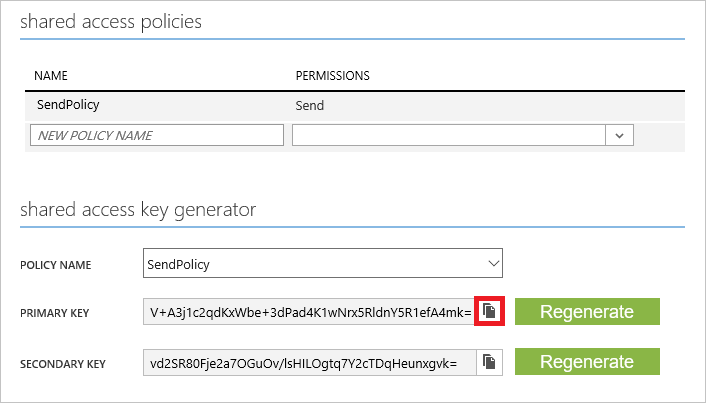

    _Copying the primary key to the clipboard_

1. Click **DASHBOARD** near the top of the page to return to the event hub's dashboard.

    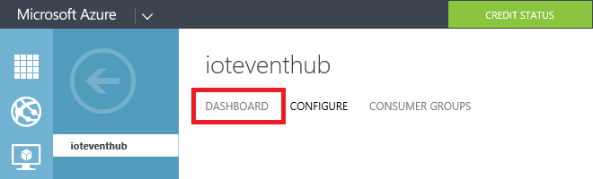

    _Returning to the dashboard_

1. Under **quick glance** on the right side of the page, find **EVENT HUB URL** and copy the URL into your text editor. You'll need this URL, too, in the next exercise.

    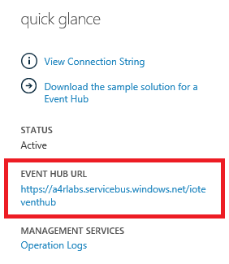

    _Getting the event hub's URL_

You have created an event hub that can ingest events and be used as the source of input to a Stream Analytics job. You have also created a policy that allows holders of that policy to send events to the event hub. The next step is to generate a security token that can be used to authenticate calls to the event hub.

## Exercise 2: Create a shared-access signature token ##

Applications, devices, or gateways can send events to event hubs using the [Azure Event Hubs REST API](https://msdn.microsoft.com/en-us/library/azure/Dn790674.aspx). Each request transmitted via this API must include a valid [shared-access signature (SAS)](https://azure.microsoft.com/en-us/documentation/articles/service-bus-shared-access-signature-authentication/) token in the Authorization header. SAS tokens are generated from the event hub's URL and the primary key associated with the policy used to communicate with the event hub — in this case, the policy named "SendPolicy" that you created in the previous exercise.

In this exercise, you will generate a shared-access signature token for the event hub created in [Exercise 1](#Exercise1) and copy it, along with the event hub URL, into a Node.js application that will be used to send events to the event hub in Exercise 3.

1. Neither the Classic Portal nor the Preview Portal currently provides an interface for generating SAS tokens. Therefore, you will generate a token using a Node.js utility named sas.js provided with this lab. Begin by opening a terminal window.

1. Verify that Node.js is installed on your computer by executing the following command:

	<pre>
	node -v
	</pre>

	If Node.js is installed, you'll see the Node.js version number.	If you don't see a version number, or if the **node** command didn't run at all, then you need to install Node.js. You'll find detailed instructions for installing it in Exercise 2 of the lab entitled "Azure Storage and the Azure CLI." **If you don't already have Node.js installed, install it now**.

	> You already have Node.js installed if you completed the **Azure Storage and the Azure CLI** lab because the Azure CLI requires Node.js.

1. At the command prompt, navigate to this lab's "resources" directory. Then execute the following command:

	<pre>
	node sas.js
	</pre>

	> It is very important that you run this command from the lab's "resources" directory, because that directory contains subdirectories that contain components required by sas.js.

1. When prompted, enter the event-hub URL you saved in Exercise 1, Step 9. Then press Enter.

1. When prompted, enter the name ("SendPolicy") of the policy you created for the Azure event hub in Exercise 1, Step 6. Then press Enter.

1. When prompted, enter the key that you saved in Exercise 1, Step 7. Then press Enter.

1. The SAS token, which is highlighted with the red box below, will be output to the terminal window. Copy it to the clipboard. 

    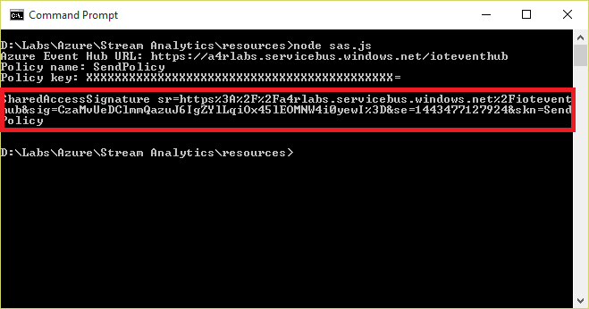

    _Generating a SAS token_

1. Find the file named eventgen.js in the "resources" directory of this lab and open it in your favorite text editor. Then find the section at the top of the file labeled "KEY VARS:"

	<pre>
	///////////////// KEY VARS /////////////////
	var sas = "Token";
	var uri = "URL";
	///////////////////////////////////////////
	</pre>

1. Replace *Token* with the SAS token you copied to the clipboard in Step 7. **Important:** The SAS token must **not include line breaks**. It needs to appear on this line as one contiguous string, and it must begin and end with quotation marks. In addition, the line must end with a semicolon.

1. Replace *URL* with the event-hub URL you saved in exercise 1, Step 9.

1. Save the modified eventgen.js file. The modified "KEY VARS" section should look something like this:

	<pre>
	///////////////// KEY VARS /////////////////
	var sas = "SharedAccessSignature sr=https%3a%2f%2fa4rlabs.servicebus.windows.net%2fioteventhub&sig=CzaMvUeDClmmQazuJ6IgZYlLqiOx45lEOMNW4i0yewI%3D&se=X1443477127924&skn=SendPolicy";
	var uri = "https://a4rlabs.servicebus.windows.net/ioteventhub";
	///////////////////////////////////////////
	</pre>

Now that you've modified eventgen.js with information specific to your event hub, it's time to generate some events. 

## Exercise 3: Send events to the event hub ##

In this exercise, you will send events to the event hub you created in [Exercise 1](#Exercise1). To do that, you'll use Node.js to run eventgen.js, which in turn transmits secure requests to the event hub using the [Azure Event Hubs REST API](https://msdn.microsoft.com/en-us/library/azure/Dn790674.aspx). eventgen.js generates simulated events representing ATM withdrawals. Each event contains relevant information such as the card number used for the withdrawal, the time and amount of the withdrawal, and a unique identifier for the ATM machine used.

1. At the command prompt, navigate to the "resources" directory of this lab if you aren't there already.

1. Now execute the following command:

	<pre>
	node eventgen.js
	</pre>

	You should see output similar to the following. Each line represents one event sent to the event hub, and events will probably roll by at a rate of about 2 to 3 per second. (Rates will vary depending on your connection speed.) **Confirm that each request returns the HTTP status code 201**. This indicates that the event hub received and accepted the request.

	<pre>
	[1000] Event sent (status code: 201)
	[1001] Event sent (status code: 201)
	[1002] Event sent (status code: 201)
	[1003] Event sent (status code: 201)
	[1004] Event sent (status code: 201)
	[1005] Event sent (status code: 201)
	[1006] Event sent (status code: 201)
	[1007] Event sent (status code: 201)
	[1008] Event sent (status code: 201)
	[1009] Event sent (status code: 201)
	</pre>

	> It is very important that you run this command in the lab's "resources" directory, because the "resources" directory contains subdirectories that contain components required by eventgen.js.

1. After 10 to 20 events have been sent, press Ctrl+C (or whatever key combination your operating system supports for terminating an application running in a terminal window) to stop the flow of events. **Leave the terminal window open so you can return to it later.**

1. Return to the [Classic Portal](https://manage.windowsazure.com) and open the dashboard for the event hub you created in [Exercise 1](#Exercise1). Wait a few minutes, and then click the **Refresh Metrics** button in the upper-right corner of the chart at the top of the page (the button highlighted in red below). Confirm that the chart shows several messages have been received.

    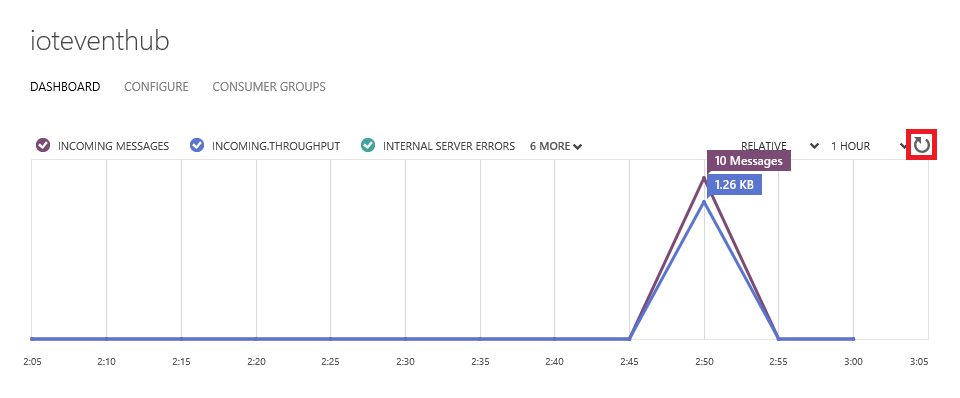

    _Messages received by the event hub_

	> The dashboard doesn't show events in real time. An event typically doesn't appear in the chart until 5 to 10 minutes after it is received. While you're waiting, take a few moments to peruse the code in eventgen.js. In particular, notice the Authorization header sent in each request, and the URL that the request is directed to.

If you'd rather not wait for the events to appear in the dashboard, feel free to move on to the next exercise. But if you are unable to generate sample data in the Stream Analytics job in the next exercise, return to the event-hub dashboard and verify that the event hub received the events.

## Exercise 4: Create a Stream Analytics job ##

You now have software that sends events to an Azure event hub, and an event hub that ingests the data. In this exercise, you'll use the Microsoft Azure [Classic Portal](https://manage.windowsazure.com) to create a Stream Analytics job and connect it to the event hub. You'll also capture the raw data being presented to Stream Analytics by the event hub and examine its structure.

1. Open the [Classic Portal](https://manage.windowsazure.com) in your browser if it isn't already open. Click **STREAM ANALYTICS** in the ribbon on the left, and then click **CREATE A NEW STREAM ANALYTICS JOB**.

    

    _Azure Stream Analytics_

1. Type "A4R-Analytics" into the **JOB NAME** box. Optionally select the region nearest you in the **REGION** box. Under **REGIONAL MONITORING STORAGE ACCOUNT**, either select an existing storage account or select **Create new storage account** from the drop-down list and enter a name for the new storage account. (If you choose to create a new storage account, recall that storage-account names can be 3 to 24 characters in length, can only contain numbers and lowercase letters, and must be unique within Azure. A green check mark next to the name indicates that it meets all these criteria.) When you're done, click **CREATE STREAM ANALYTICS JOB** in the lower-right corner.

    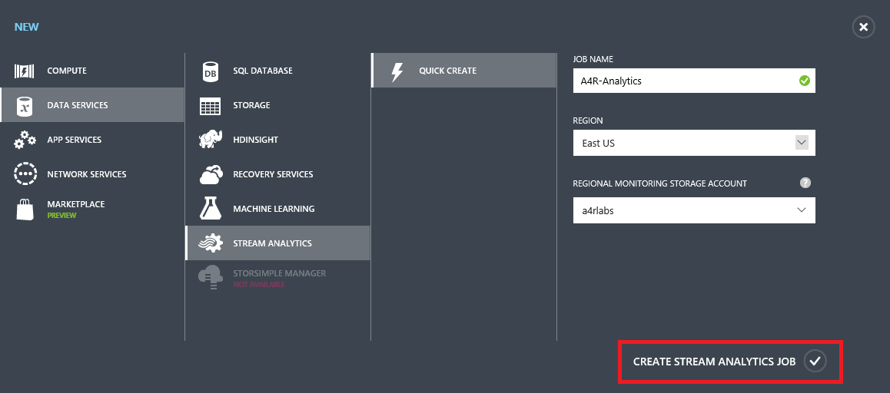

    _Creating a Stream Analytics job_

1. After a few moments, the Stream Analytics job you created will appear in the portal. Click it to go to the page devoted to the job.

    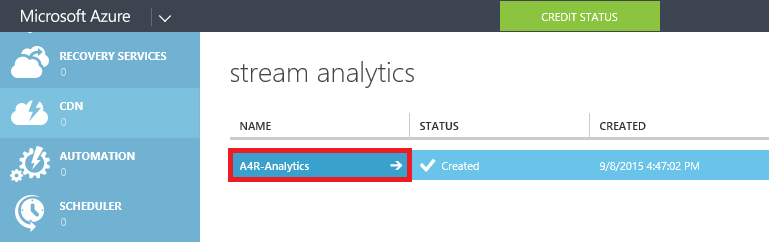

    _The new Stream Analytics job_

1. Click **INPUTS** near the top of the page.

    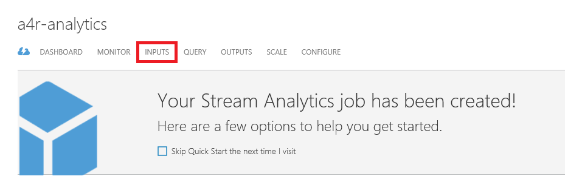

    _A4R-Analytics page_

1. Click **ADD AN INPUT**.

    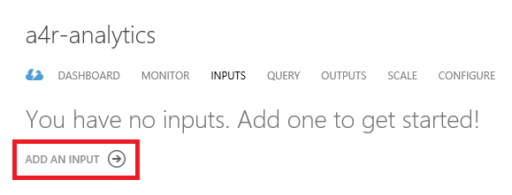

    _Adding an input_

1. Make sure **Data stream** is selected, and then click the right-arrow in the lower-right corner of the dialog.

    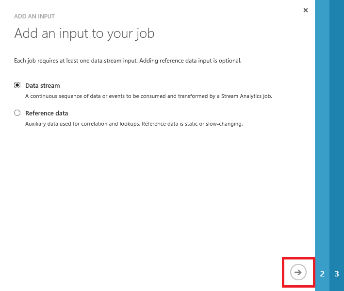

    _Specifying an input type_

1. Make sure **Event Hub** is selected, and then click the right-arrow.

    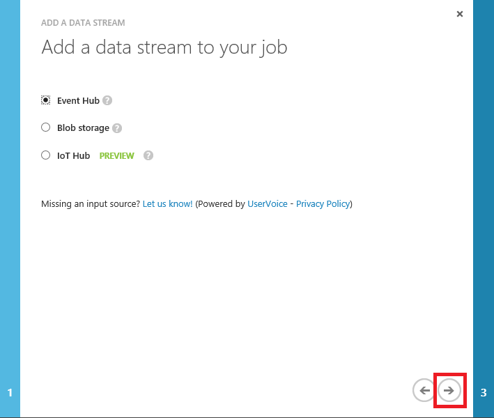

    _Specifying a data-stream type_

	> IoT hubs are a relatively recent addition to Azure; their primary purpose is to enable two-way communications between IoT devices. You chose **Event Hub** because you're connecting simulated IoT devices to a Stream Analytics job, not to other devices. 

1. Enter "Withdrawals" as a friendly alias for the input in the **INPUT ALIAS** box. In the **CHOOSE A NAMESPACE** and **CHOOSE AN EVENTHUB** boxes, select the namespace and event hub that you created in [Exercise 1](#Exercise1). Leave **EVENT HUB POLICY NAME** set to **RootManageSharedAccessKey** (that's a default policy that's created automatically when you create an event hub; it grants permission to manage the event hub, send events, and receive events) and **CHOOSE A CONSUMER GROUP** set to **$Default**. Then click the right-arrow in the lower-right corner.

    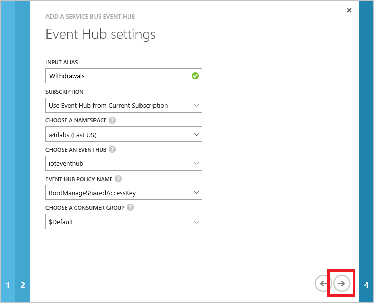

    _Specifying event-hub settings_

1. Make sure **JSON** is selected under **EVENT SERIALIZATION FORMAT** (the Node.js application that sends events to the event hub indeed sends JSON data), and **UTF8** is selected under **ENCODING**. Then click the check mark in the lower-right corner to finish adding the input.

    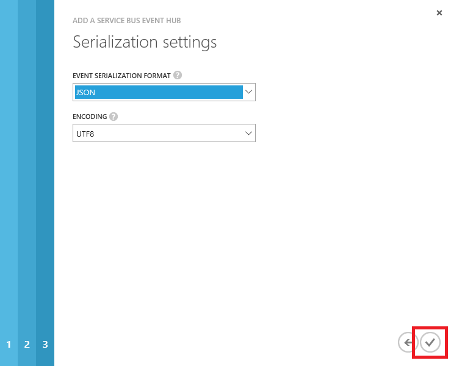

    _Specifying a serialization format_

1. After a few moments, the new input — "Withdrawals" — appears in the list of inputs for the Stream Analytics job. Go back to the terminal window you left open at the end of the previous exercise and run eventgen.js again by executing the following command:

	<pre>
	node eventgen.js
	</pre>

1. Allow eventgen.js to run for a minute or two. Then press Ctrl+C (or the equivalent) to stop it, and return to the portal open in your browser.
  
1. Click the **SAMPLE DATA** button at the bottom of the page to sample data from the event hub.

    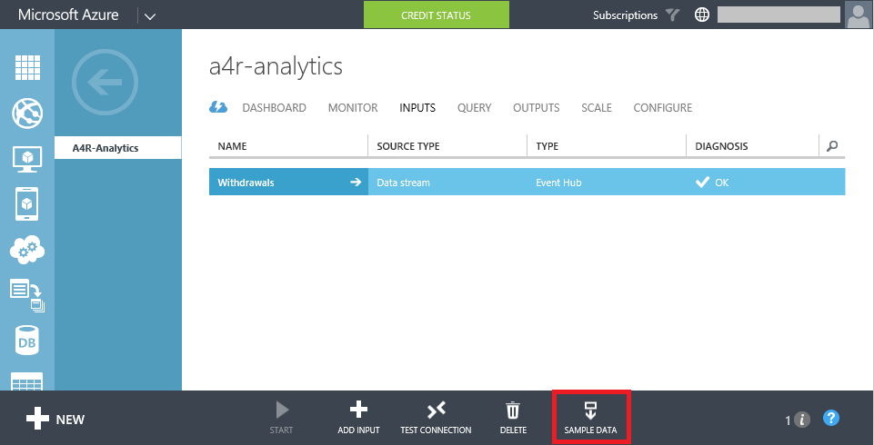

    _Sampling input data_

1. Click the check mark in the lower-right corner of the ensuing dialog to sample any data transmitted to the event hub in the last 10 minutes. (This is why you ran eventgen.js again: to make sure there is data to sample, even if more than 10 minutes have elapsed since you completed [Exercise 3](#Exercise3).)

    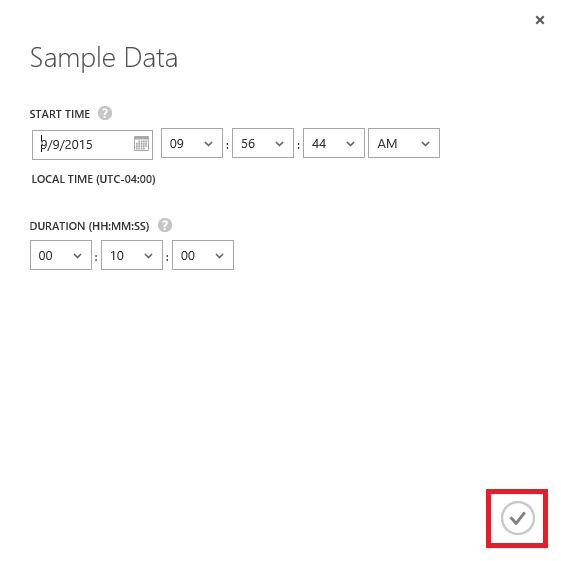

    _Specifying start time and duration_

1. Wait until the sample is completed. Then click the button in the lower-right corner of the page that indicates the operation has completed.

    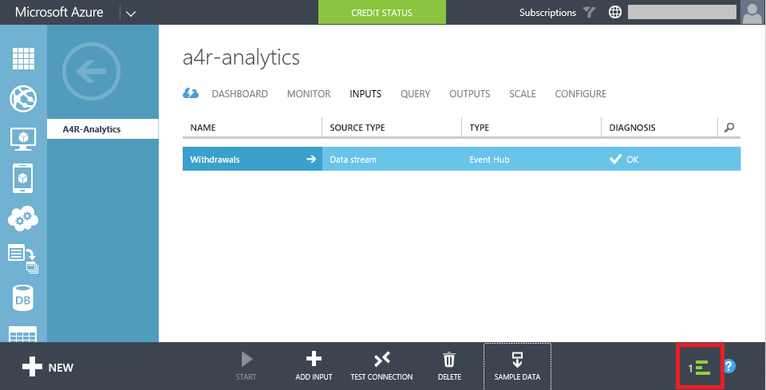

    _Data sampling completed_

1. When a ribbon appears that says "Successfully sampled data from Withdrawals," click the **Details** button on the right.

    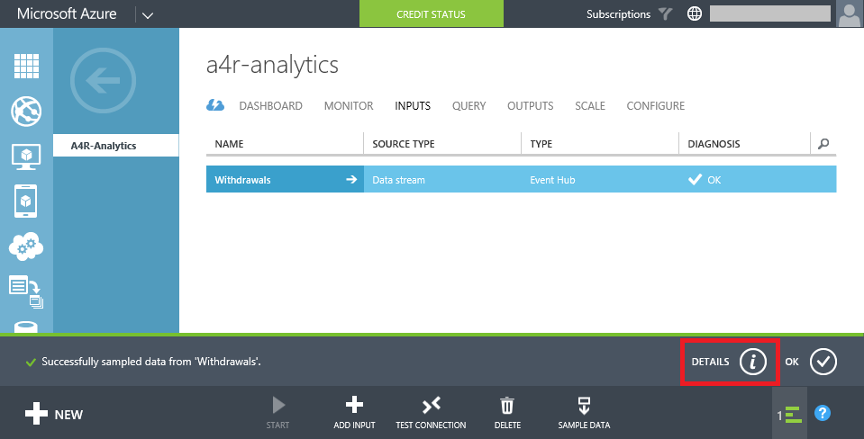

    _Data sampling succeeded_

1. Click **Click here** to download the data sampled from the event hub. Save the JSON file that is downloaded to a location where you can easily find it. Then click **OK** to dismiss the ribbon.

    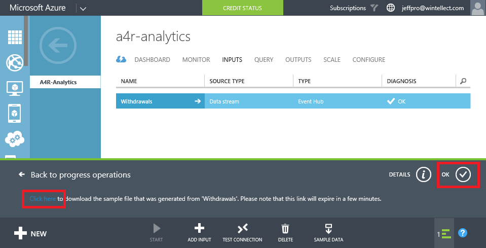

    _Downloading sample data_

1. Open the JSON file you downloaded in your favorite text editor and take a moment to examine its contents. How many rows (events) are represented in the sample data? What is the structure of each row — that is, what fields does each row contain?

You have connected a Stream Analytics job to an event hub and demonstrated that data is passed from one to the other. You have also examined the structure of that data. The next step is to do something with it — specifically, to bring the power of Azure Stream Analytics to bear on the data.  

## Exercise 5: Prepare queries and test with sample data ##

Now that your job is set up, there's much more you can do with Stream Analytics than simply view the raw data presented to it. The whole point of Stream Analytics is being able to perform queries on the data, even though the data is dynamic rather than static. In this exercise, you'll use the [Stream Analytics Query Language](https://msdn.microsoft.com/en-us/library/azure/Dn834998.aspx) to query a sample data set for potentially fraudulent ATM transactions. It is always a good idea to test your queries against sample data before deploying them against live data streams, because with sample data, you can verify that a known set of inputs produces the expected set of outputs.

To flag potentially fraudulent withdrawals from ATMs, you will query for transactions performed with the same ATM card at different ATM machines within a specified time window (60 seconds). In real life, you would probably use a larger time window and perhaps even factor in the distance between ATM machines. However, a narrower time window is useful in a lab environment because it allows you to perform meaningful experiments in minutes rather than hours.

1. Begin by returning to the Stream Analytics job in the portal and clicking **QUERY** at the top of the page.

    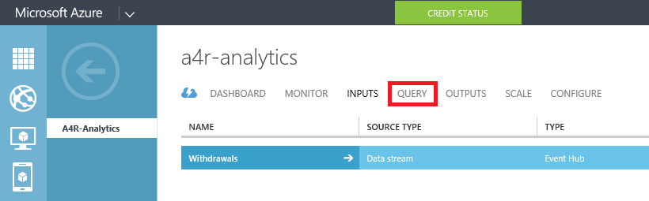

    _Navigating to the Query page_

1. Enter the following query into the **query** field, and then click the **Test** button.

	<pre>
	SELECT * FROM Withdrawals
	</pre>

	> Where did the name "Withdrawals" come from? That's the alias you assigned to the event-hub input in the previous exercise. If you named it differently, you'll need to replace "Withdrawals" with the alias name you used.

    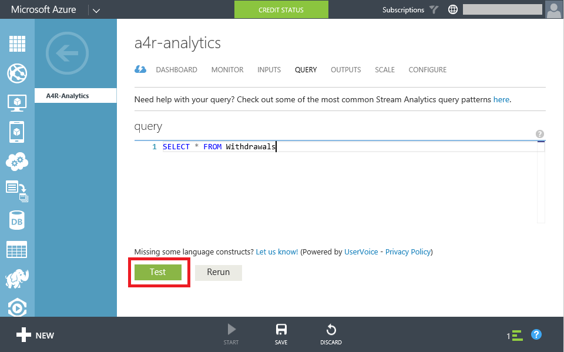

    _Testing a query_

1. In the ensuing dialog, click **BROWSE FOR FILE**. Select the file named Withdrawals.json provided in the "resources" directory of this lab. Then OK the selection by clicking the check mark in the dialog's lower-right corner.

	> The reason you're using a file provided for you (rather than the one you captured in the previous exercise) is to make sure everyone who is doing this exercise gets the same results. eventgen.js uses JavaScript's Math.random() function to randomize results, and Math.random() does not produce repeatable sequences of pseudo-random numbers.

    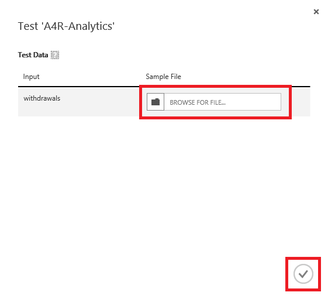

    _Loading test data_

1. Scroll down the page and confirm that you see the output pictured below. The test data contains 607 rows. Each row has fields named TRANSACTIONID, TRANSACTIONTIME, DEVICEID, CARDNUMBER, and AMOUNT. DEVICEID is the ID of the ATM machine at which the transaction took place. AMOUNT is the amount of cash withdrawn from the ATM.

    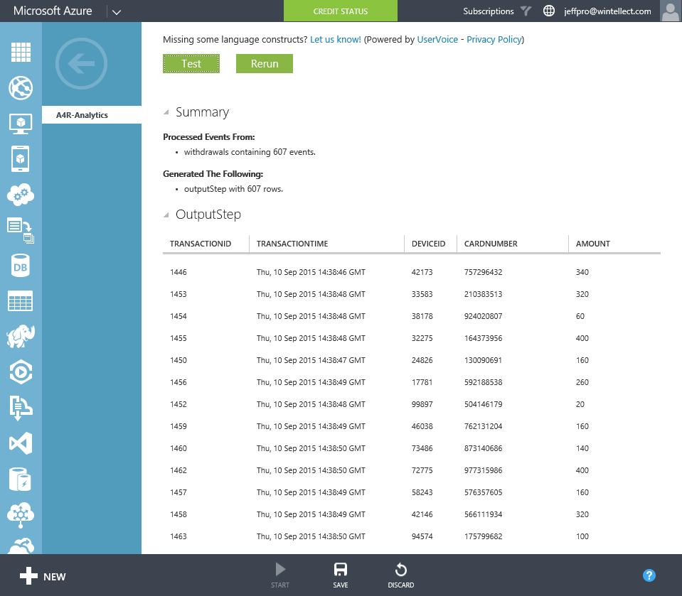

    _Output from SELECT \*_

1. Suppose you only wanted to view transactions for amounts between 200 and 300, inclusive. Furthermore, suppose you wanted to clean up the output by assigning your own column names and excluding the TRANSACTIONID column. Enter the following query and click the **Rerun** button to test it. (**Rerun** executes the query against the test data already loaded. If you wanted to load a different test file, you would click the **Test** button again.)

	<pre>
	SELECT TransactionTime as [Time of Transaction],
	       DeviceID as [ATM],
	       CardNumber as [Card Number],
	       Amount as [Amount]
	FROM Withdrawals
	WHERE Amount >= 200 and Amount <= 300
	</pre>

1. Scroll down and confirm that the query generated the following output:

    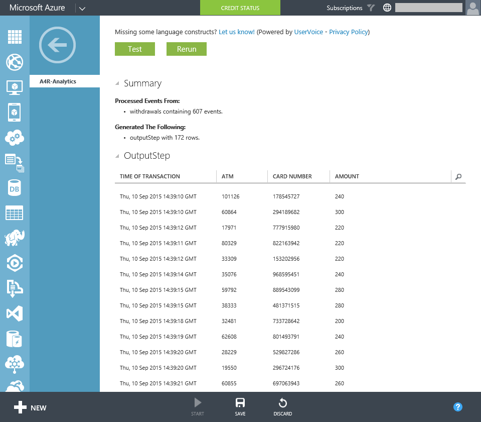

    _Customizing the output_

1. Now it's time to query the test data for potentially fraudulent transactions — transactions involving the same ATM card but different ATM machines that take place within 60 seconds of each other. *This is the query you will use in the next exercise against a live data stream*.

	Enter the following query and click **Rerun** to execute it:

	<pre>
	SELECT W1.CardNumber as [Card Number],
	    W1.DeviceID as [ATM 1], W2.DeviceID as [ATM 2],
	    W1.TransactionTime as [Time 1], W2.TransactionTime as [Time 2]
	FROM Withdrawals W1 TIMESTAMP BY TransactionTime
	JOIN Withdrawals W2 TIMESTAMP BY TransactionTime
	ON W1.CardNumber = W2.CardNumber
	AND DATEDIFF(ss, W1, W2) BETWEEN 0 and 60
	WHERE W1.DeviceID != W2.DeviceID
	</pre>

	> TIMESTAMP BY is an important element of the Stream Analytics Query Language. If it was omitted from the query above, you would be querying for transactions that arrived *at the event hub* within 60 seconds of each other, regardless of when the transactions were actually performed. TIMESTAMP BY allows you to specify a field in the input stream to serve as the basis for comparisons performed with functions such as DATEDIFF.

1. This time the output should contain just three rows, each representing two transactions performed with one ATM card at two different locations within 60 seconds of each other:

    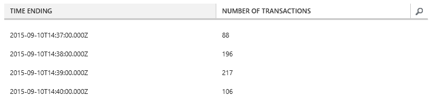

    _Potentially fraudulent transactions_

1. Click the **SAVE** button at the bottom of the page to save the query. Then click **YES** when asked to confirm.

    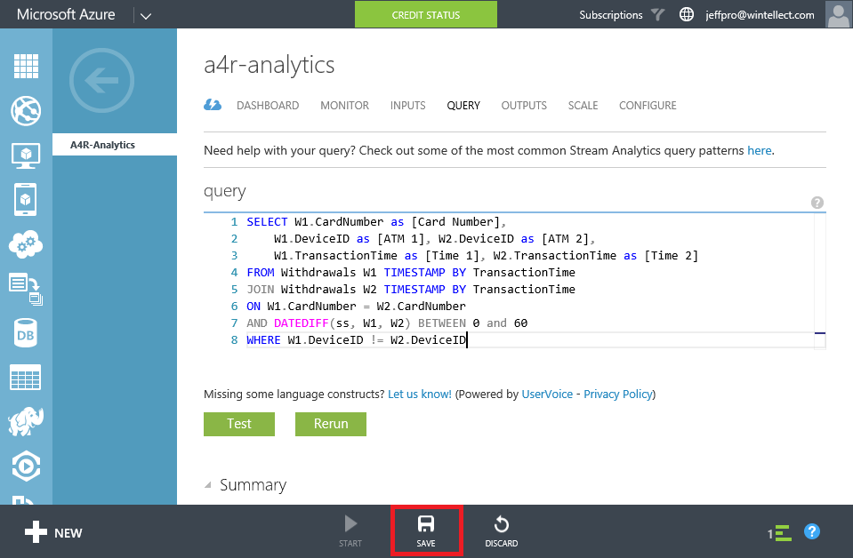

    _Saving the query_

With the query now formulated, tested against a set of sample data, and saved, it's time to deploy it against a live data stream to produce a running record of potentially fraudulent transactions.

## Exercise 6: Analyze a live data stream ##

Being able to run your queries and see the results in the Azure Portal is great for testing, but when a query is deployed against a live data stream, you will most likely want to capture the results in a persistent data store. Azure Stream Analytics supports a variety of output types, including blobs, Azure SQL databases, and even event hubs. Imagine a scenario in which a Stream Analytics job receives data from an event hub, transforms it, and sends the results to another event hub, which itself serves as the input to another Stream Analytics job. Jobs can be chained this way to create rich analytic paths. Another reason for using event hubs for output is that software can subscribe to events from event hubs, enabling developers to build custom applications that show Stream Analytics output in near real time.

In this exercise, you'll configure the Stream Analytics job to store output in storage blobs. Then you'll run the job against a live data stream and check the results by inspecting the blob that was generated.

1. Return to the Stream Analytics job in your browser and click **OUTPUTS**.

    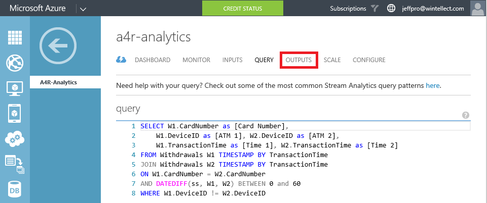

    _Navigating to the Outputs page_

1. Click **ADD AN OUTPUT** to add an output to the job.

    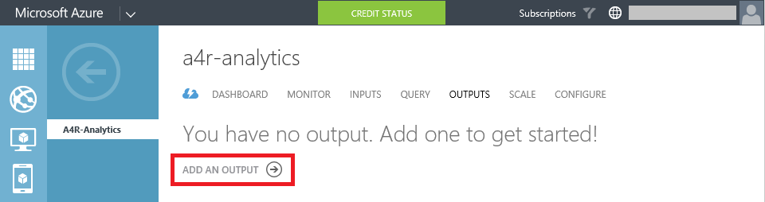

    _Adding an output_

1. Select **Blob storage** as the output type. Then click the right-arrow in the lower-right corner of the dialog.

    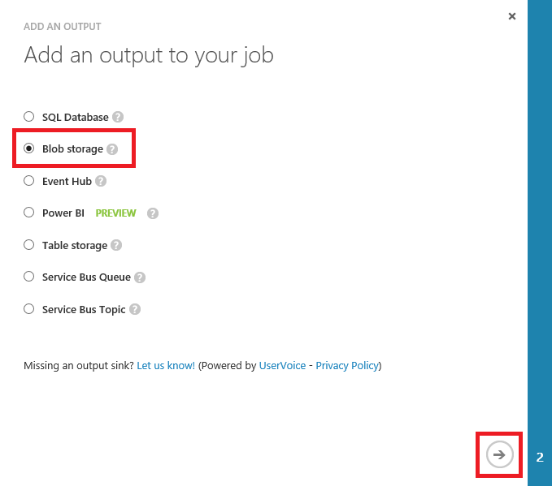

    _Specifying the output type_

1. Type "Flagged-Withdrawals" into the **OUTPUT ALIAS** box. Select the storage account you want to use for the output blobs (feel free to create a new account if you prefer). Make sure **Create a new container** is selected to create a new blob container to hold the output, and type "a4r-analytics" into the **CONTAINER** box. Type "withdrawals/{date}/{time}" into the **PATH PREFIX PATTERN** box. Then click the right-arrow in the lower-right corner.

	> Each time you run a Stream Analytics job configured with a blob output, a new blob with a unique name is created. The purpose of **PATH PREFIX PATTERN** is to allow you to embed meaningful information, such as the time and date the job was executed, in the blob's name.  

    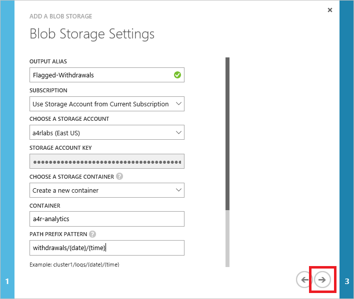

    _Specifying blob storage settings_

1. Make sure **EVENT SERIALIZATION FORMAT**, **ENCODING**, and **FORMAT** are set as shown below, and then finish up by clicking the check mark in the lower-right corner.

    

    _Specifying serialization settings_

1. Click the **START** button at the bottom of the page to start the Stream Analytics job.

    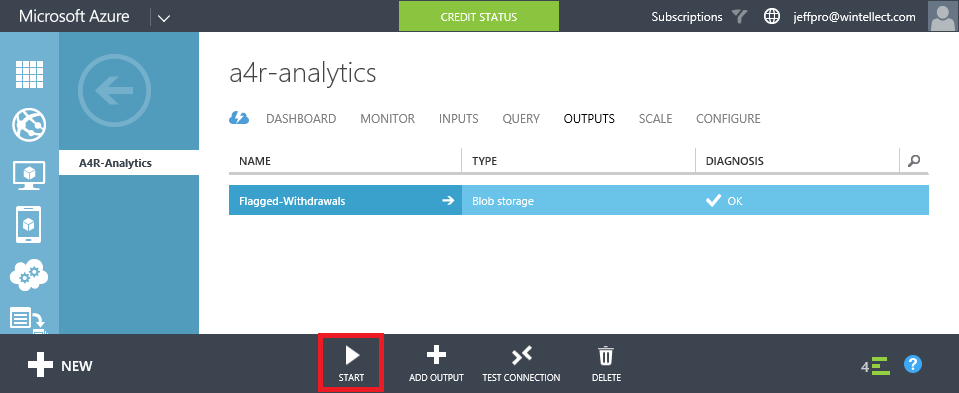

    _Starting the Stream Analytics job_

1. Make sure **JOB START TIME** is selected, and then click the check mark. **JOB START TIME** means that the job will begin sampling output from the input source the moment the job is started. Event hubs retain events for a specified period of time (the default is 1 day), so if you wanted, you could select **CUSTOM TIME** and start sampling output before the job's start time.

    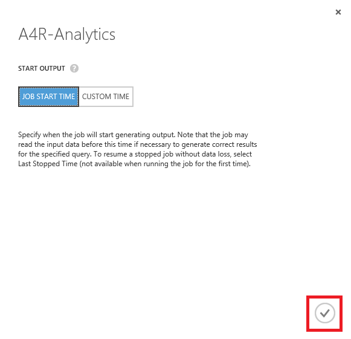

    _Starting the output_

1. Return to the terminal window in which you ran eventgen.js and execute the following command to run it again:

	<pre>
	node eventgen.js
	</pre>

1. Wait 5 to 10 minutes to give the job time to start and eventgen.js time to transmit several hundred events. Then terminate eventgen.js and return to the browser window.

	> If you'd like, you can open several terminal windows and run eventgen.js in each one to increase the volume of events.

1. Click the **STOP** button at the bottom of the page to stop the Stream Analytics job. Then click **YES** when asked if you're sure you want to stop the job.

    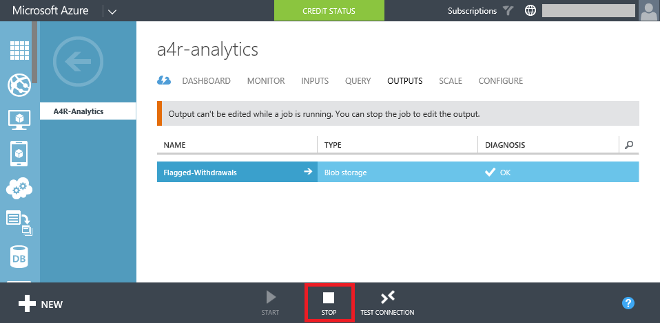

    _Stopping the Stream Analytics job_

1. Wait until the job is stopped, which might take a minute or two. Then click the **Storage** button in the ribbon on the left to go the portal's Storage page.

    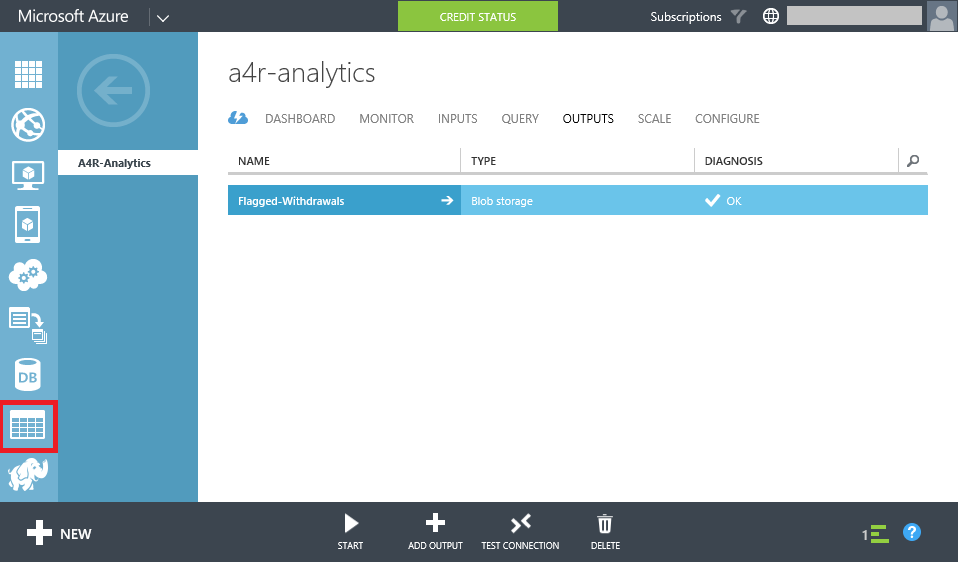

    _The Storage button_

1. Click the storage account that you designated to receive output from the Stream Analytics job.

    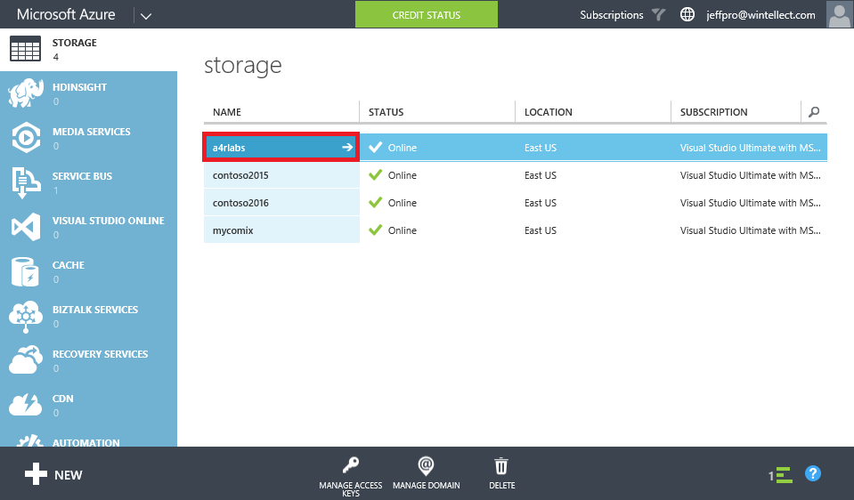

    _Storage accounts_

1. Click **CONTAINERS** to view the storage containers associated with this account.

    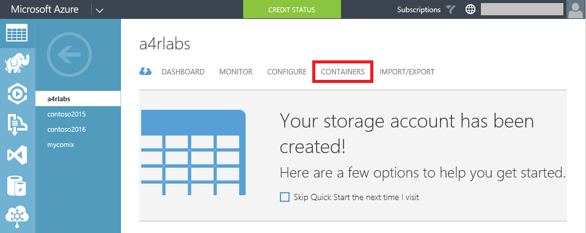

    _a4rlabs account_

1. Click **a4r-analytics** to view the contents of the container you created when you added an output to the Stream Analytics job.

    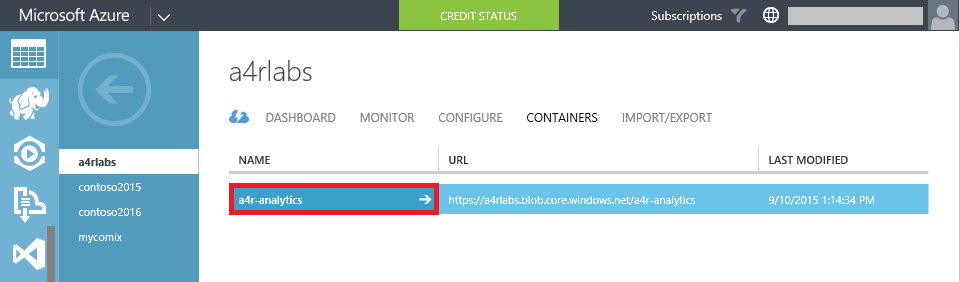

    _a4rlabs containers_

1. Click the **DOWNLOAD** button at the bottom of the page to download the blob containing the output from the Stream Analytics job.

	> If there are no blobs in the container, wait a few minutes and check the container again. Sometimes a blob created by a Stream Analytics job appears immediately, and at other times, it may take 10 minutes or more to show up.

    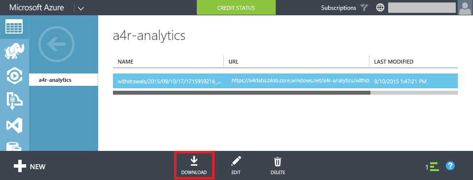

    _Downloading the blob containing the job output_

1. Open the downloaded JSON file in your favorite text editor. Each object (row) in the output represents a potentially fraudulent transaction. Note that **the number of rows and the content of each row will vary from machine to machine as well as from one run to another**.

    

    _JSON job output_

Currently, the data output from your Stream Analytics job is stored in a blob. In real life, you might prefer to view the output in a more convenient form, such as in a chart that's updated in real time. You could accomplish that by writing an application that monitors the blob and charts the data, or, better yet, by directing the output to an event hub and writing an application that subscribes to events from the event hub.

Microsoft recognizes that not everyone wants to write applications, and has provided an alternative in the form of [Microsoft Power BI](https://powerbi.microsoft.com/). With Power BI, you can create dashboards that render output from Stream Analytics jobs without writing any code. The connection between Azure and Power BI is currently offered only as a preview and is subject to certain limitations, but soon the two will be making beautiful music together in the hands of data scientists.

## Summary ##

Azure Stream Analytics is a powerful tool for analyzing live data streams from IoT devices or anything else that's capable of transmitting data. In this lab, you got a first-hand look at Stream Analytics as well as Azure event hubs. Among other things, you learned how to:

- Create an Azure event hub and use it as a Stream Analytics input
- Create a shared access signature that allows event hubs to be called securely using REST APIs
- Create a Stream Analytics job and test queries on sample data streams
- Run a Stream Analytics job and perform queries on live data streams
- Create a rule (query) that detects anomalies in streaming data
- Use that rule to record anomalies in Azure blobs

One drawback to hard-coding rules into Stream Analytics is that rules don't "learn" from the data streams, which can lead to false positives in anomaly detection. If this concerns you, read the article entitled [Anomaly Detection – Using Machine Learning to Detect Abnormalities in Time Series Data](http://blogs.technet.com/b/machinelearning/archive/2014/11/05/anomaly-detection-using-machine-learning-to-detect-abnormalities-in-time-series-data.aspx) in the Azure team's Machine Learning blog. In it, they present an anomaly detection service accessible through a REST API that uses Azure Machine Learning to learn from the data presented to it. Imagine combining the power of Stream Analytics to extract information from real-time data streams with the power of Azure Machine Learning to learn from that information and refine the analytics on the fly. This is precisely the type of solution that Microsoft Azure empowers you to build!

---

Copyright 2015 Microsoft Corporation. All rights reserved. Except where otherwise noted, these materials are licensed under the terms of the Apache License, Version 2.0. You may use it according to the license as is most appropriate for your project on a case-by-case basis. The terms of this license can be found in http://www.apache.org/licenses/LICENSE-2.0.
