
# Creating Web Sites with Django and Bing Maps #

---

## Overview ##

In this hands-on lab we will walk you through how to create a Microsoft Azure Web Site with Django. We will also show you how to create a simple page to monitor the latest 20 major earthquakes with Django and check all big earthquakes nearby! We will use an FTP client to manage the web site.

### Objectives ###

In this hands-on lab, you will learn how to:

- Create a new Web Site on Microsoft Azure by using Django.
- Create a Django website to show the latest earthquakes.
- Create a webjob to show all big earthquakes nearby.

### Prerequisites ###

The following is required to complete this hands-on lab:

- A Microsoft Azure subscription - [sign up for a free trial](http://aka.ms/WATK-FreeTrial)
- Install FileZilla from [SourceForge.](https://filezilla-project.org/)  You may also use your favorite FTP client. 
- You **must** use one of the following **browsers**: Latest version of **Firefox or Chrome, IE 9, 10, 11.**  Browsers like Safari, 360 may have issues with IPython or RDP download. 

----

## Exercises ##

This hands-on lab includes the following exercises:

1. [Exercise 1: Create a Django web site on Microsoft Azure.](#Exercise1)
1. [Exercise 2: Display earthquake locations on your Django web site.](#Exercise2)
1. [Exercise 3: Show earthquakes nearby with a webjob.](#Exercise3)

Estimated time to complete this lab: **45** minutes.

### Exercise 1: Create a Django web site on Microsoft Azure. ###

1. Go to the [Microsoft Azure Management Portal](https://manage.windowsazure.com/) and sign in using the Microsoft credentials associated with your subscription.

    

    _Log on to Microsoft Azure Management Portal_
    

1. Click *New* on the command bar.

    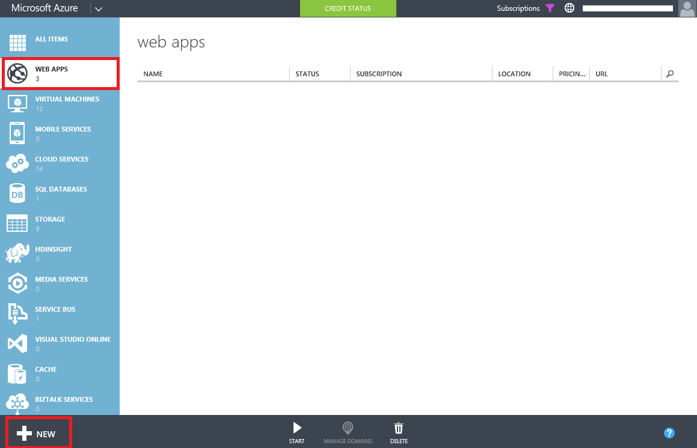

    _Creating a new Web Site From Gallery_

1. Click *Web Site* and then *FROM GALLERY*.

    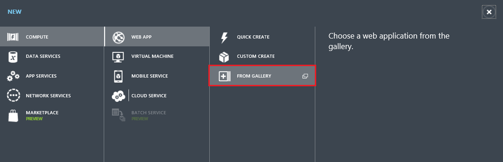

    _Creating a new web site From Gallery_

1. Choose *App Frameworks* category and then select Django. Click on the Next arrow.

    

    _Creating Django Webs_

1. Enter a site name, such as *a4rdjangowebsite*, and select the region. Click on the check mark to complete the wizard. Your Django web site is now being created and deployed.

    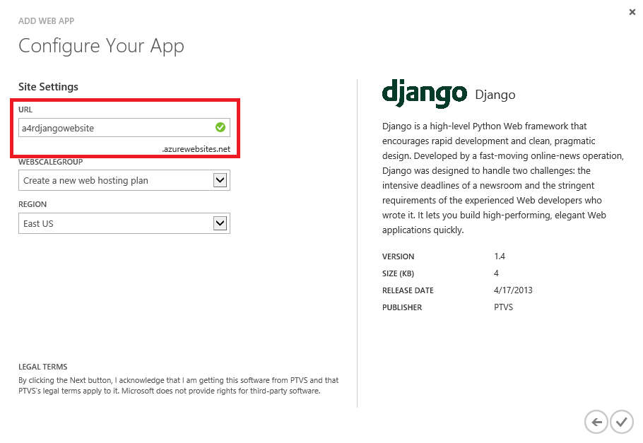

    _Set Django Website Information_

1. You can get the status of the deployment on the portal. The status message is updated once completed:

    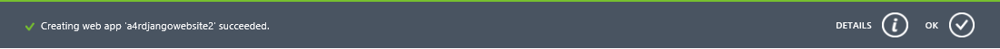

    _View Website Deployment Status_

1. From the list of web sites displayed in the portal, select your site by clicking on its name. This will take you to its dashboard:

    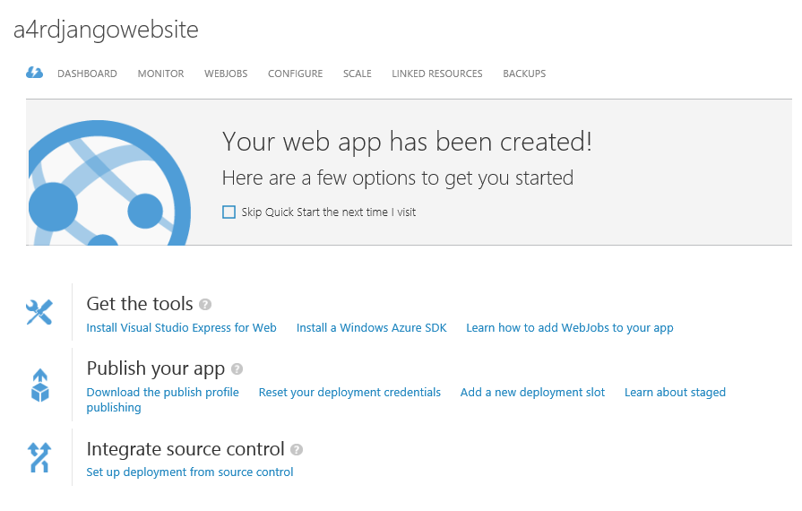

    _View Django Dashboard_

1. From the toolbar at the bottom of the dashboard, click on the Browse button to browse the newly created site: 

    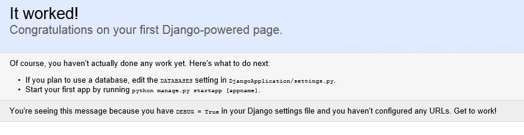

    _View Django Site_

1. **Next**, you need to setup your website's credential for use with FTP. If you need to reset the credential later after an initial setup, you will see a reset link instead. Web Site credentials are separated from the Microsoft ID associated with your Microsoft Azure subscription. Web Site credentials are valid for use with all Microsoft Azure web sites associated with your subscription. It is the administrator password for the site that you are creating, this way you don't have to give co-admin of the website your portal password. If you do forget your deployment credentials you can easily reset them again using the management portal. Open the web site **Dashboard** page and click the **Reset deployment credentials** link. Provide a new password and click Ok.

    
    
    _Click on Reset deployment credentials on the right hand side of your web site dashboard_
    
    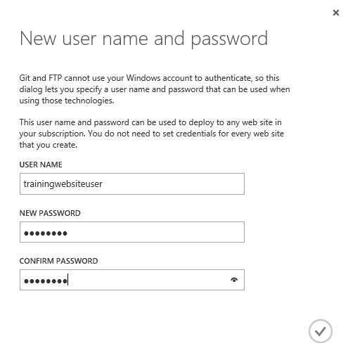
    
    _Entering the username and password_
    
    >**Note:** Don't forget to write your username and password on a paper. If you forget the password, you have to reset the credential again.

#### Exercise 2 - Display earthquake locations on your Django web site. ####

**Next**, we are going to create a Django website and show data of the latest earthquakes around the world on a map using Bing Maps. First we need to install Python and Django on your local machine.  If you are not familiar with Django, it is a "High-level Python Web framework that encourages rapid development and clean, pragmatic design." You may learn more about using it for web development from its [website](https://www.djangoproject.com/).

1. Open the folder **Azure-training-course\Day 1\2. HOL Microsoft Azure Web Sites\Source\DjangoApplication\**, There is an existing Django project. All code are ready for you. It creates a view called **earthquake** to show all earthquakes on Bing map.

1. In order to use Bing Map SDK, we will also need to apply for a key. Just visit the [Bing Maps Portal](http://www.bingmapsportal.com).

    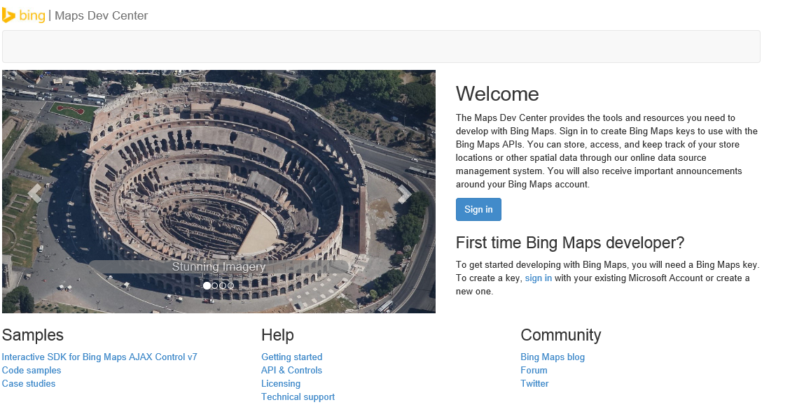

    _Bing Map Portal_

You can use the same Microsoft account you used to login to the Microsoft Azure portal, or you can click **New User** to register a new one.

1. Click **Create or view keys** to create your own key. Input your application name, Url, key type and application type. Set the Key type to **Basic** and Application type to **Education**. Please ensure the **Application URL** is the same as the web site you just created in the last step.

    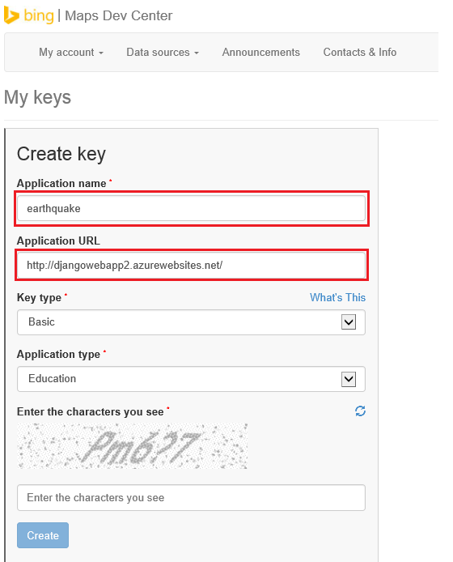
    _Create Bing Map Keys_

1. You will get your key after you submit your information. You will use the key in your html page.

    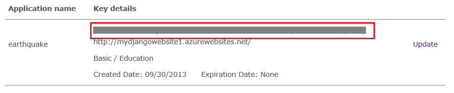

    _Bing Map Key_

1. Open the file in **templates\earthquake.html** in text editor, replace the **Your Bing Maps Key** with your own application key and save the file.

    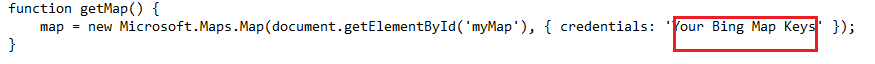

    _Change Application Key_

1. In order to use webjobs in Exercise 3, you will also need a storage account. Storage account is a place where we can save blob files, no sql data or queue data. You don't need to worry too much about it because we will explain it more in the coming sessions. In the management portal, just click **New** -> **Data Service** -> **Storage** -> **Quick Create** to create one. You can select your nearest region and a global unique name for the url.
    
    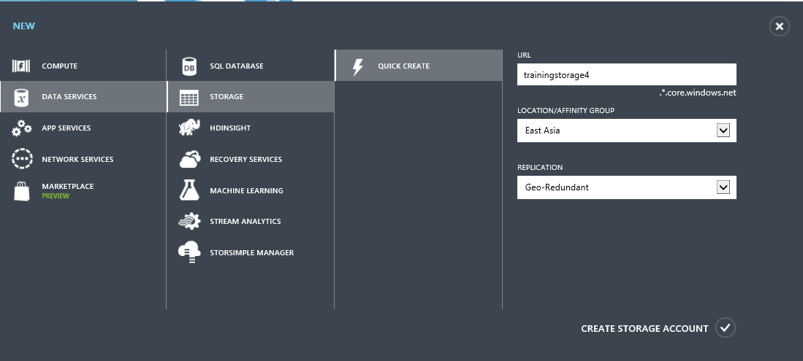
    
    _Create A Storage Account_    

1. You need to know your storage account's name add access key. You can find your storage account name and access key in your Microsoft Azure Management Portal.

    

    _Microsoft Azure Storage Account_
    
    Click the "Manage Access Keys" button under the page to display the storage account name and access keys for the currently selected storage account. 

    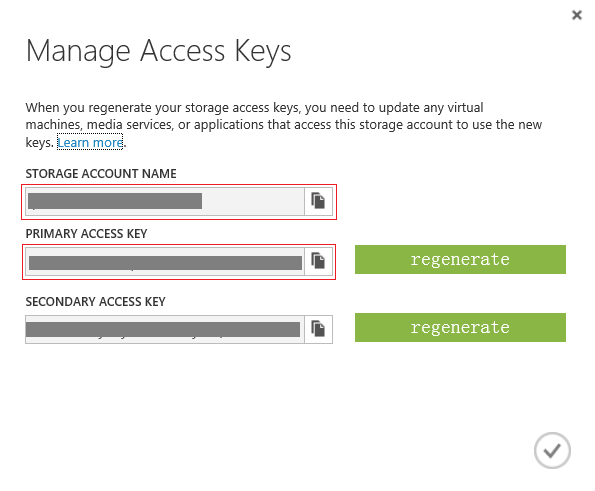

    _Manage Access Key_    

1. Replace the storage account name and storage account key at the end the python code file **settings.py**

    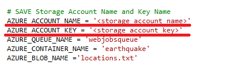

    _Update storage account info_

1. Connect to the FTP publishing service by FileZilla. You can download and install FileZilla to manage all your folders. FileZilla is a free ftp solution. The client version can be downloaded from [here](https://filezilla-project.org/). It has Windows and Mac version. The UI is almost exactly the same. 

    Provide the **Host Name**, **User Name** and **Password** of your deployment credentials. The **Host Name** is available from the Dashboard in the portal under FTP HOST NAME (or FTPS HOST NAME) and will look something like _ftp://waws-prod-blu-001.ftp.azurewebsites.windows.net_. Make sure that the **User Name** is prefixed by the **Web Site** name (e.g. **mydiangowebsite1\trainingwebsiteuser**). The password is you wrote down in the Exercise 1.

    
    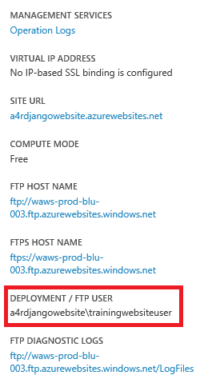 

    _Above is an example of the **Dash board**, on the right hand side you will find the ftp host and the user name you should use for Filezilla._    

    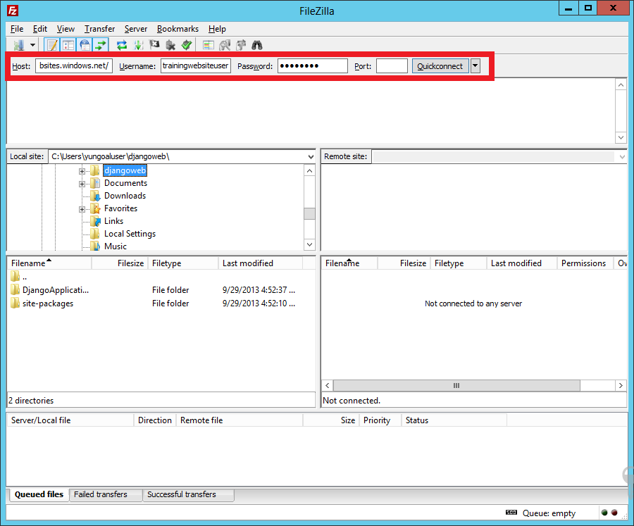 

    _Use FileZilla_
    

1. Click **Quick Connect** and Upload all files using the FileZilla. Use FileZilla to upload the subfolder **Azure-training-course\Day 1\2. HOL Microsoft Azure Web Sites\Source\DjangoApplication\DjangoApplication\DjangoApplication** to **site/wwwroot** folder. You can overwrite the server files.

    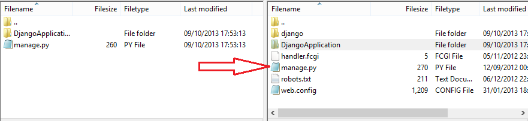

    _Upload Django Website_

1. Browse the new web site [http://**[yourwebsite]**.azurewebsites.net/earthquake](http://[yourwebsite].azurewebsites.net/earthquake), for example, [http://django.azurewebsites.net/earthquake](http://a4rdjangowebsite.azurewebsites.net/earthquake).

1. You can see the earthquake locations on your website.

    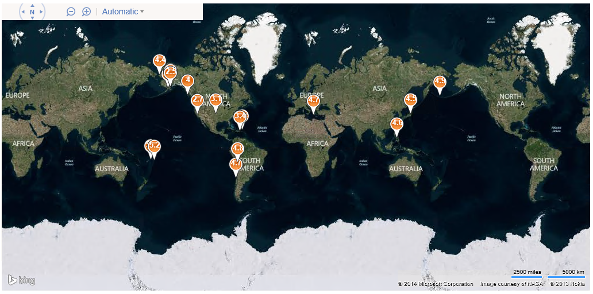

    _Earthquake Locations_ 

    If you get the following error **No module named azure.storage**, you can upload the folder **Azure-training-course\Day 1\2. HOL Microsoft Azure Web Sites\Source\azure** to **/site/wwwroot** so as to enable the azure sdk for python.
    
    >

1. If you are having issues with the ftp server, close Filezilla and try again, make sure you have used the correct user name and password.  Also note that username is in the format of: [YOURWEBSITE/USERNAME] not user name you created via reset deployment credential.

 

#### Excerise 3 - Create a webjob to show all big earthquakes nearby [OPTIONAL] ####

**Next**, we are going to create a webjob to download all big earthquakes from 2000 to now. The magnitude is larger than 6 and we are looking for the circle with 1000 km inside radius and 1200 km outside radius. A .NET executable is running continuously. If you click the pushpin on the map, the job will get the location of the pushpin and check all earthquakes.

If you do not already have Visual Studio installed, you can install the web edition from http://msdn.microsoft.com/en-us/library/dd537667(v=vs.110).aspx  

1. Open the project file under **Azure-training-course\Day 1\2. HOL Microsoft Azure Web Sites\Source\WebJob\WebJob.sln** with Visual Studio 2013. It is a console application to download all earthquake data from [USGS](http://www.usgs.gov/). We will upload the console application to the website and run a background job to get all big earthquakes near a certain location. All code is ready but we need to modify some configurations in the file **app.config**. Double click the file in the solution explore.

    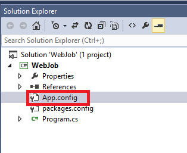

    _Update app config_

    We have two connection strings, **AzureJobRuntime** and **AzureJobsData**, we need to replace the storage account name and key in the connection string.

    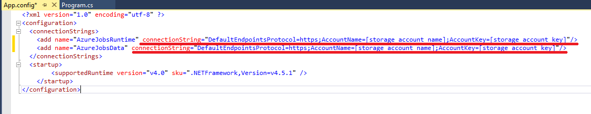

    _Replace the connection string_

    Save the file after you modify.

1. Then we need to rebuild the project by right click the **WebJob** node in the _Solution Explorer_ and click **Rebuild**

    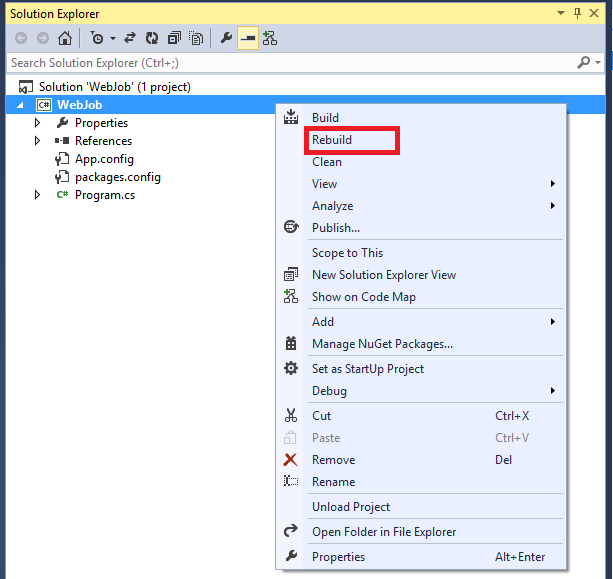

    _Rebuild_

    Right click the **WebJob** node in the _Solution Explorer_ and click **Open Folder In File Exploere**, Navigate to **bin/Debug** folder. Right click the folder, select **Send To** -> **Compressed (zipped) folder** to create a zip file.

    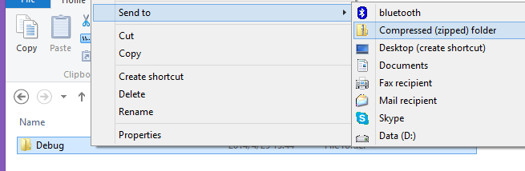

    _Create a zip file_

<!--->if you are using Mac OS or Linux and you don't have a visual studio installed. We have already build the file for you. You can directly open the folder **Azure-training-course\Day 1\2. HOL Microsoft Azure Web Sites\Source\WebJob\WebJob\bin\Debug** and open the file **WebJob.exe.config**. Just do the same modification and create a zip file from the Debug folder.--->

1. In your website dashboard, click Configuration tab.

    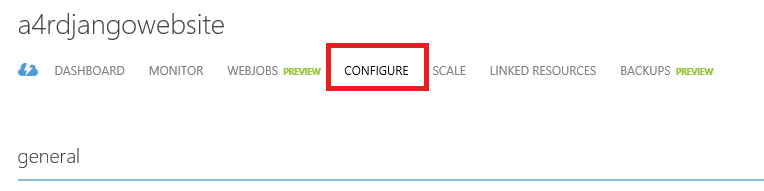

    _Website Configure_

    Scroll down to connection strings section, add a new connection string. Don't forget to replace storage account name and storage account key with you own data. Click **Save** after you are done.
    
    <pre>
    Name = "AzureJobsRuntime"
    Value = DefaultEndpointsProtocol=https;AccountName=[storage account name];AccountKey=[storage account key]
    Type = Custom
    </pre>

    

    _Website Configure_

1. Click WebJob tab in the dashboard. Click **ADD A JOB** to create a new job.

    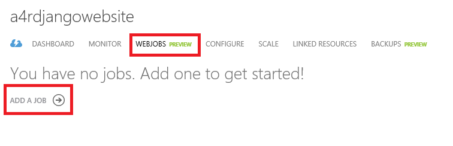

    _Add WebJobs_

1. In the **Basic WebJob settings** form, input the job name, select the zip file we just created and select **Run Continuously**.

    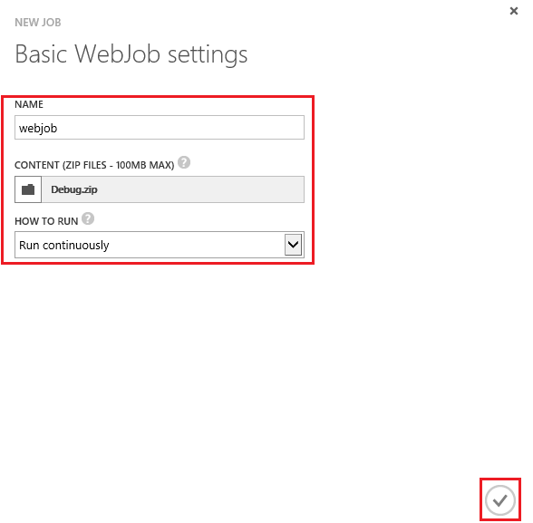

    _Basic WebJob settings_

    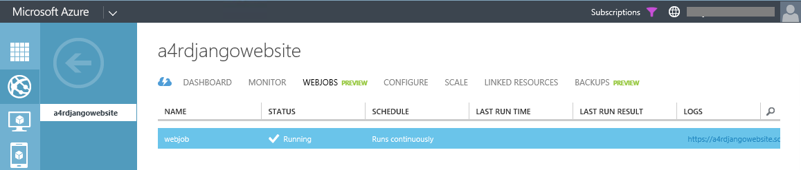

    _WebJob Created_

1. After the job is created, move your mouse to a pushpin and click, you will see the webjob will query all big earthquakes whose magnitude is larger than 6 near the pushpin location from 2000 to now!

    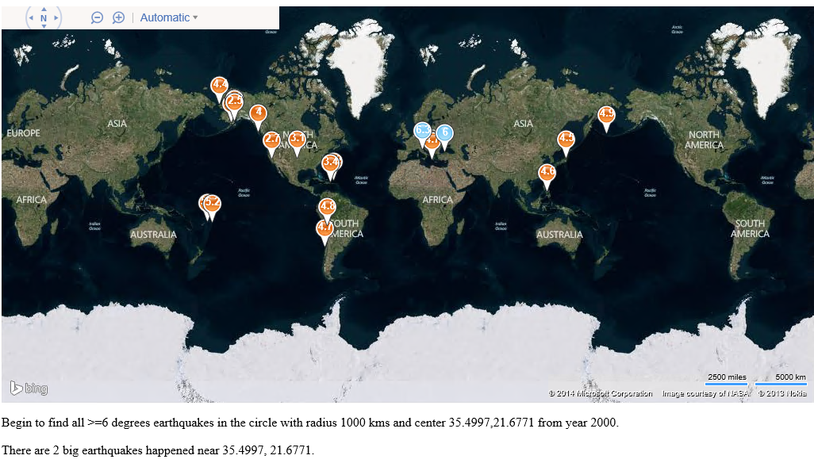

    _Earthquake Locations Nearby_ 

---

## Summary ##

By completing this hands-on lab you learned the following:

- Create a new Web Site on Microsoft Azure by using Django.
- Create a Django website to show earthquake information.
- Create a webjob to show all big earthquakes nearby.

Copyright 2013 Microsoft Corporation. All rights reserved. 
Except where otherwise noted, these materials are licensed under the terms of the Apache License, Version 2.0. You may use it according to the license as is most appropriate for your project on a case-by-case basis. The terms of this license can be found in [http://www.apache.org/licenses/LICENSE-2.0](http://www.apache.org/licenses/LICENSE-2.0).
