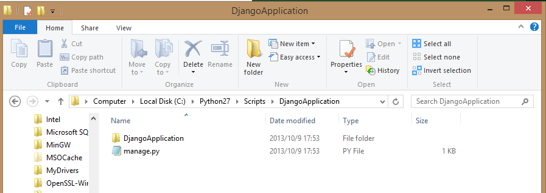

<a name="HOLTitle"></a>
# Creating Web Sites with Django and Bing Maps #

---
<a name="Overview"></a>
## Overview ##

In this hands-on lab we will describe how to create a Windows Azure Web Site with Django. We will also describe how to create a simple page to show the earthquake information with Django! We will use FTP to manage the web site.

<a name="Objectives"></a>
### Objectives ###

In this hands-on lab, you will learn how to:

- Create a new Web Site on Windows Azure by using Django.
- Create a Django website to show earthquake information.

<a name="Prerequisites"></a>
### Prerequisites ###

The following is required to complete this hands-on lab:

- A Windows Azure subscription - [sign up for a free trial](http://aka.ms/WATK-FreeTrial)


---
<a name="Exercises"></a>
## Exercises ##

This hands-on lab includes the following exercises:

1. [Exercise 1: Create a Web site on Azure of Django.](#Exercise1)
1. [Exercise 2: Display eathquake locations on your Django Web Site.](#Exercise2)

Estimated time to complete this lab: **45** minutes.

<a name="#Exercise1"></a>

### Exercise 1: Create a Web site on Azure of Django. ###

1. Go to the [Windows Azure Management Portal](https://manage.windowsazure.com/) and sign in using the Microsoft credentials associated with your subscription.

	

	_Log on to Windows Azure Management Portal_
    

1. Click *New* on the command bar.

	

	_Creating a new Web Site From Gallery_

1. Click *Web Site* and then *FROM GALLERY*.

    

	_Creating a new web site From Gallery_

1. Choose *App Frameworks* category and then select Django. Click on the Next arrow.

	

	_Creating Django Webs_

1. Enter a site name, such as *mydjangowebsite1*, and select the region. Click on the Complete checkmark and that’s it. Your Django web site is now being deployed.

	

	_Set Django Website Informaiton_

1. You can read the status of the deployment on the portal. The status message is updated once completed:

	

	_View Website Deployment Status_

1. From the list of web sites displayed in the portal, select yours by clicking its name. This will display its dashboard:

	

	_View Django Dashboard_

1. From the toolbar at the bottom of the dashboard, click on the Browse button to browse the newly created site: 

	

	_View Django Site_
	

<a name="#Exercise2"></a>

#### Excerise 2 - Display eathquake locations on your Django Web Site. ####

Next we are going to create a Django website and show some earthquake information on a map using Bing Maps. First we need to install Python and Django on your local machine.

1. Download Python from [Python Website](http://www.python.org/) and install Python 2.7.5 to your local machine. 

	

	_Download Python_

1. Then you need to download the lastest version of [Django](https://www.djangoproject.com/).You also need to download the official release and follow the installation [instructions](https://docs.djangoproject.com/en/1.5/topics/install/#installing-official-release) to ensure it works on your machine.


	

	_Download Django_
	
1. Launch your commandline and navigate to a local directory under which you will create your Django web site. Use the following command to create a skeleton of a Django application called *DjangoApplication*.

	````CommandPrompt
		python (path to Python27 Scripts folder)/django-admin.py startproject DjangoApplication
	````

    For example, on Windows that might be:

	````CommandPrompt
		python C:\Python27\Scripts\django-admin.py startproject DjangoApplication
	````

	After the command is executed, there is output but you can see a new folder *DjangoApplication* is created under your current folder.

	Open the folder and you will see a typical django website structure.

	

	_Django Website Top-Level Folder_

	

	_Django Website Application Files_
	
	There is a file *manage.py* and another folder *DjangoApplication* under the *DjangoApplication* folder. In the internal *DjangoApplication* folder, there are 4 files: *\__init__.py*, *settings.py*, *urls.py*, and *wsgi.py*.

	Quoting from the [tutorial from the official Django Project documention](https://docs.djangoproject.com/en/1.4/intro/tutorial01/):

	- The outer DjangoApplication/ root directory is just a container for your project. Its name doesn’t matter to Django; you can rename it to anything you like.
	- manage.py: A command-line utility that lets you interact with this Django project in various ways. You can read all the details about manage.py in django-admin.py and manage.py.
	- The inner DjangoApplication/ directory is the actual Python package for your project. Its name is the Python package name you’ll need to use to import anything inside it (e.g. DjangoApplication.urls).
	- DjangoApplication/\__init__.py: An empty file that tells Python that this directory should be considered a Python package. (Read more about packages in the official Python docs if you’re a Python beginner.)
	- DjangoApplication/settings.py: Settings/configuration for this Django project. Django settings will tell you all about how settings work.
	- DjangoApplication/urls.py: The URL declarations for this Django project; a “table of contents” of your Django-powered site. You can read more about URLs in URL dispatcher.
	- DjangoApplication/wsgi.py: An entry-point for WSGI-compatible web servers to serve your project. See How to deploy with WSGI for more details.

1. Next let's change some code to show the earthquake information. You can find the final source code from **Source\Exercise02\DjangoApplication**. First we need to create a new folder **templates** under the sub *DjangoApplication* folder and copy the **earthquake.html** into it. The file is under the same folder of **Source\Exercise02\DjangoApplication**.

1. Open file file **settings.py**. Add the following code on the top:
	
	````Python	
		import os	
	````

	Add **templates** folder into existing TEMPLATE_DIRS section. Ensure you didn't forget to add the comma at the end of the line.

	

	_Line to add to existing **TEMPLATE_DIRS** section in settings.py_

	````Python	
		TEMPLATE_DIRS = (
	    # Put strings here, like "/home/html/django_templates" or "C:/www/django/templates".
	    # Always use forward slashes, even on Windows.
	    # Don't forget to use absolute paths, not relative paths.
	    os.path.join(os.path.dirname(__file__), 'templates').replace('\\','/'),
		)	
	````
	_Final **TEMPLATE_DIRS** section after edits_

1. Next we will add the url redirect to **urls.py** file. First, add *from DjangoApplication.view import earthquake* near the top of the file, as shown, to reference a new view called earthquake (that we will create soon). Second, add *('^earthquake/$',earthquake),* to the patterns section so that web routing to our new view will be recognized.

	````Python
		from DjangoApplication.view import earthquake # NEW

		urlpatterns = patterns('',
		    # Examples:
		    # url(r'^$', 'DjangoApplication.views.home', name='home'),
		    # url(r'^DjangoApplication/', include('DjangoApplication.DjangoApplication.urls')),

		    url('^earthquake/$',earthquake), # NEW

		    # Uncomment the admin/doc line below to enable admin documentation:
		    # url(r'^admin/doc/', include('django.contrib.admindocs.urls')),
		
		    # Uncomment the next line to enable the admin:
		    # url(r'^admin/', include(admin.site.urls)),
		)	
	````
	_Add two lines to urls.py_

1. Next we will create a new **view.py** file and add some python code. The code will download an earthquake csv file from [Earthquake Hazards Program](http://earthquake.usgs.gov) and show 20 recent earthquakes on your Django website using a Bing Map.

	The first part of the code is to load required libraries including django, urllib and csv.

	````Python
from django.http import HttpResponse
from django.template.loader import get_template
from django.template import Template, Context
from django.http import HttpResponse
import urllib
import csv
import string
	````

	Next we define a function **earthquake** that will be invoked when our web page is accessed. In this function, we will load the earthquake information and download the data locally. Finally, it will render the predefined template and show earthquake locations.
	
	````Python
def earthquake(request):
	    #load the earthquake data from internet
	    csvgps = urllib.urlopen("http://earthquake.usgs.gov/earthquakes/feed/v1.0/summary/2.5_month.csv")
	    f = csvgps.read();
	    with open('csvgps.csv','w') as temp:
	        temp.write(f)
	````
	
	Continuing the same *earthquake* function, we now use csv library to parse the earthquake latitude, longitude and magnitude from the data file.
	
	````Python
	    data = [[0 for col in range(3)] for row in range(20)]
	    reader = csv.reader(open("csvgps.csv"), delimiter=",")
	    index = 0
	    for line in reader:
	        if index > 0 and index <= 20:
	            data[index - 1][0] = float(line[1])
	            data[index - 1][1] = float(line[2])
	            data[index - 1][2] = float(line[4])
	        index = index + 1
	````
	
	Finally, to finish up the implementation of the *earthquake* function, the code loads *earthquake.html* as a template and replaces the earthquake information in the page.

	````Python
	    #load the template
	    t = get_template('earthquake.html')
	    html = t.render(Context({'content': data}))
	
	    return HttpResponse(html)
	````

1. In order to use Bing Map SDK, we will also need to apply for a key. Just visit the [Bing Maps Portal](http://www.bingmapsportal.com).

	

	_Bing Map Portal_

You can use the same Microsoft account you used to login to the Windows Azure portal, or you can click **New User** to register a new one.

1. Click **Create or view keys** to create your own key. Input your application name, Url, key type and application type. Set the Key type to **Basic** and Application type to **Education**. Please ensure the **Application URL** is the same as the web site you just created in the last step.

	
	_Create Bing Map Keys_

1. You will get your key after you submit your information. You will use the key in your html page.

	

	_Bing Map Key_

1. Open the file in **templates\earthquake.html** in text editor, replace the **Your Bing Maps Key** with your own application key and save the file.

	

	_Change Application Key_

1. Connect to the FTP publishing service by FileZilla. You can download and install FileZilla to manage all your folders. FileZilla is a free ftp solution. The client version can be downloaded from [here](https://filezilla-project.org/).

	Provide the **Host Name**, **User Name** and **Password** of your deployment credentials. The **Host Name** is available from the Dashboard in the portal under FTP HOST NAME (or FTPS HOST NAME) and will look something like _ftp://waws-prod-blu-001.ftp.azurewebsites.windows.net_. Make sure that the **User Name** is prefixed by the **Web Site** name (e.g. **mydiangowebsite1\trainingwebsiteuser**) 

	 

	_Use FileZilla_

	> **Note:** Web Site credentials are separate from the Microsoft ID associated with your Windows Azure subscription. Web Site credentials are valid for use with all Windows Azure web sites associated with your subscription. If you don't know your deployment credentials you can easily reset them using the management portal. Open the web site **Dashboard** page and click the **Reset deployment credentials** link. Provide a new password and click Ok.

	>
	>
	>
	>_Entering the username and password_

1. Click **Quick Connect** and Upload all files using the FileZilla.Use FileZilla to upload the subfolder **DjangoApplication** to **site/wwwroot** folder. You can overwrite the server files.

	

	_Upload Django Website_

1. Browse the new web site [http://**[yourwebsite]**.azurewebsites.net/earthquake](http://[yourwebsite].azurewebsites.net/earthquake), for example, [http://django.azurewebsites.net/earthquake](http://django.azurewebsites.net/earthquake).

1. You can see the earthquake locations on your website.

	

	_Earthquake Locations_ 

---

<a name="summary"></a>
## Summary ##

By completing this hands-on lab you learned the following:

- Create a new Web Site on Windows Azure by using Django.
- Create a Django website to show earthquake information.


© 2013 Microsoft Corporation. All rights reserved.
Except where otherwise [noted](http://creativecommons.org/policies#license), content on this site is licensed under a [Creative Commons Attribution-NonCommercial 3.0 License.](http://creativecommons.org/licenses/by-nc/3.0/)