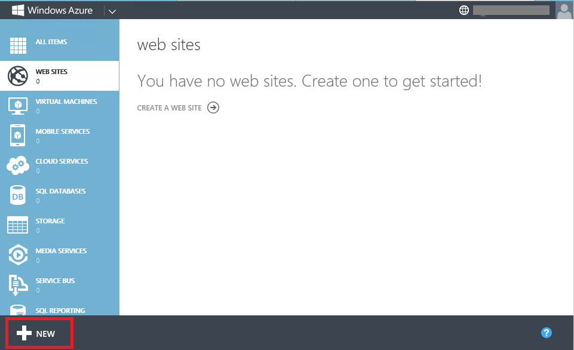
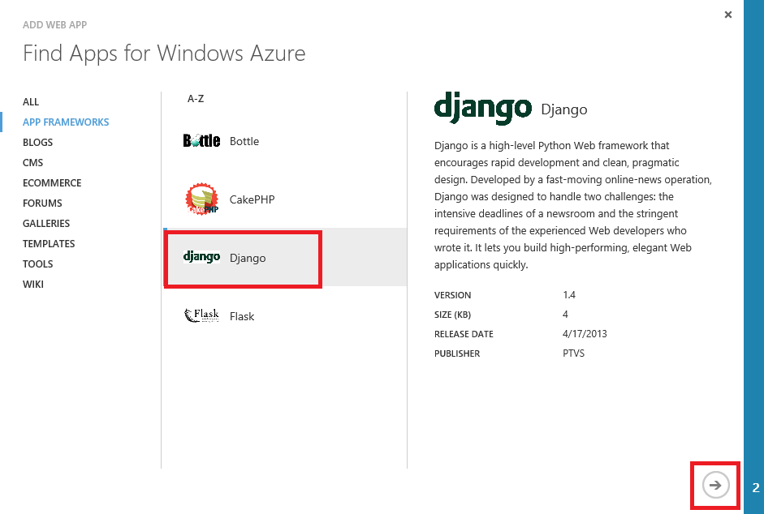
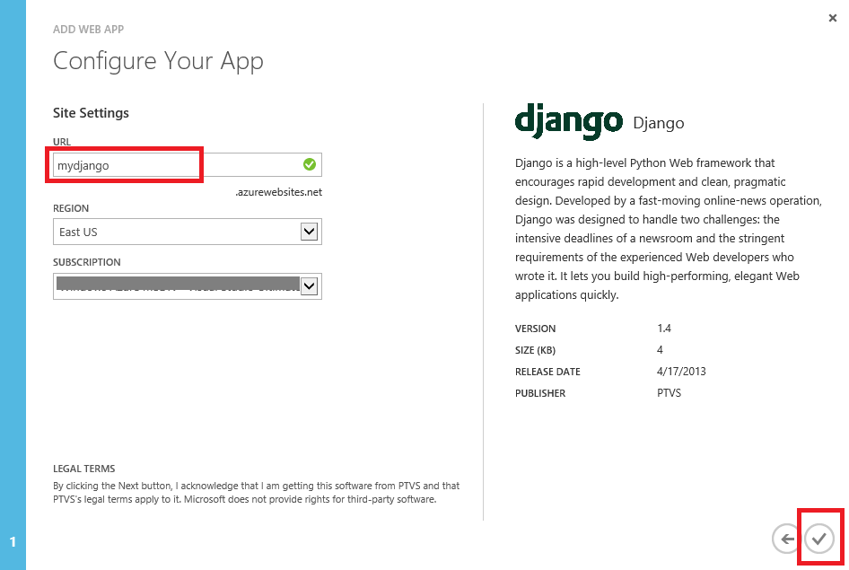
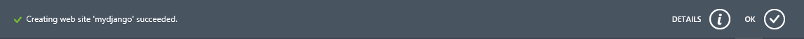
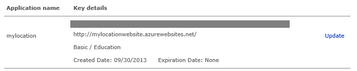
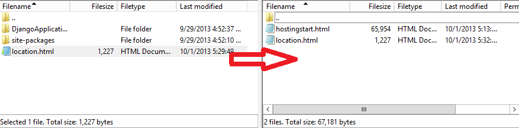

# Creating Web Sites with Django and Bing Maps #

---

## Overview ##

In this hands-on lab we will describe how to create a Windows Azure Web Site with Django. We will also describe how to create a simple page to display your current location on a Bing Map! We will use FTP to manage those web sites. You can run the lab on Windows, Linux or Mac.

### Objectives ###

In this hands-on lab, you will learn how to:

- Create a new Web Site on Windows Azure by using Django.
- Add a new page to show your current location on a Bing Map.
- Use FTP to manage those web sites.

### Prerequisites ###

The following is required to complete this hands-on lab:

- A Windows Azure subscription - [sign up for a free trial](http://aka.ms/WATK-FreeTrial)

---

## Exercises ##

This hands-on lab includes the following exercises:

1. [Exercise 1: Create a web site on Azure for Django.](#Exercise1)
1. [Exercise 2: Display your current location on a Bing Map.](#Exercise2)

Estimated time to complete this lab: **45** minutes.

### Exercise 1: Create a web site on Azure for Django ###

During this exercise you will create a new web site for Django.

1. Go to the [Windows Azure Management Portal](https://manage.windowsazure.com/) and sign in using the Microsoft credentials associated with your subscription.

	

	_Log on to Windows Azure Management Portal_
    

1. Click *New* on the command bar.

	

	_Creating a new Web Site From Gallery_

1. Click *Web Site* and then *FROM GALLERY*.

    

	_Creating a new web site From Gallery_

1. Choose *App Frameworks* category and then select Django. Click on the Next arrow.

	

	_Creating a new Web Site for Django_

1. Enter a site name, such as *mydjango*, and select the region. Click on the Complete checkmark and that’s it. Your Django web site is now being deployed.

	

	_Config Django_

1. You can view the status of the deployment in the portal. The status message is updated once completed:

	

	_View Django Status_

1. From the list of web sites displayed in the portal, select yours by clicking its name. This will display its dashboard:

	

	_View Django Dashboard_

1. From the toolbar at the bottom of the dashboard, click on the Browse button to browse the newly created site: 

	

	_View Django Site_
	

#### Excerise 2 - Display your current location on a Bing Map ####

Next let's enhance your new Django web site by adding a simple html page to show your current location on a map using Bing Maps.

Once completed, you will see you current location displated within your web site:

_You current location_

1. Create a new web site according to the steps in [Exercise 1](#Exercise1).

1. Visit the [Bing Maps Portal](http://www.bingmapsportal.com).

	

	_Bing Map Portal_

You can use the same Microsoft account you used to login to the Windows Azure portal, or you can click **New User** to register a new one.

1. Click **Create or view keys** to create your own key. Input your application name, Url, key type and application type. Set the Key type to **Basic** and Application type to **Education**. Please ensure the **Application URL** is the same as the web site you just created in the last step.

	
	_Create Bing Map Keys_

1. You will get your key after you submit your information. You will use the key in your html page.

	

	_Bing Map Key_

1. Open the file in **Source\location.html** in text editor, replace the **[ApplicationKey]** with your own application key and save the file.

	

	_Change Application Key_

1. Connect to the FTP publishing service by FileZilla. You can download and install FileZilla to manage all your folders. FileZilla is a free ftp solution. The client version can be downloaded from [here](https://filezilla-project.org/).

	Provide the **Host Name**, **User Name** and **Password** of your deployment credentials. The **Host Name** is available from the Dashboard in the portal under FTP HOST NAME (or FTPS HOST NAME) and will look something like _ftp://waws-prod-blu-001.ftp.azurewebsites.windows.net_. Make sure that the **User Name** is prefixed by the **Web Site** name (e.g. **mydjango\trainingwebsiteuser**) 

	 

	_Use FileZilla_

	> **Note:** Web Site credentials are separate from the Microsoft ID associated with your Windows Azure subscription. Web Site credentials are valid for use with all Windows Azure web sites associated with your subscription. If you don't know your deployment credentials you can easily reset them using the management portal. Open the web site **Dashboard** page and click the **Reset deployment credentials** link. Provide a new password and click Ok.

	>
	>
	>
	>_Entering the username and password_

1. Click **Quick Connect** and Upload all files using the FileZilla.Use FileZilla to upload the file **location.html** to **site/wwwroot** folder.

	

	_Upload the location file_

1. Browse the new web site http://**[yourwebsite]**.azurewebsites.net/location.html.

1. You will get your current location by clicking *GetCurrentLocation* button. 

	

	_Your current location_
 

---

## Summary ##

By completing this hands-on lab you learned the following:

- How to create a Windows Azure Web Site with Django.
- How to display your current location using a Bing Map on your web site.

