<a name="HOLTitle"></a>
# Using Microsoft Azure Virtual Machines #

---

<a name="Overview"></a>
## Overview ##

In this hands-on lab you will create a Windows Virtual Machine. You can install software you need on that virtual machine and use it as a workstation environment. Microsoft Azure also provides VMDepot where you can find a lot of community images which you can use directly. You will also add additional disks to your machine for your storage and copy files from your laptop/workstation to your VM machines on Microsoft Azure.

<a name="Objectives"></a>
### Objectives ###

In this hands-on lab, you will learn how to:

- Create a virtual machine with Windows Server 2012 R2 and run R job.
- Create a virtual machine from VMDepot and run ipython job.
- Create a new disk and mount the disk to Windows and Linux VMs.

<a name="Prerequisites"></a>
### Prerequisites ###

The following is required to complete this hands-on lab:

- A Microsoft Azure subscription - [sign up for a free trial](http://aka.ms/WATK-FreeTrial)
- If you are a Mac Computer user, please install Windows Remote desktop 8.0 from the  [App Store.](https://itunes.apple.com/us/app/microsoft-remote-desktop/id715768417?mt=12&v0=WWW-NAUS-ITUHOME-NEWAPPLICATIONS&ign-mpt=uo%3D2)
- You **must** use one of the following **browsers**: latest version of **Firefox or Chrome, IE 9, 10, 11.**  Browsers like Safari, 360 may have issues with IPython or RDP download. 

---
<a name="Exercises"></a>
## Exercises ##

This hands-on lab includes the following exercises:

1. [Exercise 1: Create a machine with Windows Server 2012 R2 and run R job.](#Exercise1)
1. [Exercise 2: Create a machine from VMDepot and run ipython job.](#Exercise2)
1. [Exercise 3: Create a new disk and mount the disk to Windows and Linux.](#Exercise3)

Estimated time to complete this lab: **60** minutes.

<a name="#Exercise1"></a>
## Exercise 1: Create a machine with Windows Server 2012 R2 and run R job. ##

1. You need to login on [Microsoft Azure Management Portal]（http://manage.windowsazure.com） to get start.

    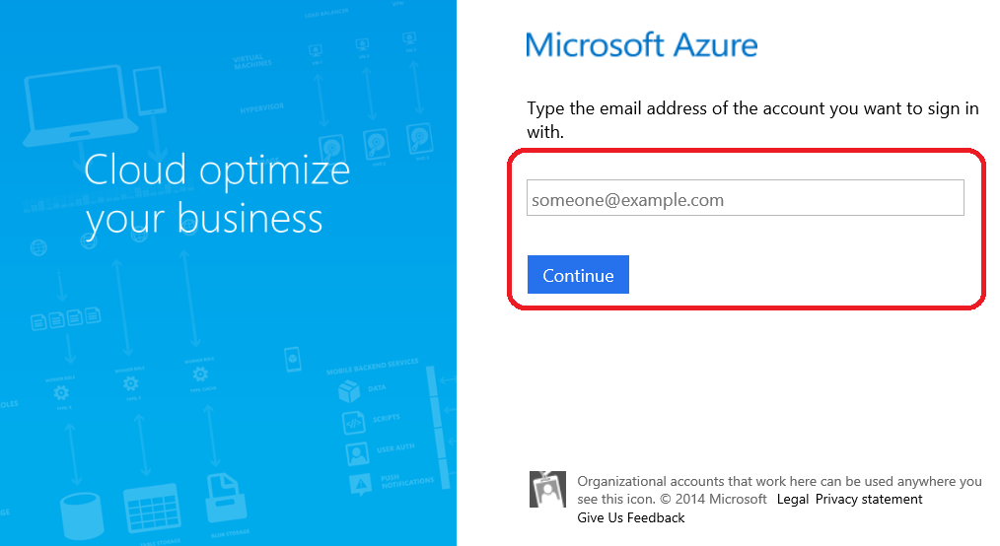
    
    _Microsoft Azure Management Portal_

1. On the main page, click **New** -> **Compute** -> **Virtual Machine** -> **From Gallery** to create a new Virtual Machine on Microsoft Azure.

    
    
    _Create New Virtual Machine From Gallery_

1. On the next page, you will see many different images. Click on **Windows Server 2012 R2** then click on the **Next** arrow at the lower right corner. Please do not use the Windows Server 2012 image.
 
    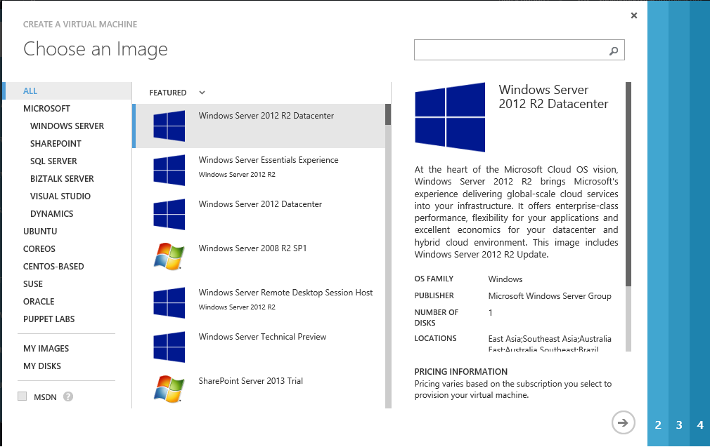    
    
    _Select Windows Server 2012 R2 Datacenter_

1. Select the **Version Release Date**, **Tier** and **Size** first, then set the **Virtual Machine Name**, **New User Name** and **Password**, then click **Next**. It is really **important** that you **write down** the password you have chosen here. 

    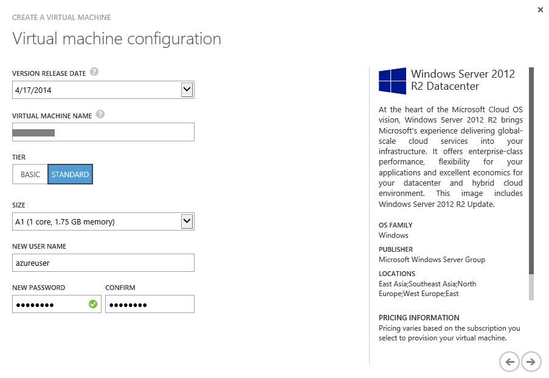
    
    _Set Machine Information_

1. Next, we need to setup the cloud service information. Each virtual machine belongs to one cloud service. You can create a new cloud service or add the virtual machine to an existing cloud service. Here we select *Create a new cloud service* and set the **Cloud Service DNS Name** and set the **Region** to the region closest to where you are. As for the storage account, you can either choose *Use an automatically generated storage account* or select an existing storage account. For the endpoints, the TCP Remote desktop 3389 port and PowerShell 5986 port are added by default. You can add additional ports as needed.

    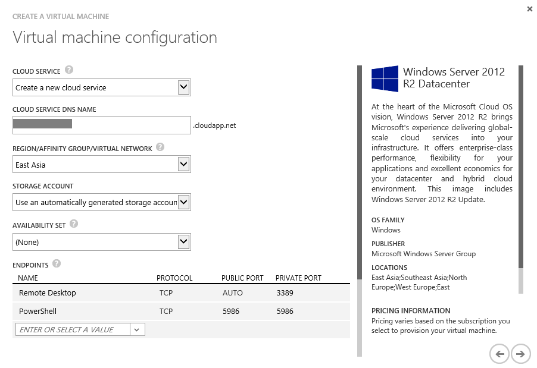
    
    _Set Cloud Service Information_

1. The next page is to setup the virtual machine's different configuration including vm agent, management extensions and security extensions. You can just leave it as default.

    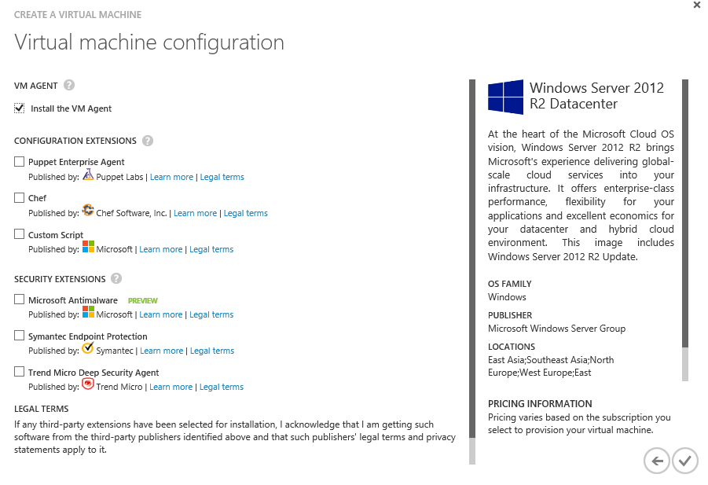
    
    _Set Endpoints_

1. After clicking the **Finish** button on the right corner, Microsoft Azure will create the windows virtual machine for you. Wait a few minutes for the provisioning process, we can access that machine via *Remote Desktop*.

    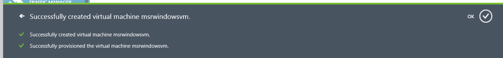
    
    _Successfully Create Windows Virtual Machine_

1. Click the **Connect** button, you will download an rdp file. Open the rdp file on your windows machine and connect to the VM we just created.  If you are using a **Mac computer**, please make sure you have Windows Remote Desktop Version 8 or higher installed from the [App Store.](https://itunes.apple.com/us/app/microsoft-remote-desktop/id715768417?mt=12&v0=WWW-NAUS-ITUHOME-NEWAPPLICATIONS&ign-mpt=uo%3D2) Please also note that you should be using IE 9, Chrome, or Firefox to download the RDP session correctly. 

    
    
    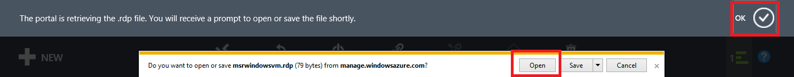
    
    _Connect Windows Virtual Machine_

1. Use the *username* and *password* we set in step 4 and log into the Windows virtual machine remotely.

    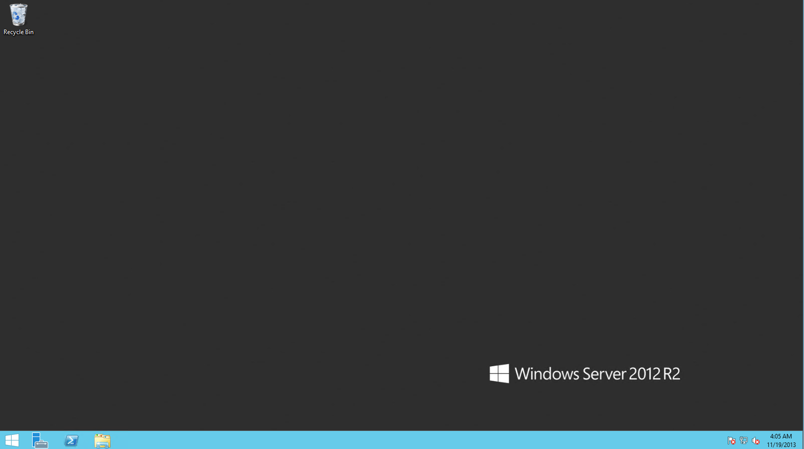
    
    _Remote Desktop Window_

1. Next, let's install R and R Studio on the Windows Machine and run a few examples. First, open **Internet Explorer** on that machine and download the R install package from [R Website](http://www.r-project.org/). Click the [CRAN mirror](http://cran.r-project.org/mirrors.html) link from the Getting Started area, then select the nearest mirror to start your download of [R for Windows](http://cran.rstudio.com/bin/windows/base/old/3.0.2/R-3.0.2-win.exe). (This lab uses R version 3.0.2). Please note that the download is from the internet to your VM in the cloud, you will notice that it is much faster than downloading files to your local machine. VMs sitting in Microsoft Azure typically gives you a much faster interconnect to the rest of the internet than any local machines could achieve. This could potentially speedup your research work.

    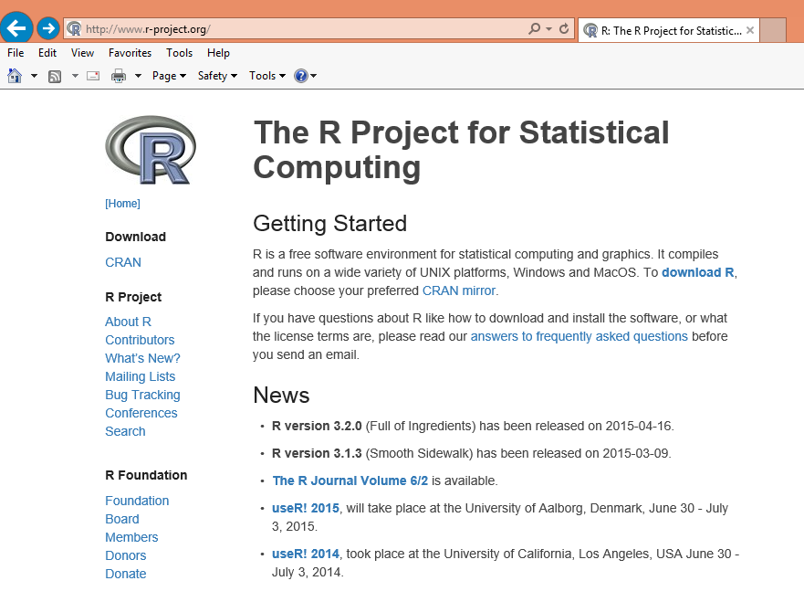
    
    _Download R_

    Note: you might need to disable the **Internet Explorer Enhanced Security Configuration** to avoid adding every website into your security list. In order to disable IES, you can open the **Server Manager**, click **Local Server** -> **IE Enhanced Security Configuration** and set it to Off.
    
    
    _Turn IE Enhanced Security Off_

1. Launch/Run the download R-3.0.2-win.exe and install R. After the installation completes, run RGui which presents an R Console window.
    
    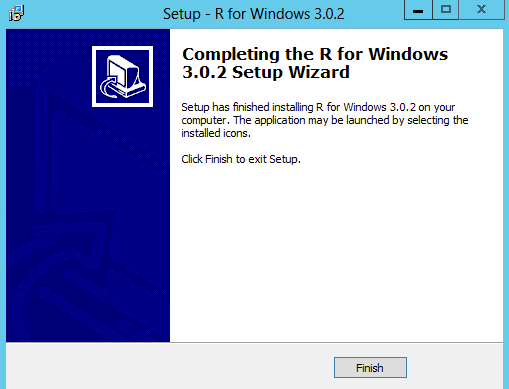
    
    _Install R_
    
    
    
    _Launch R_

1. Use the same steps to install [R Studio](http://download1.rstudio.org/RStudio-0.97.551.exe) and run it.  After installation, you can find R Studio by clicking on the Start Menu and then type in: rstudio to find the program.  Press return to launch R Studio.


    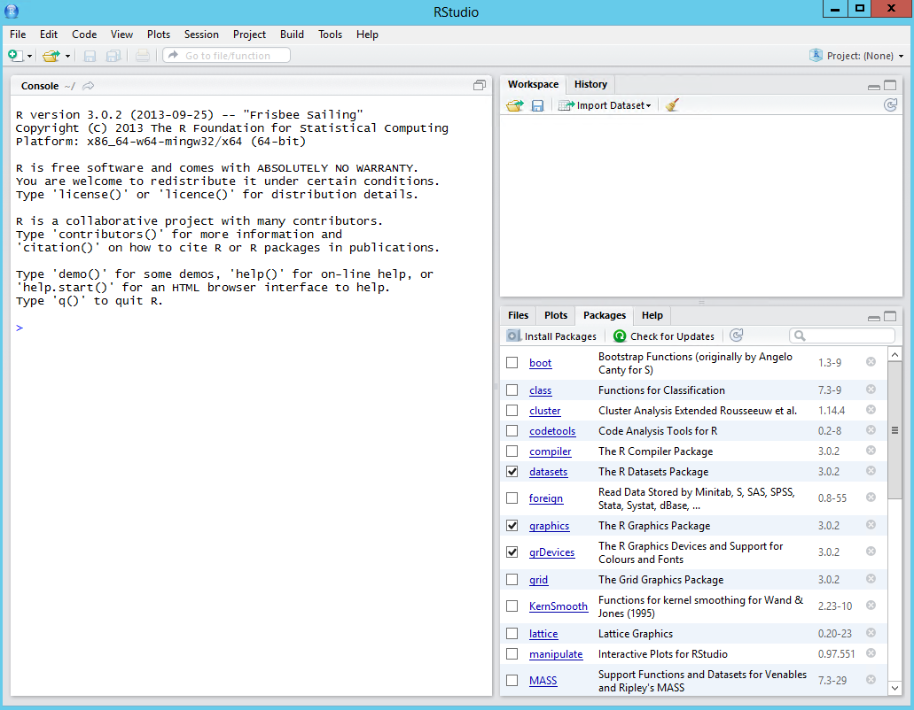
    
    _Launch RStudio_

1. Next, let's execute an R job. First we need to move an R file on the remote machine on Microsoft Azure. You can find an file **acpclust.R** under the folder **Source\Exercise1**. Since Windows Remote Desktop supports Copy/Paste from a local machine to a remote desktop machine, you can use this to get the file onto the Microsoft Azure machine. To do this, right-click the file **acpclust.R**, click **Copy**, then navigate to the Remote Desktop window's desktop and right-click the desktop, click **Paste**. After a few seconds, you will find the file is copied to the remote machine's desktop.
 
    Note: If you are using a **Mac Computer**, or Linux machine, please create a new text file on the remote machine and paste the content text of the file into notepad or equivalent. You may have to rename the file from acpclust.R.txt to acpclust.R. Simply open a command prompt (start menu, type cmd.exe, enter) and run:  rename acpclust.R.txt acpclust.R
 
    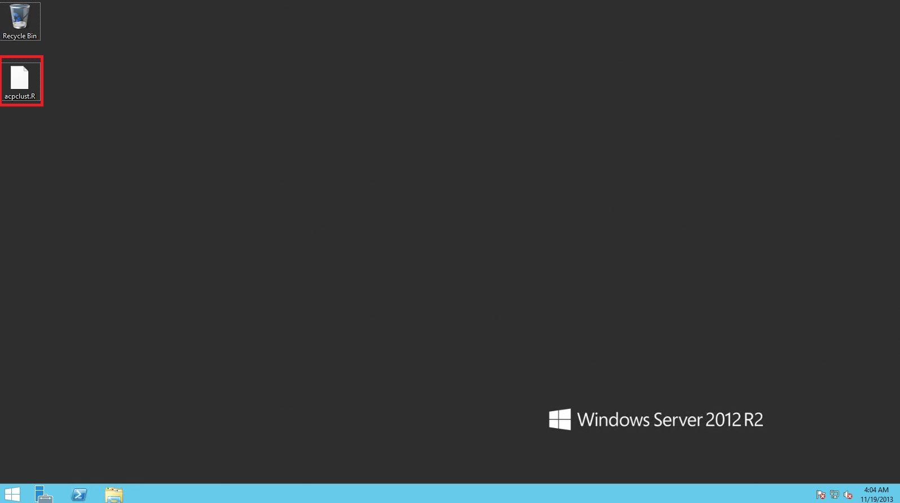

    _Copy File to Remote Desktop_
    
1. To run the **acpclust.R** file, we have to install some additional packages of R. In the RStudio's right corner panel, click **Packages** tab, and click **Install Packages** button.

    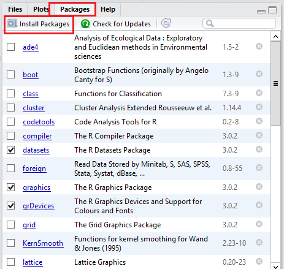
    
    _Install R Packages_

1. In the **Install Packages** form, input the following command into the Packages line:

    ````
    ade4, RColorBrewer pixmap
    ````
 click **Install** to begin download and installation.

    

    _Set R Packages_

1. Click Menu **File** -> **Open File** and select the **acpclust.R** file on the desktop to open the file in RStudio.

    

    _Open an R File_

1. Click the menu **Code** -> **Run Region** -> **Run All**. RStudio will execute the R code and generate the result on the right bottom corner.

    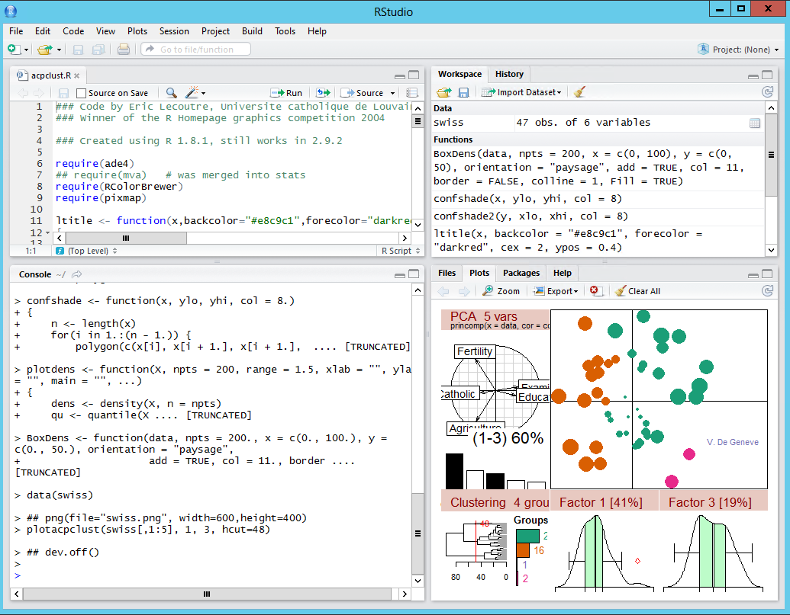

    _Run R File_

In this exercise, we created a Windows Server 2012 R2 virtual machine (VM) on Microsoft Azure, installed R and R studio on that machine. Then we copied a local file to the remote machine used that file as input for running an R job on our VM.

<a name="#Exercise2"></a>
## Exercise 2: Create a machine from VM Depot and run IPython examples. ##

[VM Depot](https://vmdepot.msopentech.com) is a community-driven catalog of user contributed images containing operating systems, applications, and development environments captured in a virtual disk image that can easily be deployed on Microsoft Azure. In this exercise, we will create another virtual machine, but this time we will use a Linux image from VM Depot. We will also run some IPython examples on that machine.

1. First we need to copy a community image from VM Depot. In the Microsoft Azure Management Portal, navigate to **Virtual Machines**, and click **Image** tab. Then you can click **Browse VM Depot**. Please note that VM depot is accessible via the **Images** Tab only.

    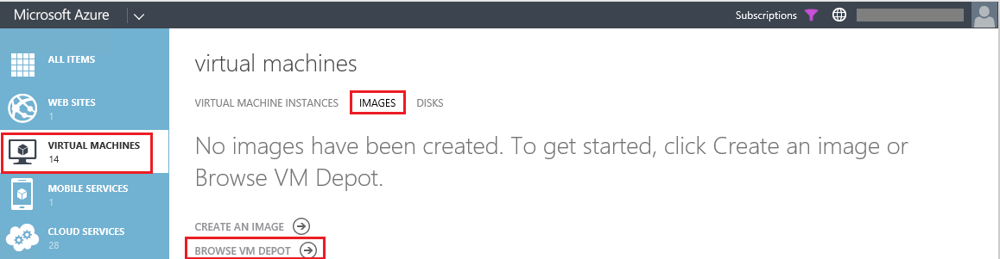

    _Virtual Machine Image_

1. On the Browse VM Depot page, click **Ubuntu**, then scroll down to select **Azure Data Analysis** image, then click Next. 

    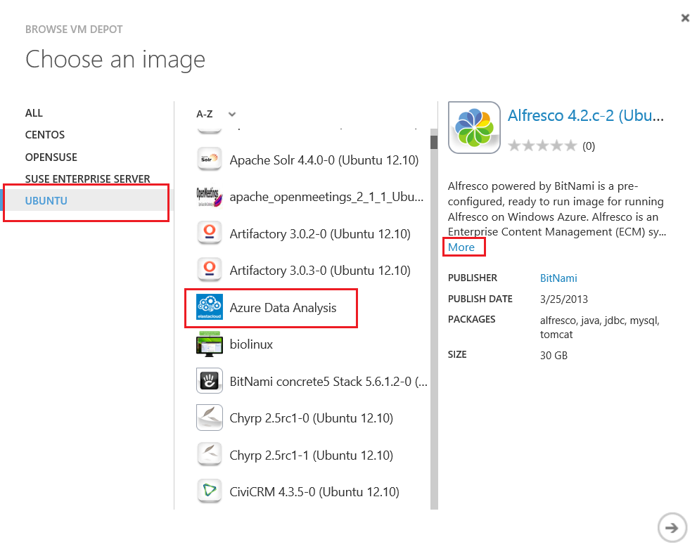

    _Azure Data Analysis Image_
    
    >Notes:If you wouldl like to understand more information about the image, we can click **More** link on the right and check more details of the image.
    >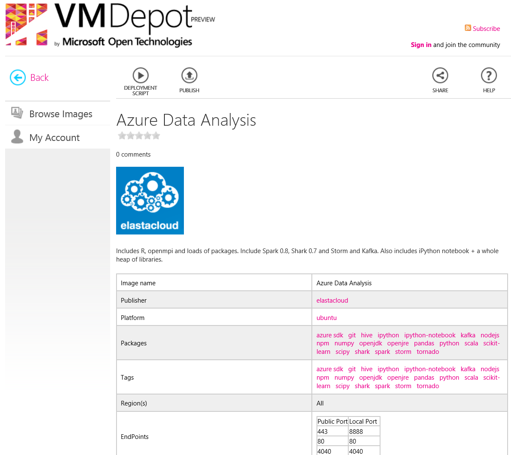

    _Azure Data Analysis Image Details_


1. In the **Choose a storage account** page, we can set the **Image Region** and **Storage Account in image region**. You can also create a new storage account or choose an existing one. You should make sure you store it in the same region that you will be creating your virtual machines.

    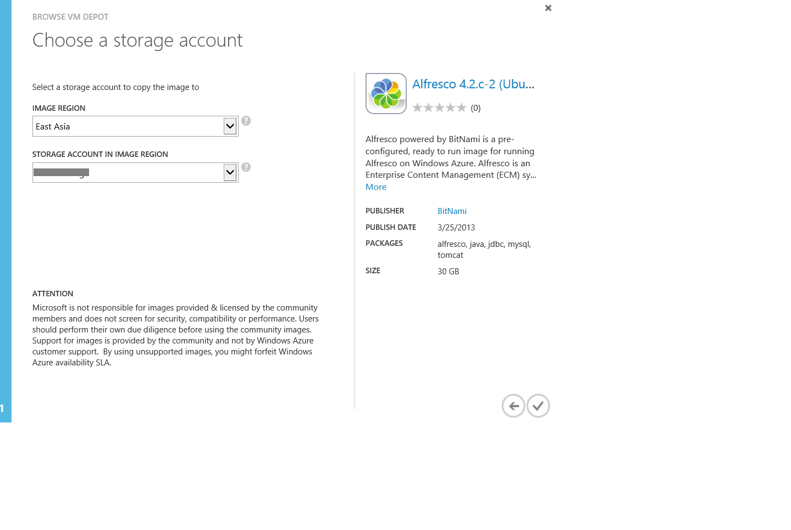

    _Set Image Storage Account_

1. Then Microsoft Azure will begin to copy the image from VM Deport to your storage account. It may take 15-30 minutes to finish. Once it completes, you will see the image is inside the image tab.

    

    _Copy Image from VM Depot_

1. You will also need to register the image before you can create a new virtual machine from it. Click the Register button on the bottom and set the **Name** and **VHD URL** for the image.

    

    _Register Image_

The image registration process is fast, but make sure to wait until it completes before starting the next step.

1. Next, we will create a new virtual machine from the image we just copied from VM Depot and registered. Click **New** -> **Compute** -> **Virtual Machine** -> **From Gallery** to locate our new image. This time we choose **My Image** and you will see an image called *Azure-Data-Analysis* there.

    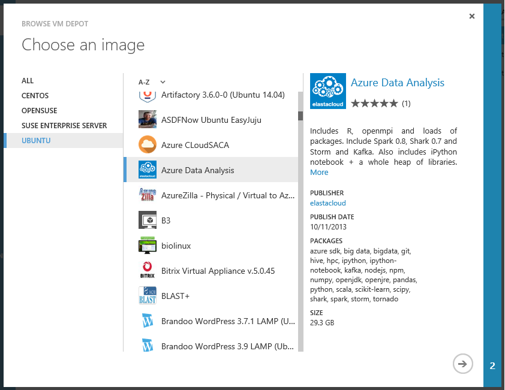

    _Create VM from My Images_

1. Select the image and click *Next*, we will go through similar steps as in [Exercise 1](#Exercise1) to setup machine's information. Since it is a Linux machine, the information we need to enter is a little different. On the first page, we set **Virtual Machine Name**, **Size**, **User Name** just the same. We can either upload an SSH key or just provide a password for the user. Again, **write down** your password before proceeding.

    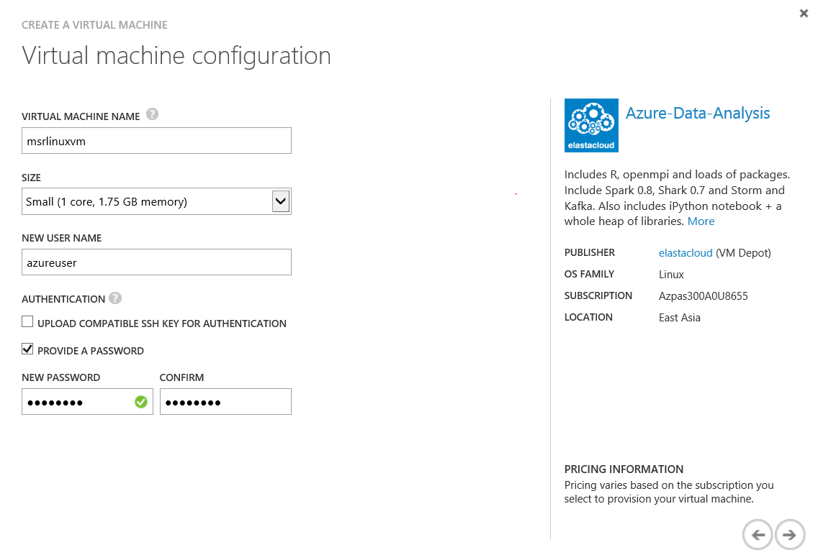

    _Set Linux Machine Information_

1. Now, setup the cloud service information, as a reminder a cloud service is simply a container for your VMs and their settings.

    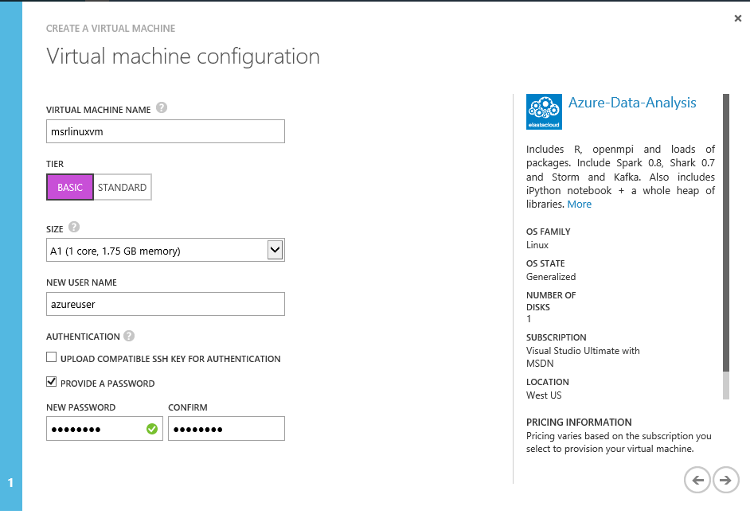

    _Set Linux Cloud Service Information_

1. **We will also need to setup the endpoints information. According to the image description, we will know that the image's publisher, platform, packages and the required endpoints. Add public port 443 mapped from the VM's private port 8888 and then do a same port mapping for port 22 (ssh), 80 (web), and 4040 (SHARK).**
    
    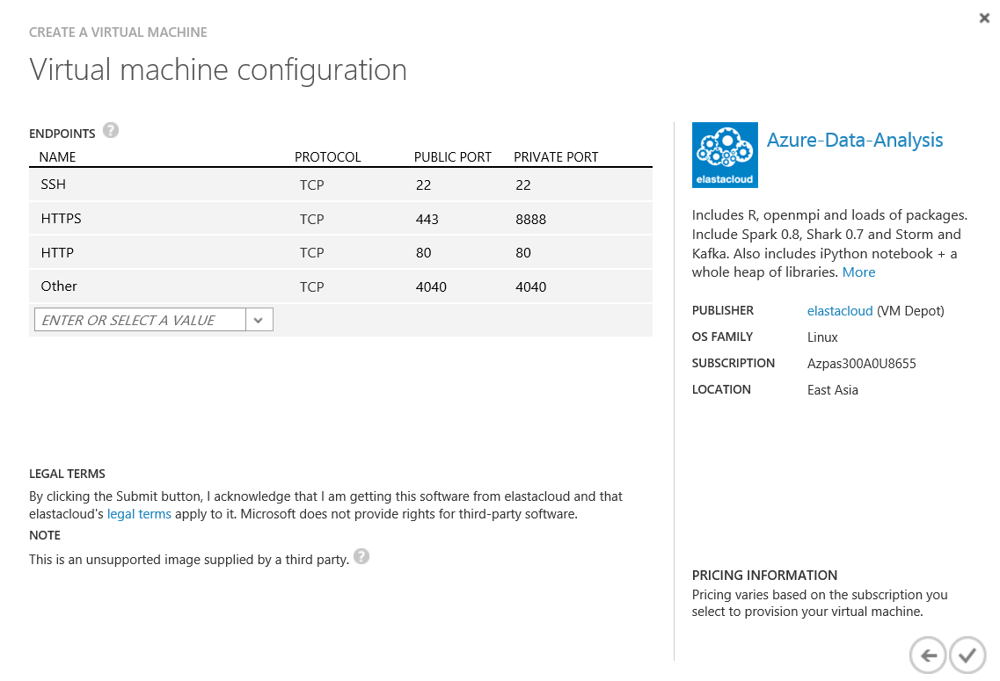

    _Configure Linux Endpoints_

1. After several minutes, the Linux virtual machine will be created too. This time we will use [PuTTY](http://www.chiark.greenend.org.uk/~sgtatham/putty/download.html), a SSH client to connect the that machine. Input the **DNS Name** of the Linux machine into the Host Name, click **OK** to connect.


1. Input the username and password, then you will see the welcome screen from that machine upon successful log in.
    
    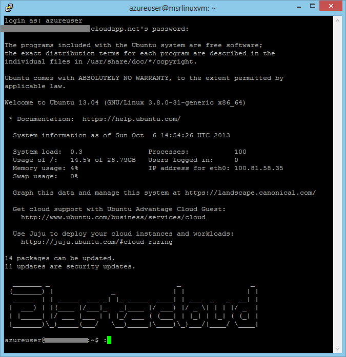

    _Login_

The machine has already installed a lot of useful packages including [IPython](http://ipython.org/), STORM or SPARK/SHARK. We will only use the IPython Notebook on that machine to run a very simple algorithm. First we need to configure IPython as a notebook configuration.

## Configure IPython Notebook ##

1. Now you can start IPython Notebook. You should see that the server has started:

    <pre>
    sudo ipython notebook --profile=nbserver
    </pre>
    
    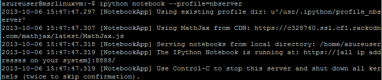

    _Start IPython Notebook_

1. Navigate your browser (from your own machine, not the VM) to https://\<vm-name>.cloudapp.net. Make sure that you use https and not http. You will see a warning that the certificate is not signed. Since this is your own certificate, you can safely ignore this warning. After ignoring it, you should see the login screen:

    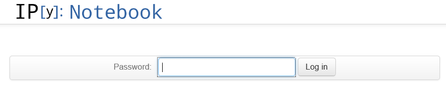

    **IPython Notebook Main Page**

   
    **Note: If you have trouble reaching the IPython Notebook URL, check the following:**
         Ensure you typed the _sudo ipython notebook --profile=nbserver_ command correctly
         Ensure you are using https (not http)
         Ensure you are accessing the correct URL (double-check the cloud service name from the Microsoft Azure Portal)
    

1. Login with the password. The default password is **Elastacloud123**.

    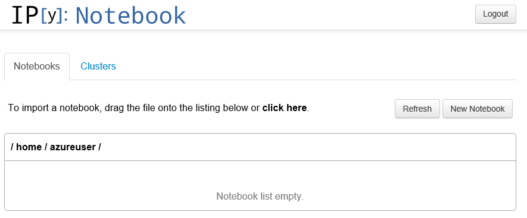

    _IPython Notebook Main Page_

1.  **Optional: Change Password** If you want to configure your own password, you can follow the following steps.
 Execute the following command:

     <pre>python -c "import IPython;print IPython.lib.passwd()" 
     </pre>

     

     _Create IPython Password_


1. **Optional Change Password continued:** Then we use nano to edit the configuration and update *c.NotebookApp.password*. Since the file is read only, we can still modify it if we run _nano_ through _sudo_. With ctrl+X, you can save the file. You have to press “Y” to confirm the save operation and then press enter.

     <pre>
     sudo nano /usr/.ipython/profile_nbserver/ipython_notebook_config.py
     </pre>
    
     

     _Modify Password Configuration_

## Clustering Example with Pandas and Scikit-learn ##

The following example (cluster-titanic.py) clusters passengers of the titanic based on several attributes. It is taken from [www.kaggle.com](http://www.kaggle.com) and has been pre-processed with Excel and then exported in CSV format.

The script will result in an output as:


_Clustering Example Sample_

1. Click **New Notebook** to create a new IPython notebook.

    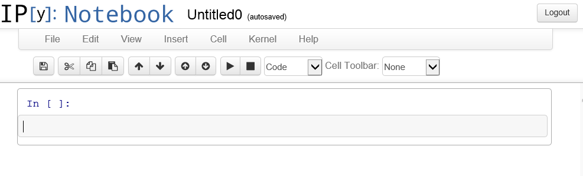
    
    _Clustering New Notebook_

1. In the beginning, the script defines the azure credentials as well as the desired number of clusters for the algorithm to find. The data is loaded from internet and stored in titanic_data.csv. We just upload the csv file to a public Microsoft Azure storage account and download it by HTTPs directly.
    <pre>
    from sklearn.cluster import KMeans
    import urllib
    import numpy as np
    import pandas 
    import matplotlib
    import matplotlib.pyplot as plt
    import matplotlib.cm as cm
        
    from sklearn.manifold import MDS
    NUM_CLUSTERS = 16
    ####################################
    # download titanic csv data from github
    f = urllib.urlopen("http://wrfstorage2.blob.core.windows.net/trainingkit/titanic-data.csv") # YOU MIGHT NEED TO CHANGE THE URL
    titanic_csv = f.read()
    with open("titanic.csv", "w") as tmp:
        tmp.write(titanic_csv)
    </pre>

1. In the next step, the data set is loaded with pandas. Pandas is a data analysis library that makes working with data tables such as CSV data easy. As the “names” and “survived” groups are not needed for the clustering, they are removed from the data frame:

    <pre>
    # Load data as pandas dataframe
    data = pandas.io.parsers.read_csv('titanic.csv', sep=";") 
    # Remove name and survived dimension to learn
    names = data.pop('name')
    survived = data.pop('survived')
    </pre>
    
1. In the next code segment, the KMeans clustering operation is initialized, the algorithm is trained and the results (labels for each data set, cluster centers and the set of labels used) are stored in the appropriate variables:

    <pre>
    # CLUSTERING
    # Create KMeans
    kmeans = KMeans(n_clusters=NUM_CLUSTERS, init='k-means++', n_init=10, max_iter=300, tol=0.0001, precompute_distances=True, verbose=0, random_state=None, copy_x=True, n_jobs=1)
    # Train KMeans
    kmeans.fit(data)
    # Get the results
    kmeans_labels = kmeans.labels_
    kmeans_cluster_centers = kmeans.cluster_centers_
    kmeans_labels_unique = np.unique(kmeans_labels)
    </pre>

1. After clustering the data, the multi-dimensional data is reduced to two dimensions for plotting:

    <pre>
    # PLOT PREPARATION
    # Reduce to two dimensions for plotting
    mds = MDS(n_components=2)
    mds.fit(data)
    scaled_coordinates = mds.embedding_
    # PLOT ON TWO DIMENSIONS
    labelled_data_x = (dict(), dict())
    labelled_data_y = (dict(), dict())
    for label in kmeans_labels_unique:
        labelled_data_x[0][label] = []
        labelled_data_y[0][label] = []
        labelled_data_x[1][label] = []
        labelled_data_y[1][label] = []
    for i in range(0, len(names)):
        label = kmeans_labels[i]
        labelled_data_x[survived[i]][label].append(scaled_coordinates[i][0])
        labelled_data_y[survived[i]][label].append(scaled_coordinates[i][1])
    </pre>

1. The script prepares the data in order to be plotted in multiple colors (depending on their cluster) as well as the status of whether the passenger has survived or not. Surviving passengers and those who did not survive are assigned different markers and, in the end, the plot is shown:


    <pre>
    # PLOTTING
    colors = cm.rainbow(np.linspace(0, 1, NUM_CLUSTERS)) 
    markers = ['x', '^']
    for i in kmeans_labels_unique: 
        for j in [0, 1]:
            plt.scatter(labelled_data_x[j][i], labelled_data_y[j][i], color=colors[i], marker=markers[j], s=40)
    plt.show()
    </pre>
1. The result will show:
    
    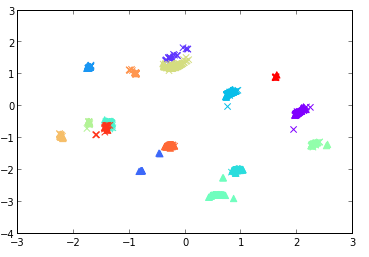
    
    _Clustering Result_

The full source code can be found in **Source\Exercise2\clustering_sample.py**. If you are having issues, simply copy and paste the content of the source code into IPython notebook and click on the Run (play) button on the menu bar.

<a name="#Exercise3"></a>
## Exercise 3: Create a new disk and mount the disk to Windows and Linux. ##

This exercise will show you how to attach new disks to both Linux and Windows virtual machines.

### Attach Empty Disk to Windows ###

1. You can attach a data disk to a virtual machine to store application data. A data disk is a Virtual Hard Disk (VHD) that you can create either locally with your own computer or in the cloud with Microsoft Azure. You manage data disks in the virtual machine the same way you do on a server in your office. 

    Go to the Azure management portal at https://manage.windowsazure.com, select “Virtual Machines” from the bar on the left, click on the VM you want to add the disk to and then go to “Dashboard” at the top bar. In the bar at the bottom, select “Attach” and then “Attach Empty Disk”:

    
    
    _Attach Empty Disk_

1. A wizard will open asking you to configure the empty disk. Select a storage location, the file name and the size in GB. In addition, you can choose among the following caching modes:

    - Read Only: Reads and writes are cached for future reads but writes are persisted directly to storage
    - Read/Write: Reads and writes are cached for future reads. Non-write-through writes are persisted to the local cache first, then lazily flushed to the Microsoft Azure Blob service. For SQL Server, writes are always persisted to Microsoft Azure Storage because it uses write-through.
    - None (disabled): Requests bypass the cache completely.

    The best option to use depends on your intended usage. Read/Write offers the best performance in general, but depending on the type of service you want to use (SQL Server, Apache Cassandra), caching might be counter-productive.

    In this example, select Read/Write. You can change this setting later if desired:

    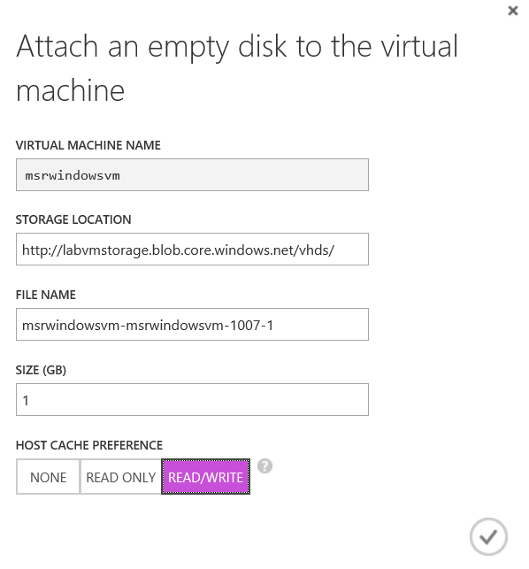
    
    _Set Disk Property_

1. The operation might take a moments. After that, you should see your disk attached on the VM Dashboard in the portal (note that the disk count might need a reload to update):

    
    
    _Attached New Disk_

1. Then we use Remote Desktop to connect to the machine. Start **Server Manager** from the taskbar. Click *File and Storage Services* on the left panel.

    
    
    _Server Manager_

1. Click **Disks** and locate the new virtual disk.

    
    
    _Find New Disk_    

1. Right click the disk and click **Initialize**. A warning will popup. You can safely ignore it as this disk is empty.
    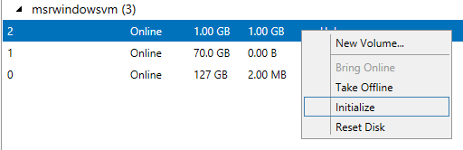

    

    _Initialize_    

1. The initialization process should finish rather quickly. Afterwards, right click on the now initialized disk and select “New volume”:

    


1. A wizard will start. Skip the first section “Before you begin”. On the second screen, make sure that your new disk is select and click on “Next”:
    
    
    
1. On the next page, you can define the size of the volume. The maximum size is selected as default:
    
    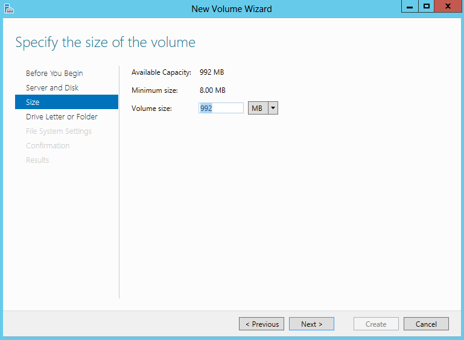

1. On the next screen, you can assign a drive letter for the new volume, or you can mount it in a particular folder. Choose a drive letter and select “Next”:
    
    

1. On the next screen, you can select the file system and name the new volume:
    
    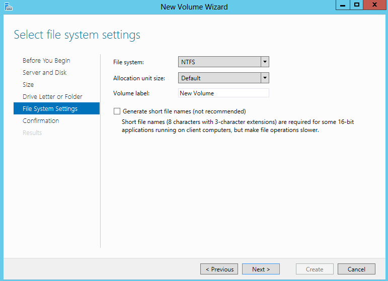

1. Confirm your selection on the Confirmation screen, then select “Create”. The new volume will be created and mounted:
    
    

1. Click on **Close**. If you select your new disk again, you should see the new volume in the “Volumes” window:

    

### Attach Empty Disk to Linux ###

For linux, the steps to add empty disk is exactly the same. The different is the operation on Linux. After redoing step 1 to step 3, use PuTTY to connect to the linux machine. 

1. First we run the following command to find new disk:

    <pre>
    ls /dev/sd*
    </pre>
    This shows you all the disks attached to the virtual machine. The new disk is attached at /dev/sdc by default:

    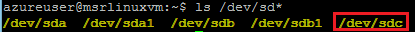

1. You can also check the mounted disks with the command:

    <pre>
    df -h
    </pre>
    You will see that /dev/sdc is not yet mounted as it is not present in the listing:

    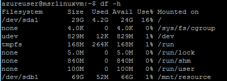

1. You need to format the disk to use it. Execute the following command:

    
    sudo fdisk /dev/<device>
    

    In our example:

    <pre>
    sudo fdisk /dev/sdc
    </pre>

    When prompted, first enter “n” (new partition), then “p” (primary partition). You can leave the rest of the values at default. This will create a partition over the whole disk. At the end, enter “w” to write the changes to disk:

    

1. Now list the devices again:

    <pre>
    ls /dev/sd*
    </pre>

    You should see that a new directory “/dev/sdc1” was added. This directory represents the newly created partition 1 on disk sdc:

    

1. Next, you need to create a file system. In this example, you will use “ext4” as filesystem:

    <pre>
    sudo mkfs -t ext4 /dev/sdc1
    </pre>

    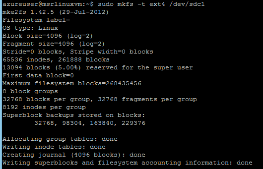

1. In the last step, you need to mount the disk. On Linux system, disks are mounted into a directory of your choice, meaning that everything in this directory or in its sub directories are stored on the particular disk/partition.

    A common location to mount disks is to use a subdirectory of “/mnt”. For this example, create the directory “/mnt/data” as place to store the data:

    <pre>
    sudo mkdir /mnt/data
    </pre>

1. Mount Disk (Temporarily)

    You can mount the disk with the following command:

    <pre>
    sudo mount /dev/sdc1 /mnt/data 
    </pre>

    This will mount the device /dev/sdc1 to /mnt/data. Using the command:
    
    <pre>
    df -h
    </pre>

    again, you should see the mounted disk:

    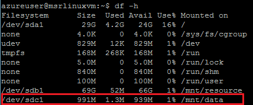

    If you view the files on the disk, you will see only a single folder added by default, lost+found. 

    <pre>
    ls /mnt/data
    </pre>

    This mounting approach has one drawback: If you reboot the virtual machine, you have to manually mount the disk again. In the next step, you will make the mount configuration persistent.

1. If you want to mount disk persistently, you need to mount the disk in fstab.

    Unmount the disk you mounted in the previous step:

    <pre>
    sudo umount /mnt/data
    </pre>
    
    Next, you need to open an editor to edit /etc/fstab, the file which holds the partitions to mount during startup:

    <pre>
    sudo nano /etc/fstab
    </pre>
    
    The format in /etc/fstab is:

    <pre>
    [Device] [Mount Point] [File System Type] [Options] [Dump] [Pass]
    </pre>

    Paste the following configuration into a new line in the editor:
    
    <pre>
    /dev/sdc1 /mnt/data ext4 defaults 0 0
    </pre>

    Then press ctrl+x to exit. Confirm saving with “y” and then enter.

    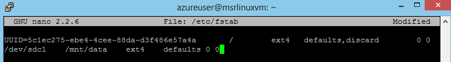

    Now you should try to mount the disks in fstab. This can be done with:

    <pre>
    sudo mount -a
    </pre>

    There should be no output if successful. Again, you can check the new partition using:

    <pre>
    df -h
    </pre>


    


<a name="summary"></a>
## Summary ##

By completing this hands-on lab you learned the following:

- Create a machine with Windows Server 2012 R2 and run R job.
- Create a machine from VMDepot and run ipython job.
- Create a new disk and mount the disk to Windows and Linux.

Copyright 2013 Microsoft Corporation. All rights reserved. 
Except where otherwise noted, these materials are licensed under the terms of the Apache License, Version 2.0. You may use it according to the license as is most appropriate for your project on a case-by-case basis. The terms of this license can be found in [http://www.apache.org/licenses/LICENSE-2.0](http://www.apache.org/licenses/LICENSE-2.0).
