<a name="HOLTitle"></a>
# Using Windows Azure Virtual Machines #

---

<a name="Overview"></a>
## Overview ##

In this hands-on lab you create a Windows Virtual Machine. You can install software you need on that machine and run some tasks. Windows Azure also provide VMDepot where you can find a lot of community images which you can use directly. You can also add more disks to your machine for your storage and copy your local file to your machines on Windows Azure.

<a name="Objectives"></a>
### Objectives ###

In this hands-on lab, you will learn how to:

- Create a machine with Windows Server 2012 and run R job.
- Create a machine from VMDepot and run ipython job.
- Create a new disk and mount the disk to Windows and Linux.

<a name="Prerequisites"></a>
### Prerequisites ###

The following is required to complete this hands-on lab:

- A Windows Azure subscription - [sign up for a free trial](http://aka.ms/WATK-FreeTrial)
- If you are a Mac Computer user, please install Windows Remote desktop 8.0 from the  [App Store.](https://itunes.apple.com/us/app/microsoft-remote-desktop/id715768417?mt=12&v0=WWW-NAUS-ITUHOME-NEWAPPLICATIONS&ign-mpt=uo%3D2)

---
<a name="Exercises"></a>
## Exercises ##

This hands-on lab includes the following exercises:

1. [Exercise 1: Create a machine with Windows Server 2012 and run R job.](#Exercise1)
1. [Exercise 2: Create a machine from VMDepot and run ipython job.](#Exercise2)
1. [Exercise 3: Create a new disk and mount the disk to Windows and Linux.](#Exercise3)

Estimated time to complete this lab: **60** minutes.

<a name="#Exercise1"></a>
## Exercise 1: Create a machine with Windows Server 2012 and run R job. ##

1. You need to login to [Windows Azure Management Portal]（http://manage.windowsazure.com） to get start.

	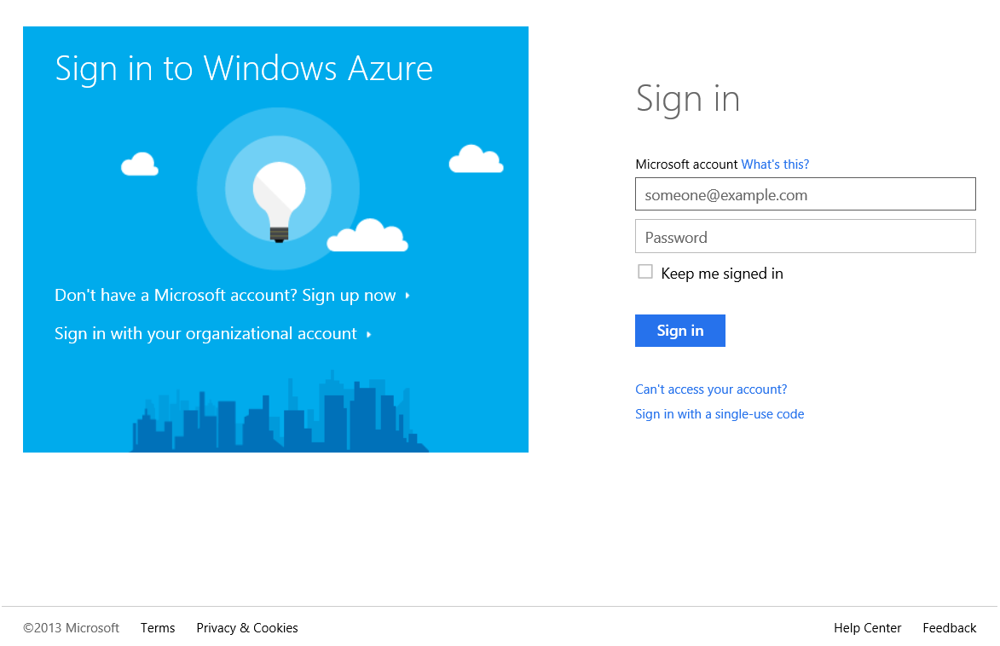
	
	_Windows Azure Management Portal_

1. On the main page, click **New** -> **Compute** -> **Virtual Machine** -> **From Gallery** to create a new Virtual Machine on Windows Azure.

	
	
	_Create New Virtual Machine From Gallery_

1. On the next page, you will see many different images. We just click **Windows Server 2012 Datacenter**, then click the **Next** button on the right corner.
 
	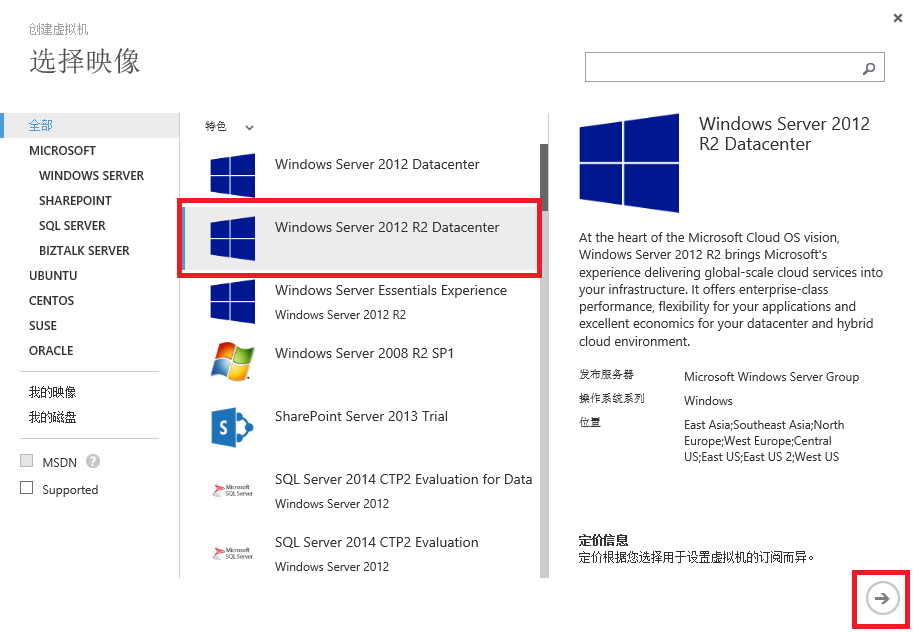	
	
	_Select Windows Server 2012 Datacenter_

1. Select the **Version Release Date** and **Size** and set the **Virtual Machine Name**, **New User Name** and **Password**, then click **Next**.

	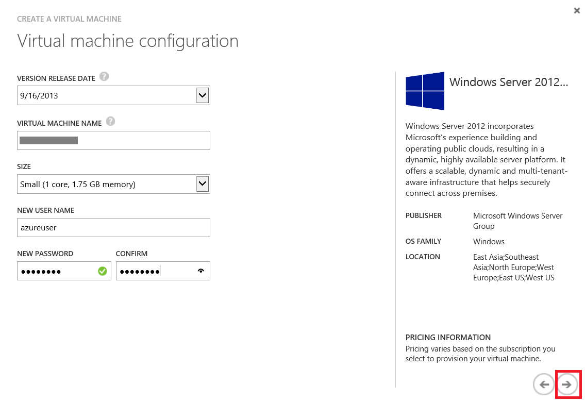
	
	_Set Machine Information_

1. Next we need to setup the cloud service information. Each virtual machine belongs to one cloud service. You can create a new cloud service or add the vm to an existing cloud service. Here we select *Create a new cloud service* and set the **Cloud Service DNS Name** and set the **Region** to *East Asia*. As for the storage account, you can either choose *Use an automatically generated storage account* or select an existing storage account.

	> Note: Since the training subscription only has 1 storage account, so make sure you select the existing one.

	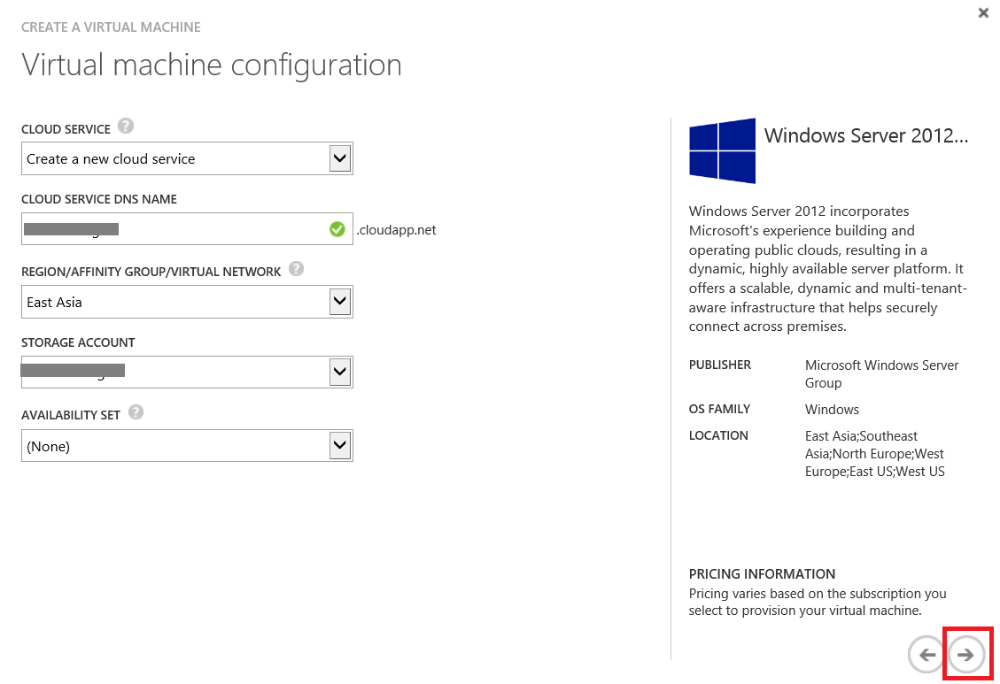
	
	_Set Cloud Service Information_

1. The next page is to setup the virtual machine' endpoint. The TCP 3389 and PowerShell 5986 port are added by default. You can also add your customized ports.

	
	
	_Set Endpoints_

1. After click the **Finish** button on the right corner, Windows Azure will create the windows virtual machine for you. Wait for about 10 minutes, we can access that machine by *Remote Desktop*.

	
	
	_Successfully Create Windows Virtual Machine_

1. Click the **Connect** button, you will download an rdp file. Open the rdp file on your windows machine and connect to the vm on Windows Azure we just created.  If you are using a **Mac computer**, please make sure you have Windows Remote Desktop Version 8 or higher installed from the [App Store.](https://itunes.apple.com/us/app/microsoft-remote-desktop/id715768417?mt=12&v0=WWW-NAUS-ITUHOME-NEWAPPLICATIONS&ign-mpt=uo%3D2)

	
	
	
	
	_Connect Windows Virtual Machine_

1. Just use the *username* and *password* we set in step 4 and login Windows machine remotely.

	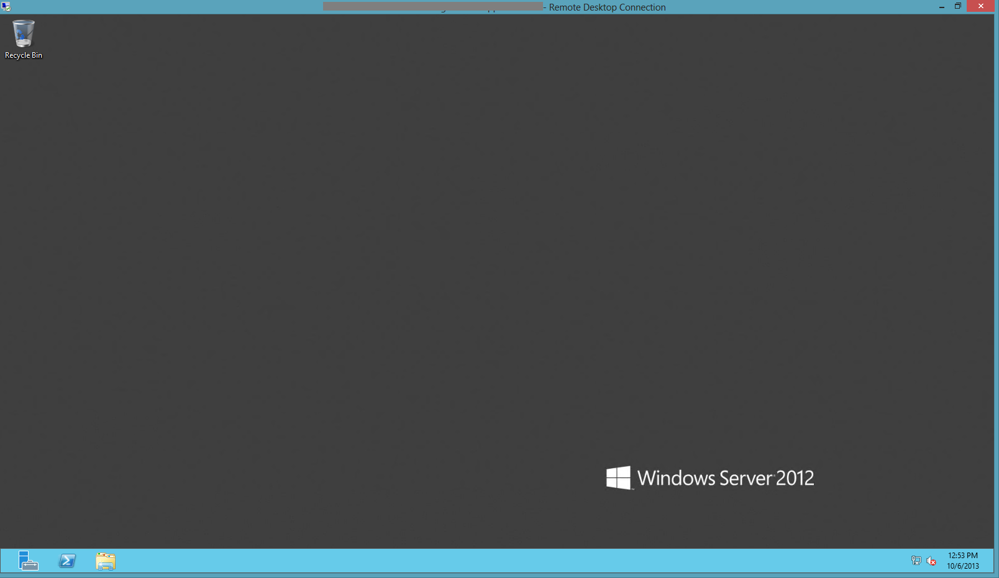
	
	_Remote Desktop Window_

1. Next we can install R Studio on the Windows Machine and execute some tasks. First we open **Internet Explorer** on that machine and download the R install package from [R Website](http://www.r-project.org/). Click the [CRAN mirror](http://cran.r-project.org/mirrors.html) link from the Getting Started area, then select the nearest mirror to start your download of [R for Windows](http://cran.rstudio.com/bin/windows/base/R-3.0.2-win.exe).

	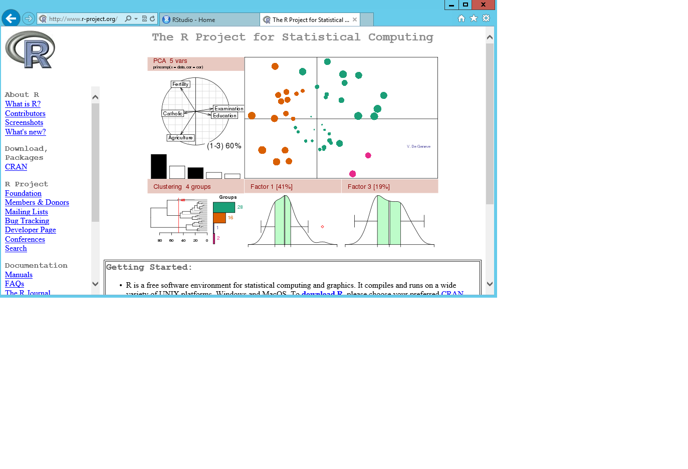
	
	_Download R_

	>Note:You might need to disable the **Internet Explorer Enhanced Security Configuration** to avoid adding every website into your security list. In order to disable IES, you can open the **Server Manager**, click **Local Server** -> **IE Enhanced Security Configuration** and set it to Off.
	>
	>
	>_Turn IE Enhanced Security Off_

1. Launch the downloade R-3.0.2-win.exe and install R. After the install completes, we can launch RGui which presents an R Console window.
	
	
	
	_Install R_
	
	
	
	_Launch R_

1. Then we can do the simliar steps to install [R Studio](http://download1.rstudio.org/RStudio-0.97.551.exe) and launch it.


	
	
	_Launch RStudio_

1. Next let's execute an R job. First we need an R file on the remote machine on Windows Azure. You can find an file **acpclust.R** under the folder **Source\Exercise1**. Since Windows Remote Desktop supports Copy/Paste from a local machine to a remote desktop machine, you can use this to get the file onto the Windows Azure machine. To do this, right-click the file **acpclust.R**, click **Copy**, then navigate to the Remote Desktop window's desktop and right-click the desktop, click **Paste**. After several seconds, you will find the file is copied to the remote machine's desktop.

	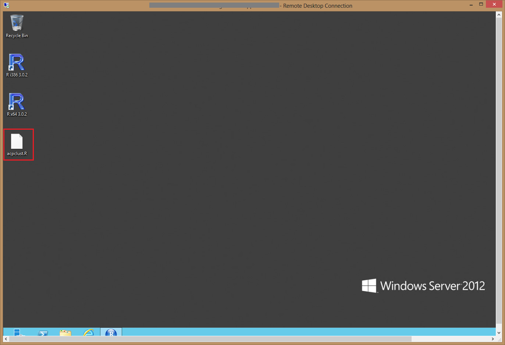
	
	_Copy File to Remote Desktop_
	
	> If you you are using MacOS, please open the R file and copy the text content, then create a file with the same name and use notepad to paste the content

1. To run the **acpclust.R** file, we have to install some packages to R. In the RStudio's right corner panel, click **Packages** tab, and click **Install Packages** button.

	
	
	_Install R Packages_

1. In the **Install Packages** form, input following command into the Packages:

	````
	ade4, RColorBrewer pixmap
	````
and click **Install** to begin download and installation.

	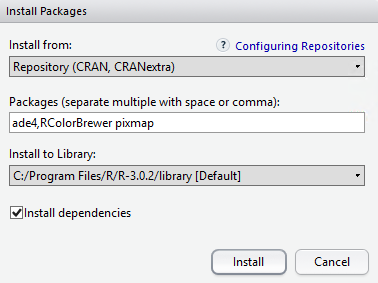

	_Set R Packages_

1. Click Menu **File** -> **Open File** and select the **acpclust.R** file on the desktop. You will see the file is opened in RStudio.

	

	_Open an R File_

1. Click the menu **Code** -> **Run Region** -> **Run All**. RStudio will execute the R code for you and generate the result on the right bottom corner.

	

	_Run R File_

In this exercise, we created a Windows Server 2012 virtual machine (VM) on Windows Azure, installed R and R studio on that machine. Then we copied a local file to the remote machine used that file as input for running an R job on our VM.

<a name="#Exercise2"></a>
## Exercise 2: Create a machine from VM Depot and run ipython job. ##

[VM Depot](https://vmdepot.msopentech.com) is a community-driven catalog of preconfigured operating systems, applications, and development stacks that can easily be deployed on Windows Azure. In this exercise, we will create another virtual machine, but this time we will use an image from VM Depot. We will also run some IPython jobs on that machine.

1. First we need to copy a community image from VM Depot. In the Windows Azure Management Portal, navigate to **Virtual Machines**, and click **Image** tab. Then you can click **Browse VM Depot**.

	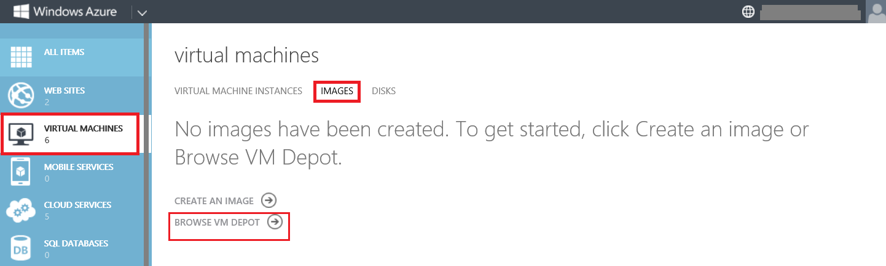

	_Virtual Machine Image_

1. In Browse VM Depot page, click **Ubuntu**, then scroll down to select **Azure Data Analysis** image, then click Next. 

	

	_Azure Data Analysis Image_
	
	>Notes:In order to understand more information about the image, we can click **More** link on the right and check more details of the image.
	>

	_Azure Data Analysis Image Details_


1. In the **Choose a storage account** page, we can set the **Image Region** and **Storage Account in image region**. You can also create a new storage account or choose an existing one.

	

	_Set Image Storage Account_

1. Then Windows Azure will begin to copy the image from VM Deport to your storage account. It takes a couple of minutes to finish. Once it completes, you will see the image is inside the image tab.

	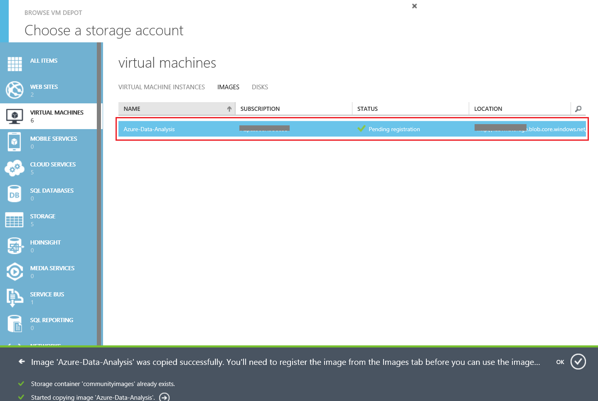

	_Copy Image from VM Depot_

1. You also need to register the image before you can create a new virtual machine from it. Click the Register button on the bottom and set the **Name** and **VHD URL** for the image.

	

	_Register Image_

Image registration is fast, but be sure to wait until it completes before beginning the next step.

1. Next we create a new virtual machine from the image we just copied from VM Depot and registered. Click **New** -> **Compute** -> **Virtual Machine** -> **From Gallery** to create a new Virtual Machine. This time we choose **My Image** and you will see an image called *Azure-Data-Analysis* there.

	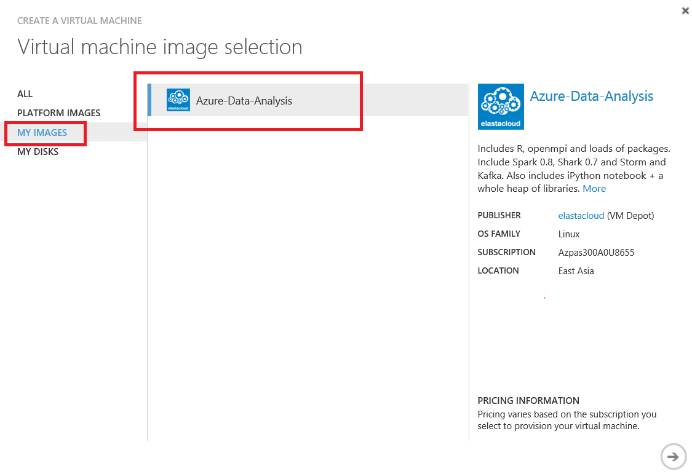

	_Create VM from My Images_

1. Select the image and click *Next*, we will almost do the same steps as [Exercise 1](#Exercise1) to setup machine's information. Since it is a Linux machine, the information is a little different. On the first page, we should set **Virtual Machine Name**, **Size**, **User Name**. We can either upload an SSH key or just provide a password for the user.

	

	_Set Linux Machine Information_

1. We setup the cloud service information as well.	

	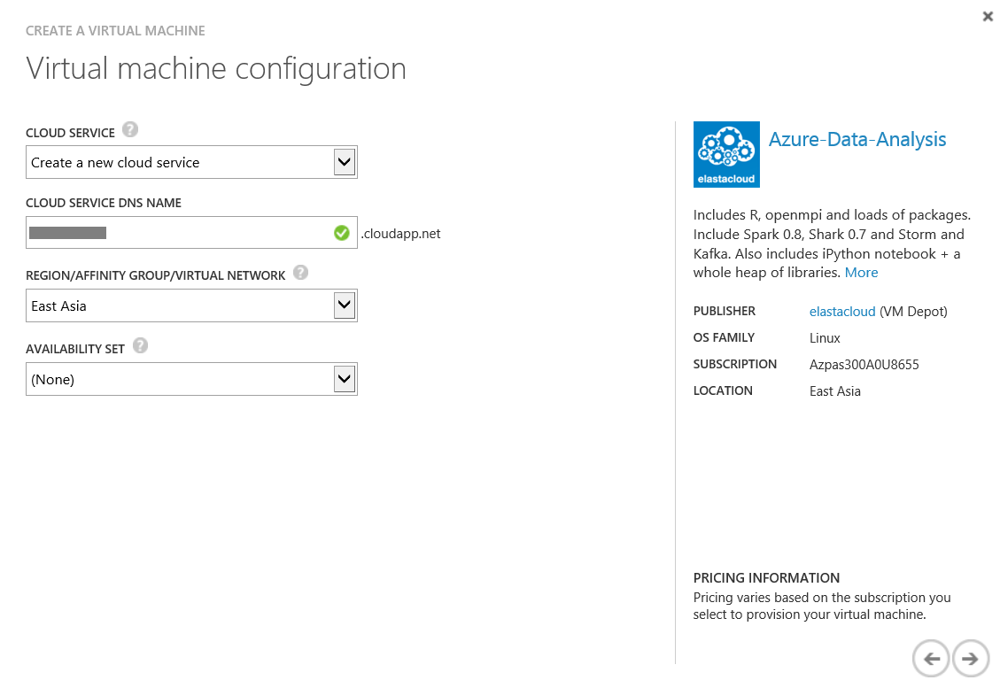

	_Set Linux Cloud Service Information_

1. We will also need to setup the endpoints information. According to the image description, we will know that the image's publisher, platform, packages and required endpoints. We will add public port 443 mapping to private port 8888 and add 80/4040 to public ports.
	
	

	_Configure Linux Endpoints_

1. After several minutes, the machine will be created too. This time we will use PuTTY to connect the that machine. Input the **DNS Name** of the linux machine into the Host Name, click **OK** to connect.


1. Input the username and password, then you will see the welcome screen from that machine.
	
	

	_Login_

The machine has installed a lot of packages including IPython, Storm or Shark. We will only use the IPython Notebook on that machine to run a very simple algorithm. First we need to do some configuration for IPython.

## Configurate IPython ##

1. Now you can start IPython Notebook.You should see that the server has started:

	````Linux
	sudo ipython notebook --profile=nbserver
	````
	
	

	_Start IPython Notebook_

1. Navigate your browser (from your own machine, not the VM) to https://\<vm-name>.cloudapp.net. Make sure that you use https and not http. You will see a warning that the certificate is not signed. Since this is your own certificate, you can safely ignore this warning. After ignoring it, you should see the login screen:

	

	_IPython Notebook Main Page_

    ````
    Note: If you have trouble reaching the IPython Notebook URL, check the following:
        - Ensure you typed the _sudo ipython notebook --profile=nbserver_ command correctly
        - Ensure you are using https (not http)
        - Ensure you are accessing the correct URL (double-check the cloud service name from the Windows Azure Portal)
    ````

1. Login with the password. The default password is **Elastacloud123**.

	

	_IPython Notebook Main Page_

> if you want to configure your own password, you can use PuTTY to that linux machine and do following task:
> Execute the following command:

> 	````Linux
> 	python -c "import IPython;print IPython.lib.passwd()" 
> 	````
	
> 	

> 	_Create IPython Password_


> Then we use nano to edit the configuration and update *c.NotebookApp.password* with _nano_. Since the file is readonly, we can still modify it if we run _nano_ through _sudo_. With ctrl+X, you can save the file. You have to press “Y” to confirm the save operation and then press enter.

> 	````Linux
> 	sudo nano /usr/.ipython/profile_nbserver/ipython_notebook_config.py
> 	````
	
> 	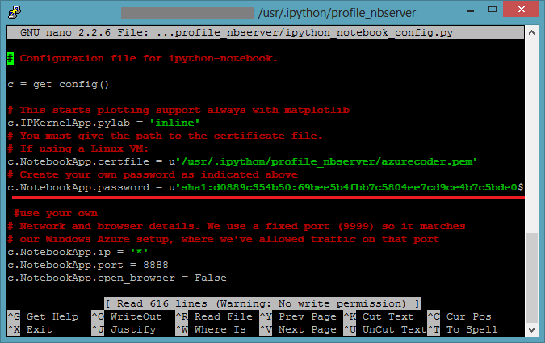

> 	_Modify Password Configuration_

## Clustering Example with Pandas and Scikit-learn ##

The following example (cluster-titanic.py) clusters passengers of the titanic based on several attributes. It is taken from [www.kaggle.com](http://www.kaggle.com) and has been preprocessed with Excel and then exported in CSV format.

The script will result in an output as:


_Clustering Example Sample_

1. Click **New Notebook** to create a new IPython notebook.

	
	
	_Clustering New Notebook_

1. In the beginning, the script defines the azure credentials as well as the intended number of clusters. The data is loaded from internet and stored in titanic_data.csv. We just upload the csv file to a public windows azure storage account and download it by HTTPs directly.

	````Python
   from sklearn.cluster import KMeans
	import urllib
   import numpy as np
	import pandas 
	import matplotlib
	import matplotlib.pyplot as plt
	import matplotlib.cm as cm
	from sklearn.manifold import MDS
	NUM_CLUSTERS = 16
	####################################
	# download titanic csv data from github
	f = urllib.urlopen("https://pythonstore.blob.core.windows.net/data/titanic-data.csv") # YOU MIGHT NEED TO CHANGE THE URL
	titanic_csv = f.read()
	with open("titanic.csv", "w") as tmp:
	    tmp.write(titanic_csv)
	````

1. In the next step, the data set is loaded with pandas. Pandas is a library that makes working with data tables as for example CSV data easy. As the “names” and “survived” groups are not needed for the clustering, they are removed from the data frame:

	````Python
	# Load data as pandas dataframe
	data = pandas.io.parsers.read_csv('titanic.csv', sep=";") 
	# Remove name and survived dimension to learn
	names = data.pop('name')
	survived = data.pop('survived')
	````
	
1. Afterwards, the KMeans clustering operation is initialized, the algorithm is trained and the results (labels for each data set, cluster centers and the set of labels used) are stored in the appropriate variables:

	````Python
	# CLUSTERING
	# Create KMeans
	kmeans = KMeans(n_clusters=NUM_CLUSTERS, init='k-means++', n_init=10, max_iter=300, tol=0.0001, precompute_distances=True, verbose=0, random_state=None, copy_x=True, n_jobs=1)
	# Train KMeans
	kmeans.fit(data)
	# Get the results
	kmeans_labels = kmeans.labels_
	kmeans_cluster_centers = kmeans.cluster_centers_
	kmeans_labels_unique = np.unique(kmeans_labels)
	````

1. After clustering the data, the multi-dimensional data is reduced to two dimensions in order to allow plotting:

	````Python
	# PLOT PREPARATION
	# Reduce to two dimensions for plotting
	mds = MDS(n_components=2)
	mds.fit(data)
	scaled_coordinates = mds.embedding_
	# PLOT ON TWO DIMENSIONS
	labelled_data_x = (dict(), dict())
	labelled_data_y = (dict(), dict())
	for label in kmeans_labels_unique:
	    labelled_data_x[0][label] = []
	    labelled_data_y[0][label] = []
	    labelled_data_x[1][label] = []
	    labelled_data_y[1][label] = []
	for i in range(0, len(names)):
	    label = kmeans_labels[i]
	    labelled_data_x[survived[i]][label].append(scaled_coordinates[i][0])
	    labelled_data_y[survived[i]][label].append(scaled_coordinates[i][1])
	````

1. The script prepares the data in order to be plotted in multiple colors (depending on their cluster) as well as the status of whether the passenger has survived or not. Surviving passengers and those who did not survive are assigned different markers and, in the end, the plot is shown:


	````Python
	# PLOTTING
	colors = cm.rainbow(np.linspace(0, 1, NUM_CLUSTERS)) 
	markers = ['x', '^']
	for i in kmeans_labels_unique: 
	    for j in [0, 1]:
	        plt.scatter(labelled_data_x[j][i], labelled_data_y[j][i], color=colors[i], marker=markers[j], s=40)
	plt.show()
	````
1. The result will show:
	
	
	
	_Clustering Result_

The full source code can be found in **Source\Exercise2\clustering_sample.py**.

<a name="#Exercise3"></a>
## Exercise 3: Create a new disk and mount the disk to Windows and Linux. ##

This exercise will show you how to attach new disks to both Linux and Windows virtual machines.

### Attach Empty Disk to Windows ###

1. You can attach a data disk to a virtual machine to store application data. A data disk is a Virtual Hard Disk (VHD) that you can create either locally with your own computer or in the cloud with Windows Azure. You manage data disks in the virtual machine the same way you do on a server in your office. 

	Go to the Azure management portal at https://manage.windowsazure.com, select “Virtual Machines” from the bar on the left, click on the VM you want to add the disk to and then go to “Dashboard” at the top bar. In the bar at the bottom, select “Attach” and then “Attach Empty Disk”:

	
	
	_Attach Empty Disk_

1. A wizard will open asking you to configure the empty disk. Select a storage location, the file name and the size in GB. In addition, you can choose among the following caching modes:

	- Read Only: Reads and writes are cached for future reads but writes are persisted directly to storage
	- Read/Write: Reads and writes are cached for future reads. Non-write-through writes are persisted to the local cache first, then lazily flushed to the Windows Azure Blob service. For SQL Server, writes are always persisted to Windows Azure Storage because it uses write-through.
	- None (disabled): Requests bypass the cache completely.

	The best option to use depends on your intended usage. Read/Write offers the best performance in general, but depending on the type of service you want to use (SQL Server, Apache Cassandra), caching might be counter-productive.

	In this example, select Read/Write. You can change this setting later if desired:

	
	
	_Set Disk Property_

1. The operation might take a couple of moments. After that, you should see your disk attached on the VM Dashboard in the portal (note that the disk count might need a reload to update):

	
	
	_Attached New Disk_

1. Then we use Remote Desktop to connect to the machine. Start **Server Manager** from the taskbar. Click *File and Storage Services* on the left panel.

	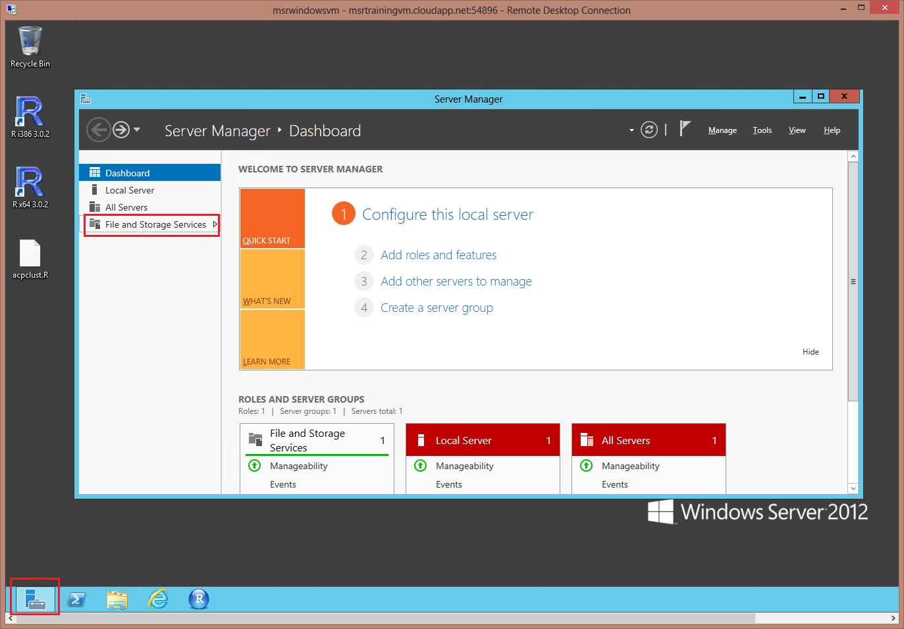
	
	_Server Manager_

1. Click **Disks** and locate the new virtual disk.

	
	
	_Find New Disk_	

1. Right click the disk and click **Initialize**. A warning will popup. You can safely ignore it as this disk is empty.
	

	

	_Initialize_	

1. The initialization process should finish rather quickly. Afterwards, right click on the now initialized disk and select “New volume”:

	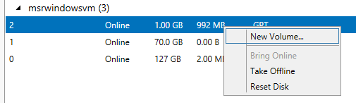


1. A wizard will start. Skip the first section “Before you begin”. On the second screen, make sure that your new disk is select and click on “Next”:
	
	
	
1. On the next page, you can define the size of the volume. The maximum size is selected as default:
	
	

1. On the next screen, you can assign a drive letter for the new volume, or you can mount it in a particular folder. Choose a drive letter and select “Next”:
	
	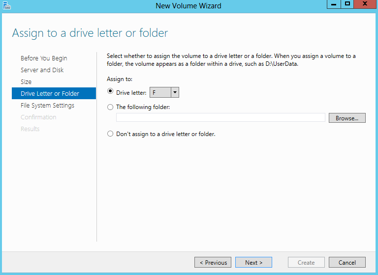

1. On the next screen, you can select the file system and name the new volume:
	
	

1. Confirm your selection on the Confirmation screen, then select “Create”. The new volume will be created and mounted:
	
	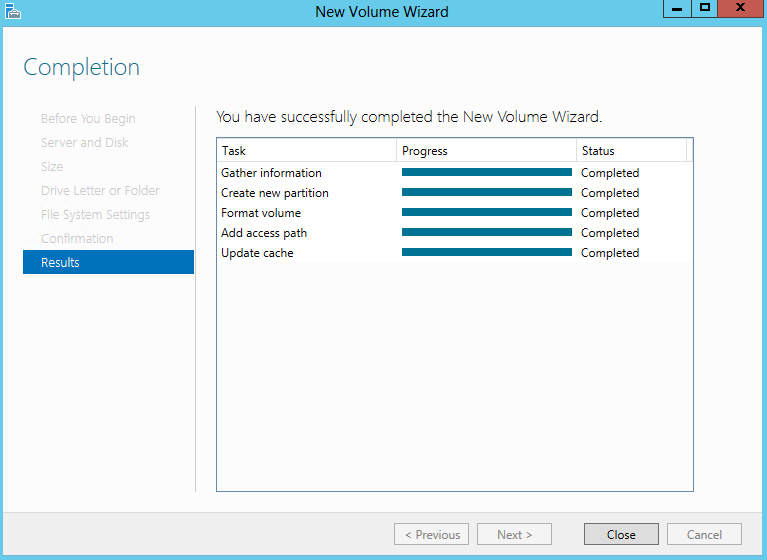

1. Click on **Close**. If you select your new disk again, you should see the new volume in the “Volumes” window:

	

### Attach Empty Disk to Linux ###

For linux, the steps to add empty disk is exactly the same. The different is the operation on Linux. After redoing step 1 to step 3, use PuTTY to connect to the linux machine. 

1. First we run the following command to find new disk:

	````Linux
	ls /dev/sd*
	````
	This shows you all the disks attached to the virtual machine. The new disk is attached at /dev/sdc by default:

	

1. You can also check the mounted disks with the command:

	````Linux
	df -h
	````
	You will see that /dev/sdc is not yet mounted as it is not present in the listing:

	

1. You need to format the disk to use it. Execute the following command:

	````Linux
	sudo fdisk /dev/<device>
	````

	In our example:

	````Linux
	sudo fdisk /dev/sdc
	````

	When prompted, first enter “n” (new partition), then “p” (primary partition). You can leave the rest of the values at default. This will create a partition over the whole disk. At the end, enter “w” to write the changes to disk:

	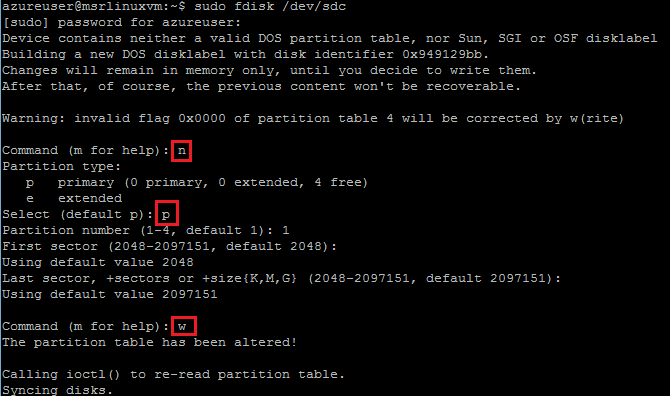

1. Now list the devices again:

	````Linux
	ls /dev/sd*
	````

	You should see that a new directory “/dev/sdc1” was added. This directory represents the newly created partition 1 on disk sdc:

	

1. Next, you need to create a file system. In this example, you will use “ext4” as filesystem:

	````Linux
	sudo mkfs -t ext4 /dev/sdc1
	````

	

1. In the last step, you need to mount the disk. On Linux system, disks are mounted into a directory of your choice, meaning that everything in this directory or in its sub directories are stored on the particular disk/partition.

	A common location to mount disks is to use a subdirectory of “/mnt”. For this example, create the directory “/mnt/data” as place to store the data:

	````Linux
	sudo mkdir /mnt/data
	````

1. Mount Disk (Temporarily)

	You can mount the disk with the following command:

	````Linux
	sudo mount /dev/sdc1 /mnt/data 
	````

	This will mount the device /dev/sdc1 to /mnt/data. Using the command:
	
	````Linux
	df -h
	````

	again, you should see the mounted disk:

	

	If you view the files on the disk, you will see only a single folder added by default, lost+found. 

	````Linux
	ls /mnt/data
	````

	This mounting approach has one drawback: If you reboot the virtual machine, you have to manually mount the disk again. In the next step, you will make the mount configuration persistent.

1. If you want to mount disk persistently, you need to mount the disk in fstab.

	Unmount the disk you mounted in the previous step:

	````Linux
	sudo umount /mnt/data
	````
	
	Next, you need to open an editor to edit /etc/fstab, the file which holds the partitions to mount during startup:

	````Linux
	sudo nano /etc/fstab
	````
	
	The format in /etc/fstab is:

	````Linux
	[Device] [Mount Point] [File System Type] [Options] [Dump] [Pass]
	````

	Paste the following configuration into a new line in the editor:
	
	````Linux
	/dev/sdc1    /mnt/data    ext4    defaults 0 0
	````

	Then press ctrl+x to exit. Confirm saving with “y” and then enter.

	

	Now you should try to mount the disks in fstab. This can be done with:

	````Linux
	sudo mount -a
	````

	There should be no output if successful. Again, you can check the new partition using:

	````Linux
	df -h
 	````

	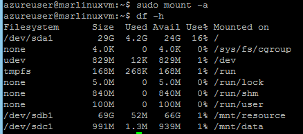

---

<a name="summary"></a>
## Summary ##

By completing this hands-on lab you learned the following:

- Create a machine with Windows Server 2012 and run R job.
- Create a machine from VMDepot and run ipython job.
- Create a new disk and mount the disk to Windows and Linux.

© 2013 Microsoft Corporation. All rights reserved.
Except where otherwise [noted](http://creativecommons.org/policies#license), content on this site is licensed under a [Creative Commons Attribution-NonCommercial 3.0 License.](http://creativecommons.org/licenses/by-nc/3.0/)
