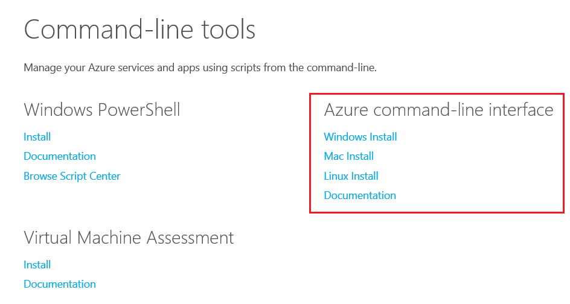
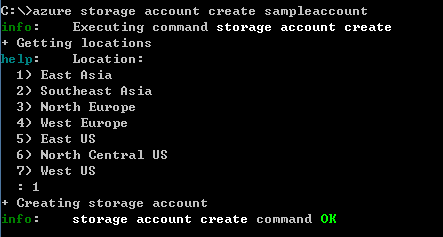
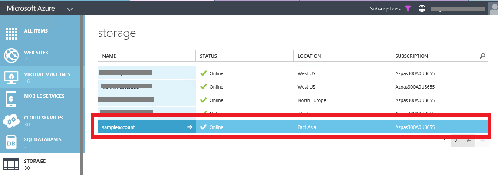
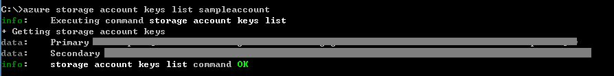
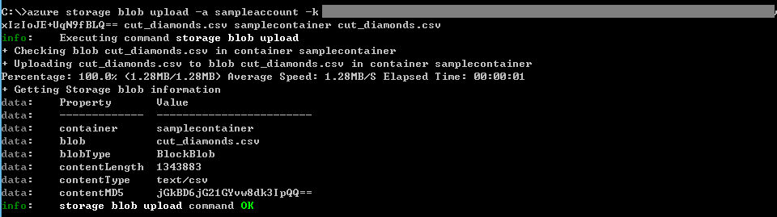
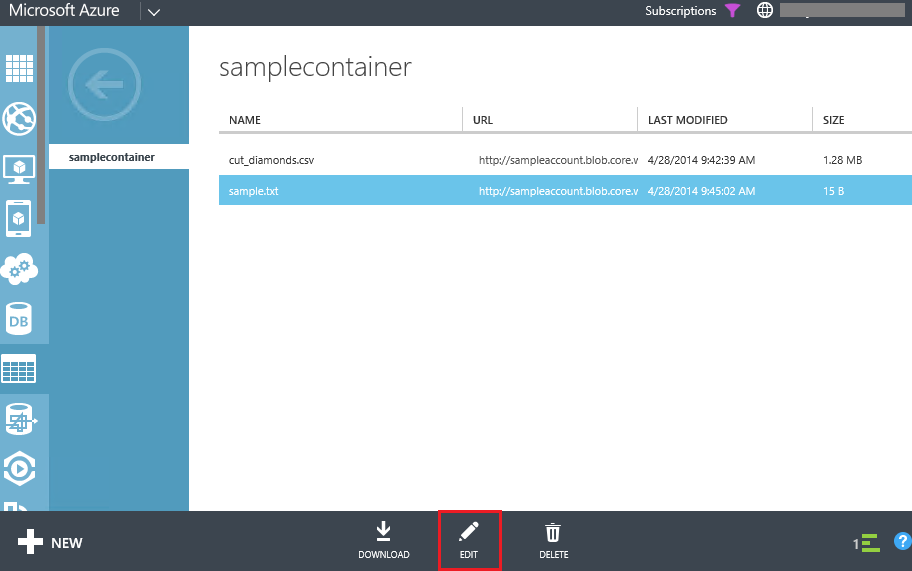
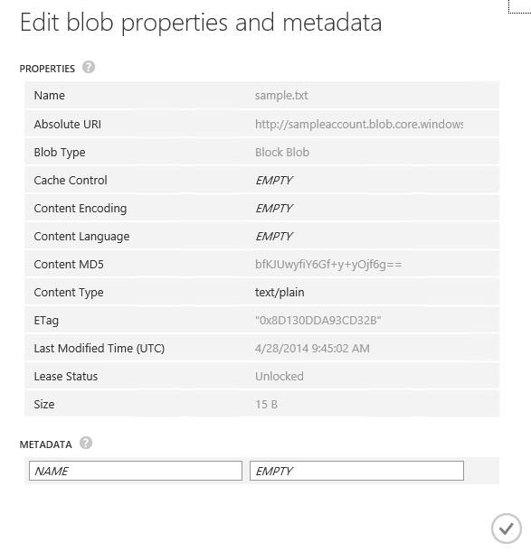
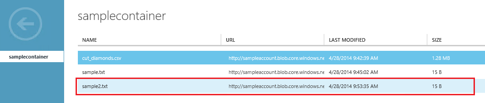
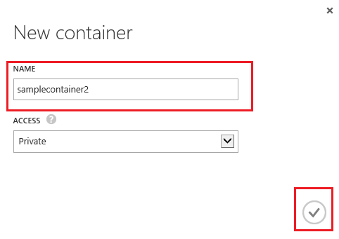

# Manage Microsoft Azure Storage #

---

## Overview ##

Microsoft Azure Storage is designed for cost-effectively storing and retrieving large volumes of data while providing ease of access and durability. It offers non-relational data storage including Blob, Table, Queue and Drive storage. In this lab, you will learn to use different tools to manage Microsoft Azure Storage Service. 

### Objectives ###

In this hands-on lab, you will learn how to:

- Use Azure Cross-Platform Command-Line Interface to manage your storage accounts.
- Use IPython notebook to run storage commands.
- Use AzCopy to Copy files between different storage accounts.(optional)

### Prerequisites ###

The following is required to complete this hands-on lab:

- A Microsoft Azure subscription - [sign up for a free trial](http://aka.ms/WATK-FreeTrial)
- You **must** use one of the following **browsers**: Latest version of **Firefox or Chrome, IE 9, 10, 11.**  Browsers like Safari, 360 may have issues with IPython or RDP download.

----

## Exercises ##

This hands-on lab includes the following exercises:

1. [Use Azure Cross-Platform Command-Line Interface to manage your storage accounts.](#Exercise1)
1. [Use IPython notebook to run storage commands.](#Exercise2)
1. [Use AzCopy to Copy files between different storage accounts.](#Exercise3)

Estimated time to complete this lab: **60** minutes.

### Exercise 1: Use Azure Cross-Platform Command-Line Interface to manage your storage accounts.  ###

The Azure Cross-Platform Command-Line Interface (xplat-cli) provides a set of open source, cross-platform commands for working with the Azure Platform. The xplat-cli provides much of the same functionality found in the Azure Management Portal, such as the ability to manage web sites, virtual machines, mobile services, SQL Database and other services provided by the Azure platform. Now we will use xplat-cli for storage management including blob, table and queue storage.

1. Azure Cross-Platform Command-Line Interface can be downloaded for free from [Azure Website](http://azure.microsoft.com/en-us/downloads/). You can select corresponding version for different operation systems. 

    

    _Azure Cross-Platform Command-Line Interface Download_

1.There are two ways to install the xplat-cli; using installer packages for Windows and OS X, or if Node.js is installed on your system, the npm command.

    For Linux systems, you must have Node.js installed and either use npm to install the xplat-cli as described below, or build it from source. The source is available at [http://go.microsoft.com/fwlink/?linkid=253472&clcid=0x409](http://go.microsoft.com/fwlink/?linkid=253472&clcid=0x409). For more information on building from source, see the INSTALL file included in the archive.

    Once the xplat-cli has been installed, you will be able to use the azure command from your command-line interface (Bash, Terminal, Command prompt) to access the xplat-cli commands.

1. If Node.js is installed on your system, use the following command to install the xplat-cli:

    <pre>
    npm install azure-cli -g
    </pre>
    
    > You may need to use sudo to successfully run the npm command.

    This will install the xplat-cli and required dependencies. At the end of the installation, you should see something similar to the following:

    <pre>
    azure-cli@0.8.0 ..\node_modules\azure-cli
    |-- easy-table@0.0.1
    |-- eyes@0.1.8
    |-- xmlbuilder@0.4.2
    |-- colors@0.6.1
    |-- node-uuid@1.2.0
    |-- async@0.2.7
    |-- underscore@1.4.4
    |-- tunnel@0.0.2
    |-- omelette@0.1.0
    |-- github@0.1.6
    |-- commander@1.0.4 (keypress@0.1.0)
    |-- xml2js@0.1.14 (sax@0.5.4)
    |-- streamline@0.4.5
    |-- winston@0.6.2 (cycle@1.0.2, stack-trace@0.0.7, async@0.1.22, pkginfo@0.2.3, request@2.9.203)
    |-- kuduscript@0.1.2 (commander@1.1.1, streamline@0.4.11)
    |-- azure@0.7.13 (dateformat@1.0.2-1.2.3, envconf@0.0.4, mpns@2.0.1, mime@1.2.10, validator@1.4.0, xml2js@0.2.8, wns@0.5.3, request@2.25.0)
    </pre>

1. The xplat-cli is accessed using the azure command. To see a list of commands available, use the azure command with no parameters. You should see help information similar to the following:

    <pre>
    info:             _    _____   _ ___ ___
    info:            /_\  |_  / | | | _ \ __|
    info:      _ ___/ _ \__/ /| |_| |   / _|___ _ _
    info:    (___  /_/ \_\/___|\___/|_|_\___| _____)
    info:       (_______ _ _)         _ ______ _)_ _
    info:              (______________ _ )   (___ _ _)
    info:
    info:    Windows Azure: Microsoft's Cloud Platform
    info:
    info:    Tool version 0.8.0
    help:
    help:    Display help for a given command
    help:      help [options] [command]
    help:
    help:    Opens the portal in a browser
    help:      portal [options]
    help:
    help:    Commands:
    help:      account        Commands to manage your account information and publish settings
    help:      config         Commands to manage your local settings
    help:      hdinsight      Commands to manage your HDInsight accounts
    help:      mobile         Commands to manage your Mobile Services
    help:      network        Commands to manage your Networks
    help:      sb             Commands to manage your Service Bus configuration
    help:      service        Commands to manage your Cloud Services
    help:      site           Commands to manage your Web Sites
    help:      sql            Commands to manage your SQL Server accounts
    help:      storage        Commands to manage your Storage objects
    help:      vm             Commands to manage your Virtual Machines
    help:
    help:    Options:
    help:      -h, --help     output usage information
    help:      -v, --version  output the application version

    </pre>

1. First you need to download the publish settings for your account, which will open your default browser and prompt you to sign in to the Azure Management Portal. After signing in, a .publishsettings file will be downloaded. Make note of where this file is saved.

    <pre>
    azure account download
    </pre>

    

    

    Next, import the .publishsettings file by running the following command, replacing [path to .publishsettings file] with the path to your .publishsettings file:

    <pre>
    azure account import [path to .publishsettings file]
    </pre>

    

1.     Let's select default subscription first.
    
    The top level commands listed above contain commands for working with a specific area of Azure. For example, the azure account command contains commands that relate to your Azure subscription, such as the download and import settings used previously.

    To view subscriptions that you have imported, use:
    <pre>
    azure account list
    </pre>

    If you have imported subscriptions, use the following to set one as default:
    <pre>
    azure account set [subscription]
    </pre>

1. Then use the following command to get all storage accounts under the default subscription.
    <pre>
    azure storage account list
    </pre>

    
    
1. Now we create a new storage account name *sampleaccount* with the following command:
    <pre>
    azure storage account create sampleaccount
    </pre>

    Select the location and a new storage account will be created.
    

    if you navigate to the management portal, you can see a new storage account *sampleaccount* is created.
    
    

1. In order to connect to the storage account, we need the storage account name and key. We can get the storage account name and key from the management portal, like what we did in the website hands on lab. Or we can directly use the CLI to get all keys.    
    <pre>
    azure storage account keys list sampleaccount
    </pre>

    
    
5. Next we need to create a container *samplecontainer* with the storage account name and key.

    <pre>
    azure storage container create -a [account_name] -k [account_key] samplecontainer
    </pre>

    Select the location and a new storage account will be created.
    

    You can also navigate to the portal for the container.
    

1. Next, we will upload a new file to the new container. You can locate any files on your drives. We have some sample files under **Source\Exercise1\** which you can upload. Please make sure you upload the file **cut_diamonds.csv** which will be used [Exercise 2](#Exercise2)

    <pre>
    azure storage blob upload -a [account_name] -k [account_key] cut_diamonds.csv samplecontainer cut_diamonds.csv
    </pre>

    Select the location and a new storage account will be created.
    

    Files stored in the Blob Storage Service can simply referred to as blobs. You can see basic information about the blob such as its name, when last modified, length and content type. Each storage account in Microsoft Azure can hold up to 200TB which could consist of many large blobs, or even one 200GB blob.

1. On Microsoft Azure Portal, navigate to the **sample.txt** and click Edit button. You can modify the properties and metadata of the blob.

    

    
    
1. For more documents of xplat-cli, please refer to the document [http://azure.microsoft.com/en-us/documentation/articles/xplat-cli/](http://azure.microsoft.com/en-us/documentation/articles/xplat-cli/).

### Excercise 2: Use IPython notebook to run storage commands.  ###
Use the IPython notebook you have already created in the previous exercise **Using Microsoft Azure Virtual Machines.** for this exercise. You can manage Microsoft Azure Storage Account in IPython. 

###Note: If you have not completed the Virtual Machines lab, please note that IPython notebook is an interactive Python framework which makes Python project development and management much easier. 

Build an IPython environment on Microsoft Azure, you can read  [http://www.windowsazure.com/en-us/develop/python/tutorials/ipython-notebook/](http://www.windowsazure.com/en-us/develop/python/tutorials/ipython-notebook/)

After the IPython Notebook is deployed, you can open the IPython Notebook in your Explorer:

_IPython Notebook_

1. Create the button **New Notebook** on the top right, 

    

    

    _Create a New Notebook_

1. Next we are going to go use some Python code to manage the storage account that we created in Azure Storage Explorer. Open the file **Source\Exercise2\IPythonStorageManager.py** in a text editor and we will execute those commands step by step.

    

    _IPythonStorageManager Code_

1. First we need to set the *account* and *key* variable in the code. We've just learnt how to get those information from Microsoft Azure Management Portal in [Exercise 1](#Exercise1). Then we will run those code in IPython Notebook.

1. Execute the following code to imports all required libraries.

    <pre>
    #first we import modules we require
    from azure.storage import *
    import os
    import csv
    import numpy
    from collections import defaultdict
    import time
    </pre>

    

    _Import Libraries_

1. Then we set the private variables for the storage account

    <pre>
    #put your account name and key here
    account = '[Your Storage Account Name]'
    key = '[You Storage Account Access Key]'        
    containername = 'samplecontainer'
    </pre>
    

    _Set Variables_

1. We create a BlobService to manage all blobs in the storage account 

    <pre>
    #get a handle to your account
    blob_service = BlobService(account_name=account, account_key=key)
    </pre>
    

    _Create Blob Service_

1. Now we will list all blobs in the current storage account and container.We will print all blobs' name and full urls. 

    <pre>
    #list all blobs of the container
    blobs = blob_service.list_blobs(containername)
    for blob in blobs:
        print(blob.name)
        print(blob.url)
    </pre>

    

    _List All Blobs_

    You can see that we get all files that we uploaded to the container in [Exercise 1](#Exercise1).

1. Next we are going to create a new file locally and upload the file to my storage account. We create a text file *sample2.txt* and then write *This is another sample* into it.

    <pre>
    #create a new file a blob into a container
    open(r'sample2.txt', 'w').write("This is another sample")        
    #upload the blob into the container
    sampleblob2 = open(r'sample2.txt', 'r').read()
    blob_service.put_blob(containername, 'sample2.txt', sampleblob2, x_ms_blob_type='BlockBlob')        
     </pre>

    

    _Upload Blob_

    When the upload is done, we launch the azure portal again and refresh current container. We can see a new file *Sample2.txt" appears in the container.

    

    _Sample2.txt is Uploaded_

1. We can also delete the file in the container by following code.

    <pre>
    #then we can remove sample2.txt
    os.remove(r'sample2.txt')
    #delete the blob remotely
    blob_service.delete_blob(containername, 'sample2.txt')
    #check the azure storage explorer again, the file is removed.    
     </pre>

    

    _Delete Blob_

1. The let's download the csv file to local and we can draw a scatter figure from the data.

    <pre>
    #we can also download a csv file to local
    csv_file = 'cut_diamonds.csv'
    csvblob = blob_service.get_blob(containername, csv_file)
    with open(csv_file, 'w') as f:
        f.write(csvblob)    
     </pre>

    

    _Download Blob_

1. Then we load the data in csv from the csv library and draw a scatter plot based on its carat and price.

    <pre>
    #then we draw a scatter from the csvfile
    columns = defaultdict(list) #we want a list to append each value in each column to
    with open(csv_file) as f:
        reader = csv.DictReader(f) #create a reader which represents rows in a dictionary form
        for row in reader: #this will read a row as {column1: value1, column2: value2,...}
            for (k,v) in row.items(): #go over each column name and value 
                columns[k].append(v) #append the value into the appropriate list based on column name k
    carat = np.array(columns['Carat'])
    price = np.array(columns['Price'])
    scatter(carat,price,marker ='o',color='#ff0000')
     </pre>

    

    _The carat and price scatter diagram_

1. Next we will also manage some table storage operation. Microsoft Azure Table storage is used to save many entities with different partition key and row key. It can be used as a NoSQL storage repository. First we are going to create a TableService object with the same account name and key name. We will also set the private variable to save a table name.

    <pre>
    #Next we are going to demostrate the table storage management in Microsoft Azure
    #we can add top 100 rows of the cut_diamond csv to a table storage
    #get a handle to your account
    table_service = TableService(account_name=account, account_key=key)
    table_name = 'diamondtable';
     </pre>

    

    _Create Table Service_

1. Then we create a new table. First we will delete the table in case the table exists.
        

    <pre>
    #delete the table for temporary data
    result = table_service.delete_table(table_name)        
    # create a new table to save all entities.
    result = table_service.create_table(table_name)    
     </pre>

    

    _Create New Table_

1. Now we will create 100 top entities and insert those entities into the new table. We will set each entity's partition key to be the diamond's color and row key is the index.

    <pre>
    #then we insert the top 100 diamond into the table, we set PartitionKey to be each diamonds' color and RowKey to be the index
    index = 0
    with open(csv_file) as f:
        reader = csv.DictReader(f) #create a reader which represents rows in a dictionary form
        for row in reader: #this will read a row as {column1: value1, column2: value2,...}
            entity = Entity()
            entity.PartitionKey = row['Color']
            entity.RowKey= str(index)
            entity.Clarity = row['Clarity']
            entity.Cut = row['Cut']
            entity.Carat = row['Carat']
            entity.Price = row['Price']
            table_service.insert_entity(table_name, entity)
            print row
            index=index+1
            if index >= 100:
                break
    </pre>    

1. We are also perform query against the table. Now we want to get all diamonds information with D color. The code is followed:

    <pre>
    #we can also query all table entities with diamonds' color = 'D'
    diamonds = table_service.query_entities(table_name, "PartitionKey eq 'D'")
    for d in diamonds:
        print(str(d.Cut),str(d.PartitionKey),str(d.Clarity),str(d.Carat),'$'+ str(d.Price))
    </pre>

    

    _Query Table_

Now we finished all operations. We can easily use IPython Notebook to manage all storage account on Microsoft Azure.
    

### Exercise 3 (Optional): Use AzCopy to Copy files between different storage accounts.  ###

AzCopy is another tool to manage azure storage account. It can be used to copy files from local to remote storage account or even between different storage accounts. For more information, please refer to [Microsoft Azure Storage Team Blog](http://blogs.msdn.com/b/windowsazurestorage/archive/2013/04/01/azcopy-using-cross-account-copy-blob.aspx).

1. AzCopy.exe is distributed as .NET assemblies, we can download the [CTP2](http://go.microsoft.com/fwlink/?LinkId=287086) version and extract to a local folder. It is a command line tool.

1. Create a new storage account under your subscription on Microsoft Azure Management Portal. Set the storage account name to a different name.

    

    _Create A New Storage Account_

1. Save its access key from the portal.

    

    _Get Another Storage Account Access Key_

1. Create a new container in the storage account by click **Container** -> **Add**.

    

    _Create A New Container_

1. Then we want to use AzCopy to copy all files from the old container to the new container. Execute the following command in commnad line:

    <pre>
        AzCopy https://[sourceaccount].blob.core.windows.net/[sourcecontainer]/ https://[destaccount].blob.core.windows.net/[destcontainer]/  /sourcekey:[key] /destkey:[key] /S
    </pre>

    Replace all fields according to your configuration. The above command will copy all blobs from the container named "sourcecontainer" in storage account "sourceaccount" to another container named "destcontainer" in storage account "destaccount".

    
    

    _AzCopy Between Storage Accounts_

    Let's go to the portal again and you will find all files are copied to the new container.

AzCopy also support many other features like move, snapshot and multiple network calls. For more details, please refer to the AzCopy [page](http://blogs.msdn.com/b/windowsazurestorage/archive/2013/04/01/azcopy-using-cross-account-copy-blob.aspx).

---

## Summary ##

By completing this hands-on lab you learned the following:

- Use Azure Cross-Platform Command-Line Interface to manage your storage accounts.
- Use IPython notebook to run storage commands.
- Use AzCopy to Copy files between different storage accounts.

Copyright 2013 Microsoft Corporation. All rights reserved. 
Except where otherwise noted, these materials are licensed under the terms of the Apache License, Version 2.0. You may use it according to the license as is most appropriate for your project on a case-by-case basis. The terms of this license can be found in [http://www.apache.org/licenses/LICENSE-2.0](http://www.apache.org/licenses/LICENSE-2.0).
