
# Manage Microsoft Azure Storage #

---

## Overview ##

Microsoft Azure Storage is designed for cost-effectively storing and retrieving large volumes of data while providing ease of access and durability. It offers non-relational data storage including Blob, Table, Queue and Drive storage. In this lab, you will learn to use different tools to manage Microsoft Azure Storage Service. 

### Objectives ###

In this hands-on lab, you will learn how to:

- Use Azure Storage Explorer to manage your storage accounts.
- Use IPython notebook to run storage commands.
- Use AzCopy to Copy files between different storage accounts.(optional)

### Prerequisites ###

The following is required to complete this hands-on lab:

- A Microsoft Azure subscription - [sign up for a free trial](http://aka.ms/WATK-FreeTrial)
- You **must** use one of the following **browsers**: Latest version of **Firefox or Chrome, IE 9, 10, 11.**  Browsers like Safari, 360 may have issues with IPython or RDP download.

----

## Exercises ##

This hands-on lab includes the following exercises:

1. [Use Azure Storage Explorer to manage your storage accounts.](#Exercise1)
1. [Use IPython notebook to run storage commands.](#Exercise2)
1. [Use AzCopy to Copy files between different storage accounts.](#Exercise3)

Estimated time to complete this lab: **60** minutes.

### Exercise 1: Use Azure Storage Explorer to manage your storage accounts.  ###

Azure Storage Explorer is a useful GUI tool for inspecting and altering the data in your Microsoft Azure Storage projects including the logs of your cloud-hosted applications. All 3 types of cloud storage can be viewed and edited: blobs, queues, and tables. 

1. Azure Storage Explorer version 6 can be downloaded for free from [CodePlex](http://azurestorageexplorer.codeplex.com/releases/view/125870). 

    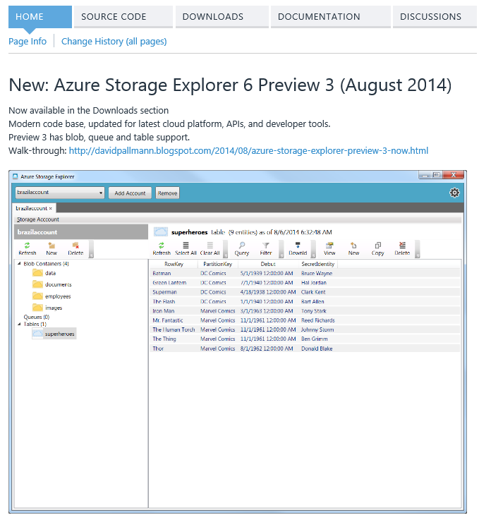

    _Azure Storage Explorer Page_

    The latest version is 6.0 Preview, but you can also download the previous released version.

1. Download *Azure Storage Explorer 6* and install it.

    The Azure Storage Explorer can only be installed on Windows machines.

    

    _Install Azure Storage Explorer_

1. Before you launch the tool, you need to know your storage account's name add access key. You can find your storage account name and access key in your Microsoft Azure Management Portal.

    

    _Microsoft Azure Storage Account_
    
    Click the "Manage Access Keys" button under the page to display the storage account name and access keys for the currently selected storage account. 

    

    _Manage Access Key_    

    If there is no storage account under your subscription, you can just click **New** -> **Data Service** -> **Storage** -> **Quick Create** to create one.
    >
    >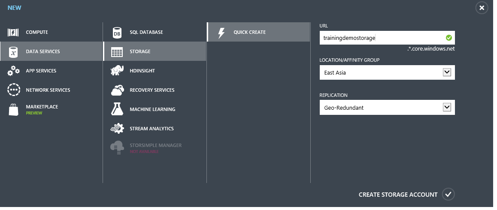
    >
    >_Create A Storage Account_    

1. Launch *Azure Storage Explorer*.
    
    

    _Azure Storage Explore_

1. Then Click "Add Account" button on the top and input your account name and access key in the form, check the **Use HTTPS** and click "Add Storage Account".

    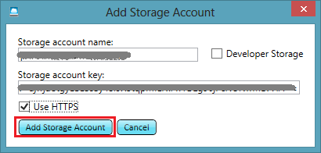

    _Add Account Information_    

1. A new form will pop up to notify you it takes some time to scan the storage account if it is the first time you add the storage account. Click OK and after several seconds Azure Storage Explorer will be ready to help you viewing the blob, table and queue data in your storage account. 

    

    _New Storage Account Confirmation_

    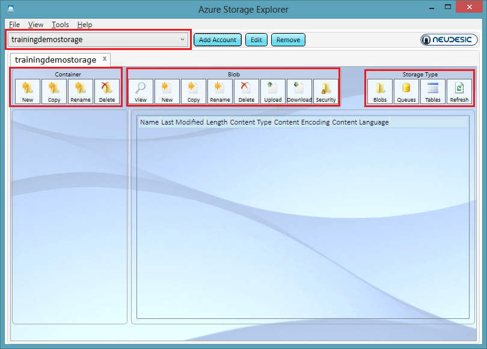

    _Manage Storage Account_

    Azure Storage Explorer displays information about Blob storage by default. From here, you can create, copy, rename or delete a container with the button on left top. Now let's create a sample container and upload a file to your storage account.

1. Click *New*, input the container name *samplecontainer* and set the *Accessibility* to be *Public Container*. Click *Create Container* and you will create a new container under the storage account. The "Public Container" means that everyone can access the file through its fully qualified URL (via http or https). If you don't want anyone knowing your URLs to be able to access files in the container, set the accessibility to be private instead of public.
    
    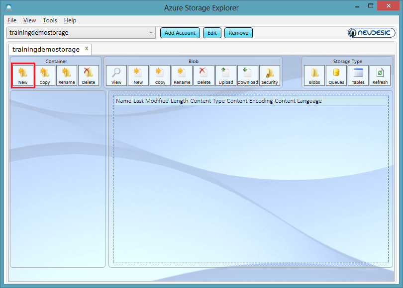

    

    

    _New Container_

1. Next, we will upload a new file to the new container. Click the new container on the left and click *Upload* button on the top.

    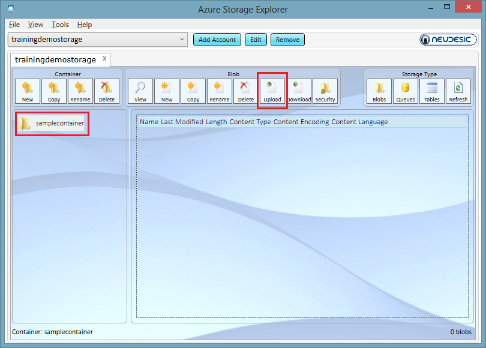
    
    _Upload File_

1. You can locate any files on your drives. We have some sample files under **Source\Exercise1\** which you can upload. Please make sure you upload the file **cut_diamonds.csv** which will be used [Exercise 2](#Exercise2)

    
    
    _Uploaded Files_

    Files stored in the Blob Storage Service can simply referred to as blobs. You can see basic information about the blob such as its name, when last modified, length and content type. Each storage account in Microsoft Azure can hold up to 200TB which could consist of many large blobs, or even one 200GB blob.

1. Double click the file **Sample.txt** and you will find more information. You can find the properties and metadata. Since the file is a text file, Azure Storage Explorer displays its contents.

    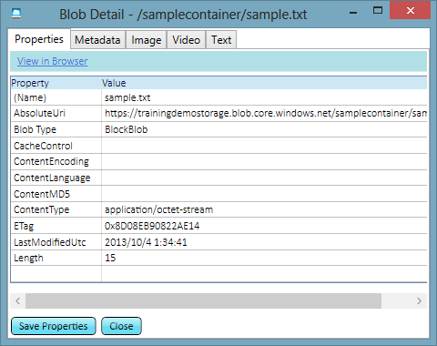

    _File Property_

    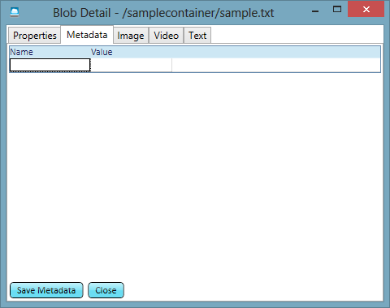

    _File Metadata_

    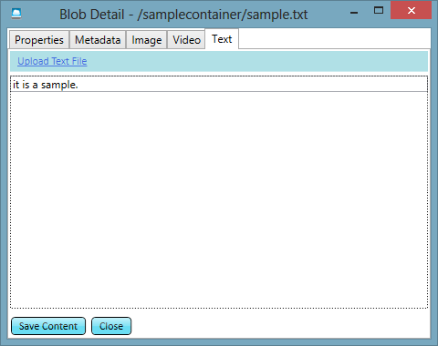

    _The Content of a File_
    
1. On the top right side, you can also manage the Microsoft Azure Table and Queue data in your storage account. With Tables, you can add or remove entities along with other Table management features. With Queues, you can push and pop messages along with other Queue management features. For more instructions on interacting with Queue and Table data using Azure Storage Explorer, you can visit [AzureStorageExplorer4UserGuide.pdf](http://www.codeplex.com/Download?ProjectName=azurestorageexplorer&DownloadId=160664).

    

    _Azure Storage Explorer Queue Management_

    

    _Azure Storage Explorer Table Management_

### Exercise 2: Use IPython notebook to run storage commands.  ###
Use the IPython notebook you have already created in the previous exercise **Using Microsoft Azure Virtual Machines.** for this exercise. You can manage Microsoft Azure Storage Account in IPython. 

Note: If you have not completed the Virtual Machines lab, please note that IPython notebook is an interactive Python framework which makes Python project development and management much easier. 

Build an IPython environment on Microsoft Azure, you can read  [http://www.windowsazure.com/en-us/develop/python/tutorials/ipython-notebook/](http://www.windowsazure.com/en-us/develop/python/tutorials/ipython-notebook/)

After the IPython Notebook is deployed, you can open the IPython Notebook in your Explorer:

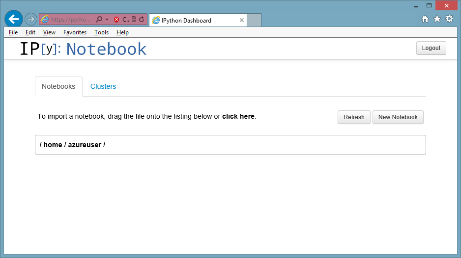

_IPython Notebook_

1. Create the button **New Notebook** on the top right, 

    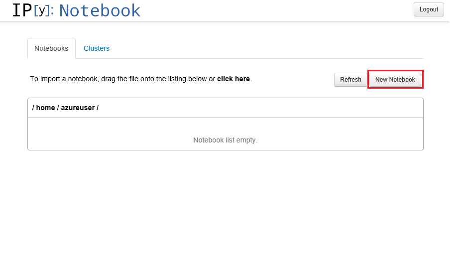

    

    _Create a New Notebook_

1. Next we are going to go use some Python code to manage the storage account that we created in Azure Storage Explorer. Open the file **Source\Exercise2\IPythonStorageManager.py** in a text editor and we will execute those commands step by step.

    

    _IPythonStorageManager Code_

1. First we need to set the *account* and *key* variable in the code. We've just learnt how to get those information from Microsoft Azure Management Portal in [Exercise 1](#Exercise1). Then we will run those code in IPython Notebook.

1. Excute the following code to imports all required libraries.

    <pre>
    #first we import modules we require
    from azure.storage import *
    import os
    import csv
    import numpy
    from collections import defaultdict
    import time
    </pre>

    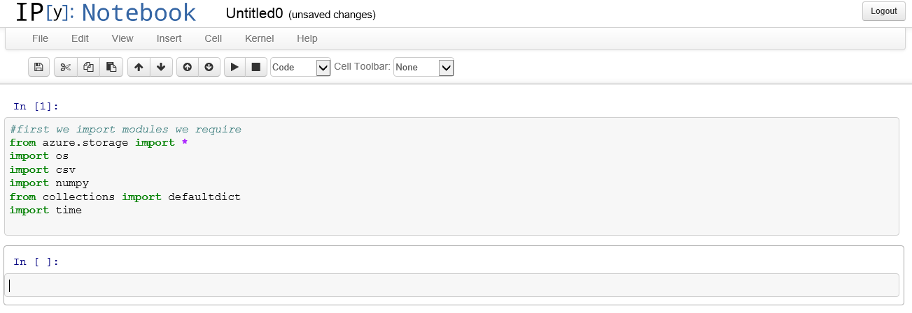

    _Import Libraries_

1. Then we set the private variables for the storage account

    <pre>
    #put your account name and key here
    account = '[Your Storage Account Name]'
    key = '[You Storage Accunt Access Key]'        
    containername = 'samplecontainer'
    </pre>
    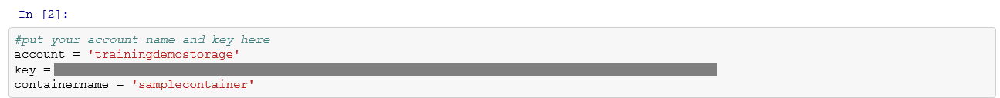

    _Set Variables_

1. We create a BlobService to manage all blobs in the storage account 

    <pre>
    #get a handle to your account
    blob_service = BlobService(account_name=account, account_key=key)
    </pre>
    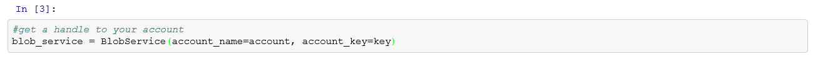

    _Create Blob Service_

1. Now we will list all blobs in the current storage account and container. We will print all blobs' name and full urls.

    <pre>
    #list all blobs of the container
    blobs = blob_service.list_blobs(containername)
    for blob in blobs:
        print(blob.name)
        print(blob.url)
    </pre>

    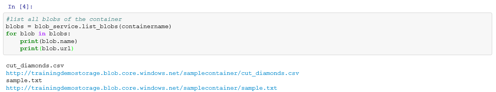

    _List All Blobs_

    You can see that we get all files that we uploaded to the container in [Exercise 1](#Exercise1).

1. Next we are going to create a new file locally and upload the file to my storage account. We create a text file *sample2.txt* and then write *This is another sample* into it.

    <pre>
    #create a new file a blob into a container
    open(r'sample2.txt', 'w').write("This is another sample")        
    #upload the blob into the container
    sampleblob2 = open(r'sample2.txt', 'r').read()
    blob_service.put_blob(containername, 'sample2.txt', sampleblob2, x_ms_blob_type='BlockBlob')        
     </pre>

    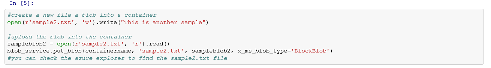

    _Upload Blob_

    When the upload is done, we launch Azure Storage Explorer again and refresh current container. We can see a new file *Sample2.txt" appears in the container.

    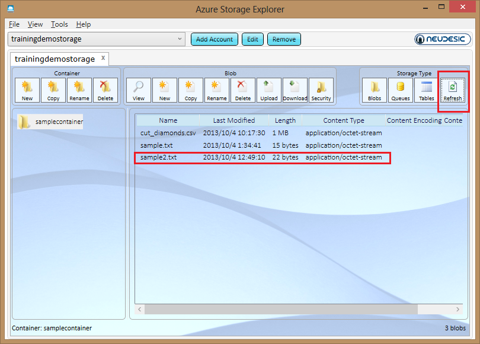

    _The Sample2.txt is Uploaded_

1. We can also delete the file in the container by following code.

    <pre>
    #then we can remove sample2.txt
    os.remove(r'sample2.txt')
    #delete the blob remotely
    blob_service.delete_blob(containername, 'sample2.txt')
    #check the azure storage explorer again, the file is removed.    
     </pre>

    

    _Delete Blob_

    Again, in the Azure Storage Explorer again and refresh current container. We can see the file *Sample2.txt" disappears.

    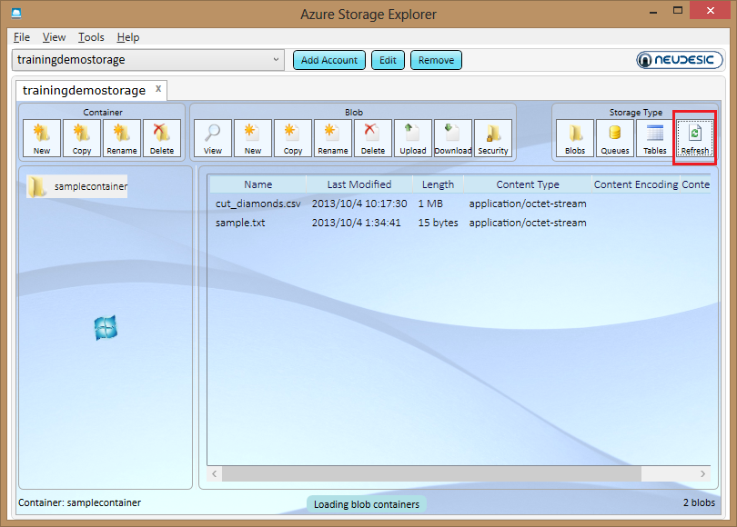

    _The Sample2.txt is Deleted_

1. The let's download the csv file to local and we can draw a scatter figure from the data.

    <pre>
    #we can also download a csv file to local
    csv_file = 'cut_diamonds.csv'
    csvblob = blob_service.get_blob(containername, csv_file)
    with open(csv_file, 'w') as f:
        f.write(csvblob)    
     </pre>

    

    _Download Blob_

1. Then we load the data in csv from the csv library and draw a scatter plot based on its carat and price.

    <pre>
    #then we draw a scatter from the csvfile
    columns = defaultdict(list) #we want a list to append each value in each column to
    with open(csv_file) as f:
        reader = csv.DictReader(f) #create a reader which represents rows in a dictionary form
        for row in reader: #this will read a row as {column1: value1, column2: value2,...}
            for (k,v) in row.items(): #go over each column name and value 
                columns[k].append(v) #append the value into the appropriate list based on column name k
    carat = np.array(columns['Carat'])
    price = np.array(columns['Price'])
    scatter(carat,price,marker ='o',color='#ff0000')
     </pre>

    

    _The carat and price scatter diagram_

1. Next we will also manage some table storage operation. Microsoft Azure Table storage is used to save many entities with different partition key and row key. It can be used as a NoSQL storage repository. First we are going to create a TableService object with the same account name and key name. We will also set the private variable to save a table name.

    <pre>
    #Next we are going to demonstrate the table storage management in Microsoft Azure
    #we can add top 100 rows of the cut_diamond csv to a table storage
    #get a handle to your account
    table_service = TableService(account_name=account, account_key=key)
    table_name = 'diamondtable';
     </pre>

    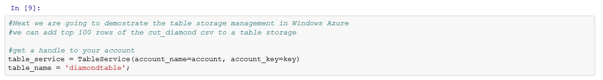

    _Create Table Service_

1. Then we create a new table. First we will delete the table in case the table exists.
        

    <pre>
    #delete the table for temporary data
    result = table_service.delete_table(table_name)        
    # create a new table to save all entities.
    result = table_service.create_table(table_name)    
     </pre>

    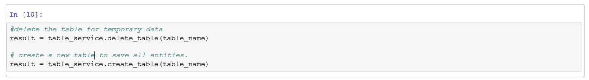

    _Create New Table_

    We goto the Azure Storage Explorer again, click *Tables* and check the new table.

    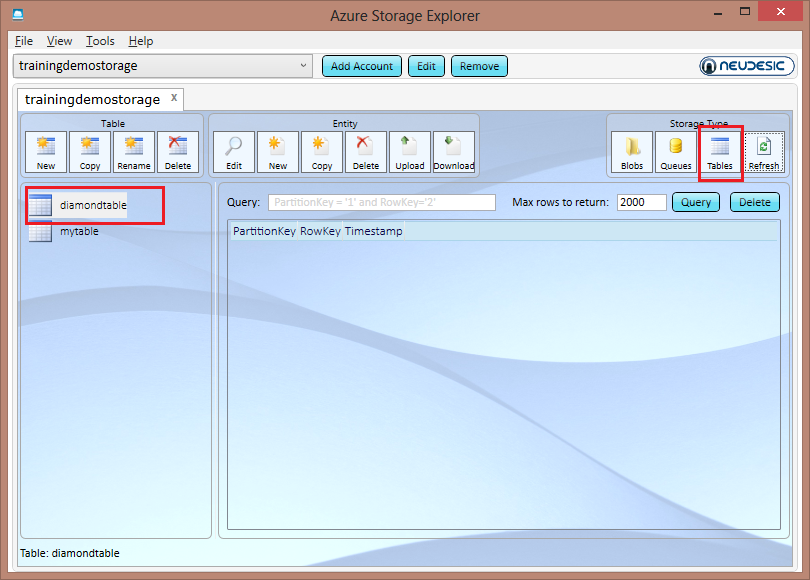

    _New Table is Created_

1. Now we will create 100 top entities and insert those entities into the new table. We will set each entity's partition key to be the diamond's color and row key is the index.

    <pre>
    #then we insert the top 100 diamond into the table, we set PartitionKey to be each diamonds' color and RowKey to be the index
    index = 0
    with open(csv_file) as f:
        reader = csv.DictReader(f) #create a reader which represents rows in a dictionary form
        for row in reader: #this will read a row as {column1: value1, column2: value2,...}
            entity = Entity()
            entity.PartitionKey = row['Color']
            entity.RowKey= str(index)
            entity.Clarity = row['Clarity']
            entity.Cut = row['Cut']
            entity.Carat = row['Carat']
            entity.Price = row['Price']
            table_service.insert_entity(table_name, entity)
            print row
            index=index+1
            if index >= 100:
                break
    #we can check the azure storage explore to query all entities that we inserted.    
     </pre>

    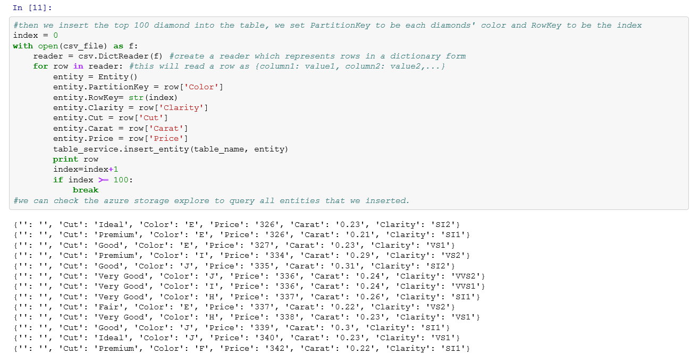

    _Insert Entities_

    In the Azure Storage Explorer, click *Query* button and you will find all entities are inserted.

    

    _Entities Are Inserted_

1. We are also perform query against the table. Now we want to get all diamonds information with D color. The code is followed:

    <pre>
    #we can also query all table entities with diamonds' color = 'D'
    diamonds = table_service.query_entities(table_name, "PartitionKey eq 'D'")
    for d in diamonds:
        print(str(d.Cut),str(d.PartitionKey),str(d.Clarity),str(d.Carat),'$'+ str(d.Price))
    </pre>

    

    _Query Table_

Now we finished all operations. We can easily use IPython Notebook to manage all storage account on Microsoft Azure.
    

### Exercise 3 (Optional): Use AzCopy to Copy files between different storage accounts.  ###

AzCopy is another tool to manage azure storage account. It can be used to copy files from local to remote storage account or even between different storage accounts. For more information, please refer to [Microsoft Azure Storage Team Blog](http://blogs.msdn.com/b/windowsazurestorage/archive/2013/04/01/azcopy-using-cross-account-copy-blob.aspx).

1. AzCopy.exe is distributed as .NET assemblies, we can download the [CTP2](http://go.microsoft.com/fwlink/?LinkId=287086) version and extract to a local folder. It is a command line tool.

1. Create a new storage account under your subscription on Microsoft Azure Management Portal. Set the storage account name to a different name.

    

    _Create A New Storage Account_

1. Save its access key from the portal.

    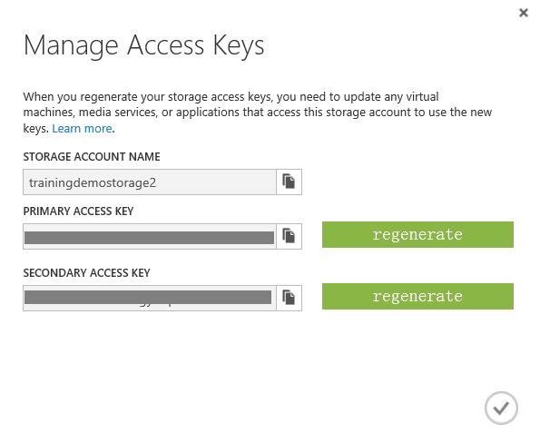

    _Get Another Storage Account Access Key_

1. Add the storage account to Azure Storage Explorer again and create a new container in the new storage account.

    

    _Create A New Container_

1. Then we want to use AzCopy to copy all files from the old container to the new container. Execute the following command in command line:

    <pre>
        AzCopy https://<sourceaccount>.blob.core.windows.net/<sourcecontainer>/ https://<destaccount>.blob.core.windows.net/<destcontainer>/  /sourcekey:<key> /destkey:<key> /S
    </pre>

    Replace all fields according to your configuration. The above command will copy all blobs from the container named "sourcecontainer" in storage account "sourceaccount" to another container named "destcontainer" in storage account "destaccount".

    
    

    _AzCopy Between Storage Accounts_

    Let's go to the Azure Storage Explorer again and you will find all files are copied to the new container.

    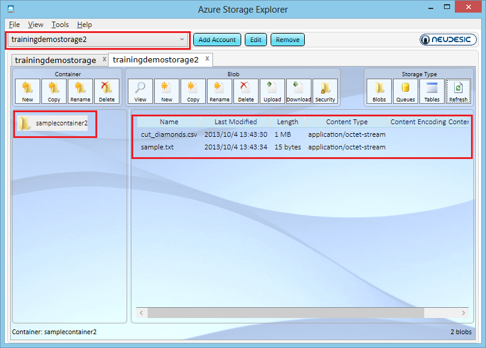

    _Check Result in Azure Storage Explorer_

AzCopy also support many other features like move, snapshot and multiple network calls. For more details, please refer to the AzCopy [page](http://blogs.msdn.com/b/windowsazurestorage/archive/2013/04/01/azcopy-using-cross-account-copy-blob.aspx).

---

## Summary ##

By completing this hands-on lab you learned the following:

- Use Azure Storage Explorer to manage your storage accounts.
- Use IPython notebook to run storage commands.
- Use AzCopy to Copy files between different storage accounts.

Copyright 2013 Microsoft Corporation. All rights reserved. 
Except where otherwise noted, these materials are licensed under the terms of the Apache License, Version 2.0. You may use it according to the license as is most appropriate for your project on a case-by-case basis. The terms of this license can be found in [http://www.apache.org/licenses/LICENSE-2.0](http://www.apache.org/licenses/LICENSE-2.0).
