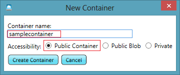
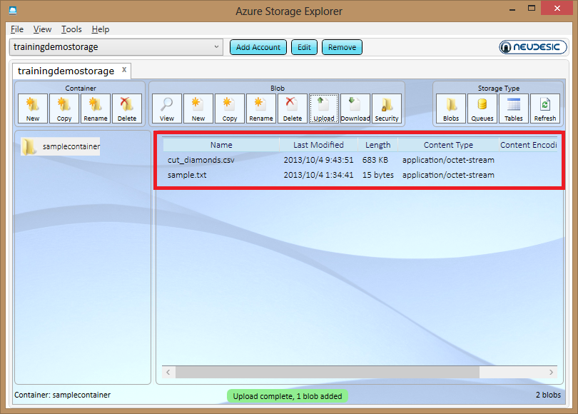
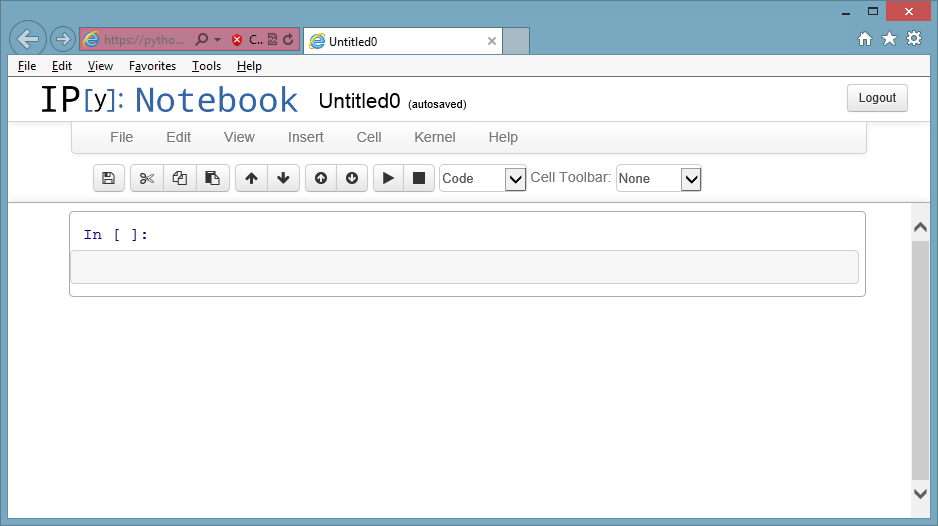
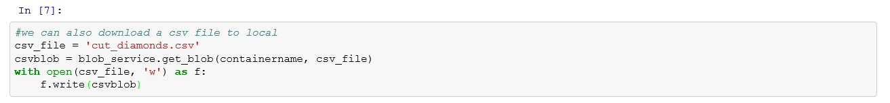
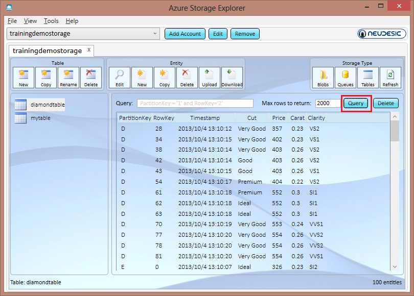

<a name="HOLTitle"></a>
# Manage Windows Azure Storage #

---
<a name="Overview"></a>
## Overview ##

Windows Azure Storage is designed for cost-effectively storing and retrieving large volumes of data while providing ease of access and durability. It offers non-relational data storage including Blob, Table, Queue and Drive storage. In this lab, you will learn to use different tools to manage Windows Azure Storage Service. 

<a name="Objectives"></a>
### Objectives ###

In this hands-on lab, you will learn how to:

- Use Azure Storage Explorer to manage your storage accounts.
- Use IPython notebook to run storage commands.
- Use AzCopy to Copy files between different storage accounts.

<a name="Prerequisites"></a>
### Prerequisites ###

The following is required to complete following item:

- A Windows Azure subscription - [sign up for a free trial](http://aka.ms/WATK-FreeTrial)

---
<a name="Exercises"></a>
## Exercises ##

This hands-on lab includes the following exercises:

1. [Use Azure Storage Explorer to manage your storage accounts.](#Exercise1)
1. [Use IPython notebook to run storage commands.](#Exercise2)
1. [Use AzCopy to Copy files between different storage accounts.](#Exercise3)


Estimated time to complete this lab: **60** minutes.

<a name="#Exercise1"></a>
### Excercise 1: Use Azure Storage Explorer to manage your storage accounts.  ###

Azure Storage Explorer is a useful GUI tool for inspecting and altering the data in your Windows Azure Storage storage projects including the logs of your cloud-hosted applications. All 3 types of cloud storage can be viewed and edited: blobs, queues, and tables. 

1. Azure Storage Explorer can be downloaded from [CodePlex](http://azurestorageexplorer.codeplex.com/). 

	

	_Azure Storage Explorer Page_

    Now the latest version is 4.0, but you can also download the preview version.

1. Download *Azure Storage Explorer 4* and install it.

	> The Azure Storage Explorer can only be installed on Windows machine.

	

	_Install Azure Storage Explorer_

1. Before you launch the tool, you need to know your storage account's name add access key. You can find your storage account name and acess key in your Windows Azure Management Portal.

	

	_Windows Azure Storage Account_
	
	Click the "Manage Access Keys" button under the page, then you can get your storage account name and access key.

	

	_Manage Access Key_	

	>If there is no storage account under your subscription, you can just click **New** -> **Data Service** -> **Storage** -> **Quick Create** to create one.
	>
	>
	>
	>_Create A Storage Account_	

1. Launch *Azure Storage Explorer*.
	
	

	_Azure Storage Expolor_

1. Then Click "Add Account" button on the top and input your account name and access key in the form, check the **Use HTTPS** and click "Add Storage Account".

	

	_Add Account Information_	

1. A new form will pop up to tell you it takes some time to scan the storage account if it is the first time you add the storage account, just click OK. After several seconds, you can easily view all your blob, table and queue data in your storage account. 

	

	_New Storage Account Confirmation_

	

	_Manage Storage Account_

	Blob Service is managed by default, you can create, copy, rename or delete a container with the button on left top. Now let's create a sample container and upload a file to your storage account.

1. Click *New*, input the container name *samplecontainer* and set the *Accessibility* to be *Public Container*. Click *Create Container* and you will create a new container under the storage account. The "Public Container" means that everyone can access the file through a http link. If you don't want others to access files in the container, just set it to be private.
	
	

	

	

	_New Container_

1. Next, we will upload a new file to the new container. Click the new container on the left and click *Upload* button on the top.

	
	
	_Upload File_

1. You can locate any files on your drives. We have some sample files under **Source\Exercise1\** which you can upload. Please make sure you upload the file **cut_diamonds.csv** which will be used [Exercise 2](#Exercise2)

	
	
	_Uploaded Files_

	You can find the basic information of the file including name, last modified, length and content type. Actually it is called a **blob** in windows azure. Each storage account in Windows Azure can save up  to 200TB files and each file can be maximum 200GB.

1. Double click the file **Sample.txt** and you will find more information. You can find the properties and metadata. Since the file is a text file, so you can even see the content of the file in Windows Azure Storage Explorer.

	

	_File Property_

	

	_File Metadata_

	

	_The Content of a File_
	
1. On the top right side, you can also manage your table or queue in your storage account. You can create a new Queue or new Table, then add some queue message or table entity there. The process is quite simiar to blob. For more instructions of Queue or Table in Azure Storage Explorer, you can visit [AzureStorageExplorer4UserGuide.pdf](http://www.codeplex.com/Download?ProjectName=azurestorageexplorer&DownloadId=160664) for more details.

	

	_Azure Storage Explorer Queue Management_

	

	_Azure Storage Explorer Table Management_

<a name="#Exercise2"></a>

### Excercise 2: Use IPython notebook to run storage commands.  ###

IPython notebook is an interactive Python framework which makes Python project development and management much more easier. You can manage Windows Azure Storage Account in IPython as well. 

In order to build an IPython environment on windows azure, you can read  [http://www.windowsazure.com/en-us/develop/python/tutorials/ipython-notebook/](http://www.windowsazure.com/en-us/develop/python/tutorials/ipython-notebook/)

After the ipython notebook is deployed, you can open the IPython Notebook in your Explorer:


_IPython Notebook_

1. Create the button **New Notebook** on the top right, 

	

	

	_Create a New Notebook_

1. Next we are going to go use some Python code to manage the storage account that we created in Azure Storage Explorer. Open the file **Source\Exercise2\IPythonStorageManager.py** in a text editor and we will execute those commands step by step.

	

	_IPythonStorageManager Code_

1. First we need to set the *account* and *key* variable in the code. We've just learnt how to get those information from Windows Azure Management Portal in [Exercise 1](#Exercise1). Then we will run those code in IPython Notebook.

1. Excute the following code to imports all required libraries.

	````Python
		#first we import modules we require
		from azure.storage import *
		import os
		import csv
		import numpy
		from collections import defaultdict
		import time
	````

	

	_Import Libraries_

1. Then we set the private variables for the storage account

	````Python
		#put your account name and key here
		account = '[Your Storage Account Name]'
		key = '[You Storage Accunt Access Key]'		
		#get a handle to your account
		blob_service = BlobService(account_name=account, account_key=key)
	````
	

	_Set Variables_

1. We create a BlobService to manage all blobs in the storage account 

	````Python
		#get a handle to your account
		blob_service = BlobService(account_name=account, account_key=key)
	````
	

	_Create Blob Service_

1. Now we will list all blobs in the current storage account and container.We will print all blobs' name and full urls. 

	````Python
		#list all blobs of the container
		blobs = blob_service.list_blobs(containername)
		for blob in blobs:
		    print(blob.name)
		    print(blob.url)
     ````

	

	_List All Blobs_

	You can see that we get all files that we uploaded to the container in [Exercise 1](#Exercise1).

1. Next we are going to create a new file locally and upload the file to my storage account. We create a text file *sample2.txt* and then write *This is another sample* into it.

	````Python
		#create a new file a blob into a container
		open(r'sample2.txt', 'w').write("This is another sample")		
		#upload the blob into the container
		sampleblob2 = open(r'sample2.txt', 'r').read()
		blob_service.put_blob(containername, 'sample2.txt', sampleblob2, x_ms_blob_type='BlockBlob')		
     ````

	

	_Upload Blob_

	When the upload is done, we launch Azure Storage Explorer again and refresh current container. We can see a new file *Sample2.txt" appears in the container.

	

	_The Sample2.txt is Uploaded_

1. We can also delete the file in the container by following code.

	````Python
		#then we can remove sample2.txt
		os.remove(r'sample2.txt')
		#delete the blob remotely
		blob_service.delete_blob(containername, 'sample2.txt')
		#check the azure storage explorer again, the file is removed.	
     ````

	

	_Delete Blob_

	Again, in the Azure Storage Explorer again and refresh current container. We can see the file *Sample2.txt" disappears.

	

	_The Sample2.txt is Deleted_

1. The let's download the csv file to local and we can draw a scatter figure from the data.

	````Python
		#we can also download a csv file to local
		csv_file = 'cut_diamonds.csv'
		csvblob = blob_service.get_blob(containername, csv_file)
		with open(csv_file, 'w') as f:
    f.write(csvblob)	
     ````

	

	_Download Blob_

1. Then we load the data in csv from the csv library and draw a scatter plot based on its carat and price.


	````Python
		#then we draw a scatter from the csvfile
		columns = defaultdict(list) #we want a list to append each value in each column to
		with open(csv_file) as f:
		    reader = csv.DictReader(f) #create a reader which represents rows in a dictionary form
		    for row in reader: #this will read a row as {column1: value1, column2: value2,...}
		        for (k,v) in row.items(): #go over each column name and value 
		            columns[k].append(v) #append the value into the appropriate list based on column name k
		carat = np.array(columns['Carat'])
		price = np.array(columns['Price'])
		scatter(carat,price,marker ='o',color='#ff0000')
     ````

	

	_The carat and price scatter diagram_

1. Next we will also manage some table storage operation. Windows Azure Table storage is used to save many entities with different partition key and row key. It can be used as a NoSQL storage repository. First we are going to create a TableService object with the same account name and key name. We will also set the private variable to save a table name.

	````Python
		#Next we are going to demostrate the table storage management in Windows Azure
		#we can add top 100 rows of the cut_diamond csv to a table storage
		#get a handle to your account
		table_service = TableService(account_name=account, account_key=key)
		table_name = 'diamondtable';
     ````

	

	_Create Table Service_

1. Then we create a new table. First we will delete the table in case the table exists.
		

	````Python
		#delete the table for temporary data
		result = table_service.delete_table(table_name)		
		# create a new table to save all entities.
		result = table_service.create_table(table_name)	
     ````

	

	_Create New Table_

	We goto the Azure Storage Explorer again, click *Tables* and check the new table.

	

	_New Table is Created_

1. Now we will create 100 top entities and insert those entities into the new table. We will set each entity's partition key to be the diamond's color and row key is the index.

	````Python
		#then we insert the top 100 diamond into the table, we set PartitionKey to be each diamonds' color and RowKey to be the index
		index = 0
		with open(csv_file) as f:
		    reader = csv.DictReader(f) #create a reader which represents rows in a dictionary form
		    for row in reader: #this will read a row as {column1: value1, column2: value2,...}
		        entity = Entity()
		        entity.PartitionKey = row['Color']
		        entity.RowKey= str(index)
		        entity.Clarity = row['Clarity']
		        entity.Cut = row['Cut']
		        entity.Carat = row['Carat']
		        entity.Price = row['Price']
		        table_service.insert_entity(table_name, entity)
		        print row
		        index=index+1
		        if index >= 100:
		            break
		#we can check the azure storage explore to query all entities that we inserted.	
     ````

	

	_Insert Entities_

	In the Azure Storage Explorer, click *Query* button and you will find all entities are inserted.

	

	_Entities Are Inserted_

1. We are also perform query against the table. Now we want to get all diamonds information with D color. The code is followed:

	````Python
		#then we insert the top 100 diamond into the table, we set PartitionKey to be each diamonds' color and RowKey to be the index
		index = 0
		with open(csv_file) as f:
		    reader = csv.DictReader(f) #create a reader which represents rows in a dictionary form
		    for row in reader: #this will read a row as {column1: value1, column2: value2,...}
		        entity = Entity()
		        entity.PartitionKey = row['Color']
		        entity.RowKey= str(index)
		        entity.Clarity = row['Clarity']
		        entity.Cut = row['Cut']
		        entity.Carat = row['Carat']
		        entity.Price = row['Price']
		        table_service.insert_entity(table_name, entity)
		        print row
		        index=index+1
		        if index >= 100:
		            break
		#we can check the azure storage explore to query all entities that we inserted.	
     ````

	

	_Query Table_

Now we finished all operations. We can easily use IPython Notebook to manage all storage account on Windows Azure.
	

<a name="#Exercise3"></a>
### Excercise 3: Use AzCopy to Copy files between different storage accounts.  ###

AzCopy is another tool to manage azure storage account. It can be used to copy files from local to remote storage account or even between different storage accounts. For more inforamtion, please refer to [Windows Azure Storage Team Blog](http://blogs.msdn.com/b/windowsazurestorage/archive/2013/04/01/azcopy-using-cross-account-copy-blob.aspx).

1. AzCopy.exe is distributed as .NET assemblies, we can download the [CTP2](http://go.microsoft.com/fwlink/?LinkId=287086) version and extract to a local folder. It is a command line tool.

1. Create a new storage account under your subscription on Windows Azure Management Portal. Set the storage account name to a different name.

	

	_Create A New Storage Account_

1. Save its access key from the portal.

	

	_Get Another Storage Account Access Key_

1. Add the storage account to Azure Storage Explorer again and create a new container in the new storage account.

	

	_Create A New Container_

1. Then we want to use AzCopy to copy all files from the old container to the new container. Execute the following command in commnad line:

	````CommandPrompt
		AzCopy https://<sourceaccount>.blob.core.windows.net/<sourcecontainer>/ https://<destaccount>.blob.core.windows.net/<destcontainer>/  /sourcekey:<key> /destkey:<key> /S
	````

	Replace all fields according to your configuration. The above command will copy all blobs from the container named "sourcecontainer" in storage account "sourceaccount" to another container named "destcontainer" in storage account "destaccount".

	
	

	_AzCopy Between Storage Accounts_

	Let's go to the Azure Storage Explorer again and you will find all files are copied to the new container.

	

	_Check Result in Azure Storage Explorer_


AzCopy also support many other features like move, snapshot and multiple network calls. For more details, please refer to the AzCopy [page](http://blogs.msdn.com/b/windowsazurestorage/archive/2013/04/01/azcopy-using-cross-account-copy-blob.aspx).


---

<a name="summary"></a>
## Summary ##

By completing this hands-on lab you learned the following:

- Use Azure Storage Explorer to manage your storage accounts.
- Use IPython notebook to run storage commands.
- Use AzCopy to Copy files between different storage accounts.
