
# Using Microsoft Azure Cloud Service #

---

## Overview ##

In this hands-on lab you will create a cloud service on Microsoft Azure Cloud Service, aka Platform as a Service (PaaS). We will create a multi-tier application in Azure, defining multiple roles to distribute processing and allow flexible scaling. We will still implement to earthquake example in section 2. HOL Microsoft Azure Web Sites.

### Objectives ###

In this hands-on lab, you will learn how to:

- Understand Microsoft Azure Cloud Service.
- Deploy and manage a cloud service.

### Prerequisites ###

The following is required to complete this hands-on lab:

- A Microsoft Azure subscription - [sign up for a free trial](http://aka.ms/WATK-FreeTrial)
- (optional) If you have visual studio installed, you can read the source code and modify it according to your requirements. If you don't have, then you can just learn how to manage a cloud service from Microsoft Azure Management Portal. 

---

## Exercises ##

This hands-on lab includes the following exercises:

1. [Exercise 1: Create a Cloud Service.](#Exercise1)
1. [Exercise 2: Deploy a Cloud Service.](#Exercise2)
1. [Exercise 3: Manage a Cloud Service.](#Exercise3)

Estimated time to complete this lab: **60** minutes.

### Exercise 1: Create a Cloud Service.  ###

#### What is Cloud Service? ####

When you create an application and run it in Azure, the code and configuration together are called an Azure cloud service.

By creating a cloud service, you can deploy a multi-tier application in Azure, defining multiple roles to distribute processing and allow flexible scaling of your application. A cloud service consists of one or more web roles and/or worker roles, each with its own application files and configuration.

For a cloud service, Azure maintains the infrastructure for you, performing routine maintenance, patching the operating systems, and attempting to recover from service and hardware failures. If you define at least two instances of every role, most maintenance, as well as your own service upgrades, can be performed without any interruption in service. A cloud service must have at least two instances of every role to qualify for the Azure Service Level Agreement, which guarantees external connectivity to your Internet-facing roles at least 99.95 of the time. 

Each cloud service has two environments to which you can deploy your service package and configuration. You can deploy a cloud service to the staging environment to test it before you promote it to production. Promoting a staged cloud service to production is a simple matter of swapping the virtual IP addresses (VIPs) that are associated with the two environments. 

    
_Azure Cloud Services provides Platform as a Service_

#### Concepts ####

- **cloud service role**: A cloud service role is comprised of application files and a configuration. A cloud service can have two types of role:

- **web role**:A web role provides a dedicated Internet Information Services (IIS) web-server used for hosting front-end web applications.

- **worker role**: Applications hosted within worker roles can run asynchronous, long-running or perpetual tasks independent of user interaction or input.

- **role instance**: A role instance is a virtual machine on which the application code and role configuration run. A role can have multiple instances, defined in the service configuration file.

- **guest operating system**: The guest operating system for a cloud service is the operating system installed on the role instances (virtual machines) on which your application code runs.

- **cloud service components**: Three components are required in order to deploy an application as a cloud service in Azure:

- **service definition file**: The cloud service definition file (.csdef) defines the service model, including the number of roles.

- **service configuration file**: The cloud service configuration file (.cscfg) provides configuration settings for the cloud service and individual roles, including the number of role instances.

- **service package**: The service package (.cspkg) contains the application code and the service definition file.

- **cloud service deployment**: A cloud service deployment is an instance of a cloud service deployed to the Azure staging or production environment. You can maintain deployments in both staging and production.

- **deployment environments**: Azure offers two deployment environments for cloud services: a staging environment in which you can test your deployment before you promote it to the production environment. The two environments are distinguished only by the virtual IP addresses (VIPs) by which the cloud service is accessed. In the staging environment, the cloud service's globally unique identifier (GUID) identifies it in URLs (GUID.cloudapp.net). In the production environment, the URL is based on the friendlier DNS prefix assigned to the cloud service (for example, myservice.cloudapp.net).

- **swap deployments**: To promote a deployment in the Azure staging environment to the production environment, you can "swap" the deployments by switching the VIPs by which the two deployments are accessed. After the deployment, the DNS name for the cloud service points to the deployment that had been in the staging environment. 

- **minimal vs. verbose monitoring**: Minimal monitoring, which is configured by default for a cloud service, uses performance counters gathered from the host operating systems for role instances (virtual machines). Verbose monitoring gathers additional metrics based on performance data within the role instances to enable closer analysis of issues that occur during application processing. For more information, see How to Monitor Cloud Services.

- **Azure Diagnostics**: Azure Diagnostics is the API that enables you to collect diagnostic data from applications running in Azure. Azure Diagnostics must be enabled for cloud service roles in order for verbose monitoring to be turned on. 

- **link a resource**: To show your cloud service's dependencies on other resources, such as an Azure SQL Database instance, you can "link" the resource to the cloud service. In the Preview Management Portal, you can view linked resources on the Linked Resources page, view their status on the dashboard, and scale a linked SQL Database instance along with the service roles on the Scale page. Linking a resource in this sense does not connect the resource to the application; you must configure the connections in the application code.

- **scale a cloud service**: A cloud service is scaled out by increasing the number of role instances (virtual machines) deployed for a role. A cloud service is scaled in by decreasing role instances. In the Preview Management Portal, you can also scale a linked SQL Database instance, by changing the SQL Database edition and the maximum database size, when you scale your service roles.

- **Azure Service Level Agreement (SLA)**: The Azure Compute SLA guarantees that, when you deploy two or more role instances for every role, access to your cloud service will be maintained at least 99.95 percent of the time. Also, detection and corrective action will be initiated 99.9 percent of the time when a role instance's process is not running. For more information, see Service Level Agreements.

#### Create a new Cloud Service. ####

1. Open Azure Management Portal, Select New -> Compute -> Cloud Service -> Quick Create. Then input the URL name with a unique cloud service name. You can select the region you need to create your service before you click Create Cloud Service.
    
    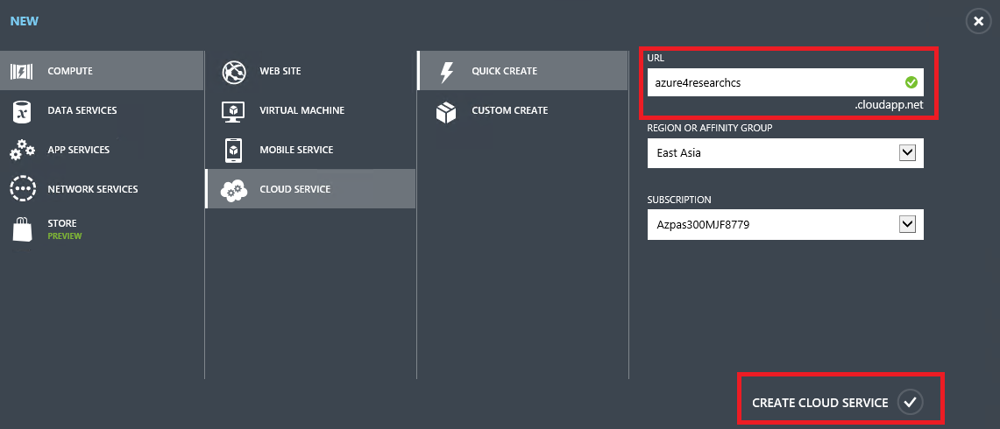
        
    _Create a new cloud service_

1. After couple of seconds, the cloud service is already created. It is an empty cloud service. You can click those tabs to have a basic idea for cloud service.

    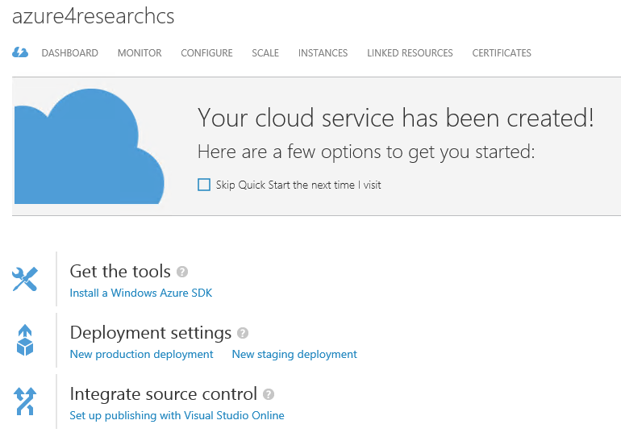
        
    _Cloud Service Overview_

### Exercise 2: Deploy a cloud service.  ###

Next we will deploy our earthquake cloud service project to Azure. As you already done in HOL 2. HOL Microsoft Azure Web Sites, you have already created a Django Website to get latest 20 earthquakes around the world and show it on your webpage. You can also click those pushpin to get all big earthquakes nearby. In this lab, we will implemented the same functions with ASP.NET web role and worker role. The web role has is the frontend and the worker role runs as a web job to run background jobs.

Here is the architecture of the system:

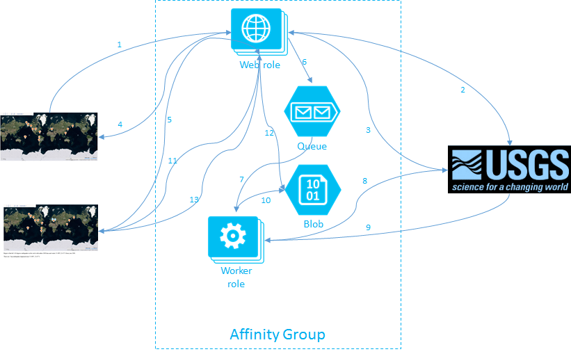
        
_Architecture of the system_

If you submit the request to get latest 20 earthquakes, the webrole will download a csv file from USGS website. It parses the file and show all locations for those earthquakes. The steps 1,2,3,4 illustrate the process.

When you click a pushpin, web role will add a new item to the queue. Then worker role will read the item from the queue and request all big earthquakes nearby and save the location information to blob storage. Steps 5 to 10 shows the process.

When the file in blob storage is ready, web role will grab the result file from the blog storage and show all locations, aka steps 11 to 13.

#### Setup configurations ####

We have all source code and packages under **Azure-training-course\Day 1\5. HOL Using Microsoft Azure Cloud Service\Source\EarthquakeCloudServiceSample**. If you have visual studio, you can open the project file **EarthquakeCloudServiceSample.sln**. You also need to install [Microsoft Azure SDK](http://go.microsoft.com/fwlink/p/?linkid=323510&clcid=0x804) to build the project. If you are using Mac or Linux, don't worry, we have already build the package for you. 

1. Open the folder **Azure-training-course\Day 1\5. HOL Using Microsoft Azure Cloud Service\Source\EarthquakeCloudServiceSample\EarthquakeCloudServiceSample\bin\Release\app.publish**. There are 2 files **EarthquakeCloudServiceSample.cspkg** and **ServiceConfiguration.Cloud.cscfg**. The cspkg file contains all binaries required for the cloud service and you can customize the settings by modifying some value in the cscfg file.

    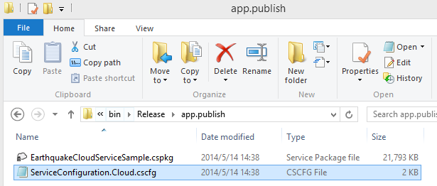
        
    _Packages_

1. Open the cscfg file and modify replace all the [storage account name] and [storage account key] according to your azure storage account. The storage account will be used for both web role and worker role.

    
    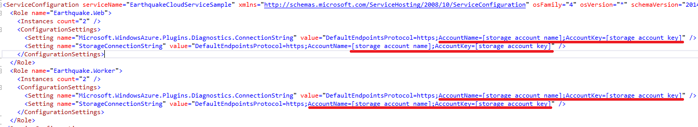
        
    _Configuration_

    ###If you don't know how to create a storage account and get the storage account name and key, please follow the  hands on lab in 4. HOL Manage Microsoft Azure Storage.

    
        
    _Get Storage Account Keys_

1. Then you need to upload those 2 files to the cloud service you just created. Click Dashboard -> Staging -> Upload.
    
    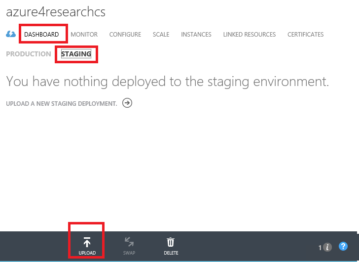        
    
    Set the deployment label with any name and select the package file and configuration files. Just use "From Local" button to upload the file from your local machine. For the checkbox "Deploy even if one or more roles contain a single instance.", you can check it in case the cloud service has only 1 instance for a web role or worker role.
    
    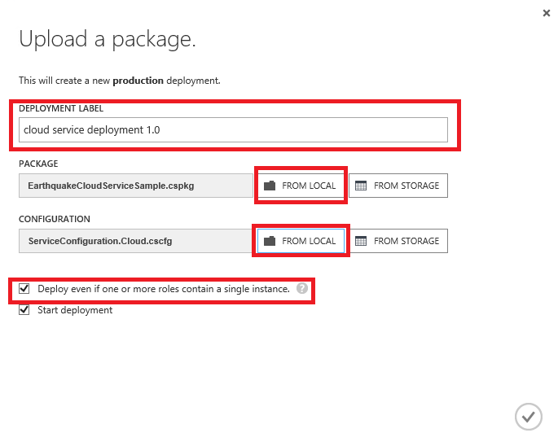
        
    _Upload package_

1. After about 10 minutes, depending on your network speed. The service will be deployed successfully. 

        
    
        
    _Deploy_

    You can check all instances in the cloud service after the deployment is done.

    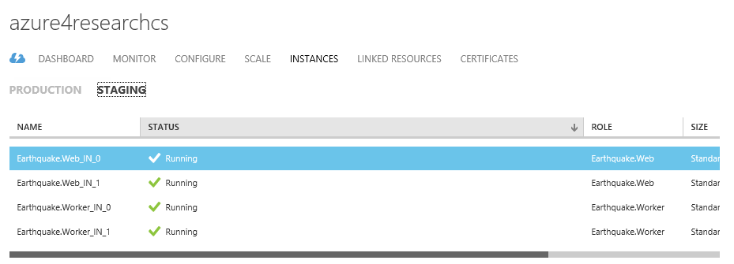

    _Deploy_
    
    We deployed a web role with 2 instances and a worker role with 2 instances as well. They are hosted in one cloud service and can be accessed by the cloud service DNS name. You can find the site url from **Site URL** section in the dashboard page. 

    You must notice that it is a random site url, not the name that we just set. It is because we still put it in the staging environment for testing.

    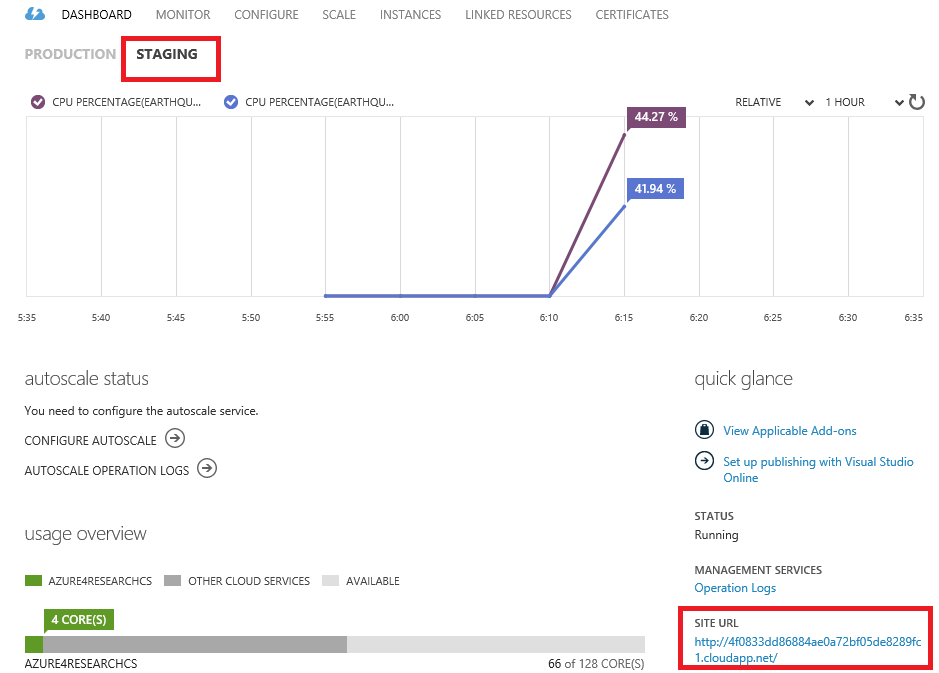

    _Site URL_

1. Click the Site URL to open the website.

    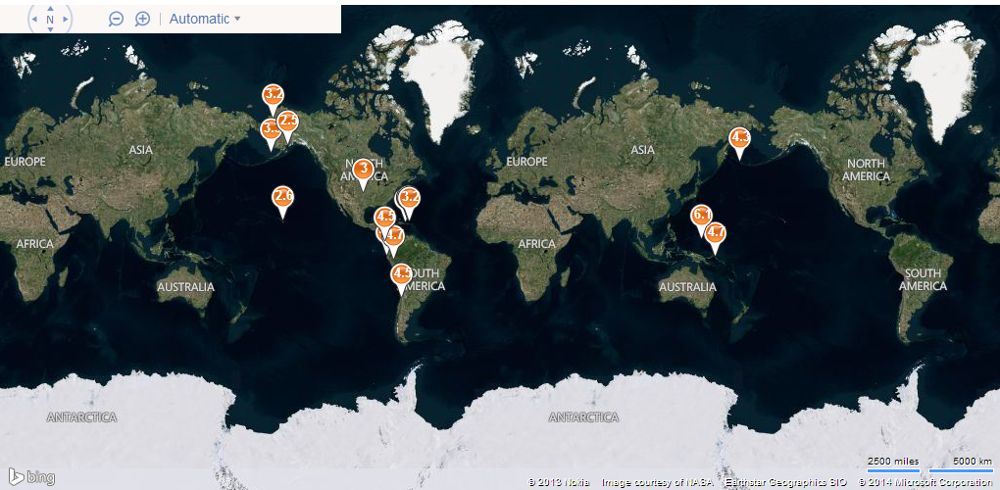

    _Main Page_

### Exercise 3: Manage a Cloud Service. OPTIONAL ### 

This is a follow up exercise to Exercise 3 of the Django lab under Day 1\2. HOL Microsoft Azure Web Sites. Please complete that lab first before continuing. 

The reason why we deploy it to staging environment is because we want to test the system before we formally release it. Next we test the system.

1. Click any pushpin's on the webpage. Then you will see the following notes: Submit a webjob to find 6 degrees earthquakes in the circle with radius 1000 kms and center x, y since year 2000. Waiting for the webjob result.

    

1. Wait for couple of seconds, the page is updated and you will also get some blue pushpins with the following notes: "There are n big earthquakes happened near x, y."
    
    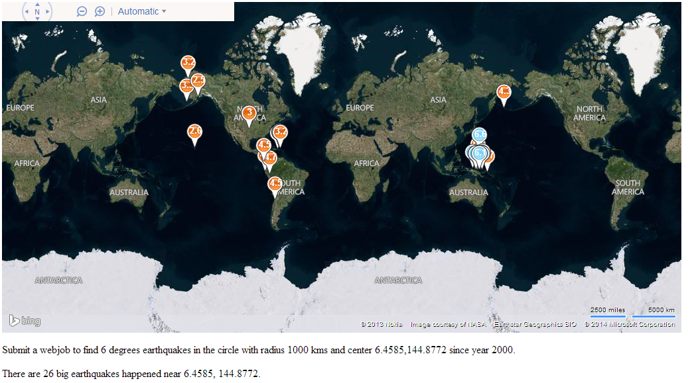
    
1. Let's navigate to the storage account that you set in the configuration and check the blob result. You can use Azure Storage Explorer that we introduced in the 4. HOL Manage Microsoft Azure Storage. You will see that we generated a temporary file **locations.txt** that saves all earthquakes near the point that you clicked. The file is in the container **earthquake**. Besides, we also have a queue called **webjobsqueue**, which saves the tasks from web role and worker role will grab the task from the queue and process.

    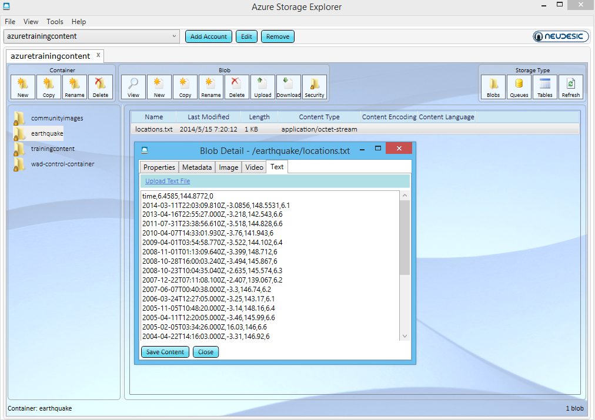

1. After the testing is done, what we need to do is to release it from the staging environment to production environment. On the dashboard of the cloud service, click **Swap** in the dashboard tool bar at the bottom. It will immediately swap the staging environment with production environment. Then you can visit the cloud service with a formal name, like [http://azure4researchcs.cloudapp.net](http://azure4researchcs.cloudapp.net)

    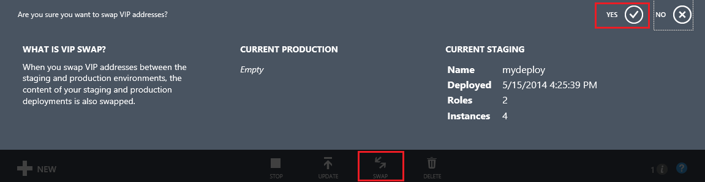

    Your cloud service is ready on Microsoft Azure now.

    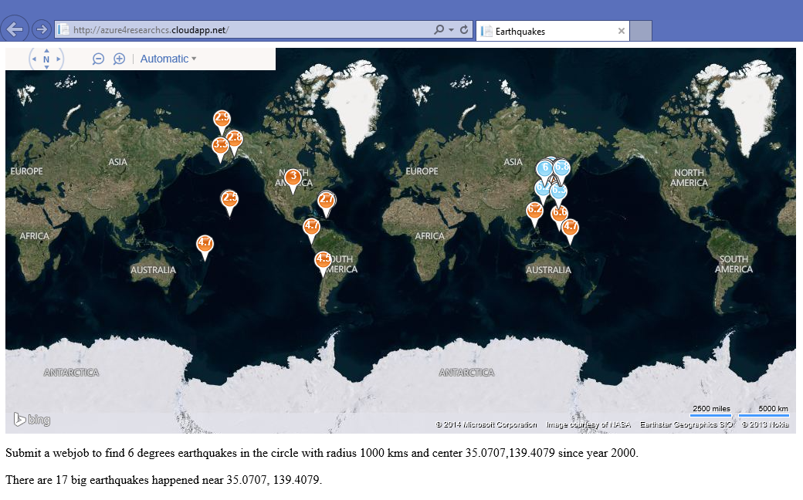
---

## Summary ##

By completing this hands-on lab you learned the following:

- Understand Microsoft Azure Cloud Service.
- Deploy and manage a cloud service.

Copyright 2014 Microsoft Corporation. All rights reserved. 
Except where otherwise noted, these materials are licensed under the terms of the Apache License, Version 2.0. You may use it according to the license as is most appropriate for your project on a case-by-case basis. The terms of this license can be found in [http://www.apache.org/licenses/LICENSE-2.0](http://www.apache.org/licenses/LICENSE-2.0).
