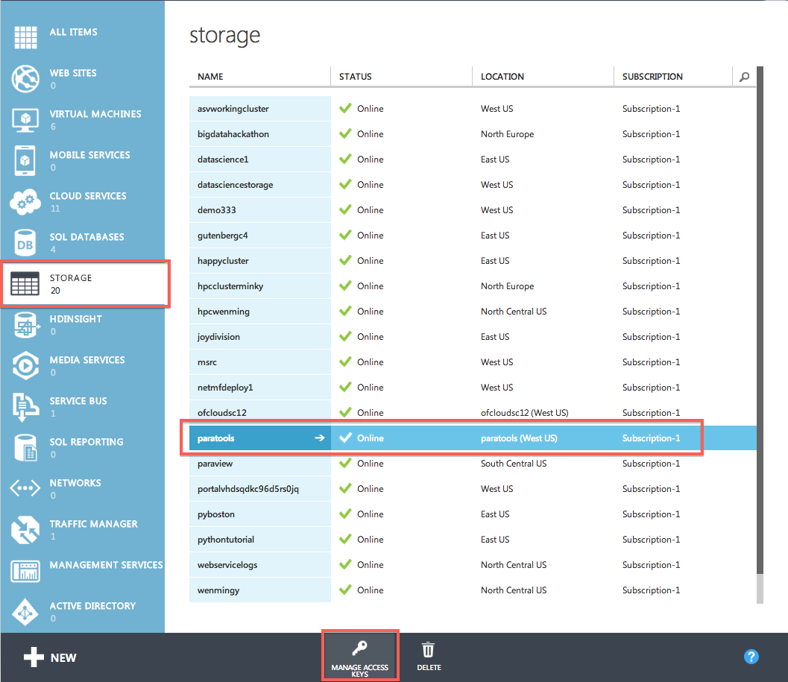
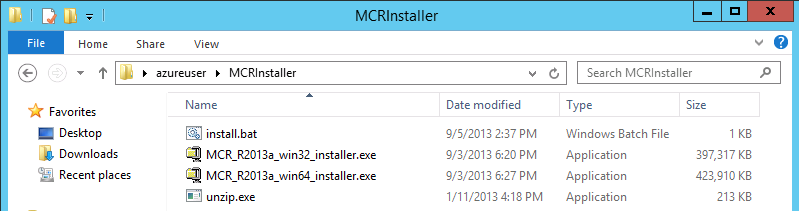
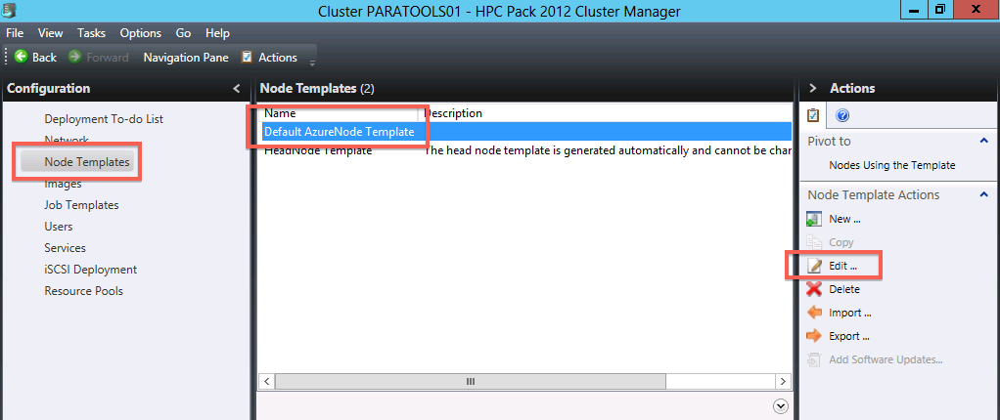
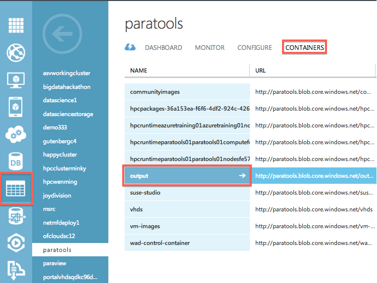
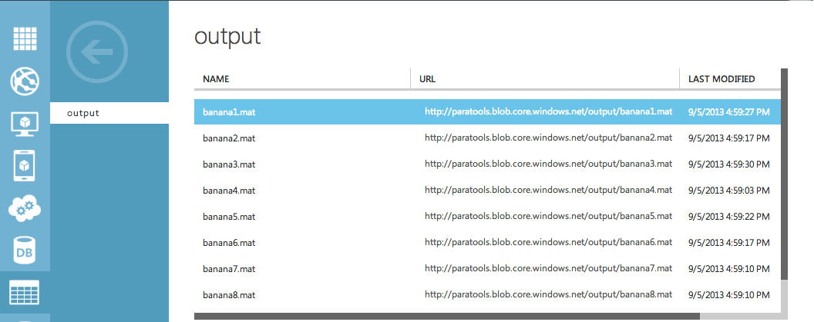

# Parametric Sweep with MATLAB and Microsoft HPC Pack #

In this example we'll show you how to perform a parametric sweep with MATLAB on a compute cluster of Windows Azure nodes.  The basic approach is to compile your MATLAB code (.m files) into a Windows binary executable that accepts the node ID as a command line argument, then use Microsoft HPC Pack to create and launch a parametric sweep job that runs the compiled MATLAB across the cluster.

Our example problem is a simple minimization of the Rosenbrock Banana function:

It has a global minimum at (x, y) = (1, 1) where f(x, y) = 0, but we're going to pretend we don't know that.  It's called the banana function because the minimal valley looks like a banana:

## Compile MATLAB Code Into an Executable ##

1. Download the training materials from https://github.com/jlinford/azuretraining/archive/master.zip to your MATLAB workstation.  

1. Extract master.zip to create the azuretraining-master folder.

1. Open azuretraining-master\hpc-matlab-sweep\sweep in Explorer and double-click **make.m** to open it in the MATLAB file editor.

   

1. Click the **Run** button to execute the **make** script to produce two executables: banana_sweep.exe and parallel_banana_sweep.exe.  Click **Change Folder** if you are prompted.

   
   
## Package Parametric Sweep Executable with Required Files ##
   
1. We'll need to transfer several files to the cluster head node, so open a Remote Desktop Connection to the head node from your MATLAB workstation.  Log in to the VM with the username and password you set when you created the VM, **not** the domain user you created before installing HPC Pack.  This will simplify the process later on.

1. On the head node, make a folder named **banana_sweep** to contain the parametric sweep executable and supporting files.

1. Transfer **parallel_banana_sweep.exe**, **run_sweep.bat**, **postprocess_parallel_banana_sweep.exe**, and **postprocess_sweep.bat** to the **banana_sweep** folder on the cluster head node.  The easiest way is to simply copy/paste the files from the workstation to the head node.

   
   

1. In the same way, transfer the contents of the **AzureBlobCopy** folder from your MATLAB workstation to **banana_sweep** on the cluster head node.  The banana_sweep folder should look like this:

   

1. Go to the [Windows Azure Management Portal](https://manage.windowsazure.com), click on **Storage Accounts**, select your storage account, and click on **Manage Access Keys** in the bar on the bottom.  Copy the primary access key.

   

1. Back on the cluster head node, open **banana_sweep/AzureBlobCopy.exe.config** in notepad.  In that file, replace **accountName** with your storage account name and **storageKey** with your storage account's primary access key.  Your AzureBlobCopy.exe.config file should look something like this:

        <?xml version="1.0"?>
        <configuration>
          <appSettings>
            <add key="StorageAccountName" value="azuretrainingstorage"/>
            <add key="StorageKey" value="ALongAndConvolutedStringOfRandomCharacters"/>
          </appSettings>
          <startup>
            <supportedRuntime version="v4.0" sku=".NETFramework,Version=v4.0"/>
          </startup>
        </configuration>

## Package the MCR Installer ##

1. Log in to the VM with the username and password you set when you created the VM, **not** the domain user you created before installing HPC Pack.  If you log in with a domain user, the following hpcpack commands will not work.

1. We need to collect several files in order to automate the MATLAB Compiler Runtime (MCR) installation.  On the cluster head node, make a folder named **MCRInstaller** in your home directory.

1. Go to http://www.mathworks.com/products/compiler/mcr/ and download the appropriate MCR installer executable to the **MCRInstaller** folder.  Download **both** the 32-bit and 64-bit versions of the package.  Both 32-bit and 64-bit packages are required because our MATLAB workstation is 64-bit, but the VM is 32-bit, so both 32-bit and 64-bit libraries will be called.  You can also download older versions of the MCR if you want to support older versions of MATLAB.

   * * * *
   > **IMPORTANT:** The MCR installation procedure for each version of MATLAB is unique.
   >
   > Check http://www.mathworks.com/support to find the installation procedure for your version.
   > The procedure given here is for MATLAB R2013a.
   * * * *

1. Run all downloaded MCR installers on the head node.  Run the installers and install to the default locations.

1. After the installation is complete, copy C:\Program Files (x86)\MATLAB\MATLAB Compiler Runtime\v81\bin\win32\unzip.exe to the MCRInstaller folder.  We need unzip.exe to extract the MCR installers on the cluster nodes.

1. Copy all the MCR installers to the MCRInstaller folder you created earlier.

1. Open notepad and create an installation script, **install.bat**, in the MCRInstaller folder that contains these lines:

        mkdir win32
        cd win32
        ..\unzip.exe ..\MCR_R2013a_win32_installer.exe
        .\bin\win32\setup.exe -mode silent -agreeToLicense yes
        cd ..

        mkdir win64
        cd win64
        ..\unzip.exe ..\MCR_R2013a_win64_installer.exe
        .\bin\win64\setup.exe -mode silent -agreeToLicense yes
        cd ..

    The same block of commands is repeated for the 32-bit and the 64-bit MCR installer.  For each installer, the package is unzip'ed into a new subdirectory.  Note that we call .\bin\winXX\setup.exe and **not** setup.exe in the package top-level.  The top-level setup.exe just launches a new process so it will ignore your command line arguments.  The "-agreeToLicense" argument is critical.  If it is not included, the installer will hang.

1. Verify the contents of the MCRInstaller folder.  It should be similar to this:

   

1. Open a Command Prompt window and navigate to the folder containing MCRInstaller.  For example, if you created the MCRInstaller folder in your home folder, navigate to your home folder.  We'll be using the [hpcpack](http://technet.microsoft.com/en-us/library/gg481764.aspx) command to distribute MCR to the cluster nodes.

1. Use [hpcpack create](http://technet.microsoft.com/en-us/library/jj899594.aspx) to package the MCRInstaller folder for distribution to the cluster nodes: 

        hpcpack create MCRInstaller.zip MCRInstaller

1. Use [hpcpack upload](http://technet.microsoft.com/en-us/library/jj899593.aspx) to upload the package to the storage account associated with the AzureNode template you created earlier:

        hpcpack upload MCRInstaller.zip /nodetemplate:"Default AzureNode Template" /relativePath:MCRInstaller
        
   Be sure to use the **/relativePath** parameter.  Otherwise the MCR installer packages will be placed on a path that involves a timestamp so it will be difficult to determine where the MCR installation files are.
   
   * * * * 
   > **NOTE:** Make sure you logged in as the right user.
   > 
   > If you get an "access denied" error when executing the above command, make sure you are logged in to the VM with the username and password you set when you created the VM and **not** any domain user.  As a work-around, you can replace the /nodetemplate parameter with the /account and /key parameters.  See the [hpcpack documentation](http://technet.microsoft.com/en-us/library/jj899593.aspx) for more information.
   * * * *
        
1. Use [hpcpack list](http://technet.microsoft.com/en-us/library/jj899577.aspx) to verify that the package is in your storage account:

        hpcpack list /nodetemplate:"Default AzureNode Template"

   Your console should look something like this after these commands:
   
   

## Create a Node Startup Script ##

1. We'll use a startup script to automatically install MCR when the Azure nodes boot.  Create **startup.bat** with the following contents:

        cd /D %CCP_PACKAGE_ROOT%\MCRInstaller
        .\install.bat

   When the nodes boot they will use the [hpcsync](http://technet.microsoft.com/en-us/library/gg481752.aspx) command to automatically download and unpack the MCRInstaller.zip package.  By default, hpcsync deploys files to a location on the Windows Azure nodes that is determined in part by the **%CCP_PACKAGE_ROOT%** environment variable. This variable is set on Windows Azure nodes during the provisioning process. The extracted files are placed in a folder that is determined as follows: %CCP_PACKAGE_ROOT%\<packageName>\<uploadTimeStamp>. This is the expected location for SOA services, XLLs, Excel workbooks, and startup scripts that are called from the node template.  However, because we passed "/relativePath:MCRInstaller" to our hpcpack upload command, MCRInstaller.zip will be unpacked to %CCP_PACKAGE_ROOT%\MCRInstaller.  We used relativePath because we cannot easily determine the <uploadTimeStamp> part of the default path.
   
1. Open a command prompt, navigate to the folder containing startup.bat, and package the startup script:

        hpcpack create startup.bat.zip startup.bat

1. Upload the startup script to your storage account:

        hpcpack upload startup.bat.zip /nodetemplate:"Default AzureNode Template"
        
1. Open the HPC Pack Cluster Manager.  On the **Configuration** page, select **Node Templates** from the list on the left, select **Default AzureNode Template** from the display in the center, and click **Edit...** under Node Template Actions on the right.

   

1. On the **Startup Script** Tab, enter **startup.bat** in the Startup script box and click **Save**.

   

## Add and Start Cluster Nodes ##

1. Open the Cluster Manager on the cluster head node.

1. On the Node Management page, select **Add Node** under Node Actions on the right.

1. Select **Add Windows Azure nodes** and click **Next**.

1. Verify that **Default AzureNode Template** is the selected template, enter **4** for the number of Windows Azure nodes, and select the **Medium** node size.  Click **Next** and click **Finish**.

   

1. Select the first **AzureCN** node from the node list and click **Start** under Node Actions on the right.

   
   
   You will be notified that a set of nodes is being started.  Verify that four nodes will be started and click **Start**.
1. The nodes are now provisioning (this will take a while).  Once the provisioning is complete, they will be in the "Unapproved" state.  To approve the nodes, select **all** the nodes and click **Bring Online** under Node Actions on the right.

   

1.  Once the nodes are online you'll be able run run jobs!  Note that the filesystem on the nodes is inconsistent with that of the head node.  Operating system files, program files, and user files are all stored on the **D:** drive, not the C: drive as you'd expect.

## Run the Parametric Sweep Job ##

1. Open a Command Prompt window and navigate to the folder containing the **banana_sweep** folder.  
        
1. Use **hpcpack create** to package the executable:

        hpcpack create banana_sweep.zip banana_sweep

1. Use **hpcpack upload** to upload the package to your storage account.  Use the /relativePath parameter to place parallel_banana_sweep.exe and supporting files in the **banana_sweep** folder on the compute nodes:

        hpcpack upload banana_sweep.zip /nodetemplate:"Default AzureNode Template" /relativePath:banana_sweep

1. Execute **hpcsync** on all cluster nodes via the [clusrun](http://technet.microsoft.com/en-us/library/cc947685.aspx) command.  This will download the new package from your storage account to all cluster nodes:

        clusrun /nodegroup:AzureNodes hpcsync
        
   You should see output similar to this when the command completes:
   
   

   parallel_banana_sweep.exe is now on the compute nodes and can be executed via a parametric sweep job.

1. Open the Cluster Manager on the head node.  On the **Job Management** page, select **New Parametric Sweep Job** from the list on the right.

   

1. Enter **Banana Sweep Task** as the task name.  

   

1. Under Step 1, set the Start Value to **1** and the End Value to **8**.  We will use eight parallel jobs since we have eight CPU cores in our cluster (four medium-sized nodes, two CPU cores per node).

   

1. Leave the Increment Value as **1**.

   

1. In the command line box, enter **run_sweep.bat 0.5 -4 5 -3 6 8 \***

   The command line arguments match the function parameters in the MATLAB code except that the last parameter (taskID) is given as an asterisk "*".  The job scheduler replaces the asterisk with sequential integer values in the range specified in the Step 1 section, in this case, the numbers 1, 2, and so on up to 8.  You can use this parameterization any way you like.  In this example, we're simply using it to specify the taskID.  The command line box should look like this:
   
   
   
   * * * *
   > **IMPORTANT:** The number of tasks is passed on the command line in this example.
   >
   > If you decide to change the end value for the sweep you must update the second to last
   > parameter on the command line.
   * * * *
   
1. Set the working directory to **%CCP_PACKAGE_ROOT%\banana_sweep**.  This folder was created automatically by hpcsync because we specified the /relativePath parameter when we executed our hpcpack upload command.

   
   
   * * * *
   > **IMPORTANT:** There is a 10GB limit on %CCP_PACKAGE_ROOT%.  
   >
   >If your job is going to write a lot of data to files in the working directory then you'll need to use a different working directory and write a batch script to copy files from %CCP_PACKAGE_ROOT% before running the job.
   * * * *

1. Leave the Standard input, Standard output, and Standard error fields empty.
   
1. Your "New Parametric Sweep Job" window should look like this with all fields completed.  Click **Submit**.

   

1. You can view the job progress by selecting the job and opening the **Activity Log**:

   
   
   As the job progresses, the allocation will be reduced on each node until the node is no longer needed.
   
      
   
1. Each task participating in the parametric sweep generated a MATLAB data file named **bananaX.mat**, where X is the taskID.  run_sweep.bat used AzureBlobCopy.exe to upload the output file to a new container named **output** in the storage account specified in AzureBlobCopy.exe.config.  You can see these output files in the Windows Azure Management Portal:

   
   

1. We need to post-process these data files to get our final answer (the minimum value of the Rosenbrock banana function).  On the head node, open a command line window.  Navigate to the **banana_sweep** folder and execute **postprocess_sweep.bat 8**.  The "8" is because we used 8 nodes.  Each of the output files will be downloaded from your Azure storage account and post-processed with the MATLAB executable.  The final answer is printed on the console:

   

© 2013 Microsoft Corporation. All rights reserved.
Except where otherwise [noted](http://creativecommons.org/policies#license), content on this site is licensed under a [Creative Commons Attribution-NonCommercial 3.0 License.](http://creativecommons.org/licenses/by-nc/3.0/)
