
# Creating a Linux virtual machine cluster and running simulation analysis with IPython Cluster #

---

## Overview ##

In this hands-on lab you will learn to deploy an IPython notebook cluster on Windows Azure. You will also execute the Monte Carlo simulation example with IPython Notebook on the cluster you created on Windows Azure.

### Objectives ###

In this hands-on lab, you will learn how to:

- Provision a Linux virtual machine cluster with Python.
- Deploy IPython notebook on your virtual machines.
- Run Monte Carlo Simulation on Ipython Notebook on Windows Azure.

### Prerequisites ###

The following is required to complete this hands-on lab:

- A Windows Azure subscription - [sign up for a free trial](http://aka.ms/WATK-FreeTrial)
- Lab: Using Windows Azure Virtual Machine

---

## Exercises ##

This hands-on lab includes the following exercises:

1. [Build an Environment to manage Windows Azure with Python](#Exercise1)
1. [Deploy IPython notebook on Windows Azure](#Exercise2)
1. [Run Monte Carlo Simulation on IPython](#Exercise3)

Estimated time to complete this lab: **60** minutes.

### Excercise 1: Build an Environment to manage Windows Azure with Python  ###

First, you will need to deploy required software on your linux machine. You are going to install git, Python 2.7, workerpool and paramiko, then you will connect Windows Azure by Python with some configuration. For the lab, we will either provide you with a shared virtual machine to do the exercise or let you provision a Linux virtual machine on Windows Azure to avoid issues with your laptop, etc.  Please remember this can be any Linux /Unix machine including your laptop. It is simply an environment you will use to deploy a cluster on Windows Azure. 

**In the case we provide you with a virtual machine to login, you will skip steps 5, 6, 7, 8 below and start with Azure subscription or Task 2 - Setup Windows Azure Subscription **

#### Task 1 - Deploy software on an Ubuntu Linux Server ####

1. On Windows Azure Management Porcal, click **New** -> **Compute** -> **Virtual Machine** -> **Quick Create**, input all required fields including *DNS Name*, *Image* = Ubuntu Server 12.04 LTS, *Size* = Small, *Password* and *Region*:

	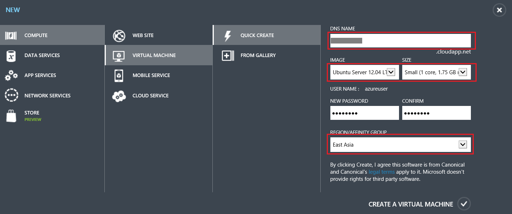

	_Create an Ubuntu VM_

1. After the machine is created, we can use [putty](http://www.chiark.greenend.org.uk/~sgtatham/putty/download.html) to connect to that machine from the DNS name. You can find the DNS name from the dashboard of the virtual machine. 

	

	_IPython Ubuntu DNS Name_

1. For Putty, you can download the [Windows installer for everything except PuTTYtel](http://the.earth.li/~sgtatham/putty/latest/x86/putty-0.63-installer.exe) and install it.

	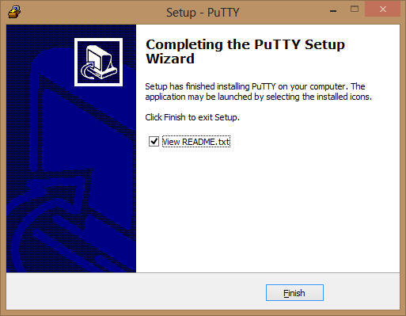

	_Install Putty_

1. Launch Putty and connect to the remote machine with the DNS name.
	
	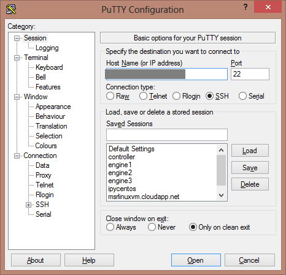

	

	_Connect Remote Machine_

1. Then we can execute following command to install git

    <pre>
	sudo apt-get install git	
	</pre>
	
	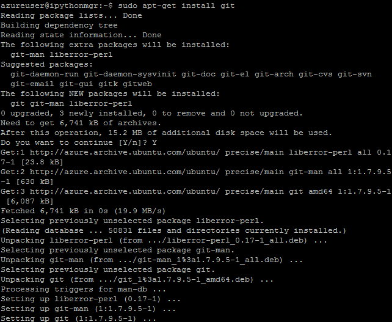

	_Install Git_

1. Execute following command to install Python Setup Tools.

    <pre>
	sudo apt-get install python-setuptools
	</pre>

	

	_Install Python Setup Tools_

1. Execute following commands to install Windows Azure SDK for Python

    <pre>
	git clone https://github.com/WindowsAzure/azure-sdk-for-python.git
    cd ~/azure-sdk-for-python/src/
    sudo python setup.py install
    </pre>
 
	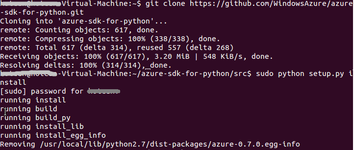

	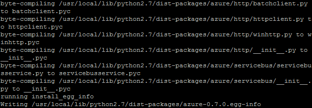

	_Install Windows Azure SDK for Python_

1. Install WorkerPool and Paramiko
	
	<pre>
	sudo easy_install workerpool
    sudo easy_install paramiko
	</pre>
 
	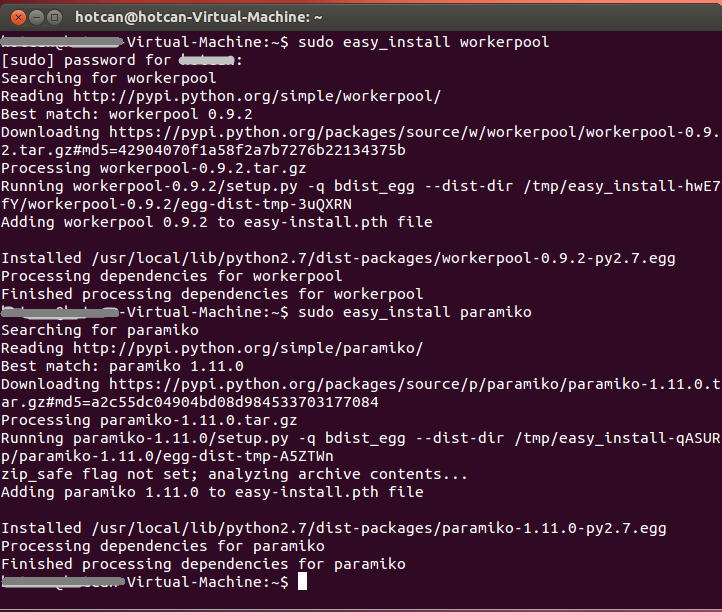

	_Install WorkerPool and Paramiko_

All software has been installed on your machine, next we setup to connect to Windows Azure Portal by Python.

#### Task 2 - Setup Windows Azure Subscription ####

1. To connect to the Service Management endpoint, you need your Windows Azure subscription ID and the path to a valid management certificate. You can obtain your subscription ID through the [management portal](https://manage.windowsazure.com/), and you can create management certificates in a number of ways. Here we use OpenSSL to create it.

	You actually need to create two certificates, one for the server (a .cer file) and one for the client (a .pem file). To create the .pem file, execute this:

    <pre>
	openssl req -x509 -nodes -days 365 -newkey rsa:1024 -keyout mycert.pem -out mycert.pem
    </pre>
 
	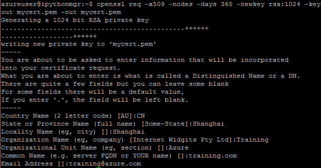

	_Create Client Certificate File(a .pem file)_

1. To create the .cer certificate, execute this:
	
	<pre>
	openssl x509 -inform pem -in mycert.pem -outform der -out mycert.cer
	</pre>
 	You can use ls to view the file you created.

	

	_Create Server Certificate File(a .cer file)_

	>For more information about Windows Azure certificates, see [Managing Certificates in Windows Azure](http://msdn.microsoft.com/en-us/library/windowsazure/gg981929.aspx). For a complete description of OpenSSL parameters, see the documentation at [http://www.openssl.org/docs/apps/openssl.html](http://www.openssl.org/docs/apps/openssl.html).

1. You need to use pscp to download the **mycert.cer** file to local for uploading to windows azure. Execute the following command in the command line:

	<pre>
	cd [Your Putty Folder]
	[Your Putty Folder]\pscp.exe -p [username]@[DNSName]:/home/[username]/mycert.cer mycert.cer
	[Your Putty Folder]\pscp.exe -p [username]@[DNSName]:/home/[username]/mycert.pem mycert.pem
	</pre>

	Just replace [Your Putty Folder],[username] and [DNSName].

	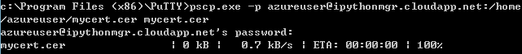

	_Donwload cer file_

	>If you get an error about "Cannot create file xxx", please run your command line in administrators mode and run again.
	

1. After you have downloaded the file *mycert.cer*, you will need to upload the .cer file to Windows Azure via the "Upload" action of the "Settings" tab of the management portal, and you will need to make note of where you saved the .pem file.

	

	

	

	_Upload .cer file to Windows Azure_

1. Please also note the subscription id for future use.

	

	_Get Subscription Id_

#### Excerise 2 - Deploy IPython Notebook on Windows Azure ####

The [IPython project](http://ipython.org/) provides a collection of tools for scientific computing that include powerful interactive shells, high-performance and easy to use parallel libraries and a web-based environment called the IPython Notebook. The Notebook provides a working environment for interactive computing that combines code execution with the creation of a live computational document. These notebook files can contain arbitrary text, mathematical formulas, input code, results, graphics, videos and any other kind of media that a modern web browser is capable of displaying.

Whether you're absolutely new to Python and want to learn it in a fun, interactive environment or do some serious parallel/technical computing, the IPython Notebook is a great choice. As an illustration of its capabilities, the following screenshot shows the IPython Notebook being used, in combination with the SciPy and matplotlib packages, to analyze the structure of a sound recording:

_IPython Notebook Spectral_

1. First we need to copy the toolkit under **Source\Ex02-DeployIPython** to local Ubuntu machine, then copy the **mycert.pem** to the same folder of the source.

1. Open the file **configSample.py** in gedit. You need to replace the subscription id with yours and the path to your private key file (**mycert.pem**).

	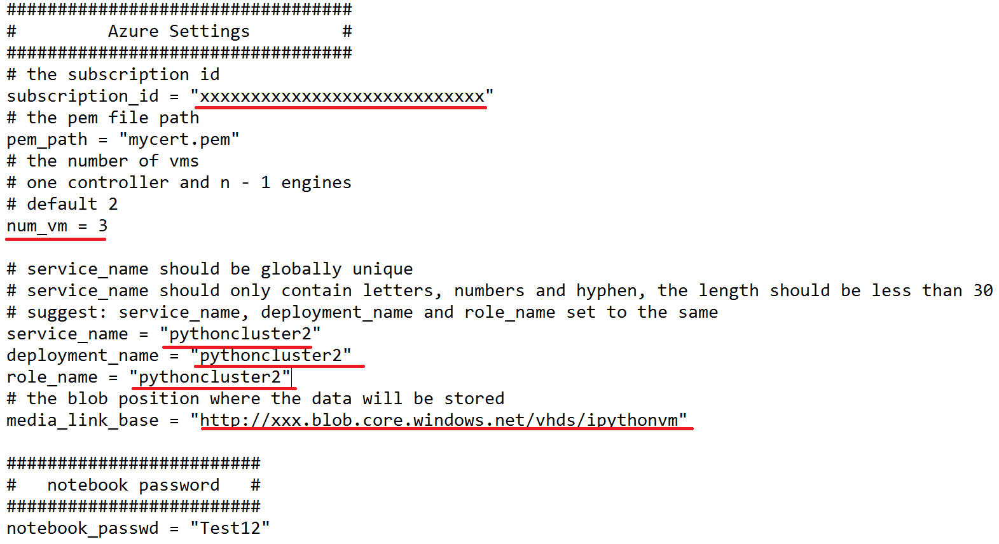

	_Edit configSample.py File_

	You may also need to change the following sections in that files including, **The number of nodes**, **The name of VM nodes**, **Service Name**, **Deployment Name**, **Role Name**, **Media Link Base**, **The password of the Notebook**.

	>For the "Media Link Base", you must set *xxx* in **http://xxx.blob.core.windows.net/vhds/ipythonvm** to your correct storage account. If you don't have any storage account under your subscription, you can just create one. Set the location to "East Asia" if you didn't change the default region in the **configSample.py** file. Now we set the number of nodes to 3, which means 1 controller and 2 engines.

	>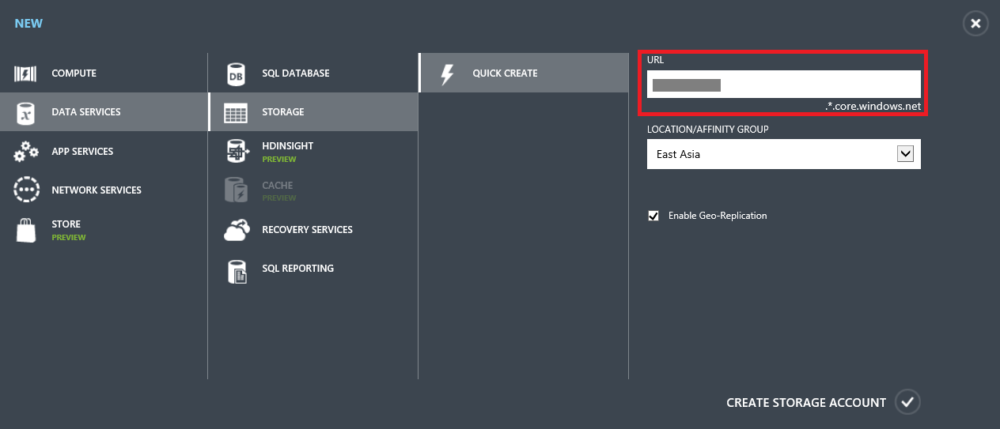

	>_Create Storage Account_

1. Next we need to upload all files under **Source\Ex02-DeployIPython**. First create a folder in Putty.

	<pre>
	cd ~
	mkdir Ex02-DeployIPython
	</pre>

	

	_Create Folder_
	
	Then we run following command in Comand line:
	
	<pre>
	"[You Putty Folder]\pscp.exe" -r "[Source\Ex02 filder]\*" [username]@[DNSName]:/home/[username]/Ex02-DeployIPython
	</pre>

	

	_Copy Files_

1. Execute **main.py** with following command:

	<pre>
	python main.py [start|create|deploy|delete]
	</pre>
	
	**start** creates VMs and deploy IPython; **create** just creates VMs; **deploy** deploys IPython on existing VMs depending on 'create'; **delete** removes all resources on Windows Azure.

	Now we execute with **start**.

	<pre>
	python main.py start
	</pre>

	

	_Execute Python Commands_

	At first, the **start** command creates a cloud service with the **Service Name** you defined in the configuration file. Then it creates 4 small instances in the cloud service. After those machines are launched, the code will connect to those machines and deploy required software and IPython Notebook automatically.

1. After about 10 minutes, the deployment is done. You will see the IPython cloud service is running in Windows Azure. There are 3 small instances running.

	

	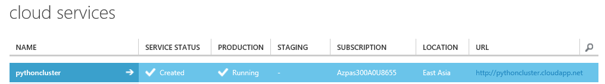

	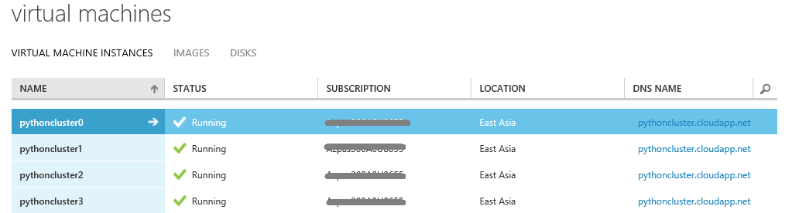

	_IPython Notebook is running on Windows Azure_

	Just click the link on windows azure and you will see IPython is ready. If you see warnings for certification issue, just ignore it and continue.

	

	_IPython Notebook_

#### Excerise 3 - Run Monte Carlo Simulation on IPython ####

Monte Carlo simulation is a computerized mathematical technique that allows people to account for risk in quantitative analysis and decision making. The technique is used by professionals in such widely disparate fields as finance, project management, energy, manufacturing, engineering, research and development, insurance, oil & gas, transportation, and the environment.

Monte Carlo simulation furnishes the decision-maker with a range of possible outcomes and the probabilities they will occur for any choice of action.. It shows the extreme possibilities—the outcomes of going for broke and for the most conservative decision—along with all possible consequences for middle-of-the-road decisions.

The technique was first used by scientists working on the atom bomb; it was named for Monte Carlo, the Monaco resort town renowned for its casinos. Since its introduction in World War II, Monte Carlo simulation has been used to model a variety of physical and conceptual systems. 

In this execise, you will run a Monte Carlo simulation code in your IPython notebook. This notebook shows how to use IPython.parallel to do Monte-Carlo options pricing in parallel. We will compute the price of a large number of options for different strike prices and volatilities, where each task will consist of computing the option price for a single strike price and volatility.

1. Login your IPython Notebook with your predefined password, it is **Test12** if you didn't change it.

	

	_Login IPython Notebook_

1. Create a new notebook. Execute the following command in a cell.

	<pre>
	!wget https://raw.github.com/wenming/BigDataSamples/master/ipythonMLsamples/Cluster%20-%20ParallelMCOptions.ipynb
	</pre>

	

	_Load Monte Carlo Simulation_

1. Click the Notebooks tab. There is a new notebook called **ParallelMCOptions-cluster**, click the notebook.

	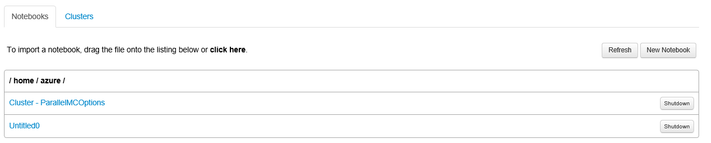

	

	_Cluster - ParallelMCOptions_

1. Click **Cell->Run All** to execute the sample. It will run the simulation in parallel.	

	

	_Execute Monte Carlo Simulation in Parallel on Azure_
	
	The IPython Notebook and IPython.parallel enable you to parallelize your code on a remote cluster using nothing more than a web browser. As this example shows, once you have a Python function that performs a unit of work, it is easy to invoke that function in parallel for different arguments. The example shown here is extremely simple; the full API is rich and powerful. Details can be found in the [IPython Documentation](http://ipython.org/ipython-doc/stable/parallel/index.html).
	
	After couple of minutes, you will see the result in the page.

	
	

	_Monte Carlo Simulation Result_

1. We can use SSH to controller and engines to check the CPU load for different machines. Run *top* command to check the most CPU consumption process.

	<pre>
		top
	</pre>

	During the Monte Carlo is executing, the ipengine consumes almost 100% CPU on all engine machines.

	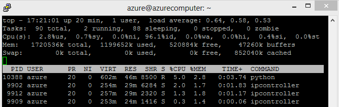
	
	

	

	_IPython Cluster CPU consumption_

---

## Summary ##

By completing this hands-on lab you learned the following:

- Provision Virtual machines with Python.
- Deploy IPython notebook on your virtual machines.
- Run Monte Carlo Simulation on IPython in parallel.

If you would like to read more about IPython cluster:  <http://ipython.org/ipython-doc/dev/parallel/parallel_process.html>

© 2013 Microsoft Corporation. All rights reserved.
Except where otherwise [noted](http://creativecommons.org/policies#license), content on this site is licensed under a [Creative Commons Attribution-NonCommercial 3.0 License.](http://creativecommons.org/licenses/by-nc/3.0/)
