# Use Microsoft HPC Pack to Create a Windows Azure Compute Cluster #

## Create an Affinity Group ##

_Affinity groups_ group your Windows Azure services to optimize performance. All services within an affinity group will be located close to each other in the same data center.  

For HPC, it's especially important to use affinity groups because because of how Windows Azure Data Centers are designed.  Basically, Windows Azure Data Centers are built using "containers" full of clusters and racks. Each container has specific services, i.e. Compute and Storage, SQL Azure, Service Bus, Access Control Service, etc. Containers are spread across the data center, so when we subscribe or deploy a service the _Fabric Controller_ (which chooses based on our solution configuration where the services should be deployed) can place our services anywhere in the data center.  This means that even if we choose the same data center for all our Azure services, we cannot guarantee that the services will be physically close together.  Using an Affinity Group tells the Fabric Controller that services should always be close together, thereby reducing latency and increasing performance.

> - - - - - - - - - - - - - - - - - - - - -
> **IMPORTANT**
> 
> You must create the affinity group before creating any other services.  Services are added to the affinity group at creation time, and once a service is created, you cannot add it to an affinity group.
> - - - - - - - - - - - - - - - - - - - - -

Here's how you do it:

1. Log in to the [Windows Azure Management Portal](https://manage.windowsazure.com).

1. Click the **Settings** tab, click **Affinity Groups** at the top, and click **Add** in the bottom panel.

   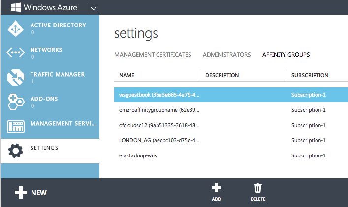

1. Enter the affinity name and select a region.  I prefer the West US region because that data center is relatively new.

1. Click the checkmark button to create the new affinity group.

   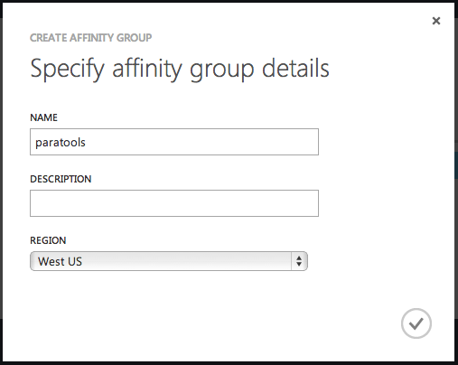

## Create a Storage Account ##

A _storage account_ gives your applications access to Windows Azure Blob, Table, and Queue services located in a geographic region. It represents the highest level of the namespace for accessing the storage services and can contain up to 100 TB of blob, queue, and table data.

Storage costs are based on storage utilization and the number of storage transactions required to add, update, read, and delete stored data. Storage utilization is calculated based on your average usage of storage for blobs, tables, and queues during a billing period.

Create a storage account in the affinity group:

1. In the Windows Azure Management Portal, click the **Storage** tab and click **New** in the bottom panel.

   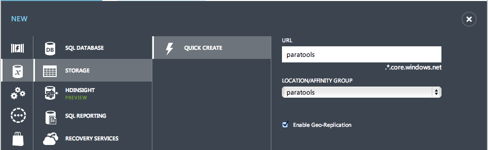

1. Click on **Quick Create**, enter the storage URL, and select the affinity group you created in the previous step.

1. Click **Create Storage Account** to create the new account.

## Create a Windows Server 2012 Datacenter Virtual Machine ##

A _virtual machine (VM)_ in Windows Azure is a server in the cloud that you can control and manage. After you create a virtual machine in Windows Azure, you can delete and re-create it whenever you need to, and you can access the virtual machine just like any other server.  Virtual hard disks (.vhd files) are used to create a virtual machine.  You can use the following types of virtual hard disks to create a virtual machine:

- _Image_ An image is a template that you use to create a new virtual machine. An image doesn’t have specific settings like a running virtual machine, such as the computer name and user account settings. If you use an image to create a virtual machine, an operating system disk is automatically created for the new virtual machine.
- _Disk_ A disk is a VHD that you can boot and mount as a running version of an operating system. After an image is provisioned, it becomes a disk. A disk is always created when you use an image to create a virtual machine. Any VHD that is attached to virtualized hardware and that is running as part of a service is a disk.

We will create a Windows Server 2012 Datacenter VM from the Windows Server 2012 Datacenter image to serve as the HPC compute cluster's _head node_.  The 

1. Log in to the [Windows Azure Management Portal](https://manage.windowsazure.com).

1. Click on the **Virtual Machines** tab and click on **New** in the bottom panel.

   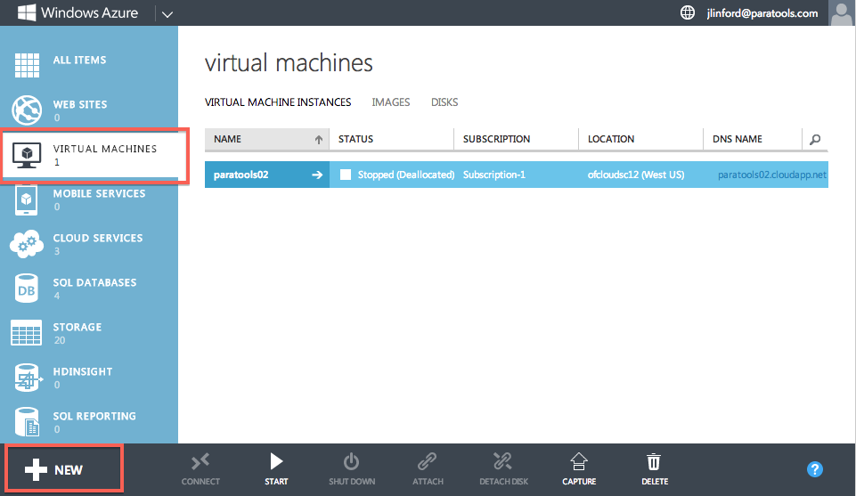

1. Click on **Compute**, **Virtual Machine**, then **Quick Create**.

1. Enter the DNS name, select **Windows Server 2012 Datacenter** in the Image drop down box, select the **Large** machine size, enter the username and password you will use to connect to the VM, and select the affinity group from the drop down list.

   

   Azure will automatically provision and boot the VM once it is created.  It will take a few minutes for the new VM to be provisioned.  You should see your new VM in the virtual machines listing when it is done.

> - - - - - - - - - - - - - - - - - - - - -
> **INFO**
> 
> Creating a VM in this way accomplishes several important tasks for you automatically.  First, a [virtual hard disk](http://technet.microsoft.com/en-us/library/dd979538.aspx) (VHD) file has been created for you in [blob storage](http://msdn.microsoft.com/en-us/library/windowsazure/ee691964.aspx).  When you create files in the VM, this is where they are actually stored.  Secondly, a cloud service has been created for you so you can reach your VM at http://your-vm-name.cloudapp.net/.
> - - - - - - - - - - - - - - - - - - - - -
   
## Connect to the VM with Remote Desktop Connection ##

1. Once your VM has been created and started, go to the **Virtual Machines** tab and select it.

1. With the VM selected, click **Connect** in the bottom panel to download an RDP file to your local machine that tells the Remote Desktop Connection Client how to connect to the new VM.

   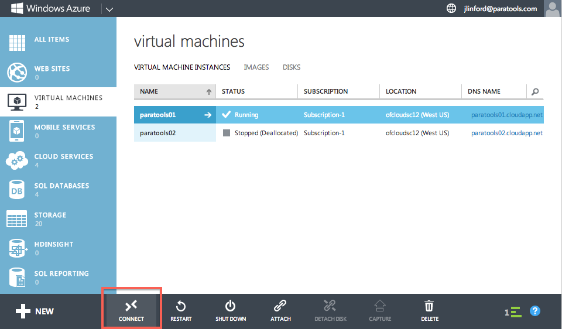
   
1. Double-click the RDP file to open the connection.

   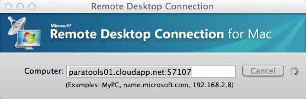
   
   When prompted for credentials, enter the username and password you gave when you created the VM.

   
   
   Don't worry if you see a certificate warning.  Just click **Connect**.
   
   

1. The Server Manager will open automatically once you're logged in.  Server Manager is your starting point for almost all management tasks in Windows Server 2012.

> - - - - - - - - - - - - - - - - - - - - -   
> **WARNING** 
>
> Remote Desktop Connection Client won't connect to unknown versions of Windows.  If you're being adventurous and created a VM with a preview version of Windows Server then you may not be able to continue.
> - - - - - - - - - - - - - - - - - - - - -

## Download Microsoft HPC Pack ##

We need a new Active Directory forest for your compute cluster.  In fact, Microsoft HPC Pack won't install without first promoting our new Windows Server 2012 to an Active Directory domain controller and adding a domain user.  Don't worry, this is easy.  We'll even work in parallel by downloading Microsoft HPC Pack to the VM while we install Active Directory.

1. Before you do anything, you need to disable Internet Explorer Enhanced Security Configuration so we can download files from the Internet.  In Server Manager, click on **Local Server**.  In the Properties pane, click the little blue word **On** next to **IE Enhanced Security Configuration**.  (You may need to scroll over if your screen resolution is low.)

   
   
   Select **Off** for both Administrators and Users and click OK.
   
   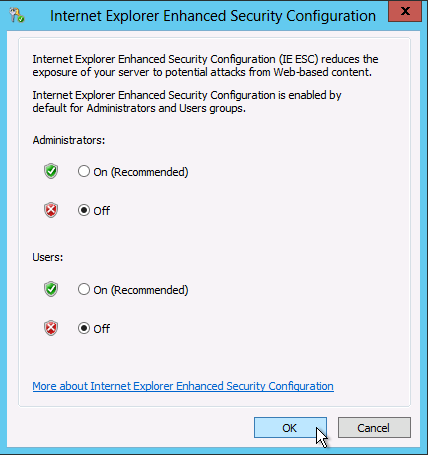

   Internet Explorer Enhanced Security Configuration places your server and Internet Explorer in a configuration that decreases the exposure of your server to potential attacks that can occur through Web content and application scripts. This is a good thing for servers, but unfortunately it makes IE effectively unusable on the Internet at large.  We have to disable this feature or we won't be able to download HPC Pack from the Microsoft website.  You can learn more about Enhanced Security Configuration [in this Technet article](http://technet.microsoft.com/en-us/library/dd883248.aspx).
   
1. Once IE ESC is disabled, open Internet Explorer and go to http://www.microsoft.com/en-us/download/details.aspx?id=36054.  Click **Download** and then click **Save** to begin the download.  The file is almost 2GB large, so continue to the next step and install Active Directory while the transfer completes.
   
   

## Install the Active Directory Role ##

While you're waiting for HPC Pack to download to the VM, we'll go ahead and install Microsoft Active Directory in the VM and configure a new Active Directory forest for your compute cluster.

1. In the Server Manager, click on **Manage** in the top-right corner and select **Add Roles and Features**
   
   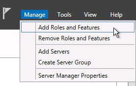
   
1. Click **Next** to skip the first screen.  (If you like, you may check the box at the bottom to skip this screen automatically next time.)

1. Select **Role-based or feature-based installation** and click Next.

   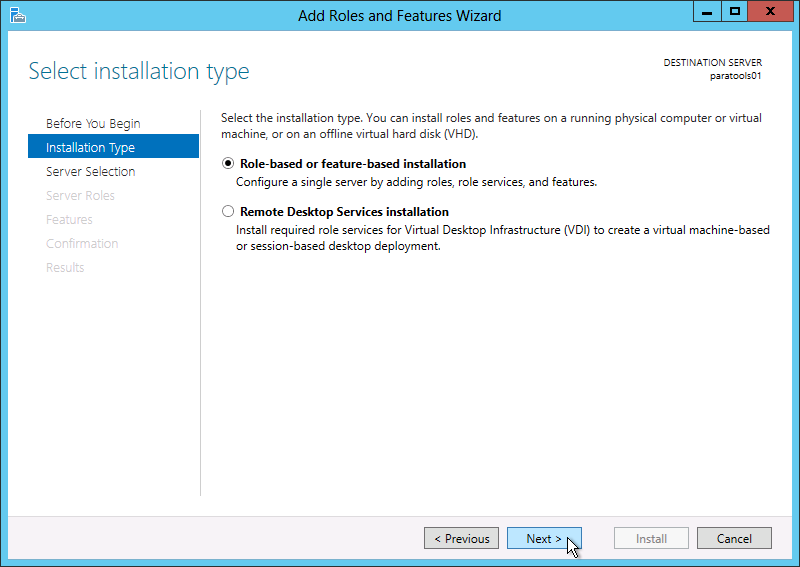

1. The head node will be automatically selected on the Server Selection tab.  Just click **Next** to continue.

   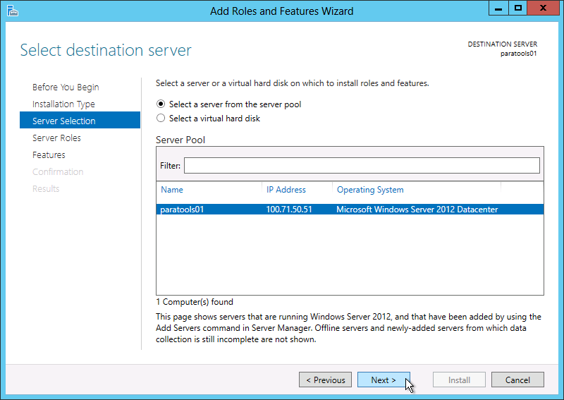

1. Check the box next to **Active Directory Domain Services** on the Server Roles tab.

   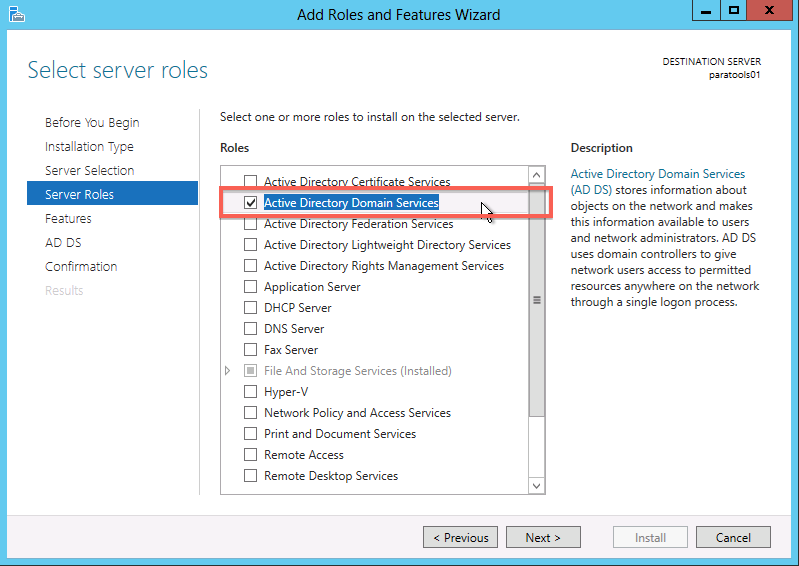
   
   Several features must also be installed to add the Active Directory role.  Click **Add Features** on the popup box to continue.
   
   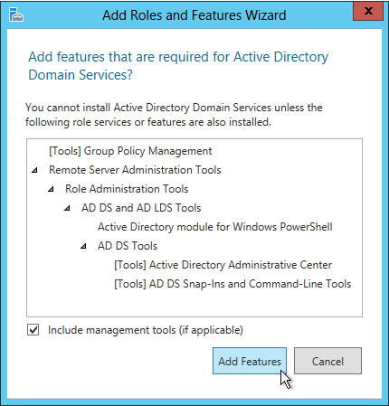
   
1. Click **Next** on the Features tab.  All the features you need have already been selected.

   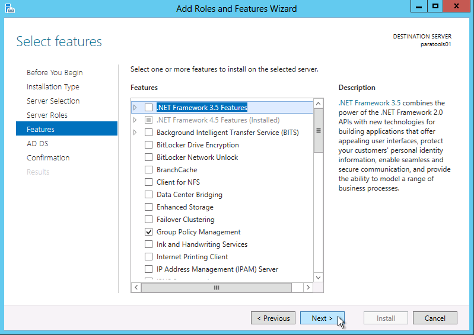
   
1. Click **Next** until you reach the Confirmation tab.  On the Confirmation tab, check the box labeled **Restart the destination server automatically if required** and confirm by clicking **Yes** on the popup box.

   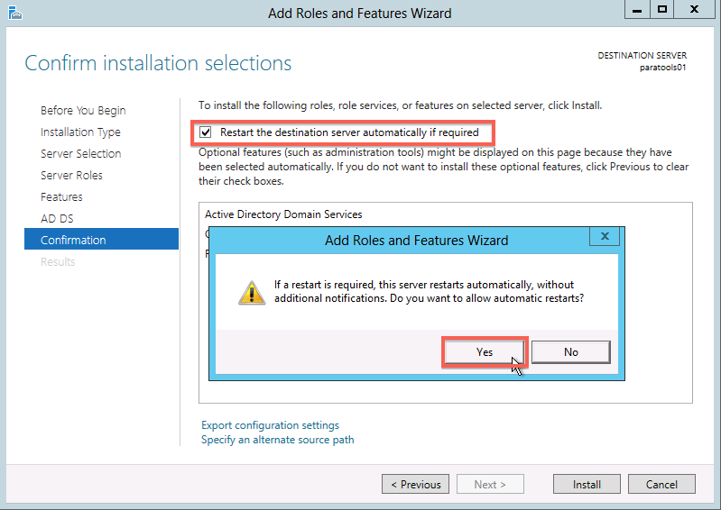
 
1. Click **Install** to begin the installation process.  This will take several minutes, so go grab a coffee or check your e-mail or something.  Note that you may be disconnected from the VM when it restarts.  Don't worry, if you get disconnected just double-click the RDP file we downloaded earlier to reconnect.

1.  Click **Close** to close the installation progress window.

## Promote the Server to a Domain Controller ##

We need to establish a new Active Directory domain for the HPC cluster.  To do that, we will promote the Windows Server 2012 VM to an Active Directory domain controller

1. After Active Directory installation is complete, you'll see a yellow sign appear in the notifications area of the Server Manager.  Click on it and select **Promote this server to a domain controller**

   
 
1. Select **Add a new forest**, specify the root domain name with a ".local" top-level domain (TLD) and click Next.

   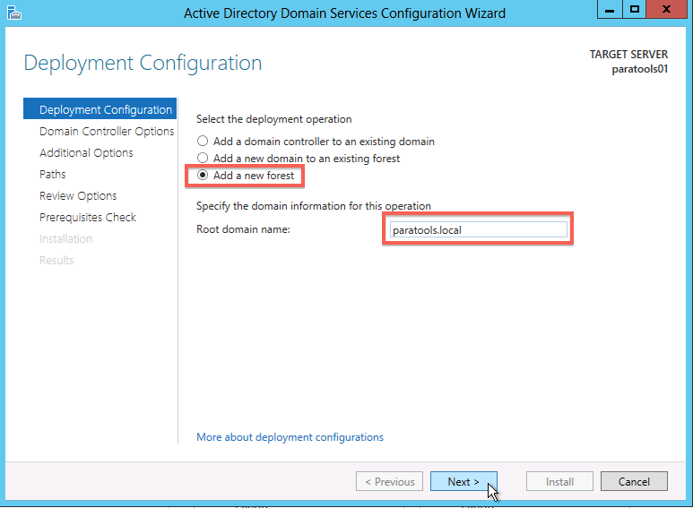
 
1. Wait for the Domain Controller Options tab to load, then enter the DSRM password and click Next.

   
   
1. Click **Next** until you reach the Prerequisites Check tab.  Don't worry about the warnings, just click **Install** to begin the installation.  Installation will take several minutes and may reboot the server a few times so this is a great chance to get another coffee.

   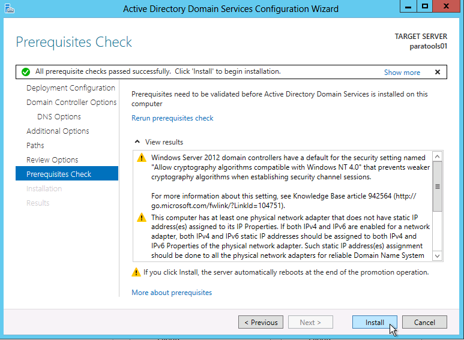
   
> - - - - - - - - - - - - - - - - - - - - -
> **NOTE**
> 
> If the VM restarts then your Remote Desktop Connection window will close.  If that happens, wait a few minutes to give the server a chance to boot up and then double-click the RDP file again to reopen the connection.  If the connection fails, wait a few more minutes.  It may take some time for the reboot to complete.
> - - - - - - - - - - - - - - - - - - - - -

   
## Add a Domain User Account ##

Microsoft HPC Pack needs to be installed from a domain user account, so we'll add a new administrator account to our new Active Directory domain.

1. Once the server has finished the promotion process, click on **Tools** in upper right corner of the Server Manager and select **Active Directory Users and Computers**.

   

1. In the Active Directory Users and Computers window, expand the domain name on the left side and select the **Users** container.  Click the icon in the toolbar to add a new domain user.

   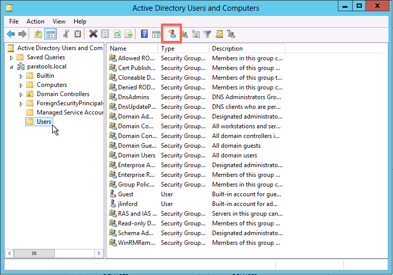

1. Give the user a first name and a user name and click **Next**.

   
   
1. Set the user's password, select the check boxes as shown, and click **Next**.

   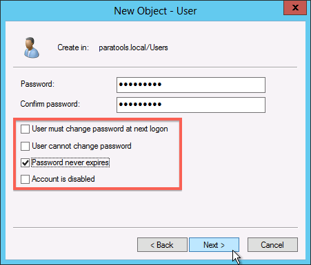
   
1. Click **Finish** on the final screen to create the user.  Close the Active Directory Users and Computers window.

1. We will be logging in to the VM as this user so we need to give this user permission to access the server as an administrator.  Open the control panel and click on **User Accounts**, then click on **Give other users access to this computer**.

   
   
      
   
1. Click the **Add...** button.  Enter the domain user's username and the name of the Active Directory Domain and click **Next**.

   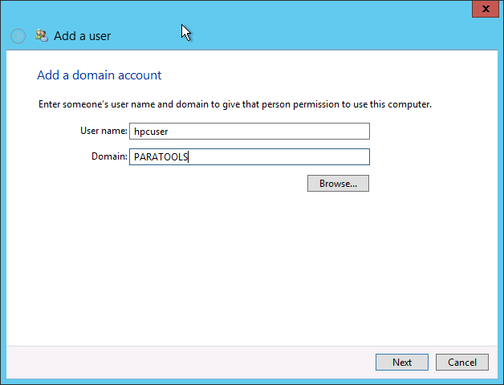
   
1. Select **Administrator** to give the domain user administrative privileges and click **Next**.

   
   
1. Click **Finish** to close the Add a user wizard window and then click **OK** to close the User Accounts window.

## Install All Critical and Important Updates ##

You're almost there, but before we can install Microsoft HPC Pack we need to make sure that all services are up to date.  Part of the HPC Pack installation process is to install various prerequisites and some of these prerequisites will fail to install if critical updates are not installed.

1. Open the control panel.  Click on **System and Security** and then click on **Windows Update**.

1. If important or critical updates are available, click the label listing the updates to open the update window, then click **Install** to begin the installation process.  Wait for installation to complete.

   
   
   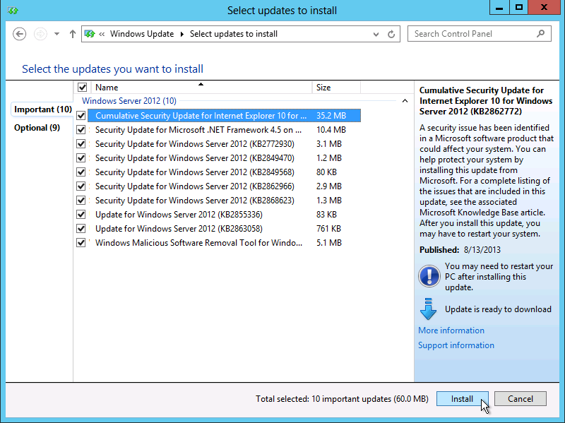
   
1. Once installation is complete, restart the computer.  Remote Desktop Connection will disconnect, so double-click the RDP file to reconnect to the VM.

1. Once you're reconnected, check again for critical and important updates.  Continue to install updates and reboot until no more updates are available.

## Install Microsoft HPC Pack ##

We're ready to install Microsoft HPC Pack!  The installation must be performed as a domain user, so disconnect from the virtual machine now.

1. Reconnect to the VM and log in with the domain account we created earlier.  The is _not_ the same account we have been using up to this point.  If you're connecting from a Mac, be sure to change the domain to the NetBIOS name of your Active Directory domain.

   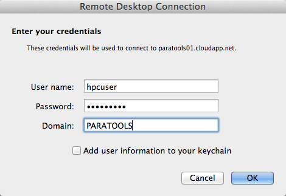

1. Once you're logged in as the domain user, open Explorer and navigate to C:\Users\<local-user-name>\Downloads.  If you are told you don't have access to the folder, just click **Continue** to get access.

   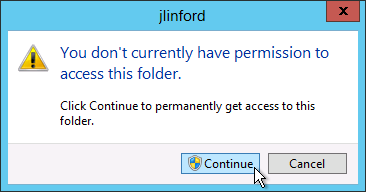
   
1. Locate the compressed file we downloaded earlier and right-click it.  Select **Extract All...** then click the **Extract** button to unpack the file.  It will take a few minutes to unpack everything.

   
   
1. After the files are extracted, double click the **HPC Pack** folder and then double click **setup** to begin installation.

1. Click on **New installation or add new features to an existing installation**.

   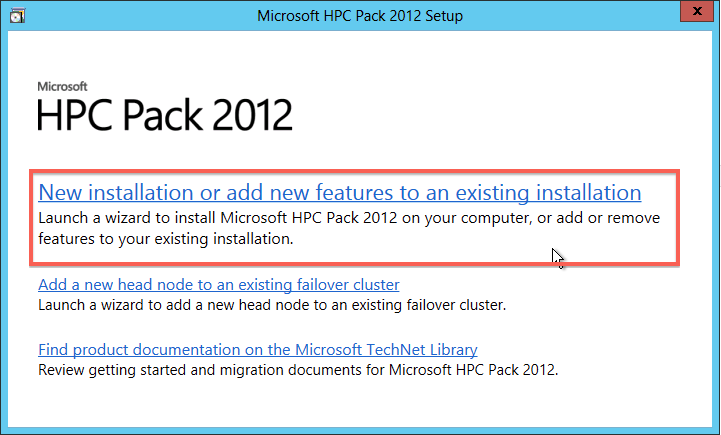

1. Click **Next**, then check the box to accept the license agreement and click **Next**.

1. Select **Create a new HPC cluster by creating a head node** and click **Next**.

   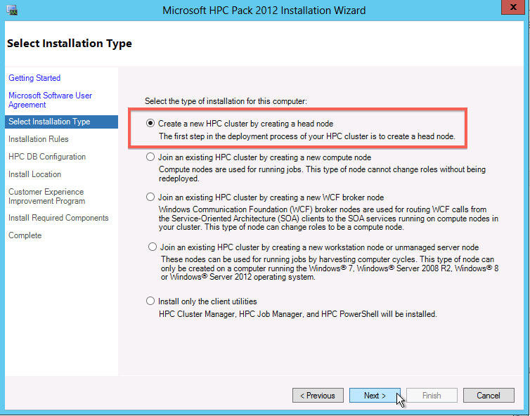

1. The installer will run a few prerequisite checks.  Click **Next** if all checks pass.  Otherwise, go back in this tutorial and make sure you have followed all steps exactly.

   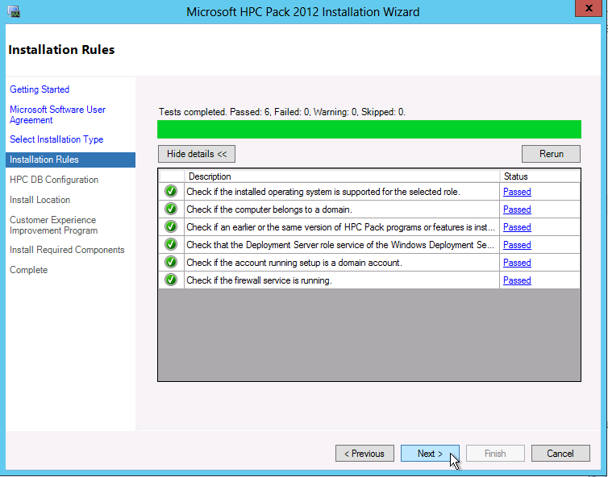

1. Make sure **Head Node** is selected for all HPC databases and click **Next**.

   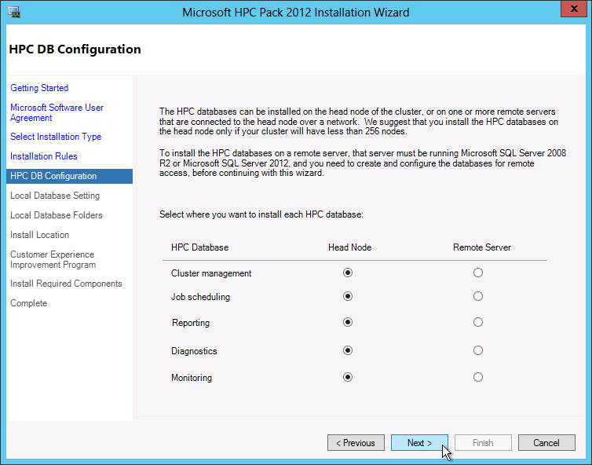

1. Click **Next** on the following tabs until you reach the Customer Experience Improvement Program tab.  Select either option and click **Next**.

   
   
1.  Click **Install** on the Install Required Components tab.  If you have followed this tutorial exactly you should see that only the Windows PowerShell prerequisite has bee installed so far.  The installation process will take several minutes.  Take another coffee break!

   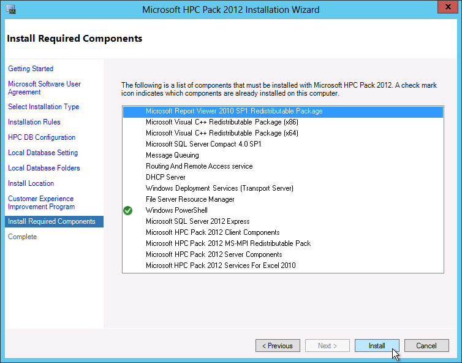

   > - - - - - - - - - - - - - - - - - - - - -
   > **IMPORTANT**
   > 
   > You may see an error like the one below during the installation process.  If so, reboot the VM and restart the HPC Pack installation using exactly the same steps as before.  It may take a few attempts, but it will eventually work.  Don't forget to log back in as the domain user when you reconnect!
   >
   > 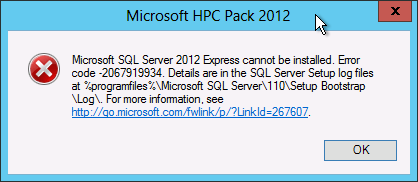
   > - - - - - - - - - - - - - - - - - - - - -

1. Click **Finish** to start the HPC Cluster Manager after the installation completes.

   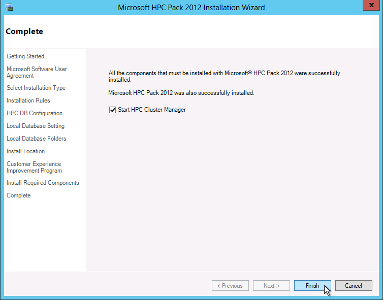.

## Upload the HPC Pack Management Certificate ##

We need a Windows Azure management certificate to authenticate the HPC cluster head node to Windows Azure so it can provision compute nodes.  The Default Microsoft HPC Azure Management certificate is generated automatically on the head node when HPC Pack is installed. This certificate is self-signed and unique to your installation of HPC Pack, so all we need to do is upload the certificate to the Windows Azure Management Portal.

1. Navigate to **C:\Program Files\Microsoft HPC Pack 2012\Bin** and locate the **hpccert** file.

1. Double-click the hpccert file and click the **Install Certificate…** button.

   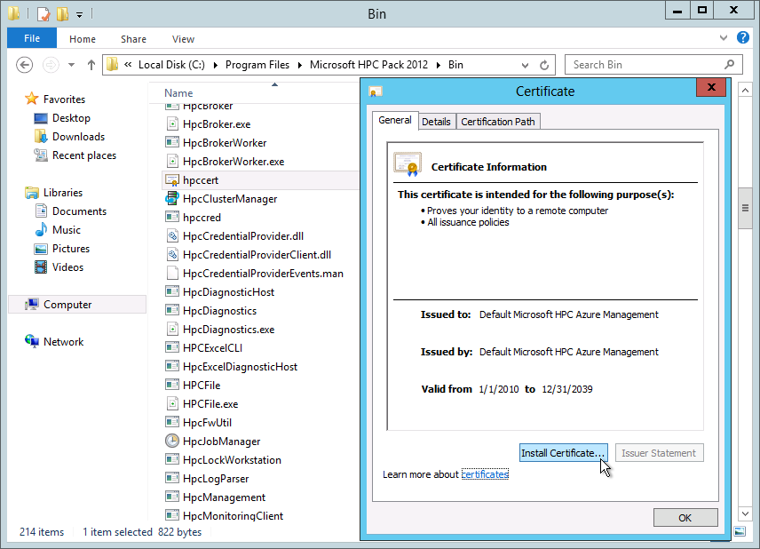

1. Select **Local Machine** and click **Next**.

   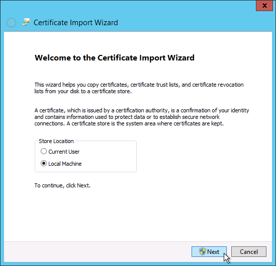

1. Click **Next** to let the wizard automatically select the certificate store.

1. Click **Finish** to import the certificate.

1. In the VM, log in to the [Windows Azure Management Portal](https://manage.windowsazure.com).

1. Click on the **Settings** tab to display management certificates associated with your subscription.

1. Click on **Upload**, use the file selection box to select the certificate file you copied from the VM, and click the check button to upload and add the management certificate.

   
   
## Create Cloud and Storage Services for Azure Compute Nodes ##

1. Log in to the [Windows Azure Management Portal](https://manage.windowsazure.com).

1. Click on **New** in the bottom panel.

1. Click on **Compute**, **Cloud Service**, **Quick Create**.

1. Enter the URL and click **Create Cloud Service**

   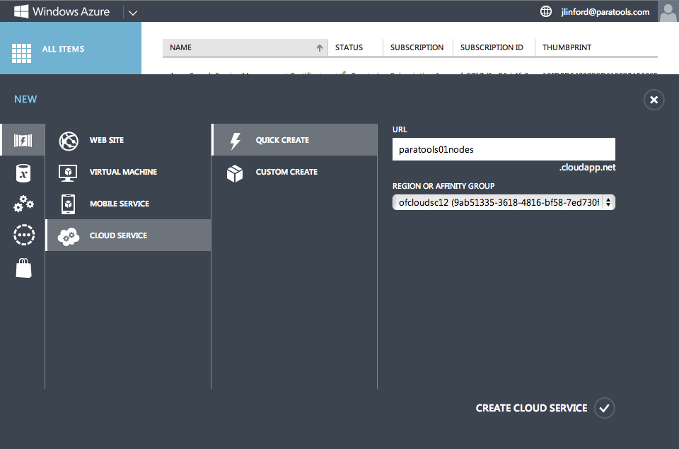

1. Again, click on **New** in the bottom panel.

1. Click on **Data Services**, **Storage**, **Quick Create**

1. Enter the URL and click **Create Storage Account**

   

## Configure Microsoft HPC Pack ##

1. On the VM, open the Cluster Manager.  In the popup box, select the local computer and click **OK**.

   

1. Click on **Configure your network** in the Required deployment tasks section of the Cluster Manager window.

   
   
1. Select the fifth cluster topology **All nodes only on an enterprise network** and click **Next**.

   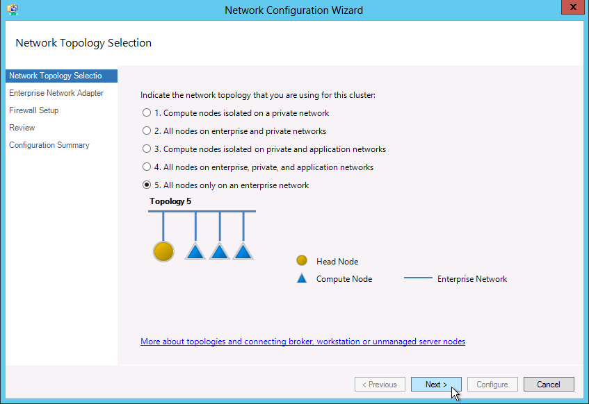
 
1. Click **Next** on the Enterprise Network Adapter tab to accept the default configuration.

1. Select **Do not manage firewall settings** on the Firewall Setup tab and click **Next**.

   
   
1. Click **Configure** on the Review tab to begin the configuration process.

1. Click **Finish** to end the configuration process.

1. Click on **Provide installation credentials** in the Required deployment tasks section of the Cluster Manager window.

   
   
1. Enter the username and password of the domain user and click **OK**.  You will need to enter the fully qualified user name as shown in the example image.

   
   
1. Click on **Configure the naming of new nodes** in the Required deployment tasks section of the Cluster Manager window.

   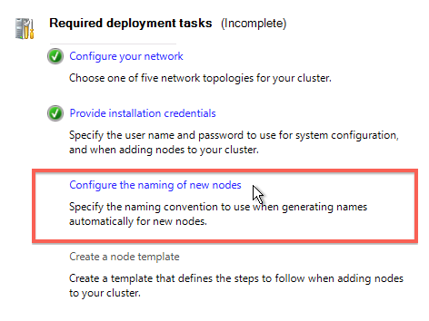
   
1. Click **OK** To accept the default naming series.

   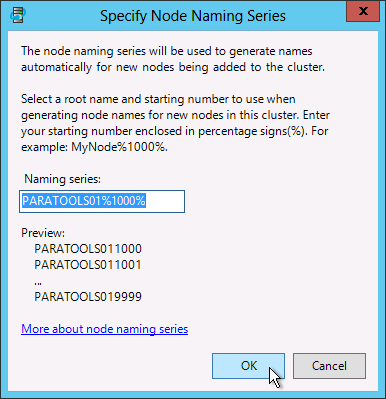
   
1. Click on **Create a node template** in the Required deployment tasks section of the Cluster Manager window.

   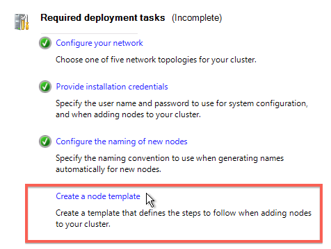
   
1. Select **Windows Azure node template** and click **Next**.

   
   
1. Click **Next** to accept the default template name.

1. On the Subscription Information tab, copy your subscription ID and the management certificate fingerprint into their respective boxes and click **Next**.  You can find this information on the **Setting** tab of the Windows Azure Management Portal.  Be careful to copy the subscription ID and certificate fingerprint in full!  You may need to resize the columns in the management portal to see the whole field.

   
   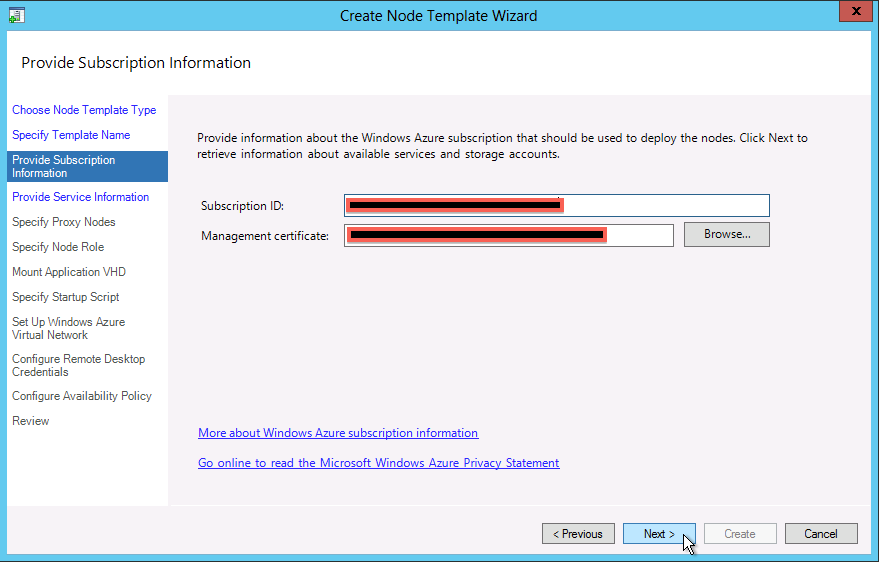
   
1. In the Service name drop-down box, select the cloud service we created earlier.  Similarly, select the storage service we created earlier in the Storage account name drop-down.  Click **Next**.

   
   
1. Click **Next** to accept the default settings on every tab until you come to the Review tab.

1. Click **Create** to create the node template.

## Summary ##

**Congratulations!** You have successfully installed Microsoft HPC Pack on a Windows Azure Virtual Machine and are ready to deploy computing clusters on Windows Azure.