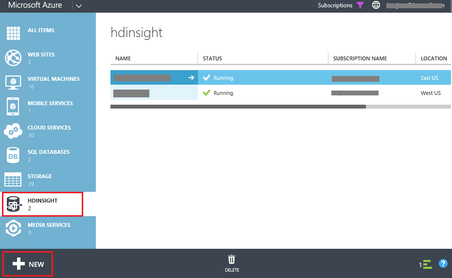

<a name="HOLTitle"></a>
# Getting started with Windows Azure HDInsight Service #


HDInsight Service makes [Apache Hadoop](http://hadoop.apache.org/) available as a service in the cloud. It makes the MapReduce software framework available in a simpler, more scalable, and cost efficient Windows Azure environment. HDInsight also provides a cost efficient approach to the managing and storing of data. HDInsight Service uses Windows Azure Blob Storage as the default file system.

In this tutorial, you will provision an HDInsight cluster using the Windows Azure Management Portal, run a Hadoop MapReduce job using PowerShell, and then import the MapReduce job output data into Excel for examination.

<a name="Prerequisites"></a>
### Prerequisites ###

Before you begin this hands on lab, you must have the following:
- A Windows Azure subscription - [sign up for a free trial](http://aka.ms/WATK-FreeTrial)
- A computer that is running Windows 8, Windows 7, Windows Server 2012, or Windows Server 2008 R2.
- Office 2013 Professional Plus, Office 365 Pro Plus, Excel 2013 Standalone, or Office 2010 Professional Plus.

---
<a name="Exercises"></a>
## Exercises ##

This hands-on lab includes the following exercises:

1. [Set up local environment for running PowerShell](#Exercise1)
1. [Provision an HDInsight cluster](#Exercise2)
1. [Run a WordCount MapReduce program](#Exercise3)
1. [Connect to Microsoft business intelligence tools](#Exercise4)


Estimated time to complete this lab: **30** minutes.

<a name="#Exercise1"></a>
### Excercise 1: Set up local environment for running PowerShell ###

In this exercise, you will use PowerShell Tools for Windows Azure HDInsight to run a MapReduce job. It requires the following configuration steps:

1. install the Windows Azure module for Windows PowerShell
1. install PowerShell Tools for Windows Azure HDInsight
1. configure connectivity to your Windows Azure account

For more information, see [Install and Configure PowerShell for HDInsight](http://www.windowsazure.com/en-us/manage/services/hdinsight/install-and-configure-powershell-for-hdinsight/).

####To install Windows Azure PowerShell####

1. Open Internet Explorer, and browse to the [Windows Azure Downloads](http://www.windowsazure.com/en-us/manage/downloads/) page.
1. Under Windows downloads in the Command line tools section, click Windows Azure PowerShell, and then follow the instructions.

####To install and import the PowerShell Tools for Windows Azure HDInsight####
1. Open Internet Explorer, and then browse to [Microsoft .NET SDK for Hadoop](http://go.microsoft.com/fwlink/?linkid=325563&clcid=0x409) to download the package.
1. Click Run from the bottom of the page to run the installation package.
1. Open Windows Azure PowerShell. For instructions of opening a Windows Azure PowerShell console window, see Install and Configure PowerShell for HDInsight.

Your Windows Azure subscription information is used by the cmdlets to connect to your account. This information can be obtained from Windows Azure in a publishsettings file. The publishsettings file can then be imported as a persistent local config setting that the command-line interface will use for subsequent operations. You only need to import your publishsettings once.

>Notes: The publishsettings file contains sensitive information. It is recommended that you delete the file or take additional steps to encrypt the user folder that contains the file. On Windows, modify the folder properties or use BitLocker.
 
####To download and import publishsettings####
1. Sign in to the [Windows Azure Management Portal](https://manage.windowsazure.com/) using the credentials for your Windows Azure account.

1. Open Windows Azure PowerShell. For instructions of opening Windows Azure PowerShell console window, see [Install and Configure PowerShell for HDInsight](http://www.windowsazure.com/en-us/manage/services/hdinsight/install-and-configure-powershell-for-hdinsight/).

1. Run the following command to download the publishsettings file.

	````PowerShell
		Get-AzurePublishSettingsFile
	````

	The command opens an Internet Explorer window and a web page. The URL is *https://manage.Windowsazure.com/publishsettings/index?client=powershell*.

1. When prompted, download and save the publishing profile and note the path and name of the .publishsettings file. This information is required when you run the Import-AzurePublishSettingsFile cmdlet to import the settings. The default location and file name format is:
	````
	C:\Users\<UserProfile>\Desktop\[MySubscription-…]-downloadDate-credentials.publishsettings
	````
1. From the Windows Azure PowerShell window, run the following command to import the publishsettings file:

	````PowerShell
		Import-AzurePublishSettingsFile <PublishSettings-file>
	````

	For example:

	````PowerShell
		Import-AzurePublishSettingFile "C:\Users\JohnDole\Desktop\Azure-8-30-2013-credentials.publishsettings"
	````


1. Once the file is imported, you can use the following command to list your subscriptions:

	````PowerShell
	Get-AzureSubscription
	````

1. When you have multiple subscriptions, you can use the following command to make a subscription the current subscription:

	````PowerShell
	Select-AzureSubscription -SubscriptionName <SubscriptionName>
	````

<a name="#Exercise2"></a>
### Excercise 2: Provision an HDInsight cluster ###

The HDInsight provision process requires a Windows Azure Storage account to be used as the default file system. The storage account must be located in the same data center as the HDInsight Service compute resources. Currently, you can only provision HDInsight clusters in the following data centers:

- US East
- US West
- Europe North

You must choose one of the two data centers for your Windows Azure Storage account.

#### To create a Windows Azure Storage account ####
1. Sign in to the Windows Azure Management Portal.
1. Click **NEW** on the lower left corner, point to **DATA SERVICES**, point to **STORAGE**, and then click **QUICK CREATE**.

	

	_Create Storage Account_

1. Enter **URL** and **LOCATION/AFFINITY** GROUP, and then click **CREATE STORAGE ACCOUNT**. You will see the new storage account in the storage list.

1. Wait until the **STATUS** of the new storage account is changed to **Online**.
1. Click the new storage account from the list to select it.
1. Click **MANAGE ACCESS KEYS** from the bottom of the page.
1. Make a note of the **STORAGE ACCOUNT NAME** and the **PRIMARY ACCESS KEY**. You will need them later in the tutorial.

For the detailed instructions, see [How to Create a Storage Account](http://www.windowsazure.com/en-us/manage/services/storage/how-to-create-a-storage-account/) and [Using Windows Azure Blob Storage with HDInsight](http://www.windowsazure.com/en-us/manage/services/hdinsight/howto-blob-store/).

#### To provision an HDInsight cluster ####
1. Sign in to the Windows Azure Management Portal.

1. Click **HDInsight** on the left to list the status of the clusters in your account. In the following screenshot, there is no existing HDInsight cluster.

	

	_Create HDInsight_

1. Click **NEW** on the lower left side, click Data Services, click **HDInsight**, and then click **Quick Create**.

	

	_Quick Create HDInsight_

1. Enter or select the following values:
	- **Cluster Name:** Name of the cluster 
	- **Cluster Size:** Number of data nodes you want to deploy. The default value is 4. But 8, 16 and 32 data node clusters are also available on the dropdown menu. Any number of data nodes may be specified when using theCustom Createoption. Pricing details on the billing rates for various cluster sizes are available. Click the?symbol just above the dropdown box and follow the link on the pop up. 
	- **Password (cluster admin):** The password for the accountadmin. The cluster user name is specified to be "admin" by default when using the Quick Create option. This can only be changed by using the **Custom Create** wizard. The password field must be at least 10 characters and must contain an uppercase letter, a lowercase letter, a number, and a special character. 
	- **Storage Account:** Select the storage account you created from the dropdown box. Once as Storage account is chosen, it cannot be changed. If the storage account is removed, the cluster will no longer be available for use. The HDInsight cluster location will be the same as the storage account. 

1. Click **Create HDInsight Cluster** on the lower right. The cluster is now provisioned and when it will be available when its status is listed as Running.


For information on using the **CUSTOM CREATE** option, see [Provision HDInsight Clusters](http://www.windowsazure.com/en-us/manage/services/hdinsight/provision-hdinsight-clusters/).

<a name="#Exercise3"></a>
### Excercise 3: Run a WordCount MapReduce job ###

Now you have an HDInsight cluster provisioned. The next step is to run a MapReduce job to count words in an input file. The following diagram illustrates how MapReduce works for the word count scenario:


	
_Word Count Diagram_


The output is a set of key-value pairs. The key is a string that specifies a word and the value is an integer that specifies the total number of occurrences of that word in the text. This is done in two stages. The mapper takes each line from the input text as an input and breaks it into words. It emits a key/value pair each time a work occurs of the word followed by a 1. The reducer then sums these individual counts for each word and emits a single key/value pair containing the word followed by the sum of its occurrences.

Running a MapReduce job requires the following elements:
- A MapReduce program. In this tutorial, you will use the WordCount sample that comes with the HDInsight cluster distribution so you don't need to write your own. It is located on */example/jars/hadoop-examples.jar*. For instructions on writing your own MapReduce job, see [Using MapReduce with HDInsight](http://www.windowsazure.com/en-us/manage/services/hdinsight/using-mapreduce-with-hdinsight/).
- An input file. You will use */example/data/gutenberg/davinci.txt* as the input file. For information on upload files, see [How to Upload Data to HDInsight](http://www.windowsazure.com/en-us/manage/services/hdinsight/howto-upload-data-to-hdinsight/).
- An output file folder. You will use */example/data/WordCountOutput* as the output file folder. The system will create the folder if it doesn't exist.

The URI scheme for accessing files in Blob storage is:

````
WASB[S]://<containername>@<storageaccountname>.blob.core.windows.net/<path>
````

The URI scheme provides both unencrypted access with the WASB: prefix, and SSL encrypted access with WASBS. We recommend using WASBS wherever possible, even when accessing data that lives inside the same Windows Azure data center.

Because HDInsight uses a Blob Storage container as the default file system, you can refer to files and directories inside the default file system using relative or absolute paths.

For example, to access the hadoop-examples.jar, you can use one of the following options:

````
wasb://<conaintername>@<storageaccountname>.blob.core.windows.net/example/jars/hadoop-examples.jar
wasb:///example/jars/hadoop-examples.jar
/example/jars/hadoop-examples.jar
````

The use of the wasb:// prefix in the paths of these files. This is needed to indicate Azure Blob Storage is being used for input and output files. The output directory assumes a default path relative to the wasb:///user/<username> folder.

For more information, see [Using Windows Azure Blob Storage with HDInsight](http://www.windowsazure.com/en-us/manage/services/hdinsight/howto-blob-store/).

#### To run the WordCount sample ####
1. Open **Windows Azure PowerShell**. For instructions of opening Windows Azure PowerShell console window, see [Install and Configure PowerShell for HDInsight](http://www.windowsazure.com/en-us/manage/services/hdinsight/install-and-configure-powershell-for-hdinsight/).

1. Run the following commands to set the variables.

	````PowerShell
	$subscriptionName = "<SubscriptionName>" 
	$clusterName = "<HDInsightClusterName>"
	````

1. Run the following commands to create a MapReduce job definition:

	````PowerShell
	$wordCountJobDefinition = New-AzureHDInsightMapReduceJobDefinition -JarFile "wasb:///example/jars/hadoop-examples.jar" -ClassName "wordcount" -Arguments "wasb:///example/data/gutenberg/davinci.txt", "wasb:///example/data/WordCountOutput"
	````

	The hadoop-examples.jar file comes with the HDInsight cluster distribution. There are two arguments for the MapReduce job. The first one is the source file name, and the second is the output file path. The source file comes with the HDInsight cluster distribution, and the output file path will be created at the run-time.

1. Run the following command to submit the MapReduce job:
	
	````PowerShell
	$wordCountJob = Start-AzureHDInsightJob -Cluster $clusterName  -Subscription $subscriptionName -JobDefinition $wordCountJobDefinition
	````
	In addition to the MapReduce job definition, you also provide the HDInsight cluster name where you want to run the MapReduce job.

1. Run the following command to check the completion of the MapReduce job:
	````PowerShell
	Wait-AzureHDInsightJob -Subscription $subscriptionName -Job $wordCountJob -WaitTimeoutInSeconds 3600
	````

1. Run the following command to check any errors with running the MapReduce job:

	````PowerShell
	Get-AzureHDInsightJobOutput -Cluster $clusterName -Subscription $subscriptionName -JobId $wordCountJob.JobId -StandardError
	````

	The following screenshot shows the output of a successful run. Otherwise, you will see some error messages.

	
	
	_Run MapReduce Job_


#### To retrieve the results of the MapReduce job ####
1. Open **Windows Azure PowerShell**.

1. Set the three variables in the following commands, and then run them:

	````PowerShell
	$subscriptionName = "<SubscriptionName>"       
	$storageAccountName = "<StorageAccountName>"   
	$containerName = "<ContainerName>"
	````
	The Windows Azure Storage account is the one you created earlier in the tutorial. The storage account is used to host the Blob container that is used as the default HDInsight cluster file system. The Blob storage container name usually share the same name as the HDInsight cluster unless you specify a different name when you provision the cluster.

1. Run the following commands to create a Windows Azure storage context object:

	````PowerShell
	Select-AzureSubscription $subscriptionName
	$storageAccountKey = Get-AzureStorageKey $storageAccountName | %{ $_.Primary }
	$storageContext = New-AzureStorageContext –StorageAccountName $storageAccountName –StorageAccountKey $storageAccountKey
	````
	The *Select-AzureSubscription* is used to set the current subscription in case you have multiple subscriptions, and the default subscription is not the one to use.

1. Run the following command to download the MapReduce job output from the Blob container to the workstation:

	````PowerShell
		Get-AzureStorageBlobContent -Container $ContainerName -Blob example/data/WordCountOutput/part-r-00000 -Context $storageContext -Force
	````
The *example/data/WordCountOutput* folder is the output folder specified when you run the MapReduce job. *part-r-00000* is the default file name for MapReduce job output. The file will be download to the same folder structure on the local folder. For example, in the following screenshot, the current folder is the C root folder. The file will be downloaded to the *C:\example\data\WordCountOutput* folder.

1. Run the following command to print the MapReduce job output file:

	````PowerShell
	cat ./example/data/WordCountOutput/part-r-00000 | findstr "there"
	````
	
	
	
	_MapReduce Job Output_

	The MapReduce job produces a file named part-r-00000 with the words and the counts. The script uses the findstr command to list all of the words that contains "there".


	>Note: If you open *./example/data/WordCountOutput/part-r-00000*, a multi-line output from a MapReduce job, in Notepad, you will notice the line breaks are not renter correctly. This is expected.

<a name="#Exercise4"></a>
### Excercise 4: Connecting to Microsoft business intelligence tools ###

The Power Query add-in for Excel can be used to export output from HDInsight into Excel where Microsoft Business Intelligence (BI) tools can be used to further process or display the results. When you created an HDInsight cluster, a default container with the same name as the cluster was created in the storage account associated with it when it was created. This is automatically populated with a set of files. One of these files is a sample Hive table. In this section we will show how to import the data contained in this table into Excel for viewing and additional processing.

The Power Query add-in for Excel can be used to export output from HDInsight into Excel where Microsoft Business Intelligence (BI) tools can be used to further process or display the results. You must have Excel 2010 or 2013 installed to complete this part of the tutorial. Here we will import the default Hive table that ships in HDInsight.

#### To download Microsoft PowerQuery for Excel ###
- Download the Microsoft Power Query for Excel from the Microsoft Download Center and install it.

#### To import HDInsight data ####
1. Open Excel, and create a new blank workbook.
1. Click the **Power Query** menu, click **From Other Sources**, and then click **From Windows Azure HDInsight**.

	
	
	_PowerQuery ImportData_


1. Enter the **Account Name** of the Azure Blob Storage Account associated with your cluster, and then click **OK**. This is the storage account you created earlier in the tutorial.

1. Enter the **Account Key** for the Azure Blob Storage Account, and then click **Save**.
1. In the Navigator pane, click the Blob storage container name. By default the container name is the same name as the cluster name.

1. Locate **part-r-00000** in the Name column, and then click **Binary**.

	
	
	_PowerQuery ImportData_

1. Right-click **Column1**, point to **Split Column**, and then click **By Delimiter**.

1. Select **Tab** in **Select or enter delimiter**, and **At the right-most delimiter**, and then click **OK**.

	
	
	_PowerQuery ImportData_

1. Right-click **Column1.1**, and then select **Rename**.

1. Change the name to **Word**.
1. Repeat the process to rename **Column1.2** to **Count**.
1. Click **Done** on the bottom right corner. The query then imports the Hive Table into Excel.

---

<a name="summary"></a>
## Summary ##

By completing this hands-on lab you learned the following:

- [Set up local environment for running PowerShell](#Exercise1)
- [Provision an HDInsight cluster](#Exercise2)
- [Run a WordCount MapReduce program](#Exercise3)
- [Connect to Microsoft business intelligence tools](#Exercise4)


© 2013 Microsoft Corporation. All rights reserved.
Except where otherwise [noted](http://creativecommons.org/policies#license), content on this site is licensed under a [Creative Commons Attribution-NonCommercial 3.0 License.](http://creativecommons.org/licenses/by-nc/3.0/)
