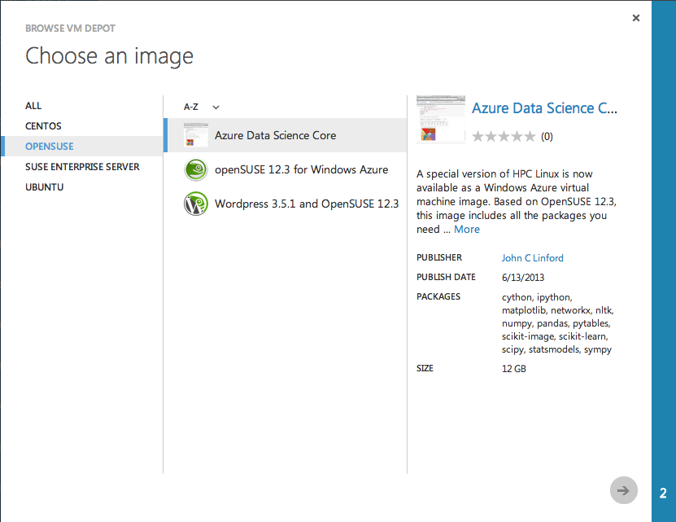
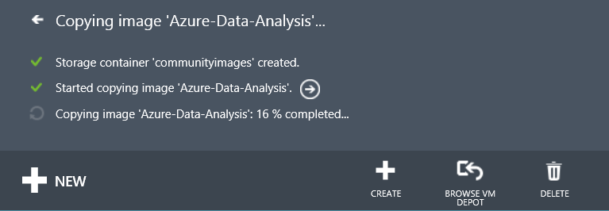
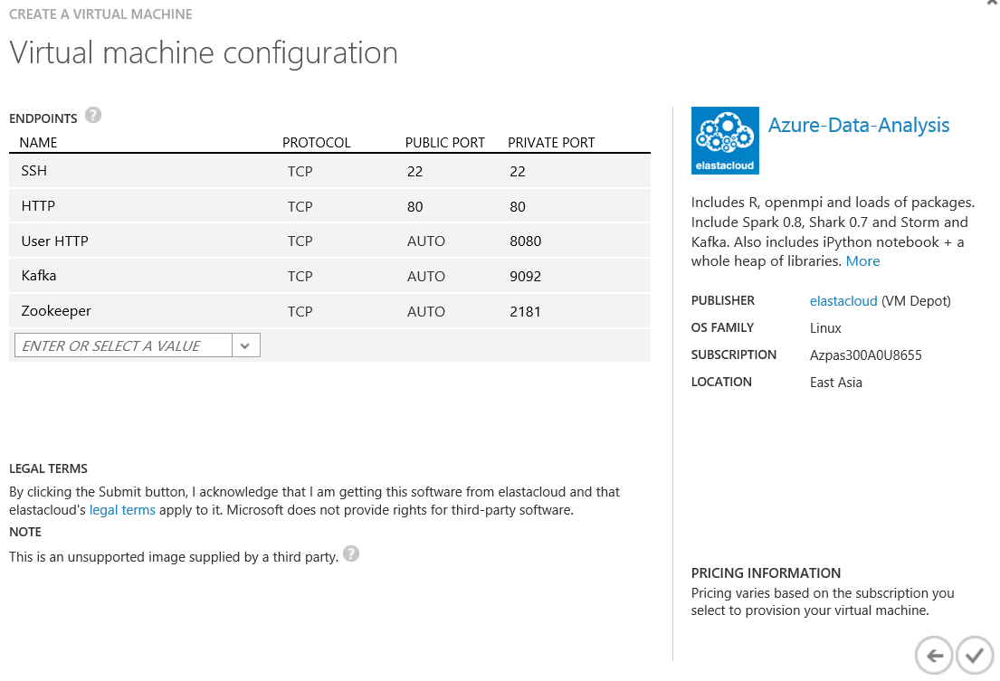
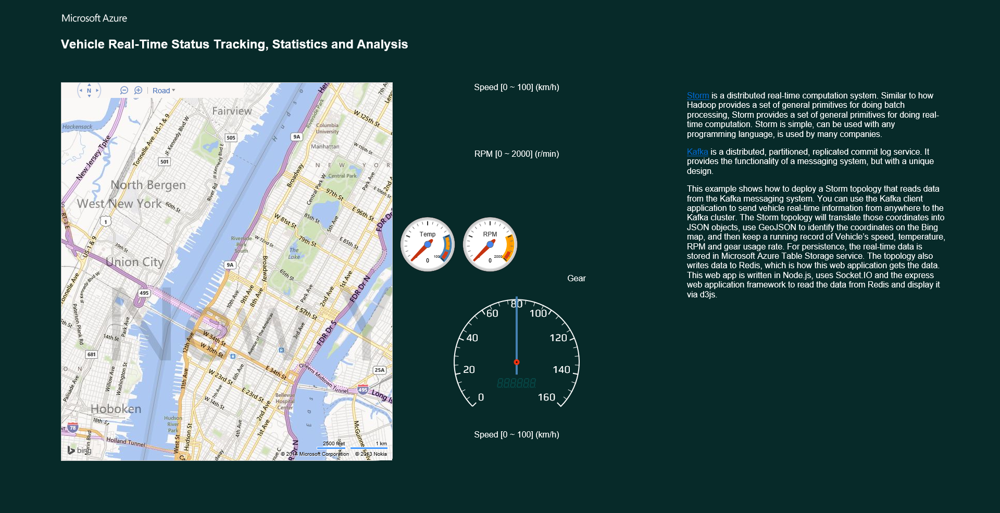
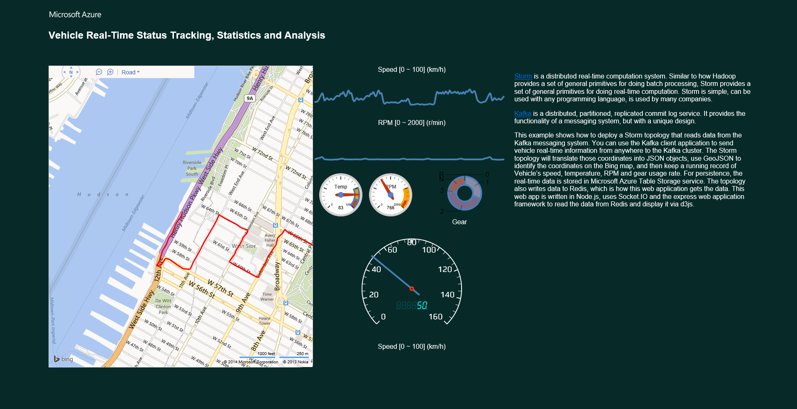

# Processing GPS data with Storm and Kafka on Windows Azure Data Science Core #

In this example, we'll show you how to deploy a [Storm](http://storm-project.net) topology in Windows Azure that reads its data from the [Kafka](http://kafka.apache.org/) messaging system.  We'll use a Kafka client application written in Java to send GPS coordinates from anywhere to the  Kafka cluster.  Our Storm topology will translate those coordinates into JSON objects, use [GeoJSON](http://www.geojson.org/) to identify the country those coordinates belong to, and then keep a running count of how many times that a coordinate lands in a country.  For persistence, the running count is stored in a [Windows Azure Table Storage](http://www.windowsazure.com/en-us/develop/net/how-to-guides/table-services/) service, and the topology periodically dumps a compressed block of coordinates to a [Windows Azure Blob Storage](http://www.windowsazure.com/en-us/develop/net/how-to-guides/blob-storage/) service.  The topology also writes data to [Redis](http://redis.io/) for use by other services, such as the web application we use to display the data in real time.  The web app is written in [Node.js](http://nodejs.org/) and uses [Socket.IO](http://socket.io/) and the [express](http://expressjs.com/) web application framework to read the data from Redis and display it via [D3.js](http://d3js.org/).  

## Use Azure Management Portal to Create a Windows Azure Data Science Core VM ##

1. Log in to the [Windows Azure Management Portal](https://manage.windowsazure.com).

1. Click on the **Virtual Machines** tab and click on **Images** near the top of the screen.

   

1. Click on **Browse VM Depot** in the bar on the bottom

   

1. Select **OpenSUSE** on the left and then select the **Windows Azure Data Science Core** image.

   

1. Choose the **Image Region** that your storage account is in (i.e. the region you created your affinity group in) from the drop down box, then select your storage account from the drop down box.

   

1. Click the check mark button to continue and wait for the disk image to downloaded from the VM Depot to your storage account.  You can click on **Details** in the status bar to see the transfer progress.

   

1. Once the image has copied you'll need to register it.  Select the image and click **Register** in the bar on the bottom.

   

1. Enter a name for the image, click the checkmark button, and wait for registration to complete.

1. Stay on the Virtual Machines tab and click on **Virtual Machine Instances** near the top of the screen.

1. Click on **New** in the bottom bar and select **From Gallery**.

1. Select **My Images** on the left and then select the Windows Azure Data Science Core image you just registered.  Go to the next page.

1. Enter the virtual machine name, select the **Large** machine size from the drop down list, enter a new user name, check the **Provide a Password** box and ender the new user password.  Go to the next page.

   

1. Enter a name for the new cloud service configuration and select your affinity group from the drop down box.  Go to the next page.

   

1. We'll need to add several endpoints for the VM.  To add an endpoint, enter a name for the endpoint like "HTTP" or "Kafka" in the field under **Name** in the Endpoints table.  Add the following TCP endpoints:
   1. HTTP: Port 80
   1. User HTTP: Port 8080
   1. Kafka: Port 9092
   1. Zookeeper: 2181
   Your endpoints should look like this:
   
   

1. Click the checkmark button and wait for the new VM to be created, provisioned, and started.

1. If your local workstation runs Windows then you'll need to install an SSH client like [PuTTY](http://www.chiark.greenend.org.uk/~sgtatham/putty/) to connect to the Azure Data Science Core VM.  If you're using a Mac or Linux client then you already have everything you need.

1. Use your ssh client to connect to the VM.

   

## Install JZMQ ##

Storm uses the [0MQ](http://zeromq.org/) socket library to connect its pieces, so we need to install the latest 0MQ development headers and Java bindings.

1. Install the 0mq development header files:

        sudo zypper refresh
        sudo zypper install zeromq-devel

1. The Java bindings for 0MQ are provided by the [JZMQ](https://github.com/zeromq/jzmq) package.  Clone the JZMQ repo from github:

        git clone https://github.com/zeromq/jzmq.git

1. Compile and install JZMQ:
        
        ./autogen.sh 
        ./configure 
        make
        sudo make install

## Install Maven ##

Many projects use the [Maven](http://maven.apache.org/) project management tool for build management, dependency management, and packaging.  Maven projects are described in a **pom.xml** file in the top-level of the project.

1. Download the Maven binaries to the VM:

        cd $HOME
        wget http://www.fightrice.com/mirrors/apache/maven/maven-3/3.1.0/binaries/apache-maven-3.1.0-bin.tar.gz
       
1. Unpack the binaries:

        tar xzf apache-maven-3.1.0-bin.tar.gz 

1. Add Maven's bin directory to your path.  The per-user environment settings are defined in a file in your home directory named **.bashrc**.  You can either open that file in an editor and update the PATH environment variable, or execute the command below:

        echo 'export PATH=$HOME/apache-mave-3.1.0/bin:$PATH' >> ~/.bashrc
        source ~/.bashrc

1. Run a test Maven command to confirm installation:

        mvn --version

## Install Leiningen ##

Some community provided extensions to Storm and Kafka are written in [Clojure](http://clojure.org/), a dynamic programming language that targets the Java Virtual Machine.  Clojure projects are managed via [Leiningen](http://leiningen.org/), which is a software management tool very similar to Maven.  Installing Leiningen is very easy because it's distributed as a single, simple script file.

1. Download the **lein** script to your bin directory and make it executable:

        cd $HOME/bin
        wget https://raw.github.com/technomancy/leiningen/stable/bin/lein
        chmod +x lein

## Install Kafka ##

Our example uses the Kafka messaging system to accept messages from clients and queue them until they can be processed.  Kafka can achieve very high message throughput and is designed to scale up as needed, so it's a great fit for the cloud.

1. Download Kafka 0.7.2 from the Apache website.  You may be tempted to download the latest beta release (0.8.0 at this time), but don't do it!  Storm will not be able to read messages from that version of Kafka.  

        cd $HOME
        wget http://www.motorlogy.com/apache/incubator/kafka/kafka-0.7.2-incubating/kafka-0.7.2-incubating-src.tgz
       
1. Unpack, build, and package Kafka:

        tar xzf kafka-0.7.2-incubating-src.tgz
        cd kafka-0.7.2-incubating-src
        ./sbt update
        ./sbt package
      
1. Add the Kafka bin directory to your path.  Again, you can edit $HOME/.bashrc manually or execute the commands below:

        cd $HOME
        echo 'export PATH=$HOME/kafka-0.7.2-incubating-src/bin:$PATH' >> ~/.bashrc
        source ~/.bashrc

## Download and Build the Example Code ##

1. Clone the example repository:

        cd $HOME
        git clone https://github.com/jlinford/storm-kafka-gps-example.git
        
1. Use Leiningen to build the Storm uberjar.  This produces a single, stand-alone file that can be submitted to a Storm cluster or launched as a locally-hosted server.

        cd storm-kafka-gps-example
        lein uberjar

1. Use Leiningen to build the Kafka client:

        cd kafka-gps-client
        lein uberjar

1. Use Node.js to build the web application:

        cd ../node
        npm install
        
The example is built and all necessary dependencies have been installed.  Now  we just need to run the example code.

      
## Launch Server Processes ##

There are several server processes that need to be started before we can launch the example.  You can either follow the instructions below to launch all the servers from one console, or open several, separate console windows, connect to the VM in each window, and launch one server process per console.  It's much easier to debug connectivity problems if you run each server in its own window.  It is important to start the servers in the order shown below.

1. **Zookeeper**: Both Kafka and Storm use [Zookeeper](http://zookeeper.apache.org/) to track and manage server instances in their respective clusters.  Zookeeper is also the endpoint for clients.  Programs wishing to publish Kafka messages connect to the Zookeeper server to be forwarded to the least heavily loaded Kafka server.

        zookeeper-server-start.sh ~/kafka-0.7.2-incubating-src/config/zookeeper.properties > ~/zookeeper-server.log 2>&1 &
    
    This command starts the zookeeper server on **port 2181** as a background process and records all its output in the **zookeeper-server.log** file in your home directory.  If you want to see what the server is doing, you can use the **tail** command:
    
        tail -f ~/zookeeper-server.log
    
    Press **Ctrl+C** to close tail.

1. **Kafka**: Once Zookeeper has stated, start the Kafka server:

        kafka-server-start.sh ~/kafka-0.7.2-incubating-src/config/server.properties > ~/kafka-server.log 2>&1 &
       
    This command starts a single Kafka broker server on **port 9092** as a background process and records all its output in the **kafka-server.log** file in your home directory.  If you want to see what the server is doing, you can use the **tail** command:
    
        tail -f ~/kafka-server.log
    
    Press **Ctrl+C** to close tail.

1. **Redis**: The Redis server provides a simple key-value store that works especially well with web applications written in Node.js.  Start the redis server:

        /usr/sbin/redis-server > ~/redis-server.log 2>&1 &
        
1. To make this easier, we've included a convenience script, **launch_server_processes.sh** in storm-kafka-gps-example that will launch the server processes for you.

## Launch the Example ##

Our example consists of three parts: a web application that presents GPS coordinate data, a Storm topology that processes the data, and a Kafka client application that produces the coordinates.  We will start each part of the example in turn.

1. Start the web application.  The application is served on **port 80** by default so we need to launch it as root.

        cd $HOME/storm-kafka-gps-example/node
        sudo node app.js
        
   You should see output like this:
   
          info  - socket.io started
        Listening on port 80

1. Open your web browser and go to the cloud service DNS name you specified when you created the VM.  You should see the web app:
   
   
   
   Nothing interesting is happening because we have not yet started the data stream.  Leave this browser window open so you can see the effects of the following commands.

1. Open a second SSH connection to the VM (open PuTTY on Windows or a new terminal on Linux or OS X) and launch the Storm topology:

        cd $HOME/storm-kafka-gps-example
        java -cp $(lein classpath) storm.example.KafkaGpsTopology
        
   You should see a lot of output as the topology starts.  Once it's up and running the output will look like:
   
     4105 [Thread-25] INFO  storm.kafka.PartitionManager  - Starting Kafka 127.0.0.1:0 from offset 2185373
    4106 [Thread-25] INFO  backtype.storm.daemon.executor  - Opened spout spout:(6)
    4109 [Thread-25] INFO  backtype.storm.daemon.executor  - Activating spout spout:(6)
    4224 [Thread-25] INFO  storm.kafka.PartitionManager  - Committing offset for 127.0.0.1:9092:0
    4224 [Thread-25] INFO  storm.kafka.PartitionManager  - Comitted offset for 127.0.0.1:9092:0
    6241 [Thread-25] INFO  storm.kafka.PartitionManager  - Committing offset for 127.0.0.1:9092:0
    6242 [Thread-25] INFO  storm.kafka.PartitionManager  - Comitted offset for 127.0.0.1:9092:0
        
   You won't see any change your browser because although the topology has been started there is no data being sent to Kafka for the Storm topology to process.

1. Open a third SSH connection to the VM and start the Kafka client:

        cd $HOME/storm-kafka-gps-example/kafka-gps-client
        java -cp $(lein classpath) kafka.example.KafkaGpsDataProducer localhost

   The client generates random GPS coordinates and sends them to Kafka.  Go back to your web browser and you'll see GPS coordinates being plotted on the globe.  Countries will change color according to the frequency of "hits".
   
   
   
   The client publishes data on the "gps" topic.  **localhost** on the command line means we are connecting to Zookeeper on localhost to get connected to the Kafka server.  You can specify the connection string as any of:
   
   - zookeeper_host
   - zookeeper_host:port
   - broker_id:kafka_host:kafka_port

1. You can run this Kafka client from any machine with Java.  To run from your local workstation, download the client JAR file from the web application page and run it as follows:

        java -cp kafka-gps-client-0.0.1-SNAPSHOT-standalo.jar kafka.example.KafkaGpsDataProducer 0:ds-jlinford.cloudapp.net:9092

   In this case we've bypassed Zookeeper and connected directly to the Kafka server on port 9092.  The **0:** at the start of the connection address indicates that we wish to connect to the Kafka broker with ID 0.