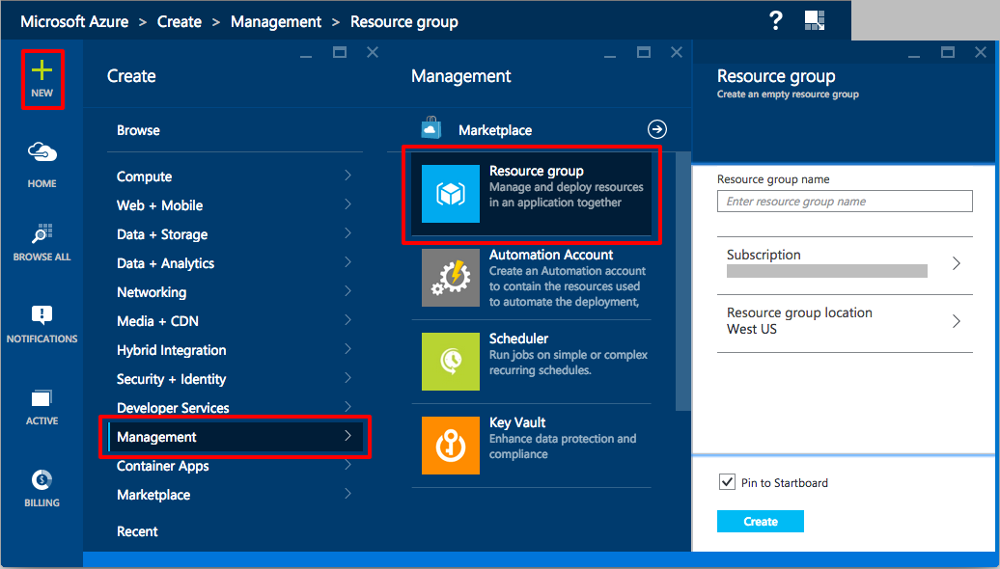

# Style Guide #
For all courses and hands on labs in the Azure for Researcher project this document serves as the style guide
to ensure consistency with multiple authors. As we go through this process, we'll keep updating this document
to reflect the consensus of all people on the project.

## Hands On Labs General Thoughts ##
- **Do** include background and supplemental information in the labs. The labs are open source
and will be used by people that have not attended live training. You don't need to include many paragraphs
but quick explanations and a link to the documentation. For example, if a HOL has you creating a resource group,
you could explain them like the following:

> This exercise will create the resource group you will use to store all of your virtual machines created in this lab. resource groups are a great feature of Microsoft Azure that allow you to group logical resources such as virtual machines, networks, databases, and any other Azure resource together as a logical group which serves as the lifecycle boundary for every resource contained within it.

> With this grouping you can apply security rights to users with Role Based Access Control (RBAC). This allows you to have multiple people using a single Azure account but preventing different groups using the account from interfering with one another's deployments. For advanced usage, you can script resource group creation and management to automate deployments.

> All resources in Azure have to be contained in a resource group. While you can create them on the fly, best practices say to create the group first so you are prepared. One of the best features of resource groups is that when you are finished with the resources in the resource group, you can delete it you delete all the resources in it at once. This makes experimentation and trials much easier to manage. For more information about resource groups, go [here](https://azure.microsoft.com/en-us/documentation/articles/resource-group-overview/)

## Images ##
- All images captured of the portal will not include the browser frame, only the middle HTML of the portal.
- For highlighting and calling out, use a rounded rectangle with a four pixel boarder of RGB(255,0,0)
- If step numbers are included, they will be placed below the square rectangle in Calibri, 12 point, RGB(255,0,0)
- All identifying information such as subscription name, logged in user, etc, will be blocked with a square filled with RGB (128,128,128)
- Avoid arrows at all possible.

Below is an example image that shows the highlight rectangles and hiding the logged in user and subscription.

